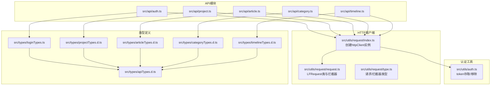
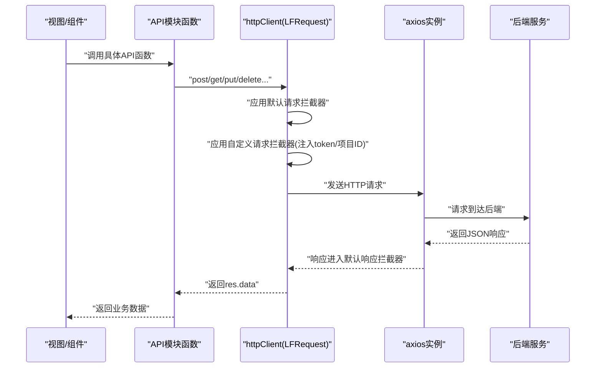
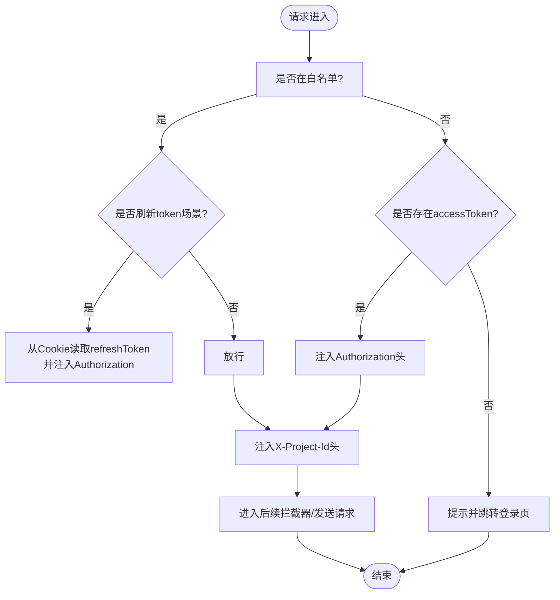
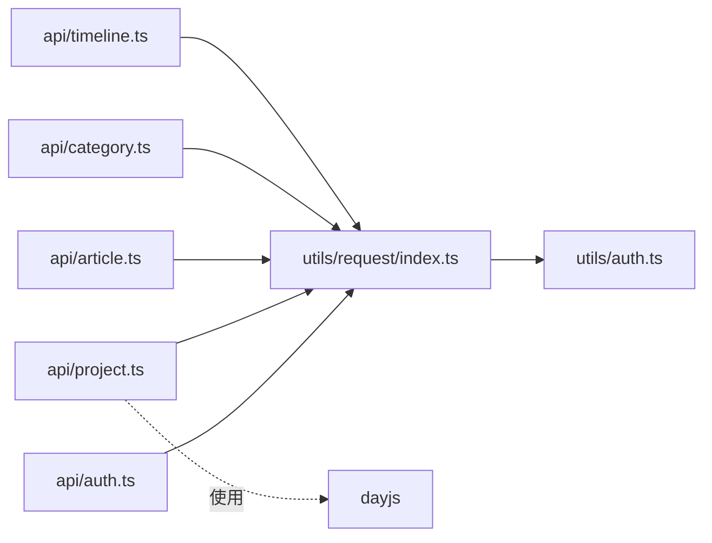

# API接口集成

<cite>
**本文引用的文件**
- [src/utils/request/index.ts](file://src/utils/request/index.ts)
- [src/utils/request/request.ts](file://src/utils/request/request.ts)
- [src/utils/request/type.ts](file://src/utils/request/type.ts)
- [src/utils/auth.ts](file://src/utils/auth.ts)
- [src/api/auth.ts](file://src/api/auth.ts)
- [src/api/project.ts](file://src/api/project.ts)
- [src/api/article.ts](file://src/api/article.ts)
- [src/api/category.ts](file://src/api/category.ts)
- [src/api/timeline.ts](file://src/api/timeline.ts)
- [src/types/apiTypes.d.ts](file://src/types/apiTypes.d.ts)
- [src/types/loginTypes.ts](file://src/types/loginTypes.ts)
- [src/types/projectTypes.d.ts](file://src/types/projectTypes.d.ts)
- [src/types/articleTypes.d.ts](file://src/types/articleTypes.d.ts)
- [src/types/categoryTypes.d.ts](file://src/types/categoryTypes.d.ts)
- [src/types/timelineTypes.d.ts](file://src/types/timelineTypes.d.ts)
- [.env.development](file://.env.development)
- [.env.production](file://.env.production)
- [vite.config.ts](file://vite.config.ts)
</cite>

## 目录
1. [简介](#简介)
2. [项目结构](#项目结构)
3. [核心组件](#核心组件)
4. [架构总览](#架构总览)
5. [详细组件分析](#详细组件分析)
6. [依赖关系分析](#依赖关系分析)
7. [性能与可维护性](#性能与可维护性)
8. [故障排查指南](#故障排查指南)
9. [结论](#结论)
10. [附录：API调用示例与测试方法](#附录api调用示例与测试方法)

## 简介
本文件面向LiFocus Web V2的前端开发者与集成工程师，系统化梳理API层的架构设计与实现细节，覆盖以下主题：
- HTTP客户端封装与配置：axios实例创建、拦截器链路与请求上下文注入
- API模块划分：auth、project、article、category、timeline的接口定义与职责边界
- 请求/响应处理机制：参数校验、错误处理、统一响应格式化
- TypeScript类型体系：通用响应类型与各模块请求/响应类型
- 认证与授权：token自动注入、刷新流程与会话管理
- 跨域与CORS：开发与生产环境配置要点
- 测试与调试：调用示例、错误处理策略与常见问题定位

## 项目结构
API相关代码主要分布在如下位置：
- HTTP客户端与拦截器：src/utils/request
- 认证工具：src/utils/auth
- 各业务API模块：src/api
- 类型定义：src/types

图表来源
- [src/utils/request/index.ts](file://src/utils/request/index.ts#L1-L40)
- [src/utils/request/request.ts](file://src/utils/request/request.ts#L1-L99)
- [src/utils/request/type.ts](file://src/utils/request/type.ts#L1-L15)
- [src/utils/auth.ts](file://src/utils/auth.ts#L1-L71)
- [src/api/auth.ts](file://src/api/auth.ts#L1-L41)
- [src/api/project.ts](file://src/api/project.ts#L1-L38)
- [src/api/article.ts](file://src/api/article.ts#L1-L60)
- [src/api/category.ts](file://src/api/category.ts#L1-L50)
- [src/api/timeline.ts](file://src/api/timeline.ts#L1-L44)
- [src/types/apiTypes.d.ts](file://src/types/apiTypes.d.ts#L1-L7)
- [src/types/loginTypes.ts](file://src/types/loginTypes.ts#L1-L47)
- [src/types/projectTypes.d.ts](file://src/types/projectTypes.d.ts#L1-L27)
- [src/types/articleTypes.d.ts](file://src/types/articleTypes.d.ts#L1-L62)
- [src/types/categoryTypes.d.ts](file://src/types/categoryTypes.d.ts#L1-L39)
- [src/types/timelineTypes.d.ts](file://src/types/timelineTypes.d.ts#L1-L39)

章节来源
- [src/utils/request/index.ts](file://src/utils/request/index.ts#L1-L40)
- [src/utils/request/request.ts](file://src/utils/request/request.ts#L1-L99)
- [src/utils/request/type.ts](file://src/utils/request/type.ts#L1-L15)
- [src/utils/auth.ts](file://src/utils/auth.ts#L1-L71)
- [src/api/auth.ts](file://src/api/auth.ts#L1-L41)
- [src/api/project.ts](file://src/api/project.ts#L1-L38)
- [src/api/article.ts](file://src/api/article.ts#L1-L60)
- [src/api/category.ts](file://src/api/category.ts#L1-L50)
- [src/api/timeline.ts](file://src/api/timeline.ts#L1-L44)
- [src/types/apiTypes.d.ts](file://src/types/apiTypes.d.ts#L1-L7)
- [src/types/loginTypes.ts](file://src/types/loginTypes.ts#L1-L47)
- [src/types/projectTypes.d.ts](file://src/types/projectTypes.d.ts#L1-L27)
- [src/types/articleTypes.d.ts](file://src/types/articleTypes.d.ts#L1-L62)
- [src/types/categoryTypes.d.ts](file://src/types/categoryTypes.d.ts#L1-L39)
- [src/types/timelineTypes.d.ts](file://src/types/timelineTypes.d.ts#L1-L39)

## 核心组件
- HTTP客户端与拦截器
  - 通过LFRequest类封装axios实例，内置默认请求/响应拦截器，并支持在构造时传入自定义拦截器。
  - 默认响应拦截器统一提取res.data，简化上层调用；默认请求拦截器为空，便于扩展。
  - 自定义拦截器通过index.ts集中注入，负责token注入、项目ID注入、白名单放行与未登录跳转。

- 认证工具
  - 提供setToken/getToken/getRefreshToken/removeToken等方法，支持Cookie与SessionStorage双存储策略，依据“记住我”选项选择过期策略。

- API模块
  - 按领域拆分：auth、project、article、category、timeline，每个模块导出函数式API，统一使用httpClient发起请求。

- 类型系统
  - 统一响应包装IResponseData，各模块参数与返回类型清晰分离，便于IDE提示与编译期检查。

章节来源
- [src/utils/request/request.ts](file://src/utils/request/request.ts#L9-L51)
- [src/utils/request/index.ts](file://src/utils/request/index.ts#L12-L39)
- [src/utils/auth.ts](file://src/utils/auth.ts#L12-L70)
- [src/types/apiTypes.d.ts](file://src/types/apiTypes.d.ts#L2-L6)

## 架构总览
下图展示从视图到API再到HTTP客户端的整体调用链，以及认证与拦截器的关键节点。

图表来源
- [src/api/auth.ts](file://src/api/auth.ts#L7-L12)
- [src/utils/request/index.ts](file://src/utils/request/index.ts#L16-L37)
- [src/utils/request/request.ts](file://src/utils/request/request.ts#L26-L40)

## 详细组件分析

### HTTP客户端与拦截器（LFRequest）
- 设计要点
  - 构造函数中创建axios实例并挂载默认拦截器，随后叠加传入的自定义拦截器。
  - request方法支持单次请求/响应拦截器的局部增强，保证复用与灵活性。
  - 提供get/post/put/delete/patch便捷方法，统一返回Promise<T>。

- 请求拦截器链
  - 白名单放行：对特定URL（如登录/注册）允许无token访问；当为刷新token场景时，从Cookie读取refreshToken写入Authorization头。
  - token注入：非白名单请求自动从Cookie或SessionStorage读取accessToken并注入Authorization头。
  - 项目上下文：从项目工具读取当前项目ID，注入X-Project-Id头。
  - 未登录处理：若无token，弹出消息并跳转至登录页。

- 响应拦截器链
  - 默认：直接返回res.data，简化上层逻辑。
  - 错误处理：针对401强制登出、清理token、提示并跳转；非200时统一reject错误对象或默认字符串。

图表来源
- [src/utils/request/index.ts](file://src/utils/request/index.ts#L16-L37)
- [src/utils/request/request.ts](file://src/utils/request/request.ts#L26-L40)

章节来源
- [src/utils/request/request.ts](file://src/utils/request/request.ts#L9-L99)
- [src/utils/request/type.ts](file://src/utils/request/type.ts#L4-L14)
- [src/utils/request/index.ts](file://src/utils/request/index.ts#L12-L39)

### 认证模块（auth）
- 功能
  - setToken：根据“记住我”选项选择Cookie或SessionStorage持久化存储，并设置过期时间。
  - getToken/getRefreshToken：按存储介质读取当前token与刷新token。
  - removeToken：清理所有token相关键值。

- 与拦截器协作
  - 请求拦截器在非白名单场景读取accessToken并注入Authorization。
  - 响应拦截器在401时调用removeToken并跳转登录页。

章节来源
- [src/utils/auth.ts](file://src/utils/auth.ts#L12-L70)
- [src/utils/request/index.ts](file://src/utils/request/index.ts#L23-L35)
- [src/utils/request/request.ts](file://src/utils/request/request.ts#L31-L35)

### API模块概览
- auth
  - loginApi/registerApi/logoutApi/getCurrentUserApi
- project
  - getRecentProjectListApi/getProjectListApi/createProjectApi
- article
  - getArticleListApi/getArticleByIdApi/createArticleApi/updateArticleApi/deleteArticleApi
- category
  - getCategoryListApi/createCategoryApi/updateCategoryApi/deleteCategoryApi
- timeline
  - getTodayTimelineApi/addTimelineApi/updateTimelineApi

章节来源
- [src/api/auth.ts](file://src/api/auth.ts#L7-L40)
- [src/api/project.ts](file://src/api/project.ts#L5-L37)
- [src/api/article.ts](file://src/api/article.ts#L8-L59)
- [src/api/category.ts](file://src/api/category.ts#L7-L49)
- [src/api/timeline.ts](file://src/api/timeline.ts#L10-L43)

### 类型系统
- 通用响应
  - IApiResponse<T>：统一包含code、message、data字段，确保前后端契约一致。
- 登录/注册
  - ILoginParams、ILoginResult：登录参数与带包装的返回类型
  - IRegisterParams、IRegisterResult、IUserInfo：注册参数与用户信息模型
- 项目
  - IProjectInfo、IAddProjectParams、TProjectResult、TAddProjectResult
- 文章
  - IArticle、IAddArticleParams、IArticleFilter、TArticlePageResponse
- 目录
  - ICategory、ICreateCategoryRequest、ICategoryResponse
- 时间线
  - ITimeline、IAddTimelineParams、TTimelineResult、TAddTimelineResult

章节来源
- [src/types/apiTypes.d.ts](file://src/types/apiTypes.d.ts#L2-L6)
- [src/types/loginTypes.ts](file://src/types/loginTypes.ts#L6-L46)
- [src/types/projectTypes.d.ts](file://src/types/projectTypes.d.ts#L3-L25)
- [src/types/articleTypes.d.ts](file://src/types/articleTypes.d.ts#L9-L61)
- [src/types/categoryTypes.d.ts](file://src/types/categoryTypes.d.ts#L4-L29)
- [src/types/timelineTypes.d.ts](file://src/types/timelineTypes.d.ts#L6-L38)

## 依赖关系分析
- 组件耦合
  - API模块仅依赖httpClient，不直接依赖axios，降低耦合度。
  - 认证工具被请求拦截器依赖，形成横切关注点。
- 外部依赖
  - axios：HTTP客户端
  - js-cookie：Cookie存储
  - dayjs：时间计算（项目模块）

图表来源
- [src/api/auth.ts](file://src/api/auth.ts#L1-L2)
- [src/api/project.ts](file://src/api/project.ts#L1-L2)
- [src/api/article.ts](file://src/api/article.ts#L1-L3)
- [src/api/category.ts](file://src/api/category.ts#L1-L2)
- [src/api/timeline.ts](file://src/api/timeline.ts#L1-L2)
- [src/utils/request/index.ts](file://src/utils/request/index.ts#L1-L6)
- [src/utils/auth.ts](file://src/utils/auth.ts#L1-L1)

章节来源
- [src/api/auth.ts](file://src/api/auth.ts#L1-L2)
- [src/api/project.ts](file://src/api/project.ts#L1-L3)
- [src/api/article.ts](file://src/api/article.ts#L1-L3)
- [src/api/category.ts](file://src/api/category.ts#L1-L2)
- [src/api/timeline.ts](file://src/api/timeline.ts#L1-L2)
- [src/utils/request/index.ts](file://src/utils/request/index.ts#L1-L6)

## 性能与可维护性
- 性能
  - 统一超时时间（默认60秒），避免长时间阻塞。
  - 通过X-Project-Id减少后端筛选成本，提升查询效率。
- 可维护性
  - API函数式封装，便于单元测试与替换。
  - 类型定义集中管理，减少重复与不一致。
  - 拦截器链清晰，职责单一，易于扩展新中间件。

## 故障排查指南
- 401未授权
  - 现象：弹出“登录状态异常，请重新登录”，页面跳转至登录页。
  - 排查：确认本地token是否过期或被清理；检查后端签发的token是否正确。
- 无token请求
  - 现象：请求前被拦截并跳转登录。
  - 排查：确认登录流程已成功写入token；检查“记住我”选项导致的存储介质差异。
- 参数错误/业务错误
  - 现象：Promise被reject，错误对象包含后端返回的message或默认“系统错误”。
  - 排查：查看控制台错误堆栈与后端响应体；核对请求URL、方法与参数类型。
- CORS跨域问题
  - 现象：浏览器控制台出现跨域错误。
  - 排查：确认Vite代理配置或后端CORS头设置；确保Origin、Headers、方法匹配。

章节来源
- [src/utils/request/request.ts](file://src/utils/request/request.ts#L31-L38)
- [src/utils/request/index.ts](file://src/utils/request/index.ts#L32-L35)

## 结论
该API层以LFRequest为核心，结合拦截器与类型系统，实现了高内聚、低耦合的HTTP抽象。通过模块化的API函数与严格的类型约束，提升了开发效率与运行时稳定性。建议在后续迭代中补充：
- 统一的参数校验与错误码映射
- Token自动刷新机制（基于后端刷新接口）
- 更细粒度的重试与退避策略
- 完善的单元测试与Mock方案

## 附录：API调用示例与测试方法

### 环境变量与CORS配置
- 环境变量
  - VITE_BASE_API：后端基础地址，用于构建baseURL
- CORS
  - 开发环境可通过Vite代理解决跨域；生产环境需由后端设置Access-Control-Allow-Origin、允许的Headers与方法。

章节来源
- [.env.development](file://.env.development)
- [.env.production](file://.env.production)
- [vite.config.ts](file://vite.config.ts)

### 常见调用流程示例（步骤说明）
- 登录
  - 步骤：调用loginApi -> 成功后setToken -> 后续请求自动注入Authorization
  - 参考路径：[src/api/auth.ts](file://src/api/auth.ts#L7-L12)，[src/utils/auth.ts](file://src/utils/auth.ts#L12-L24)
- 获取文章列表（分页）
  - 步骤：调用getArticleListApi -> 传入IArticleFilter -> 解析TArticlePageResponse.data
  - 参考路径：[src/api/article.ts](file://src/api/article.ts#L8-L13)，[src/types/articleTypes.d.ts](file://src/types/articleTypes.d.ts#L47-L61)
- 创建项目
  - 步骤：调用createProjectApi -> 传入IAddProjectParams -> 解析TAddProjectResult.data
  - 参考路径：[src/api/project.ts](file://src/api/project.ts#L32-L37)，[src/types/projectTypes.d.ts](file://src/types/projectTypes.d.ts#L14-L19)
- 删除目录
  - 步骤：调用deleteCategoryApi -> 传入id与full_path -> 解析ICategoryResponse
  - 参考路径：[src/api/category.ts](file://src/api/category.ts#L44-L49)，[src/types/categoryTypes.d.ts](file://src/types/categoryTypes.d.ts#L19-L29)
- 添加时间线
  - 步骤：调用addTimelineApi -> 传入IAddTimelineParams -> 解析TAddTimelineResult.data
  - 参考路径：[src/api/timeline.ts](file://src/api/timeline.ts#L28-L33)，[src/types/timelineTypes.d.ts](file://src/types/timelineTypes.d.ts#L21-L26)

### 错误处理策略
- 401：自动清理token并跳转登录
- 非200：统一reject，上层捕获后显示友好提示
- 无token：拦截器直接提示并跳转

章节来源
- [src/utils/request/request.ts](file://src/utils/request/request.ts#L31-L38)
- [src/utils/request/index.ts](file://src/utils/request/index.ts#L32-L35)

### 调试技巧
- 打开浏览器Network面板，观察Authorization与X-Project-Id头是否正确注入
- 在拦截器中临时打印config与res，定位参数与响应结构
- 使用Vitest/Jest为API函数编写单元测试，模拟不同响应与错误场景