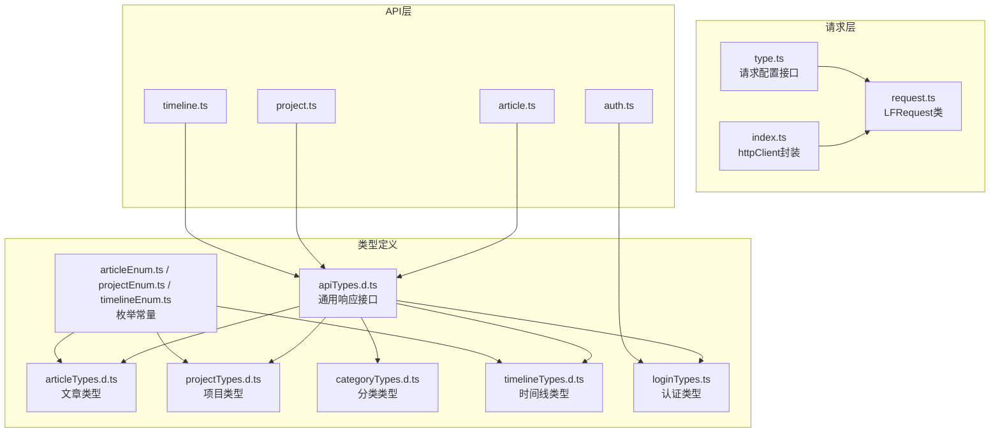
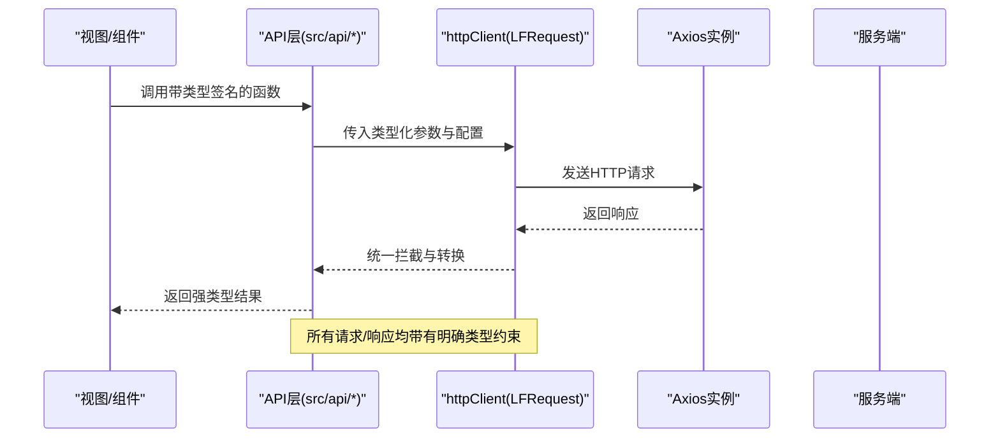

# API类型定义系统

<cite>
**本文档引用的文件**
- [src/types/apiTypes.d.ts](file://src/types/apiTypes.d.ts)
- [src/types/articleTypes.d.ts](file://src/types/articleTypes.d.ts)
- [src/types/projectTypes.d.ts](file://src/types/projectTypes.d.ts)
- [src/types/categoryTypes.d.ts](file://src/types/categoryTypes.d.ts)
- [src/types/timelineTypes.d.ts](file://src/types/timelineTypes.d.ts)
- [src/types/loginTypes.ts](file://src/types/loginTypes.ts)
- [src/utils/enums/articleEnum.ts](file://src/utils/enums/articleEnum.ts)
- [src/utils/enums/projectEnum.ts](file://src/utils/enums/projectEnum.ts)
- [src/utils/enums/timelineEnum.ts](file://src/utils/enums/timelineEnum.ts)
- [src/utils/request/type.ts](file://src/utils/request/type.ts)
- [src/utils/request/index.ts](file://src/utils/request/index.ts)
- [src/utils/request/request.ts](file://src/utils/request/request.ts)
- [src/api/article.ts](file://src/api/article.ts)
- [src/api/auth.ts](file://src/api/auth.ts)
- [src/api/project.ts](file://src/api/project.ts)
- [src/api/timeline.ts](file://src/api/timeline.ts)
</cite>

## 目录
1. [简介](#简介)
2. [项目结构](#项目结构)
3. [核心组件](#核心组件)
4. [架构总览](#架构总览)
5. [详细组件分析](#详细组件分析)
6. [依赖分析](#依赖分析)
7. [性能考虑](#性能考虑)
8. [故障排除指南](#故障排除指南)
9. [结论](#结论)
10. [附录](#附录)

## 简介
本文件系统性梳理了该前端工程中的API类型定义体系，覆盖TypeScript接口与类型的设计原则、命名规范、字段定义、可选属性处理、请求参数验证与约束、响应数据结构、枚举与常量、泛型接口应用、类型安全最佳实践，以及类型定义与API接口的对应关系与维护策略。目标是帮助开发者在新增或修改API时，能够快速、一致地完成类型定义与实现。

## 项目结构
类型定义主要分布在以下位置：
- 通用响应类型：src/types/apiTypes.d.ts
- 各业务模块类型：src/types/*.d.ts 或 *.ts
- 枚举与常量：src/utils/enums/*.ts
- 请求封装与拦截器：src/utils/request/*.ts
- API层调用：src/api/*.ts

图表来源
- [src/types/apiTypes.d.ts](file://src/types/apiTypes.d.ts#L1-L7)
- [src/types/articleTypes.d.ts](file://src/types/articleTypes.d.ts#L1-L62)
- [src/types/projectTypes.d.ts](file://src/types/projectTypes.d.ts#L1-L27)
- [src/types/categoryTypes.d.ts](file://src/types/categoryTypes.d.ts#L1-L39)
- [src/types/timelineTypes.d.ts](file://src/types/timelineTypes.d.ts#L1-L39)
- [src/types/loginTypes.ts](file://src/types/loginTypes.ts#L1-L47)
- [src/utils/enums/articleEnum.ts](file://src/utils/enums/articleEnum.ts#L1-L10)
- [src/utils/enums/projectEnum.ts](file://src/utils/enums/projectEnum.ts#L1-L9)
- [src/utils/enums/timelineEnum.ts](file://src/utils/enums/timelineEnum.ts#L1-L18)
- [src/utils/request/request.ts](file://src/utils/request/request.ts#L1-L99)
- [src/utils/request/index.ts](file://src/utils/request/index.ts#L1-L40)
- [src/utils/request/type.ts](file://src/utils/request/type.ts#L1-L15)
- [src/api/article.ts](file://src/api/article.ts#L1-L60)
- [src/api/auth.ts](file://src/api/auth.ts#L1-L41)
- [src/api/project.ts](file://src/api/project.ts#L1-L38)
- [src/api/timeline.ts](file://src/api/timeline.ts#L1-L44)

章节来源
- [src/types/apiTypes.d.ts](file://src/types/apiTypes.d.ts#L1-L7)
- [src/utils/request/request.ts](file://src/utils/request/request.ts#L1-L99)
- [src/utils/request/index.ts](file://src/utils/request/index.ts#L1-L40)

## 核心组件
- 通用响应接口：统一后端返回结构，包含状态码、消息与数据载体，支持泛型承载具体业务数据。
- 业务类型：按领域划分，如文章、项目、分类、时间线、认证等，涵盖实体、请求参数、过滤器、分页响应等。
- 枚举与常量：以数组形式定义状态、类型等取值集合，便于UI渲染与校验。
- 请求封装：基于Axios的LFRequest类，提供统一的请求/响应拦截器与错误处理，并通过httpClient对外暴露。

章节来源
- [src/types/apiTypes.d.ts](file://src/types/apiTypes.d.ts#L1-L7)
- [src/types/articleTypes.d.ts](file://src/types/articleTypes.d.ts#L1-L62)
- [src/types/projectTypes.d.ts](file://src/types/projectTypes.d.ts#L1-L27)
- [src/types/categoryTypes.d.ts](file://src/types/categoryTypes.d.ts#L1-L39)
- [src/types/timelineTypes.d.ts](file://src/types/timelineTypes.d.ts#L1-L39)
- [src/types/loginTypes.ts](file://src/types/loginTypes.ts#L1-L47)
- [src/utils/enums/articleEnum.ts](file://src/utils/enums/articleEnum.ts#L1-L10)
- [src/utils/enums/projectEnum.ts](file://src/utils/enums/projectEnum.ts#L1-L9)
- [src/utils/enums/timelineEnum.ts](file://src/utils/enums/timelineEnum.ts#L1-L18)
- [src/utils/request/type.ts](file://src/utils/request/type.ts#L1-L15)
- [src/utils/request/request.ts](file://src/utils/request/request.ts#L1-L99)
- [src/utils/request/index.ts](file://src/utils/request/index.ts#L1-L40)

## 架构总览
类型定义与API调用的协作流程如下：

图表来源
- [src/api/article.ts](file://src/api/article.ts#L1-L60)
- [src/api/auth.ts](file://src/api/auth.ts#L1-L41)
- [src/api/project.ts](file://src/api/project.ts#L1-L38)
- [src/api/timeline.ts](file://src/api/timeline.ts#L1-L44)
- [src/utils/request/index.ts](file://src/utils/request/index.ts#L1-L40)
- [src/utils/request/request.ts](file://src/utils/request/request.ts#L1-L99)

## 详细组件分析

### 通用响应类型 IApiResponse
- 设计原则：统一后端返回结构，便于前端一致处理成功/失败、提示与数据。
- 字段定义：包含状态码、消息文本与数据载体；数据载体为泛型T，支持任意业务类型。
- 使用方式：各业务模块的响应类型通常包装为IApiResponse<T>，例如文章列表、项目详情等。

章节来源
- [src/types/apiTypes.d.ts](file://src/types/apiTypes.d.ts#L1-L7)

### 文章模块类型体系
- 实体与字段：IArticle包含标识、分类关联、类型、标题、状态、内容、共享/删除标记及时间戳；部分字段为可选，体现后端可能未返回或可为空。
- 请求参数：IAddArticleParams定义创建所需字段，包含分类路径、类型、标题、可选状态与内容。
- 过滤器：IArticleFilter支持多维筛选（标题、分类、状态、类型、共享标记、分页时间范围、排序键与方向），其中排序键使用keyof IArticle确保类型安全。
- 响应类型：TArticleResponse为IApiResponse<IArticle[]>；TArticlePageResponse为IApiResponse包裹分页结构（页码、大小、总数、数据）。
- 可选属性处理：content、status、is_shared等字段在实体与请求参数中采用可选或必选结合的方式，满足不同场景的数据传输需求。

章节来源
- [src/types/articleTypes.d.ts](file://src/types/articleTypes.d.ts#L1-L62)
- [src/api/article.ts](file://src/api/article.ts#L1-L60)

### 项目模块类型体系
- 实体与字段：IProjectInfo包含标识、类型、名称、图标、描述、状态与时间戳。
- 请求参数：IAddProjectParams定义创建所需字段（名称、描述、类型、状态）。
- 列表与结果：TProjectList为IProjectInfo数组；TProjectResult与TAddProjectResult分别为IApiResponse<TProjectList>与IApiResponse<IProjectInfo>。
- 时间范围：API层在查询近期项目时，通过params传入时间范围，体现类型驱动的参数约束。

章节来源
- [src/types/projectTypes.d.ts](file://src/types/projectTypes.d.ts#L1-L27)
- [src/api/project.ts](file://src/api/project.ts#L1-L38)

### 分类模块类型体系
- 实体与字段：ICategory包含标识、所属项目、名称、父级、图标、描述、删除标记与时间戳；支持children可选嵌套，形成树形结构。
- 请求参数：ICreateCategoryRequest与IUpdateCategoryRequest分别定义创建与更新所需的字段，均支持可选字段。
- 响应类型：ICategoryResponse为IApiResponse<ICategory[]>。

章节来源
- [src/types/categoryTypes.d.ts](file://src/types/categoryTypes.d.ts#L1-L39)

### 时间线模块类型体系
- 类型枚举：TTimelineType与TTimelineStatus定义可用取值集合，保证输入与展示一致性。
- 实体与字段：ITimeline包含标识、标题、类型、内容、状态、描述、重要性、摘要标记、起止时间与时间戳。
- 请求参数：IAddTimelineParams定义创建所需字段（标题、类型、内容、可选描述）。
- 过滤器：ITimelineFilter支持按类型、状态与时间范围过滤。
- 响应类型：TTimelineList为ITimeline数组；TTimelineResult与TAddTimelineResult分别为IApiResponse<TTimelineList>与IApiResponse<ITimeline>。

章节来源
- [src/types/timelineTypes.d.ts](file://src/types/timelineTypes.d.ts#L1-L39)
- [src/api/timeline.ts](file://src/api/timeline.ts#L1-L44)

### 认证模块类型体系
- 登录参数：ILoginParams包含用户名与密码。
- 登录结果：ILoginResult为IApiResponse<LoginResult>，LoginResult包含访问令牌、刷新令牌与过期时间。
- 注册参数：IRegisterParams包含用户名、密码、可选重复密码与邮箱。
- 用户信息：IUserInfo包含用户标识、账户、昵称、邮箱、头像、角色与时间戳。
- 注册结果：IRegisterResult为IApiResponse<IUserInfo>。

章节来源
- [src/types/loginTypes.ts](file://src/types/loginTypes.ts#L1-L47)
- [src/api/auth.ts](file://src/api/auth.ts#L1-L41)

### 枚举与常量
- 文章：EArticleStatus与EArticleType定义状态与类型取值集合，适合下拉选择与标签展示。
- 项目：EProjectStatus与EProjectType定义状态与类型取值集合。
- 时间线：ETimelineType与ETimelineStatus定义类型与状态取值集合，部分枚举项携带主题或颜色属性，便于UI渲染。

章节来源
- [src/utils/enums/articleEnum.ts](file://src/utils/enums/articleEnum.ts#L1-L10)
- [src/utils/enums/projectEnum.ts](file://src/utils/enums/projectEnum.ts#L1-L9)
- [src/utils/enums/timelineEnum.ts](file://src/utils/enums/timelineEnum.ts#L1-L18)

### 请求封装与拦截器
- LFRequestConfig与LFInterceptors：扩展Axios配置，允许注入请求/响应拦截器回调，支持是否刷新令牌标志。
- httpClient：基于LFRequest实例，统一注入鉴权头、项目ID头与白名单逻辑；请求失败时统一提示与跳转。
- LFRequest类：封装请求方法（get/post/put/delete/patch），内置全局与实例级拦截器，Promise化处理响应与错误。

章节来源
- [src/utils/request/type.ts](file://src/utils/request/type.ts#L1-L15)
- [src/utils/request/index.ts](file://src/utils/request/index.ts#L1-L40)
- [src/utils/request/request.ts](file://src/utils/request/request.ts#L1-L99)

### API层与类型绑定
- API函数均以类型化参数与返回值签名，确保调用侧获得编译期保障。
- 通过泛型指定IApiResponse<T>，使API层无需关心具体业务数据结构，仅需关注HTTP交互细节。

章节来源
- [src/api/article.ts](file://src/api/article.ts#L1-L60)
- [src/api/auth.ts](file://src/api/auth.ts#L1-L41)
- [src/api/project.ts](file://src/api/project.ts#L1-L38)
- [src/api/timeline.ts](file://src/api/timeline.ts#L1-L44)

## 依赖分析
- 类型到实现的依赖：各业务类型被API层函数引用；API层再依赖请求封装；请求封装依赖Axios与拦截器。
- 枚举与类型：枚举用于UI与校验，类型用于TS编译期约束；二者通过字符串字面量与联合类型保持一致。
- 泛型使用：IApiResponse<T>贯穿所有业务响应，TArticlePageResponse进一步使用内联对象泛型承载分页数据。

图表来源
- [src/types/articleTypes.d.ts](file://src/types/articleTypes.d.ts#L1-L62)
- [src/types/projectTypes.d.ts](file://src/types/projectTypes.d.ts#L1-L27)
- [src/types/timelineTypes.d.ts](file://src/types/timelineTypes.d.ts#L1-L39)
- [src/types/loginTypes.ts](file://src/types/loginTypes.ts#L1-L47)
- [src/utils/enums/articleEnum.ts](file://src/utils/enums/articleEnum.ts#L1-L10)
- [src/utils/enums/projectEnum.ts](file://src/utils/enums/projectEnum.ts#L1-L9)
- [src/utils/enums/timelineEnum.ts](file://src/utils/enums/timelineEnum.ts#L1-L18)
- [src/api/article.ts](file://src/api/article.ts#L1-L60)
- [src/api/auth.ts](file://src/api/auth.ts#L1-L41)
- [src/api/project.ts](file://src/api/project.ts#L1-L38)
- [src/api/timeline.ts](file://src/api/timeline.ts#L1-L44)
- [src/utils/request/index.ts](file://src/utils/request/index.ts#L1-L40)
- [src/utils/request/request.ts](file://src/utils/request/request.ts#L1-L99)

## 性能考虑
- 类型层面：使用Partial<T>与内联联合类型减少冗余定义，避免过度嵌套导致的编译与运行时开销。
- 请求层面：统一拦截器减少重复逻辑，Promise化处理降低回调地狱风险；合理利用白名单与鉴权头，避免不必要的请求重试。
- 数据结构：分页响应采用内联对象而非深层嵌套，便于序列化与前端渲染。

## 故障排除指南
- 401未授权：请求拦截器检测到401时移除本地令牌并提示跳转登录，确保后续请求不再携带无效令牌。
- 非200响应：统一捕获并返回后端错误信息，避免前端因格式不一致而崩溃。
- 参数缺失：通过类型签名强制传参，若出现编译错误，检查调用处是否遗漏必需字段。
- 枚举不匹配：当后端返回值不在枚举集合中，优先修正后端或在前端做兼容处理，避免UI渲染异常。

章节来源
- [src/utils/request/request.ts](file://src/utils/request/request.ts#L26-L40)
- [src/utils/request/index.ts](file://src/utils/request/index.ts#L15-L39)

## 结论
该类型定义系统以IApiResponse为核心，围绕业务域拆分类型文件，配合枚举与常量实现输入输出的一致性约束；通过LFRequest与httpClient实现请求层的统一拦截与错误处理。整体设计遵循“类型先行”的原则，既保证了开发效率，也提升了运行时的健壮性。建议在新增API时严格遵循现有命名与结构规范，确保类型与实现同步演进。

## 附录

### 类型设计最佳实践清单
- 命名规范
  - 接口以大写“I”开头，如IArticle、ILoginParams。
  - 类型别名以大写“T”开头，如TArticleStatus、TArticleResponse。
  - 枚举常量以“E”开头，如EArticleStatus、ETimelineType。
- 字段定义
  - 明确区分实体字段与请求参数字段，必要时拆分为独立接口。
  - 对可空或可选字段使用可选属性，避免在调用侧做额外判断。
- 可选属性处理
  - 使用Partial<T>表达可部分更新的场景，如updateArticleApi中的Partial<IArticle>。
  - 在请求参数中区分必填与可选字段，减少误传。
- 请求参数类型
  - 过滤器使用联合类型与可选字段组合，确保参数合法。
  - 排序键使用keyof T，防止拼写错误。
- 响应数据结构
  - 统一封装IApiResponse<T>，便于统一处理。
  - 分页响应采用内联对象，避免深层嵌套。
- 枚举与常量
  - 枚举用于UI渲染与校验，常量用于后端交互。
  - 枚举项尽量包含label与UI相关属性，提升可维护性。
- 泛型应用
  - IApiResponse<T>承载任意业务数据。
  - TArticlePageResponse使用内联对象泛型承载分页数据。
- 类型安全
  - 优先使用类型推导，减少显式断言。
  - 在复杂分支中使用类型守卫，确保分支内的类型收敛。
- 维护策略
  - 新增API时先完善类型定义，再实现API函数与请求封装。
  - 枚举与常量变更需同步更新UI与校验逻辑。
  - 定期审查类型文件，合并重复定义，清理废弃类型。