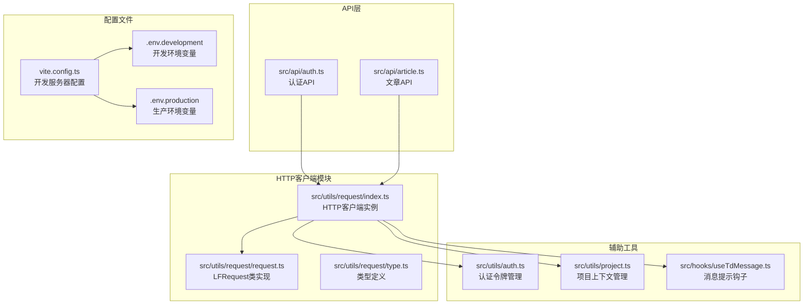
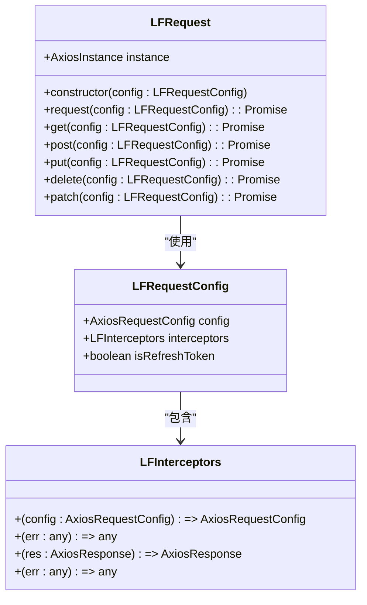
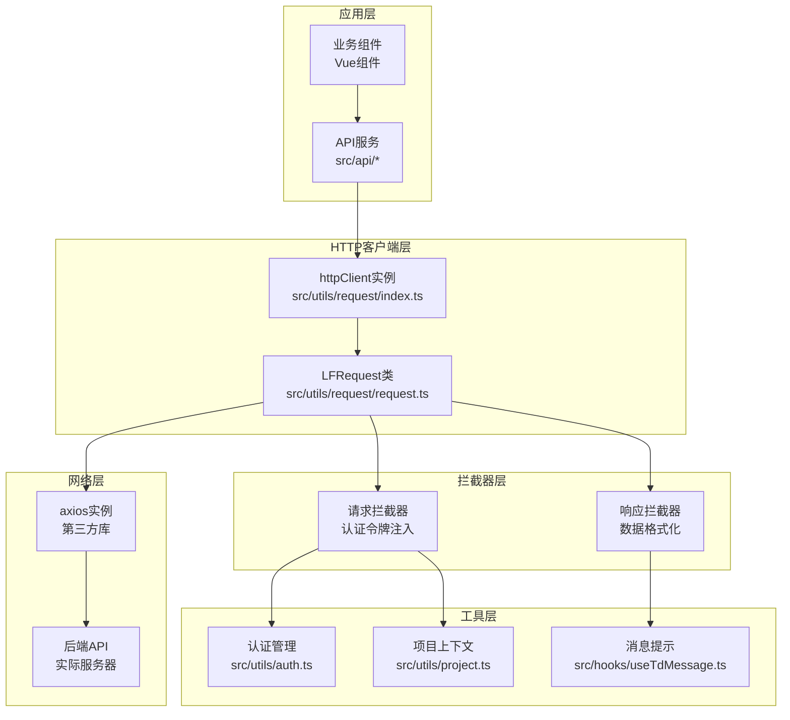
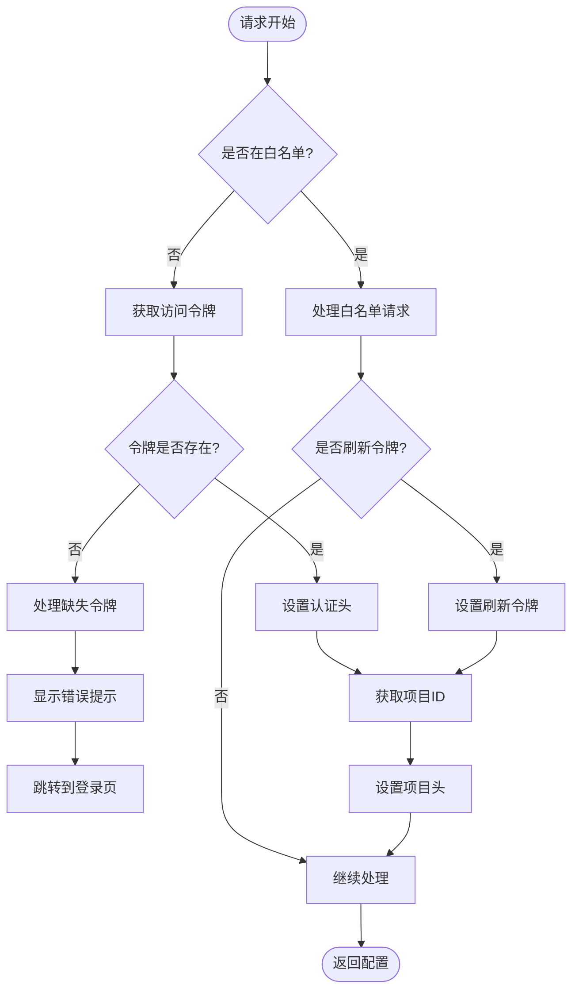
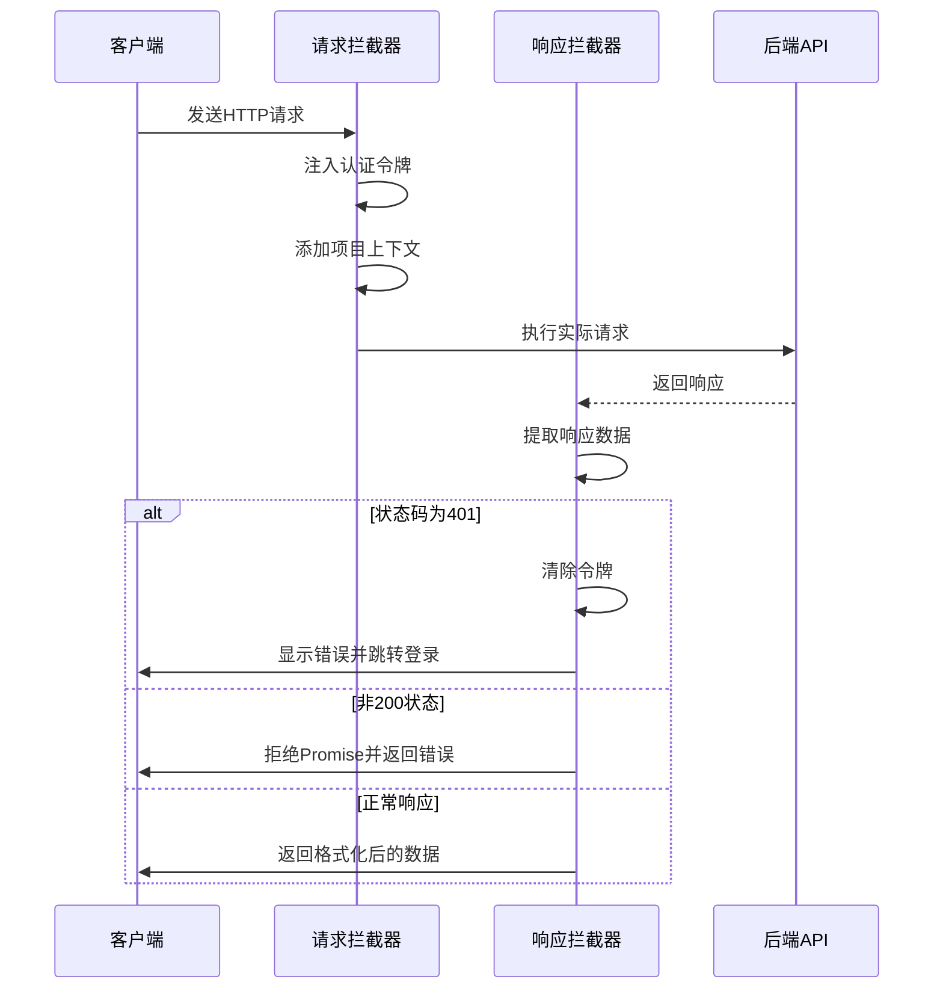
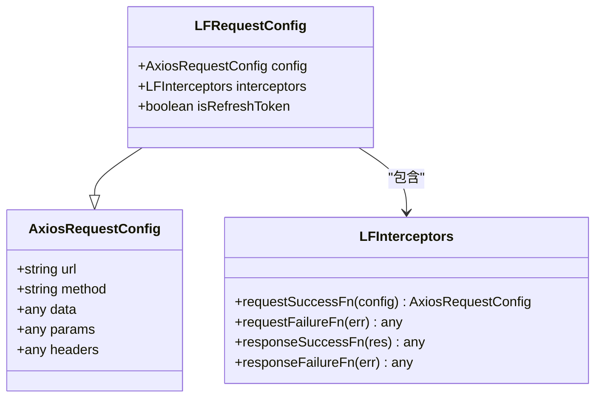
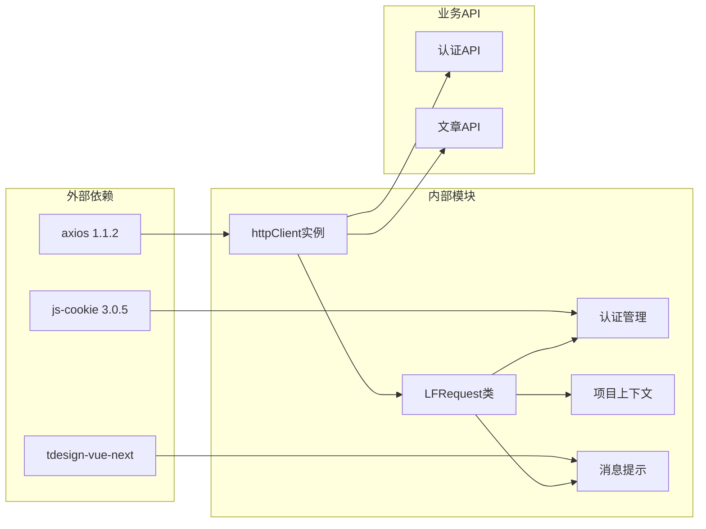

# HTTP客户端封装

<cite>
**本文档引用的文件**
- [src/utils/request/index.ts](file://src/utils/request/index.ts)
- [src/utils/request/request.ts](file://src/utils/request/request.ts)
- [src/utils/request/type.ts](file://src/utils/request/type.ts)
- [src/utils/auth.ts](file://src/utils/auth.ts)
- [src/utils/project.ts](file://src/utils/project.ts)
- [src/hooks/useTdMessage.ts](file://src/hooks/useTdMessage.ts)
- [src/api/auth.ts](file://src/api/auth.ts)
- [src/api/article.ts](file://src/api/article.ts)
- [vite.config.ts](file://vite.config.ts)
- [.env.development](file://.env.development)
- [.env.production](file://.env.production)
- [package.json](file://package.json)
</cite>

## 目录
1. [简介](#简介)
2. [项目结构](#项目结构)
3. [核心组件](#核心组件)
4. [架构概览](#架构概览)
5. [详细组件分析](#详细组件分析)
6. [依赖关系分析](#依赖关系分析)
7. [性能考虑](#性能考虑)
8. [故障排除指南](#故障排除指南)
9. [结论](#结论)
10. [附录](#附录)

## 简介

本文档深入解析了LiFocus Web V2项目中的HTTP客户端封装实现。该项目基于Vue 3和TypeScript构建，采用axios作为底层HTTP库，通过自定义的LFRequest类实现了统一的HTTP客户端管理。该封装提供了完整的请求/响应拦截器机制、认证令牌管理、项目上下文支持以及错误处理策略。

HTTP客户端封装的核心目标是：
- 统一管理所有API请求
- 自动处理认证令牌注入
- 提供一致的错误处理机制
- 支持项目级上下文传递
- 实现可配置的拦截器链

## 项目结构

项目采用模块化的文件组织方式，HTTP客户端相关代码集中在`src/utils/request/`目录下：



**图表来源**
- [src/utils/request/index.ts](file://src/utils/request/index.ts#L1-L40)
- [src/utils/request/request.ts](file://src/utils/request/request.ts#L1-L99)
- [src/utils/request/type.ts](file://src/utils/request/type.ts#L1-L15)

**章节来源**
- [src/utils/request/index.ts](file://src/utils/request/index.ts#L1-L40)
- [src/utils/request/request.ts](file://src/utils/request/request.ts#L1-L99)
- [src/utils/request/type.ts](file://src/utils/request/type.ts#L1-L15)

## 核心组件

### LFRequest类设计

LFRequest类是整个HTTP客户端封装的核心，它继承了axios的实例化能力并扩展了自定义功能：



**图表来源**
- [src/utils/request/request.ts](file://src/utils/request/request.ts#L9-L51)
- [src/utils/request/type.ts](file://src/utils/request/type.ts#L4-L14)

### HTTP客户端实例

主HTTP客户端实例在index.ts中创建，配置了基础URL、超时时间和拦截器：

**章节来源**
- [src/utils/request/index.ts](file://src/utils/request/index.ts#L12-L39)
- [src/utils/request/request.ts](file://src/utils/request/request.ts#L13-L51)

## 架构概览

HTTP客户端的整体架构采用分层设计，从上到下分别为API层、客户端层、拦截器层和底层axios：



**图表来源**
- [src/utils/request/index.ts](file://src/utils/request/index.ts#L1-L40)
- [src/utils/request/request.ts](file://src/utils/request/request.ts#L1-L99)
- [src/utils/auth.ts](file://src/utils/auth.ts#L1-L71)
- [src/utils/project.ts](file://src/utils/project.ts#L1-L10)

## 详细组件分析

### 基础配置与初始化

HTTP客户端的初始化过程涉及多个关键配置项：

#### 基础URL配置
- **开发环境**: 使用Vite代理前缀`/api`，通过Vite配置实现本地开发代理
- **生产环境**: 直接使用完整API地址
- **代理配置**: 在vite.config.ts中配置了`/api`前缀的代理规则

#### 超时设置
- 默认超时时间为60秒（60000毫秒）
- 可根据具体API特性进行调整

#### 默认Headers配置
- 自动注入认证令牌（Authorization头）
- 支持项目级上下文传递（X-Project-Id头）

**章节来源**
- [.env.development](file://.env.development#L1-L3)
- [.env.production](file://.env.production#L1)
- [vite.config.ts](file://vite.config.ts#L21-L27)
- [src/utils/request/index.ts](file://src/utils/request/index.ts#L12-L14)

### 请求拦截器实现

请求拦截器负责在请求发送前进行预处理：

#### 白名单机制
- 对登录和注册接口采用特殊处理逻辑
- 支持刷新令牌场景的特殊头部设置

#### 认证令牌注入
- 从认证存储中获取访问令牌
- 自动添加Bearer前缀到Authorization头
- 处理令牌缺失的情况

#### 项目上下文传递
- 从Cookie中获取当前项目ID
- 自动添加X-Project-Id头部
- 支持多项目环境切换



**图表来源**
- [src/utils/request/index.ts](file://src/utils/request/index.ts#L16-L37)
- [src/utils/auth.ts](file://src/utils/auth.ts#L29-L45)
- [src/utils/project.ts](file://src/utils/project.ts#L7-L9)

**章节来源**
- [src/utils/request/index.ts](file://src/utils/request/index.ts#L16-L37)
- [src/utils/auth.ts](file://src/utils/auth.ts#L29-L45)
- [src/utils/project.ts](file://src/utils/project.ts#L7-L9)

### 响应拦截器实现

响应拦截器负责处理服务器响应和错误情况：

#### 数据格式化
- 自动提取响应数据（res.data）
- 简化API调用者的处理逻辑

#### 错误处理策略
- **401未授权**: 清除本地令牌，显示错误提示，跳转到登录页
- **非200状态**: 返回Promise.reject，包含错误数据或默认错误消息
- **系统错误**: 提供友好的错误提示



**图表来源**
- [src/utils/request/request.ts](file://src/utils/request/request.ts#L26-L40)
- [src/utils/auth.ts](file://src/utils/auth.ts#L63-L70)

**章节来源**
- [src/utils/request/request.ts](file://src/utils/request/request.ts#L26-L40)
- [src/utils/auth.ts](file://src/utils/auth.ts#L63-L70)

### 配置选项详解

#### 类型定义扩展
LFRequestConfig扩展了标准的AxiosRequestConfig，增加了拦截器配置和刷新令牌标识：



**图表来源**
- [src/utils/request/type.ts](file://src/utils/request/type.ts#L4-L14)

#### 方法封装
LFRequest类提供了标准的HTTP方法封装，简化了API调用：

**章节来源**
- [src/utils/request/type.ts](file://src/utils/request/type.ts#L11-L14)
- [src/utils/request/request.ts](file://src/utils/request/request.ts#L77-L95)

## 依赖关系分析

HTTP客户端封装的依赖关系体现了清晰的分层架构：



**图表来源**
- [package.json](file://package.json#L18-L38)
- [src/utils/request/index.ts](file://src/utils/request/index.ts#L1-L6)
- [src/utils/request/request.ts](file://src/utils/request/request.ts#L1-L5)

**章节来源**
- [package.json](file://package.json#L18-L38)
- [src/utils/request/index.ts](file://src/utils/request/index.ts#L1-L6)

## 性能考虑

### 并发控制
当前实现未内置并发限制机制。如需实现并发控制，可以考虑以下方案：

1. **队列管理**: 实现请求队列，限制同时进行的请求数量
2. **信号量模式**: 使用信号量控制并发请求数
3. **节流策略**: 对高频请求实施节流

### 缓存策略
- **响应缓存**: 对读取类请求实施缓存机制
- **令牌缓存**: 减少重复的令牌获取操作
- **配置缓存**: 缓存常用的API配置

### 优化建议
1. **连接复用**: 利用axios的连接池特性
2. **请求合并**: 对相似请求进行合并处理
3. **懒加载**: 按需加载API模块
4. **压缩传输**: 启用Gzip压缩减少传输体积

## 故障排除指南

### 常见问题诊断

#### 认证失败
**症状**: 401未授权错误频繁出现
**排查步骤**:
1. 检查令牌存储状态
2. 验证令牌过期时间
3. 确认刷新令牌流程

#### 网络异常处理
**症状**: 请求超时或连接中断
**处理策略**:
1. 实施指数退避重试
2. 提供用户友好的错误提示
3. 记录详细的错误日志

#### 代理配置问题
**症状**: 开发环境下API请求失败
**解决方案**:
1. 检查Vite代理配置
2. 验证后端服务可用性
3. 确认跨域设置

### 调试技巧

#### 开发环境调试
- 使用浏览器开发者工具监控网络请求
- 启用axios调试模式
- 检查请求头和响应头

#### 生产环境监控
- 实施错误追踪
- 记录请求性能指标
- 监控API调用成功率

**章节来源**
- [src/utils/request/request.ts](file://src/utils/request/request.ts#L31-L38)
- [src/utils/auth.ts](file://src/utils/auth.ts#L63-L70)

## 结论

LiFocus项目的HTTP客户端封装实现了以下关键特性：

1. **统一的API管理**: 通过单例模式管理所有HTTP请求
2. **自动认证处理**: 透明的令牌注入和刷新机制
3. **灵活的拦截器**: 支持请求和响应的自定义处理
4. **项目上下文支持**: 无缝集成多项目环境
5. **完善的错误处理**: 统一的错误处理和用户反馈机制

该实现为后续的功能扩展奠定了良好的基础，包括但不限于：
- 增加重试机制和错误恢复策略
- 实现请求缓存和性能优化
- 添加更细粒度的并发控制
- 集成更强大的调试和监控功能

## 附录

### 使用示例

#### 基本API调用
```typescript
// 登录API调用
const loginData = { username, password };
const result = await httpClient.post<ILoginResult>({
  url: '/auth/login',
  data: loginData
});
```

#### 带拦截器的请求
```typescript
// 自定义拦截器配置
const customConfig = {
  url: '/protected/resource',
  interceptors: {
    requestSuccessFn: (config) => {
      // 自定义请求预处理
      return config;
    },
    responseSuccessFn: (res) => {
      // 自定义响应处理
      return res.data;
    }
  }
};
```

### 最佳实践

1. **统一错误处理**: 所有API调用都应该包含错误处理逻辑
2. **类型安全**: 充分利用TypeScript类型系统
3. **配置分离**: 将环境配置与代码分离
4. **性能监控**: 实施请求性能监控和优化
5. **安全性**: 严格管理敏感数据和令牌

### 配置参考

| 配置项 | 默认值 | 说明 |
|--------|--------|------|
| baseURL | VITE_BASE_API | API基础URL |
| timeout | 60000ms | 请求超时时间 |
| retryCount | 0 | 重试次数 |
| maxConcurrent | Infinity | 最大并发数 |