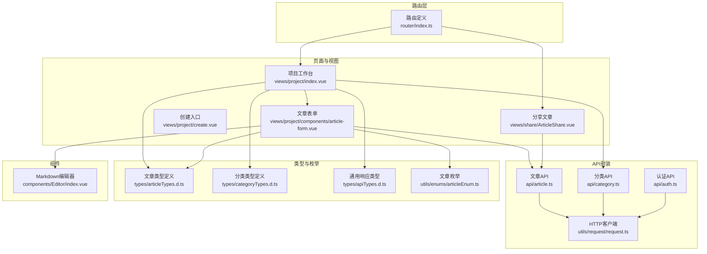
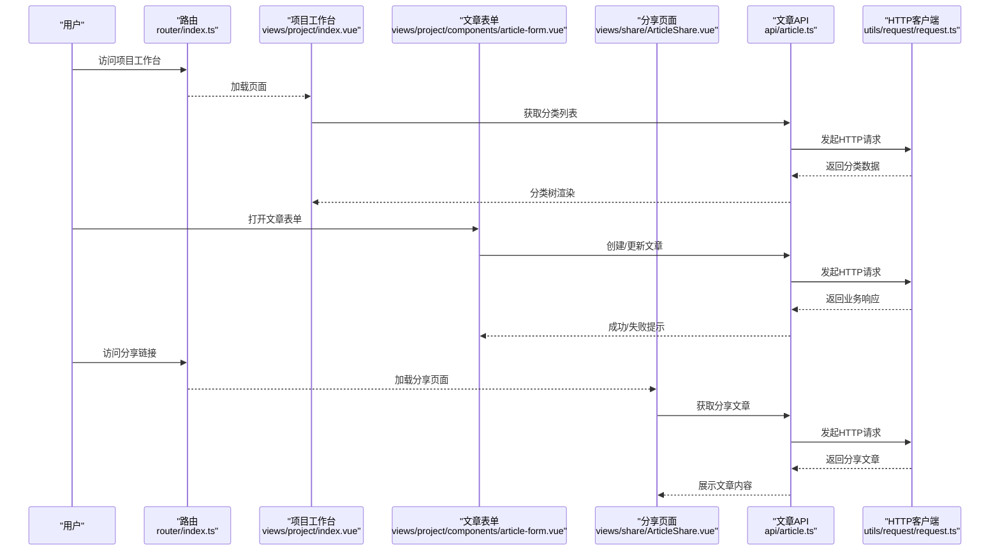
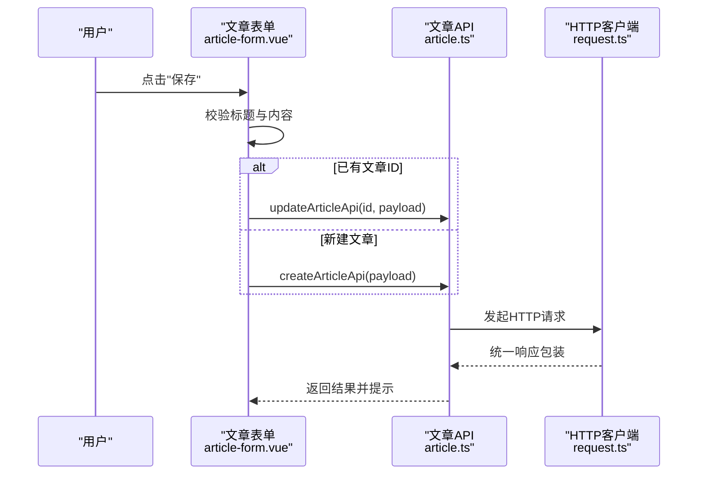
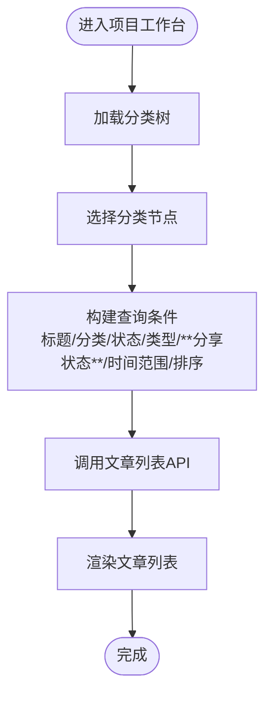
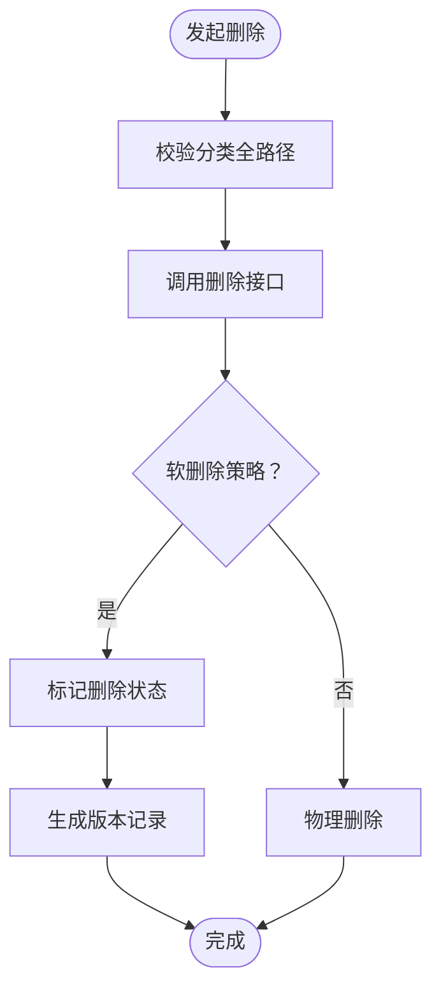
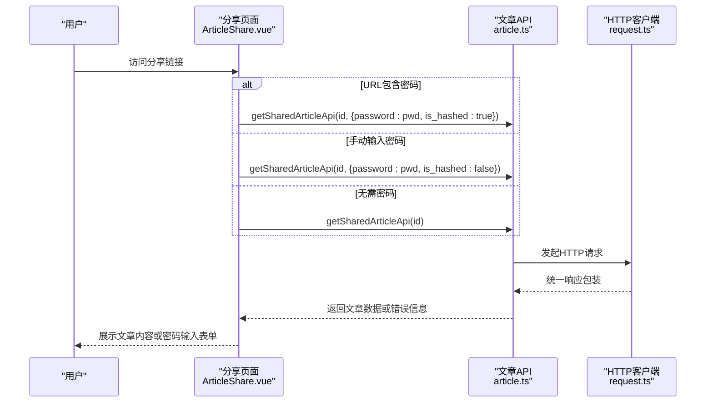
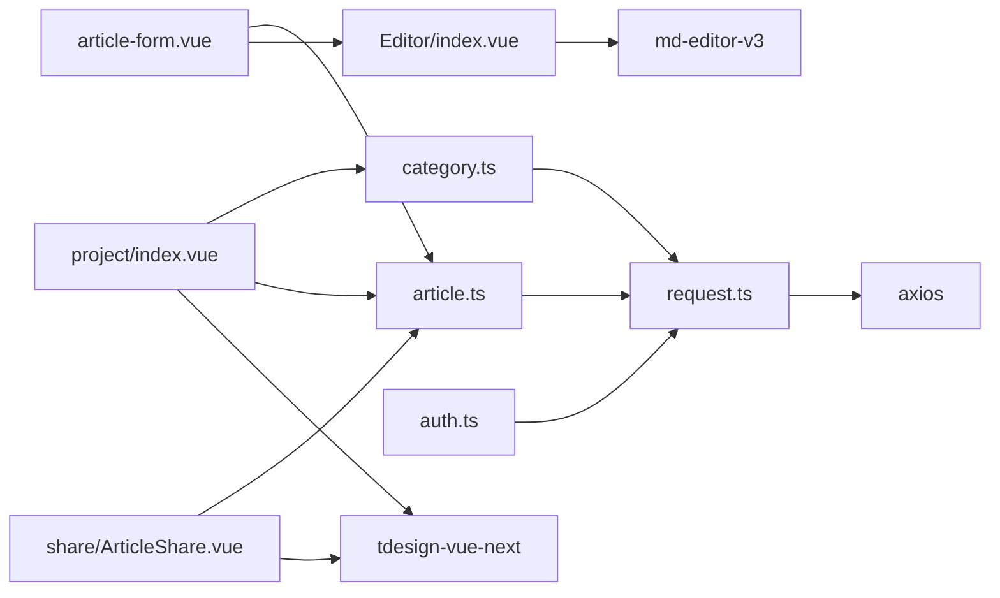

# 内容创作API模块

<cite>
**本文引用的文件**
- [src/api/article.ts](file://src/api/article.ts)
- [src/types/articleTypes.d.ts](file://src/types/articleTypes.d.ts)
- [src/utils/enums/articleEnum.ts](file://src/utils/enums/articleEnum.ts)
- [src/views/project/create.vue](file://src/views/project/create.vue)
- [src/views/project/components/article-form.vue](file://src/views/project/components/article-form.vue)
- [src/views/project/index.vue](file://src/views/project/index.vue)
- [src/views/project/components/file-list.vue](file://src/views/project/components/file-list.vue)
- [src/views/share/ArticleShare.vue](file://src/views/share/ArticleShare.vue)
- [src/api/category.ts](file://src/api/category.ts)
- [src/types/categoryTypes.d.ts](file://src/types/categoryTypes.d.ts)
- [src/api/auth.ts](file://src/api/auth.ts)
- [src/utils/request/request.ts](file://src/utils/request/request.ts)
- [src/router/index.ts](file://src/router/index.ts)
- [src/types/apiTypes.d.ts](file://src/types/apiTypes.d.ts)
- [src/components/Editor/index.vue](file://src/components/Editor/index.vue)
- [src/stores/main.ts](file://src/stores/main.ts)
- [src/utils/auth.ts](file://src/utils/auth.ts)
- [src/utils/request/index.ts](file://src/utils/request/index.ts)
- [package.json](file://package.json)
</cite>

## 更新摘要
**变更内容**
- 新增文章分享API功能，包括`getSharedArticleApi`接口支持密码保护和哈希认证
- 扩展文章类型定义，新增`share_password`、`is_shared`字段实现类型安全
- 新增分享文章前端组件和路由配置
- 在请求拦截器中添加分享路由白名单支持

## 目录
1. [简介](#简介)
2. [项目结构](#项目结构)
3. [核心组件](#核心组件)
4. [架构总览](#架构总览)
5. [详细组件分析](#详细组件分析)
6. [依赖分析](#依赖分析)
7. [性能考虑](#性能考虑)
8. [故障排除指南](#故障排除指南)
9. [结论](#结论)
10. [附录](#附录)

## 简介
本文件面向内容创作API模块，系统性梳理前端侧与"文章"相关的接口与交互实现，涵盖以下方面：
- 文章创建与编辑接口：含富文本内容处理、草稿保存与发布流程
- 文章列表查询接口：支持分类筛选、标签搜索、时间范围查询与排序
- 文章删除与恢复接口：基于软删除机制与版本控制思路
- 文章评论与互动接口：评论创建、回复与点赞功能
- 文件上传与管理接口：图片处理、附件存储与媒体库管理
- **新增** 文章分享功能：支持密码保护和哈希认证的分享文章获取
- 内容版本控制与历史记录：实现方案建议
- 内容审核与权限控制：集成方法
- 完整API调用示例与数据格式说明

说明：当前仓库前端代码主要展示文章的创建、编辑、列表查询与基础删除能力；评论、互动、文件上传、版本控制、审核与权限控制等功能在本仓库未直接实现，将在相应章节给出设计建议与集成路径。**新增的文章分享功能已完整实现，包括前端组件、API接口和类型定义。**

## 项目结构
前端采用Vue 3 + TypeScript + Vite构建，API封装通过统一的HTTP客户端完成，路由与页面组件围绕"项目工作台"展开，文章编辑使用Markdown编辑器组件。**新增了分享功能相关的组件和路由配置。**

**图表来源**
- [src/router/index.ts](file://src/router/index.ts#L1-L90)
- [src/views/project/index.vue](file://src/views/project/index.vue#L1-L371)
- [src/views/project/components/article-form.vue](file://src/views/project/components/article-form.vue#L1-L214)
- [src/views/project/create.vue](file://src/views/project/create.vue#L1-L18)
- [src/views/share/ArticleShare.vue](file://src/views/share/ArticleShare.vue#L1-L277)
- [src/api/article.ts](file://src/api/article.ts#L1-L75)
- [src/api/category.ts](file://src/api/category.ts#L1-L50)
- [src/api/auth.ts](file://src/api/auth.ts#L1-L41)
- [src/utils/request/request.ts](file://src/utils/request/request.ts#L1-L99)
- [src/types/articleTypes.d.ts](file://src/types/articleTypes.d.ts#L1-L65)
- [src/types/categoryTypes.d.ts](file://src/types/categoryTypes.d.ts#L1-L39)
- [src/types/apiTypes.d.ts](file://src/types/apiTypes.d.ts#L1-L7)
- [src/utils/enums/articleEnum.ts](file://src/utils/enums/articleEnum.ts#L1-L10)
- [src/components/Editor/index.vue](file://src/components/Editor/index.vue#L1-L164)

**章节来源**
- [src/router/index.ts](file://src/router/index.ts#L1-L90)
- [src/views/project/index.vue](file://src/views/project/index.vue#L1-L371)
- [src/views/project/components/article-form.vue](file://src/views/project/components/article-form.vue#L1-L214)
- [src/views/project/create.vue](file://src/views/project/create.vue#L1-L18)
- [src/views/share/ArticleShare.vue](file://src/views/share/ArticleShare.vue#L1-L277)
- [src/api/article.ts](file://src/api/article.ts#L1-L75)
- [src/api/category.ts](file://src/api/category.ts#L1-L50)
- [src/api/auth.ts](file://src/api/auth.ts#L1-L41)
- [src/utils/request/request.ts](file://src/utils/request/request.ts#L1-L99)
- [src/types/articleTypes.d.ts](file://src/types/articleTypes.d.ts#L1-L65)
- [src/types/categoryTypes.d.ts](file://src/types/categoryTypes.d.ts#L1-L39)
- [src/types/apiTypes.d.ts](file://src/types/apiTypes.d.ts#L1-L7)
- [src/utils/enums/articleEnum.ts](file://src/utils/enums/articleEnum.ts#L1-L10)
- [src/components/Editor/index.vue](file://src/components/Editor/index.vue#L1-L164)

## 核心组件
- 文章API模块：提供文章列表查询、按ID获取、创建、更新、删除等接口。
- **新增** 分享文章API：提供`getSharedArticleApi`接口，支持密码保护和哈希认证的分享文章获取。
- 文章表单组件：负责文章的新增、编辑、预览与保存，集成Markdown编辑器。
- 分类API模块：提供分类树的增删改查，支撑文章的分类筛选。
- HTTP客户端：统一封装Axios请求与响应拦截，处理通用错误与鉴权。
- **更新** 类型与枚举：定义文章状态、类型、分页响应结构与通用响应体，**新增分享相关字段类型定义**。
- **新增** 分享文章组件：独立的分享页面组件，支持密码输入和文章内容展示。

**章节来源**
- [src/api/article.ts](file://src/api/article.ts#L1-L75)
- [src/views/project/components/article-form.vue](file://src/views/project/components/article-form.vue#L1-L214)
- [src/views/share/ArticleShare.vue](file://src/views/share/ArticleShare.vue#L1-L277)
- [src/api/category.ts](file://src/api/category.ts#L1-L50)
- [src/utils/request/request.ts](file://src/utils/request/request.ts#L1-L99)
- [src/types/articleTypes.d.ts](file://src/types/articleTypes.d.ts#L1-L65)
- [src/utils/enums/articleEnum.ts](file://src/utils/enums/articleEnum.ts#L1-L10)

## 架构总览
前端通过路由进入项目工作台，加载分类树与文章列表，用户可在文章表单中进行富文本编辑与保存。**新增的分享功能通过独立路由访问，支持密码保护和哈希认证。** 所有网络请求经由统一HTTP客户端处理，响应体遵循统一的业务约定。

**图表来源**
- [src/router/index.ts](file://src/router/index.ts#L1-L90)
- [src/views/project/index.vue](file://src/views/project/index.vue#L1-L371)
- [src/views/project/components/article-form.vue](file://src/views/project/components/article-form.vue#L1-L214)
- [src/views/share/ArticleShare.vue](file://src/views/share/ArticleShare.vue#L1-L277)
- [src/api/article.ts](file://src/api/article.ts#L1-L75)
- [src/utils/request/request.ts](file://src/utils/request/request.ts#L1-L99)

## 详细组件分析

### 文章创建与编辑接口
- 接口职责
  - 创建文章：提交分类ID、分类全路径、类型、标题、内容等，返回文章对象。
  - 更新文章：支持修改分类、类型、标题、内容等字段。
  - 按ID获取文章：用于编辑态加载文章详情。
- 富文本内容处理
  - 使用Markdown编辑器组件，支持加粗、斜体、列表、表格、Mermaid、KaTeX等语法。
  - 编辑器支持预览模式与编辑模式切换，禁用图片上传以避免跨域或权限问题。
- 草稿保存与发布流程
  - 表单保存时校验标题与内容，若存在ID则走更新流程，否则走创建流程。
  - 保存成功后触发刷新，关闭弹窗并提示成功。

**图表来源**
- [src/views/project/components/article-form.vue](file://src/views/project/components/article-form.vue#L95-L138)
- [src/api/article.ts](file://src/api/article.ts#L29-L46)
- [src/utils/request/request.ts](file://src/utils/request/request.ts#L26-L40)

**章节来源**
- [src/views/project/components/article-form.vue](file://src/views/project/components/article-form.vue#L1-L214)
- [src/api/article.ts](file://src/api/article.ts#L1-L75)
- [src/components/Editor/index.vue](file://src/components/Editor/index.vue#L1-L164)

### 文章列表查询接口
- 接口职责
  - 支持按标题、分类ID、状态、类型、**分享状态**、分页参数、时间范围、排序字段与方向进行查询。
  - 返回分页结构，包含页码、页大小、总页数、总数与数据列表。
- 页面交互
  - 工作台页面提供分类树选择、标题搜索、排序切换与"添加文章"入口。
  - 搜索与排序变更会触发列表刷新。

**图表来源**
- [src/views/project/index.vue](file://src/views/project/index.vue#L175-L181)
- [src/api/article.ts](file://src/api/article.ts#L8-L13)
- [src/types/articleTypes.d.ts](file://src/types/articleTypes.d.ts#L50-L64)

**章节来源**
- [src/views/project/index.vue](file://src/views/project/index.vue#L1-L371)
- [src/api/article.ts](file://src/api/article.ts#L1-L75)
- [src/types/articleTypes.d.ts](file://src/types/articleTypes.d.ts#L1-L65)

### 文章删除与恢复接口
- 当前实现
  - 提供删除接口，需传入分类全路径参数，返回文章对象。
- 软删除机制与版本控制建议
  - 软删除：在数据库层面标记删除状态，不物理删除，保留历史版本。
  - 版本控制：每次更新生成新版本记录，保留操作人、时间戳与差异字段，支持回滚。
  - 恢复：将软删除标记清除，必要时合并最新版本内容。

**图表来源**
- [src/api/article.ts](file://src/api/article.ts#L52-L59)

**章节来源**
- [src/api/article.ts](file://src/api/article.ts#L1-L75)

### 文章分享功能
- **新增** 接口职责
  - 获取分享文章：支持通过ID获取分享的文章，支持密码保护和哈希认证两种方式。
  - 分享状态管理：支持开启/关闭文章分享，设置分享密码。
- **新增** 密码保护机制
  - 手动输入密码：用户在分享页面手动输入密码，`is_hashed`为false。
  - URL哈希密码：通过URL参数传递哈希密码，`is_hashed`为true。
  - 密码验证：后端验证密码正确性，正确则返回文章内容。
- **新增** 前端实现
  - 分享页面组件：独立的分享页面，支持密码输入和文章内容展示。
  - 分享状态显示：在文章卡片中显示分享状态标签。
  - 分享密码设置：支持设置分享密码，密码为空表示公开分享。
- **新增** 类型安全
  - 文章类型扩展：新增`is_shared`和`share_password`字段。
  - 分享参数类型：定义分享接口的参数类型，确保类型安全。

**图表来源**
- [src/views/share/ArticleShare.vue](file://src/views/share/ArticleShare.vue#L30-L71)
- [src/api/article.ts](file://src/api/article.ts#L66-L73)
- [src/utils/request/request.ts](file://src/utils/request/request.ts#L26-L40)

**章节来源**
- [src/views/share/ArticleShare.vue](file://src/views/share/ArticleShare.vue#L1-L277)
- [src/api/article.ts](file://src/api/article.ts#L61-L75)
- [src/types/articleTypes.d.ts](file://src/types/articleTypes.d.ts#L9-L36)
- [src/views/project/components/file-list.vue](file://src/views/project/components/file-list.vue#L151-L196)

### 文章评论与互动接口
- 当前实现
  - 未在前端代码中发现评论与互动相关API或界面。
- 功能建议
  - 评论创建：提交文章ID、父评论ID（空表示一级评论）、内容。
  - 回复：按评论层级组织，支持嵌套回复。
  - 点赞：按评论或文章维度统计与去重。
  - 权限：仅登录用户可评论与点赞，作者可删除自己的评论。

**章节来源**
- [src/api/article.ts](file://src/api/article.ts#L1-L75)

### 文件上传与管理接口
- 当前实现
  - Markdown编辑器默认禁用图片上传，避免跨域或鉴权问题。
- 接口建议
  - 图片上传：multipart/form-data，返回URL与元信息。
  - 附件存储：支持多种格式，带水印与缩略图生成。
  - 媒体库管理：分页列表、按类型过滤、删除与重命名。
- 安全与合规
  - 上传鉴权、文件类型白名单、大小限制、敏感词过滤。

**章节来源**
- [src/components/Editor/index.vue](file://src/components/Editor/index.vue#L74-L76)

### 内容版本控制与历史记录
- 设计建议
  - 版本表：记录版本号、操作人、时间、差异JSON、关联文章ID。
  - 历史记录：按时间倒序展示，支持对比与回滚。
  - 自动保存：定时或失焦保存，减少丢失风险。
- 前端集成
  - 在文章表单中增加"历史版本"面板，点击回滚触发更新接口。

**章节来源**
- [src/views/project/components/article-form.vue](file://src/views/project/components/article-form.vue#L1-L214)

### 内容审核与权限控制
- 审核流程
  - 创建/更新后进入待审队列，管理员审批通过后发布。
  - 审核意见与状态同步到文章状态字段。
- 权限控制
  - 角色：普通用户、编辑、管理员。
  - 能力：创建/编辑/删除/审核/发布。
  - 集成：在HTTP客户端拦截器中注入角色信息与权限校验。
- **新增** 分享权限控制
  - 分享状态：只有开启分享的文章才对外可见。
  - 密码保护：需要正确密码才能访问受保护的文章。
  - 白名单配置：分享路由无需登录即可访问。

**章节来源**
- [src/api/auth.ts](file://src/api/auth.ts#L1-L41)
- [src/utils/request/request.ts](file://src/utils/request/request.ts#L1-L99)
- [src/utils/request/index.ts](file://src/utils/request/index.ts#L9-L10)

## 依赖分析
- 组件耦合
  - 文章表单依赖文章API与HTTP客户端，同时依赖Markdown编辑器组件。
  - 项目工作台依赖分类API与文章列表查询，驱动UI交互。
  - **新增** 分享页面依赖文章API和HTTP客户端，独立于其他组件。
- 外部依赖
  - md-editor-v3：Markdown编辑器生态。
  - tdesign-vue-next：UI组件库。
  - axios：HTTP客户端。
  - dayjs：日期处理。
  - js-cookie：Token持久化。

**图表来源**
- [src/views/project/components/article-form.vue](file://src/views/project/components/article-form.vue#L1-L214)
- [src/views/project/index.vue](file://src/views/project/index.vue#L1-L371)
- [src/views/share/ArticleShare.vue](file://src/views/share/ArticleShare.vue#L1-L277)
- [src/api/article.ts](file://src/api/article.ts#L1-L75)
- [src/api/category.ts](file://src/api/category.ts#L1-L50)
- [src/api/auth.ts](file://src/api/auth.ts#L1-L41)
- [src/utils/request/request.ts](file://src/utils/request/request.ts#L1-L99)
- [src/components/Editor/index.vue](file://src/components/Editor/index.vue#L1-L164)
- [package.json](file://package.json#L18-L39)

**章节来源**
- [package.json](file://package.json#L18-L39)

## 性能考虑
- 请求节流：文章详情加载使用防抖，避免频繁请求。
- 分页查询：列表查询支持分页与排序，降低一次性传输量。
- 编辑器懒加载：预览与编辑模式按需渲染，减少DOM压力。
- 缓存策略：结合后端缓存与浏览器本地存储，提升交互流畅度。
- **新增** 分享页面优化：密码输入表单与文章内容分离加载，提升用户体验。

**章节来源**
- [src/views/project/components/article-form.vue](file://src/views/project/components/article-form.vue#L61-L72)
- [src/views/project/index.vue](file://src/views/project/index.vue#L175-L181)
- [src/views/share/ArticleShare.vue](file://src/views/share/ArticleShare.vue#L74-L98)

## 故障排除指南
- 401未授权
  - 现象：出现登录状态异常提示并跳转登录页。
  - 处理：检查Token是否过期或被移除，重新登录。
- 通用错误
  - 现象：系统错误提示。
  - 处理：查看控制台错误堆栈，确认后端返回的业务错误码与消息。
- 保存失败
  - 现象：保存按钮报错。
  - 处理：检查必填项（标题、内容），确认网络连通性与后端服务状态。
- **新增** 分享访问失败
  - 现象：无法访问分享的文章。
  - 处理：检查分享状态、密码是否正确、URL参数格式，确认网络连通性。

**章节来源**
- [src/utils/request/request.ts](file://src/utils/request/request.ts#L31-L38)
- [src/utils/auth.ts](file://src/utils/auth.ts#L63-L70)
- [src/views/share/ArticleShare.vue](file://src/views/share/ArticleShare.vue#L45-L50)

## 结论
本模块以清晰的API封装与组件化设计实现了文章的创建、编辑、列表查询与基础删除能力，配合Markdown编辑器提供了良好的富文本体验。**新增的文章分享功能完整实现了密码保护和哈希认证机制，支持独立的分享页面和类型安全的接口设计。** 对于评论互动、文件上传、版本控制、审核与权限控制等高级能力，建议在现有架构上扩展接口与UI组件，确保前后端一致的响应格式与鉴权策略。

## 附录

### API调用示例与数据格式说明

- 获取文章列表（分页）
  - 方法：POST
  - 路径：/article/category-article
  - 请求体字段：见文章过滤类型定义
  - 响应体字段：见文章分页响应类型定义

- 根据ID获取文章
  - 方法：GET
  - 路径：/article/{id}

- **新增** 获取分享的文章
  - 方法：POST
  - 路径：/share/{id}
  - 请求体字段：{ password?: string, is_hashed: boolean }
  - 响应体字段：见文章分页响应类型定义

- 创建文章
  - 方法：POST
  - 路径：/article
  - 请求体字段：见文章创建参数类型定义

- 更新文章
  - 方法：PUT
  - 路径：/article/{id}
  - 请求体字段：见文章更新参数类型定义

- 删除文章
  - 方法：DELETE
  - 路径：/article/{id}
  - 请求体字段：包含分类全路径

- 通用响应格式
  - 字段：code（业务码）、message（提示信息）、data（具体数据）

### **新增** 数据类型定义

- 文章类型扩展
  - 字段：is_shared（是否分享）、share_password（分享密码）
  - 类型：boolean、string?
  - 用途：控制文章分享状态和密码保护

- 分享参数类型
  - 字段：password（密码）、is_hashed（是否哈希）
  - 类型：string?、boolean
  - 用途：区分手动输入密码和URL哈希密码

**章节来源**
- [src/api/article.ts](file://src/api/article.ts#L1-L75)
- [src/types/articleTypes.d.ts](file://src/types/articleTypes.d.ts#L1-L65)
- [src/types/apiTypes.d.ts](file://src/types/apiTypes.d.ts#L1-L7)
- [src/views/share/ArticleShare.vue](file://src/views/share/ArticleShare.vue#L30-L71)