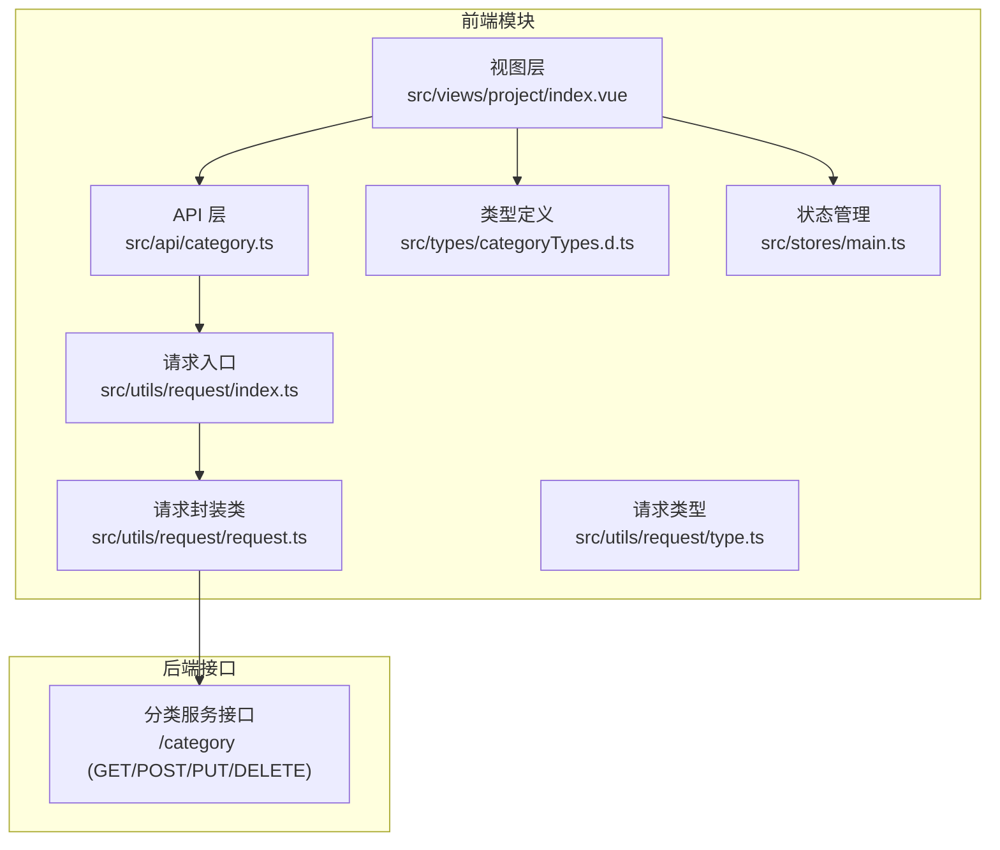
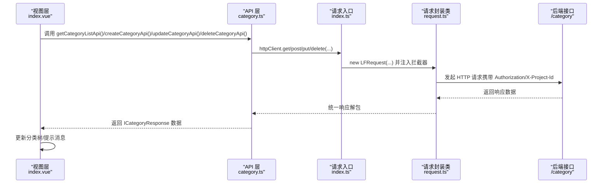
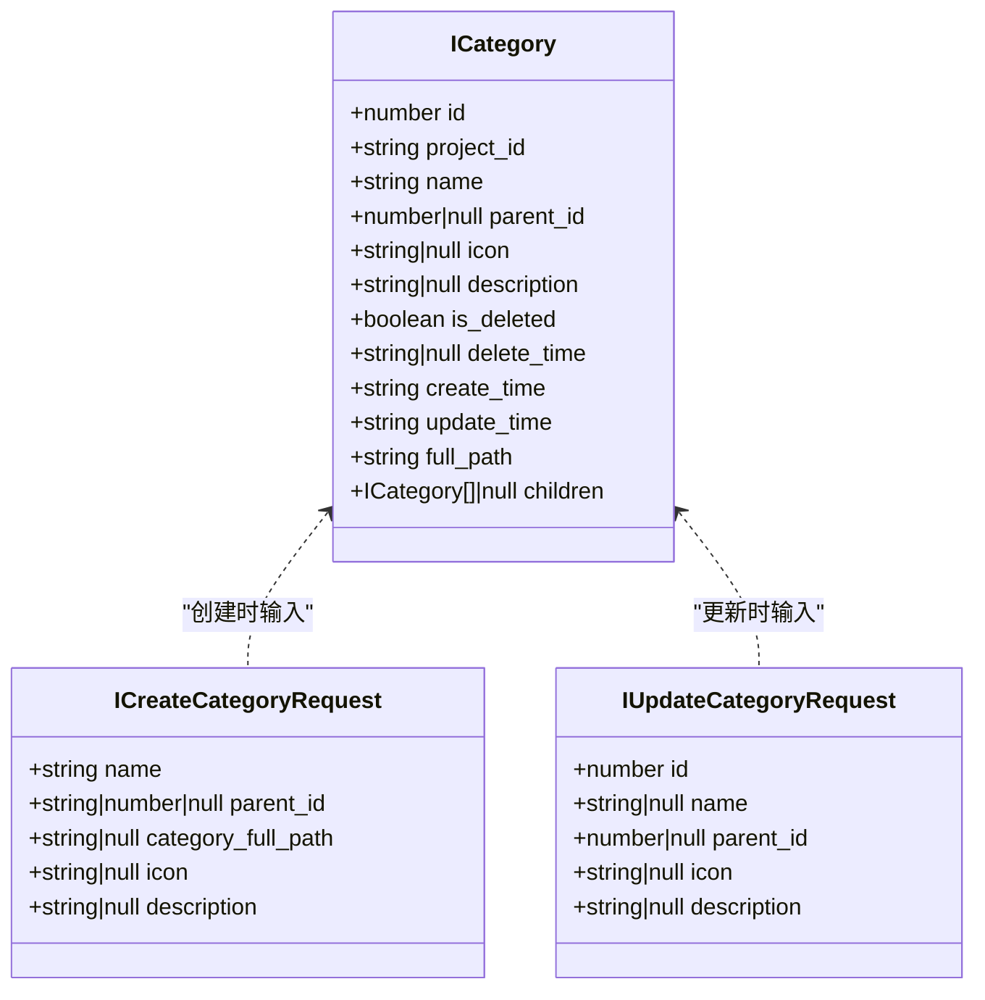
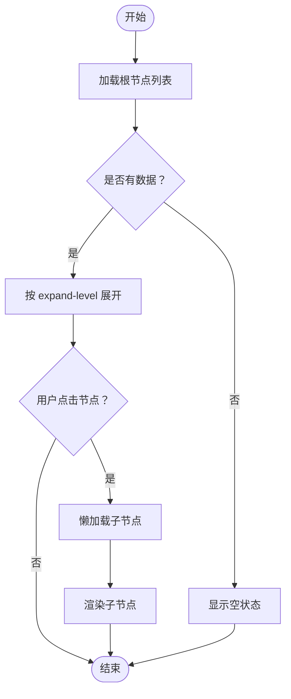
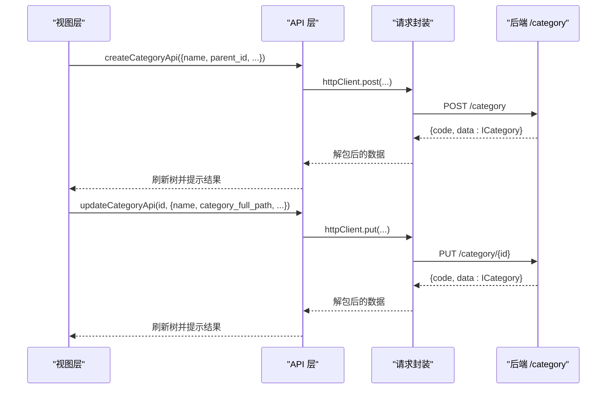
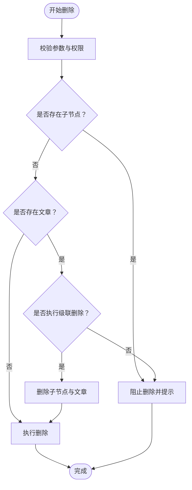
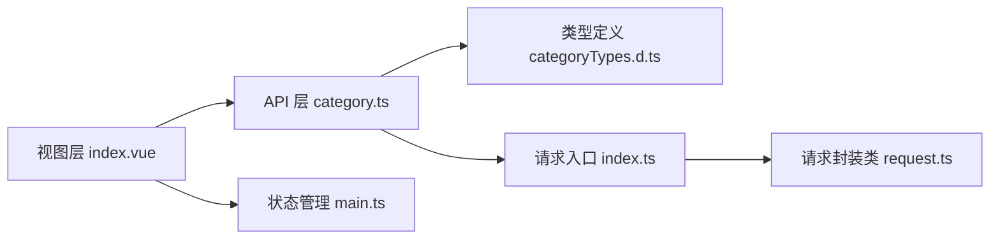

# 分类管理API模块

<cite>
**本文档引用的文件**
- [src/api/category.ts](file://src/api/category.ts)
- [src/types/categoryTypes.d.ts](file://src/types/categoryTypes.d.ts)
- [src/utils/request/index.ts](file://src/utils/request/index.ts)
- [src/utils/request/request.ts](file://src/utils/request/request.ts)
- [src/utils/request/type.ts](file://src/utils/request/type.ts)
- [src/views/project/index.vue](file://src/views/project/index.vue)
- [src/types/articleTypes.d.ts](file://src/types/articleTypes.d.ts)
- [src/stores/main.ts](file://src/stores/main.ts)
</cite>

## 目录
1. [简介](#简介)
2. [项目结构](#项目结构)
3. [核心组件](#核心组件)
4. [架构总览](#架构总览)
5. [详细组件分析](#详细组件分析)
6. [依赖分析](#依赖分析)
7. [性能考虑](#性能考虑)
8. [故障排除指南](#故障排除指南)
9. [结论](#结论)
10. [附录](#附录)

## 简介
本文件系统性梳理 LiFocus 项目中的分类管理 API 模块，围绕分类树结构的实现（父子关系、层级查询、动态加载）、分类 CRUD 接口设计（名称校验、路径生成、重复检查）、删除接口的安全机制（依赖检查、级联删除策略）、排序与权重管理（拖拽排序、优先级设置）、统计与聚合接口（内容数量统计、使用频率分析）、缓存与性能优化方案，以及分类与文章关联管理机制展开。文档同时提供数据结构定义、调用流程图与最佳实践建议，帮助开发者快速理解与扩展该模块。

## 项目结构
分类管理模块由前端 API 层、类型定义层、HTTP 请求封装层与业务视图层组成，采用清晰的分层设计，便于维护与扩展。



图表来源
- [src/views/project/index.vue](file://src/views/project/index.vue#L1-L200)
- [src/api/category.ts](file://src/api/category.ts#L1-L50)
- [src/utils/request/index.ts](file://src/utils/request/index.ts#L1-L40)
- [src/utils/request/request.ts](file://src/utils/request/request.ts#L1-L99)
- [src/utils/request/type.ts](file://src/utils/request/type.ts#L1-L15)
- [src/types/categoryTypes.d.ts](file://src/types/categoryTypes.d.ts#L1-L39)
- [src/stores/main.ts](file://src/stores/main.ts#L1-L21)

章节来源
- [src/views/project/index.vue](file://src/views/project/index.vue#L1-L200)
- [src/api/category.ts](file://src/api/category.ts#L1-L50)
- [src/utils/request/index.ts](file://src/utils/request/index.ts#L1-L40)
- [src/utils/request/request.ts](file://src/utils/request/request.ts#L1-L99)
- [src/utils/request/type.ts](file://src/utils/request/type.ts#L1-L15)
- [src/types/categoryTypes.d.ts](file://src/types/categoryTypes.d.ts#L1-L39)
- [src/stores/main.ts](file://src/stores/main.ts#L1-L21)

## 核心组件
- API 层：提供分类列表获取、创建、更新、删除四个核心接口，统一通过 HTTP 客户端发起请求。
- 类型定义层：定义分类实体、请求参数与响应结构，确保前后端数据契约一致。
- 请求封装层：集中处理鉴权头、项目 ID 注入、统一响应解包与错误处理。
- 视图层：负责分类树渲染、用户交互（增删改查）、文章列表联动展示。
- 状态管理：维护当前项目 ID，驱动分类树刷新与文章筛选。

章节来源
- [src/api/category.ts](file://src/api/category.ts#L1-L50)
- [src/types/categoryTypes.d.ts](file://src/types/categoryTypes.d.ts#L1-L39)
- [src/utils/request/index.ts](file://src/utils/request/index.ts#L1-L40)
- [src/utils/request/request.ts](file://src/utils/request/request.ts#L1-L99)
- [src/views/project/index.vue](file://src/views/project/index.vue#L1-L200)
- [src/stores/main.ts](file://src/stores/main.ts#L1-L21)

## 架构总览
分类管理的调用链路从视图层出发，经 API 层到请求封装层，最终访问后端分类服务接口；返回数据在请求封装层统一解包后回到视图层进行 UI 渲染。



图表来源
- [src/views/project/index.vue](file://src/views/project/index.vue#L54-L134)
- [src/api/category.ts](file://src/api/category.ts#L7-L49)
- [src/utils/request/index.ts](file://src/utils/request/index.ts#L12-L39)
- [src/utils/request/request.ts](file://src/utils/request/request.ts#L13-L51)

## 详细组件分析

### 分类树结构与父子关系维护
- 数据模型：分类实体包含标识字段、父节点引用、全路径、创建/更新时间等，支持 children 字段用于树形渲染。
- 父子关系：通过 parent_id 建模，根节点 parent_id 为 null；full_path 用于快速定位与路径生成。
- 动态加载：视图层使用树组件按需展开，首次加载时仅拉取顶层节点，子节点在用户展开时再请求或由后端一次性返回完整树结构。



图表来源
- [src/types/categoryTypes.d.ts](file://src/types/categoryTypes.d.ts#L4-L38)

章节来源
- [src/types/categoryTypes.d.ts](file://src/types/categoryTypes.d.ts#L1-L39)
- [src/views/project/index.vue](file://src/views/project/index.vue#L54-L64)

### 层级查询与动态加载
- 层级查询：后端接口返回树形结构，支持按层级展开；前端通过树组件的 expand-level 控制初始展开层级。
- 动态加载：当用户点击节点展开时，可触发懒加载请求以减少首屏压力；当前实现为一次性拉取树数据。



图表来源
- [src/views/project/index.vue](file://src/views/project/index.vue#L54-L64)
- [src/api/category.ts](file://src/api/category.ts#L7-L11)

章节来源
- [src/views/project/index.vue](file://src/views/project/index.vue#L54-L64)
- [src/api/category.ts](file://src/api/category.ts#L7-L11)

### 分类创建与更新接口设计
- 创建接口：接收名称、父节点 ID、图标、描述等参数；后端根据 parent_id 与 full_path 生成层级关系。
- 更新接口：支持修改名称、父节点、图标、描述；更新时携带 full_path 用于路径一致性校验。
- 名称验证与重复检查：前端对空名称进行即时校验；后端应进行同项目下同级节点名称唯一性校验（建议在后端实现）。



图表来源
- [src/api/category.ts](file://src/api/category.ts#L19-L38)
- [src/views/project/index.vue](file://src/views/project/index.vue#L66-L118)
- [src/utils/request/request.ts](file://src/utils/request/request.ts#L55-L75)

章节来源
- [src/api/category.ts](file://src/api/category.ts#L13-L38)
- [src/views/project/index.vue](file://src/views/project/index.vue#L66-L118)
- [src/types/categoryTypes.d.ts](file://src/types/categoryTypes.d.ts#L22-L38)

### 分类删除接口的安全机制
- 删除接口：携带分类 ID 与 full_path，后端据此执行删除操作。
- 依赖检查：删除前应检查是否存在子节点与绑定的文章；若存在，应拒绝删除并提示用户先清理依赖。
- 级联删除策略：可选择“禁止删除”、“仅删除无依赖节点”或“递归删除全部子节点及关联文章”，具体策略应在后端实现并明确返回语义。



图表来源
- [src/api/category.ts](file://src/api/category.ts#L44-L49)
- [src/views/project/index.vue](file://src/views/project/index.vue#L121-L134)

章节来源
- [src/api/category.ts](file://src/api/category.ts#L40-L49)
- [src/views/project/index.vue](file://src/views/project/index.vue#L121-L134)

### 分类排序与权重管理
- 拖拽排序：前端树组件支持拖拽重排，更新后端顺序字段（如 sort_weight），后端持久化并返回最新树结构。
- 优先级设置：可通过 sort_weight 或 level 字段表达优先级；前端在 UI 中直观展示优先级变化。
- 注意：当前仓库未直接暴露排序 API，建议在后端新增排序接口并配合前端拖拽事件同步。

章节来源
- [src/views/project/index.vue](file://src/views/project/index.vue#L225-L229)

### 分类统计与聚合接口
- 内容数量统计：后端提供按分类统计的文章数量接口，前端用于展示每个分类下的文章数。
- 使用频率分析：可基于文章更新时间、访问次数等指标计算分类热度，前端展示热力图或标签云。
- 当前仓库未提供专门的统计接口，建议后端新增聚合接口以支撑前端展示。

章节来源
- [src/types/articleTypes.d.ts](file://src/types/articleTypes.d.ts#L37-L61)

### 分类与文章关联管理
- 关联关系：文章实体包含 category_id 与 category 名称，用于在文章列表中展示所属分类。
- 创建文章时：需传入 category_id 与 category_full_path，后端据此建立关联并校验路径一致性。
- 更新/删除文章：若分类变更，需同步更新文章的分类字段；删除分类时需处理级联删除或迁移文章至其他分类。

```mermaid
erDiagram
CATEGORY {
int id PK
string project_id
string name
int|null parent_id
string full_path
string create_time
string update_time
}
ARTICLE {
string id PK
string category_id FK
string title
string status
string create_time
string update_time
}
CATEGORY ||--o{ ARTICLE : "拥有"
```

图表来源
- [src/types/categoryTypes.d.ts](file://src/types/categoryTypes.d.ts#L4-L17)
- [src/types/articleTypes.d.ts](file://src/types/articleTypes.d.ts#L9-L24)

章节来源
- [src/types/categoryTypes.d.ts](file://src/types/categoryTypes.d.ts#L1-L39)
- [src/types/articleTypes.d.ts](file://src/types/articleTypes.d.ts#L1-L62)

## 依赖分析
- 视图层依赖 API 层与类型定义，通过 Pinia 状态管理获取当前项目 ID 并驱动分类树刷新。
- API 层依赖 HTTP 客户端封装，统一处理鉴权与项目上下文。
- 请求封装层依赖拦截器机制，自动注入 Authorization 与 X-Project-Id，统一处理响应与错误。



图表来源
- [src/views/project/index.vue](file://src/views/project/index.vue#L1-L200)
- [src/api/category.ts](file://src/api/category.ts#L1-L50)
- [src/types/categoryTypes.d.ts](file://src/types/categoryTypes.d.ts#L1-L39)
- [src/utils/request/index.ts](file://src/utils/request/index.ts#L1-L40)
- [src/utils/request/request.ts](file://src/utils/request/request.ts#L1-L99)
- [src/stores/main.ts](file://src/stores/main.ts#L1-L21)

章节来源
- [src/views/project/index.vue](file://src/views/project/index.vue#L1-L200)
- [src/api/category.ts](file://src/api/category.ts#L1-L50)
- [src/utils/request/index.ts](file://src/utils/request/index.ts#L1-L40)
- [src/utils/request/request.ts](file://src/utils/request/request.ts#L1-L99)
- [src/stores/main.ts](file://src/stores/main.ts#L1-L21)

## 性能考虑
- 请求缓存：对分类树数据进行短期缓存，避免频繁刷新；在切换项目或手动刷新时清空缓存。
- 懒加载：树节点按需加载，减少首屏数据量；结合分页与虚拟滚动优化长列表渲染。
- 批量更新：拖拽排序时采用批量请求合并，降低网络往返次数。
- 错误重试：对网络异常进行指数退避重试，提升弱网环境下的稳定性。
- 前端去抖：对高频输入（如搜索）进行去抖处理，减少无效请求。

## 故障排除指南
- 登录状态异常：请求拦截器检测到 401 时清除本地 Token 并跳转登录页。
- 无权限或参数错误：后端返回非 200 时统一提示错误信息；前端捕获异常并展示友好提示。
- 分类树不刷新：确认当前项目 ID 已正确设置，且请求头已注入 X-Project-Id；必要时手动触发刷新。

章节来源
- [src/utils/request/request.ts](file://src/utils/request/request.ts#L26-L39)
- [src/utils/request/index.ts](file://src/utils/request/index.ts#L16-L36)
- [src/stores/main.ts](file://src/stores/main.ts#L10-L14)

## 结论
分类管理 API 模块通过清晰的分层设计实现了树形结构的增删改查、与文章的关联管理，并具备良好的扩展性。建议后续完善后端的排序、统计与安全删除策略，前端增强缓存与性能优化，以进一步提升用户体验与系统稳定性。

## 附录
- 使用示例（路径参考）
  - 获取分类树：[getCategoryListApi](file://src/api/category.ts#L7-L11)
  - 创建分类：[createCategoryApi](file://src/api/category.ts#L19-L24)
  - 更新分类：[updateCategoryApi](file://src/api/category.ts#L33-L38)
  - 删除分类：[deleteCategoryApi](file://src/api/category.ts#L44-L49)
  - 视图层调用示例：[index.vue](file://src/views/project/index.vue#L54-L134)
- 类型定义（路径参考）
  - 分类实体：[ICategory](file://src/types/categoryTypes.d.ts#L4-L17)
  - 创建请求：[ICreateCategoryRequest](file://src/types/categoryTypes.d.ts#L23-L29)
  - 更新请求：[IUpdateCategoryRequest](file://src/types/categoryTypes.d.ts#L32-L38)
  - 文章实体与过滤器：[IArticle / IArticleFilter](file://src/types/articleTypes.d.ts#L9-L61)