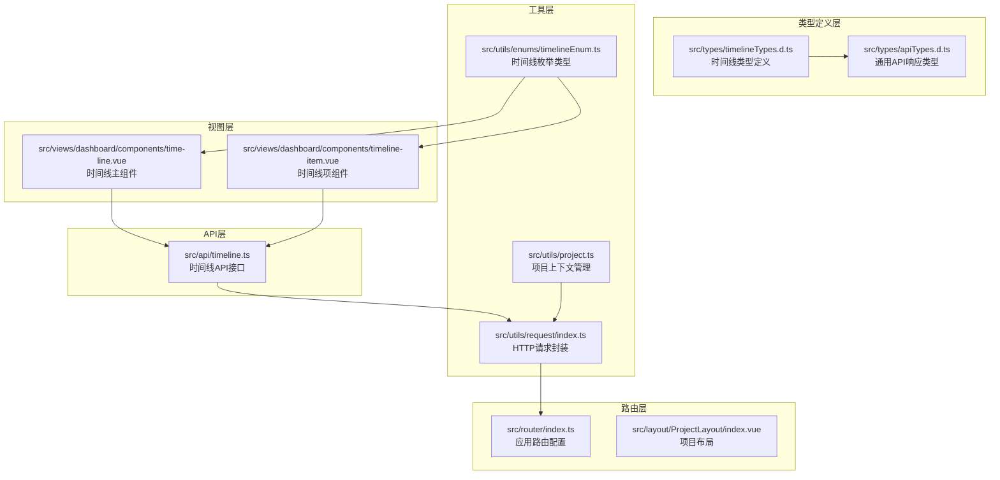
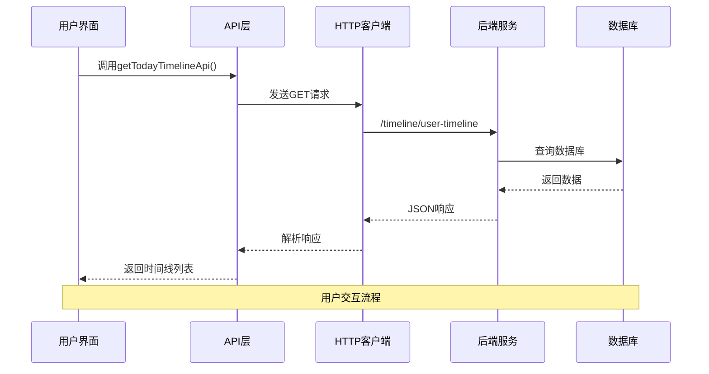
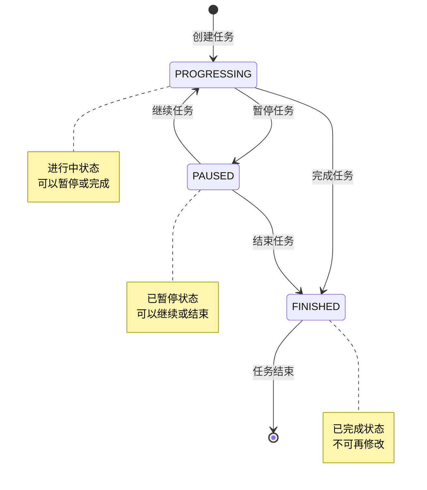
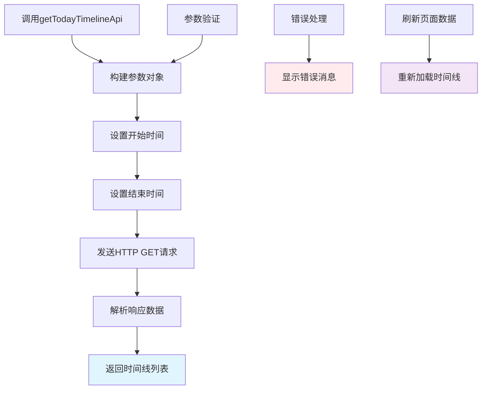
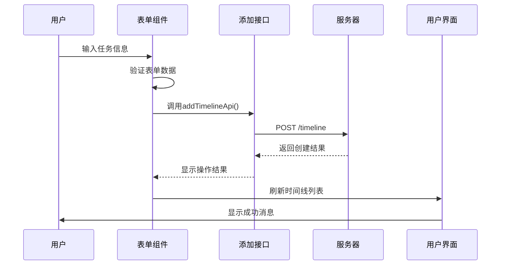
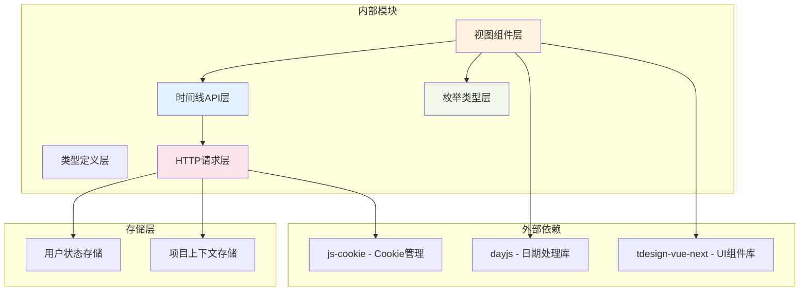
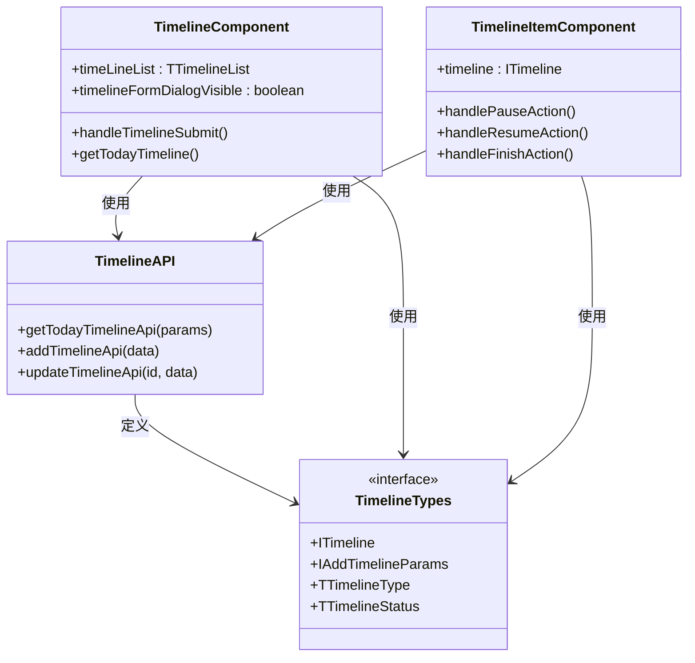
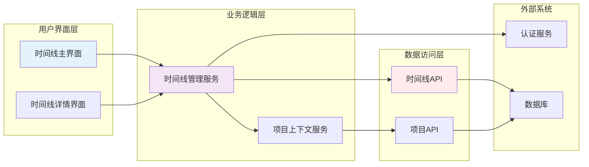

# 时间线管理API模块

<cite>
**本文档引用的文件**
- [src/api/timeline.ts](file://src/api/timeline.ts)
- [src/types/timelineTypes.d.ts](file://src/types/timelineTypes.d.ts)
- [src/utils/enums/timelineEnum.ts](file://src/utils/enums/timelineEnum.ts)
- [src/views/dashboard/components/time-line.vue](file://src/views/dashboard/components/time-line.vue)
- [src/views/dashboard/components/timeline-item.vue](file://src/views/dashboard/components/timeline-item.vue)
- [src/utils/request/index.ts](file://src/utils/request/index.ts)
- [src/types/apiTypes.d.ts](file://src/types/apiTypes.d.ts)
- [src/utils/project.ts](file://src/utils/project.ts)
- [src/router/index.ts](file://src/router/index.ts)
- [src/layout/ProjectLayout/index.vue](file://src/layout/ProjectLayout/index.vue)
</cite>

## 目录
1. [简介](#简介)
2. [项目结构](#项目结构)
3. [核心组件](#核心组件)
4. [架构概览](#架构概览)
5. [详细组件分析](#详细组件分析)
6. [依赖关系分析](#依赖关系分析)
7. [性能考虑](#性能考虑)
8. [故障排除指南](#故障排除指南)
9. [结论](#结论)
10. [附录](#附录)

## 简介

时间线管理API模块是LiFocus项目中的核心功能模块之一，负责管理用户的时间线任务和活动。该模块提供了完整的CRUD操作，包括时间线的创建、编辑、查询、状态管理和统计分析功能。系统支持多种时间线类型（工作、学习、娱乐等），并提供状态跟踪（进行中、暂停、完成）和进度管理。

该模块采用前后端分离架构，前端使用Vue 3 + TypeScript构建，后端通过HTTP客户端与API服务器通信。模块设计遵循响应式编程原则，支持实时数据更新和状态同步。

## 项目结构

时间线管理模块在项目中的组织结构如下：



**图表来源**
- [src/api/timeline.ts](file://src/api/timeline.ts#L1-L44)
- [src/types/timelineTypes.d.ts](file://src/types/timelineTypes.d.ts#L1-L39)
- [src/utils/enums/timelineEnum.ts](file://src/utils/enums/timelineEnum.ts#L1-L18)
- [src/views/dashboard/components/time-line.vue](file://src/views/dashboard/components/time-line.vue#L1-L151)

**章节来源**
- [src/api/timeline.ts](file://src/api/timeline.ts#L1-L44)
- [src/types/timelineTypes.d.ts](file://src/types/timelineTypes.d.ts#L1-L39)
- [src/utils/enums/timelineEnum.ts](file://src/utils/enums/timelineEnum.ts#L1-L18)

## 核心组件

### API接口层

时间线API模块提供了三个核心接口：

1. **获取今日时间线** - 查询指定日期范围内的所有时间线任务
2. **添加时间线** - 创建新的时间线任务
3. **更新时间线** - 修改现有时间线任务的状态和属性

### 数据类型定义

模块定义了完整的数据模型，包括时间线实体、过滤条件和API响应格式。

### 枚举类型

系统定义了时间线类型和状态的枚举，确保数据的一致性和类型安全。

**章节来源**
- [src/api/timeline.ts](file://src/api/timeline.ts#L1-L44)
- [src/types/timelineTypes.d.ts](file://src/types/timelineTypes.d.ts#L1-L39)
- [src/utils/enums/timelineEnum.ts](file://src/utils/enums/timelineEnum.ts#L1-L18)

## 架构概览

时间线管理模块采用分层架构设计，各层职责明确，耦合度低，便于维护和扩展。



**图表来源**
- [src/api/timeline.ts](file://src/api/timeline.ts#L10-L18)
- [src/utils/request/index.ts](file://src/utils/request/index.ts#L12-L39)

### 状态管理流程



**图表来源**
- [src/utils/enums/timelineEnum.ts](file://src/utils/enums/timelineEnum.ts#L13-L17)
- [src/types/timelineTypes.d.ts](file://src/types/timelineTypes.d.ts#L5-L5)

## 详细组件分析

### 时间线API接口

#### 获取今日时间线接口

该接口用于查询指定日期范围内的所有时间线任务，支持按时间范围过滤。



**图表来源**
- [src/api/timeline.ts](file://src/api/timeline.ts#L10-L18)
- [src/views/dashboard/components/time-line.vue](file://src/views/dashboard/components/time-line.vue#L71-L86)

#### 添加时间线接口

该接口用于创建新的时间线任务，支持基本的任务信息输入。



**图表来源**
- [src/api/timeline.ts](file://src/api/timeline.ts#L28-L33)
- [src/views/dashboard/components/time-line.vue](file://src/views/dashboard/components/time-line.vue#L48-L65)

#### 更新时间线接口

该接口用于更新现有时间线任务的状态，支持暂停、继续和完成操作。

**章节来源**
- [src/api/timeline.ts](file://src/api/timeline.ts#L1-L44)

### 时间线数据模型

#### ITimeline接口定义

时间线实体包含了完整的任务信息和元数据：

| 字段名 | 类型 | 必填 | 描述 |
|--------|------|------|------|
| id | string | 是 | 时间线唯一标识符 |
| title | string | 是 | 任务标题 |
| type | TTimelineType | 是 | 任务类型（WORK/LIFE/LEARNING等） |
| content | string | 是 | 任务内容描述 |
| status | TTimelineStatus | 是 | 任务状态（PROGRESSING/PAUSED/FINISHED） |
| description | string | 否 | 详细描述信息 |
| importance | number | 是 | 重要程度评分 |
| is_summaried | boolean | 是 | 是否已总结 |
| start_time | string | 是 | 任务开始时间 |
| end_time | string | 否 | 任务结束时间 |
| create_time | string | 是 | 创建时间 |
| update_time | string | 是 | 更新时间 |

#### IAddTimelineParams接口定义

新增任务的参数模型：

| 字段名 | 类型 | 必填 | 描述 |
|--------|------|------|------|
| title | string | 是 | 任务标题 |
| type | TTimelineType | 是 | 任务类型 |
| content | string | 是 | 任务内容 |
| description | string | 否 | 详细描述 |

**章节来源**
- [src/types/timelineTypes.d.ts](file://src/types/timelineTypes.d.ts#L6-L26)

### 枚举类型定义

#### 时间线类型枚举

系统定义了九种时间线类型，每种类型都有对应的标签和主题样式：

| 类型值 | 中文标签 | 主题样式 | 使用场景 |
|--------|----------|----------|----------|
| WORK | 工作 | warning | 工作相关任务 |
| LIFE | 生活 | success | 日常生活事务 |
| LEARNING | 学习 | primary | 教育培训活动 |
| ENTERTAINMENT | 娱乐 | success | 娱乐休闲活动 |
| HEALTH | 健康 | success | 健身运动项目 |
| FINANCE | 财务 | primary | 财务管理事务 |
| TRAVEL | 旅行 | primary | 出游旅行计划 |
| MEETING | 会议 | warning | 会议活动安排 |
| REMINDER | 提醒 | success | 重要事项提醒 |

#### 时间线状态枚举

三种核心状态，用于跟踪任务执行进度：

| 状态值 | 中文标签 | 圆点颜色 | 状态含义 |
|--------|----------|----------|----------|
| PROGRESSING | 进行中 | primary | 任务正在执行 |
| PAUSED | 已暂停 | warning | 任务暂时停止 |
| FINISHED | 已完成 | success | 任务执行完毕 |

**章节来源**
- [src/utils/enums/timelineEnum.ts](file://src/utils/enums/timelineEnum.ts#L1-L18)

### 视图组件分析

#### 时间线主组件

时间线主组件负责展示和管理所有时间线任务，具有以下功能特性：

1. **日期选择器** - 支持按日切换查看不同日期的任务
2. **任务列表展示** - 使用时间轴组件展示任务列表
3. **表单弹窗** - 提供任务创建表单
4. **实时刷新** - 自动刷新最新的时间线数据

#### 时间线项组件

每个时间线项都包含以下交互功能：

1. **状态标签** - 显示任务类型和当前状态
2. **悬停操作面板** - 在鼠标悬停时显示操作按钮
3. **状态控制** - 支持暂停、继续、结束操作
4. **响应式设计** - 根据任务状态动态调整显示效果

**章节来源**
- [src/views/dashboard/components/time-line.vue](file://src/views/dashboard/components/time-line.vue#L1-L151)
- [src/views/dashboard/components/timeline-item.vue](file://src/views/dashboard/components/timeline-item.vue#L1-L151)

## 依赖关系分析

时间线管理模块的依赖关系清晰，层次分明：



**图表来源**
- [src/views/dashboard/components/time-line.vue](file://src/views/dashboard/components/time-line.vue#L1-L151)
- [src/api/timeline.ts](file://src/api/timeline.ts#L1-L44)
- [src/utils/request/index.ts](file://src/utils/request/index.ts#L1-L40)

### 组件间交互



**图表来源**
- [src/api/timeline.ts](file://src/api/timeline.ts#L1-L44)
- [src/types/timelineTypes.d.ts](file://src/types/timelineTypes.d.ts#L1-L39)
- [src/views/dashboard/components/time-line.vue](file://src/views/dashboard/components/time-line.vue#L1-L151)
- [src/views/dashboard/components/timeline-item.vue](file://src/views/dashboard/components/timeline-item.vue#L1-L151)

**章节来源**
- [src/api/timeline.ts](file://src/api/timeline.ts#L1-L44)
- [src/types/timelineTypes.d.ts](file://src/types/timelineTypes.d.ts#L1-L39)
- [src/views/dashboard/components/time-line.vue](file://src/views/dashboard/components/time-line.vue#L1-L151)

## 性能考虑

### 数据缓存策略

1. **本地状态缓存** - 使用Vue响应式数据缓存当前页面的数据
2. **自动刷新机制** - 通过watch监听日期变化自动刷新数据
3. **防抖处理** - 避免频繁的API调用造成性能问题

### 网络优化

1. **请求拦截器** - 统一处理认证令牌和项目上下文
2. **超时控制** - 设置合理的请求超时时间（60秒）
3. **错误重试** - 基础框架支持，可根据需要扩展

### 渲染优化

1. **虚拟滚动** - 大量数据时可考虑实现虚拟滚动
2. **懒加载** - 图片和组件的懒加载
3. **组件复用** - 合理的组件拆分和复用

## 故障排除指南

### 常见问题及解决方案

#### 登录状态异常

**问题描述** - 请求时出现登录状态异常提示

**解决方案** - 
1. 检查本地存储的访问令牌是否有效
2. 确认项目ID是否正确设置
3. 重新登录系统

#### API请求失败

**问题描述** - 时间线数据无法加载或保存失败

**解决方案** - 
1. 检查网络连接状态
2. 验证API端点URL配置
3. 查看浏览器开发者工具中的错误信息

#### 数据格式错误

**问题描述** - 日期格式或状态值不正确

**解决方案** - 
1. 确保使用正确的枚举值
2. 验证日期字符串格式
3. 检查必填字段是否完整

**章节来源**
- [src/utils/request/index.ts](file://src/utils/request/index.ts#L32-L35)
- [src/views/dashboard/components/time-line.vue](file://src/views/dashboard/components/time-line.vue#L49-L64)

## 结论

时间线管理API模块是一个设计良好、功能完整的任务管理系统。模块采用了现代化的前端技术栈，具有以下优势：

1. **清晰的架构设计** - 分层明确，职责分离
2. **类型安全** - 全面的TypeScript类型定义
3. **用户体验** - 响应式设计和直观的操作界面
4. **可扩展性** - 良好的代码组织便于功能扩展

模块目前支持基础的时间线管理功能，包括任务创建、状态管理和数据展示。未来可以考虑添加更多高级功能，如任务提醒、统计分析、团队协作等。

## 附录

### API使用示例

#### 获取今日时间线

```typescript
// 示例：获取2024年1月1日的时间线
const params = {
  create_start_time: '2024-01-01 00:00:00',
  create_end_time: '2024-01-01 23:59:59'
}

getTodayTimelineApi(params)
  .then(response => {
    console.log('时间线数据:', response.data)
  })
  .catch(error => {
    console.error('获取失败:', error)
  })
```

#### 创建新任务

```typescript
// 示例：创建一个学习任务
const newTask = {
  title: '学习Vue 3',
  type: 'LEARNING',
  content: '学习Vue 3的新特性和组合式API',
  description: '深入理解响应式原理和性能优化'
}

addTimelineApi(newTask)
  .then(response => {
    if (response.code === 200) {
      console.log('任务创建成功')
    }
  })
```

#### 更新任务状态

```typescript
// 示例：暂停进行中的任务
updateTimelineApi(taskId, { status: 'PAUSED' })
  .then(response => {
    if (response.code === 200) {
      console.log('任务已暂停')
    }
  })
```

### 最佳实践

1. **数据验证** - 始终验证用户输入的数据格式
2. **错误处理** - 实现完善的错误处理和用户反馈
3. **性能优化** - 合理使用缓存和防抖机制
4. **代码组织** - 保持模块间的松耦合设计
5. **文档维护** - 及时更新API文档和使用说明

### 集成关系

时间线模块与项目系统的集成关系：



**图表来源**
- [src/views/dashboard/components/time-line.vue](file://src/views/dashboard/components/time-line.vue#L1-L151)
- [src/layout/ProjectLayout/index.vue](file://src/layout/ProjectLayout/index.vue#L1-L135)
- [src/utils/request/index.ts](file://src/utils/request/index.ts#L1-L40)