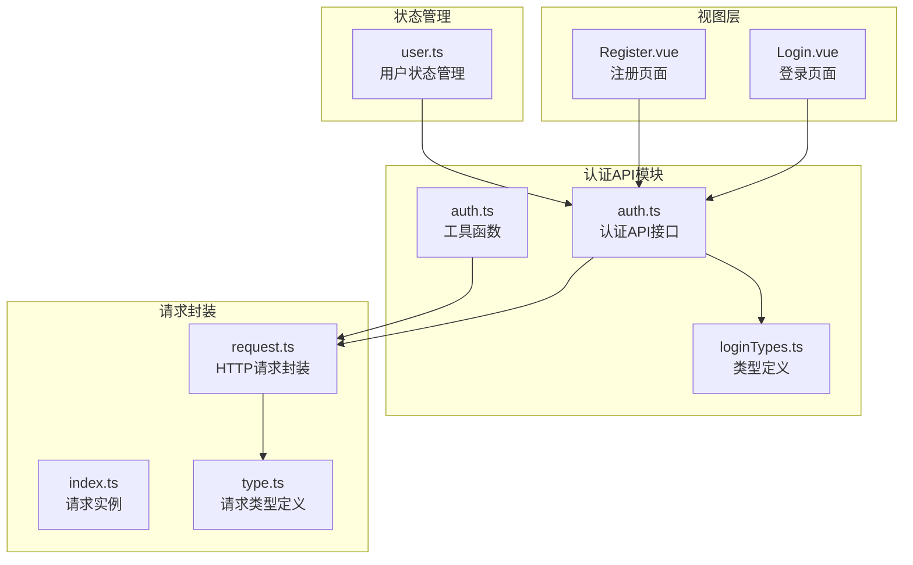
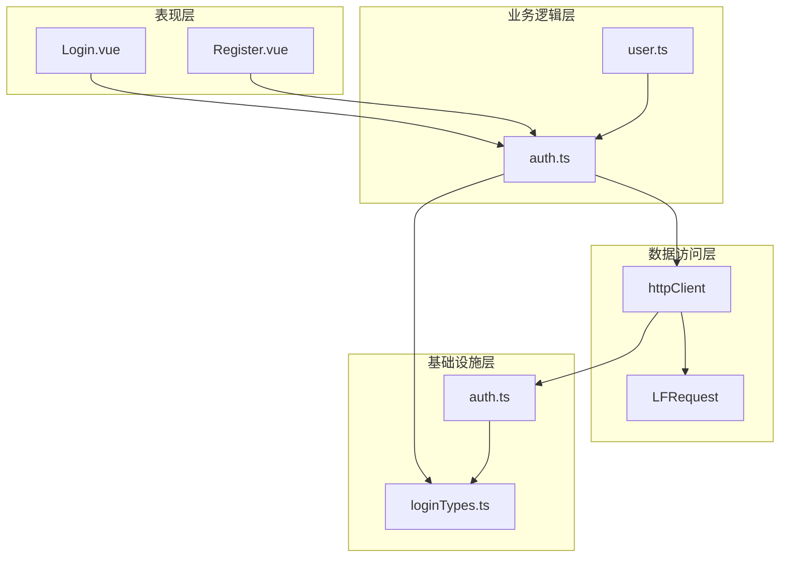
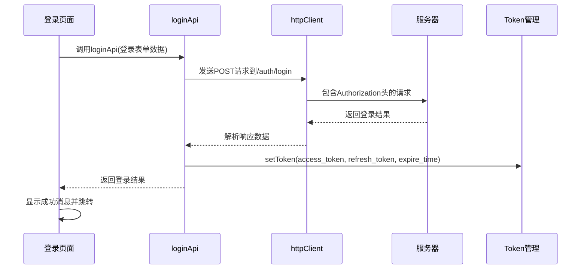
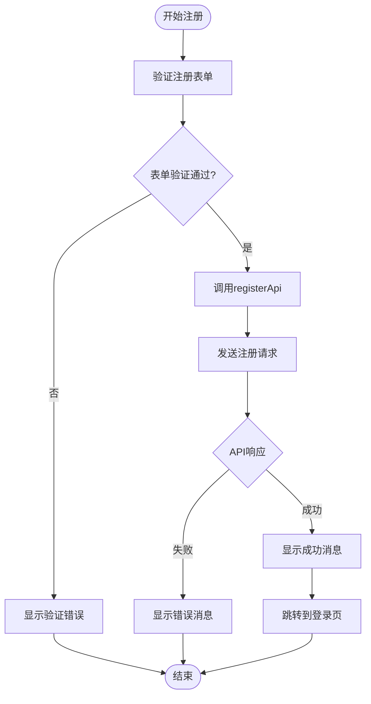
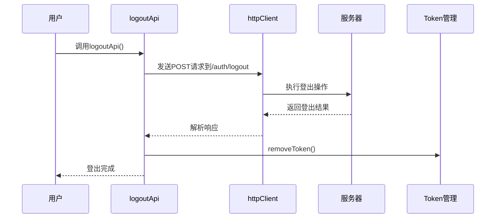
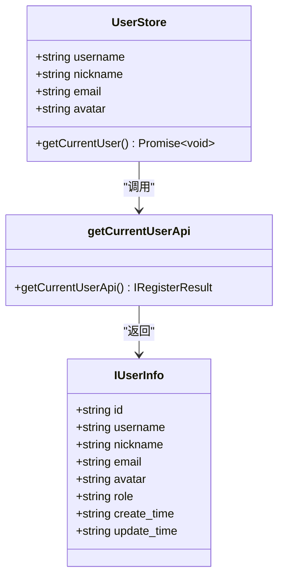
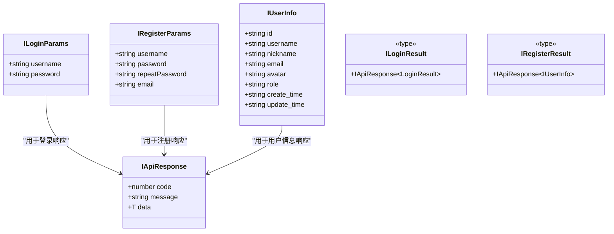
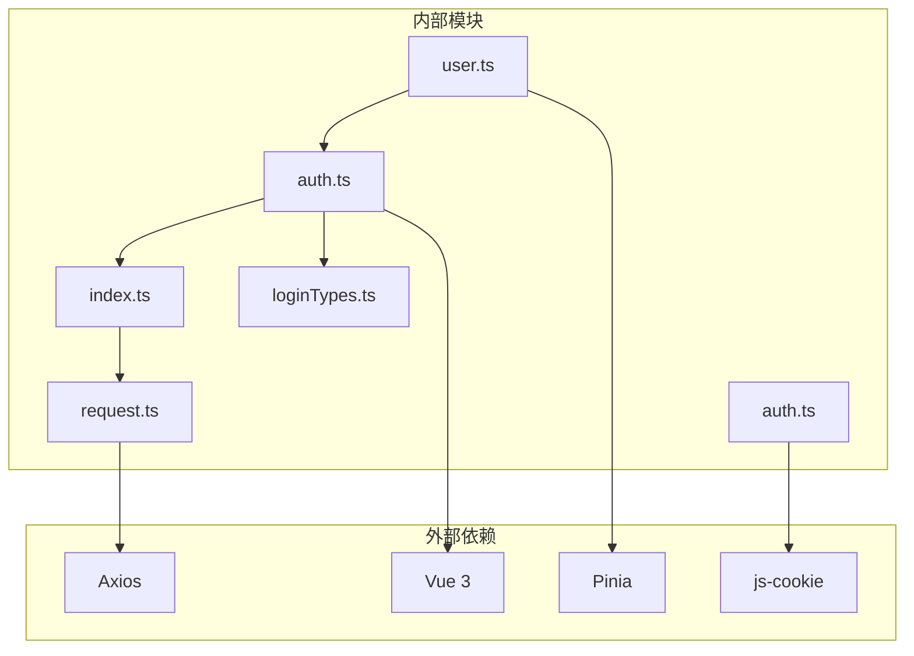

# 认证API模块

<cite>
**本文档引用的文件**
- [src/api/auth.ts](file://src/api/auth.ts)
- [src/types/loginTypes.ts](file://src/types/loginTypes.ts)
- [src/types/apiTypes.d.ts](file://src/types/apiTypes.d.ts)
- [src/utils/auth.ts](file://src/utils/auth.ts)
- [src/utils/request/request.ts](file://src/utils/request/request.ts)
- [src/utils/request/index.ts](file://src/utils/request/index.ts)
- [src/utils/request/type.ts](file://src/utils/request/type.ts)
- [src/stores/user.ts](file://src/stores/user.ts)
- [src/views/auth/Login.vue](file://src/views/auth/Login.vue)
- [src/views/auth/Register.vue](file://src/views/auth/Register.vue)
</cite>

## 目录
1. [简介](#简介)
2. [项目结构](#项目结构)
3. [核心组件](#核心组件)
4. [架构概览](#架构概览)
5. [详细组件分析](#详细组件分析)
6. [依赖关系分析](#依赖关系分析)
7. [性能考虑](#性能考虑)
8. [故障排除指南](#故障排除指南)
9. [结论](#结论)

## 简介

认证API模块是LiFocus Web应用的核心功能模块，负责处理用户身份验证相关的所有操作。该模块提供了完整的认证解决方案，包括用户登录、注册、登出以及当前用户信息查询等功能。模块采用现代化的前端架构设计，结合TypeScript类型系统确保代码的类型安全性和可维护性。

## 项目结构

认证API模块在项目中的组织结构清晰合理，遵循了功能模块化的开发原则：

**图表来源**
- [src/api/auth.ts](file://src/api/auth.ts#L1-L41)
- [src/types/loginTypes.ts](file://src/types/loginTypes.ts#L1-L47)
- [src/utils/auth.ts](file://src/utils/auth.ts#L1-L71)

**章节来源**
- [src/api/auth.ts](file://src/api/auth.ts#L1-L41)
- [src/types/loginTypes.ts](file://src/types/loginTypes.ts#L1-L47)
- [src/utils/auth.ts](file://src/utils/auth.ts#L1-L71)

## 核心组件

认证API模块由多个核心组件构成，每个组件都有明确的职责和功能：

### 1. 认证API接口层
- **loginApi**: 处理用户登录请求
- **registerApi**: 处理用户注册请求  
- **logoutApi**: 处理用户登出请求
- **getCurrentUserApi**: 获取当前用户信息

### 2. 类型定义系统
- **ILoginParams**: 登录参数接口
- **ILoginResult**: 登录结果接口
- **IRegisterParams**: 注册参数接口
- **IRegisterResult**: 注册结果接口
- **IUserInfo**: 用户信息接口

### 3. 工具函数库
- **setToken**: 设置访问令牌
- **getToken**: 获取访问令牌
- **removeToken**: 移除访问令牌
- **getRefreshToken**: 获取刷新令牌

### 4. 状态管理
- **useUserStore**: 用户状态管理store

**章节来源**
- [src/api/auth.ts](file://src/api/auth.ts#L1-L41)
- [src/types/loginTypes.ts](file://src/types/loginTypes.ts#L1-L47)
- [src/utils/auth.ts](file://src/utils/auth.ts#L1-L71)
- [src/stores/user.ts](file://src/stores/user.ts#L1-L29)

## 架构概览

认证API模块采用了分层架构设计，确保了代码的可维护性和扩展性：

**图表来源**
- [src/views/auth/Login.vue](file://src/views/auth/Login.vue#L1-L138)
- [src/views/auth/Register.vue](file://src/views/auth/Register.vue#L1-L137)
- [src/api/auth.ts](file://src/api/auth.ts#L1-L41)
- [src/stores/user.ts](file://src/stores/user.ts#L1-L29)
- [src/utils/request/index.ts](file://src/utils/request/index.ts#L1-L40)
- [src/utils/request/request.ts](file://src/utils/request/request.ts#L1-L99)
- [src/utils/auth.ts](file://src/utils/auth.ts#L1-L71)
- [src/types/loginTypes.ts](file://src/types/loginTypes.ts#L1-L47)

## 详细组件分析

### 登录接口 (loginApi)

登录接口是认证系统的核心入口点，负责处理用户的登录请求：

**图表来源**
- [src/views/auth/Login.vue](file://src/views/auth/Login.vue#L38-L80)
- [src/api/auth.ts](file://src/api/auth.ts#L7-L12)
- [src/utils/auth.ts](file://src/utils/auth.ts#L12-L24)

#### 实现细节

登录接口的实现具有以下特点：
- **表单验证**: 在视图层使用t-design表单组件进行实时验证
- **数据传输**: 通过httpClient发送POST请求
- **响应处理**: 解析服务器返回的登录结果
- **令牌管理**: 自动存储访问令牌和刷新令牌

**章节来源**
- [src/api/auth.ts](file://src/api/auth.ts#L7-L12)
- [src/views/auth/Login.vue](file://src/views/auth/Login.vue#L38-L80)

### 注册接口 (registerApi)

注册接口负责新用户的账户创建过程：

**图表来源**
- [src/views/auth/Register.vue](file://src/views/auth/Register.vue#L42-L62)
- [src/api/auth.ts](file://src/api/auth.ts#L17-L22)

#### 实现细节

注册接口的验证规则包括：
- **用户名**: 必填字段
- **密码**: 至少8位字符，包含字母和数字
- **确认密码**: 必须与密码一致
- **邮箱**: 格式验证
- **同意条款**: 必须勾选同意

**章节来源**
- [src/api/auth.ts](file://src/api/auth.ts#L17-L22)
- [src/views/auth/Register.vue](file://src/views/auth/Register.vue#L15-L62)

### 登出接口 (logoutApi)

登出接口负责清理用户会话状态：

**图表来源**
- [src/api/auth.ts](file://src/api/auth.ts#L27-L31)
- [src/utils/auth.ts](file://src/utils/auth.ts#L63-L70)

#### 实现机制

登出操作包括：
- **本地清理**: 清除localStorage和sessionStorage中的用户数据
- **服务器同步**: 调用后端登出接口终止服务器端会话
- **状态重置**: 将用户状态重置为空对象

**章节来源**
- [src/api/auth.ts](file://src/api/auth.ts#L27-L31)
- [src/utils/auth.ts](file://src/utils/auth.ts#L63-L70)

### 当前用户信息查询 (getCurrentUserApi)

用户信息查询接口负责获取已登录用户的基本信息：

**图表来源**
- [src/stores/user.ts](file://src/stores/user.ts#L4-L26)
- [src/api/auth.ts](file://src/api/auth.ts#L36-L40)
- [src/types/loginTypes.ts](file://src/types/loginTypes.ts#L35-L44)

#### 数据获取和缓存策略

用户信息查询采用以下策略：
- **状态持久化**: 使用Pinia持久化存储用户信息
- **自动更新**: 登录成功后自动拉取用户信息
- **本地缓存**: 信息存储在localStorage中

**章节来源**
- [src/stores/user.ts](file://src/stores/user.ts#L11-L19)
- [src/api/auth.ts](file://src/api/auth.ts#L36-L40)

### TypeScript类型定义

认证模块的类型系统确保了代码的类型安全：

**图表来源**
- [src/types/loginTypes.ts](file://src/types/loginTypes.ts#L6-L46)
- [src/types/apiTypes.d.ts](file://src/types/apiTypes.d.ts#L2-L6)

#### 接口设计特点

- **ILoginParams**: 简洁的登录凭据接口
- **IRegisterParams**: 包含完整注册信息的接口
- **IUserInfo**: 完整的用户信息模型
- **IApiResponse**: 统一的API响应格式

**章节来源**
- [src/types/loginTypes.ts](file://src/types/loginTypes.ts#L1-L47)
- [src/types/apiTypes.d.ts](file://src/types/apiTypes.d.ts#L1-L7)

## 依赖关系分析

认证API模块的依赖关系清晰明确，遵循了依赖倒置原则：

**图表来源**
- [src/api/auth.ts](file://src/api/auth.ts#L1-L2)
- [src/utils/auth.ts](file://src/utils/auth.ts#L1)
- [src/stores/user.ts](file://src/stores/user.ts#L1)
- [src/utils/request/index.ts](file://src/utils/request/index.ts#L1-L6)
- [src/utils/request/request.ts](file://src/utils/request/request.ts#L1-L3)

### 关键依赖关系

1. **HTTP客户端依赖**: 所有API接口都依赖于统一的HTTP客户端
2. **类型系统依赖**: 所有接口都使用TypeScript类型定义
3. **状态管理依赖**: 用户状态管理依赖于Pinia
4. **工具函数依赖**: 令牌管理依赖于js-cookie

**章节来源**
- [src/api/auth.ts](file://src/api/auth.ts#L1-L2)
- [src/utils/request/index.ts](file://src/utils/request/index.ts#L1-L6)
- [src/stores/user.ts](file://src/stores/user.ts#L1)

## 性能考虑

认证API模块在设计时充分考虑了性能优化：

### 1. 请求缓存策略
- **令牌缓存**: 使用Cookie和SessionStorage双重缓存机制
- **用户信息缓存**: 通过Pinia持久化存储用户信息
- **白名单机制**: 对公共接口设置白名单避免不必要的认证检查

### 2. 错误处理优化
- **统一错误处理**: HTTP请求拦截器统一处理401错误
- **快速失败**: 表单验证在客户端快速执行
- **用户体验**: 错误消息通过UI组件及时反馈

### 3. 内存管理
- **及时清理**: 登出时彻底清理所有缓存数据
- **状态重置**: 用户状态在登出后完全重置

## 故障排除指南

### 常见问题及解决方案

#### 1. 登录失败
**症状**: 登录后立即被重定向到登录页
**原因**: 令牌过期或无效
**解决方案**: 
- 检查服务器响应状态码
- 验证用户名密码是否正确
- 清除浏览器缓存后重试

#### 2. 注册失败
**症状**: 注册表单提交后无响应
**原因**: 前端验证未通过或后端服务异常
**解决方案**:
- 检查控制台是否有JavaScript错误
- 验证网络连接状态
- 确认服务器端注册接口可用

#### 3. 用户信息获取失败
**症状**: 页面加载后用户信息为空
**原因**: 未正确设置认证令牌
**解决方案**:
- 检查localStorage中是否有用户数据
- 验证令牌是否正确存储
- 确认用户已成功登录

#### 4. 会话超时
**症状**: 访问受保护资源时被重定向
**原因**: 认证令牌过期
**解决方案**:
- 检查令牌过期时间设置
- 实现自动刷新机制
- 提供重新登录提示

**章节来源**
- [src/utils/request/request.ts](file://src/utils/request/request.ts#L31-L38)
- [src/utils/auth.ts](file://src/utils/auth.ts#L63-L70)

## 结论

认证API模块是一个设计精良、功能完整的用户身份验证解决方案。模块采用现代化的前端技术栈，结合TypeScript类型系统确保了代码的质量和可维护性。通过清晰的分层架构和完善的错误处理机制，为用户提供流畅的认证体验。

### 主要优势

1. **类型安全**: 完整的TypeScript类型定义确保编译时类型检查
2. **模块化设计**: 清晰的功能分离便于维护和扩展
3. **用户体验**: 完善的表单验证和错误处理提升用户体验
4. **安全性**: 合理的令牌管理和会话控制确保应用安全

### 改进建议

1. **密码加密**: 可以考虑在客户端对密码进行额外的加密处理
2. **双因素认证**: 可以扩展支持双因素认证机制
3. **审计日志**: 可以添加认证操作的审计日志功能
4. **多设备同步**: 可以实现多设备间的会话同步

该模块为LiFocus Web应用提供了坚实的基础，为后续功能扩展奠定了良好的技术基础。