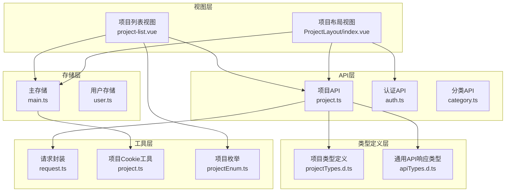
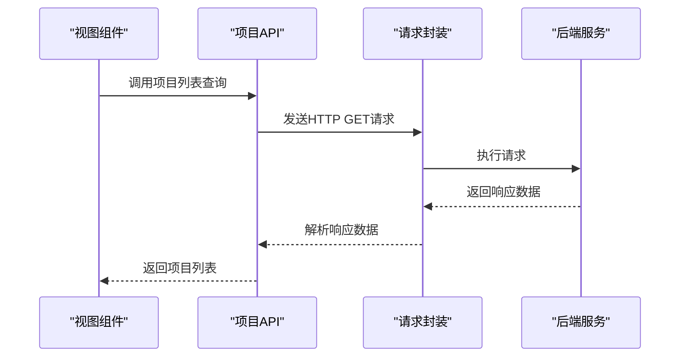
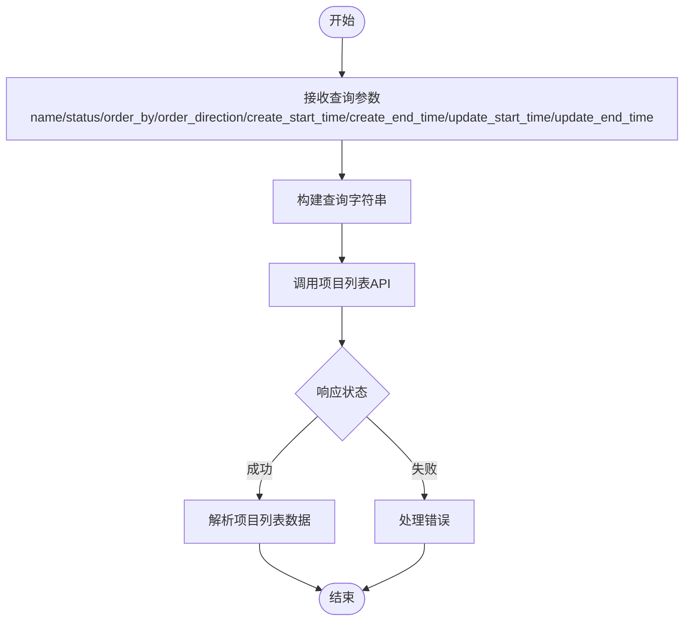
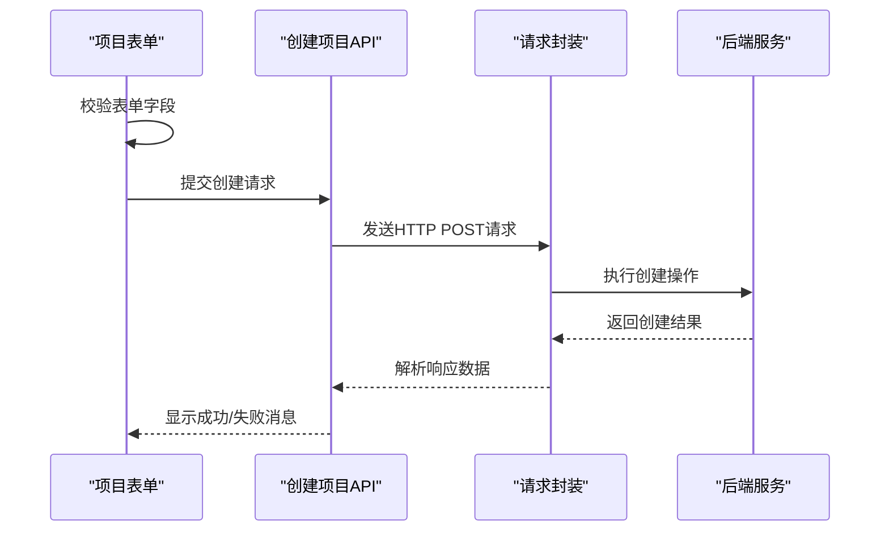
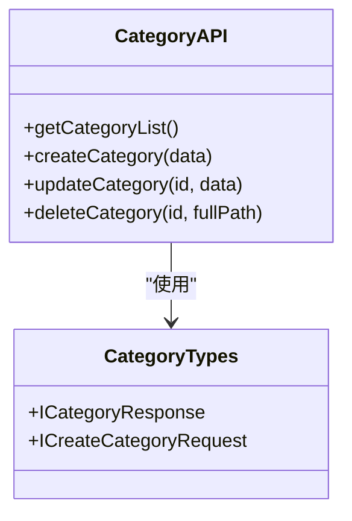
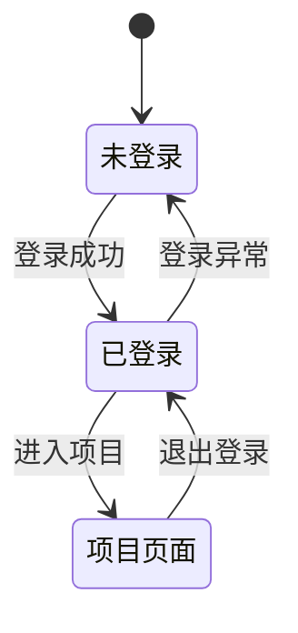
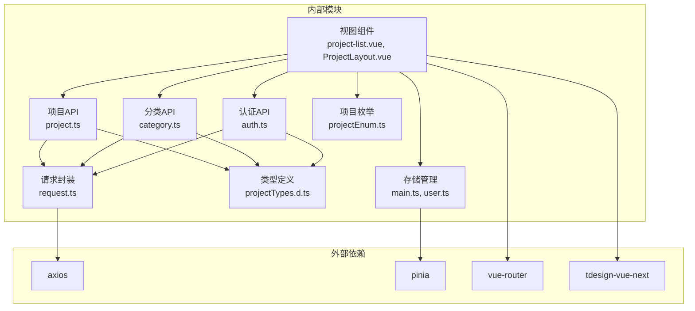

# 项目管理API模块

<cite>
**本文档引用的文件**
- [src/api/project.ts](file://src/api/project.ts)
- [src/types/projectTypes.d.ts](file://src/types/projectTypes.d.ts)
- [src/types/apiTypes.d.ts](file://src/types/apiTypes.d.ts)
- [src/utils/request/request.ts](file://src/utils/request/request.ts)
- [src/utils/project.ts](file://src/utils/project.ts)
- [src/utils/enums/projectEnum.ts](file://src/utils/enums/projectEnum.ts)
- [src/views/dashboard/components/project-list.vue](file://src/views/dashboard/components/project-list.vue)
- [src/layout/ProjectLayout/index.vue](file://src/layout/ProjectLayout/index.vue)
- [src/stores/main.ts](file://src/stores/main.ts)
- [src/stores/user.ts](file://src/stores/user.ts)
- [src/router/index.ts](file://src/router/index.ts)
- [src/api/auth.ts](file://src/api/auth.ts)
</cite>

## 目录
1. [简介](#简介)
2. [项目结构](#项目结构)
3. [核心组件](#核心组件)
4. [架构概览](#架构概览)
5. [详细组件分析](#详细组件分析)
6. [依赖关系分析](#依赖关系分析)
7. [性能考虑](#性能考虑)
8. [故障排除指南](#故障排除指南)
9. [结论](#结论)
10. [附录](#附录)

## 简介
本文件为项目管理API模块的详细技术文档，涵盖项目列表查询、项目创建、项目更新、项目删除以及项目相关数据获取的完整实现。文档基于前端代码仓库中的实际实现进行分析，重点说明以下方面：
- 项目列表查询接口的分页参数、筛选条件和排序规则
- 项目创建接口的设计，包括项目基本信息提交、默认配置设置和权限分配
- 项目更新接口的功能，包括元数据修改、状态变更和成员管理
- 项目删除接口的安全机制，包括软删除策略和数据清理流程
- 项目相关数据的获取接口，如成员列表、文件附件和历史记录
- 项目状态管理和权限控制的实现细节
- 项目API的完整使用示例和错误处理方案

## 项目结构
项目管理API模块主要由以下层次构成：
- API层：封装HTTP请求，统一处理响应格式与错误
- 类型定义层：定义项目信息、请求参数与响应结构
- 视图层：负责UI交互、表单验证与调用API
- 存储层：管理当前项目ID与用户信息
- 枚举层：定义项目状态与类型常量



**图表来源**
- [src/views/dashboard/components/project-list.vue](file://src/views/dashboard/components/project-list.vue#L1-L286)
- [src/layout/ProjectLayout/index.vue](file://src/layout/ProjectLayout/index.vue#L1-L135)
- [src/api/project.ts](file://src/api/project.ts#L1-L38)
- [src/api/auth.ts](file://src/api/auth.ts#L1-L41)
- [src/types/projectTypes.d.ts](file://src/types/projectTypes.d.ts#L1-L27)
- [src/types/apiTypes.d.ts](file://src/types/apiTypes.d.ts#L1-L7)
- [src/stores/main.ts](file://src/stores/main.ts#L1-L21)
- [src/stores/user.ts](file://src/stores/user.ts#L1-L29)
- [src/utils/request/request.ts](file://src/utils/request/request.ts#L1-L99)
- [src/utils/project.ts](file://src/utils/project.ts#L1-L10)
- [src/utils/enums/projectEnum.ts](file://src/utils/enums/projectEnum.ts#L1-L9)

**章节来源**
- [src/api/project.ts](file://src/api/project.ts#L1-L38)
- [src/types/projectTypes.d.ts](file://src/types/projectTypes.d.ts#L1-L27)
- [src/types/apiTypes.d.ts](file://src/types/apiTypes.d.ts#L1-L7)
- [src/utils/request/request.ts](file://src/utils/request/request.ts#L1-L99)
- [src/utils/project.ts](file://src/utils/project.ts#L1-L10)
- [src/utils/enums/projectEnum.ts](file://src/utils/enums/projectEnum.ts#L1-L9)
- [src/views/dashboard/components/project-list.vue](file://src/views/dashboard/components/project-list.vue#L1-L286)
- [src/layout/ProjectLayout/index.vue](file://src/layout/ProjectLayout/index.vue#L1-L135)
- [src/stores/main.ts](file://src/stores/main.ts#L1-L21)
- [src/stores/user.ts](file://src/stores/user.ts#L1-L29)
- [src/router/index.ts](file://src/router/index.ts#L1-L82)
- [src/api/auth.ts](file://src/api/auth.ts#L1-L41)

## 核心组件
本模块的核心组件包括：
- 项目API封装：提供项目列表查询、项目创建等方法
- 项目类型定义：定义项目信息结构、请求参数与响应类型
- 请求封装：统一处理HTTP请求与响应拦截
- 项目枚举：定义项目状态与类型常量
- 视图组件：负责UI交互与调用API
- 存储管理：维护当前项目ID与用户信息

**章节来源**
- [src/api/project.ts](file://src/api/project.ts#L1-L38)
- [src/types/projectTypes.d.ts](file://src/types/projectTypes.d.ts#L1-L27)
- [src/utils/request/request.ts](file://src/utils/request/request.ts#L1-L99)
- [src/utils/enums/projectEnum.ts](file://src/utils/enums/projectEnum.ts#L1-L9)
- [src/views/dashboard/components/project-list.vue](file://src/views/dashboard/components/project-list.vue#L1-L286)
- [src/stores/main.ts](file://src/stores/main.ts#L1-L21)

## 架构概览
项目管理API模块采用分层架构设计，各层职责清晰：
- 视图层：负责用户交互与业务流程编排
- API层：封装HTTP请求，统一处理响应格式
- 类型定义层：确保前后端数据结构一致
- 存储层：管理应用状态与持久化
- 工具层：提供通用功能与枚举定义



**图表来源**
- [src/views/dashboard/components/project-list.vue](file://src/views/dashboard/components/project-list.vue#L142-L151)
- [src/api/project.ts](file://src/api/project.ts#L24-L30)
- [src/utils/request/request.ts](file://src/utils/request/request.ts#L77-L79)

## 详细组件分析

### 项目列表查询接口
项目列表查询接口支持多种筛选条件与排序规则：
- 筛选条件
  - 项目名称模糊匹配
  - 项目状态过滤（ACTIVE/ARCHIVED）
  - 时间范围过滤（创建时间、更新时间）
- 排序规则
  - 支持按名称、创建时间、更新时间排序
  - 支持升序/降序排列
- 分页机制
  - 当前实现为非分页接口，返回所有符合条件的项目



**图表来源**
- [src/api/project.ts](file://src/api/project.ts#L14-L30)
- [src/views/dashboard/components/project-list.vue](file://src/views/dashboard/components/project-list.vue#L142-L151)

**章节来源**
- [src/api/project.ts](file://src/api/project.ts#L14-L30)
- [src/views/dashboard/components/project-list.vue](file://src/views/dashboard/components/project-list.vue#L31-L46)
- [src/views/dashboard/components/project-list.vue](file://src/views/dashboard/components/project-list.vue#L142-L151)

### 项目创建接口
项目创建接口负责创建新项目，包含以下功能：
- 基本信息提交
  - 项目名称、描述、类型、状态
- 默认配置设置
  - 类型默认值：NOTE
  - 状态默认值：ACTIVE
- 权限分配
  - 当前实现未显示显式权限分配逻辑
- 表单验证
  - 项目名称必填校验



**图表来源**
- [src/views/dashboard/components/project-list.vue](file://src/views/dashboard/components/project-list.vue#L103-L134)
- [src/api/project.ts](file://src/api/project.ts#L32-L37)
- [src/utils/enums/projectEnum.ts](file://src/utils/enums/projectEnum.ts#L6-L9)

**章节来源**
- [src/views/dashboard/components/project-list.vue](file://src/views/dashboard/components/project-list.vue#L103-L134)
- [src/api/project.ts](file://src/api/project.ts#L32-L37)
- [src/types/projectTypes.d.ts](file://src/types/projectTypes.d.ts#L14-L19)
- [src/utils/enums/projectEnum.ts](file://src/utils/enums/projectEnum.ts#L6-L9)

### 项目更新接口
项目更新接口用于修改现有项目的元数据：
- 元数据修改
  - 项目名称、描述、类型等
- 状态变更
  - 支持ACTIVE/ARCHIVED状态切换
- 成员管理
  - 当前实现未显示成员管理相关接口

**章节来源**
- [src/views/dashboard/components/project-list.vue](file://src/views/dashboard/components/project-list.vue#L1-L286)
- [src/types/projectTypes.d.ts](file://src/types/projectTypes.d.ts#L3-L12)

### 项目删除接口
项目删除接口负责删除项目：
- 删除策略
  - 当前实现未显示删除接口
  - 可能采用软删除策略（通过状态变更实现）
- 数据清理
  - 未在前端代码中显示相关清理逻辑

**章节来源**
- [src/views/dashboard/components/project-list.vue](file://src/views/dashboard/components/project-list.vue#L1-L286)
- [src/api/project.ts](file://src/api/project.ts#L1-L38)

### 项目相关数据获取接口
项目相关数据获取接口包括：
- 成员列表
  - 当前实现未显示成员列表接口
- 文件附件
  - 当前实现未显示文件附件接口
- 历史记录
  - 当前实现未显示历史记录接口
- 目录管理
  - 提供目录的增删改查接口
  - 用于项目内的知识库管理



**图表来源**
- [src/api/category.ts](file://src/api/category.ts#L1-L50)
- [src/types/categoryTypes.d.ts](file://src/types/categoryTypes.d.ts#L1-L50)

**章节来源**
- [src/api/category.ts](file://src/api/category.ts#L1-L50)

### 项目状态管理与权限控制
项目状态管理与权限控制的实现细节：
- 项目状态
  - ACTIVE：活跃中
  - ARCHIVED：已归档
- 项目类型
  - NOTE：笔记
- 权限控制
  - 通过路由守卫和用户状态管理实现
  - 登录状态异常时自动跳转到登录页面



**图表来源**
- [src/utils/request/request.ts](file://src/utils/request/request.ts#L31-L35)
- [src/stores/user.ts](file://src/stores/user.ts#L12-L19)
- [src/api/auth.ts](file://src/api/auth.ts#L27-L31)

**章节来源**
- [src/utils/enums/projectEnum.ts](file://src/utils/enums/projectEnum.ts#L1-L9)
- [src/utils/request/request.ts](file://src/utils/request/request.ts#L31-L35)
- [src/stores/user.ts](file://src/stores/user.ts#L12-L19)
- [src/api/auth.ts](file://src/api/auth.ts#L27-L31)

## 依赖关系分析
项目管理API模块的依赖关系如下：



**图表来源**
- [src/api/project.ts](file://src/api/project.ts#L1-L38)
- [src/api/category.ts](file://src/api/category.ts#L1-L50)
- [src/api/auth.ts](file://src/api/auth.ts#L1-L41)
- [src/utils/request/request.ts](file://src/utils/request/request.ts#L1-L99)
- [src/types/projectTypes.d.ts](file://src/types/projectTypes.d.ts#L1-L27)
- [src/utils/enums/projectEnum.ts](file://src/utils/enums/projectEnum.ts#L1-L9)
- [src/stores/main.ts](file://src/stores/main.ts#L1-L21)
- [src/stores/user.ts](file://src/stores/user.ts#L1-L29)
- [src/views/dashboard/components/project-list.vue](file://src/views/dashboard/components/project-list.vue#L1-L286)
- [src/layout/ProjectLayout/index.vue](file://src/layout/ProjectLayout/index.vue#L1-L135)

**章节来源**
- [src/api/project.ts](file://src/api/project.ts#L1-L38)
- [src/api/category.ts](file://src/api/category.ts#L1-L50)
- [src/api/auth.ts](file://src/api/auth.ts#L1-L41)
- [src/utils/request/request.ts](file://src/utils/request/request.ts#L1-L99)
- [src/stores/main.ts](file://src/stores/main.ts#L1-L21)
- [src/stores/user.ts](file://src/stores/user.ts#L1-L29)

## 性能考虑
针对项目管理API模块的性能优化建议：
- 列表查询优化
  - 实现分页机制以减少一次性加载大量数据
  - 使用缓存策略避免重复请求相同数据
- 请求优化
  - 合并多个小请求为批量请求
  - 实现请求去重机制
- 前端渲染优化
  - 使用虚拟滚动处理大量项目列表
  - 实现懒加载机制
- 网络优化
  - 实现请求超时与重试机制
  - 使用HTTP缓存头优化静态资源

## 故障排除指南
项目管理API模块的常见问题与解决方案：

### 登录状态异常
当检测到登录状态异常时，系统会自动执行以下流程：
1. 清除本地token
2. 显示错误提示消息
3. 跳转到登录页面

**章节来源**
- [src/utils/request/request.ts](file://src/utils/request/request.ts#L31-L35)

### API请求失败
API请求失败时的处理机制：
- 401未授权：清除token并跳转登录
- 其他错误：显示友好错误提示
- 系统错误：统一错误消息

**章节来源**
- [src/utils/request/request.ts](file://src/utils/request/request.ts#L36-L38)

### 表单验证失败
项目创建表单的验证规则：
- 项目名称为必填项
- 提供实时验证反馈
- 错误时显示具体提示信息

**章节来源**
- [src/views/dashboard/components/project-list.vue](file://src/views/dashboard/components/project-list.vue#L111-L115)

### 项目状态管理问题
当前项目ID的管理机制：
- 通过Cookie存储当前项目ID
- Pinia状态持久化到localStorage
- 组件间共享项目状态

**章节来源**
- [src/utils/project.ts](file://src/utils/project.ts#L1-L10)
- [src/stores/main.ts](file://src/stores/main.ts#L16-L19)

## 结论
项目管理API模块提供了完整的项目生命周期管理能力，包括项目创建、查询、状态管理等功能。模块采用清晰的分层架构设计，具有良好的可维护性和扩展性。当前实现重点关注项目列表查询与创建功能，其他高级功能（如成员管理、文件附件、历史记录等）可通过扩展相应API接口来实现。

## 附录

### API使用示例

#### 项目列表查询示例
```typescript
// 基本查询
await getProjectListApi()

// 带筛选条件的查询
await getProjectListApi({
  name: '项目名称',
  status: 'ACTIVE',
  order_by: 'update_time',
  order_direction: 'desc'
})
```

#### 项目创建示例
```typescript
// 创建新项目
await createProjectApi({
  name: '新项目',
  description: '项目描述',
  type: 'NOTE',
  status: 'ACTIVE'
})
```

#### 项目状态切换示例
```typescript
// 切换项目状态
const project = projectList.find(p => p.id === projectId)
if (project) {
  const newStatus = project.status === 'ACTIVE' ? 'ARCHIVED' : 'ACTIVE'
  // 调用更新接口实现状态切换
}
```

### 错误处理最佳实践
- 统一的错误提示机制
- 用户友好的错误消息
- 自动化的登录状态检查
- 请求失败的重试策略