# 文章表单组件文档

<cite>
**本文档引用的文件**
- [src/views/project/components/article-form.vue](file://src/views/project/components/article-form.vue)
- [src/types/articleTypes.d.ts](file://src/types/articleTypes.d.ts)
- [src/api/article.ts](file://src/api/article.ts)
- [src/utils/enums/articleEnum.ts](file://src/utils/enums/articleEnum.ts)
- [src/components/Editor/index.vue](file://src/components/Editor/index.vue)
- [src/hooks/useTdMessage.ts](file://src/hooks/useTdMessage.ts)
- [src/views/project/index.vue](file://src/views/project/index.vue)
- [src/types/categoryTypes.d.ts](file://src/types/categoryTypes.d.ts)
- [src/router/index.ts](file://src/router/index.ts)
- [src/layout/ProjectLayout/index.vue](file://src/layout/ProjectLayout/index.vue)
- [src/main.ts](file://src/main.ts)
</cite>

## 更新摘要
**变更内容**
- 更新了响应式设计部分，反映新增的媒体查询和布局优化
- 新增了视觉质量改进的相关内容
- 更新了布局架构图以体现最新的设计改进

## 目录
1. [简介](#简介)
2. [项目结构](#项目结构)
3. [核心组件](#核心组件)
4. [架构概览](#架构概览)
5. [详细组件分析](#详细组件分析)
6. [依赖关系分析](#依赖关系分析)
7. [性能考虑](#性能考虑)
8. [故障排除指南](#故障排除指南)
9. [结论](#结论)

## 简介

文章表单组件是 LiFocus 项目管理系统中的核心功能模块，负责提供完整的文章创建、编辑和查看功能。该组件基于 Vue 3 Composition API 和 TypeScript 构建，集成了 Markdown 编辑器、分类管理和文章状态控制等功能。

该组件支持三种操作模式：添加模式（add）、编辑模式（edit）和查看模式（view），能够处理笔记和日常两种不同类型的文章。通过与后端 API 的集成，实现了完整的 CRUD 操作和实时数据同步。

**最新改进**：组件现已获得改进的布局和响应式设计，整体视觉质量得到显著提升，提供了更加现代化和用户友好的界面体验。

## 项目结构

文章表单组件位于项目的核心功能模块中，采用模块化设计，与其他组件形成清晰的层次结构：

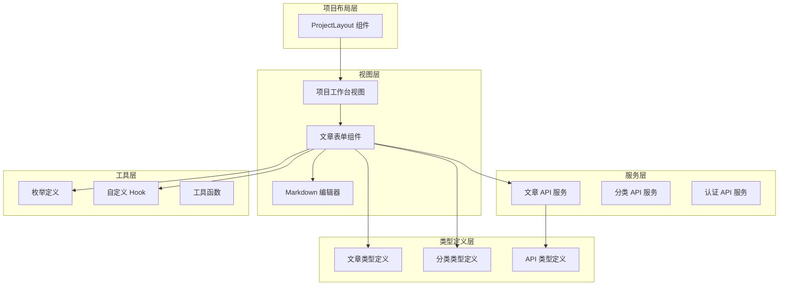

**图表来源**
- [src/layout/ProjectLayout/index.vue:1-135](file://src/layout/ProjectLayout/index.vue#L1-L135)
- [src/views/project/index.vue:1-371](file://src/views/project/index.vue#L1-L371)
- [src/views/project/components/article-form.vue:1-217](file://src/views/project/components/article-form.vue#L1-L217)

**章节来源**
- [src/views/project/components/article-form.vue:1-217](file://src/views/project/components/article-form.vue#L1-L217)
- [src/views/project/index.vue:1-371](file://src/views/project/index.vue#L1-L371)
- [src/layout/ProjectLayout/index.vue:1-135](file://src/layout/ProjectLayout/index.vue#L1-L135)

## 核心组件

### 文章表单组件架构

文章表单组件采用响应式设计，支持多种操作模式和状态管理：

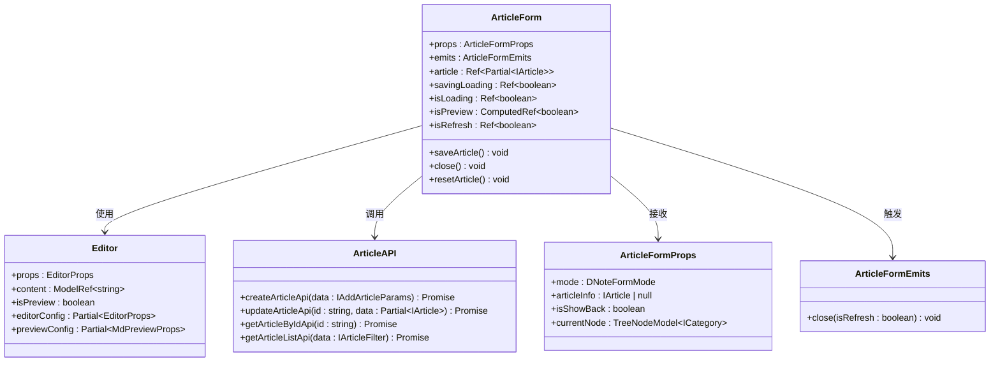

**图表来源**
- [src/views/project/components/article-form.vue:16-37](file://src/views/project/components/article-form.vue#L16-L37)
- [src/components/Editor/index.vue:9-24](file://src/components/Editor/index.vue#L9-L24)
- [src/api/article.ts:29-46](file://src/api/article.ts#L29-L46)

### 数据模型

组件使用强类型的数据模型来确保数据完整性：

| 字段名 | 类型 | 描述 | 必填 |
|--------|------|------|------|
| id | string | 文章唯一标识符 | 否 |
| category_id | string | 分类 ID | 是 |
| type | TArticleType | 文章类型（NOTE/DAILY） | 是 |
| title | string | 文章标题 | 是 |
| status | TArticleStatus | 文章状态（ACTIVE/ARCHIVED） | 是 |
| content | string | 文章内容 | 是 |
| is_shared | boolean | 是否已分享 | 是 |
| share_password | string | 分享密码 | 否 |
| is_deleted | boolean | 是否已删除 | 是 |
| create_time | string | 创建时间 | 是 |
| update_time | string | 更新时间 | 是 |
| category | object | 分类信息 | 是 |

**章节来源**
- [src/types/articleTypes.d.ts:9-25](file://src/types/articleTypes.d.ts#L9-L25)
- [src/types/articleTypes.d.ts:27-36](file://src/types/articleTypes.d.ts#L27-L36)

## 架构概览

文章表单组件在整个应用架构中扮演着关键角色，连接用户界面、业务逻辑和数据存储：

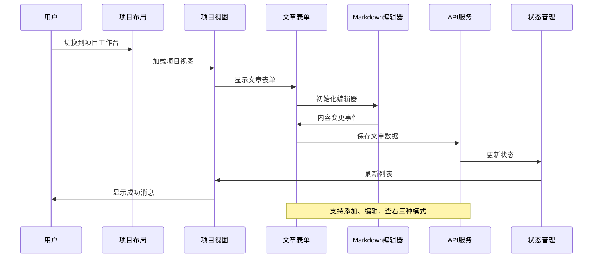

**图表来源**
- [src/layout/ProjectLayout/index.vue:57-72](file://src/layout/ProjectLayout/index.vue#L57-L72)
- [src/views/project/index.vue:136-197](file://src/views/project/index.vue#L136-L197)
- [src/views/project/components/article-form.vue:95-138](file://src/views/project/components/article-form.vue#L95-L138)

### 组件交互流程

文章表单组件与外部系统的交互遵循严格的流程控制：

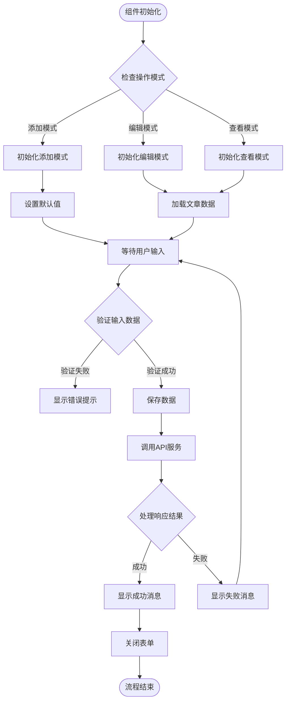

**图表来源**
- [src/views/project/components/article-form.vue:73-138](file://src/views/project/components/article-form.vue#L73-L138)
- [src/hooks/useTdMessage.ts:4-59](file://src/hooks/useTdMessage.ts#L4-L59)

## 详细组件分析

### 文章表单核心功能

#### 模式切换机制

文章表单组件支持三种操作模式，每种模式都有特定的功能集：

| 模式 | 功能特性 | 表单状态 | API 行为 |
|------|----------|----------|----------|
| add | 创建新文章 | 可编辑 | 调用创建 API |
| edit | 编辑现有文章 | 可编辑 | 调用更新 API |
| view | 查看文章详情 | 只读 | 调用获取 API |

#### 数据绑定策略

组件使用 Vue 3 的响应式系统实现双向数据绑定：

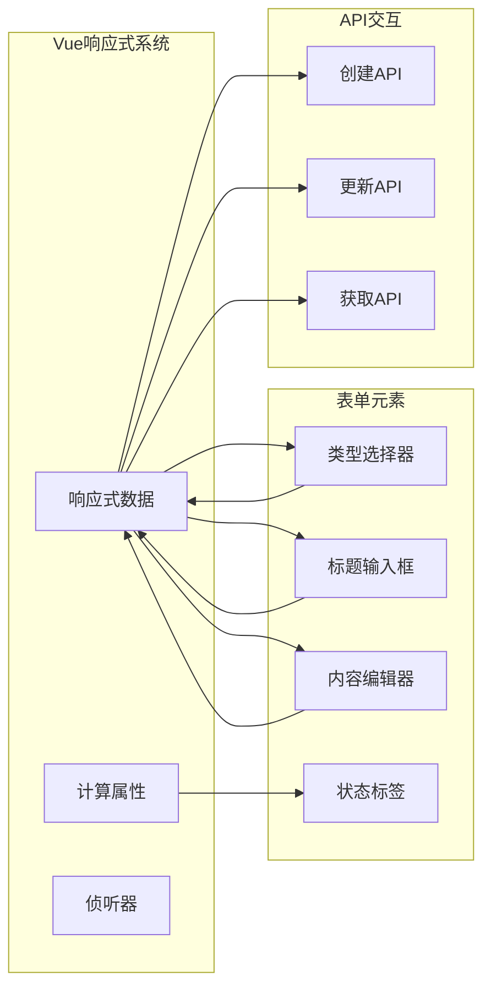

**图表来源**
- [src/views/project/components/article-form.vue:56-58](file://src/views/project/components/article-form.vue#L56-L58)
- [src/views/project/components/article-form.vue:164-177](file://src/views/project/components/article-form.vue#L164-L177)

**章节来源**
- [src/views/project/components/article-form.vue:16-37](file://src/views/project/components/article-form.vue#L16-L37)
- [src/views/project/components/article-form.vue:55-58](file://src/views/project/components/article-form.vue#L55-L58)

### Markdown 编辑器集成

#### 编辑器配置

Markdown 编辑器提供了丰富的编辑功能和高度可定制的配置选项：

| 配置项 | 默认值 | 功能描述 |
|--------|--------|----------|
| 主题 | light | 编辑器外观主题 |
| 预览 | true | 是否显示实时预览 |
| 工具栏 | 丰富工具集 | 支持格式化、插入等功能 |
| 代码主题 | github | 代码块显示主题 |
| 预览主题 | github | 预览区域主题 |
| 自动聚焦 | true | 页面加载后自动聚焦 |

#### 编辑器工具栏功能

编辑器工具栏包含以下功能组：

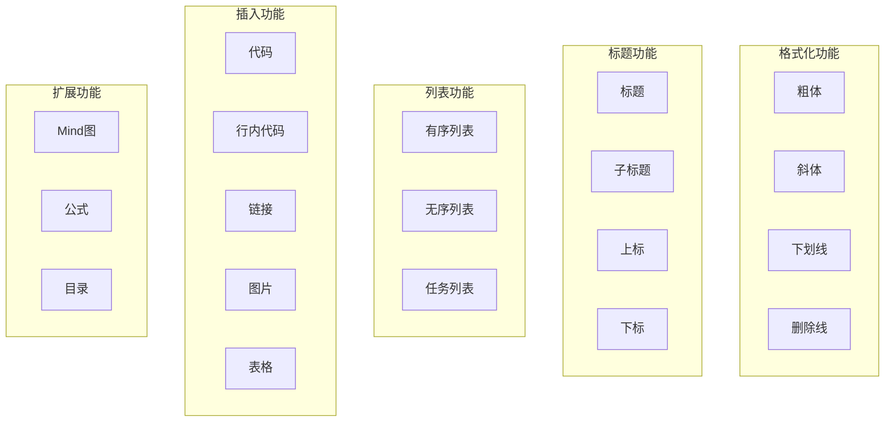

**图表来源**
- [src/components/Editor/index.vue:34-67](file://src/components/Editor/index.vue#L34-L67)

**章节来源**
- [src/components/Editor/index.vue:27-83](file://src/components/Editor/index.vue#L27-L83)
- [src/components/Editor/index.vue:105-108](file://src/components/Editor/index.vue#L105-L108)

### API 服务集成

#### 文章管理 API

组件通过专门的 API 服务处理所有后端通信：

| API 方法 | 请求方法 | URL 路径 | 功能描述 |
|----------|----------|----------|----------|
| createArticleApi | POST | /article | 创建新文章 |
| updateArticleApi | PUT | /article/{id} | 更新文章内容 |
| getArticleByIdApi | GET | /article/{id} | 获取文章详情 |
| getArticleListApi | POST | /article/category-article | 分页获取文章列表 |
| deleteArticleApi | DELETE | /article/{id} | 删除文章 |
| getSharedArticleApi | POST | /share/{id} | 获取分享的文章 |

#### 错误处理机制

API 调用采用统一的错误处理策略：

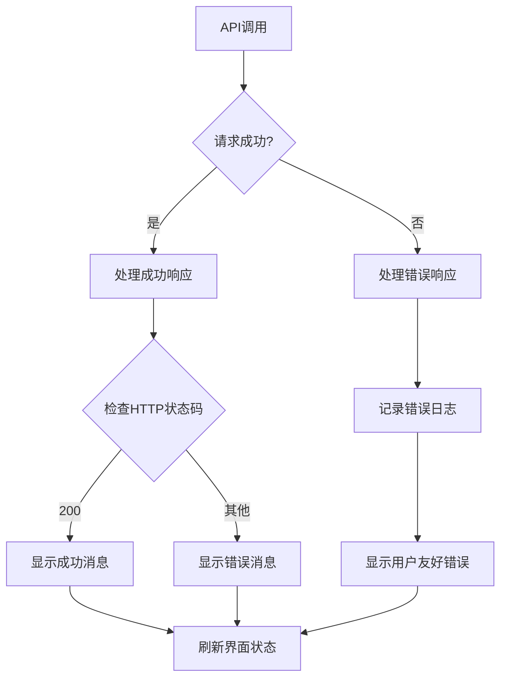

**图表来源**
- [src/views/project/components/article-form.vue:95-138](file://src/views/project/components/article-form.vue#L95-L138)
- [src/api/article.ts:29-46](file://src/api/article.ts#L29-L46)

**章节来源**
- [src/api/article.ts:1-75](file://src/api/article.ts#L1-L75)
- [src/views/project/components/article-form.vue:95-138](file://src/views/project/components/article-form.vue#L95-L138)

### 状态管理

#### 响应式状态

组件使用 Vue 3 的响应式系统管理内部状态：

| 状态变量 | 类型 | 描述 | 触发条件 |
|----------|------|------|----------|
| article | Ref~Partial~IArticle~~ | 当前文章数据 | props 变更或用户输入 |
| savingLoading | Ref~boolean~ | 保存按钮加载状态 | API 调用开始/结束 |
| isLoading | Ref~boolean~ | 内容加载状态 | 获取文章详情时 |
| isRefresh | Ref~boolean~ | 是否需要刷新父组件 | 成功保存后 |
| isPreview | ComputedRef~boolean~ | 是否为预览模式 | props.mode === 'view' |

#### 生命周期管理

组件的生命周期包括初始化、数据加载、用户交互和清理阶段：

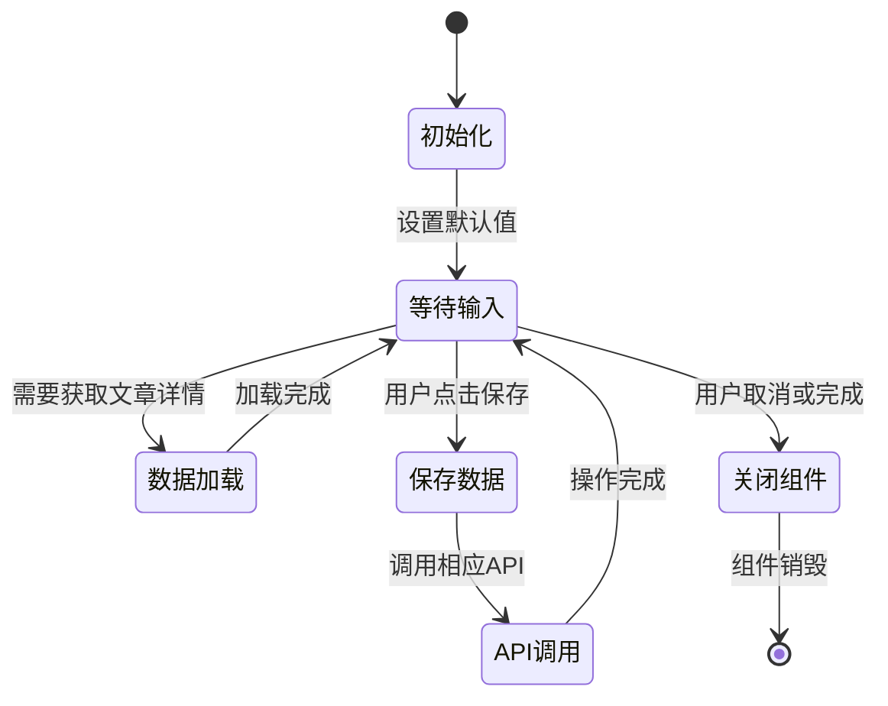

**图表来源**
- [src/views/project/components/article-form.vue:73-93](file://src/views/project/components/article-form.vue#L73-L93)

**章节来源**
- [src/views/project/components/article-form.vue:56-93](file://src/views/project/components/article-form.vue#L56-L93)

### 响应式设计改进

#### 媒体查询优化

组件现已实现全面的响应式设计，针对不同屏幕尺寸进行了优化：

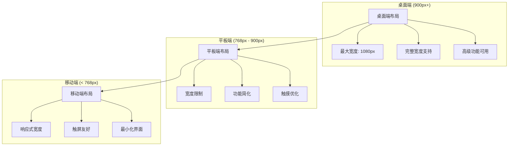

**图表来源**
- [src/views/project/components/article-form.vue:487-501](file://src/views/project/components/article-form.vue#L487-L501)

#### 视觉质量提升

组件在视觉设计方面进行了多项改进：

| 改进方面 | 具体实现 | 效果 |
|----------|----------|------|
| 边框圆角 | 统一使用 12px 圆角 | 更现代的外观 |
| 阴影效果 | 多层阴影叠加 | 增强立体感 |
| 渐变背景 | 径向渐变背景 | 提升视觉层次 |
| 毛玻璃效果 | backdrop-filter: blur(8px) | 现代化界面风格 |
| 动画过渡 | 0.2s 缓动动画 | 流畅的用户体验 |

**章节来源**
- [src/views/project/components/article-form.vue:242-246](file://src/views/project/components/article-form.vue#L242-L246)
- [src/views/project/components/article-form.vue:258-263](file://src/views/project/components/article-form.vue#L258-L263)

## 依赖关系分析

### 外部依赖

文章表单组件依赖多个外部库和框架：

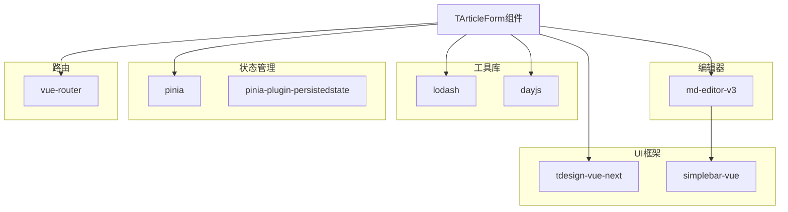

**图表来源**
- [src/views/project/components/article-form.vue:1-14](file://src/views/project/components/article-form.vue#L1-L14)
- [src/main.ts:1-28](file://src/main.ts#L1-L28)

### 内部依赖

组件之间的依赖关系形成了清晰的层次结构：

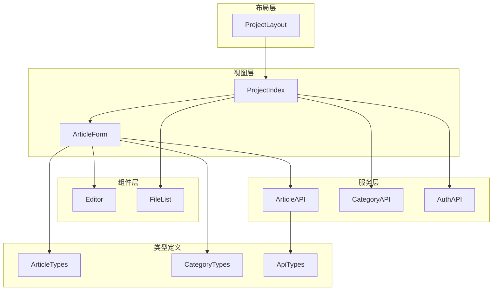

**图表来源**
- [src/views/project/index.vue:16-17](file://src/views/project/index.vue#L16-L17)
- [src/views/project/components/article-form.vue:9-11](file://src/views/project/components/article-form.vue#L9-L11)

**章节来源**
- [src/views/project/components/article-form.vue:1-14](file://src/views/project/components/article-form.vue#L1-L14)
- [src/views/project/index.vue:1-18](file://src/views/project/index.vue#L1-L18)

## 性能考虑

### 优化策略

文章表单组件采用了多项性能优化措施：

#### 防抖机制

组件使用防抖技术优化 API 调用频率：

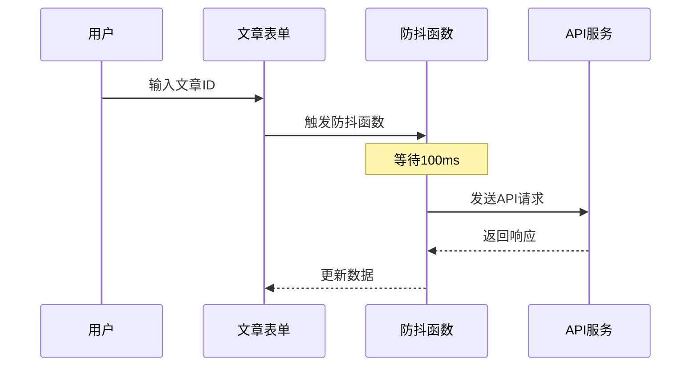

**图表来源**
- [src/views/project/components/article-form.vue:60-77](file://src/views/project/components/article-form.vue#L60-L77)

#### 条件渲染

组件使用条件渲染优化 DOM 性能：

| 渲染条件 | 元素 | 渲染时机 | 性能影响 |
|----------|------|----------|----------|
| isLoading | 加载动画 | 获取文章详情时 | 减少空白页面 |
| isPreview | 预览标签 | 查看模式时 | 提供状态反馈 |
| isShowBack | 返回按钮 | 显示返回时 | 改善用户体验 |

#### 内存管理

组件正确处理内存泄漏风险：

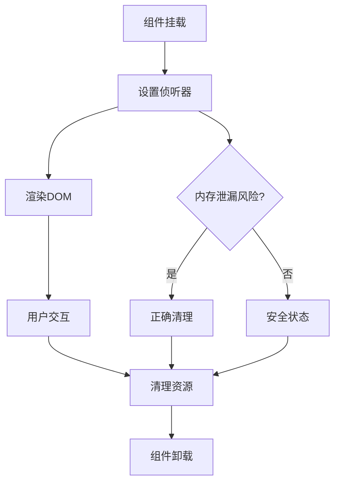

**图表来源**
- [src/views/project/components/article-form.vue:73-93](file://src/views/project/components/article-form.vue#L73-L93)

## 故障排除指南

### 常见问题及解决方案

#### API 调用失败

**问题症状**：保存文章时出现错误提示

**可能原因**：
1. 网络连接异常
2. 服务器响应超时
3. 认证令牌过期
4. 数据格式不正确

**解决步骤**：
1. 检查网络连接状态
2. 验证 API 端点可用性
3. 确认用户认证状态
4. 检查请求数据格式

#### 数据加载延迟

**问题症状**：文章内容加载缓慢

**可能原因**：
1. 文章内容过大
2. 网络带宽限制
3. 服务器性能问题

**优化方案**：
1. 实施分页加载
2. 优化图片资源
3. 使用缓存策略

#### 编辑器性能问题

**问题症状**：Markdown 编辑器响应迟缓

**可能原因**：
1. 内容过多导致渲染压力
2. 浏览器兼容性问题
3. JavaScript 执行阻塞

**解决方案**：
1. 实施虚拟滚动
2. 优化 DOM 结构
3. 使用 Web Workers

**章节来源**
- [src/views/project/components/article-form.vue:60-77](file://src/views/project/components/article-form.vue#L60-L77)
- [src/hooks/useTdMessage.ts:4-59](file://src/hooks/useTdMessage.ts#L4-L59)

### 调试技巧

#### 开发者工具使用

1. **Vue DevTools**：监控组件状态变化
2. **Network 面板**：分析 API 调用性能
3. **Console**：查看错误日志和警告信息
4. **Performance 面板**：分析 JavaScript 执行时间

#### 日志记录

组件集成了完善的日志记录机制：

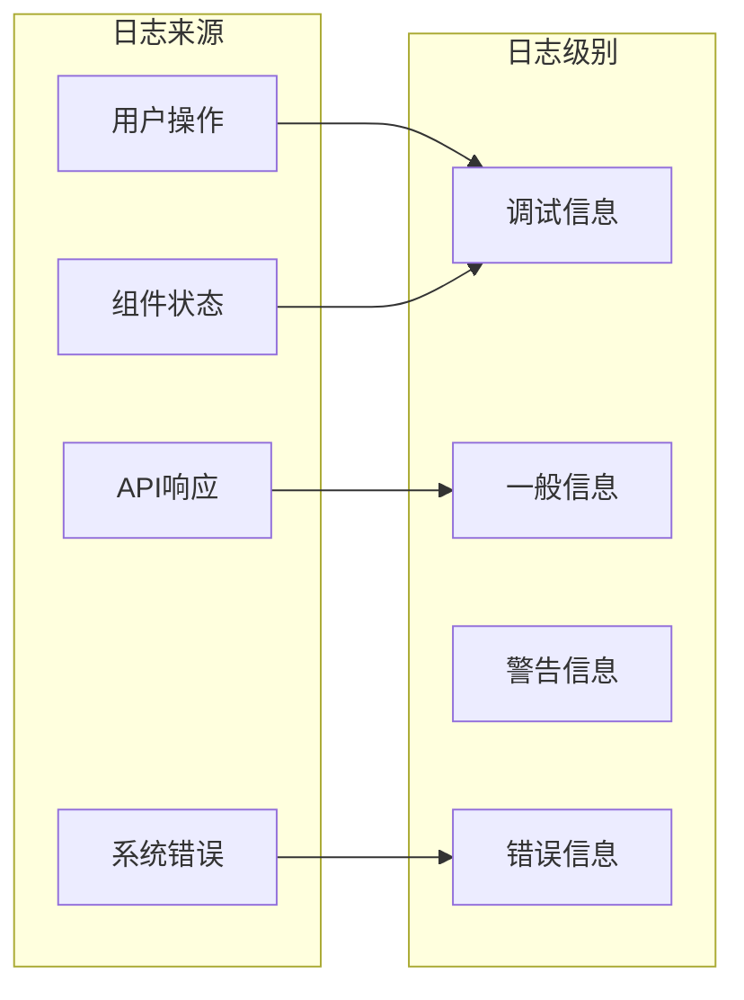

**图表来源**
- [src/views/project/components/article-form.vue:67-68](file://src/views/project/components/article-form.vue#L67-L68)

## 结论

文章表单组件是 LiFocus 项目管理系统中的核心功能模块，展现了现代前端开发的最佳实践。该组件通过精心设计的架构、完善的类型系统和优雅的用户界面，为用户提供了一致且高效的文章管理体验。

**主要优势**
1. **模块化设计**：清晰的组件分离和职责划分
2. **类型安全**：完整的 TypeScript 类型定义
3. **响应式更新**：高效的 Vue 3 响应式系统
4. **用户体验**：直观的操作流程和即时反馈
5. **性能优化**：合理的性能优化策略和资源管理
6. **视觉质量**：现代化的设计和响应式布局

**技术亮点**
- **多模式支持**：灵活的添加、编辑、查看模式
- **实时预览**：集成的 Markdown 编辑器
- **状态管理**：完善的响应式状态处理
- **错误处理**：健壮的错误处理和用户提示机制
- **性能优化**：防抖、缓存和条件渲染等优化策略
- **响应式设计**：全面的移动端适配和视觉优化

**最新改进**：组件现已获得显著的布局和视觉质量改进，包括现代化的渐变背景、毛玻璃效果、统一的圆角设计和流畅的动画过渡，为用户提供了更加专业和现代化的使用体验。

该组件为整个项目的文档管理功能奠定了坚实的基础，体现了高质量软件工程的标准和要求。