# 文件列表组件

<cite>
**本文档引用的文件**
- [src/views/project/components/file-list.vue](file://src/views/project/components/file-list.vue)
- [src/components/CustomCard/index.vue](file://src/components/CustomCard/index.vue)
- [src/api/article.ts](file://src/api/article.ts)
- [src/types/articleTypes.d.ts](file://src/types/articleTypes.d.ts)
- [src/types/categoryTypes.d.ts](file://src/types/categoryTypes.d.ts)
- [src/utils/enums/articleEnum.ts](file://src/utils/enums/articleEnum.ts)
- [src/views/project/index.vue](file://src/views/project/index.vue)
- [src/hooks/useTdMessage.ts](file://src/hooks/useTdMessage.ts)
- [src/utils/request/index.ts](file://src/utils/request/index.ts)
- [src/router/index.ts](file://src/router/index.ts)
- [package.json](file://package.json)
- [src/style/common.css](file://src/style/common.css)
- [src/style/color.css](file://src/style/color.css)
- [src/style/index.css](file://src/style/index.css)
- [src/layout/ProjectLayout/index.vue](file://src/layout/ProjectLayout/index.vue)
</cite>

## 更新摘要
**变更内容**
- 文件列表组件获得样式改进和更好的视觉反馈
- 卡片悬停效果增强，包含渐变强调线和阴影提升
- 操作按钮的视觉反馈优化，支持不同状态的颜色主题
- 滚动条样式美化，提供更好的滚动体验
- 加载动画和空状态视觉效果改进
- 整体色彩系统优化，支持主题切换

## 目录
1. [简介](#简介)
2. [项目结构](#项目结构)
3. [核心组件](#核心组件)
4. [架构概览](#架构概览)
5. [详细组件分析](#详细组件分析)
6. [样式系统改进](#样式系统改进)
7. [依赖关系分析](#依赖关系分析)
8. [性能考虑](#性能考虑)
9. [故障排除指南](#故障排除指南)
10. [结论](#结论)

## 简介

文件列表组件（File List Component）是 LiFocus 项目管理系统中的核心组件之一，负责展示和管理用户项目中的文章/笔记内容。该组件基于 Vue 3 Composition API 构建，集成了无限滚动加载、文章搜索、分类筛选、分享功能等现代化特性。

**更新** 文件列表组件经过全面的样式改进，获得了更好的视觉反馈和用户体验。新增的卡片悬停效果包含渐变强调线、阴影提升和动画过渡，操作按钮支持不同的颜色主题以区分功能状态。滚动条样式得到美化，加载动画更加流畅，整体色彩系统支持主题切换，为用户提供了更加精致和一致的视觉体验。

## 项目结构

文件列表组件位于项目的核心路由结构中，作为项目视图的一部分运行：

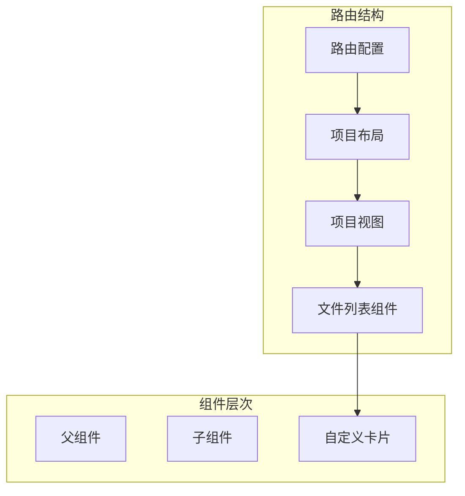

**图表来源**
- [src/router/index.ts:41-72](file://src/router/index.ts#L41-L72)
- [src/views/project/index.vue:17-349](file://src/views/project/index.vue#L17-L349)

**章节来源**
- [src/router/index.ts:1-90](file://src/router/index.ts#L1-L90)
- [src/views/project/index.vue:1-371](file://src/views/project/index.vue#L1-L371)

## 核心组件

文件列表组件是一个高度模块化的 Vue 组件，具备以下核心特性：

### 主要功能特性
- **无限滚动加载**：基于 VueUse 的无限滚动钩子实现
- **文章分类管理**：与树形分类结构深度集成
- **多维度搜索**：支持标题搜索、排序和筛选
- **文章操作**：查看、编辑、删除、分享功能
- **双层复制链接系统**：使用VueUse的useClipboard实现跨浏览器兼容性，包含传统降级方案
- **响应式设计**：自适应网格布局
- **状态管理**：完整的加载状态和错误处理
- **增强的视觉反馈**：改进的卡片悬停效果和操作按钮状态

### 数据流架构
组件采用单向数据流设计，通过 props 接收父组件传递的数据，通过 emits 向父组件传递事件。

**章节来源**
- [src/views/project/components/file-list.vue:1-407](file://src/views/project/components/file-list.vue#L1-L407)

## 架构概览

文件列表组件的整体架构采用分层设计模式：

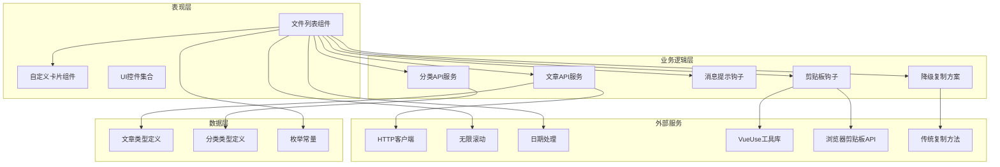

**图表来源**
- [src/views/project/components/file-list.vue:1-20](file://src/views/project/components/file-list.vue#L1-L20)
- [src/api/article.ts:1-75](file://src/api/article.ts#L1-L75)
- [src/types/articleTypes.d.ts:1-65](file://src/types/articleTypes.d.ts#L1-L65)
- [package.json:23-23](file://package.json#L23-L23)

## 详细组件分析

### 文件列表组件核心实现

文件列表组件是整个系统的核心，负责管理文章的展示和交互：

#### 组件属性和事件
- **接收属性**：`currentNode` - 当前选中的分类节点
- **触发事件**：`viewArticle`、`editArticle` - 文章操作事件

#### 状态管理
组件维护了完整的状态管理机制：

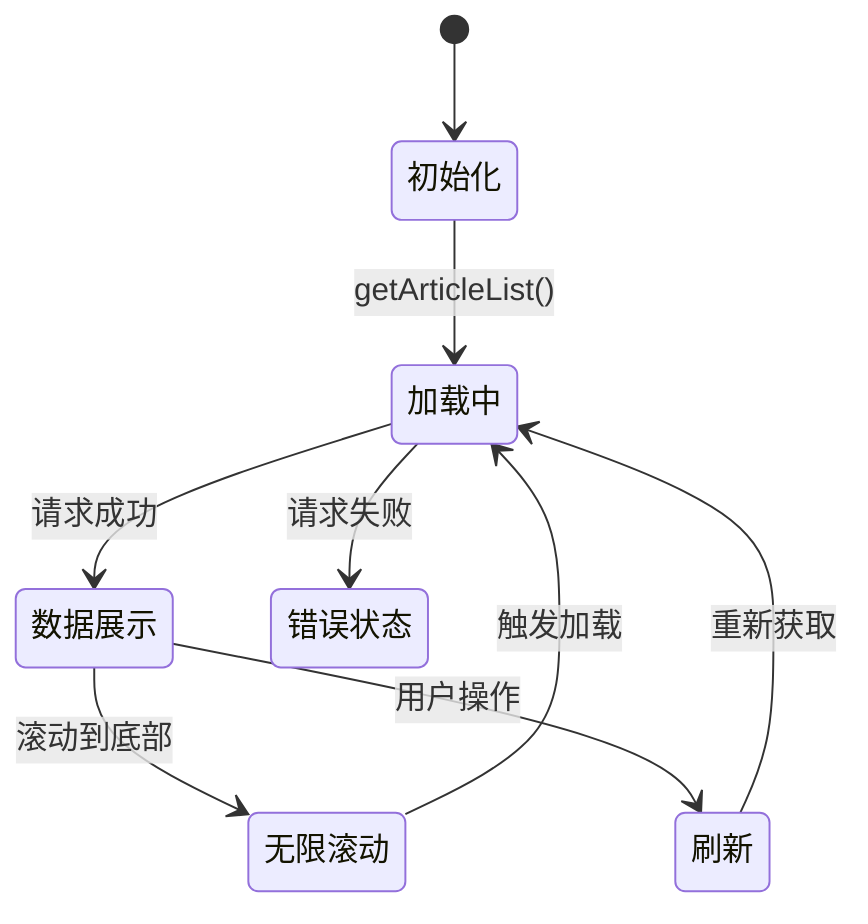

**图表来源**
- [src/views/project/components/file-list.vue:41-81](file://src/views/project/components/file-list.vue#L41-L81)

#### 核心方法分析

##### 无限滚动实现
组件使用 VueUse 的 `useInfiniteScroll` 实现高效的无限滚动加载：

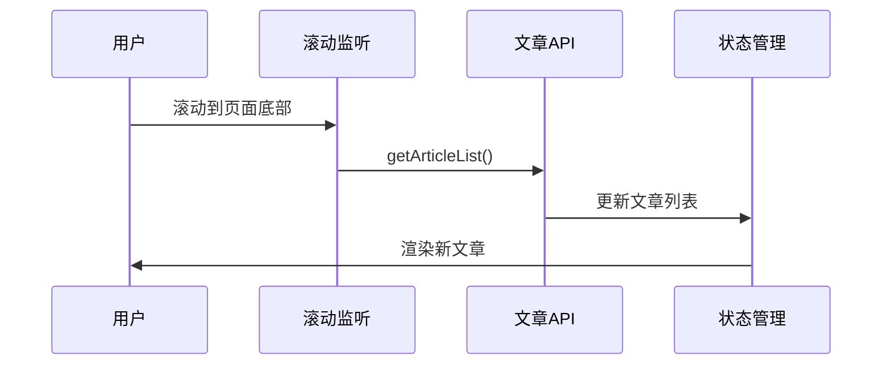

**图表来源**
- [src/views/project/components/file-list.vue:109-123](file://src/views/project/components/file-list.vue#L109-L123)

##### 文章操作流程
组件提供了完整的文章生命周期管理：

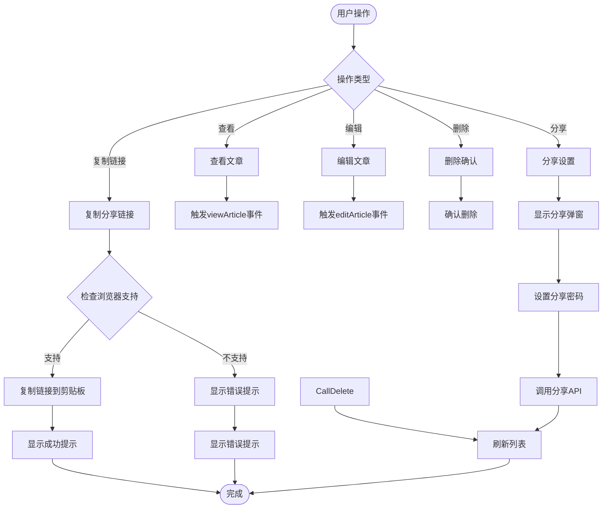

**图表来源**
- [src/views/project/components/file-list.vue:125-211](file://src/views/project/components/file-list.vue#L125-L211)

**更新** 新增双层复制链接系统，包括VueUse剪贴板API支持和传统降级方案：

##### 剪贴板复制实现
组件使用 VueUse 的 `useClipboard` 实现跨浏览器兼容性的剪贴板操作，包含双层降级机制：

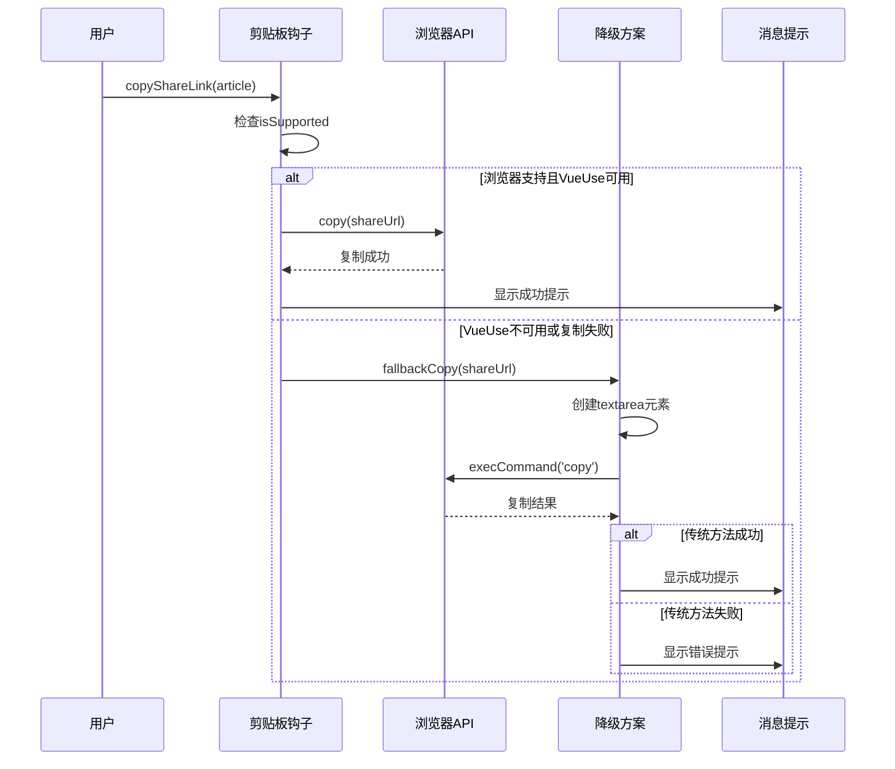

**图表来源**
- [src/views/project/components/file-list.vue:201-256](file://src/views/project/components/file-list.vue#L201-L256)

**章节来源**
- [src/views/project/components/file-list.vue:1-407](file://src/views/project/components/file-list.vue#L1-L407)

### 自定义卡片组件集成

文件列表组件深度集成了自定义卡片组件，提供丰富的视觉效果和交互体验：

#### 卡片特性
- **悬停效果**：鼠标悬停时的阴影和位移动画
- **可点击行为**：支持卡片级别的点击事件
- **响应式布局**：自适应不同屏幕尺寸
- **加载状态**：支持加载指示器显示
- **增强的视觉反馈**：改进的边框、阴影和过渡效果

#### 卡片样式系统
组件采用 CSS 变量系统实现主题化设计：

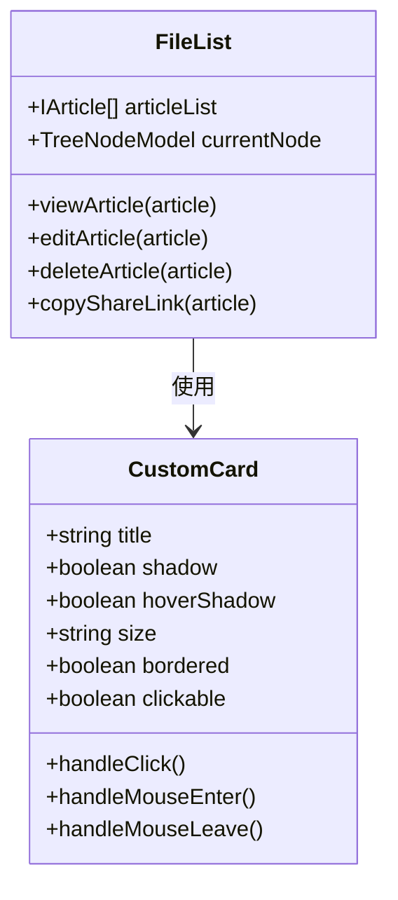

**图表来源**
- [src/components/CustomCard/index.vue:1-317](file://src/components/CustomCard/index.vue#L1-L317)
- [src/views/project/components/file-list.vue:15-213](file://src/views/project/components/file-list.vue#L15-L213)

**章节来源**
- [src/components/CustomCard/index.vue:1-317](file://src/components/CustomCard/index.vue#L1-L317)

### 类型系统和数据模型

组件严格遵循 TypeScript 类型系统，确保类型安全：

#### 文章数据模型
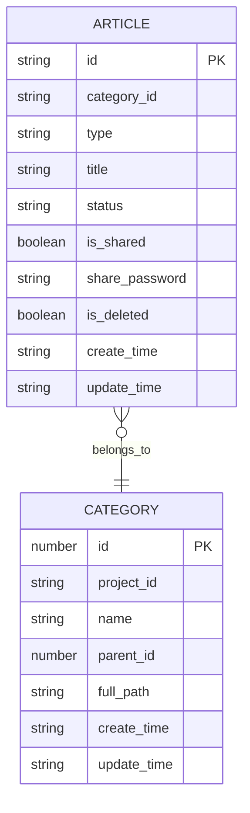

**图表来源**
- [src/types/articleTypes.d.ts:9-25](file://src/types/articleTypes.d.ts#L9-L25)
- [src/types/categoryTypes.d.ts:4-17](file://src/types/categoryTypes.d.ts#L4-L17)

**章节来源**
- [src/types/articleTypes.d.ts:1-65](file://src/types/articleTypes.d.ts#L1-L65)
- [src/types/categoryTypes.d.ts:1-39](file://src/types/categoryTypes.d.ts#L1-L39)

### API 集成和数据流

组件通过 API 层与后端服务进行通信：

#### 文章管理 API
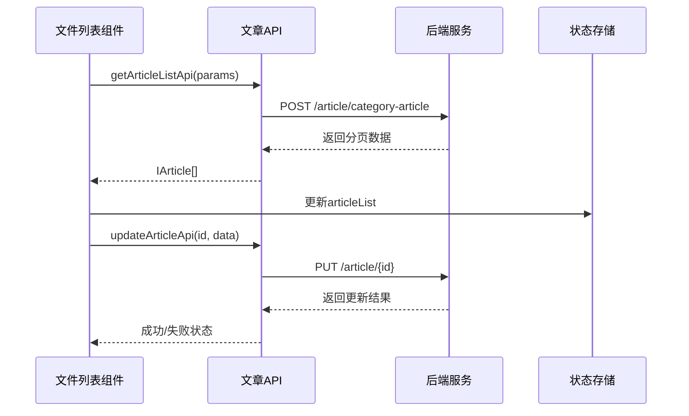

**图表来源**
- [src/api/article.ts:8-59](file://src/api/article.ts#L8-L59)
- [src/views/project/components/file-list.vue:73-81](file://src/views/project/components/file-list.vue#L73-L81)

**章节来源**
- [src/api/article.ts:1-75](file://src/api/article.ts#L1-L75)

## 样式系统改进

### 卡片悬停效果增强

文件列表组件的样式系统经过全面改进，提供了更加精致的视觉反馈：

#### 渐变强调线设计
卡片悬停时显示渐变强调线，从深紫色到绿色再到黄绿色的平滑过渡：

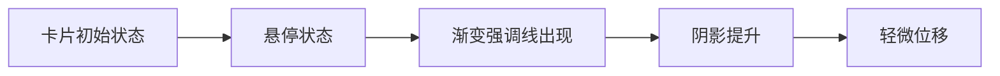

**图表来源**
- [src/views/project/components/file-list.vue:420-435](file://src/views/project/components/file-list.vue#L420-L435)

#### 阴影和变换效果
悬停时卡片获得更明显的阴影和轻微的上升位移，提供立体感：

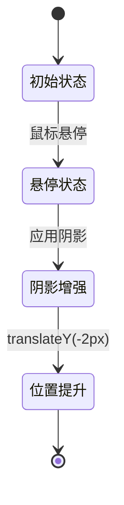

**图表来源**
- [src/views/project/components/file-list.vue:393-402](file://src/views/project/components/file-list.vue#L393-L402)

### 操作按钮视觉反馈优化

#### 状态区分的颜色主题
操作按钮根据功能状态使用不同的颜色主题：

- **默认状态**：使用半透明的深色主题
- **强调状态**：分享按钮使用紫色主题
- **危险状态**：删除按钮使用红色主题
- **悬停效果**：平滑的颜色过渡和边框变化

#### 按钮交互反馈
每个操作按钮都有精心设计的悬停效果：

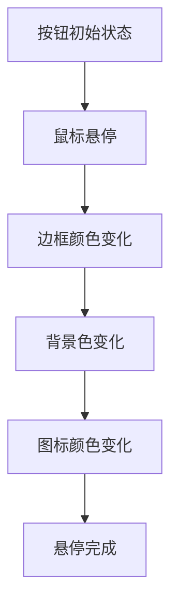

**图表来源**
- [src/views/project/components/file-list.vue:464-480](file://src/views/project/components/file-list.vue#L464-L480)

### 滚动条样式美化

#### 渐变滚动条设计
自定义滚动条使用渐变背景，提供视觉上的连续性：

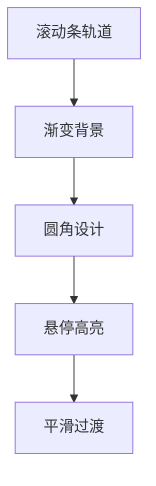

**图表来源**
- [src/views/project/components/file-list.vue:628-649](file://src/views/project/components/file-list.vue#L628-L649)

### 加载动画和空状态改进

#### 加载动画优化
加载动画使用三个跳动的圆点，具有不同的动画延迟，创造节奏感：

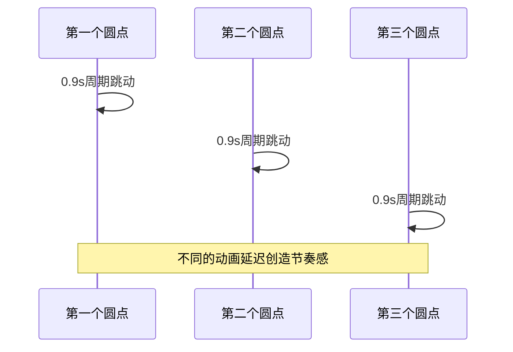

**图表来源**
- [src/views/project/components/file-list.vue:617-626](file://src/views/project/components/file-list.vue#L617-L626)

#### 空状态视觉设计
空状态图标使用渐变色彩，提供温馨的视觉反馈：

**图表来源**
- [src/views/project/components/file-list.vue:569-595](file://src/views/project/components/file-list.vue#L569-L595)

### 整体色彩系统优化

#### 主题色彩体系
组件采用统一的色彩体系，支持主题切换：

- **主色调**：深紫色 (#3d2266) 和绿色 (#437b70)
- **辅助色**：浅紫色和黄绿色渐变
- **中性色**：用于文本和边框的灰色系
- **状态色**：红色用于危险操作，绿色用于成功状态

#### 背景和渐变设计
整体背景使用微妙的径向渐变，营造柔和的视觉氛围：

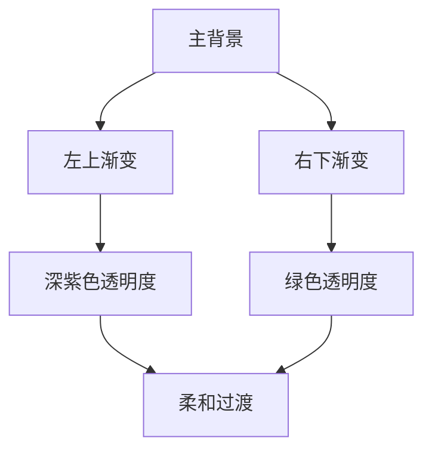

**图表来源**
- [src/layout/ProjectLayout/index.vue:158-162](file://src/layout/ProjectLayout/index.vue#L158-L162)

**章节来源**
- [src/views/project/components/file-list.vue:368-650](file://src/views/project/components/file-list.vue#L368-L650)
- [src/style/color.css:1-28](file://src/style/color.css#L1-L28)
- [src/style/index.css:1-12](file://src/style/index.css#L1-L12)
- [src/layout/ProjectLayout/index.vue:151-162](file://src/layout/ProjectLayout/index.vue#L151-L162)

## 依赖关系分析

文件列表组件的依赖关系呈现清晰的分层结构：

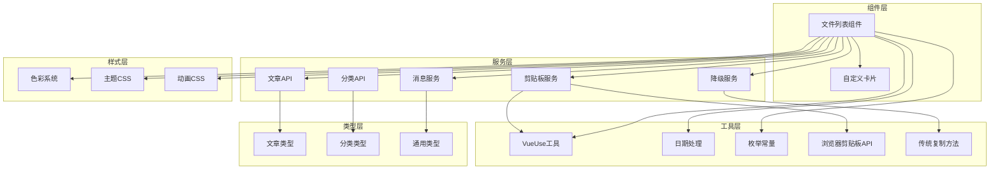

**图表来源**
- [src/views/project/components/file-list.vue:1-17](file://src/views/project/components/file-list.vue#L1-L17)
- [src/api/article.ts:1-3](file://src/api/article.ts#L1-L3)
- [package.json:23-23](file://package.json#L23-L23)

### 外部依赖分析

组件依赖的关键外部库：

| 依赖库 | 版本 | 用途 |
|--------|------|------|
| tdesign-vue-next | 最新版本 | UI 组件库 |
| vue | 3.x | 前端框架 |
| dayjs | 最新版本 | 日期处理 |
| @vueuse/core | ^14.2.0 | Vue 组合式工具（包含useClipboard） |
| @types/axios | 最新版本 | TypeScript 类型定义 |

**更新** 新增VueUse的useClipboard功能，版本为^14.2.0：

**章节来源**
- [src/views/project/components/file-list.vue:1-17](file://src/views/project/components/file-list.vue#L1-L17)
- [package.json:23-23](file://package.json#L23-L23)

## 性能考虑

文件列表组件在设计时充分考虑了性能优化：

### 无限滚动优化
- **防抖机制**：避免频繁触发加载
- **内存管理**：及时清理不再需要的数据
- **渲染优化**：使用虚拟滚动减少 DOM 元素

### 网络请求优化
- **请求去重**：防止重复请求相同数据
- **缓存策略**：合理利用浏览器缓存
- **错误重试**：智能的失败重试机制

### 渲染性能
- **懒加载**：图片和其他资源的延迟加载
- **组件拆分**：将大组件拆分为更小的子组件
- **计算属性**：使用 computed 优化响应式更新

### 剪贴板功能优化
- **浏览器兼容性检测**：使用 `isSupported` 属性检查 Clipboard API 支持
- **异步操作处理**：使用 Promise 处理复制操作，包含错误处理
- **双层降级机制**：优先使用现代 API，失败时自动降级到传统方案
- **用户体验优化**：提供即时的成功/失败反馈提示

### 样式性能优化
- **CSS 变量**：使用 CSS 变量减少样式计算开销
- **硬件加速**：合理使用 transform 和 opacity 属性
- **动画优化**：使用 CSS 动画而非 JavaScript 动画
- **渐变背景**：使用 GPU 加速的渐变效果

**更新** 样式性能优化新增：
- **CSS 变量系统**：统一的颜色和尺寸变量管理
- **硬件加速动画**：使用 transform 和 opacity 实现流畅动画
- **渐变背景优化**：GPU 加速的渐变效果减少重绘
- **响应式设计**：媒体查询优化移动端性能

## 故障排除指南

### 常见问题及解决方案

#### 1. 无限滚动不生效
**症状**：滚动到底部不触发新的数据加载
**可能原因**：
- 滚动容器高度设置不正确
- `hasMore` 计算逻辑错误
- 无限滚动钩子初始化失败

**解决方案**：
检查滚动容器的 CSS 设置，确保 `overflow-auto` 正确应用。

#### 2. 文章列表为空
**症状**：页面显示"暂无数据"
**可能原因**：
- 当前分类下确实没有文章
- API 请求失败
- 分类节点切换问题

**解决方案**：
验证 `currentNode` 属性是否正确传递，检查网络请求状态。

#### 3. 分享功能异常
**症状**：分享或取消分享按钮无响应
**可能原因**：
- 分享密码输入为空
- API 调用失败
- 权限问题

**解决方案**：
检查分享相关的 API 调用，验证用户权限和网络连接。

#### 4. 剪贴板复制功能失效
**症状**：复制分享链接按钮无响应或报错
**可能原因**：
- 浏览器不支持 Clipboard API
- HTTPS 环境限制
- 用户权限拒绝
- VueUse库加载失败

**解决方案**：
检查浏览器控制台错误信息，确认使用 HTTPS 环境，验证用户权限设置。如果 VueUse不可用，系统会自动降级到传统复制方案。

#### 5. 样式显示异常
**症状**：卡片悬停效果不显示或显示异常
**可能原因**：
- CSS 变量未正确设置
- 浏览器不支持某些 CSS 属性
- 样式冲突
- 主题切换问题

**解决方案**：
检查浏览器开发者工具中的样式计算，确认 CSS 变量值正确，验证浏览器兼容性。

**更新** 样式功能故障排除新增：
- **CSS 变量检查**：验证 `--lf-card-*` 变量是否正确设置
- **浏览器兼容性**：检查 `:deep()` 选择器和 CSS 变量支持情况
- **动画性能**：确认硬件加速属性正确应用
- **主题系统**：验证主题切换时的样式更新

**章节来源**
- [src/views/project/components/file-list.vue:201-256](file://src/views/project/components/file-list.vue#L201-L256)
- [src/views/project/components/file-list.vue:368-650](file://src/views/project/components/file-list.vue#L368-L650)

## 结论

文件列表组件是 LiFocus 项目管理系统中的关键组件，它成功地将复杂的功能需求转化为简洁易用的用户界面。组件的设计体现了现代前端开发的最佳实践：

### 设计优势
- **模块化设计**：清晰的组件边界和职责分离
- **类型安全**：完整的 TypeScript 类型定义
- **响应式架构**：灵活的状态管理和数据流
- **用户体验**：流畅的交互和加载体验
- **跨浏览器兼容**：使用VueUse确保功能在各种环境下正常工作
- **视觉一致性**：统一的色彩系统和设计语言

### 技术亮点
- 无限滚动加载的高效实现
- 完整的文章生命周期管理
- 灵活的分类和搜索功能
- 优雅的视觉反馈和动画效果
- **新增** 双层复制链接系统的跨浏览器兼容性实现
- **新增** 增强的卡片悬停效果和视觉反馈
- **新增** 美化的滚动条和加载动画
- **新增** 优化的色彩系统和主题支持

**更新** 样式系统的技术亮点：
- **CSS 变量系统**：统一的颜色和尺寸变量管理
- **渐变强调线**：卡片悬停时的视觉焦点引导
- **硬件加速动画**：流畅的过渡效果和性能优化
- **主题色彩体系**：支持主题切换的一致视觉体验
- **响应式设计**：适配不同设备和屏幕尺寸

**更新** 剪贴板功能的技术亮点：
- **VueUse集成**：现代化的剪贴板 API 使用
- **降级机制**：传统方法作为后备保障
- **错误处理**：完善的异常捕获和用户提示
- **兼容性测试**：自动检测和适配不同浏览器环境

该组件为整个项目提供了坚实的基础，是构建复杂内容管理系统的优秀范例。样式系统的全面改进进一步提升了用户体验和系统美感，为未来的功能扩展奠定了良好的技术基础。双层复制链接系统和增强的视觉反馈共同构成了现代化、专业化的用户界面体验。