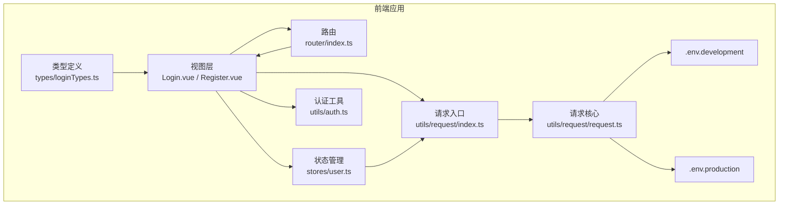
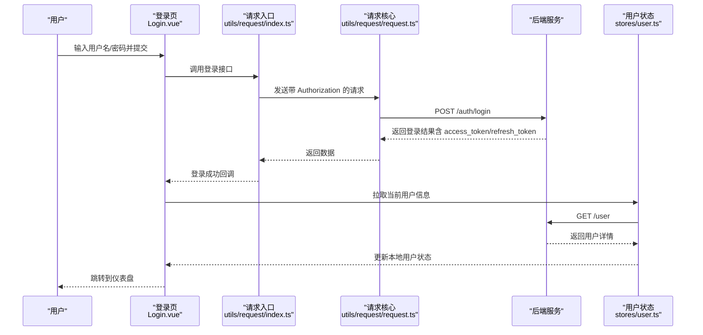
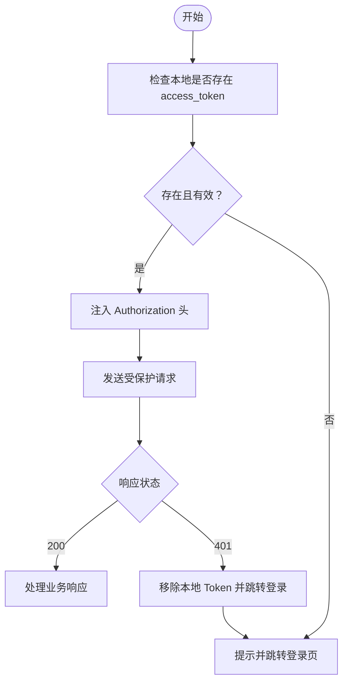
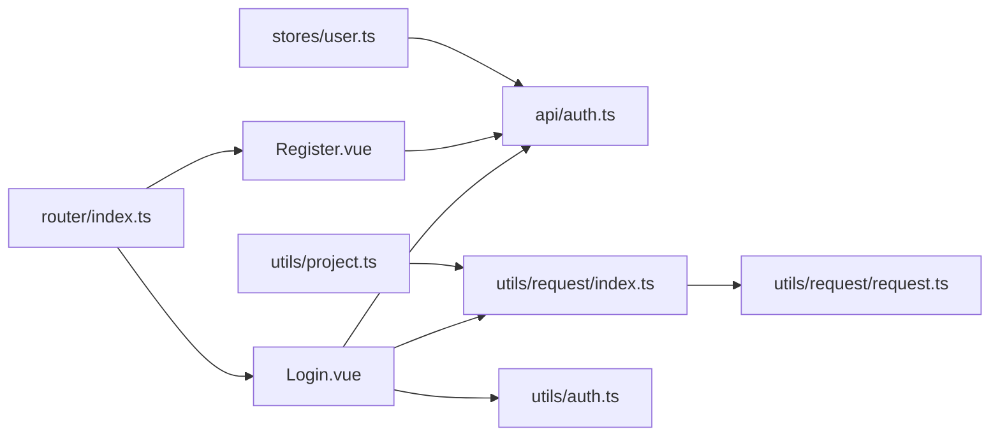

# 安全考虑

<cite>
**本文引用的文件**
- [package.json](file://package.json)
- [vite.config.ts](file://vite.config.ts)
- [.env.development](file://.env.development)
- [.env.production](file://.env.production)
- [src/utils/request/request.ts](file://src/utils/request/request.ts)
- [src/utils/request/index.ts](file://src/utils/request/index.ts)
- [src/utils/request/type.ts](file://src/utils/request/type.ts)
- [src/utils/auth.ts](file://src/utils/auth.ts)
- [src/utils/project.ts](file://src/utils/project.ts)
- [src/stores/user.ts](file://src/stores/user.ts)
- [src/api/auth.ts](file://src/api/auth.ts)
- [src/views/auth/Login.vue](file://src/views/auth/Login.vue)
- [src/views/auth/Register.vue](file://src/views/auth/Register.vue)
- [src/router/index.ts](file://src/router/index.ts)
- [src/types/loginTypes.ts](file://src/types/loginTypes.ts)
</cite>

## 目录
1. [简介](#简介)
2. [项目结构](#项目结构)
3. [核心组件](#核心组件)
4. [架构总览](#架构总览)
5. [详细组件分析](#详细组件分析)
6. [依赖关系分析](#依赖关系分析)
7. [性能与安全特性](#性能与安全特性)
8. [故障排查指南](#故障排查指南)
9. [结论](#结论)
10. [附录](#附录)

## 简介
本指南聚焦 LiFocus Web V2 在前端侧的安全设计与实践，围绕以下主题展开：输入验证与输出安全、跨站脚本攻击（XSS）防护、跨站请求伪造（CSRF）防护、认证与授权（含 JWT Token 管理）、数据传输安全（HTTPS 与敏感信息保护）、客户端存储安全（localStorage 与 Cookie）、安全漏洞预防与检测、安全审计与渗透测试建议，以及第三方依赖的安全管理与更新策略。文档在每个涉及具体实现的章节均给出“章节来源”，以便读者追溯到仓库中的实际代码位置。

## 项目结构
前端采用 Vue 3 + TypeScript + Vite 构建，核心安全相关的模块分布如下：
- 请求封装与拦截器：统一注入 Authorization 头、白名单放行、401 自动跳转与登出
- 认证工具：Token 的设置、读取、移除；支持 Cookie/SessionStorage 双模式
- 路由与视图：登录/注册页面与受保护路由
- 环境变量：后端 API 基地址配置
- Pinia Store：持久化用户信息（localStorage）

图表来源
- [src/views/auth/Login.vue](file://src/views/auth/Login.vue#L1-L138)
- [src/views/auth/Register.vue](file://src/views/auth/Register.vue#L1-L137)
- [src/router/index.ts](file://src/router/index.ts#L1-L82)
- [src/stores/user.ts](file://src/stores/user.ts#L1-L29)
- [src/utils/auth.ts](file://src/utils/auth.ts#L1-L71)
- [src/utils/request/index.ts](file://src/utils/request/index.ts#L1-L40)
- [src/utils/request/request.ts](file://src/utils/request/request.ts#L1-L99)
- [.env.development](file://.env.development#L1-L4)
- [.env.production](file://.env.production#L1-L2)

章节来源
- [package.json](file://package.json#L1-L60)
- [vite.config.ts](file://vite.config.ts#L1-L31)
- [.env.development](file://.env.development#L1-L4)
- [.env.production](file://.env.production#L1-L2)

## 核心组件
- 请求封装与拦截器
  - 统一在请求前注入 Authorization 头，白名单路径放行，未携带 Token 时提示并跳转登录
  - 统一响应处理：401 自动移除 Token 并跳转登录；非 200 错误统一提示
- 认证工具
  - 支持“记住我”场景下的 Cookie 存储与 SessionStorage 存储切换
  - 提供获取访问令牌、刷新令牌与移除令牌的统一接口
- 用户状态管理
  - 使用 Pinia 持久化用户信息至 localStorage，避免刷新丢失
- 登录/注册视图
  - 表单校验规则与交互反馈
- 类型定义
  - 明确登录/注册参数与返回结构，便于前后端契约一致

章节来源
- [src/utils/request/request.ts](file://src/utils/request/request.ts#L1-L99)
- [src/utils/request/index.ts](file://src/utils/request/index.ts#L1-L40)
- [src/utils/auth.ts](file://src/utils/auth.ts#L1-L71)
- [src/stores/user.ts](file://src/stores/user.ts#L1-L29)
- [src/views/auth/Login.vue](file://src/views/auth/Login.vue#L1-L138)
- [src/views/auth/Register.vue](file://src/views/auth/Register.vue#L1-L137)
- [src/types/loginTypes.ts](file://src/types/loginTypes.ts#L1-L47)

## 架构总览
下图展示从前端到后端的关键交互流程，重点标注了安全控制点：请求头注入、白名单放行、401 处理、登录成功后的用户信息拉取与路由跳转。

图表来源
- [src/views/auth/Login.vue](file://src/views/auth/Login.vue#L38-L80)
- [src/utils/request/index.ts](file://src/utils/request/index.ts#L12-L39)
- [src/utils/request/request.ts](file://src/utils/request/request.ts#L26-L40)
- [src/api/auth.ts](file://src/api/auth.ts#L7-L12)
- [src/stores/user.ts](file://src/stores/user.ts#L12-L19)

## 详细组件分析

### XSS 防护
- 输入验证
  - 登录/注册表单具备必填与格式校验，减少恶意输入进入后端
  - 登录页对用户名/密码字段进行必填校验；注册页对密码复杂度、邮箱格式进行校验
- 输出安全
  - 当前视图层使用 tdesign-vue-next 组件渲染，未见直接拼接用户输入到 innerHTML 的逻辑
  - 建议：避免将未经转义的用户输入写入 DOM；如需富文本展示，建议使用受信任的渲染库并开启白名单
- 内容安全策略（CSP）
  - 项目未显式配置 CSP 头；建议在后端或反向代理层增加 CSP 头，限制脚本来源与内联脚本执行
  - 若使用 Vite 开发环境，可考虑通过插件或构建配置注入 CSP 元标签（开发阶段）

章节来源
- [src/views/auth/Login.vue](file://src/views/auth/Login.vue#L26-L32)
- [src/views/auth/Register.vue](file://src/views/auth/Register.vue#L21-L36)

### CSRF 防护
- Token 验证
  - 所有受保护请求在请求头中携带 Bearer Token，后端基于该 Token 进行鉴权
  - 白名单路径（如登录/注册）可选择性放行，但需确保仅用于无状态或受控场景
- 同源策略
  - 前端通过 Vite 代理将 /api 前缀转发至后端，避免跨域带来的 CSRF 风险
  - 建议：后端启用 SameSite Cookie、CSRF Token 或双重提交 Cookie 策略以进一步加固
- 建议
  - 对于关键写操作，建议引入后端 CSRF Token，并在请求头或 Cookie 中携带
  - 严格区分 GET/HEAD 为只读，其他方法必须携带 CSRF 保护

章节来源
- [src/utils/request/index.ts](file://src/utils/request/index.ts#L10-L39)
- [vite.config.ts](file://vite.config.ts#L21-L28)

### 认证与授权
- JWT Token 管理
  - 登录成功后，前端将 access_token/refresh_token 与过期时间存入 Cookie 或 SessionStorage（取决于“记住我”选项）
  - 请求前自动从存储中读取 access_token 注入 Authorization 头
  - 401 时自动移除 Token 并跳转登录页
- 权限控制
  - 当前未见前端细粒度权限判断逻辑；建议在用户信息中加入角色/权限集合，并在路由守卫或组件中进行权限校验
- 会话安全
  - “记住我”场景使用短期 Cookie；非“记住我”使用 SessionStorage，降低长期暴露风险
  - 建议：后端设置 HttpOnly、Secure、SameSite 属性；前端避免将敏感信息写入 localStorage

图表来源
- [src/utils/request/index.ts](file://src/utils/request/index.ts#L23-L36)
- [src/utils/request/request.ts](file://src/utils/request/request.ts#L31-L39)
- [src/utils/auth.ts](file://src/utils/auth.ts#L12-L24)

章节来源
- [src/utils/auth.ts](file://src/utils/auth.ts#L1-L71)
- [src/utils/request/index.ts](file://src/utils/request/index.ts#L1-L40)
- [src/utils/request/request.ts](file://src/utils/request/request.ts#L1-L99)
- [src/views/auth/Login.vue](file://src/views/auth/Login.vue#L62-L70)

### 数据传输安全
- HTTPS 配置
  - 生产环境通过环境变量指定后端地址；建议在部署层强制使用 HTTPS，禁用明文 HTTP
- 敏感信息保护
  - Token 与用户信息通过请求头与 Cookie/SessionStorage 传递；建议后端设置 Secure/HttpOnly/SameSite
  - 前端避免将敏感数据写入 localStorage（当前用户信息已持久化，建议评估是否必要）

章节来源
- [.env.production](file://.env.production#L1-L2)
- [src/stores/user.ts](file://src/stores/user.ts#L22-L25)

### 客户端存储安全
- Cookie
  - “记住我”场景使用短期 Cookie 存储 Token；建议后端设置 Secure/HttpOnly/SameSite
- SessionStorage
  - 非“记住我”场景使用 SessionStorage，生命周期随会话；仍需注意 XSS 风险
- localStorage
  - 用户信息已持久化至 localStorage；建议评估是否需要长期持久化，若非必需可改为内存态或仅短期缓存

章节来源
- [src/utils/auth.ts](file://src/utils/auth.ts#L12-L24)
- [src/utils/auth.ts](file://src/utils/auth.ts#L29-L44)
- [src/stores/user.ts](file://src/stores/user.ts#L22-L25)

### 安全漏洞预防与检测
- 输入验证
  - 表单校验规则覆盖必填与格式；建议补充长度限制与字符集白名单
- 输出编码
  - 富文本场景建议使用受信任渲染库并开启白名单
- 日志与错误处理
  - 统一错误提示，避免泄露内部细节；401 自动跳转登录，防止凭据泄露
- 依赖安全
  - 定期扫描依赖漏洞，及时升级；使用锁定文件保证可重复构建

章节来源
- [src/views/auth/Register.vue](file://src/views/auth/Register.vue#L21-L36)
- [src/utils/request/request.ts](file://src/utils/request/request.ts#L31-L39)

### 安全审计与渗透测试建议
- 前端侧
  - 静态分析：检查是否存在内联脚本、eval 使用、动态 HTML 注入
  - 动态测试：模拟 XSS、CSRF、暴力破解、越权访问等场景
- 后端侧
  - 强制 HTTPS、CORS/CSP 策略、速率限制、审计日志
- 持续集成
  - 将依赖扫描与安全测试纳入 CI 流水线

### 第三方依赖的安全管理与更新策略
- 依赖清单与版本
  - 关注 axios、js-cookie、pinia、vue、vue-router 等核心依赖的安全公告
- 更新策略
  - 采用语义化版本范围，定期审查并升级；优先修复高危漏洞
- 锁定与审计
  - 使用锁定文件，定期运行安全扫描工具

章节来源
- [package.json](file://package.json#L18-L38)

## 依赖关系分析

图表来源
- [src/views/auth/Login.vue](file://src/views/auth/Login.vue#L1-L138)
- [src/views/auth/Register.vue](file://src/views/auth/Register.vue#L1-L137)
- [src/api/auth.ts](file://src/api/auth.ts#L1-L41)
- [src/utils/request/index.ts](file://src/utils/request/index.ts#L1-L40)
- [src/utils/request/request.ts](file://src/utils/request/request.ts#L1-L99)
- [src/utils/auth.ts](file://src/utils/auth.ts#L1-L71)
- [src/router/index.ts](file://src/router/index.ts#L1-L82)
- [src/stores/user.ts](file://src/stores/user.ts#L1-L29)
- [src/utils/project.ts](file://src/utils/project.ts#L1-L9)

章节来源
- [src/router/index.ts](file://src/router/index.ts#L1-L82)
- [src/api/auth.ts](file://src/api/auth.ts#L1-L41)
- [src/utils/request/index.ts](file://src/utils/request/index.ts#L1-L40)

## 性能与安全特性
- 性能
  - 统一请求封装减少重复逻辑；白名单放行降低鉴权开销
- 安全
  - 401 自动清理与跳转，避免凭据长期暴露
  - “记住我”与非“记住我”的存储策略分离，降低风险面

章节来源
- [src/utils/request/request.ts](file://src/utils/request/request.ts#L31-L39)
- [src/utils/auth.ts](file://src/utils/auth.ts#L12-L24)

## 故障排查指南
- 登录后无法访问受保护资源
  - 检查请求头是否正确注入 Authorization；确认 Token 是否存在且未过期
- 401 频繁触发
  - 检查 Token 生命周期与刷新逻辑；确认后端是否正确颁发与校验 Token
- 用户信息未持久化
  - 检查 localStorage 是否可用；确认 Pinia 持久化配置生效
- 开发环境跨域问题
  - 检查 Vite 代理配置与后端 CORS 设置

章节来源
- [src/utils/request/index.ts](file://src/utils/request/index.ts#L23-L36)
- [src/utils/request/request.ts](file://src/utils/request/request.ts#L31-L39)
- [src/stores/user.ts](file://src/stores/user.ts#L22-L25)
- [vite.config.ts](file://vite.config.ts#L21-L28)

## 结论
LiFocus Web V2 在前端侧已具备基础的安全能力：统一请求拦截、Token 注入与 401 自动处理、登录/注册表单校验、Cookie/SessionStorage 的双存储策略。为进一步提升安全性，建议补充 CSP、后端 CSRF 保护、权限控制、Https 强制、敏感信息最小化存储与依赖安全扫描等措施。通过持续的安全审计与渗透测试，可有效降低 XSS、CSRF、会话劫持等风险。

## 附录
- 环境变量
  - 开发环境：使用 /api 代理至后端
  - 生产环境：指向公网域名
- 类型定义
  - 明确登录/注册参数与返回结构，便于前后端一致性与可测试性

章节来源
- [.env.development](file://.env.development#L1-L4)
- [.env.production](file://.env.production#L1-L2)
- [src/types/loginTypes.ts](file://src/types/loginTypes.ts#L1-L47)