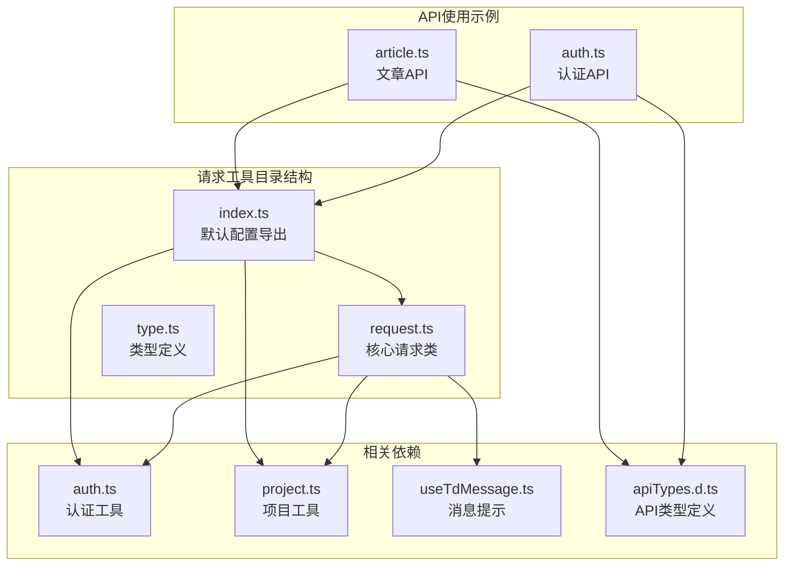
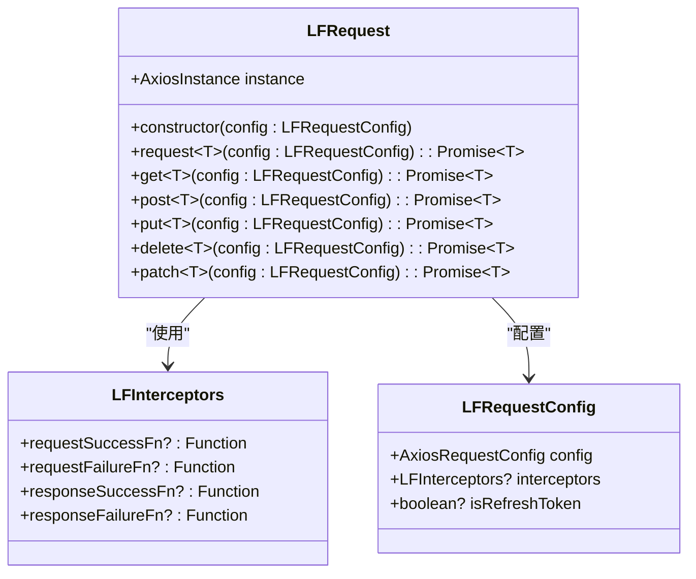
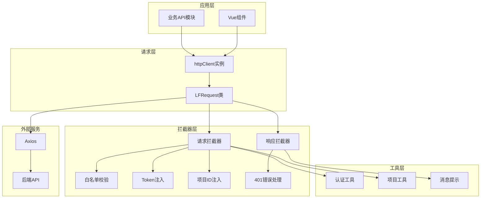
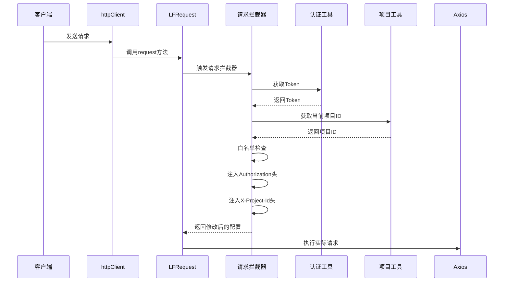
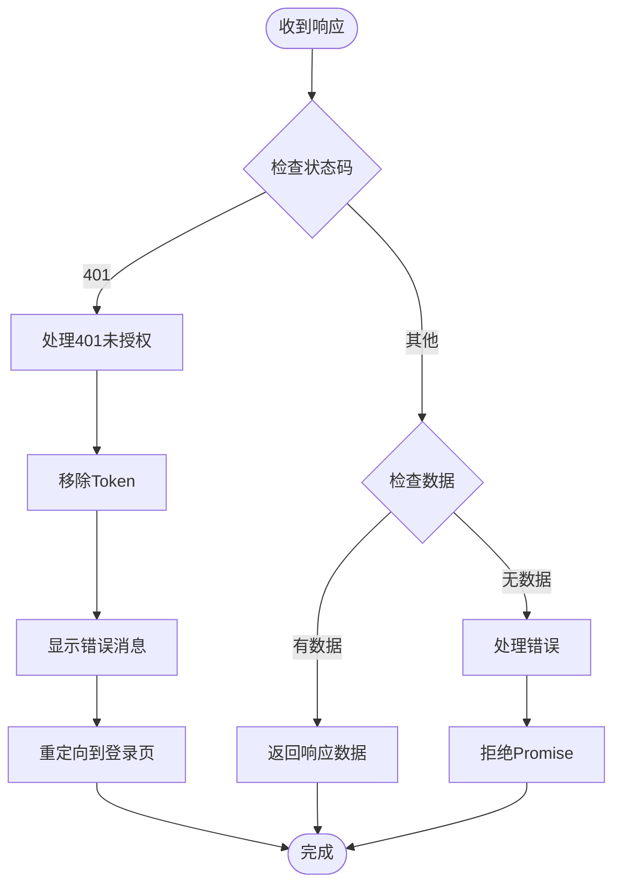
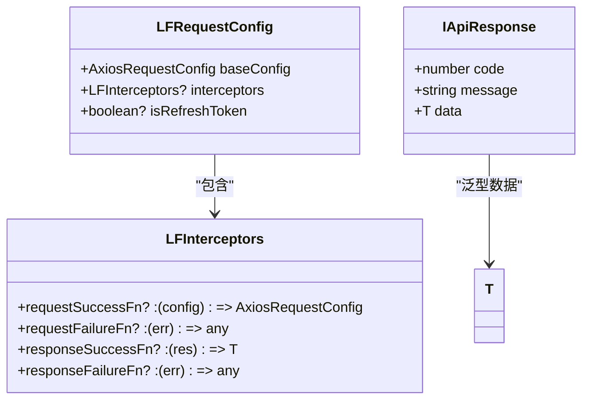
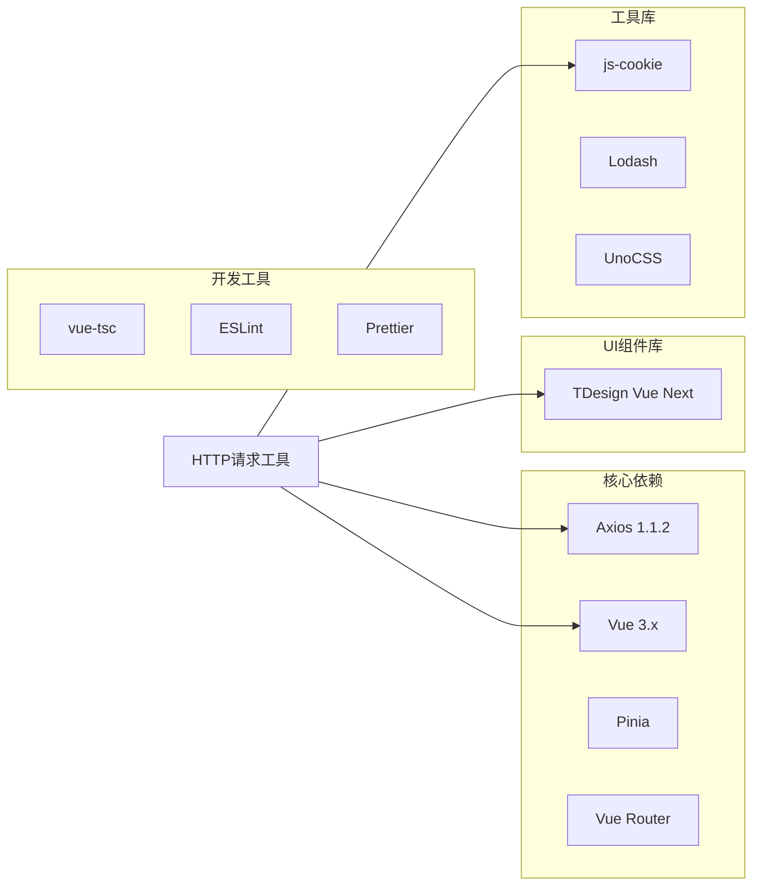
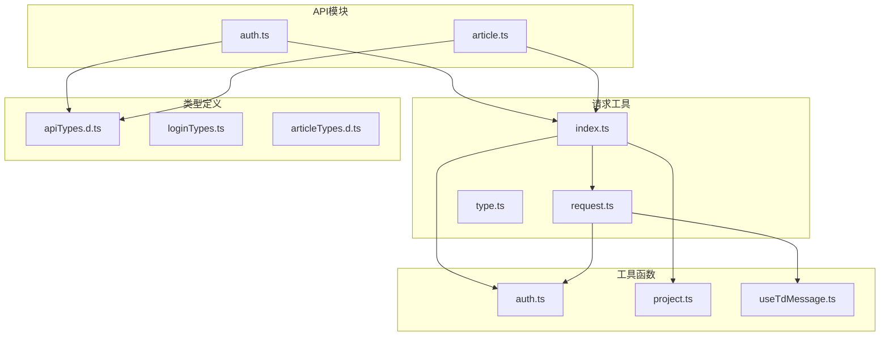

# HTTP请求工具

<cite>
**本文档引用的文件**
- [request.ts](file://src/utils/request/request.ts)
- [index.ts](file://src/utils/request/index.ts)
- [type.ts](file://src/utils/request/type.ts)
- [apiTypes.d.ts](file://src/types/apiTypes.d.ts)
- [useTdMessage.ts](file://src/hooks/useTdMessage.ts)
- [auth.ts](file://src/utils/auth.ts)
- [project.ts](file://src/utils/project.ts)
- [auth.ts](file://src/api/auth.ts)
- [article.ts](file://src/api/article.ts)
- [package.json](file://package.json)
- [.env.development](file://.env.development)
- [.env.production](file://.env.production)
</cite>

## 目录
1. [简介](#简介)
2. [项目结构](#项目结构)
3. [核心组件](#核心组件)
4. [架构概览](#架构概览)
5. [详细组件分析](#详细组件分析)
6. [依赖关系分析](#依赖关系分析)
7. [性能考虑](#性能考虑)
8. [故障排除指南](#故障排除指南)
9. [结论](#结论)

## 简介

LiFocus Web V2 的 HTTP 请求工具是一个基于 Axios 的轻量级封装层，提供了统一的请求配置、拦截器管理和错误处理机制。该工具通过 LFRequest 类实现了对 Axios 的二次封装，为整个应用提供了标准化的 API 调用方式。

该工具的核心特性包括：
- 统一的请求配置管理
- 自定义拦截器支持
- Token 自动注入机制
- 项目ID自动传递
- 错误状态码处理
- 类型安全的响应数据

## 项目结构

HTTP 请求工具位于 `src/utils/request/` 目录下，包含三个核心文件：



**图表来源**
- [request.ts](file://src/utils/request/request.ts#L1-L99)
- [index.ts](file://src/utils/request/index.ts#L1-L40)
- [type.ts](file://src/utils/request/type.ts#L1-L15)

**章节来源**
- [request.ts](file://src/utils/request/request.ts#L1-L99)
- [index.ts](file://src/utils/request/index.ts#L1-L40)
- [type.ts](file://src/utils/request/type.ts#L1-L15)

## 核心组件

### LFRequest 类

LFRequest 是整个请求工具的核心类，继承自 AxiosInstance 并提供了额外的功能增强：



**图表来源**
- [request.ts](file://src/utils/request/request.ts#L9-L96)
- [type.ts](file://src/utils/request/type.ts#L4-L14)

### 默认配置 httpClient

系统提供了预配置的 httpClient 实例，包含了以下特性：

- **基础URL配置**：从环境变量读取 API 基础地址
- **超时设置**：60秒超时时间
- **Token 自动注入**：自动添加 Bearer Token
- **项目ID传递**：自动添加当前项目ID
- **白名单机制**：对特定端点跳过 Token 校验

**章节来源**
- [index.ts](file://src/utils/request/index.ts#L12-L39)

## 架构概览

整个 HTTP 请求工具采用分层架构设计：



**图表来源**
- [request.ts](file://src/utils/request/request.ts#L13-L51)
- [index.ts](file://src/utils/request/index.ts#L12-L39)

## 详细组件分析

### 请求拦截器实现

请求拦截器负责在请求发送前进行必要的预处理：



**图表来源**
- [request.ts](file://src/utils/request/request.ts#L17-L24)
- [index.ts](file://src/utils/request/index.ts#L16-L37)

#### 拦截器功能详解

1. **白名单机制**：对 `/auth/login` 和 `/auth/register` 端点跳过 Token 校验
2. **Token 注入**：自动在 Authorization 头中添加 Bearer Token
3. **项目ID传递**：自动在 X-Project-Id 头中添加当前项目ID
4. **Token 刷新支持**：支持使用刷新Token进行特殊请求

**章节来源**
- [index.ts](file://src/utils/request/index.ts#L9-L39)

### 响应拦截器实现

响应拦截器负责处理服务器响应和错误情况：



**图表来源**
- [request.ts](file://src/utils/request/request.ts#L26-L40)

#### 错误处理策略

1. **401 未授权处理**：自动清除本地Token并重定向到登录页面
2. **非200状态码处理**：返回响应数据或系统错误消息
3. **Promise 拒绝**：确保错误能够被上层正确捕获

**章节来源**
- [request.ts](file://src/utils/request/request.ts#L31-L39)

### 类型系统设计

系统采用了严格的 TypeScript 类型定义来确保类型安全：



**图表来源**
- [type.ts](file://src/utils/request/type.ts#L4-L14)
- [apiTypes.d.ts](file://src/types/apiTypes.d.ts#L2-L6)

**章节来源**
- [type.ts](file://src/utils/request/type.ts#L1-L15)
- [apiTypes.d.ts](file://src/types/apiTypes.d.ts#L1-L7)

## 依赖关系分析

### 外部依赖

系统主要依赖以下外部库：



**图表来源**
- [package.json](file://package.json#L18-L38)

### 内部依赖关系



**图表来源**
- [request.ts](file://src/utils/request/request.ts#L1-L6)
- [index.ts](file://src/utils/request/index.ts#L1-L6)

**章节来源**
- [package.json](file://package.json#L1-L60)

## 性能考虑

### 超时配置

系统设置了合理的超时时间来平衡用户体验和资源占用：

- **默认超时时间**：60秒
- **适用场景**：大文件上传、复杂查询等长时间操作
- **可调整性**：单个请求可通过配置覆盖默认超时

### 缓存策略

当前实现未包含客户端缓存机制，建议在需要的场景下考虑：

1. **GET 请求缓存**：对不经常变化的数据进行缓存
2. **响应时间戳**：记录数据更新时间用于缓存失效
3. **缓存键生成**：基于 URL 和参数生成唯一缓存键

### 错误重试机制

系统目前没有内置的自动重试机制，但提供了扩展点：

```typescript
// 可选的重试配置示例
const retryConfig = {
  retries: 3,
  retryDelay: 1000,
  retryCondition: (error) => {
    return error.code === 'ECONNABORTED' || error.message.includes('timeout')
  }
}
```

## 故障排除指南

### 常见问题及解决方案

#### 1. Token 相关问题

**问题症状**：401 未授权错误或频繁重定向到登录页

**可能原因**：
- Token 已过期
- Token 格式不正确
- 本地存储损坏

**解决步骤**：
1. 检查浏览器 Cookie 中的 token 是否存在
2. 验证 token 格式是否为 `Bearer xxx`
3. 清除浏览器缓存后重新登录

**章节来源**
- [request.ts](file://src/utils/request/request.ts#L31-L35)
- [auth.ts](file://src/utils/auth.ts#L63-L70)

#### 2. 项目ID相关问题

**问题症状**：API 调用时缺少项目上下文

**解决步骤**：
1. 确认当前项目是否已选择
2. 检查 `X-Project-Id` 头是否正确设置
3. 验证项目ID格式是否正确

**章节来源**
- [index.ts](file://src/utils/request/index.ts#L29-L31)
- [project.ts](file://src/utils/project.ts#L7-L9)

#### 3. 环境配置问题

**问题症状**：请求地址不正确或跨域问题

**解决步骤**：
1. 检查 `.env.development` 和 `.env.production` 文件
2. 确认 `VITE_BASE_API` 配置正确
3. 验证代理配置是否正确

**章节来源**
- [.env.development](file://.env.development#L1-L3)
- [.env.production](file://.env.production#L1)

### 调试技巧

#### 1. 启用 Axios 日志

```typescript
// 在开发环境中启用详细日志
const debugConfig = {
  baseURL: import.meta.env.VITE_BASE_API,
  timeout: 60000,
  // 添加日志拦截器
  interceptors: {
    requestSuccessFn: (config) => {
      console.log('请求:', config)
      return config
    },
    responseSuccessFn: (response) => {
      console.log('响应:', response)
      return response
    }
  }
}
```

#### 2. 错误边界处理

```typescript
// 在 API 调用中添加错误边界
try {
  const result = await apiFunction()
  return result
} catch (error) {
  if (error.status === 401) {
    // 处理未授权
    handleUnauthorized()
  } else if (error.status === 403) {
    // 处理权限不足
    handleForbidden()
  } else {
    // 处理其他错误
    handleError(error)
  }
  throw error
}
```

## 结论

LiFocus Web V2 的 HTTP 请求工具通过精心设计的架构和完善的错误处理机制，为整个应用提供了稳定可靠的 API 通信能力。其主要优势包括：

1. **类型安全**：完整的 TypeScript 类型定义确保编译时类型检查
2. **配置灵活**：支持全局和局部配置，满足不同场景需求
3. **错误处理完善**：针对常见错误场景提供自动处理机制
4. **易于扩展**：清晰的架构设计便于功能扩展和维护

该工具为后续的功能扩展奠定了良好的基础，包括可以考虑添加的特性如自动重试、缓存机制、请求去重等功能，这些都可以在现有架构基础上进行平滑集成。