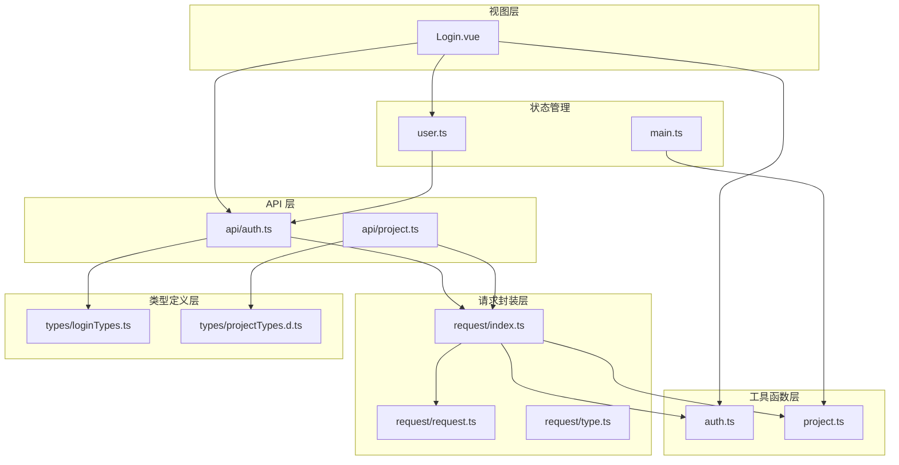
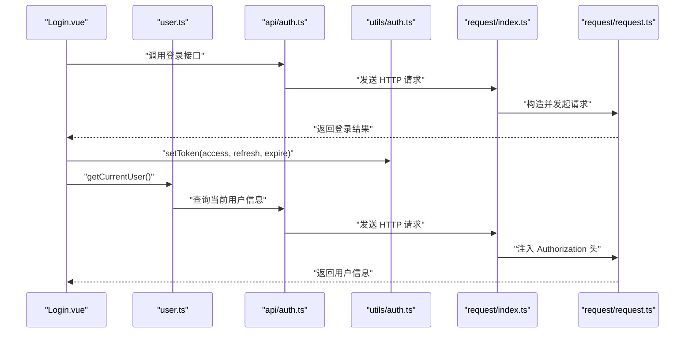
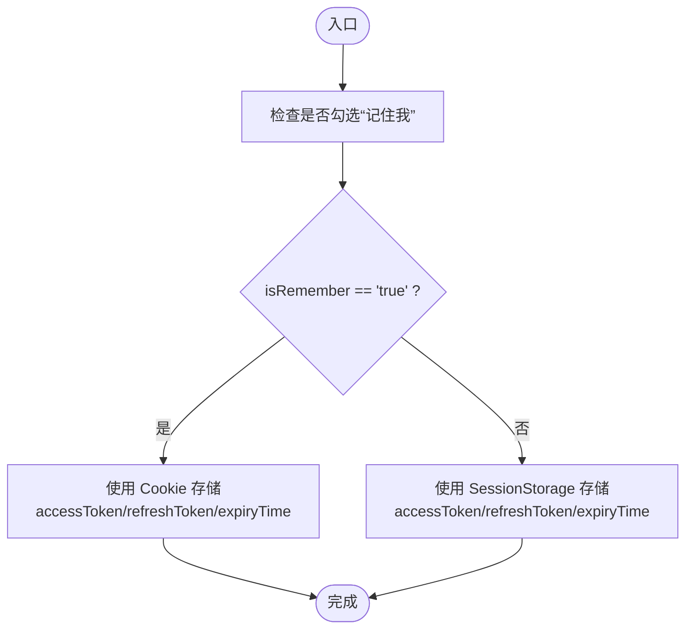
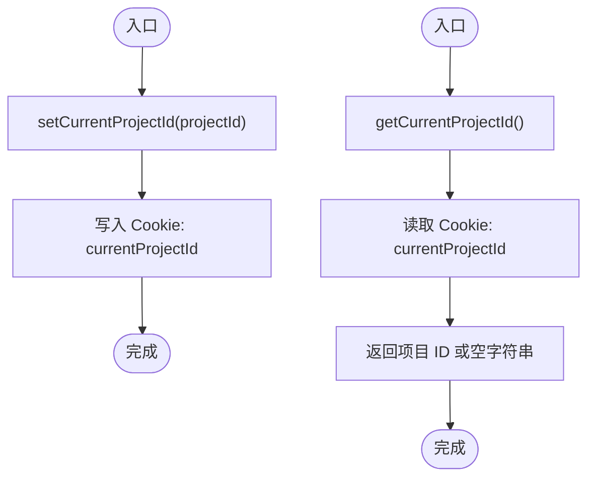
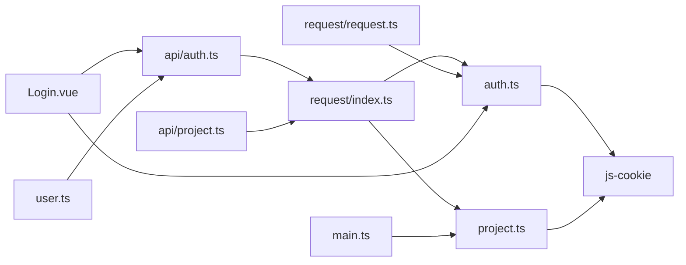

# 业务工具函数

<cite>
**本文引用的文件**
- [src/utils/auth.ts](file://src/utils/auth.ts)
- [src/utils/project.ts](file://src/utils/project.ts)
- [src/stores/user.ts](file://src/stores/user.ts)
- [src/api/auth.ts](file://src/api/auth.ts)
- [src/api/project.ts](file://src/api/project.ts)
- [src/utils/request/index.ts](file://src/utils/request/index.ts)
- [src/utils/request/request.ts](file://src/utils/request/request.ts)
- [src/utils/request/type.ts](file://src/utils/request/type.ts)
- [src/types/loginTypes.ts](file://src/types/loginTypes.ts)
- [src/types/projectTypes.d.ts](file://src/types/projectTypes.d.ts)
- [src/utils/enums/projectEnum.ts](file://src/utils/enums/projectEnum.ts)
- [src/stores/main.ts](file://src/stores/main.ts)
- [src/views/auth/Login.vue](file://src/views/auth/Login.vue)
</cite>

## 目录
1. [简介](#简介)
2. [项目结构](#项目结构)
3. [核心组件](#核心组件)
4. [架构总览](#架构总览)
5. [详细组件分析](#详细组件分析)
6. [依赖关系分析](#依赖关系分析)
7. [性能考虑](#性能考虑)
8. [故障排除指南](#故障排除指南)
9. [结论](#结论)

## 简介
本文件聚焦于 LiFocus Web V2 中的业务工具函数，重点覆盖以下两个模块：
- 认证工具函数：负责 token 的设置、获取、刷新与移除，以及与 Cookie/SessionStorage 的持久化策略。
- 项目工具函数：负责当前项目 ID 的设置与获取，用于后续 API 请求时携带项目上下文。

文档将从架构、数据流、处理逻辑、集成点、错误处理与边界情况等方面进行深入解析，并给出每个工具函数的参数说明、返回值类型、典型使用场景与调用时机，以及与状态管理、API 层的集成方式。

## 项目结构
围绕业务工具函数的相关目录与文件组织如下：
- 工具函数层：认证与项目工具函数位于 src/utils 下
- 类型定义层：登录与项目相关类型定义位于 src/types 下
- 请求封装层：HTTP 客户端封装与拦截器位于 src/utils/request 下
- API 层：认证与项目相关接口位于 src/api 下
- 状态管理：用户与主状态位于 src/stores 下
- 视图层：登录页面演示了工具函数的典型使用

图表来源
- [src/views/auth/Login.vue](file://src/views/auth/Login.vue#L1-L138)
- [src/stores/user.ts](file://src/stores/user.ts#L1-L29)
- [src/stores/main.ts](file://src/stores/main.ts#L1-L21)
- [src/utils/auth.ts](file://src/utils/auth.ts#L1-L71)
- [src/utils/project.ts](file://src/utils/project.ts#L1-L10)
- [src/utils/request/index.ts](file://src/utils/request/index.ts#L1-L40)
- [src/utils/request/request.ts](file://src/utils/request/request.ts#L1-L99)
- [src/utils/request/type.ts](file://src/utils/request/type.ts#L1-L15)
- [src/api/auth.ts](file://src/api/auth.ts#L1-L41)
- [src/api/project.ts](file://src/api/project.ts#L1-L38)
- [src/types/loginTypes.ts](file://src/types/loginTypes.ts#L1-L47)
- [src/types/projectTypes.d.ts](file://src/types/projectTypes.d.ts#L1-L27)

章节来源
- [src/utils/auth.ts](file://src/utils/auth.ts#L1-L71)
- [src/utils/project.ts](file://src/utils/project.ts#L1-L10)
- [src/utils/request/index.ts](file://src/utils/request/index.ts#L1-L40)
- [src/utils/request/request.ts](file://src/utils/request/request.ts#L1-L99)
- [src/utils/request/type.ts](file://src/utils/request/type.ts#L1-L15)
- [src/api/auth.ts](file://src/api/auth.ts#L1-L41)
- [src/api/project.ts](file://src/api/project.ts#L1-L38)
- [src/stores/user.ts](file://src/stores/user.ts#L1-L29)
- [src/stores/main.ts](file://src/stores/main.ts#L1-L21)
- [src/types/loginTypes.ts](file://src/types/loginTypes.ts#L1-L47)
- [src/types/projectTypes.d.ts](file://src/types/projectTypes.d.ts#L1-L27)
- [src/views/auth/Login.vue](file://src/views/auth/Login.vue#L1-L138)

## 核心组件
本节概述两个业务工具函数模块及其职责：
- 认证工具函数（auth.ts）
  - 提供 token 的设置、获取、刷新与移除能力
  - 支持“记住我”模式下的 Cookie 存储与 SessionStorage 存储两种策略
  - 与请求拦截器协作，自动注入 Authorization 头与项目上下文头
- 项目工具函数（project.ts）
  - 提供当前项目 ID 的设置与获取
  - 通过 Cookie 实现跨会话持久化
  - 与主状态 store 协作，保持全局项目上下文一致

章节来源
- [src/utils/auth.ts](file://src/utils/auth.ts#L1-L71)
- [src/utils/project.ts](file://src/utils/project.ts#L1-L10)
- [src/stores/main.ts](file://src/stores/main.ts#L1-L21)

## 架构总览
下图展示了工具函数在整体架构中的位置与交互关系，以及与状态管理、API 层的集成方式：

图表来源
- [src/views/auth/Login.vue](file://src/views/auth/Login.vue#L1-L138)
- [src/stores/user.ts](file://src/stores/user.ts#L1-L29)
- [src/api/auth.ts](file://src/api/auth.ts#L1-L41)
- [src/utils/auth.ts](file://src/utils/auth.ts#L1-L71)
- [src/utils/request/index.ts](file://src/utils/request/index.ts#L1-L40)
- [src/utils/request/request.ts](file://src/utils/request/request.ts#L1-L99)

## 详细组件分析

### 认证工具函数（auth.ts）

#### 函数概览
- setToken(accessToken: string, refreshToken: string, expireTime: string): void
  - 功能：根据“记住我”选项选择 Cookie 或 SessionStorage 存储 token 及过期时间
  - 参数：
    - accessToken: 访问令牌字符串
    - refreshToken: 刷新令牌字符串
    - expireTime: 过期时间字符串
  - 返回值：无
  - 典型调用时机：登录成功后，将服务端返回的 token 写入存储
  - 边界情况：当 isRemember 为 true 时使用 Cookie，否则使用 SessionStorage；Cookie 过期时间为 1/24 天
- getToken(): { accessToken: string; refreshToken: string; expireTime: string } | null
  - 功能：统一获取当前有效的 token 对象
  - 返回值：包含 accessToken、refreshToken、expireTime 的对象或空
  - 典型调用时机：请求拦截器中注入 Authorization 头前
  - 边界情况：若未登录或存储为空，返回 null
- getRefreshToken(): string | null
  - 功能：获取刷新 token
  - 返回值：刷新 token 字符串或空
  - 典型调用时机：刷新流程或特殊接口（如登出）需要使用刷新 token
- removeToken(): void
  - 功能：清理所有 token 相关存储项
  - 返回值：无
  - 典型调用时机：登出或 401 未授权时触发

图表来源
- [src/utils/auth.ts](file://src/utils/auth.ts#L12-L24)

章节来源
- [src/utils/auth.ts](file://src/utils/auth.ts#L1-L71)
- [src/utils/request/index.ts](file://src/utils/request/index.ts#L1-L40)
- [src/utils/request/request.ts](file://src/utils/request/request.ts#L1-L99)

#### 与状态管理、API 层的集成
- 登录流程：Login.vue 调用登录 API，成功后调用 setToken 并拉取当前用户信息
- 请求拦截：request/index.ts 在请求前读取 token 并注入 Authorization 头；同时读取当前项目 ID 注入 X-Project-Id 头
- 未授权处理：request/request.ts 在响应拦截中捕获 401，调用 removeToken 并跳转到登录页

章节来源
- [src/views/auth/Login.vue](file://src/views/auth/Login.vue#L1-L138)
- [src/api/auth.ts](file://src/api/auth.ts#L1-L41)
- [src/stores/user.ts](file://src/stores/user.ts#L1-L29)
- [src/utils/request/index.ts](file://src/utils/request/index.ts#L1-L40)
- [src/utils/request/request.ts](file://src/utils/request/request.ts#L1-L99)

### 项目工具函数（project.ts）

#### 函数概览
- setCurrentProjectId(projectId: string): void
  - 功能：设置当前项目 ID 并持久化到 Cookie
  - 参数：projectId - 当前项目标识字符串
  - 返回值：无
  - 典型调用时机：切换项目或进入项目相关页面时
- getCurrentProjectId(): string
  - 功能：获取当前项目 ID
  - 返回值：当前项目 ID 字符串（默认空字符串）
  - 典型调用时机：每次发起 API 请求时，由请求拦截器读取并注入到请求头

图表来源
- [src/utils/project.ts](file://src/utils/project.ts#L1-L10)

章节来源
- [src/utils/project.ts](file://src/utils/project.ts#L1-L10)
- [src/stores/main.ts](file://src/stores/main.ts#L1-L21)
- [src/utils/request/index.ts](file://src/utils/request/index.ts#L1-L40)

#### 与状态管理、API 层的集成
- 主状态 store：useMainStore 维护 isLoading 与 currentProjectId，并在变更时同步调用 setCurrentProjectId
- 请求拦截：request/index.ts 读取当前项目 ID 并注入到请求头 X-Project-Id，确保后端按项目维度处理请求

章节来源
- [src/stores/main.ts](file://src/stores/main.ts#L1-L21)
- [src/utils/request/index.ts](file://src/utils/request/index.ts#L1-L40)

## 依赖关系分析

图表来源
- [src/utils/auth.ts](file://src/utils/auth.ts#L1-L71)
- [src/utils/project.ts](file://src/utils/project.ts#L1-L10)
- [src/utils/request/index.ts](file://src/utils/request/index.ts#L1-L40)
- [src/utils/request/request.ts](file://src/utils/request/request.ts#L1-L99)
- [src/api/auth.ts](file://src/api/auth.ts#L1-L41)
- [src/api/project.ts](file://src/api/project.ts#L1-L38)
- [src/views/auth/Login.vue](file://src/views/auth/Login.vue#L1-L138)
- [src/stores/user.ts](file://src/stores/user.ts#L1-L29)
- [src/stores/main.ts](file://src/stores/main.ts#L1-L21)

章节来源
- [src/utils/auth.ts](file://src/utils/auth.ts#L1-L71)
- [src/utils/project.ts](file://src/utils/project.ts#L1-L10)
- [src/utils/request/index.ts](file://src/utils/request/index.ts#L1-L40)
- [src/utils/request/request.ts](file://src/utils/request/request.ts#L1-L99)
- [src/api/auth.ts](file://src/api/auth.ts#L1-L41)
- [src/api/project.ts](file://src/api/project.ts#L1-L38)
- [src/views/auth/Login.vue](file://src/views/auth/Login.vue#L1-L138)
- [src/stores/user.ts](file://src/stores/user.ts#L1-L29)
- [src/stores/main.ts](file://src/stores/main.ts#L1-L21)

## 性能考虑
- Token 存储策略：根据“记住我”选项选择 Cookie 或 SessionStorage，避免不必要的 Cookie 带宽开销
- 请求拦截器：统一注入 Authorization 与项目上下文头，减少重复代码与错误率
- 401 自动清理：响应拦截器在 401 时自动移除 token 并提示用户重新登录，避免无效重试
- 项目上下文：通过 Cookie 持久化当前项目 ID，减少频繁读取与计算成本

## 故障排除指南
- 登录后无法访问受保护资源
  - 检查 setToken 是否被正确调用且存储成功
  - 确认请求拦截器是否能读取到 token 并注入 Authorization 头
  - 若出现 401，确认 removeToken 是否被触发，以及是否正确跳转到登录页
- 项目上下文不生效
  - 确认 useMainStore 是否在切换项目时调用了 setCurrentProjectId
  - 检查请求拦截器是否读取到当前项目 ID 并注入 X-Project-Id 头
- “记住我”失效
  - 确认 Cookie 的过期时间与浏览器隐私设置
  - 检查 isRemember 的值是否正确传递给 setToken

章节来源
- [src/utils/request/request.ts](file://src/utils/request/request.ts#L1-L99)
- [src/utils/request/index.ts](file://src/utils/request/index.ts#L1-L40)
- [src/stores/main.ts](file://src/stores/main.ts#L1-L21)

## 结论
- 认证工具函数提供了简洁可靠的 token 生命周期管理，支持多种存储策略，并与请求拦截器无缝集成
- 项目工具函数实现了项目上下文的统一管理，确保 API 请求具备正确的项目维度
- 通过状态管理与 API 层的协同，工具函数在登录、鉴权与项目切换等关键业务流程中发挥重要作用
- 建议在后续迭代中增加 token 过期检测与自动刷新机制，以进一步提升用户体验与安全性