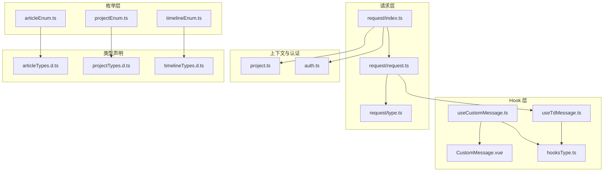
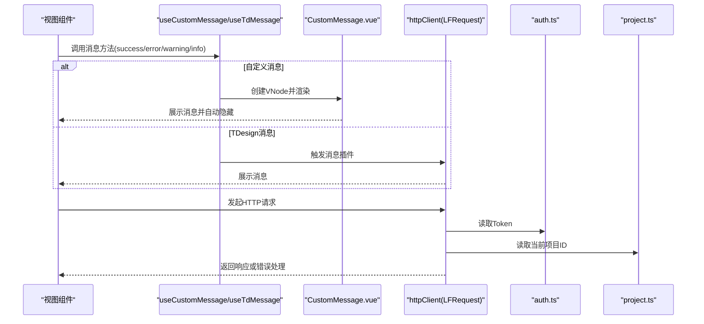
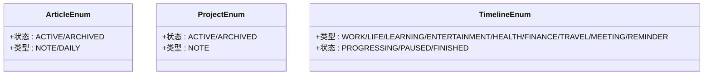
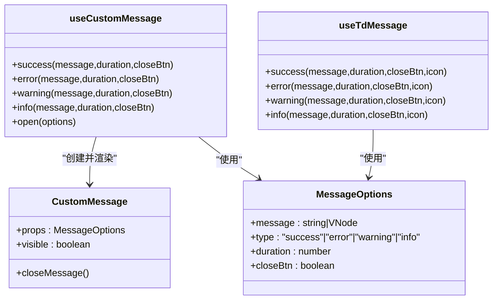
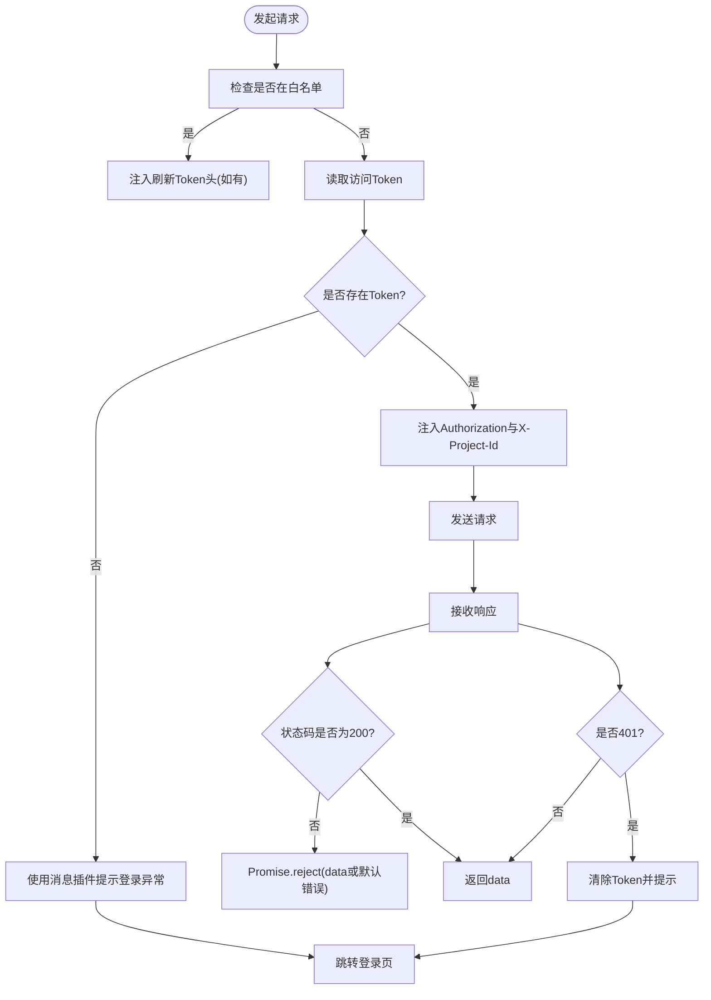
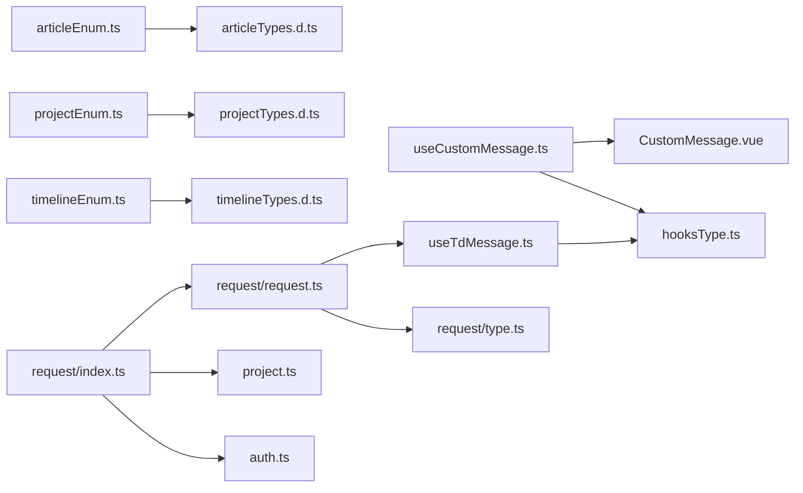

# 工具函数库

<cite>
**本文引用的文件**
- [src/utils/enums/articleEnum.ts](file://src/utils/enums/articleEnum.ts)
- [src/utils/enums/projectEnum.ts](file://src/utils/enums/projectEnum.ts)
- [src/utils/enums/timelineEnum.ts](file://src/utils/enums/timelineEnum.ts)
- [src/hooks/useCustomMessage.ts](file://src/hooks/useCustomMessage.ts)
- [src/hooks/useTdMessage.ts](file://src/hooks/useTdMessage.ts)
- [src/hooks/components/CustomMessage.vue](file://src/hooks/components/CustomMessage.vue)
- [src/hooks/hooksType.ts](file://src/hooks/hooksType.ts)
- [src/utils/project.ts](file://src/utils/project.ts)
- [src/utils/request/index.ts](file://src/utils/request/index.ts)
- [src/utils/request/request.ts](file://src/utils/request/request.ts)
- [src/utils/request/type.ts](file://src/utils/request/type.ts)
- [src/utils/auth.ts](file://src/utils/auth.ts)
- [src/types/articleTypes.d.ts](file://src/types/articleTypes.d.ts)
- [src/types/projectTypes.d.ts](file://src/types/projectTypes.d.ts)
- [src/types/timelineTypes.d.ts](file://src/types/timelineTypes.d.ts)
</cite>

## 目录
1. [简介](#简介)
2. [项目结构](#项目结构)
3. [核心组件](#核心组件)
4. [架构总览](#架构总览)
5. [详细组件分析](#详细组件分析)
6. [依赖关系分析](#依赖关系分析)
7. [性能考量](#性能考量)
8. [故障排查指南](#故障排查指南)
9. [结论](#结论)
10. [附录](#附录)

## 简介
本文件系统化梳理 LiFocus Web V2 的工具函数库，重点覆盖以下方面：
- 枚举类型系统：articleEnum、projectEnum、timelineEnum 的定义与业务映射
- 通用工具函数：项目上下文工具与请求封装
- 自定义 Hook 设计：useCustomMessage、useTdMessage 的能力边界与使用场景
- 常量与类型：消息选项类型、请求拦截器类型、业务类型别名
- 测试策略与质量保障：可测性设计与验证建议
- 使用示例与最佳实践：如何在业务组件中正确调用
- 扩展指南与维护建议：新增枚举、消息类型与请求拦截器的规范
- 工具函数与业务逻辑的关系：如何通过枚举与工具函数驱动 UI 与交互

## 项目结构
工具函数库主要分布在如下位置：
- 枚举定义：src/utils/enums
- Hook 与消息组件：src/hooks
- 请求封装：src/utils/request
- 项目上下文工具：src/utils/project.ts
- 认证工具：src/utils/auth.ts
- 类型声明：src/types 下对应模块的 d.ts 文件

图表来源
- [src/utils/enums/articleEnum.ts](file://src/utils/enums/articleEnum.ts#L1-L10)
- [src/utils/enums/projectEnum.ts](file://src/utils/enums/projectEnum.ts#L1-L9)
- [src/utils/enums/timelineEnum.ts](file://src/utils/enums/timelineEnum.ts#L1-L18)
- [src/hooks/useCustomMessage.ts](file://src/hooks/useCustomMessage.ts#L1-L73)
- [src/hooks/useTdMessage.ts](file://src/hooks/useTdMessage.ts#L1-L60)
- [src/hooks/components/CustomMessage.vue](file://src/hooks/components/CustomMessage.vue#L1-L94)
- [src/hooks/hooksType.ts](file://src/hooks/hooksType.ts#L1-L11)
- [src/utils/request/index.ts](file://src/utils/request/index.ts#L1-L40)
- [src/utils/request/request.ts](file://src/utils/request/request.ts#L1-L99)
- [src/utils/request/type.ts](file://src/utils/request/type.ts#L1-L15)
- [src/utils/project.ts](file://src/utils/project.ts#L1-L10)
- [src/utils/auth.ts](file://src/utils/auth.ts#L1-L71)
- [src/types/articleTypes.d.ts](file://src/types/articleTypes.d.ts#L1-L62)
- [src/types/projectTypes.d.ts](file://src/types/projectTypes.d.ts#L1-L27)
- [src/types/timelineTypes.d.ts](file://src/types/timelineTypes.d.ts#L1-L39)

章节来源
- [src/utils/enums/articleEnum.ts](file://src/utils/enums/articleEnum.ts#L1-L10)
- [src/utils/enums/projectEnum.ts](file://src/utils/enums/projectEnum.ts#L1-L9)
- [src/utils/enums/timelineEnum.ts](file://src/utils/enums/timelineEnum.ts#L1-L18)
- [src/hooks/useCustomMessage.ts](file://src/hooks/useCustomMessage.ts#L1-L73)
- [src/hooks/useTdMessage.ts](file://src/hooks/useTdMessage.ts#L1-L60)
- [src/hooks/components/CustomMessage.vue](file://src/hooks/components/CustomMessage.vue#L1-L94)
- [src/hooks/hooksType.ts](file://src/hooks/hooksType.ts#L1-L11)
- [src/utils/request/index.ts](file://src/utils/request/index.ts#L1-L40)
- [src/utils/request/request.ts](file://src/utils/request/request.ts#L1-L99)
- [src/utils/request/type.ts](file://src/utils/request/type.ts#L1-L15)
- [src/utils/project.ts](file://src/utils/project.ts#L1-L10)
- [src/utils/auth.ts](file://src/utils/auth.ts#L1-L71)
- [src/types/articleTypes.d.ts](file://src/types/articleTypes.d.ts#L1-L62)
- [src/types/projectTypes.d.ts](file://src/types/projectTypes.d.ts#L1-L27)
- [src/types/timelineTypes.d.ts](file://src/types/timelineTypes.d.ts#L1-L39)

## 核心组件
- 枚举系统：以数组形式定义业务枚举，包含值、标签以及语义化字段（如主题色、点颜色），便于 UI 渲染与筛选。
- Hook 消息系统：useCustomMessage 提供基于 Vue 渲染的消息组件；useTdMessage 基于第三方 UI 库的消息插件。
- 请求封装：LFRequest 封装 axios，统一注入鉴权头、项目上下文头、错误处理与拦截器链路。
- 项目上下文：通过 Cookie/SessionStorage 存取当前项目 ID，贯穿请求头注入。
- 认证工具：统一封装 Token 的设置、读取、刷新与移除。

章节来源
- [src/utils/enums/articleEnum.ts](file://src/utils/enums/articleEnum.ts#L1-L10)
- [src/utils/enums/projectEnum.ts](file://src/utils/enums/projectEnum.ts#L1-L9)
- [src/utils/enums/timelineEnum.ts](file://src/utils/enums/timelineEnum.ts#L1-L18)
- [src/hooks/useCustomMessage.ts](file://src/hooks/useCustomMessage.ts#L1-L73)
- [src/hooks/useTdMessage.ts](file://src/hooks/useTdMessage.ts#L1-L60)
- [src/utils/request/request.ts](file://src/utils/request/request.ts#L1-L99)
- [src/utils/request/index.ts](file://src/utils/request/index.ts#L1-L40)
- [src/utils/project.ts](file://src/utils/project.ts#L1-L10)
- [src/utils/auth.ts](file://src/utils/auth.ts#L1-L71)

## 架构总览
工具函数库围绕“枚举定义—类型约束—Hook 消息—请求封装—上下文与认证”的层次化结构组织，形成从数据模型到 UI 表达再到网络通信的闭环。

图表来源
- [src/hooks/useCustomMessage.ts](file://src/hooks/useCustomMessage.ts#L1-L73)
- [src/hooks/components/CustomMessage.vue](file://src/hooks/components/CustomMessage.vue#L1-L94)
- [src/hooks/useTdMessage.ts](file://src/hooks/useTdMessage.ts#L1-L60)
- [src/utils/request/index.ts](file://src/utils/request/index.ts#L1-L40)
- [src/utils/request/request.ts](file://src/utils/request/request.ts#L1-L99)
- [src/utils/auth.ts](file://src/utils/auth.ts#L1-L71)
- [src/utils/project.ts](file://src/utils/project.ts#L1-L10)

## 详细组件分析

### 枚举类型系统
- 文章枚举（articleEnum）
  - 状态：活跃中、已归档
  - 类型：笔记、日常
  - 用途：文章列表筛选、表单选择、UI 标签展示
- 项目枚举（projectEnum）
  - 状态：活跃中、已归档
  - 类型：笔记
  - 用途：项目卡片、筛选与分类
- 时间线枚举（timelineEnum）
  - 类型：工作、生活、学习、娱乐、健康、财务、旅行、会议、提醒；带主题色
  - 状态：进行中、已暂停、已完成；带点颜色
  - 用途：时间线卡片、状态标签、主题样式映射

图表来源
- [src/utils/enums/articleEnum.ts](file://src/utils/enums/articleEnum.ts#L1-L10)
- [src/utils/enums/projectEnum.ts](file://src/utils/enums/projectEnum.ts#L1-L9)
- [src/utils/enums/timelineEnum.ts](file://src/utils/enums/timelineEnum.ts#L1-L18)

章节来源
- [src/utils/enums/articleEnum.ts](file://src/utils/enums/articleEnum.ts#L1-L10)
- [src/utils/enums/projectEnum.ts](file://src/utils/enums/projectEnum.ts#L1-L9)
- [src/utils/enums/timelineEnum.ts](file://src/utils/enums/timelineEnum.ts#L1-L18)

### Hook 消息系统
- useCustomMessage
  - 功能：动态创建消息组件实例，支持字符串或 VNode 内容、类型、持续时间、关闭按钮；内部维护实例集合，支持手动关闭
  - 适用场景：需要更灵活的 UI 控制、自定义样式或复杂内容时
- useTdMessage
  - 功能：基于第三方 UI 库的消息插件，提供成功/错误/警告/信息四种快捷方法
  - 适用场景：快速展示系统提示、统一风格的消息反馈
- CustomMessage.vue
  - 功能：动画过渡、可选关闭按钮、根据类型应用背景色
- hooksType.ts
  - 功能：定义消息选项接口，约束 message、type、duration、closeBtn 字段

图表来源
- [src/hooks/hooksType.ts](file://src/hooks/hooksType.ts#L1-L11)
- [src/hooks/useCustomMessage.ts](file://src/hooks/useCustomMessage.ts#L1-L73)
- [src/hooks/useTdMessage.ts](file://src/hooks/useTdMessage.ts#L1-L60)
- [src/hooks/components/CustomMessage.vue](file://src/hooks/components/CustomMessage.vue#L1-L94)

章节来源
- [src/hooks/hooksType.ts](file://src/hooks/hooksType.ts#L1-L11)
- [src/hooks/useCustomMessage.ts](file://src/hooks/useCustomMessage.ts#L1-L73)
- [src/hooks/useTdMessage.ts](file://src/hooks/useTdMessage.ts#L1-L60)
- [src/hooks/components/CustomMessage.vue](file://src/hooks/components/CustomMessage.vue#L1-L94)

### 请求封装与拦截器
- LFRequest
  - 功能：基于 axios 的二次封装，提供统一的请求/响应拦截器、方法封装（get/post/put/delete/patch）
  - 错误处理：401 自动清除 Token 并跳转登录；非 200 统一返回错误数据
- httpClient
  - 功能：创建 LFRequest 实例，注入基础 URL、超时、请求拦截器
  - 请求拦截器：注入 Authorization 与 X-Project-Id 头；白名单放行；无 Token 时提示并跳转登录
  - 响应拦截器：透传 data；401 特殊处理
- 类型定义
  - LFInterceptors：请求/响应成功/失败回调
  - LFRequestConfig：扩展 Axios 配置，支持单次拦截器与刷新令牌标识

图表来源
- [src/utils/request/index.ts](file://src/utils/request/index.ts#L1-L40)
- [src/utils/request/request.ts](file://src/utils/request/request.ts#L1-L99)
- [src/utils/request/type.ts](file://src/utils/request/type.ts#L1-L15)
- [src/utils/auth.ts](file://src/utils/auth.ts#L1-L71)
- [src/utils/project.ts](file://src/utils/project.ts#L1-L10)
- [src/hooks/useTdMessage.ts](file://src/hooks/useTdMessage.ts#L1-L60)

章节来源
- [src/utils/request/index.ts](file://src/utils/request/index.ts#L1-L40)
- [src/utils/request/request.ts](file://src/utils/request/request.ts#L1-L99)
- [src/utils/request/type.ts](file://src/utils/request/type.ts#L1-L15)
- [src/utils/auth.ts](file://src/utils/auth.ts#L1-L71)
- [src/utils/project.ts](file://src/utils/project.ts#L1-L10)
- [src/hooks/useTdMessage.ts](file://src/hooks/useTdMessage.ts#L1-L60)

### 项目上下文与认证工具
- setCurrentProjectId/getCurrentProjectId：通过 Cookie/SessionStorage 存取当前项目 ID，供请求头注入使用
- setToken/getToken/getRefreshToken/removeToken：统一封装 Token 的持久化策略与读取/移除逻辑

章节来源
- [src/utils/project.ts](file://src/utils/project.ts#L1-L10)
- [src/utils/auth.ts](file://src/utils/auth.ts#L1-L71)

## 依赖关系分析
- 枚举与类型声明：枚举值与类型别名一一对应，确保编译期安全与 UI 映射一致性
- Hook 与组件：useCustomMessage 依赖 CustomMessage.vue；两者共同构成自定义消息体系
- 请求层：httpClient 依赖 LFRequest、auth、project；LFRequest 依赖 useTdMessage 进行错误提示
- 类型层：各模块 d.ts 定义了业务实体与过滤条件，与枚举配合用于表单与筛选

图表来源
- [src/utils/enums/articleEnum.ts](file://src/utils/enums/articleEnum.ts#L1-L10)
- [src/utils/enums/projectEnum.ts](file://src/utils/enums/projectEnum.ts#L1-L9)
- [src/utils/enums/timelineEnum.ts](file://src/utils/enums/timelineEnum.ts#L1-L18)
- [src/types/articleTypes.d.ts](file://src/types/articleTypes.d.ts#L1-L62)
- [src/types/projectTypes.d.ts](file://src/types/projectTypes.d.ts#L1-L27)
- [src/types/timelineTypes.d.ts](file://src/types/timelineTypes.d.ts#L1-L39)
- [src/hooks/useCustomMessage.ts](file://src/hooks/useCustomMessage.ts#L1-L73)
- [src/hooks/components/CustomMessage.vue](file://src/hooks/components/CustomMessage.vue#L1-L94)
- [src/hooks/hooksType.ts](file://src/hooks/hooksType.ts#L1-L11)
- [src/hooks/useTdMessage.ts](file://src/hooks/useTdMessage.ts#L1-L60)
- [src/utils/request/index.ts](file://src/utils/request/index.ts#L1-L40)
- [src/utils/request/request.ts](file://src/utils/request/request.ts#L1-L99)
- [src/utils/request/type.ts](file://src/utils/request/type.ts#L1-L15)
- [src/utils/project.ts](file://src/utils/project.ts#L1-L10)
- [src/utils/auth.ts](file://src/utils/auth.ts#L1-L71)

章节来源
- [src/utils/enums/articleEnum.ts](file://src/utils/enums/articleEnum.ts#L1-L10)
- [src/utils/enums/projectEnum.ts](file://src/utils/enums/projectEnum.ts#L1-L9)
- [src/utils/enums/timelineEnum.ts](file://src/utils/enums/timelineEnum.ts#L1-L18)
- [src/types/articleTypes.d.ts](file://src/types/articleTypes.d.ts#L1-L62)
- [src/types/projectTypes.d.ts](file://src/types/projectTypes.d.ts#L1-L27)
- [src/types/timelineTypes.d.ts](file://src/types/timelineTypes.d.ts#L1-L39)
- [src/hooks/useCustomMessage.ts](file://src/hooks/useCustomMessage.ts#L1-L73)
- [src/hooks/components/CustomMessage.vue](file://src/hooks/components/CustomMessage.vue#L1-L94)
- [src/hooks/hooksType.ts](file://src/hooks/hooksType.ts#L1-L11)
- [src/hooks/useTdMessage.ts](file://src/hooks/useTdMessage.ts#L1-L60)
- [src/utils/request/index.ts](file://src/utils/request/index.ts#L1-L40)
- [src/utils/request/request.ts](file://src/utils/request/request.ts#L1-L99)
- [src/utils/request/type.ts](file://src/utils/request/type.ts#L1-L15)
- [src/utils/project.ts](file://src/utils/project.ts#L1-L10)
- [src/utils/auth.ts](file://src/utils/auth.ts#L1-L71)

## 性能考量
- 消息组件渲染：useCustomMessage 采用按需创建与自动清理，避免 DOM 泄漏；建议控制并发消息数量与持续时间
- 请求拦截器：统一注入头与白名单放行，减少重复逻辑；注意避免在拦截器中执行耗时操作
- Token 与项目上下文：Cookie/SessionStorage 读写为 O(1)，建议在高频请求中复用已有值
- 错误处理：401 清理 Token 并跳转登录，避免无效重试；非 200 统一错误对象，便于前端统一处理

## 故障排查指南
- 登录态异常
  - 现象：请求前提示登录异常并跳转登录页
  - 排查：确认 Token 是否存在；检查白名单配置；核对 Authorization 头是否注入
- 项目上下文缺失
  - 现象：请求未携带 X-Project-Id
  - 排查：确认当前项目 ID 是否设置；检查 Cookie/SessionStorage 状态
- 消息不消失或重复弹出
  - 现象：消息停留过久或无法关闭
  - 排查：检查 duration 参数；确认手动关闭回调是否被调用；避免重复创建相同实例
- 401 未触发登出
  - 现象：接口 401 但页面无反应
  - 排查：确认响应拦截器逻辑；检查 useTdMessage 是否正常调用

章节来源
- [src/utils/request/index.ts](file://src/utils/request/index.ts#L1-L40)
- [src/utils/request/request.ts](file://src/utils/request/request.ts#L1-L99)
- [src/utils/auth.ts](file://src/utils/auth.ts#L1-L71)
- [src/utils/project.ts](file://src/utils/project.ts#L1-L10)
- [src/hooks/useCustomMessage.ts](file://src/hooks/useCustomMessage.ts#L1-L73)
- [src/hooks/useTdMessage.ts](file://src/hooks/useTdMessage.ts#L1-L60)

## 结论
该工具函数库以清晰的分层设计实现了业务枚举、消息体系、请求封装与上下文管理，既满足了 UI 表达与交互需求，又提供了良好的可维护性与扩展性。通过类型声明与拦截器机制，进一步提升了代码的健壮性与一致性。

## 附录

### 使用示例与最佳实践
- 在登录流程中使用消息提示
  - 参考路径：[src/views/auth/Login.vue](file://src/views/auth/Login.vue#L34-L85)
  - 建议：使用 useTdMessage 快速反馈登录结果；错误分支统一走 useMessage.error
- 在时间线卡片中使用枚举映射
  - 参考路径：[src/types/timelineTypes.d.ts](file://src/types/timelineTypes.d.ts#L1-L39)
  - 建议：结合 timelineEnum 的 theme/dotColor 字段渲染标签与主题
- 在文章与项目模块中使用枚举
  - 参考路径：[src/types/articleTypes.d.ts](file://src/types/articleTypes.d.ts#L1-L62)、[src/types/projectTypes.d.ts](file://src/types/projectTypes.d.ts#L1-L27)
  - 建议：表单与筛选组件统一使用枚举数组，保持文案一致

### 测试策略与质量保证
- 枚举与类型
  - 单元测试：验证枚举数组长度与键值一致性；类型别名与枚举值映射正确性
- Hook 消息
  - 行为测试：模拟 createVNode/render 生命周期；验证自动关闭与手动关闭
  - UI 测试：截图对比不同 type 的样式差异
- 请求封装
  - 集成测试：构造 200/401/非 200 场景，验证拦截器与错误处理
  - 性能测试：并发请求下拦截器开销与消息组件渲染性能
- 上下文与认证
  - 行为测试：切换记住登录状态，验证 Cookie/SessionStorage 的读写行为

### 扩展指南与维护建议
- 新增业务枚举
  - 在对应枚举文件中追加条目，并同步更新类型声明与 UI 映射
- 新增消息类型
  - 在 hooksType.ts 中扩展 MessageOptions；在 useCustomMessage 中补充对应方法
- 新增请求拦截器
  - 在 LFRequestConfig 中扩展拦截器字段；在 LFRequest 中接入新拦截器
- 维护建议
  - 保持枚举与类型声明的一致性；避免在拦截器中引入阻塞逻辑；统一错误处理与消息提示风格