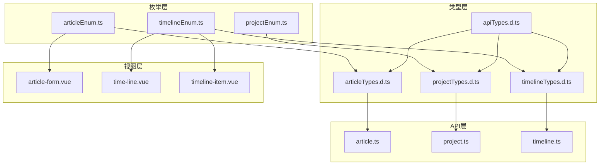
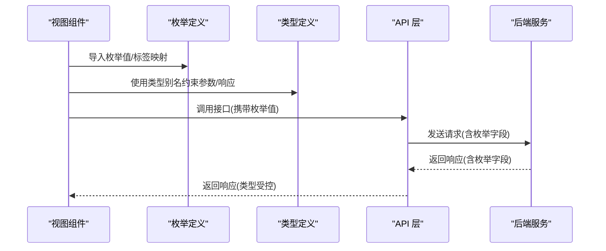
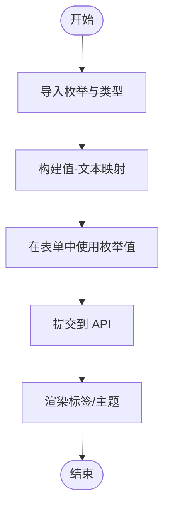
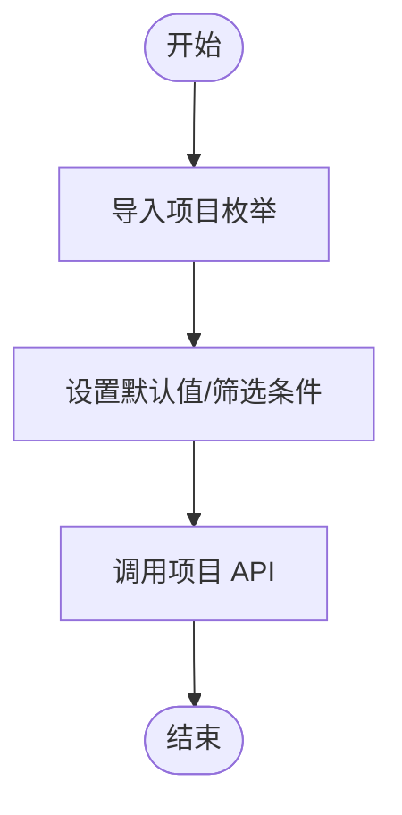
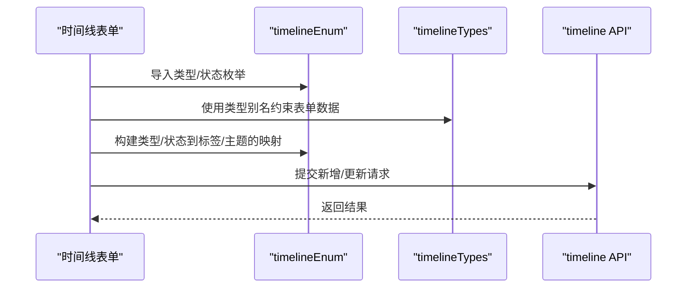
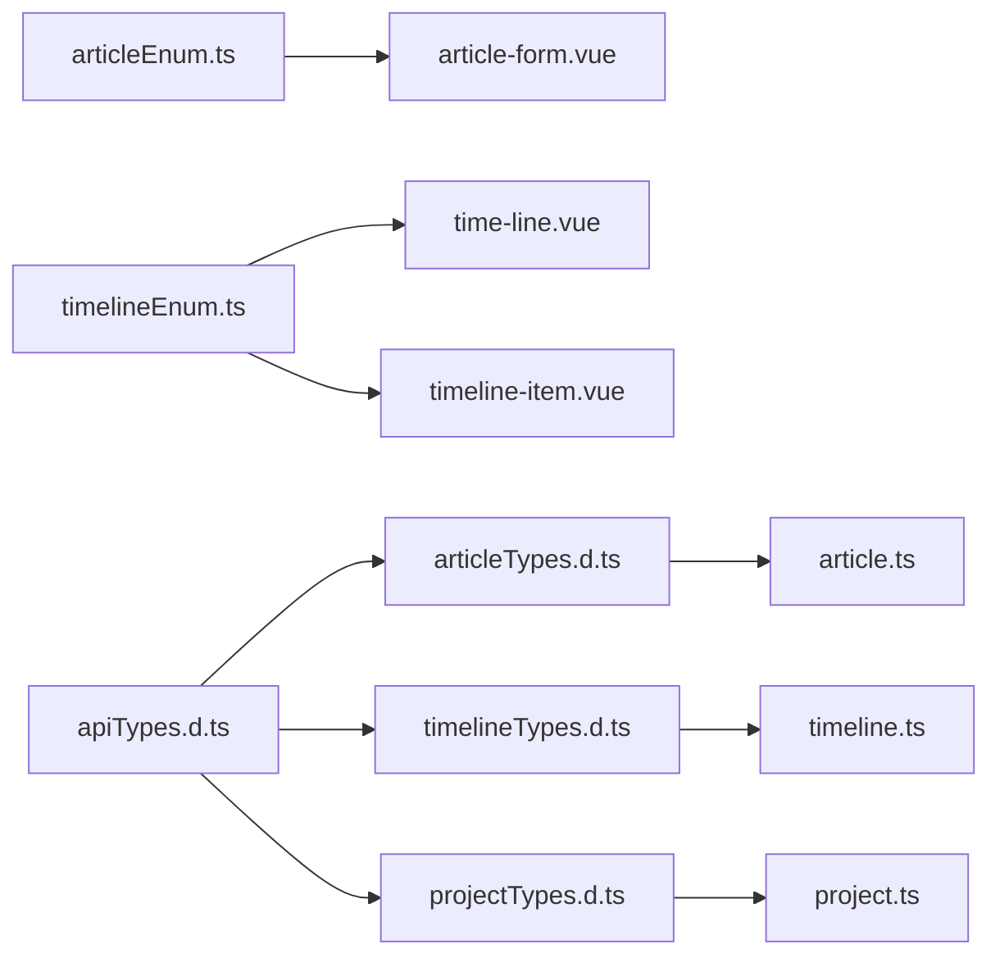

# 枚举类型系统

<cite>
**本文引用的文件**
- [src/utils/enums/articleEnum.ts](file://src/utils/enums/articleEnum.ts)
- [src/utils/enums/projectEnum.ts](file://src/utils/enums/projectEnum.ts)
- [src/utils/enums/timelineEnum.ts](file://src/utils/enums/timelineEnum.ts)
- [src/types/articleTypes.d.ts](file://src/types/articleTypes.d.ts)
- [src/types/projectTypes.d.ts](file://src/types/projectTypes.d.ts)
- [src/types/timelineTypes.d.ts](file://src/types/timelineTypes.d.ts)
- [src/types/apiTypes.d.ts](file://src/types/apiTypes.d.ts)
- [src/views/project/components/article-form.vue](file://src/views/project/components/article-form.vue)
- [src/views/dashboard/components/timeline-item.vue](file://src/views/dashboard/components/timeline-item.vue)
- [src/views/dashboard/components/time-line.vue](file://src/views/dashboard/components/time-line.vue)
- [src/api/article.ts](file://src/api/article.ts)
- [src/api/project.ts](file://src/api/project.ts)
- [src/api/timeline.ts](file://src/api/timeline.ts)
</cite>

## 目录
1. [简介](#简介)
2. [项目结构](#项目结构)
3. [核心组件](#核心组件)
4. [架构总览](#架构总览)
5. [详细组件分析](#详细组件分析)
6. [依赖分析](#依赖分析)
7. [性能考虑](#性能考虑)
8. [故障排查指南](#故障排查指南)
9. [结论](#结论)
10. [附录](#附录)

## 简介
本文件系统性梳理 LiFocus Web V2 的枚举类型体系，重点覆盖以下三类枚举：
- articleEnum：文章相关状态与类型
- projectEnum：项目相关状态与类型
- timelineEnum：时间线相关类型与状态

文档从设计理念、实现细节、TypeScript 类型定义、与 API 接口的对应关系、表单验证与状态管理的应用场景出发，提供可操作的最佳实践与扩展维护建议。

## 项目结构
枚举定义集中在工具模块下，类型定义集中在 types 目录，组件与 API 层通过导入枚举实现强类型约束与一致的业务语义。

图表来源
- [src/utils/enums/articleEnum.ts](file://src/utils/enums/articleEnum.ts#L1-L10)
- [src/utils/enums/projectEnum.ts](file://src/utils/enums/projectEnum.ts#L1-L9)
- [src/utils/enums/timelineEnum.ts](file://src/utils/enums/timelineEnum.ts#L1-L18)
- [src/types/articleTypes.d.ts](file://src/types/articleTypes.d.ts#L1-L62)
- [src/types/projectTypes.d.ts](file://src/types/projectTypes.d.ts#L1-L27)
- [src/types/timelineTypes.d.ts](file://src/types/timelineTypes.d.ts#L1-L39)
- [src/types/apiTypes.d.ts](file://src/types/apiTypes.d.ts#L1-L7)
- [src/views/project/components/article-form.vue](file://src/views/project/components/article-form.vue#L1-L164)
- [src/views/dashboard/components/time-line.vue](file://src/views/dashboard/components/time-line.vue#L1-L150)
- [src/views/dashboard/components/timeline-item.vue](file://src/views/dashboard/components/timeline-item.vue#L1-L124)
- [src/api/article.ts](file://src/api/article.ts#L1-L60)
- [src/api/project.ts](file://src/api/project.ts#L1-L38)
- [src/api/timeline.ts](file://src/api/timeline.ts#L1-L44)

章节来源
- [src/utils/enums/articleEnum.ts](file://src/utils/enums/articleEnum.ts#L1-L10)
- [src/utils/enums/projectEnum.ts](file://src/utils/enums/projectEnum.ts#L1-L9)
- [src/utils/enums/timelineEnum.ts](file://src/utils/enums/timelineEnum.ts#L1-L18)
- [src/types/articleTypes.d.ts](file://src/types/articleTypes.d.ts#L1-L62)
- [src/types/projectTypes.d.ts](file://src/types/projectTypes.d.ts#L1-L27)
- [src/types/timelineTypes.d.ts](file://src/types/timelineTypes.d.ts#L1-L39)
- [src/types/apiTypes.d.ts](file://src/types/apiTypes.d.ts#L1-L7)

## 核心组件
- articleEnum：提供文章状态与类型的枚举集合，用于表单选择、标签展示与过滤条件。
- projectEnum：提供项目状态与类型的枚举集合，用于项目筛选与默认值设置。
- timelineEnum：提供时间线类型与状态的枚举集合，用于时间线卡片渲染与交互控制。

章节来源
- [src/utils/enums/articleEnum.ts](file://src/utils/enums/articleEnum.ts#L1-L10)
- [src/utils/enums/projectEnum.ts](file://src/utils/enums/projectEnum.ts#L1-L9)
- [src/utils/enums/timelineEnum.ts](file://src/utils/enums/timelineEnum.ts#L1-L18)

## 架构总览
枚举在前端的职责是“语义化常量”，通过统一的数据结构与类型别名，确保组件、API 参数与响应体之间的一致性与可维护性。下图展示了从视图到 API 的典型调用链路，以及枚举在其中的位置。

图表来源
- [src/views/project/components/article-form.vue](file://src/views/project/components/article-form.vue#L14-L14)
- [src/views/dashboard/components/time-line.vue](file://src/views/dashboard/components/time-line.vue#L11-L11)
- [src/views/dashboard/components/timeline-item.vue](file://src/views/dashboard/components/timeline-item.vue#L8-L8)
- [src/types/articleTypes.d.ts](file://src/types/articleTypes.d.ts#L3-L5)
- [src/types/timelineTypes.d.ts](file://src/types/timelineTypes.d.ts#L3-L5)
- [src/api/article.ts](file://src/api/article.ts#L8-L13)
- [src/api/timeline.ts](file://src/api/timeline.ts#L10-L18)

## 详细组件分析

### articleEnum 文章相关枚举
- 设计理念
  - 以“值-标签”数组形式暴露，便于在 UI 中直接绑定到选择器与标签组件。
  - 提供“值转文本”的映射字典，简化渲染逻辑。
- 实现要点
  - 状态枚举：ACTIVE（活跃中）、ARCHIVED（已归档）
  - 类型枚举：NOTE（笔记）、DAILY（日常）
- TypeScript 类型定义
  - 文章状态类型别名：'ACTIVE' | 'ARCHIVED'
  - 文章类型类型别名：'NOTE' | 'DAILY'
- 与 API 的对应关系
  - 文章列表过滤、新增与更新接口均使用上述类型别名作为字段约束。
- 在表单与状态管理中的应用
  - 表单默认值、校验规则、UI 渲染（标签主题）均可基于枚举进行统一处理。
- 最佳实践
  - 保持“值-标签”与类型别名的一致性；新增枚举项时同步更新映射与表单选项。
  - 将“值转文本”的映射缓存于组件内，避免重复计算。

图表来源
- [src/utils/enums/articleEnum.ts](file://src/utils/enums/articleEnum.ts#L1-L10)
- [src/types/articleTypes.d.ts](file://src/types/articleTypes.d.ts#L3-L5)
- [src/views/project/components/article-form.vue](file://src/views/project/components/article-form.vue#L42-L51)

章节来源
- [src/utils/enums/articleEnum.ts](file://src/utils/enums/articleEnum.ts#L1-L10)
- [src/types/articleTypes.d.ts](file://src/types/articleTypes.d.ts#L3-L5)
- [src/views/project/components/article-form.vue](file://src/views/project/components/article-form.vue#L14-L14)
- [src/views/project/components/article-form.vue](file://src/views/project/components/article-form.vue#L42-L51)
- [src/api/article.ts](file://src/api/article.ts#L8-L13)

### projectEnum 项目相关枚举
- 设计理念
  - 项目状态与类型相对简单，采用“值-标签”数组形式，便于在筛选与默认值中使用。
- 实现要点
  - 状态枚举：ACTIVE（活跃中）、ARCHIVED（已归档）
  - 类型枚举：NOTE（笔记）
- TypeScript 类型定义
  - 项目信息与新增参数中的状态与类型字段为字符串类型，建议在后续版本中引入类型别名以提升一致性。
- 与 API 的对应关系
  - 项目列表查询与创建接口使用状态枚举作为筛选与默认值。
- 在表单与状态管理中的应用
  - 项目创建表单的默认值与筛选面板的选项来源于枚举。
- 最佳实践
  - 逐步将字符串字段替换为类型别名，增强编译期安全。
  - 保持与后端一致的取值范围，避免隐式转换。

图表来源
- [src/utils/enums/projectEnum.ts](file://src/utils/enums/projectEnum.ts#L1-L9)
- [src/types/projectTypes.d.ts](file://src/types/projectTypes.d.ts#L3-L12)
- [src/views/dashboard/components/project-list.vue](file://src/views/dashboard/components/project-list.vue#L118-L128)

章节来源
- [src/utils/enums/projectEnum.ts](file://src/utils/enums/projectEnum.ts#L1-L9)
- [src/types/projectTypes.d.ts](file://src/types/projectTypes.d.ts#L3-L12)
- [src/views/dashboard/components/project-list.vue](file://src/views/dashboard/components/project-list.vue#L118-L128)
- [src/api/project.ts](file://src/api/project.ts#L14-L30)

### timelineEnum 时间线相关枚举
- 设计理念
  - 时间线类型包含视觉主题属性，状态包含点颜色属性，便于 UI 主题化渲染。
- 实现要点
  - 类型枚举：WORK、LIFE、LEARNING、ENTERTAINMENT、HEALTH、FINANCE、TRAVEL、MEETING、REMINDER
  - 状态枚举：PROGRESSING（进行中）、PAUSED（已暂停）、FINISHED（已完成）
- TypeScript 类型定义
  - 时间线类型别名：'WORK' | 'LIFE' | 'LEARNING' | 'ENTERTAINMENT' | 'HEALTH' | 'FINANCE' | 'TRAVEL' | 'MEETING' | 'REMINDER'
  - 时间线状态别名：'PROGRESSING' | 'PAUSED' | 'FINISHED'
- 与 API 的对应关系
  - 新增与更新时间线接口使用类型与状态别名作为字段约束。
- 在表单与状态管理中的应用
  - 表单选择器、时间线卡片标签、点颜色映射均来自枚举。
- 最佳实践
  - 将“值-主题/颜色”的映射缓存于组件内，减少重复计算。
  - 对外暴露的 API 字段与内部渲染字段解耦，保证扩展性。

图表来源
- [src/utils/enums/timelineEnum.ts](file://src/utils/enums/timelineEnum.ts#L1-L18)
- [src/types/timelineTypes.d.ts](file://src/types/timelineTypes.d.ts#L3-L5)
- [src/views/dashboard/components/time-line.vue](file://src/views/dashboard/components/time-line.vue#L11-L11)
- [src/views/dashboard/components/time-line.vue](file://src/views/dashboard/components/time-line.vue#L23-L26)
- [src/views/dashboard/components/timeline-item.vue](file://src/views/dashboard/components/timeline-item.vue#L8-L8)
- [src/views/dashboard/components/timeline-item.vue](file://src/views/dashboard/components/timeline-item.vue#L27-L36)
- [src/api/timeline.ts](file://src/api/timeline.ts#L28-L33)

章节来源
- [src/utils/enums/timelineEnum.ts](file://src/utils/enums/timelineEnum.ts#L1-L18)
- [src/types/timelineTypes.d.ts](file://src/types/timelineTypes.d.ts#L3-L5)
- [src/views/dashboard/components/time-line.vue](file://src/views/dashboard/components/time-line.vue#L11-L11)
- [src/views/dashboard/components/time-line.vue](file://src/views/dashboard/components/time-line.vue#L23-L26)
- [src/views/dashboard/components/timeline-item.vue](file://src/views/dashboard/components/timeline-item.vue#L8-L8)
- [src/views/dashboard/components/timeline-item.vue](file://src/views/dashboard/components/timeline-item.vue#L27-L36)
- [src/api/timeline.ts](file://src/api/timeline.ts#L28-L33)

## 依赖分析
- 组件对枚举的依赖
  - 文章表单：导入文章枚举，构建“值-文本”映射，用于标签与表单选项。
  - 时间线表单与条目：导入时间线枚举，构建“值-主题/颜色”映射，用于标签主题与点颜色。
- 类型与枚举的耦合
  - 类型别名与枚举值保持一一对应，确保编译期约束与运行时一致性。
- API 层契约
  - API 请求与响应体中的枚举字段遵循类型定义，保证前后端协议一致。

图表来源
- [src/utils/enums/articleEnum.ts](file://src/utils/enums/articleEnum.ts#L1-L10)
- [src/utils/enums/timelineEnum.ts](file://src/utils/enums/timelineEnum.ts#L1-L18)
- [src/views/project/components/article-form.vue](file://src/views/project/components/article-form.vue#L14-L14)
- [src/views/dashboard/components/time-line.vue](file://src/views/dashboard/components/time-line.vue#L11-L11)
- [src/views/dashboard/components/timeline-item.vue](file://src/views/dashboard/components/timeline-item.vue#L8-L8)
- [src/types/articleTypes.d.ts](file://src/types/articleTypes.d.ts#L1-L62)
- [src/types/timelineTypes.d.ts](file://src/types/timelineTypes.d.ts#L1-L39)
- [src/types/projectTypes.d.ts](file://src/types/projectTypes.d.ts#L1-L27)
- [src/types/apiTypes.d.ts](file://src/types/apiTypes.d.ts#L1-L7)
- [src/api/article.ts](file://src/api/article.ts#L1-L60)
- [src/api/timeline.ts](file://src/api/timeline.ts#L1-L44)
- [src/api/project.ts](file://src/api/project.ts#L1-L38)

章节来源
- [src/utils/enums/articleEnum.ts](file://src/utils/enums/articleEnum.ts#L1-L10)
- [src/utils/enums/timelineEnum.ts](file://src/utils/enums/timelineEnum.ts#L1-L18)
- [src/views/project/components/article-form.vue](file://src/views/project/components/article-form.vue#L14-L14)
- [src/views/dashboard/components/time-line.vue](file://src/views/dashboard/components/time-line.vue#L11-L11)
- [src/views/dashboard/components/timeline-item.vue](file://src/views/dashboard/components/timeline-item.vue#L8-L8)
- [src/types/articleTypes.d.ts](file://src/types/articleTypes.d.ts#L1-L62)
- [src/types/timelineTypes.d.ts](file://src/types/timelineTypes.d.ts#L1-L39)
- [src/types/projectTypes.d.ts](file://src/types/projectTypes.d.ts#L1-L27)
- [src/types/apiTypes.d.ts](file://src/types/apiTypes.d.ts#L1-L7)
- [src/api/article.ts](file://src/api/article.ts#L1-L60)
- [src/api/timeline.ts](file://src/api/timeline.ts#L1-L44)
- [src/api/project.ts](file://src/api/project.ts#L1-L38)

## 性能考虑
- 映射构建
  - 将“值-文本/主题/颜色”的映射构建在组件初始化阶段完成，避免在渲染循环中重复计算。
- 渲染优化
  - 使用轻量级映射对象替代频繁的数组查找，降低 O(n) 查找成本。
- 类型约束
  - 通过类型别名限制可选值，减少无效渲染与错误分支。

## 故障排查指南
- 枚举值不匹配
  - 症状：UI 标签未显示或状态切换异常。
  - 排查：确认 API 请求体与响应体中的枚举值与类型定义一致；检查组件内映射是否包含该值。
- 默认值问题
  - 症状：表单默认值不符合预期。
  - 排查：核对枚举默认值与类型别名；确保表单初始化时使用正确的默认值。
- 主题/颜色不生效
  - 症状：标签主题或时间线点颜色异常。
  - 排查：确认枚举中是否存在对应的主题/颜色字段；检查映射构建逻辑。

章节来源
- [src/views/project/components/article-form.vue](file://src/views/project/components/article-form.vue#L42-L51)
- [src/views/dashboard/components/time-line.vue](file://src/views/dashboard/components/time-line.vue#L23-L26)
- [src/views/dashboard/components/timeline-item.vue](file://src/views/dashboard/components/timeline-item.vue#L27-L36)

## 结论
- 枚举系统通过“值-标签/主题/颜色”的统一结构，实现了 UI 与业务语义的强约束与高可维护性。
- 类型别名与枚举的协同使用，提升了开发效率与运行时安全性。
- 建议持续完善类型定义，逐步将字符串字段替换为类型别名，进一步强化契约约束。

## 附录
- 扩展方法
  - 新增枚举项时，同步更新“值-标签/主题/颜色”映射与类型别名。
  - 保持前后端一致的取值范围，避免隐式转换。
- 维护策略
  - 版本升级时，优先迁移字符串字段为类型别名。
  - 对外暴露的 API 字段与内部渲染字段解耦，确保扩展性与兼容性。