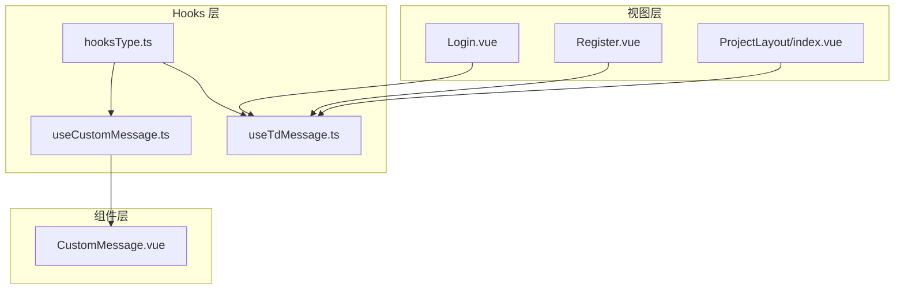
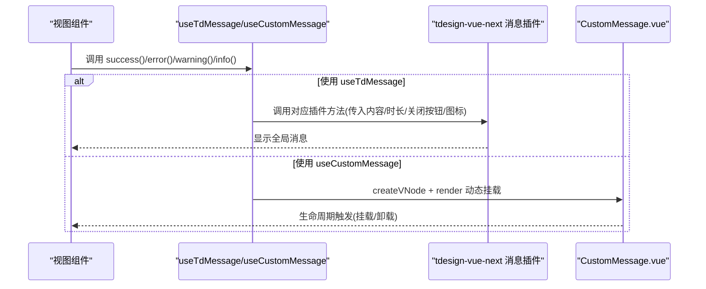
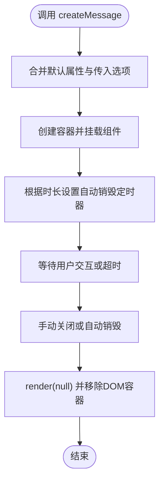
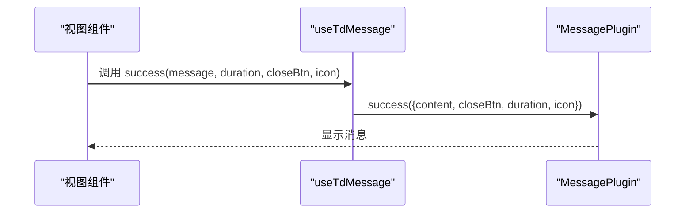
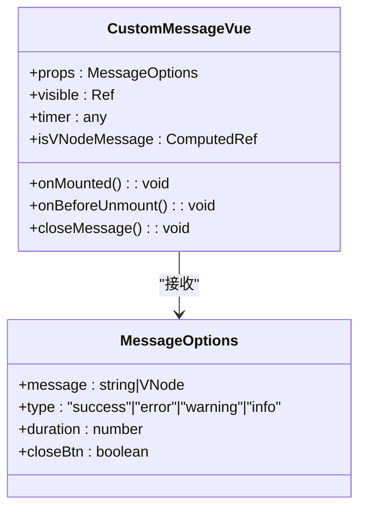
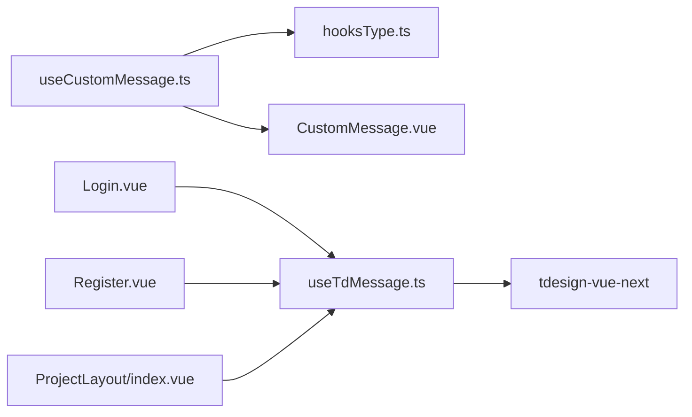

# 自定义Hook设计

<cite>
**本文引用的文件**
- [src/hooks/useCustomMessage.ts](file://src/hooks/useCustomMessage.ts)
- [src/hooks/useTdMessage.ts](file://src/hooks/useTdMessage.ts)
- [src/hooks/hooksType.ts](file://src/hooks/hooksType.ts)
- [src/hooks/components/CustomMessage.vue](file://src/hooks/components/CustomMessage.vue)
- [src/views/auth/Login.vue](file://src/views/auth/Login.vue)
- [src/views/auth/Register.vue](file://src/views/auth/Register.vue)
- [src/layout/ProjectLayout/index.vue](file://src/layout/ProjectLayout/index.vue)
- [package.json](file://package.json)
- [eslint.config.ts](file://eslint.config.ts)
- [test.js](file://test.js)
</cite>

## 目录
1. [简介](#简介)
2. [项目结构](#项目结构)
3. [核心组件](#核心组件)
4. [架构总览](#架构总览)
5. [详细组件分析](#详细组件分析)
6. [依赖分析](#依赖分析)
7. [性能考虑](#性能考虑)
8. [故障排查指南](#故障排查指南)
9. [结论](#结论)
10. [附录](#附录)

## 简介
本文件系统性梳理 LiFocus Web V2 中的自定义消息类 Hook 设计，重点围绕以下内容展开：
- useCustomMessage 与 useTdMessage 两大 Hook 的设计理念、参数配置、返回值结构与典型使用场景
- hooksType.ts 中的类型定义与接口约束
- CustomMessage.vue 组件作为 Hook 辅助组件的设计思路与交互机制
- Hook 的生命周期交互、状态管理、副作用处理与性能优化建议
- 测试策略与调试方法
- 扩展指南与自定义 Hook 开发规范

## 项目结构
本项目采用按功能域组织的目录结构，消息类 Hook 及其配套组件位于 src/hooks 下，具体分布如下：
- src/hooks/useCustomMessage.ts：基于 Vue 渲染器动态挂载自定义消息组件的 Hook
- src/hooks/useTdMessage.ts：基于 tdesign-vue-next 的消息插件封装的 Hook
- src/hooks/hooksType.ts：消息选项的类型定义
- src/hooks/components/CustomMessage.vue：自定义消息组件，承载消息渲染与动画
- src/views/* 与 src/layout/*：业务视图中对 Hook 的实际调用示例

图表来源
- [src/hooks/useCustomMessage.ts](file://src/hooks/useCustomMessage.ts#L1-L73)
- [src/hooks/useTdMessage.ts](file://src/hooks/useTdMessage.ts#L1-L60)
- [src/hooks/hooksType.ts](file://src/hooks/hooksType.ts#L1-L11)
- [src/hooks/components/CustomMessage.vue](file://src/hooks/components/CustomMessage.vue#L1-L94)
- [src/views/auth/Login.vue](file://src/views/auth/Login.vue#L1-L138)
- [src/views/auth/Register.vue](file://src/views/auth/Register.vue#L1-L137)
- [src/layout/ProjectLayout/index.vue](file://src/layout/ProjectLayout/index.vue#L1-L135)

章节来源
- [src/hooks/useCustomMessage.ts](file://src/hooks/useCustomMessage.ts#L1-L73)
- [src/hooks/useTdMessage.ts](file://src/hooks/useTdMessage.ts#L1-L60)
- [src/hooks/hooksType.ts](file://src/hooks/hooksType.ts#L1-L11)
- [src/hooks/components/CustomMessage.vue](file://src/hooks/components/CustomMessage.vue#L1-L94)
- [src/views/auth/Login.vue](file://src/views/auth/Login.vue#L1-L138)
- [src/views/auth/Register.vue](file://src/views/auth/Register.vue#L1-L137)
- [src/layout/ProjectLayout/index.vue](file://src/layout/ProjectLayout/index.vue#L1-L135)

## 核心组件
本节聚焦两个核心 Hook 的职责边界与能力范围。

- useCustomMessage
  - 职责：在运行时动态创建并挂载自定义消息组件，支持手动关闭与自动销毁；适合需要高度定制样式与交互的场景
  - 返回值：包含便捷方法（success/error/warning/info）与通用 open 方法，open 返回对象含 close 回调
  - 参数：接收 MessageOptions，支持消息文本或 VNode、类型、持续时间、是否显示关闭按钮
  - 典型场景：复杂文案、富文本、带链接的提示、需要精确控制 DOM 容器的布局需求

- useTdMessage
  - 职责：基于 tdesign-vue-next 的消息插件进行封装，提供统一的成功/失败/警告/信息提示
  - 返回值：同上，包含便捷方法与默认参数
  - 参数：支持字符串或 TNode 内容、持续时间、关闭按钮、图标开关
  - 典型场景：快速提示、表单校验反馈、通用业务状态提示

章节来源
- [src/hooks/useCustomMessage.ts](file://src/hooks/useCustomMessage.ts#L9-L72)
- [src/hooks/useTdMessage.ts](file://src/hooks/useTdMessage.ts#L4-L59)
- [src/hooks/hooksType.ts](file://src/hooks/hooksType.ts#L3-L8)

## 架构总览
下图展示了从视图到 Hook 再到组件的消息流，以及两种 Hook 的不同实现路径。

图表来源
- [src/hooks/useTdMessage.ts](file://src/hooks/useTdMessage.ts#L4-L59)
- [src/hooks/useCustomMessage.ts](file://src/hooks/useCustomMessage.ts#L9-L72)
- [src/hooks/components/CustomMessage.vue](file://src/hooks/components/CustomMessage.vue#L1-L94)

## 详细组件分析

### useCustomMessage Hook 分析
- 设计要点
  - 基于 createVNode 与 render 在目标容器内动态挂载组件，支持指定挂载节点（默认 body）
  - 通过 Map 记录消息实例 ID 与销毁函数，便于手动关闭
  - 默认合并默认属性（消息文本、类型、时长），避免重复字段冲突
  - 自动销毁：根据时长延时后执行清理，同时为每次创建分配唯一 ID
- 参数与返回
  - 参数：MessageOptions（message、type、duration、closeBtn），可选 elRef 指定挂载容器
  - 返回：便捷方法（success/error/warning/info）与 open 方法；open 返回对象含 close 回调
- 生命周期与副作用
  - 挂载：onMounted 触发可见性变化与定时器启动
  - 卸载：onBeforeUnmount 清理定时器；Hook 层在 destroy 中移除 Map 条目并从 DOM 移除容器
- 复杂度与性能
  - 每条消息创建 O(1)，销毁 O(1)，Map 查找 O(1)
  - DOM 操作集中在容器节点，避免全局污染
- 使用示例与最佳实践
  - 在视图中按需导入并调用，如登录成功提示、注册失败提示等
  - 需要手动关闭时保留 open 返回的 close 引用
  - 注意设置合理的 duration，避免频繁创建导致内存占用

图表来源
- [src/hooks/useCustomMessage.ts](file://src/hooks/useCustomMessage.ts#L12-L57)
- [src/hooks/components/CustomMessage.vue](file://src/hooks/components/CustomMessage.vue#L16-L34)

章节来源
- [src/hooks/useCustomMessage.ts](file://src/hooks/useCustomMessage.ts#L9-L72)
- [src/hooks/hooksType.ts](file://src/hooks/hooksType.ts#L3-L8)
- [src/hooks/components/CustomMessage.vue](file://src/hooks/components/CustomMessage.vue#L1-L94)
- [src/views/auth/Login.vue](file://src/views/auth/Login.vue#L67-L77)
- [src/views/auth/Register.vue](file://src/views/auth/Register.vue#L51-L59)

### useTdMessage Hook 分析
- 设计要点
  - 封装 tdesign-vue-next 的 MessagePlugin，提供一致的 API
  - 默认参数：duration=3000、closeBtn=false、icon=true
  - 无需手动管理 DOM，由插件统一调度
- 参数与返回
  - 参数：message（字符串或 TNode）、duration、closeBtn、icon
  - 返回：success/error/warning/info 四种便捷方法
- 使用示例与最佳实践
  - 在登录、注册、项目列表等页面中统一使用，保证一致性
  - 当需要更复杂的交互或样式时，再考虑 useCustomMessage

图表来源
- [src/hooks/useTdMessage.ts](file://src/hooks/useTdMessage.ts#L4-L59)
- [src/layout/ProjectLayout/index.vue](file://src/layout/ProjectLayout/index.vue#L47-L50)

章节来源
- [src/hooks/useTdMessage.ts](file://src/hooks/useTdMessage.ts#L4-L59)
- [src/layout/ProjectLayout/index.vue](file://src/layout/ProjectLayout/index.vue#L11-L19)
- [src/views/auth/Login.vue](file://src/views/auth/Login.vue#L19-L20)
- [src/views/auth/Register.vue](file://src/views/auth/Register.vue#L13)

### hooksType.ts 类型定义分析
- MessageOptions 接口
  - message：字符串或 VNode
  - type：限定枚举值 success/error/warning/info
  - duration：可选，毫秒
  - closeBtn：可选，布尔
- 设计价值
  - 为两个 Hook 提供统一的输入约束，确保调用侧类型安全
  - 便于扩展与维护，新增字段只需在此处声明

章节来源
- [src/hooks/hooksType.ts](file://src/hooks/hooksType.ts#L3-L8)

### CustomMessage.vue 组件分析
- 设计思路
  - 作为 useCustomMessage 的渲染载体，负责消息的视觉呈现与交互
  - 支持字符串与 VNode 两种内容形式，通过 isVNode 判定
  - 提供可选关闭按钮，点击后隐藏并清理定时器
- 生命周期与副作用
  - onMounted：显示消息并按 duration 设置定时器
  - onBeforeUnmount：清理定时器，防止内存泄漏
- 样式与动画
  - 固定定位、居中显示、阴影与颜色区分类型
  - 使用过渡动画实现淡入淡出效果

图表来源
- [src/hooks/components/CustomMessage.vue](file://src/hooks/components/CustomMessage.vue#L1-L94)
- [src/hooks/hooksType.ts](file://src/hooks/hooksType.ts#L3-L8)

章节来源
- [src/hooks/components/CustomMessage.vue](file://src/hooks/components/CustomMessage.vue#L1-L94)
- [src/hooks/hooksType.ts](file://src/hooks/hooksType.ts#L3-L8)

## 依赖分析
- 外部依赖
  - tdesign-vue-next：提供消息插件与图标组件
  - vue：提供响应式与渲染 API（createVNode/render、ref/computed 等）
- 内部耦合
  - useCustomMessage 依赖 hooksType.ts 的类型定义与 CustomMessage.vue 组件
  - useTdMessage 依赖 tdesign-vue-next 的消息插件
- 潜在风险
  - useCustomMessage 需要确保容器节点存在且可写
  - 若未正确清理定时器或 DOM，可能导致内存泄漏

图表来源
- [src/hooks/useCustomMessage.ts](file://src/hooks/useCustomMessage.ts#L1-L5)
- [src/hooks/useTdMessage.ts](file://src/hooks/useTdMessage.ts#L1-L2)
- [src/hooks/hooksType.ts](file://src/hooks/hooksType.ts#L1-L1)
- [src/hooks/components/CustomMessage.vue](file://src/hooks/components/CustomMessage.vue#L1-L5)
- [src/views/auth/Login.vue](file://src/views/auth/Login.vue#L10-L20)
- [src/views/auth/Register.vue](file://src/views/auth/Register.vue#L8-L13)
- [src/layout/ProjectLayout/index.vue](file://src/layout/ProjectLayout/index.vue#L11-L19)

章节来源
- [package.json](file://package.json#L18-L38)
- [src/hooks/useCustomMessage.ts](file://src/hooks/useCustomMessage.ts#L1-L5)
- [src/hooks/useTdMessage.ts](file://src/hooks/useTdMessage.ts#L1-L2)
- [src/hooks/components/CustomMessage.vue](file://src/hooks/components/CustomMessage.vue#L1-L5)

## 性能考虑
- useCustomMessage
  - 每次创建新容器与 VNode，建议在短时间内批量提示时考虑复用容器或合并提示
  - 合理设置 duration，避免过多 DOM 节点长期存在
  - 在组件卸载时务必调用 close 或等待自动销毁，防止残留节点
- useTdMessage
  - 插件内部已做统一调度，通常无需额外优化
  - 如需高频提示，建议减少不必要的重复调用
- 通用建议
  - 避免在循环中频繁创建消息
  - 对 VNode 内容进行必要的懒加载与缓存

## 故障排查指南
- 常见问题
  - 消息不显示：检查容器节点是否存在、是否被其他元素遮挡
  - 无法手动关闭：确认是否保留了 open 返回的 close 引用并正确调用
  - 定时器未清理：确认组件卸载钩子是否执行，必要时在业务逻辑中显式调用 close
  - 类型错误：核对传入的 type 是否为受控枚举值，message 是否为字符串或 VNode
- 调试方法
  - 在 Hook 创建与销毁关键点打点日志，观察容器数量与 Map 条目变化
  - 在 CustomMessage.vue 中验证 visible 与定时器状态
  - 使用浏览器开发者工具检查 DOM 结构与样式
- 测试策略
  - 单元测试：验证 createMessage 的返回结构、close 行为、定时器清理
  - 集成测试：在视图中模拟登录/注册流程，断言消息出现与消失时机
  - 回归测试：变更样式或动画时，确保不影响交互与可访问性

章节来源
- [src/hooks/useCustomMessage.ts](file://src/hooks/useCustomMessage.ts#L37-L50)
- [src/hooks/components/CustomMessage.vue](file://src/hooks/components/CustomMessage.vue#L25-L34)
- [test.js](file://test.js#L1-L9)

## 结论
- useCustomMessage 适合需要高度定制的场景，具备灵活的挂载与销毁能力
- useTdMessage 适合快速统一的提示，API 简洁、维护成本低
- 两者共享 hooksType.ts 的类型约束，确保调用一致性
- 建议在业务中按需选择：通用提示用 useTdMessage，复杂交互用 useCustomMessage

## 附录

### 使用示例与最佳实践清单
- 在视图中导入并初始化 Hook
  - 登录页：登录成功与失败提示
  - 注册页：表单校验与提交结果提示
  - 项目布局：登出成功提示
- 最佳实践
  - 明确消息类型与文案，保持一致性
  - 控制时长与关闭按钮，避免干扰用户操作
  - 对 VNode 内容进行必要的懒加载与缓存
  - 在组件卸载时清理定时器与 DOM

章节来源
- [src/views/auth/Login.vue](file://src/views/auth/Login.vue#L67-L77)
- [src/views/auth/Register.vue](file://src/views/auth/Register.vue#L51-L59)
- [src/layout/ProjectLayout/index.vue](file://src/layout/ProjectLayout/index.vue#L47-L50)

### 扩展指南与开发规范
- 新增 Hook 的步骤
  - 在 hooksType.ts 中完善类型定义
  - 实现 Hook 逻辑，遵循单一职责与最小暴露原则
  - 编写使用示例与测试用例
  - 在视图中进行集成验证
- 开发规范
  - 使用 Composition API 与 TypeScript
  - 避免在 Hook 中直接操作全局状态，必要时通过参数注入
  - 保持 API 稳定性，避免破坏性变更
  - 遵循 ESLint 规则，保证代码风格一致

章节来源
- [eslint.config.ts](file://eslint.config.ts#L1-L23)
- [src/hooks/hooksType.ts](file://src/hooks/hooksType.ts#L3-L8)