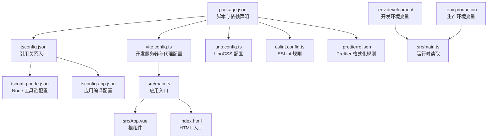
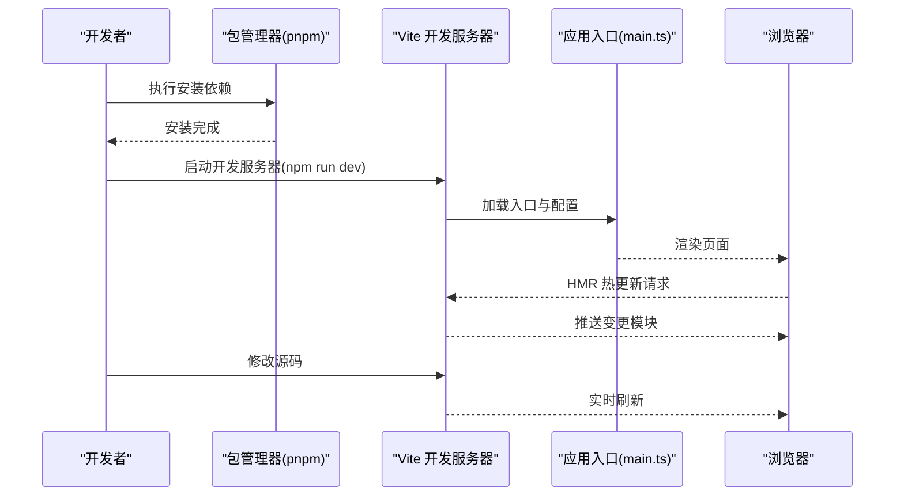
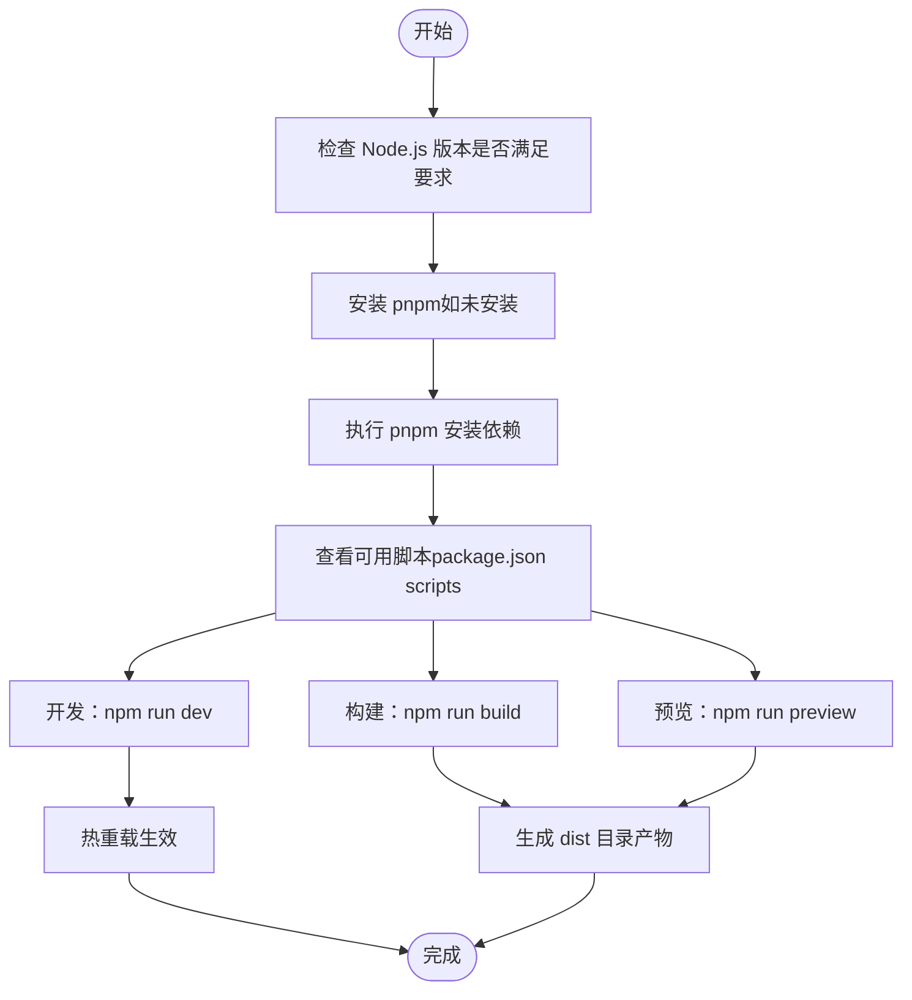
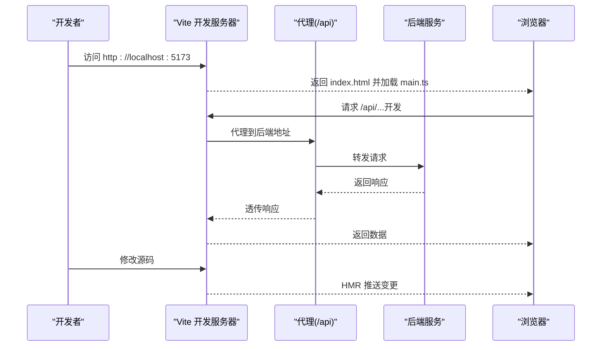
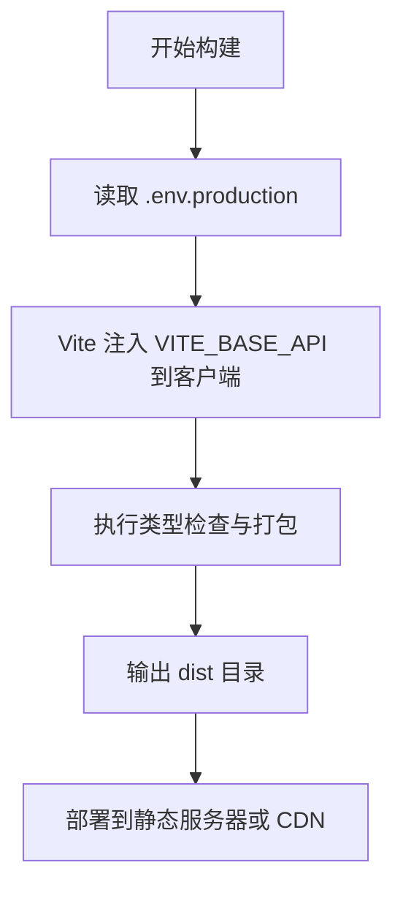
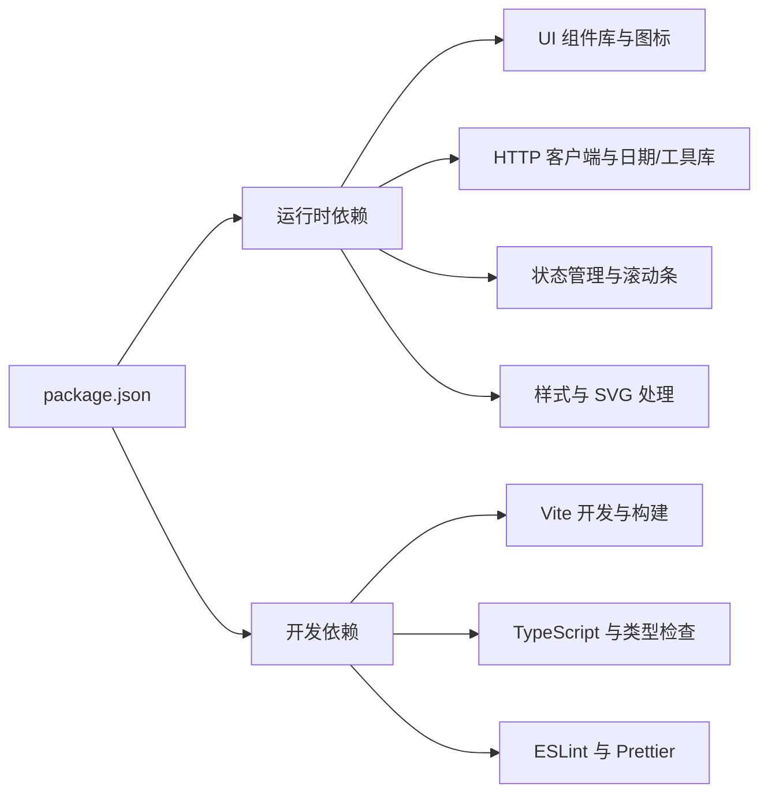

# 开发环境搭建

<cite>
**本文引用的文件**
- [package.json](file://package.json)
- [vite.config.ts](file://vite.config.ts)
- [tsconfig.json](file://tsconfig.json)
- [tsconfig.node.json](file://tsconfig.node.json)
- [tsconfig.app.json](file://tsconfig.app.json)
- [uno.config.ts](file://uno.config.ts)
- [eslint.config.ts](file://eslint.config.ts)
- [.prettierrc.json](file://.prettierrc.json)
- [.env.development](file://.env.development)
- [.env.production](file://.env.production)
- [src/main.ts](file://src/main.ts)
- [src/App.vue](file://src/App.vue)
- [index.html](file://index.html)
- [.vscode/extensions.json](file://.vscode/extensions.json)
- [.vscode/settings.json](file://.vscode/settings.json)
</cite>

## 目录
1. [简介](#简介)
2. [项目结构](#项目结构)
3. [核心组件](#核心组件)
4. [架构总览](#架构总览)
5. [详细组件分析](#详细组件分析)
6. [依赖分析](#依赖分析)
7. [性能考虑](#性能考虑)
8. [故障排除指南](#故障排除指南)
9. [结论](#结论)
10. [附录](#附录)

## 简介
本指南面向首次参与 LiFocus Web v2 项目的开发者，提供从系统准备到本地开发、构建与部署的完整流程说明。内容涵盖系统与 Node.js 版本要求、包管理器选择、依赖安装、开发服务器启动（含热重载）、生产构建与环境变量配置、常用开发工具推荐以及常见问题排查。

## 项目结构
该项目采用 Vue 3 + TypeScript + Vite 的现代前端技术栈，使用 UnoCSS 提供原子化样式，Pinia 管理状态，Vue Router 路由，配合 TDesign 组件库与图标库。项目通过多份 tsconfig 文件分层管理编译配置，并以 Vite 提供开发服务器与构建能力。

**图示来源**
- [package.json](file://package.json#L1-L60)
- [vite.config.ts](file://vite.config.ts#L1-L31)
- [tsconfig.json](file://tsconfig.json#L1-L12)
- [tsconfig.node.json](file://tsconfig.node.json#L1-L20)
- [tsconfig.app.json](file://tsconfig.app.json#L1-L13)
- [uno.config.ts](file://uno.config.ts#L1-L50)
- [eslint.config.ts](file://eslint.config.ts#L1-L23)
- [.prettierrc.json](file://.prettierrc.json#L1-L7)
- [src/main.ts](file://src/main.ts#L1-L28)
- [src/App.vue](file://src/App.vue#L1-L12)
- [index.html](file://index.html#L1-L14)
- [.env.development](file://.env.development#L1-L4)
- [.env.production](file://.env.production#L1-L2)

**章节来源**
- [package.json](file://package.json#L1-L60)
- [vite.config.ts](file://vite.config.ts#L1-L31)
- [tsconfig.json](file://tsconfig.json#L1-L12)
- [tsconfig.node.json](file://tsconfig.node.json#L1-L20)
- [tsconfig.app.json](file://tsconfig.app.json#L1-L13)
- [uno.config.ts](file://uno.config.ts#L1-L50)
- [eslint.config.ts](file://eslint.config.ts#L1-L23)
- [.prettierrc.json](file://.prettierrc.json#L1-L7)
- [src/main.ts](file://src/main.ts#L1-L28)
- [src/App.vue](file://src/App.vue#L1-L12)
- [index.html](file://index.html#L1-L14)
- [.env.development](file://.env.development#L1-L4)
- [.env.production](file://.env.production#L1-L2)

## 核心组件
- 包管理与脚本：通过 package.json 声明 Node.js 版本范围与常用脚本（开发、构建、预览、类型检查、格式化、代码质量）。
- 构建与开发：Vite 提供开发服务器、热重载与打包能力；UnoCSS 提供原子化样式；Vue 插件链支持 TSX/JSX。
- 类型系统：双 tsconfig 分层（Node 工具链与应用），路径别名统一为 @。
- 代码质量：ESLint 使用 @antfu/eslint-config，Prettier 统一格式化风格。
- 环境变量：区分开发与生产环境，通过 Vite 前缀变量注入到客户端代码。

**章节来源**
- [package.json](file://package.json#L6-L17)
- [vite.config.ts](file://vite.config.ts#L10-L30)
- [tsconfig.node.json](file://tsconfig.node.json#L1-L20)
- [tsconfig.app.json](file://tsconfig.app.json#L1-L13)
- [eslint.config.ts](file://eslint.config.ts#L1-L23)
- [.prettierrc.json](file://.prettierrc.json#L1-L7)
- [.env.development](file://.env.development#L1-L4)
- [.env.production](file://.env.production#L1-L2)

## 架构总览
下图展示从本地开发到生产构建的关键流程与组件交互：

**图示来源**
- [package.json](file://package.json#L9-L16)
- [vite.config.ts](file://vite.config.ts#L19-L29)
- [src/main.ts](file://src/main.ts#L17-L27)
- [index.html](file://index.html#L11-L11)

## 详细组件分析

### 系统要求与前置条件
- Node.js 版本：根据 engines 字段，要求 Node.js 版本满足 ^20.19.0 或 >=22.12.0。
- 包管理器：仓库包含 pnpm 锁定文件，建议使用 pnpm 以确保依赖一致性。
- 文本编辑器：推荐 VS Code，并已提供扩展与设置文件，便于团队协作。

**章节来源**
- [package.json](file://package.json#L6-L8)
- [package.json](file://package.json#L1-L60)
- [.vscode/extensions.json](file://.vscode/extensions.json)
- [.vscode/settings.json](file://.vscode/settings.json)

### 依赖安装流程
- 使用 pnpm 进行安装，确保与锁定文件一致。
- 安装完成后，可执行以下脚本进行后续操作：
  - 开发：npm run dev
  - 构建：npm run build
  - 预览：npm run preview
  - 类型检查：npm run type-check
  - 代码质量：npm run lint / npm run format

**图示来源**
- [package.json](file://package.json#L6-L17)

**章节来源**
- [package.json](file://package.json#L6-L17)

### 开发服务器启动与热重载
- 启动命令：npm run dev 将调用 Vite 开发服务器。
- 服务器端口与代理：
  - 默认端口：5173
  - 代理规则：将 /api 前缀转发至后端服务地址，便于前后端联调。
- 应用入口：
  - HTML 入口文件引入 /src/main.ts。
  - main.ts 创建应用实例、挂载路由与状态管理，并引入 UnoCSS、动画与组件样式。
- 热重载机制：
  - Vite 通过 HMR 将变更模块推送到浏览器，实现无刷新更新。

**图示来源**
- [vite.config.ts](file://vite.config.ts#L19-L29)
- [index.html](file://index.html#L11-L11)
- [src/main.ts](file://src/main.ts#L1-L28)
- [.env.development](file://.env.development#L1-L4)

**章节来源**
- [vite.config.ts](file://vite.config.ts#L19-L29)
- [index.html](file://index.html#L1-L14)
- [src/main.ts](file://src/main.ts#L1-L28)
- [.env.development](file://.env.development#L1-L4)

### 生产构建与环境变量
- 构建命令：npm run build 将执行类型检查与打包。
- 产物目录：dist，包含静态资源与入口 HTML。
- 环境变量：
  - 开发：.env.development 中的 VITE_BASE_API 指向 /api，便于代理转发。
  - 生产：.env.production 中的 VITE_BASE_API 指向线上后端地址。
- 注意：Vite 仅会注入以 VITE_ 前缀的变量到客户端代码。

**图示来源**
- [package.json](file://package.json#L11-L14)
- [.env.production](file://.env.production#L1-L2)
- [index.html](file://index.html#L1-L14)

**章节来源**
- [package.json](file://package.json#L11-L14)
- [.env.production](file://.env.production#L1-L2)
- [index.html](file://index.html#L1-L14)

### 代码质量与格式化
- ESLint：基于 @antfu/eslint-config，启用 TypeScript 支持，并在规则中关闭部分严格项。
- Prettier：统一半角分号、单引号与打印宽度。
- 建议在提交前执行 npm run lint 与 npm run format，保持代码风格一致。

**章节来源**
- [eslint.config.ts](file://eslint.config.ts#L1-L23)
- [.prettierrc.json](file://.prettierrc.json#L1-L7)

### 样式与主题配置
- UnoCSS：提供原子化样式与主题色板，支持快捷方式与自定义主题。
- 在入口中引入虚拟模块样式与重置样式，确保全局样式一致。

**章节来源**
- [uno.config.ts](file://uno.config.ts#L1-L50)
- [src/main.ts](file://src/main.ts#L9-L15)

### 应用入口与路由
- 入口文件创建 Vue 应用，注册 Pinia（含持久化插件）、路由与全局组件。
- 根组件通过 RouterView 渲染视图，基础样式与动画库已在入口统一引入。

**章节来源**
- [src/main.ts](file://src/main.ts#L1-L28)
- [src/App.vue](file://src/App.vue#L1-L12)

## 依赖分析
- 运行时依赖：Vue 3、Vue Router、Pinia、Axios、Day.js、Lodash、TDesign 组件库与图标、UnoCSS、SVG 加载器等。
- 开发依赖：Vite、Vue 插件链、TypeScript、ESLint、Prettier、类型检查工具等。
- 依赖安装与脚本由 package.json 统一管理，建议使用 pnpm 以匹配锁定文件。

**图示来源**
- [package.json](file://package.json#L18-L58)

**章节来源**
- [package.json](file://package.json#L18-L58)

## 性能考虑
- 使用 Vite 的 HMR 与按需加载减少开发时等待时间。
- UnoCSS 原子化样式避免冗余 CSS，提升构建效率。
- Pinia 持久化插件用于本地存储，注意合理控制存储粒度，避免过大状态影响首屏。
- 构建时开启类型检查，提前发现潜在问题，减少运行时错误。

## 故障排除指南
- Node.js 版本不满足要求
  - 症状：安装或启动时报错，提示 Node 版本不符合 engines。
  - 处理：升级 Node.js 至 ^20.19.0 或 >=22.12.0。
  - 参考：[engines 字段](file://package.json#L6-L8)
- pnpm 未安装或版本不兼容
  - 症状：安装失败或锁文件不匹配。
  - 处理：使用 pnpm 安装依赖，确保与 pnpm-lock.yaml 一致。
  - 参考：[依赖与脚本](file://package.json#L18-L58)
- 端口冲突（默认 5173）
  - 症状：启动失败提示端口占用。
  - 处理：修改 vite.config.ts 中 server.port 或释放端口。
  - 参考：[开发服务器配置](file://vite.config.ts#L19-L21)
- 代理无法访问后端
  - 症状：/api 请求 404 或超时。
  - 处理：确认 .env.development 中 VITE_BASE_API 与后端地址一致；检查代理 target 与 changeOrigin 设置。
  - 参考：[代理配置](file://vite.config.ts#L21-L27)，[开发环境变量](file://.env.development#L1-L4)
- 构建产物空白或资源 404
  - 症状：预览或部署后页面无内容。
  - 处理：确认 public 与静态资源路径；检查 Vite 入口与路由模式；核对 .env.production。
  - 参考：[入口 HTML](file://index.html#L1-L14)，[生产环境变量](file://.env.production#L1-L2)
- 环境变量未生效
  - 症状：客户端读取不到 API 地址。
  - 处理：确保变量名以 VITE_ 前缀；区分 .env.development 与 .env.production。
  - 参考：[环境变量规则](file://.env.development#L1-L4)，[生产变量](file://.env.production#L1-L2)
- ESLint/Prettier 报错
  - 症状：保存或提交时报格式或规则错误。
  - 处理：执行 npm run lint 与 npm run format；必要时在编辑器中启用保存自动修复。
  - 参考：[ESLint 配置](file://eslint.config.ts#L1-L23)，[Prettier 配置](file://.prettierrc.json#L1-L7)

## 结论
按照本指南完成系统与 Node.js 版本准备、包管理器选择、依赖安装与开发服务器启动后，即可进入日常开发。生产构建阶段请关注环境变量注入与代理配置，确保前后端联调顺畅。遵循代码质量与格式化规范，有助于提升团队协作效率与代码可维护性。

## 附录
- 常用开发工具推荐（VS Code 插件与设置）
  - 插件清单：参考 .vscode/extensions.json
  - 编辑器设置：参考 .vscode/settings.json
- 快速命令清单
  - 安装：pnpm install
  - 开发：npm run dev
  - 构建：npm run build
  - 预览：npm run preview
  - 代码质量：npm run lint / npm run format
- 关键配置文件定位
  - Vite：vite.config.ts
  - TypeScript：tsconfig.json、tsconfig.node.json、tsconfig.app.json
  - UnoCSS：uno.config.ts
  - ESLint：eslint.config.ts
  - Prettier：.prettierrc.json
  - 环境变量：.env.development、.env.production
  - 应用入口：src/main.ts、index.html、src/App.vue