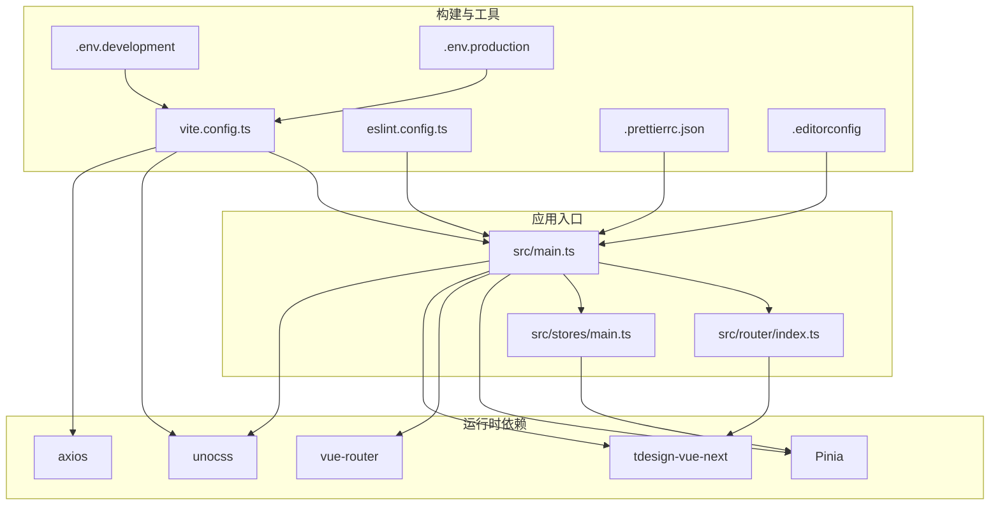
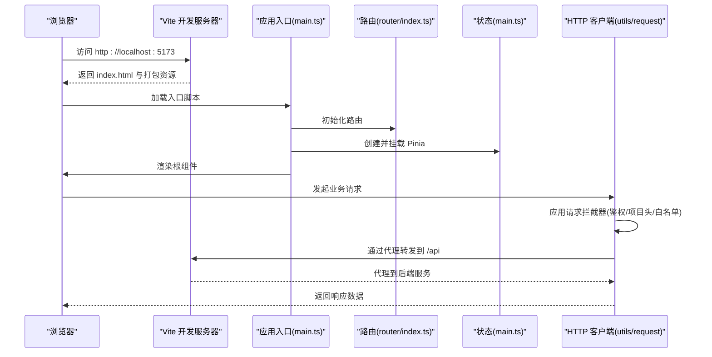
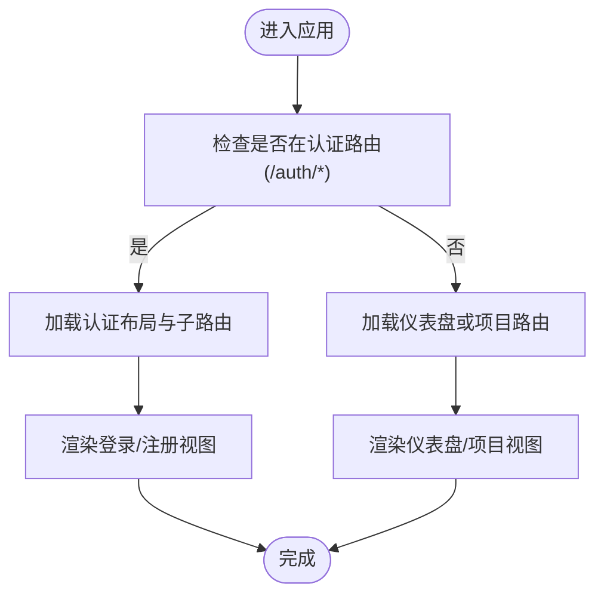
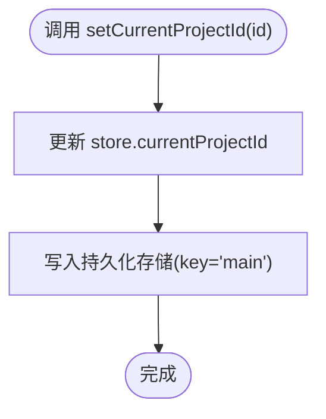
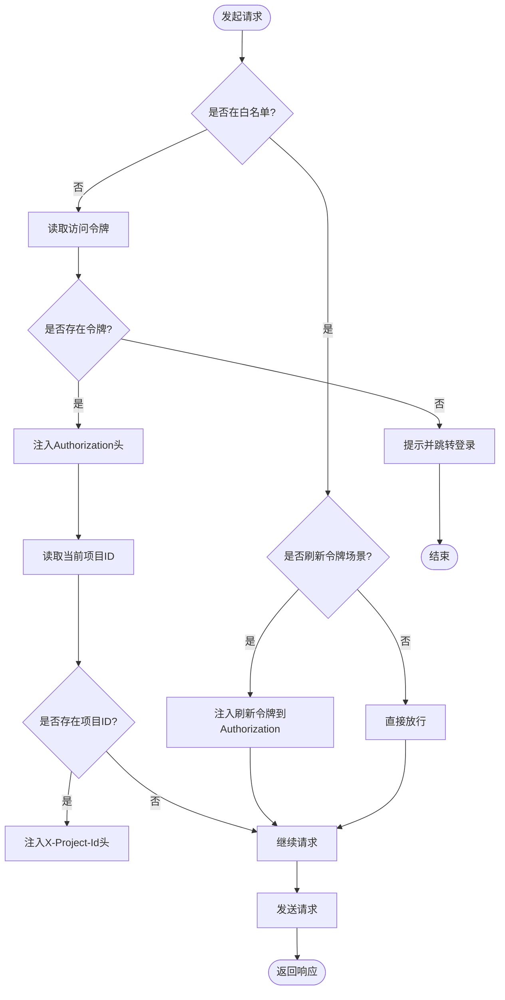
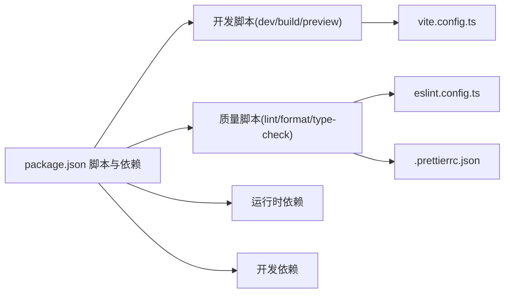

# 开发者指南

<cite>
**本文引用的文件**
- [README.md](file://README.md)
- [package.json](file://package.json)
- [.prettierrc.json](file://.prettierrc.json)
- [.editorconfig](file://.editorconfig)
- [.gitignore](file://.gitignore)
- [vite.config.ts](file://vite.config.ts)
- [tsconfig.json](file://tsconfig.json)
- [eslint.config.ts](file://eslint.config.ts)
- [uno.config.ts](file://uno.config.ts)
- [src/main.ts](file://src/main.ts)
- [src/router/index.ts](file://src/router/index.ts)
- [src/stores/main.ts](file://src/stores/main.ts)
- [src/utils/request/index.ts](file://src/utils/request/index.ts)
- [.env.development](file://.env.development)
- [.env.production](file://.env.production)
</cite>

## 目录
1. [简介](#简介)
2. [项目结构](#项目结构)
3. [核心组件](#核心组件)
4. [架构总览](#架构总览)
5. [详细组件分析](#详细组件分析)
6. [依赖分析](#依赖分析)
7. [性能考虑](#性能考虑)
8. [故障排查指南](#故障排查指南)
9. [结论](#结论)
10. [附录](#附录)

## 简介
本指南面向 LiFocus Web V2 的开发者，帮助你快速理解项目结构、开发与构建流程、代码质量规范、工具链配置以及协作与维护建议。内容涵盖从环境准备到日常开发、测试与发布的全流程。

## 项目结构
该项目基于 Vue 3 + Vite + TypeScript 技术栈，采用 Pinia 进行状态管理，Unocss 提供原子化 CSS，TDesign 组件库提供 UI 基础能力；路由采用 Vue Router；Axios 封装统一请求客户端；Prettier、ESLint 保障代码风格与质量；通过环境变量区分开发与生产后端地址。

**图示来源**
- [src/main.ts](file://src/main.ts#L1-L28)
- [src/router/index.ts](file://src/router/index.ts#L1-L82)
- [src/stores/main.ts](file://src/stores/main.ts#L1-L21)
- [vite.config.ts](file://vite.config.ts#L1-L31)
- [eslint.config.ts](file://eslint.config.ts#L1-L23)
- [.prettierrc.json](file://.prettierrc.json#L1-L7)
- [.editorconfig](file://.editorconfig#L1-L9)
- [.env.development](file://.env.development#L1-L4)
- [.env.production](file://.env.production#L1-L2)

**章节来源**
- [README.md](file://README.md#L1-L49)
- [package.json](file://package.json#L1-L60)
- [vite.config.ts](file://vite.config.ts#L1-L31)
- [tsconfig.json](file://tsconfig.json#L1-L12)

## 核心组件
- 应用入口与全局注册：在应用入口中完成 Pinia、路由、UI 样式与第三方库的初始化与挂载。
- 路由系统：集中定义认证、仪表盘、项目相关页面的路由与懒加载组件。
- 状态管理：主状态仓库用于保存当前项目 ID 与加载状态，并持久化到本地存储。
- 请求封装：统一的 HTTP 客户端，内置拦截器处理鉴权头、项目维度上下文头与白名单豁免逻辑。
- 构建与工具链：Vite 配置了插件、别名、代理与服务端口；ESLint 使用 @antfu 配置并自定义规则；Prettier 统一格式化；EditorConfig 保证跨编辑器一致性。

**章节来源**
- [src/main.ts](file://src/main.ts#L1-L28)
- [src/router/index.ts](file://src/router/index.ts#L1-L82)
- [src/stores/main.ts](file://src/stores/main.ts#L1-L21)
- [src/utils/request/index.ts](file://src/utils/request/index.ts#L1-L40)
- [vite.config.ts](file://vite.config.ts#L1-L31)
- [eslint.config.ts](file://eslint.config.ts#L1-L23)
- [.prettierrc.json](file://.prettierrc.json#L1-L7)
- [.editorconfig](file://.editorconfig#L1-L9)

## 架构总览
下图展示了前端应用从启动到网络请求的关键交互路径，以及开发服务器与后端接口的代理关系。

**图示来源**
- [src/main.ts](file://src/main.ts#L1-L28)
- [src/router/index.ts](file://src/router/index.ts#L1-L82)
- [src/stores/main.ts](file://src/stores/main.ts#L1-L21)
- [src/utils/request/index.ts](file://src/utils/request/index.ts#L1-L40)
- [vite.config.ts](file://vite.config.ts#L19-L29)
- [.env.development](file://.env.development#L1-L4)

## 详细组件分析

### 应用入口与全局装配（main.ts）
- 完成应用实例创建、全局组件注册、插件安装与挂载。
- 初始化 Pinia 并启用持久化插件。
- 注入路由、UI 样式、动画库与滚动条组件。
- 入口文件负责应用生命周期的起点，确保后续模块按序加载。

**章节来源**
- [src/main.ts](file://src/main.ts#L1-L28)

### 路由系统（router/index.ts）
- 定义认证页、仪表盘、项目工作台等路由。
- 使用动态导入实现组件懒加载，优化首屏加载。
- 通过嵌套路由组织项目相关页面，提升可维护性。

**图示来源**
- [src/router/index.ts](file://src/router/index.ts#L5-L74)

**章节来源**
- [src/router/index.ts](file://src/router/index.ts#L1-L82)

### 状态管理（stores/main.ts）
- 维护全局加载状态与当前项目 ID。
- 提供修改当前项目 ID 的动作，并同步写入工具函数以持久化。
- 启用持久化策略，键名为 main，存储介质为 localStorage。

**图示来源**
- [src/stores/main.ts](file://src/stores/main.ts#L10-L20)

**章节来源**
- [src/stores/main.ts](file://src/stores/main.ts#L1-L21)

### 请求封装与拦截器（utils/request/index.ts）
- 基于统一客户端创建 HTTP 实例，设置基础地址与超时。
- 请求拦截器：
  - 白名单豁免：对特定路径不强制携带令牌。
  - 默认场景：从工具函数读取令牌并注入 Authorization 头。
  - 项目维度：从状态读取当前项目 ID 写入 X-Project-Id 头。
  - 异常兜底：当缺少令牌时提示错误并跳转至登录页。
- 可扩展点：可在拦截器中增加重试、日志上报等逻辑。

**图示来源**
- [src/utils/request/index.ts](file://src/utils/request/index.ts#L12-L39)

**章节来源**
- [src/utils/request/index.ts](file://src/utils/request/index.ts#L1-L40)

### 构建与开发服务器（vite.config.ts）
- 插件：Vue、JSX、Vue DevTools、UnoCSS、SVG Loader。
- 别名：@ 指向 src 目录，便于模块导入。
- 服务：本地端口 5173，默认开启代理到后端 /api。
- 可扩展点：可在插件列表中加入更多开发辅助工具或分析器。

**章节来源**
- [vite.config.ts](file://vite.config.ts#L1-L31)

### 环境变量（.env.development / .env.production）
- 开发环境使用相对路径 /api，借助 Vite 代理转发到后端服务。
- 生产环境使用真实域名地址，避免跨域问题。
- 建议在 CI 中注入对应环境变量以适配不同部署环境。

**章节来源**
- [.env.development](file://.env.development#L1-L4)
- [.env.production](file://.env.production#L1-L2)

### 代码质量与风格（ESLint、Prettier、EditorConfig）
- ESLint：使用 @antfu/eslint-config，启用 TypeScript 支持，关闭部分规则以适配项目现状，并配置忽略目录。
- Prettier：关闭分号、单引号、设定行长与实验性 CLI。
- EditorConfig：统一字符集、缩进、换行与尾随空白处理。

**章节来源**
- [eslint.config.ts](file://eslint.config.ts#L1-L23)
- [.prettierrc.json](file://.prettierrc.json#L1-L7)
- [.editorconfig](file://.editorconfig#L1-L9)

### 设计系统与主题（UnoCSS）
- 提供常用快捷类与主题色板，支持主色、背景、字体等多级色阶。
- 支持快捷方式组合，减少重复样式书写。

**章节来源**
- [uno.config.ts](file://uno.config.ts#L1-L50)

## 依赖分析
- 运行时依赖：Vue 3、Vue Router、Pinia、Axios、TDesign、Animate.css、SimpleBar、UnoCSS、md-editor-v3 等。
- 开发依赖：Vite、Vue 官方插件、TypeScript、ESLint、Prettier、Vue 类型检查工具等。
- 脚本命令：dev、build、preview、type-check、lint、format 等，覆盖开发、构建、预览与质量保障。

**图示来源**
- [package.json](file://package.json#L9-L17)
- [vite.config.ts](file://vite.config.ts#L1-L31)
- [eslint.config.ts](file://eslint.config.ts#L1-L23)
- [.prettierrc.json](file://.prettierrc.json#L1-L7)

**章节来源**
- [package.json](file://package.json#L1-L60)

## 性能考虑
- 路由懒加载：通过动态导入减少首屏包体，提升初始渲染速度。
- 组件按需：UI 组件库按需引入，避免全量打包。
- 代理与缓存：开发阶段合理利用浏览器缓存与 Vite HMR；生产构建开启压缩与分包策略。
- 请求拦截：在客户端侧统一注入令牌与上下文头，减少重复逻辑与错误请求。

[本节为通用指导，无需列出具体文件来源]

## 故障排查指南
- 无法连接后端接口
  - 检查开发环境代理配置与后端服务状态。
  - 确认 .env.development 中的 VITE_BASE_API 是否正确。
- 登录态失效或频繁跳转登录
  - 检查请求拦截器中的令牌读取逻辑与白名单配置。
  - 确认状态仓库中当前项目 ID 是否存在且有效。
- 编辑器格式化不生效
  - 确认 VS Code 插件已安装且未禁用 Prettier/ESLint。
  - 检查 .editorconfig 与 .prettierrc.json 是否被正确识别。
- 构建报错或类型检查失败
  - 执行类型检查与修复脚本，确保无类型错误。
  - 清理缓存后重试。

**章节来源**
- [vite.config.ts](file://vite.config.ts#L19-L29)
- [.env.development](file://.env.development#L1-L4)
- [src/utils/request/index.ts](file://src/utils/request/index.ts#L12-L39)
- [src/stores/main.ts](file://src/stores/main.ts#L10-L20)
- [.prettierrc.json](file://.prettierrc.json#L1-L7)
- [.editorconfig](file://.editorconfig#L1-L9)
- [package.json](file://package.json#L14-L16)

## 结论
本指南提供了从项目结构、核心组件到开发工具链与质量保障的完整参考。建议在日常开发中严格遵循代码风格与提交规范，配合自动化检查与代理配置，确保开发效率与产物质量。

[本节为总结性内容，无需列出具体文件来源]

## 附录

### 开发环境与工具配置
- 推荐 IDE：VS Code，安装 Vue 官方扩展并禁用 Vetur。
- 浏览器调试：Chrome/Firefox 的 Vue DevTools，开启自定义对象格式化。
- 类型支持：使用 vue-tsc 替代 tsc 进行类型检查。
- 自定义配置：参考 Vite 配置与 UnoCSS 主题配置进行扩展。

**章节来源**
- [README.md](file://README.md#L5-L24)
- [vite.config.ts](file://vite.config.ts#L1-L31)
- [uno.config.ts](file://uno.config.ts#L1-L50)

### 代码贡献流程与规范
- 分支管理
  - 主分支：main（受保护），仅允许通过合并请求合入。
  - 功能分支：feature/xxx，修复分支：fix/xxx，文档分支：docs/xxx。
  - 合并前要求通过 lint、格式化与类型检查。
- 提交规范
  - 类型：feat、fix、docs、style、refactor、test、chore。
  - 格式：type(scope): subject，subject 首字母小写，末尾不加标点。
  - 示例：feat(router): 新增项目路由配置。
- 代码审查
  - 至少一名 reviewer 通过，确保变更符合设计与规范。
  - 关联 Issue 或需求链接，必要时附带截图或演示。

[本节为通用流程建议，无需列出具体文件来源]

### 版本控制策略
- 语义化版本：小版本（功能新增）与补丁（修复）按需发布。
- 标签与发布：通过 Git Tag 标记版本，结合 CI 进行制品分发。
- 回滚策略：保留最近一次稳定 Tag，必要时回退到上一个稳定版本。

[本节为通用策略建议，无需列出具体文件来源]

### 项目维护与扩展
- 保持依赖更新：定期升级开发与运行时依赖，关注安全公告。
- 规范演进：根据团队反馈调整 ESLint/Prettier 规则与 EditorConfig。
- 组件与样式：新增组件遵循现有目录结构与命名约定，样式优先使用 UnoCSS 快捷类。
- 路由与状态：新增页面遵循现有路由组织方式，状态尽量集中在 Pinia，避免分散。

[本节为通用维护建议，无需列出具体文件来源]