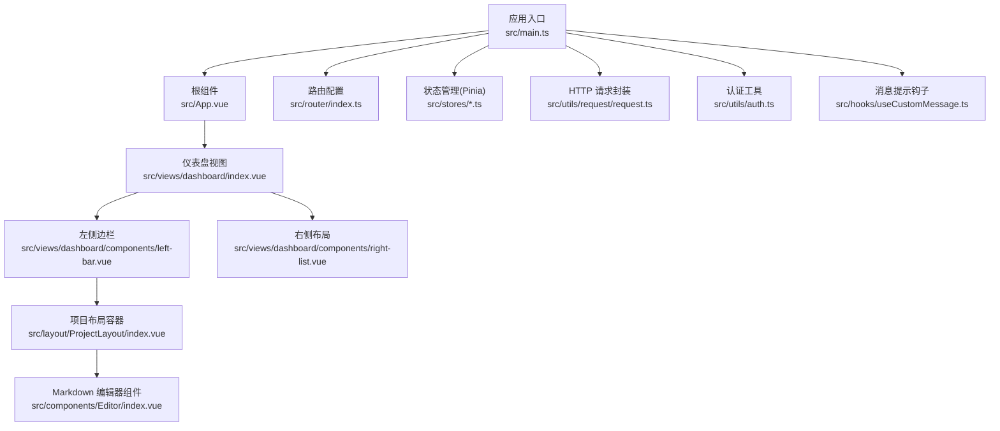
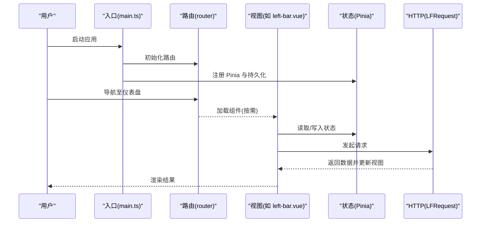
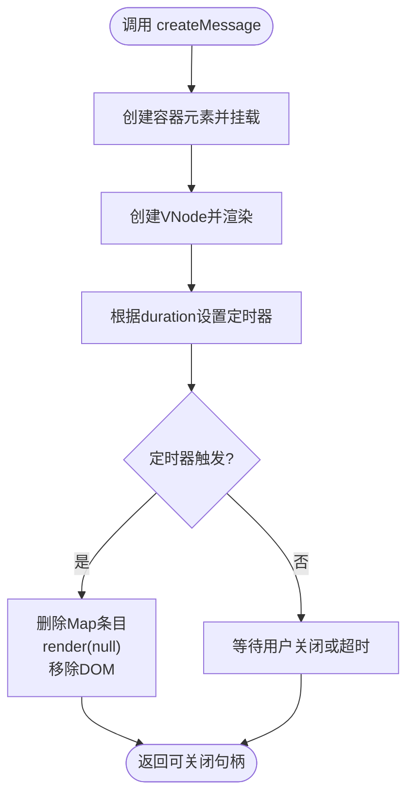
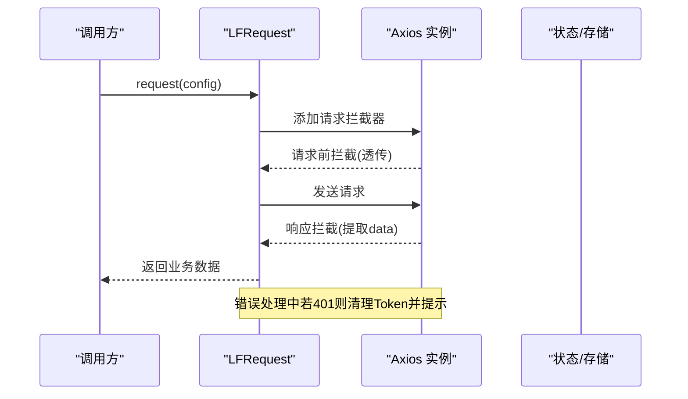
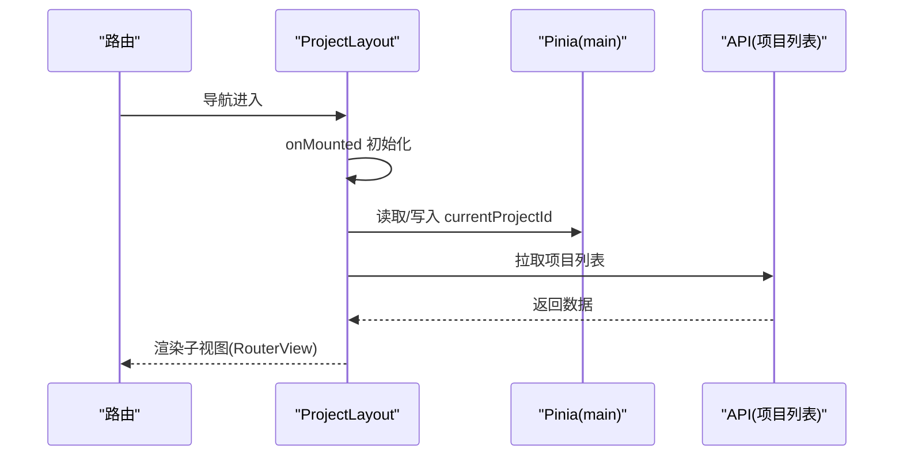
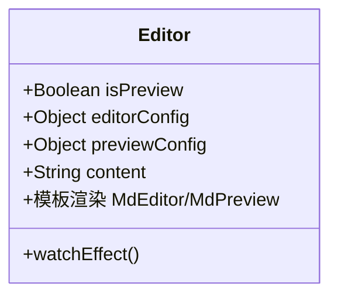
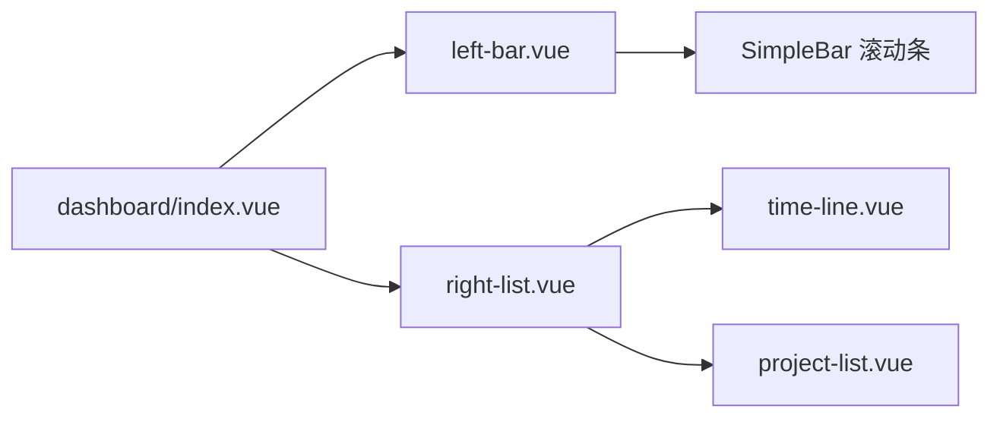
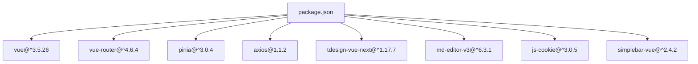

# 内存管理

<cite>
**本文引用的文件**
- [src/main.ts](file://src/main.ts)
- [src/App.vue](file://src/App.vue)
- [src/router/index.ts](file://src/router/index.ts)
- [src/stores/main.ts](file://src/stores/main.ts)
- [src/stores/counter.ts](file://src/stores/counter.ts)
- [src/stores/user.ts](file://src/stores/user.ts)
- [src/utils/request/request.ts](file://src/utils/request/request.ts)
- [src/utils/auth.ts](file://src/utils/auth.ts)
- [src/hooks/useCustomMessage.ts](file://src/hooks/useCustomMessage.ts)
- [src/views/dashboard/index.vue](file://src/views/dashboard/index.vue)
- [src/views/dashboard/components/left-bar.vue](file://src/views/dashboard/components/left-bar.vue)
- [src/views/dashboard/components/right-list.vue](file://src/views/dashboard/components/right-list.vue)
- [src/layout/ProjectLayout/index.vue](file://src/layout/ProjectLayout/index.vue)
- [src/components/Editor/index.vue](file://src/components/Editor/index.vue)
- [package.json](file://package.json)
</cite>

## 目录
1. [引言](#引言)
2. [项目结构](#项目结构)
3. [核心组件](#核心组件)
4. [架构总览](#架构总览)
5. [详细组件分析](#详细组件分析)
6. [依赖分析](#依赖分析)
7. [性能考量](#性能考量)
8. [故障排查指南](#故障排查指南)
9. [结论](#结论)
10. [附录](#附录)

## 引言
本指南面向前端工程师与全栈开发者，围绕 JavaScript 内存模型与垃圾回收机制，结合 Vue 3 应用中的实际代码实践，系统讲解内存泄漏的预防与检测、大数组与大数据对象的处理策略、定时器与事件监听器的正确清理、内存使用监控与性能分析技术，并总结内存优化最佳实践与常见陷阱。文中所有分析均基于仓库现有实现，确保建议可落地、可验证。

## 项目结构
该项目采用 Vue 3 + TypeScript + Vite 的现代前端工程化架构，采用路由按需加载与 Pinia 状态持久化方案，组件以功能域划分，便于模块化维护与内存隔离。

图表来源
- [src/main.ts](file://src/main.ts#L1-L28)
- [src/App.vue](file://src/App.vue#L1-L12)
- [src/router/index.ts](file://src/router/index.ts#L1-L82)
- [src/stores/main.ts](file://src/stores/main.ts#L1-L21)
- [src/stores/counter.ts](file://src/stores/counter.ts#L1-L13)
- [src/stores/user.ts](file://src/stores/user.ts#L1-L29)
- [src/utils/request/request.ts](file://src/utils/request/request.ts#L1-L99)
- [src/utils/auth.ts](file://src/utils/auth.ts#L1-L71)
- [src/hooks/useCustomMessage.ts](file://src/hooks/useCustomMessage.ts#L1-L73)
- [src/views/dashboard/index.vue](file://src/views/dashboard/index.vue#L1-L26)
- [src/views/dashboard/components/left-bar.vue](file://src/views/dashboard/components/left-bar.vue#L1-L107)
- [src/views/dashboard/components/right-list.vue](file://src/views/dashboard/components/right-list.vue#L1-L21)
- [src/layout/ProjectLayout/index.vue](file://src/layout/ProjectLayout/index.vue#L1-L135)
- [src/components/Editor/index.vue](file://src/components/Editor/index.vue#L1-L164)

章节来源
- [src/main.ts](file://src/main.ts#L1-L28)
- [src/router/index.ts](file://src/router/index.ts#L1-L82)
- [package.json](file://package.json#L1-L60)

## 核心组件
- 应用入口与全局注册：应用在入口集中注册滚动条组件、Pinia、路由等，避免分散初始化导致的资源泄漏风险。
- 路由按需加载：通过动态导入实现页面级懒加载，减少初始包体与常驻内存占用。
- Pinia 状态管理：使用组合式 Store 与选项式 Store 并存，配合持久化插件，降低频繁重建带来的内存抖动。
- 请求封装：统一拦截器与错误处理，避免重复请求与未决 Promise 导致的内存堆积。
- 自定义消息提示：使用虚拟节点与渲染函数创建/销毁 DOM，确保定时器与容器及时释放。
- 认证工具：区分 Cookie 与 SessionStorage，明确 Token 生命周期，避免长期持有敏感数据造成内存压力。

章节来源
- [src/main.ts](file://src/main.ts#L1-L28)
- [src/router/index.ts](file://src/router/index.ts#L1-L82)
- [src/stores/main.ts](file://src/stores/main.ts#L1-L21)
- [src/stores/counter.ts](file://src/stores/counter.ts#L1-L13)
- [src/stores/user.ts](file://src/stores/user.ts#L1-L29)
- [src/utils/request/request.ts](file://src/utils/request/request.ts#L1-L99)
- [src/hooks/useCustomMessage.ts](file://src/hooks/useCustomMessage.ts#L1-L73)
- [src/utils/auth.ts](file://src/utils/auth.ts#L1-L71)

## 架构总览
下图展示从入口到视图层的数据流与交互关系，强调组件生命周期与状态管理对内存的影响。

图表来源
- [src/main.ts](file://src/main.ts#L1-L28)
- [src/router/index.ts](file://src/router/index.ts#L1-L82)
- [src/views/dashboard/components/left-bar.vue](file://src/views/dashboard/components/left-bar.vue#L1-L107)
- [src/stores/main.ts](file://src/stores/main.ts#L1-L21)
- [src/utils/request/request.ts](file://src/utils/request/request.ts#L1-L99)

## 详细组件分析

### 组件一：自定义消息提示（内存泄漏防护）
该组件通过虚拟节点与渲染函数创建 DOM 容器，并在指定时长后销毁，避免消息队列无限增长与 DOM 泄漏。

图表来源
- [src/hooks/useCustomMessage.ts](file://src/hooks/useCustomMessage.ts#L1-L73)

章节来源
- [src/hooks/useCustomMessage.ts](file://src/hooks/useCustomMessage.ts#L1-L73)

### 组件二：HTTP 请求封装（拦截器与错误处理）
LFRequest 统一封装了请求与响应拦截器，避免重复订阅与未决 Promise；在 401 场景中主动清理 Token 并跳转登录，防止无效请求常驻内存。

图表来源
- [src/utils/request/request.ts](file://src/utils/request/request.ts#L1-L99)
- [src/utils/auth.ts](file://src/utils/auth.ts#L1-L71)

章节来源
- [src/utils/request/request.ts](file://src/utils/request/request.ts#L1-L99)
- [src/utils/auth.ts](file://src/utils/auth.ts#L1-L71)

### 组件三：项目布局与路由切换（内存隔离）
ProjectLayout 在挂载时根据当前路由初始化 Tab，并拉取项目列表；通过路由守卫与组件卸载，避免历史页面资源残留。

图表来源
- [src/layout/ProjectLayout/index.vue](file://src/layout/ProjectLayout/index.vue#L1-L135)
- [src/stores/main.ts](file://src/stores/main.ts#L1-L21)
- [src/router/index.ts](file://src/router/index.ts#L1-L82)

章节来源
- [src/layout/ProjectLayout/index.vue](file://src/layout/ProjectLayout/index.vue#L1-L135)
- [src/stores/main.ts](file://src/stores/main.ts#L1-L21)
- [src/router/index.ts](file://src/router/index.ts#L1-L82)

### 组件四：Markdown 编辑器（大对象渲染与滚动优化）
Editor 组件负责 Markdown 编辑与预览，包含大量配置与实时渲染逻辑。建议在内容较大时启用虚拟滚动、延迟初始化与按需渲染，避免一次性构建过多 DOM。

图表来源
- [src/components/Editor/index.vue](file://src/components/Editor/index.vue#L1-L164)

章节来源
- [src/components/Editor/index.vue](file://src/components/Editor/index.vue#L1-L164)

### 组件五：仪表盘视图（左右分区与子组件）
dashboard/index.vue 采用网格布局承载左右两个子组件，内部通过滚动条组件控制溢出，避免滚动容器内元素过多导致的内存压力。

图表来源
- [src/views/dashboard/index.vue](file://src/views/dashboard/index.vue#L1-L26)
- [src/views/dashboard/components/left-bar.vue](file://src/views/dashboard/components/left-bar.vue#L1-L107)
- [src/views/dashboard/components/right-list.vue](file://src/views/dashboard/components/right-list.vue#L1-L21)

章节来源
- [src/views/dashboard/index.vue](file://src/views/dashboard/index.vue#L1-L26)
- [src/views/dashboard/components/left-bar.vue](file://src/views/dashboard/components/left-bar.vue#L1-L107)
- [src/views/dashboard/components/right-list.vue](file://src/views/dashboard/components/right-list.vue#L1-L21)

## 依赖分析
- 应用依赖集中在 Vue 3、Vue Router、Pinia、Axios、tdesign-vue-next、md-editor-v3、js-cookie 等，这些库在运行期会创建大量对象与事件监听器，需关注其生命周期与清理策略。
- 项目使用按需加载与懒路由，有助于降低初始内存占用。
- Pinia 持久化插件将状态写入 localStorage，注意键名冲突与序列化开销。

图表来源
- [package.json](file://package.json#L1-L60)

章节来源
- [package.json](file://package.json#L1-L60)

## 性能考量
- 大数组与大数据对象
  - 避免一次性渲染超大列表，优先采用虚拟滚动或分页加载。
  - 对高频更新的数据进行节流/防抖，减少中间态对象创建。
  - 使用 WeakMap/WeakSet 存储 DOM 引用，便于 GC 回收。
- 定时器与事件监听器
  - 所有 setTimeout/setInterval 必须在组件卸载时清理，推荐在 onBeforeUnmount 中统一回收。
  - 事件监听器在组件卸载时移除，避免闭包持有导致的循环引用。
- 状态与缓存
  - Pinia 持久化仅保留必要字段，避免将完整响应体写入持久化存储。
  - 对过期数据及时清理，防止缓存膨胀。
- 图形与编辑器
  - 编辑器组件在内容较大时，建议延迟初始化与按需渲染，减少首屏内存峰值。
- 监控与分析
  - 使用浏览器性能面板与内存快照定位泄漏点。
  - 结合 Vue DevTools 与 Pinia DevTools 观察状态变化频率与对象数量。

## 故障排查指南
- 常见内存泄漏症状
  - 页面滚动卡顿、CPU 占用升高、内存持续上涨。
  - 组件切换后仍存在未销毁的定时器或事件监听器。
- 排查步骤
  - 使用 Performance 面板录制交互，观察堆快照差异。
  - 检查组件生命周期钩子，确认 onMounted/onBeforeUnmount 成对出现。
  - 审核请求封装与拦截器，确保无重复订阅与未决 Promise。
  - 核对 Pinia 持久化键名与序列化方式，避免重复写入。
- 具体检查点
  - 自定义消息提示：确认定时器与容器清理逻辑。
  - 路由切换：确认动态导入组件是否被正确卸载。
  - 编辑器组件：确认大内容场景下的渲染策略与滚动优化。
  - 认证流程：确认 401 场景下的 Token 清理与页面跳转。

章节来源
- [src/hooks/useCustomMessage.ts](file://src/hooks/useCustomMessage.ts#L1-L73)
- [src/utils/request/request.ts](file://src/utils/request/request.ts#L1-L99)
- [src/layout/ProjectLayout/index.vue](file://src/layout/ProjectLayout/index.vue#L1-L135)
- [src/components/Editor/index.vue](file://src/components/Editor/index.vue#L1-L164)
- [src/utils/auth.ts](file://src/utils/auth.ts#L1-L71)

## 结论
本项目在入口集中初始化、路由按需加载、状态持久化与请求封装等方面具备良好的内存管理基础。建议在后续迭代中进一步强化以下方面：组件生命周期的显式清理、大对象渲染策略、监控与回归测试机制，以形成闭环的内存健康保障体系。

## 附录
- 最佳实践清单
  - 明确声明周期：在 onBeforeUnmount 中清理定时器、事件监听器与订阅。
  - 控制状态规模：仅持久化必要字段，避免将完整响应体写入持久化存储。
  - 优化渲染：对大列表采用虚拟滚动、分页或懒加载。
  - 监控与回归：建立内存快照与性能回归基线，定期巡检。
- 常见陷阱
  - 将 DOM 引用保存在全局变量或长生命周期对象中。
  - 在组件卸载后仍持有对已销毁实例的引用。
  - 重复订阅同一事件或请求，未做去重与清理。
  - 在持久化存储中存放过大对象或敏感信息。