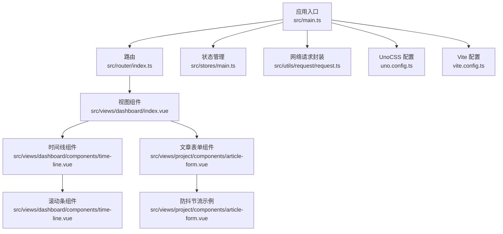
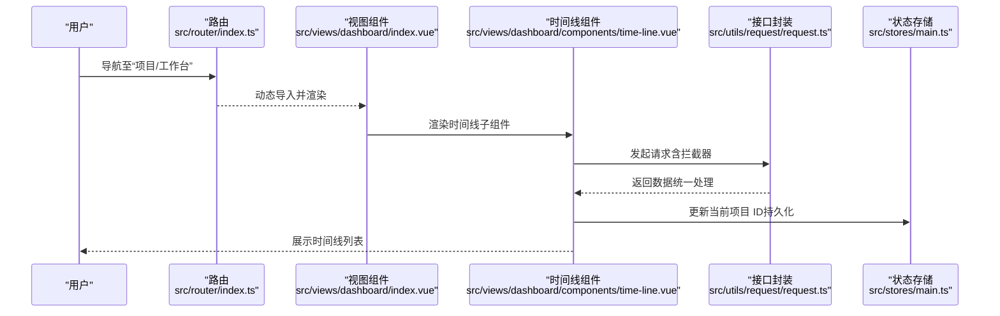
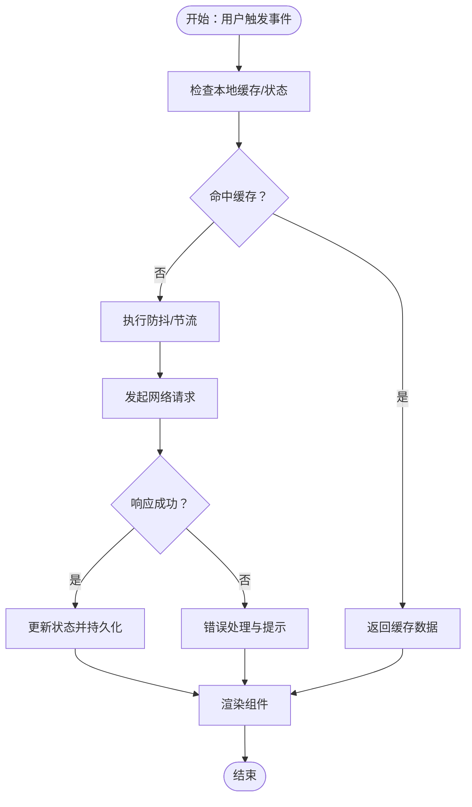
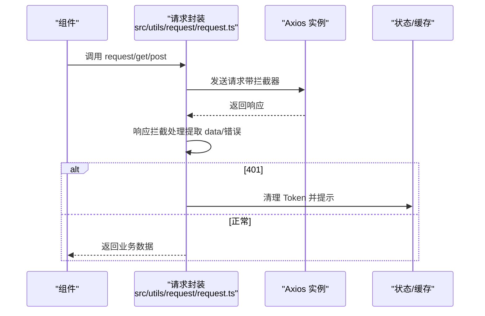
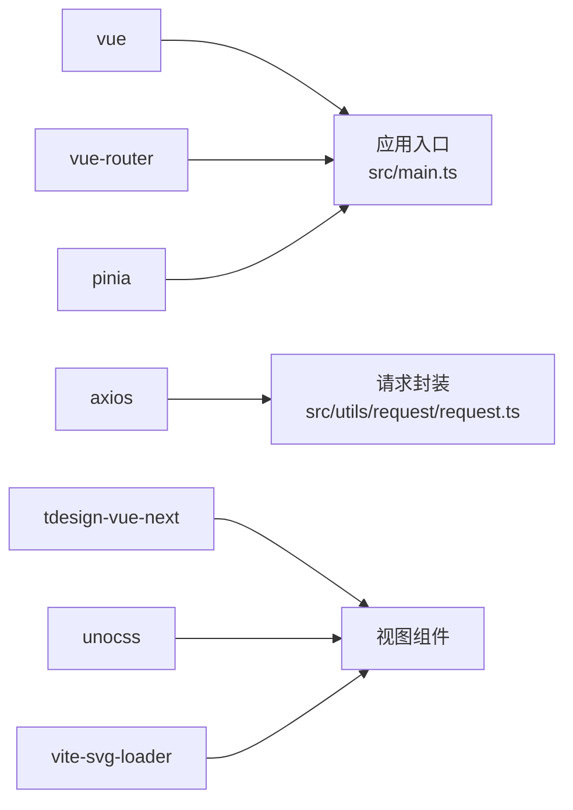

# 性能优化

<cite>
**本文引用的文件**
- [vite.config.ts](file://vite.config.ts)
- [package.json](file://package.json)
- [src/main.ts](file://src/main.ts)
- [src/router/index.ts](file://src/router/index.ts)
- [uno.config.ts](file://uno.config.ts)
- [src/stores/main.ts](file://src/stores/main.ts)
- [src/utils/request/request.ts](file://src/utils/request/request.ts)
- [src/hooks/useCustomMessage.ts](file://src/hooks/useCustomMessage.ts)
- [src/views/dashboard/index.vue](file://src/views/dashboard/index.vue)
- [src/views/dashboard/components/time-line.vue](file://src/views/dashboard/components/time-line.vue)
- [src/views/project/components/article-form.vue](file://src/views/project/components/article-form.vue)
- [src/views/project/components/file-list.vue](file://src/views/project/components/file-list.vue)
- [.lingma/rules/front-end.md](file://.lingma/rules/front-end.md)
</cite>

## 目录
1. [引言](#引言)
2. [项目结构](#项目结构)
3. [核心组件](#核心组件)
4. [架构总览](#架构总览)
5. [详细组件分析](#详细组件分析)
6. [依赖分析](#依赖分析)
7. [性能注意事项](#性能注意事项)
8. [故障排查指南](#故障排查指南)
9. [结论](#结论)
10. [附录](#附录)

## 引言
本指南面向 LiFocus Web V2 的性能优化，围绕 Vite 构建与 Tree Shaking、Vue 3 响应式与 Composition API、组件级优化（懒加载、虚拟滚动、防抖节流、缓存）、网络层优化（拦截器、错误处理、缓存策略）、内存与垃圾回收、性能监控与分析、移动端与 PWA、以及构建产物分析与优化展开。文档以仓库现有实现为依据，结合最佳实践给出可操作建议。

## 项目结构
- 构建与开发：基于 Vite 7，集成 Vue 3 插件、UnoCSS、SVG Loader、DevTools 等插件；通过环境变量控制代理与端口。
- 应用入口：在入口集中注册路由、Pinia、全局样式与第三方组件库样式。
- 路由：采用 Vue Router 4 的历史模式与动态导入，实现页面级懒加载。
- 状态：Pinia + 持久化插件，支持本地持久化。
- 网络：Axios 实例封装，统一拦截器处理鉴权与错误提示。
- 组件：大量使用 tdesign-vue-next 组件，配合自定义滚动条组件与 UnoCSS 工具类。

图表来源
- [src/main.ts](file://src/main.ts#L1-L28)
- [src/router/index.ts](file://src/router/index.ts#L1-L82)
- [src/stores/main.ts](file://src/stores/main.ts#L1-L21)
- [src/utils/request/request.ts](file://src/utils/request/request.ts#L1-L99)
- [src/views/dashboard/index.vue](file://src/views/dashboard/index.vue#L1-L26)
- [src/views/dashboard/components/time-line.vue](file://src/views/dashboard/components/time-line.vue#L1-L151)
- [src/views/project/components/article-form.vue](file://src/views/project/components/article-form.vue#L1-L214)
- [uno.config.ts](file://uno.config.ts#L1-L50)
- [vite.config.ts](file://vite.config.ts#L1-L31)

章节来源
- [vite.config.ts](file://vite.config.ts#L1-L31)
- [package.json](file://package.json#L1-L60)
- [src/main.ts](file://src/main.ts#L1-L28)
- [src/router/index.ts](file://src/router/index.ts#L1-L82)
- [uno.config.ts](file://uno.config.ts#L1-L50)

## 核心组件
- Vite 构建与插件
  - 插件组合：@vitejs/plugin-vue、@vitejs/plugin-vue-jsx、vite-plugin-vue-devtools、unocss/vite、vite-svg-loader。
  - 别名与开发服务器：@ 指向 src，端口 5173，/api 代理到后端服务。
- 应用入口与全局资源
  - 注册路由、Pinia（含持久化插件）、全局样式与第三方组件库样式。
- 路由懒加载
  - auth、dashboard、project 子路由均使用动态导入实现按需加载。
- 状态持久化
  - Pinia Store 支持 localStorage 持久化，提升用户体验。
- 网络层封装
  - Axios 实例化与拦截器：请求/响应统一处理；401 清理 Token 并跳转登录；错误统一提示。
- 组件与样式
  - UnoCSS 提供原子化样式与主题变量；自定义滚动条组件；组件内使用 tdesign-vue-next。

章节来源
- [vite.config.ts](file://vite.config.ts#L10-L31)
- [src/main.ts](file://src/main.ts#L1-L28)
- [src/router/index.ts](file://src/router/index.ts#L20-L72)
- [src/stores/main.ts](file://src/stores/main.ts#L16-L20)
- [src/utils/request/request.ts](file://src/utils/request/request.ts#L9-L51)

## 架构总览
下图展示从用户交互到网络请求与状态更新的关键路径，体现懒加载、拦截器与状态持久化的协同：

图表来源
- [src/router/index.ts](file://src/router/index.ts#L38-L72)
- [src/views/dashboard/index.vue](file://src/views/dashboard/index.vue#L1-L26)
- [src/views/dashboard/components/time-line.vue](file://src/views/dashboard/components/time-line.vue#L1-L151)
- [src/utils/request/request.ts](file://src/utils/request/request.ts#L9-L51)
- [src/stores/main.ts](file://src/stores/main.ts#L10-L19)

## 详细组件分析

### Vite 构建与 Tree Shaking
- 插件与别名
  - 使用 @vitejs/plugin-vue 与 @vitejs/plugin-vue-jsx，确保 Vue 3 与 JSX 场景下的按需编译与 Tree Shaking。
  - vite-svg-loader 将 SVG 作为组件引入，有利于按需加载与体积控制。
  - UnoCSS 在构建期扫描，仅输出实际使用的原子类，减少运行时样式体积。
- 开发服务器与代理
  - 本地代理 /api 到后端，便于联调与跨域处理。
- 优化建议
  - 结合官方文档启用构建产物分析与可视化，识别大模块与重复依赖。
  - 对非首屏组件继续采用动态导入，保持路由级与组件级懒加载策略一致。
  - 避免在入口集中引入大型库，尽量延迟到按需使用处。

章节来源
- [vite.config.ts](file://vite.config.ts#L10-L31)
- [uno.config.ts](file://uno.config.ts#L1-L50)
- [package.json](file://package.json#L18-L39)

### Vue 3 响应式与 Composition API
- 响应式系统
  - 使用 ref、computed、watch/watchEffect 管理状态与派生状态，降低不必要的重渲染。
- 组合式 API 优势
  - 将逻辑按功能聚合，提升复用性与可维护性；与 VueUse 结合可获得更高效的工具函数。
- 优化建议
  - 避免在模板中直接调用重型计算；将复杂计算放入 computed 或缓存结果。
  - 使用 shallowRef/triggerRef 控制细粒度更新场景。

章节来源
- [src/views/project/components/article-form.vue](file://src/views/project/components/article-form.vue#L60-L77)
- [src/views/dashboard/components/time-line.vue](file://src/views/dashboard/components/time-line.vue#L67-L89)
- [.lingma/rules/front-end.md](file://.lingma/rules/front-end.md#L31-L40)

### 组件级性能优化
- 懒加载与动态导入
  - 路由与视图组件广泛使用动态导入，减少初始包体与首屏阻塞。
- 虚拟滚动
  - 使用自定义滚动条组件包裹长列表，结合虚拟化方案（如 vue-virtual-scroller）进一步优化超大数据集渲染。
- 防抖与节流
  - 文章详情获取使用 _.debounce，避免频繁请求；可扩展到输入搜索、窗口 resize 等高频事件。
- 缓存机制
  - Pinia 持久化存储当前项目 ID，减少重复读取与初始化成本。
- 图标与样式
  - SVG 作为组件引入，利于 Tree Shaking；UnoCSS 原子类减少重复样式。

图表来源
- [src/views/project/components/article-form.vue](file://src/views/project/components/article-form.vue#L60-L77)
- [src/stores/main.ts](file://src/stores/main.ts#L16-L20)
- [src/utils/request/request.ts](file://src/utils/request/request.ts#L31-L39)

章节来源
- [src/router/index.ts](file://src/router/index.ts#L20-L72)
- [src/views/project/components/article-form.vue](file://src/views/project/components/article-form.vue#L60-L77)
- [src/stores/main.ts](file://src/stores/main.ts#L10-L19)

### 网络请求优化
- 统一拦截器
  - 请求拦截：可注入通用头信息或参数。
  - 响应拦截：统一提取 data、处理 401 登录态异常、错误提示与拒绝。
- 错误处理
  - 明确区分业务错误与系统错误，避免重复提示与死循环。
- 缓存策略
  - 对只读列表与详情数据，结合本地缓存与防抖，减少无效请求。
- CDN 与静态资源
  - 对第三方静态资源（如图标、字体）优先使用 CDN，缩短首屏加载时间。

图表来源
- [src/utils/request/request.ts](file://src/utils/request/request.ts#L17-L51)
- [src/utils/request/request.ts](file://src/utils/request/request.ts#L26-L40)

章节来源
- [src/utils/request/request.ts](file://src/utils/request/request.ts#L9-L99)

### 内存管理与垃圾回收
- 组件卸载与清理
  - 使用 onUnmounted 清理定时器、订阅与 DOM 事件监听。
- 消息与弹窗
  - 自定义消息组件在销毁时移除容器节点，避免内存泄漏。
- 大对象与长列表
  - 使用虚拟滚动与分页，避免一次性渲染过多节点。
- 建议
  - 使用浏览器性能面板与内存快照定位泄漏点；避免闭包持有大对象。

章节来源
- [src/hooks/useCustomMessage.ts](file://src/hooks/useCustomMessage.ts#L37-L50)

### 性能监控与分析
- 构建分析
  - 使用 Vite 插件或 Rollup 插件生成包体分析报告，识别大模块与重复依赖。
- 运行时监控
  - 使用浏览器开发者工具的 Performance/Network/Elements 面板进行交互、网络与 DOM 分析。
- Web Vitals
  - 关注 LCP、CLS、FID 指标，结合自动化测试工具持续跟踪。

章节来源
- [.lingma/rules/front-end.md](file://.lingma/rules/front-end.md#L39-L40)

### 移动端性能优化与 PWA
- 移动端优化
  - 使用 UnoCSS 原子类减少样式体积；对图片使用现代格式与懒加载；减少主线程阻塞。
- PWA
  - 可通过 Workbox 生成 Service Worker，实现离线缓存与资源预缓存；在构建阶段集成 PWA 元信息与清单文件。

章节来源
- [.lingma/rules/front-end.md](file://.lingma/rules/front-end.md#L35-L36)

### 构建产物分析与优化
- 产物分析
  - 通过构建日志与可视化工具查看各模块占比，识别冗余与重复依赖。
- 优化方向
  - 代码分割：保持路由与组件级动态导入；拆分第三方库为独立 chunk。
  - Tree Shaking：确保 ESM 导入与未使用代码被正确摇树；避免副作用模块。
  - 资源压缩：启用最小化与压缩；对静态资源使用 CDN 与缓存策略。

章节来源
- [vite.config.ts](file://vite.config.ts#L10-L31)
- [package.json](file://package.json#L18-L39)

## 依赖分析
- 核心依赖
  - Vue 3、Vue Router、Pinia、Axios、tdesign-vue-next、UnoCSS、vite-svg-loader。
- 开发依赖
  - Vite、ESLint、Prettier、TypeScript、Vue DevTools 插件等。
- 依赖关系
  - 应用入口依赖路由与状态；路由依赖视图组件；视图组件依赖网络封装与 UI 组件库；UI 组件库依赖样式与动画库。

图表来源
- [package.json](file://package.json#L18-L39)
- [src/main.ts](file://src/main.ts#L1-L28)
- [src/utils/request/request.ts](file://src/utils/request/request.ts#L1-L99)

章节来源
- [package.json](file://package.json#L18-L39)

## 性能注意事项
- 首屏与交互
  - 保持路由与组件级懒加载；避免在入口集中引入重型模块。
- 数据与渲染
  - 使用 computed 与缓存；对长列表使用虚拟滚动与分页；对高频事件使用防抖/节流。
- 网络与缓存
  - 统一拦截器处理鉴权与错误；对只读数据做本地缓存；合理设置缓存头。
- 样式与资源
  - 使用 UnoCSS 原子类与 SVG 组件；对图片与字体使用 CDN 与懒加载。
- 监控与回归
  - 持续关注 Web Vitals；定期进行构建产物分析与依赖优化。

## 故障排查指南
- 登录态异常
  - 若出现 401，确认拦截器是否正确清理 Token 并跳转登录。
- 请求失败
  - 检查响应拦截器是否正确提取 data，并在错误分支返回 Promise.reject。
- 组件渲染卡顿
  - 检查是否存在重型计算或未使用 computed；确认是否使用了虚拟滚动与分页。
- 内存泄漏
  - 确认自定义消息组件在销毁时移除了容器节点；组件卸载时清理定时器与事件监听。

章节来源
- [src/utils/request/request.ts](file://src/utils/request/request.ts#L31-L39)
- [src/hooks/useCustomMessage.ts](file://src/hooks/useCustomMessage.ts#L37-L50)

## 结论
通过在 Vite 中启用合适的插件与别名、在 Vue 3 中充分利用 Composition API 与响应式系统、在组件层面实施懒加载、虚拟滚动、防抖节流与缓存、在网络层统一拦截器与错误处理、在移动端与 PWA 方向上优化资源与离线能力，并结合构建产物分析与性能监控，可显著提升 LiFocus Web V2 的加载速度、交互流畅度与长期稳定性。

## 附录
- 术语
  - Tree Shaking：基于 ES Module 的静态分析，移除未使用代码。
  - 虚拟滚动：仅渲染可视区域节点，提升长列表性能。
  - 防抖/节流：限制高频事件触发频率，降低请求与渲染压力。
- 参考
  - Vite 官方文档与插件生态
  - Vue 3 Composition API 与响应式系统
  - UnoCSS 原子化样式与主题变量
  - tdesign-vue-next 组件库与样式体系