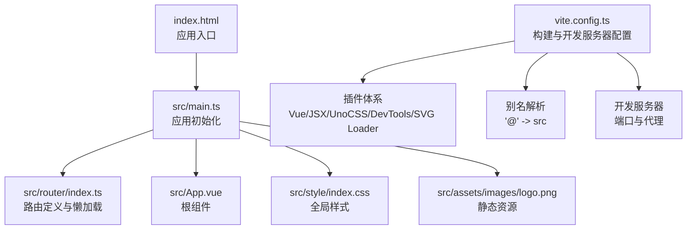
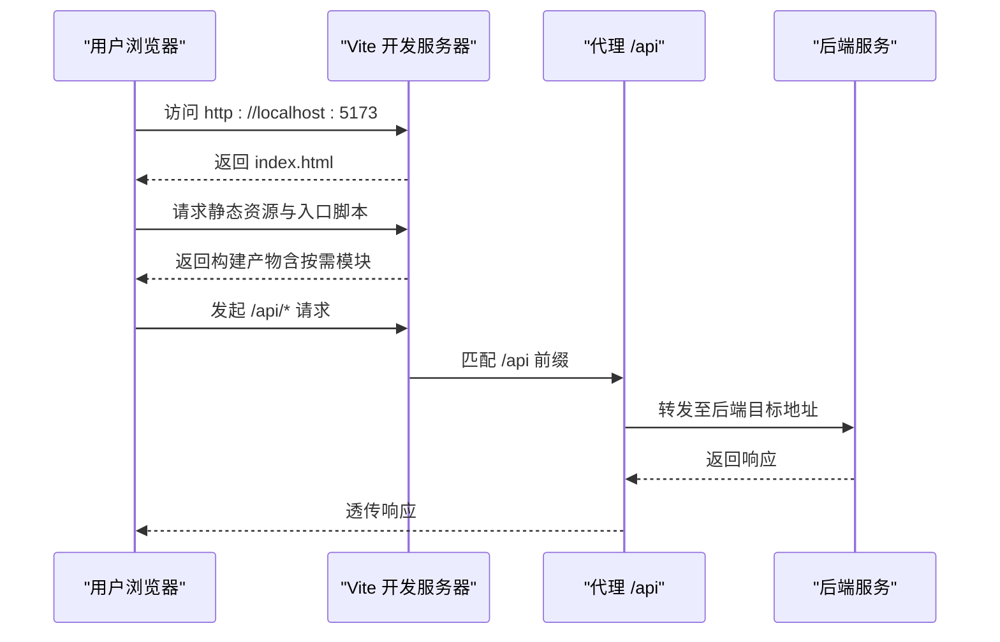
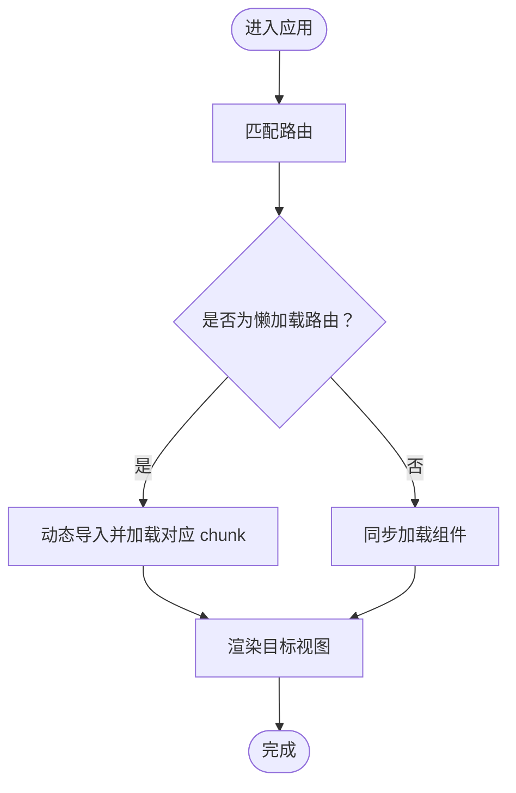
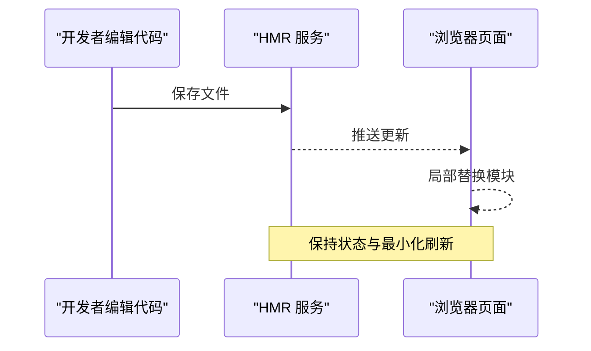
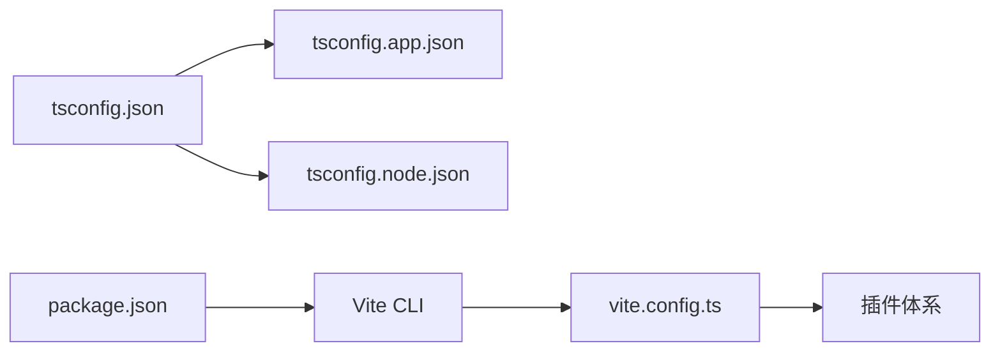

# 构建优化

<cite>
**本文引用的文件**
- [vite.config.ts](file://vite.config.ts)
- [package.json](file://package.json)
- [tsconfig.json](file://tsconfig.json)
- [tsconfig.app.json](file://tsconfig.app.json)
- [tsconfig.node.json](file://tsconfig.node.json)
- [uno.config.ts](file://uno.config.ts)
- [eslint.config.ts](file://eslint.config.ts)
- [src/router/index.ts](file://src/router/index.ts)
- [src/main.ts](file://src/main.ts)
- [index.html](file://index.html)
</cite>

## 目录
1. [简介](#简介)
2. [项目结构](#项目结构)
3. [核心组件](#核心组件)
4. [架构总览](#架构总览)
5. [详细组件分析](#详细组件分析)
6. [依赖分析](#依赖分析)
7. [性能考量](#性能考量)
8. [故障排查指南](#故障排查指南)
9. [结论](#结论)
10. [附录](#附录)

## 简介
本指南围绕该 Vite + Vue 3 项目，系统讲解构建优化策略与实践，重点覆盖以下方面：
- 代码分割与动态导入：基于路由的懒加载实现与最佳实践
- Tree Shaking 原理与在 TypeScript 项目中的落地
- 打包器优化：压缩、资源内联、输出命名策略
- 开发服务器性能：热重载、代理配置与网络优化
- 插件系统对性能的影响与优化建议
- 构建产物分析与性能指标解读

## 项目结构
该项目采用标准的 Vite + Vue 3 单页应用结构，前端入口为 src/main.ts，路由定义在 src/router/index.ts，开发与生产脚本由 package.json 提供，构建配置集中在 vite.config.ts。

图表来源
- [index.html](file://index.html#L1-L13)
- [src/main.ts](file://src/main.ts#L1-L28)
- [src/router/index.ts](file://src/router/index.ts#L1-L82)
- [vite.config.ts](file://vite.config.ts#L1-L31)

章节来源
- [index.html](file://index.html#L1-L13)
- [src/main.ts](file://src/main.ts#L1-L28)
- [vite.config.ts](file://vite.config.ts#L1-L31)

## 核心组件
- 构建配置与插件体系
  - 插件清单：Vue、Vue JSX、UnoCSS、Vue DevTools、SVG Loader
  - 路径别名：@ 指向 src，提升导入可读性
  - 开发服务器：端口、代理到后端服务
- 路由与代码分割
  - 使用动态导入实现按需加载，减少首屏体积
- 类型系统与编译配置
  - tsconfig.json 组织 tsconfig.app.json 与 tsconfig.node.json
  - app 配置启用路径映射，node 配置面向构建器模块解析

章节来源
- [vite.config.ts](file://vite.config.ts#L1-L31)
- [tsconfig.json](file://tsconfig.json#L1-L12)
- [tsconfig.app.json](file://tsconfig.app.json#L1-L13)
- [tsconfig.node.json](file://tsconfig.node.json#L1-L20)
- [src/router/index.ts](file://src/router/index.ts#L1-L82)

## 架构总览
下图展示从浏览器请求到页面渲染的关键链路，以及开发服务器与代理如何参与请求转发。

图表来源
- [vite.config.ts](file://vite.config.ts#L19-L30)
- [index.html](file://index.html#L1-L13)

## 详细组件分析

### 代码分割与路由懒加载
- 实现方式
  - 路由级懒加载通过动态导入函数实现，仅在访问对应路由时加载对应视图组件
  - 典型场景：登录页、仪表盘、项目相关页面均采用动态导入
- 优势
  - 显著降低首屏 JS 体积，改善 TTI/FCP
  - 将非关键路径拆分为独立 chunk，提升缓存命中率
- 最佳实践
  - 对高频访问但体量较大的页面优先考虑懒加载
  - 结合 Suspense 为异步组件提供加载态占位
  - 控制 chunk 数量与大小，避免碎片化过多导致并发开销

图表来源
- [src/router/index.ts](file://src/router/index.ts#L20-L71)

章节来源
- [src/router/index.ts](file://src/router/index.ts#L1-L82)

### Tree Shaking 原理与在 TypeScript 中的应用
- 原理
  - 基于 ES 模块静态导入/导出语法进行静态分析，移除未引用的代码
  - 需要确保模块以 ESM 形式导出，并避免副作用
- 在本项目中的落地
  - 使用 ES 模块风格导出，避免默认导出与命名导出混用造成副作用
  - 类型声明文件（.d.ts）不参与运行时，有助于缩小打包范围
  - 编译配置中开启严格模式与路径映射，便于摇树分析
- 关键点
  - 第三方库需提供 ESM 分发版本
  - 避免在模块顶层执行有副作用的逻辑
  - 使用只导出函数/常量的模块，减少副作用标记

章节来源
- [tsconfig.app.json](file://tsconfig.app.json#L1-L13)
- [tsconfig.node.json](file://tsconfig.node.json#L1-L20)

### 打包器优化配置
- 压缩与资源处理
  - 生产构建默认启用压缩；如需更细粒度控制，可在构建配置中扩展压缩器参数
  - 图标等 SVG 可通过 SVG Loader 内联为组件或字符串，减少请求数
- 资源内联与缓存
  - 小型静态资源内联可降低请求数，但会增加主包体积；应权衡取舍
  - 大型资源建议外链并配合长效缓存策略
- 输出命名策略
  - 使用哈希命名可最大化缓存复用；同时保留稳定的入口文件名以便引用
  - 对第三方库与业务代码分包，避免业务变更影响 vendor 缓存

章节来源
- [vite.config.ts](file://vite.config.ts#L1-L31)
- [package.json](file://package.json#L1-L60)

### 开发服务器性能优化
- 热重载机制
  - 利用 Vite 的原生 HMR，仅替换变更模块，减少整页刷新
  - 对大型组件树建议拆分模块，缩短 HMR 更新路径
- 代理配置
  - 将 /api 前缀代理至后端服务，避免跨域问题
  - 合理设置 rewrite 规则，确保路径正确透传
- 端口与网络
  - 固定端口便于本地联调与代理配置
  - 如需多端口并行，注意端口冲突与资源隔离

图表来源
- [vite.config.ts](file://vite.config.ts#L19-L30)

章节来源
- [vite.config.ts](file://vite.config.ts#L1-L31)

### 插件系统的性能影响与优化建议
- 插件清单与职责
  - Vue/JSX：提供模板与 JSX 编译能力
  - UnoCSS：原子化样式生成，按需输出
  - Vue DevTools：开发调试增强
  - SVG Loader：SVG 资源处理与内联
- 性能建议
  - 仅启用必要插件，避免重复功能
  - 将耗时任务（如类型检查）移出开发流程或并行执行
  - 对 UnoCSS 的扫描范围进行限制，避免遍历无关目录

章节来源
- [vite.config.ts](file://vite.config.ts#L1-L31)
- [uno.config.ts](file://uno.config.ts#L1-L50)

### 构建产物分析与性能指标解读
- 分析工具
  - 使用构建后产物目录 dist 进行体积分析（例如可视化工具）
  - 关注入口、vendor、业务代码三大块占比
- 关键指标
  - 首屏 JS 体积（LCP 相关）
  - 并发请求数（影响 FCP/TTI）
  - 缓存命中率（长期体验）
- 指标解读与优化方向
  - 若 vendor 过大：检查第三方库是否支持 ESM、是否被正确拆分
  - 若入口过大：检查是否引入了不必要的 polyfill 或全局样式
  - 若 chunk 过多：合并小 chunk，减少并发与管理成本

章节来源
- [package.json](file://package.json#L1-L60)

## 依赖分析
- 类型与编译
  - tsconfig.json 作为引用入口，组织 app 与 node 两套配置
  - app 配置启用路径映射，node 配置面向构建器模块解析
- 开发与构建
  - package.json 定义 dev/build/preview 脚本，结合 Vite CLI
  - ESLint 配置集中于 eslint.config.ts，统一规则与忽略项

图表来源
- [tsconfig.json](file://tsconfig.json#L1-L12)
- [tsconfig.app.json](file://tsconfig.app.json#L1-L13)
- [tsconfig.node.json](file://tsconfig.node.json#L1-L20)
- [package.json](file://package.json#L1-L60)
- [vite.config.ts](file://vite.config.ts#L1-L31)

章节来源
- [tsconfig.json](file://tsconfig.json#L1-L12)
- [tsconfig.app.json](file://tsconfig.app.json#L1-L13)
- [tsconfig.node.json](file://tsconfig.node.json#L1-L20)
- [package.json](file://package.json#L1-L60)
- [vite.config.ts](file://vite.config.ts#L1-L31)

## 性能考量
- 代码分割
  - 路由级懒加载已具备基础能力，建议进一步细化到页面内的子路由或重型组件
- Tree Shaking
  - 确保第三方库提供 ESM 分发；对仅使用部分功能的库，尽量按需引入
- 资源与缓存
  - 对字体、图标等静态资源进行内联或 CDN 分发，平衡请求数与缓存效果
- 开发体验
  - 合理配置 HMR 与代理，减少网络往返与跨域问题
- 工具链
  - ESLint 与 Prettier 保证代码质量，间接提升构建稳定性

## 故障排查指南
- 路由懒加载失败
  - 确认动态导入语法正确且路径指向有效组件
  - 检查路由表是否正确挂载到 Router 实例
- 开发服务器无法访问
  - 核对端口占用与防火墙设置
  - 检查代理规则是否正确匹配 /api 前缀
- UnoCSS 样式未生效
  - 确认虚拟模块引入与扫描范围配置
  - 检查主题与快捷方式定义是否合理
- 类型检查阻塞构建
  - 使用并行脚本或分阶段执行，避免串行等待

章节来源
- [src/router/index.ts](file://src/router/index.ts#L1-L82)
- [vite.config.ts](file://vite.config.ts#L1-L31)
- [uno.config.ts](file://uno.config.ts#L1-L50)
- [eslint.config.ts](file://eslint.config.ts#L1-L23)

## 结论
本项目已具备良好的构建优化基础：路由懒加载、插件化构建、类型系统与开发服务器代理。建议在现有基础上进一步完善：
- 细化代码分割策略，结合业务访问路径优化 chunk
- 强化 Tree Shaking 落地，确保第三方库与模块导出符合 ESM
- 引入构建产物分析工具，持续监控关键指标并迭代优化
- 在开发阶段通过合理的 HMR 与代理配置提升联调效率

## 附录
- 快速参考
  - 开发：npm run dev
  - 构建：npm run build
  - 预览：npm run preview
- 相关配置位置
  - 构建与开发服务器：vite.config.ts
  - 类型系统：tsconfig.json、tsconfig.app.json、tsconfig.node.json
  - UnoCSS：uno.config.ts
  - ESLint：eslint.config.ts
  - 路由懒加载：src/router/index.ts
  - 应用入口：src/main.ts、index.html