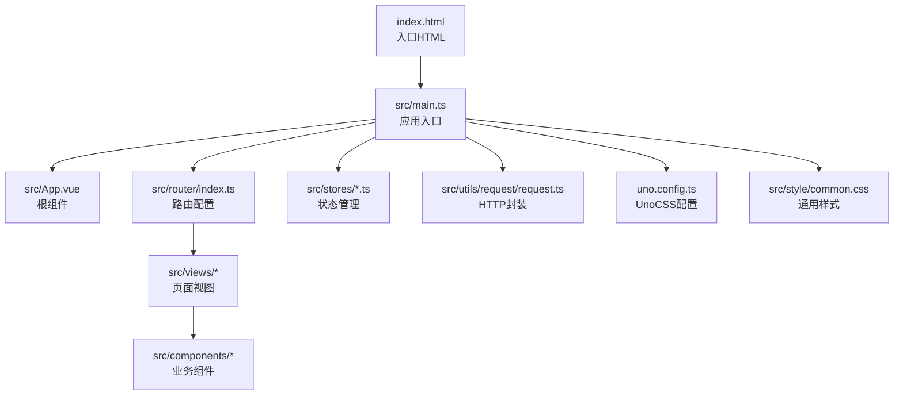
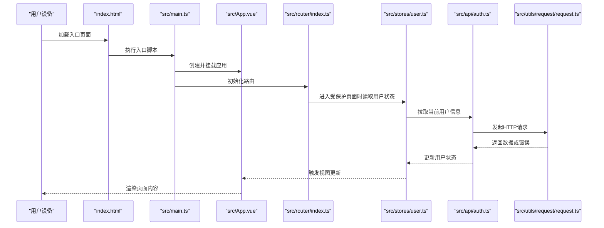
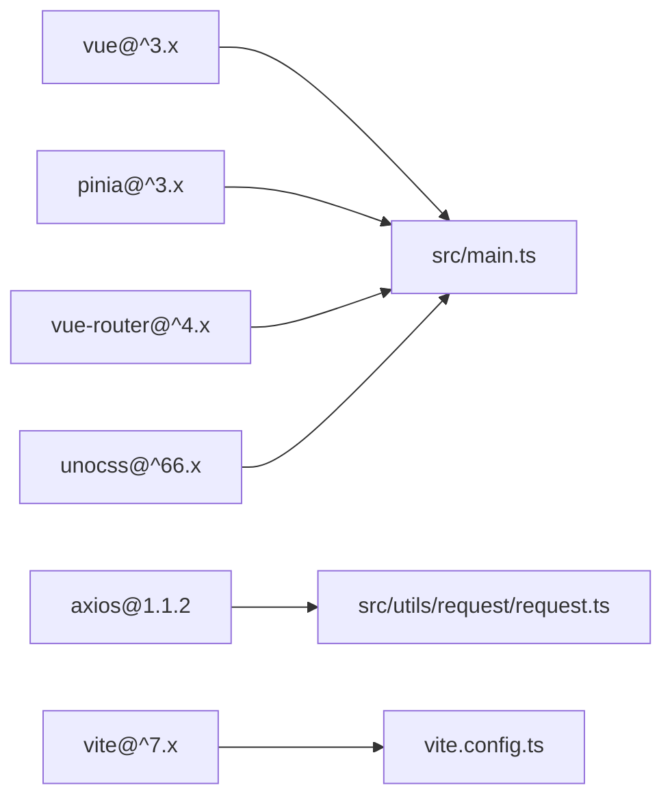

# 移动端优化

<cite>
**本文引用的文件**
- [package.json](file://package.json)
- [vite.config.ts](file://vite.config.ts)
- [index.html](file://index.html)
- [src/main.ts](file://src/main.ts)
- [src/App.vue](file://src/App.vue)
- [uno.config.ts](file://uno.config.ts)
- [src/style/common.css](file://src/style/common.css)
- [src/utils/request/request.ts](file://src/utils/request/request.ts)
- [src/utils/auth.ts](file://src/utils/auth.ts)
- [src/hooks/useCustomMessage.ts](file://src/hooks/useCustomMessage.ts)
- [src/api/auth.ts](file://src/api/auth.ts)
- [src/stores/user.ts](file://src/stores/user.ts)
- [src/router/index.ts](file://src/router/index.ts)
</cite>

## 目录
1. [引言](#引言)
2. [项目结构](#项目结构)
3. [核心组件](#核心组件)
4. [架构总览](#架构总览)
5. [详细组件分析](#详细组件分析)
6. [依赖分析](#依赖分析)
7. [性能注意事项](#性能注意事项)
8. [故障排查指南](#故障排查指南)
9. [结论](#结论)
10. [附录](#附录)

## 引言
本指南聚焦移动端性能优化专项，结合当前仓库中的前端技术栈与工程化配置，系统阐述以下主题：移动端性能特点与优化策略、触摸事件优化与响应延迟降低、内存与CPU受限场景下的优化、PWA特性与离线能力、图片与媒体资源优化、移动端网络环境特殊性与应对策略，以及移动端性能测试与监控方法。文档在每个涉及具体实现的章节均给出“章节来源”，并在涉及真实代码结构的图示中给出“图表来源”。

## 项目结构
该仓库为基于 Vue 3 + Vite 的单页应用，采用 Pinia 状态管理与 Vue Router 路由体系，并通过 UnoCSS 提供原子化样式与主题色配置。构建与开发服务器配置位于 Vite 配置文件中；入口文件负责挂载应用、注册插件与全局样式；路由按模块划分，包含认证与项目相关页面。

图表来源
- [index.html](file://index.html#L1-L14)
- [src/main.ts](file://src/main.ts#L1-L28)
- [src/App.vue](file://src/App.vue#L1-L12)
- [src/router/index.ts](file://src/router/index.ts#L1-L82)
- [uno.config.ts](file://uno.config.ts#L1-L50)
- [src/style/common.css](file://src/style/common.css#L1-L13)

章节来源
- [index.html](file://index.html#L1-L14)
- [src/main.ts](file://src/main.ts#L1-L28)
- [src/router/index.ts](file://src/router/index.ts#L1-L82)

## 核心组件
- 应用入口与全局注册
  - 在入口文件中完成 Pinia、Vue Router、全局样式与第三方组件的注册，确保应用启动时一次性加载必要资源，减少后续渲染抖动。
- 请求封装与拦截器
  - 基于 Axios 的请求类统一处理请求与响应拦截，集中处理鉴权失败跳转与错误提示，便于在移动端网络不稳定场景下快速反馈问题。
- 状态持久化
  - 使用 Pinia 插件持久化用户状态，避免频繁拉取用户信息导致的网络与渲染开销。
- 视图与布局
  - 根组件使用全屏容器包裹 RouterView，配合 UnoCSS 与通用样式，保证移动端布局一致性与可维护性。

章节来源
- [src/main.ts](file://src/main.ts#L1-L28)
- [src/utils/request/request.ts](file://src/utils/request/request.ts#L1-L99)
- [src/stores/user.ts](file://src/stores/user.ts#L1-L29)
- [src/App.vue](file://src/App.vue#L1-L12)
- [uno.config.ts](file://uno.config.ts#L1-L50)
- [src/style/common.css](file://src/style/common.css#L1-L13)

## 架构总览
移动端优化需要从“构建产物体积、运行时渲染、网络请求、交互响应、资源加载”五个维度协同优化。下图展示从入口到页面渲染的关键路径与优化切入点：

图表来源
- [index.html](file://index.html#L1-L14)
- [src/main.ts](file://src/main.ts#L1-L28)
- [src/App.vue](file://src/App.vue#L1-L12)
- [src/router/index.ts](file://src/router/index.ts#L1-L82)
- [src/stores/user.ts](file://src/stores/user.ts#L1-L29)
- [src/api/auth.ts](file://src/api/auth.ts#L1-L41)
- [src/utils/request/request.ts](file://src/utils/request/request.ts#L1-L99)

## 详细组件分析

### 触摸事件优化与响应延迟降低
- 事件节流与防抖
  - 在移动端，频繁触发的滚动、输入、点击等事件应进行节流/防抖处理，以降低主线程压力与重绘频率。
- 虚拟滚动与分页
  - 对长列表采用虚拟滚动或分页加载，避免一次性渲染大量节点导致的卡顿。
- 轻量级提示组件
  - 使用轻量的消息提示组件，避免频繁创建/销毁 DOM，减少布局抖动与 GC 压力。
- 交互反馈
  - 通过 CSS 动画与过渡替代重型 JS 动画，提升移动端流畅度。

章节来源
- [src/hooks/useCustomMessage.ts](file://src/hooks/useCustomMessage.ts#L1-L73)

### 内存与CPU限制下的性能优化
- 组件懒加载与按需渲染
  - 路由级组件采用动态导入，减少首屏包体与初始化成本。
- 状态最小化与持久化
  - 将用户状态持久化至本地存储，避免重复请求与计算。
- 图标与媒体资源
  - 使用 SVG 组件化引入，减少额外请求；图片采用响应式尺寸与格式优化。
- 样式与主题
  - 使用 UnoCSS 原子化类名，减少自定义样式的体积与复杂度。

章节来源
- [src/router/index.ts](file://src/router/index.ts#L1-L82)
- [src/stores/user.ts](file://src/stores/user.ts#L1-L29)
- [uno.config.ts](file://uno.config.ts#L1-L50)
- [vite.config.ts](file://vite.config.ts#L1-L31)

### PWA 特性与离线能力
- Manifest 与 Service Worker
  - 当前仓库未包含 PWA 相关配置与 Service Worker 文件。建议新增 manifest 与基础 SW，实现缓存策略与离线回退。
- 缓存策略
  - 对静态资源与 API 数据设置合理的缓存策略，优先使用 Stale-While-Revalidate 或 Cache First。
- 离线提示
  - 在网络不可用时提供清晰的离线提示与引导，避免无响应造成的体验劣化。

（本节为概念性指导，不直接分析具体文件）

### 图片与媒体资源优化
- 资源格式与尺寸
  - 优先使用现代格式（如 WebP）与合适的尺寸，避免在移动端传输过大的位图。
- 懒加载与占位符
  - 图片懒加载与骨架屏占位，改善感知性能。
- SVG 图标
  - 通过 SVG Loader 将图标作为组件引入，减少 HTTP 请求与体积。

章节来源
- [vite.config.ts](file://vite.config.ts#L1-L31)

### 移动端网络环境特殊性与应对策略
- 请求拦截与错误处理
  - 在统一请求封装中处理 401、网络异常与超时，提供明确的错误提示与重试机制。
- Token 管理
  - 使用 Cookie/SessionStorage 管理令牌，避免跨域与安全风险。
- 路由守卫与权限
  - 结合路由与状态管理，在进入受保护页面前校验用户状态，减少无效请求。

章节来源
- [src/utils/request/request.ts](file://src/utils/request/request.ts#L1-L99)
- [src/utils/auth.ts](file://src/utils/auth.ts#L1-L71)
- [src/stores/user.ts](file://src/stores/user.ts#L1-L29)
- [src/router/index.ts](file://src/router/index.ts#L1-L82)

### 性能测试与监控
- 构建产物分析
  - 使用 Vite 构建后分析包体构成，识别大体积依赖与重复模块。
- Lighthouse 与 Web Vitals
  - 在移动端浏览器运行 Lighthouse，关注 CLS、FID、INP、LCP 等指标。
- 前端埋点与上报
  - 对关键交互与页面加载时间进行埋点，结合后端日志进行聚合分析。

（本节为通用实践指导，不直接分析具体文件）

## 依赖分析
- 技术栈与版本
  - Vue 3、Pinia、Vue Router、Axios、UnoCSS、Vite 等。这些依赖在入口与配置中被集中使用，形成稳定的运行时与构建时生态。
- 第三方组件库
  - tdesign-vue-next 与 animate.css、simplebar-vue 等组件与动画库在入口中统一引入，需关注其体积与按需加载策略。

图表来源
- [package.json](file://package.json#L18-L39)
- [src/main.ts](file://src/main.ts#L1-L28)
- [src/utils/request/request.ts](file://src/utils/request/request.ts#L1-L99)
- [vite.config.ts](file://vite.config.ts#L1-L31)

章节来源
- [package.json](file://package.json#L1-L60)
- [src/main.ts](file://src/main.ts#L1-L28)

## 性能注意事项
- 首屏与交互
  - 通过路由懒加载与组件按需渲染缩短首屏时间；在交互层采用轻量提示与过渡动画，避免重型 JS 动画。
- 网络与缓存
  - 在请求封装中统一处理错误与鉴权失效，结合状态持久化减少重复请求。
- 样式与主题
  - 使用 UnoCSS 原子化类名与主题变量，减少自定义样式的体积与复杂度。
- 资源与体积
  - 通过 SVG 组件化与现代图片格式优化资源体积；在构建阶段进行依赖分析与去重。

（本节为通用指导，不直接分析具体文件）

## 故障排查指南
- 登录态异常
  - 当响应拦截器捕获到 401 时会清除本地令牌并跳转登录页。若出现反复跳转，检查令牌设置逻辑与 Cookie/Storage 的可用性。
- 错误提示与销毁
  - 自定义消息组件支持自动销毁与手动关闭，若出现消息残留，检查销毁回调与容器移除逻辑。
- 路由与状态
  - 受保护页面进入前应先拉取用户信息并持久化，若出现白屏或无限加载，检查路由守卫与状态更新流程。

章节来源
- [src/utils/request/request.ts](file://src/utils/request/request.ts#L1-L99)
- [src/hooks/useCustomMessage.ts](file://src/hooks/useCustomMessage.ts#L1-L73)
- [src/stores/user.ts](file://src/stores/user.ts#L1-L29)

## 结论
本指南围绕移动端性能优化的关键环节，结合当前仓库的技术栈与工程化配置，提出了从构建、运行时、网络、交互到资源层面的系统性优化策略。建议在现有基础上逐步引入 PWA、离线缓存与更精细的性能监控方案，持续迭代以获得更佳的移动端用户体验。

## 附录
- 入口与配置要点
  - 入口文件集中注册插件与样式，确保应用启动时的稳定性与一致性。
  - Vite 配置启用 Vue、JSX、UnoCSS 与 SVG Loader 插件，满足移动端开发与构建需求。
  - 视口配置已在入口 HTML 中设置，确保移动端缩放与显示一致。

章节来源
- [index.html](file://index.html#L1-L14)
- [vite.config.ts](file://vite.config.ts#L1-L31)
- [src/main.ts](file://src/main.ts#L1-L28)