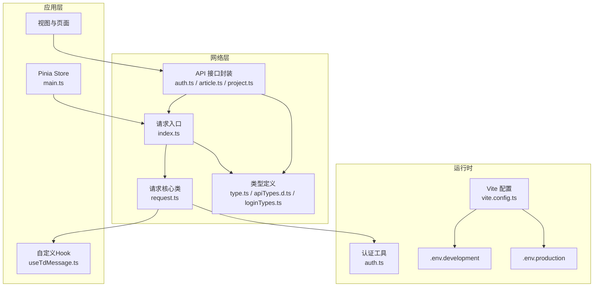
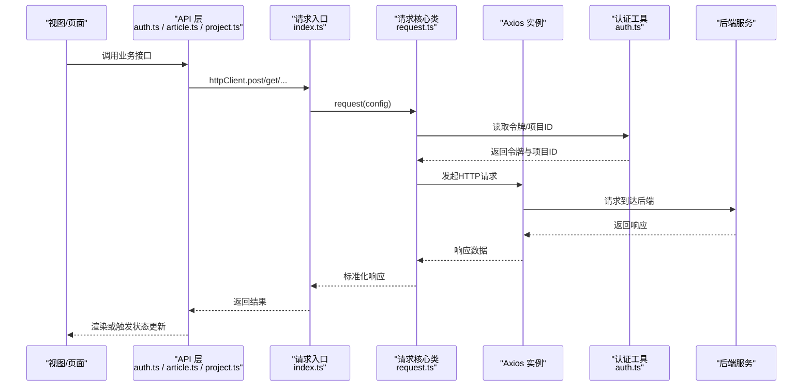
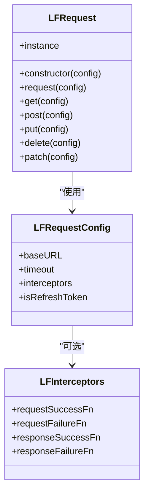
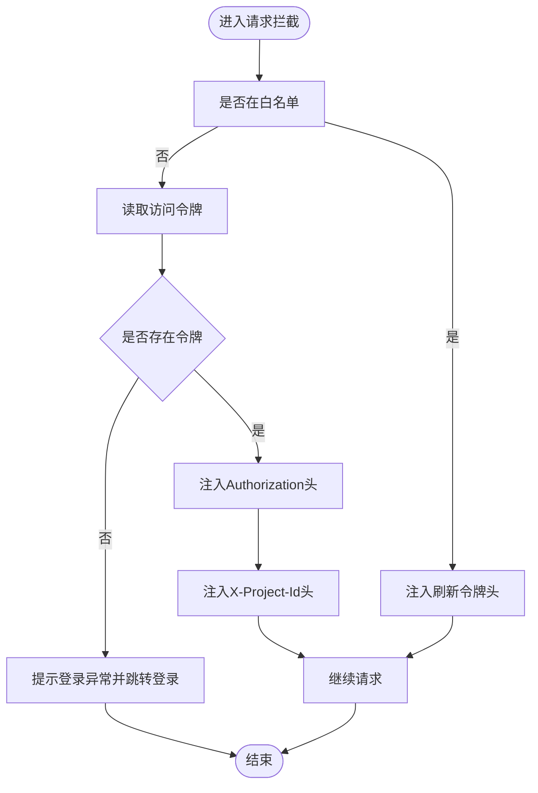
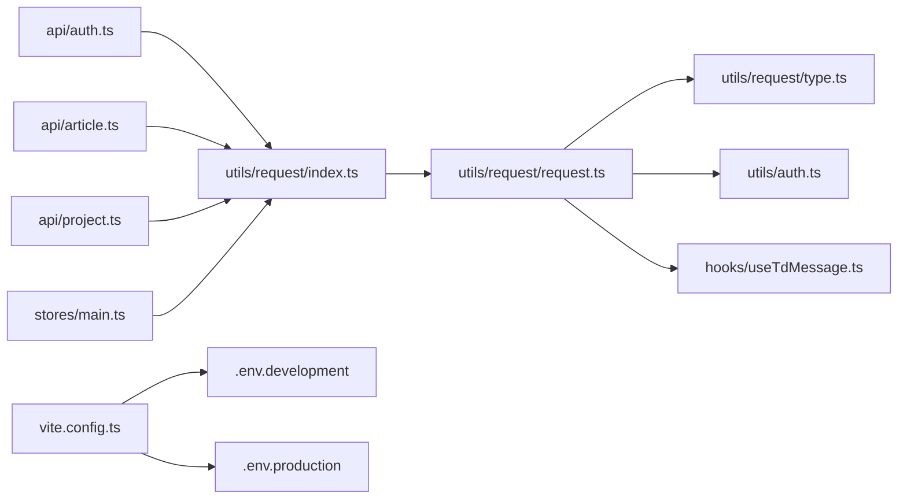

# 网络优化

<cite>
**本文引用的文件**
- [src/utils/request/index.ts](file://src/utils/request/index.ts)
- [src/utils/request/request.ts](file://src/utils/request/request.ts)
- [src/utils/request/type.ts](file://src/utils/request/type.ts)
- [src/utils/auth.ts](file://src/utils/auth.ts)
- [src/stores/main.ts](file://src/stores/main.ts)
- [src/hooks/useTdMessage.ts](file://src/hooks/useTdMessage.ts)
- [src/api/auth.ts](file://src/api/auth.ts)
- [src/api/article.ts](file://src/api/article.ts)
- [src/api/project.ts](file://src/api/project.ts)
- [vite.config.ts](file://vite.config.ts)
- [package.json](file://package.json)
- [.env.development](file://.env.development)
- [.env.production](file://.env.production)
- [src/types/apiTypes.d.ts](file://src/types/apiTypes.d.ts)
- [src/types/loginTypes.ts](file://src/types/loginTypes.ts)
</cite>

## 目录
1. [引言](#引言)
2. [项目结构](#项目结构)
3. [核心组件](#核心组件)
4. [架构总览](#架构总览)
5. [详细组件分析](#详细组件分析)
6. [依赖分析](#依赖分析)
7. [性能考虑](#性能考虑)
8. [故障排查指南](#故障排查指南)
9. [结论](#结论)
10. [附录](#附录)

## 引言
本指南围绕前端网络请求的性能优化展开，结合当前仓库中的请求封装、拦截器、认证与项目级状态管理等模块，系统性地给出HTTP请求优化策略（请求合并、批量处理、缓存）、API调用监控与错误处理、代理配置影响、以及面向未来的离线与PWA能力建议。文档以“可落地”的方式组织内容，既适合初学者快速上手，也便于资深工程师深入参考。

## 项目结构
该项目采用基于功能域的组织方式：API层负责业务接口封装；请求层提供统一的HTTP客户端与拦截器；认证与项目上下文通过工具函数与Pinia Store管理；构建与开发服务器由Vite提供，包含本地代理配置。

图表来源
- [src/api/auth.ts](file://src/api/auth.ts#L1-L41)
- [src/api/article.ts](file://src/api/article.ts#L1-L60)
- [src/api/project.ts](file://src/api/project.ts#L1-L38)
- [src/utils/request/index.ts](file://src/utils/request/index.ts#L1-L40)
- [src/utils/request/request.ts](file://src/utils/request/request.ts#L1-L99)
- [src/utils/request/type.ts](file://src/utils/request/type.ts#L1-L15)
- [src/utils/auth.ts](file://src/utils/auth.ts#L1-L71)
- [src/stores/main.ts](file://src/stores/main.ts#L1-L21)
- [src/hooks/useTdMessage.ts](file://src/hooks/useTdMessage.ts#L1-L60)
- [vite.config.ts](file://vite.config.ts#L1-L31)
- [.env.development](file://.env.development#L1-L4)
- [.env.production](file://.env.production#L1-L2)

章节来源
- [src/api/auth.ts](file://src/api/auth.ts#L1-L41)
- [src/api/article.ts](file://src/api/article.ts#L1-L60)
- [src/api/project.ts](file://src/api/project.ts#L1-L38)
- [src/utils/request/index.ts](file://src/utils/request/index.ts#L1-L40)
- [src/utils/request/request.ts](file://src/utils/request/request.ts#L1-L99)
- [src/utils/request/type.ts](file://src/utils/request/type.ts#L1-L15)
- [src/utils/auth.ts](file://src/utils/auth.ts#L1-L71)
- [src/stores/main.ts](file://src/stores/main.ts#L1-L21)
- [src/hooks/useTdMessage.ts](file://src/hooks/useTdMessage.ts#L1-L60)
- [vite.config.ts](file://vite.config.ts#L1-L31)
- [.env.development](file://.env.development#L1-L4)
- [.env.production](file://.env.production#L1-L2)

## 核心组件
- 统一HTTP客户端与拦截器
  - 请求核心类提供请求/响应拦截器链路，并在单次请求中支持局部拦截器覆盖。
  - 请求入口在初始化时注入基础配置（如baseURL、超时），并在请求前自动附加认证头与项目ID头。
- 认证与会话管理
  - 提供访问令牌、刷新令牌与过期时间的读取、设置与移除逻辑，支持Cookie与SessionStorage两种持久化策略。
- API封装
  - 按业务拆分接口模块，统一通过httpClient发起请求，返回标准化响应结构。
- 开发服务器与代理
  - Vite本地服务配置了/api前缀代理，开发阶段将请求转发到后端服务，简化跨域与联调。

章节来源
- [src/utils/request/request.ts](file://src/utils/request/request.ts#L9-L51)
- [src/utils/request/index.ts](file://src/utils/request/index.ts#L12-L39)
- [src/utils/auth.ts](file://src/utils/auth.ts#L12-L70)
- [src/api/auth.ts](file://src/api/auth.ts#L7-L40)
- [vite.config.ts](file://vite.config.ts#L19-L29)

## 架构总览
下图展示了从视图到后端的整体调用路径，以及关键的拦截与中间件位置。

图表来源
- [src/api/auth.ts](file://src/api/auth.ts#L7-L40)
- [src/api/article.ts](file://src/api/article.ts#L8-L59)
- [src/api/project.ts](file://src/api/project.ts#L5-L37)
- [src/utils/request/index.ts](file://src/utils/request/index.ts#L12-L39)
- [src/utils/request/request.ts](file://src/utils/request/request.ts#L55-L75)
- [src/utils/auth.ts](file://src/utils/auth.ts#L29-L58)

## 详细组件分析

### 组件A：统一HTTP客户端与拦截器
- 设计要点
  - 通过Axios实例化统一客户端，内置默认拦截器与可插拔的局部拦截器。
  - 在请求拦截器中注入Authorization头与X-Project-Id头；在响应拦截器中统一提取data并处理401等错误。
  - 支持单次请求的局部拦截器覆盖，便于按接口定制行为。
- 性能与可靠性
  - 合理设置超时时间，避免长时间阻塞UI。
  - 在请求前统一注入项目上下文，减少重复参数传递。
  - 对401进行统一处理，避免分散错误处理逻辑。

图表来源
- [src/utils/request/request.ts](file://src/utils/request/request.ts#L9-L51)
- [src/utils/request/type.ts](file://src/utils/request/type.ts#L4-L14)

章节来源
- [src/utils/request/request.ts](file://src/utils/request/request.ts#L9-L99)
- [src/utils/request/type.ts](file://src/utils/request/type.ts#L1-L15)
- [src/utils/request/index.ts](file://src/utils/request/index.ts#L12-L39)

### 组件B：认证与会话管理
- 设计要点
  - 提供setToken/getToken/getRefreshToken/removeToken等方法，支持记住我场景下的Cookie持久化与SessionStorage临时存储。
  - 在请求拦截器中读取令牌并注入Authorization头；当401时统一清理并跳转登录。
- 优化建议
  - 可引入“令牌预刷新”策略，在过期前一定时间内主动刷新，降低401概率。
  - 对敏感操作增加重试与幂等控制，避免重复提交造成副作用。

图表来源
- [src/utils/request/index.ts](file://src/utils/request/index.ts#L16-L36)
- [src/utils/auth.ts](file://src/utils/auth.ts#L29-L58)

章节来源
- [src/utils/auth.ts](file://src/utils/auth.ts#L12-L70)
- [src/utils/request/index.ts](file://src/utils/request/index.ts#L16-L36)

### 组件C：API封装与批量/合并策略
- 现状
  - API模块按业务拆分，统一通过httpClient发起请求，返回标准化响应结构。
- 优化建议
  - 批量/合并：对同一页面的多次独立请求，可在视图层聚合为一次批量请求（例如一次性拉取多个列表），减少RTT与并发竞争。
  - 缓存：对只读且不频繁变化的数据（如分类、标签、静态配置）启用内存缓存；对分页列表采用LRU或基于时间的缓存。
  - 幂等与去重：对相同参数的请求进行去重，避免重复发送；对写操作确保幂等键。
- 监控与错误处理
  - 在请求拦截器中埋点记录请求耗时、URL、方法、参数摘要；在响应拦截器中捕获错误码与消息，统一提示与上报。
  - 对401、403、5xx等错误进行分级处理，必要时引导用户重试或切换环境。

章节来源
- [src/api/auth.ts](file://src/api/auth.ts#L7-L40)
- [src/api/article.ts](file://src/api/article.ts#L8-L59)
- [src/api/project.ts](file://src/api/project.ts#L5-L37)
- [src/types/apiTypes.d.ts](file://src/types/apiTypes.d.ts#L2-L6)

### 组件D：开发代理与跨域
- 现状
  - Vite本地server配置了/api前缀代理，将请求转发至后端地址，开发阶段消除跨域问题。
- 影响
  - 代理提升了开发体验，但需注意生产环境与代理配置的差异；生产环境直接走baseURL。
  - 建议在.env中区分开发与生产baseURL，避免硬编码。

章节来源
- [vite.config.ts](file://vite.config.ts#L19-L29)
- [.env.development](file://.env.development#L1-L4)
- [.env.production](file://.env.production#L1-L2)

### 组件E：项目上下文与请求头
- 现状
  - 当前项目ID通过store持久化，请求拦截器中读取并注入X-Project-Id头，便于后端按项目维度过滤数据。
- 优化建议
  - 对多项目切换场景，建议在store变更时触发“未完成请求取消/重试”，避免旧上下文污染新请求。
  - 对于需要强一致性的场景，可在请求头中加入版本号或时间戳，辅助后端幂等与一致性校验。

章节来源
- [src/stores/main.ts](file://src/stores/main.ts#L10-L14)
- [src/utils/request/index.ts](file://src/utils/request/index.ts#L29-L31)

## 依赖分析
- 外部依赖
  - axios用于HTTP请求；pinia用于状态管理；tdesign-vue-next用于消息提示；js-cookie用于令牌持久化。
- 内部耦合
  - API层依赖请求入口；请求入口依赖认证工具与消息提示；请求核心依赖类型定义；Vite配置影响运行时环境变量与代理。

图表来源
- [src/api/auth.ts](file://src/api/auth.ts#L2)
- [src/api/article.ts](file://src/api/article.ts#L3)
- [src/api/project.ts](file://src/api/project.ts#L3)
- [src/utils/request/index.ts](file://src/utils/request/index.ts#L6)
- [src/utils/request/request.ts](file://src/utils/request/request.ts#L1-L9)
- [src/utils/request/type.ts](file://src/utils/request/type.ts#L1-L15)
- [src/utils/auth.ts](file://src/utils/auth.ts#L1)
- [src/hooks/useTdMessage.ts](file://src/hooks/useTdMessage.ts#L1-L2)
- [vite.config.ts](file://vite.config.ts#L10-L30)
- [.env.development](file://.env.development#L1-L4)
- [.env.production](file://.env.production#L1-L2)
- [src/stores/main.ts](file://src/stores/main.ts#L2)

章节来源
- [package.json](file://package.json#L18-L39)
- [src/api/auth.ts](file://src/api/auth.ts#L2)
- [src/api/article.ts](file://src/api/article.ts#L3)
- [src/api/project.ts](file://src/api/project.ts#L3)
- [src/utils/request/index.ts](file://src/utils/request/index.ts#L6)
- [src/utils/request/request.ts](file://src/utils/request/request.ts#L1-L9)
- [src/utils/request/type.ts](file://src/utils/request/type.ts#L1-L15)
- [src/utils/auth.ts](file://src/utils/auth.ts#L1)
- [src/hooks/useTdMessage.ts](file://src/hooks/useTdMessage.ts#L1-L2)
- [vite.config.ts](file://vite.config.ts#L10-L30)
- [.env.development](file://.env.development#L1-L4)
- [.env.production](file://.env.production#L1-L2)
- [src/stores/main.ts](file://src/stores/main.ts#L2)

## 性能考虑
- 请求合并与批量处理
  - 将同一页面的多次独立请求合并为一次批量请求，减少RTT与并发竞争。
  - 对分页列表采用“预取+懒加载”策略，避免一次性拉取过多数据。
- 缓存机制
  - 内存缓存：对只读数据（如分类、标签）启用短期缓存，提升二次打开速度。
  - 离线缓存：结合IndexedDB或Service Worker实现离线可用，优先返回缓存再异步更新。
- 超时与重试
  - 为不同接口设置差异化超时；对弱网环境启用指数退避重试。
- 监控与可观测性
  - 在请求拦截器中埋点：URL、方法、参数摘要、耗时、状态码；在响应拦截器中捕获错误并上报。
- WebSocket优化与心跳
  - 建议在应用层实现心跳与断线重连；对消息进行去重与有序处理，避免重复渲染。
- CDN与静态资源
  - 将静态资源（图片、图标、字体）接入CDN，配合HTTP/2与压缩策略；对SVG等小资源可内联或打包优化。
- PWA特性
  - 注册Service Worker，配置manifest与离线页面；对关键路由与资源进行缓存策略优化。

## 故障排查指南
- 常见问题定位
  - 401未授权：检查令牌是否注入、是否过期、是否被清理；确认白名单接口是否正确绕过。
  - 跨域与代理：确认Vite代理是否生效、目标地址是否可达、changeOrigin与rewrite是否正确。
  - 环境变量：确认开发/生产环境的baseURL是否匹配实际部署。
- 错误处理与提示
  - 使用统一的消息提示组件展示错误；对业务错误与系统错误进行区分。
  - 对不可恢复错误引导用户刷新或重新登录。
- 日志与追踪
  - 在请求拦截器中打印简要请求信息（URL、方法、参数摘要）；在响应拦截器中记录状态码与耗时，便于定位慢请求。

章节来源
- [src/utils/request/request.ts](file://src/utils/request/request.ts#L30-L39)
- [src/utils/request/index.ts](file://src/utils/request/index.ts#L16-L36)
- [src/hooks/useTdMessage.ts](file://src/hooks/useTdMessage.ts#L4-L58)
- [vite.config.ts](file://vite.config.ts#L19-L29)
- [.env.development](file://.env.development#L1-L4)
- [.env.production](file://.env.production#L1-L2)

## 结论
本项目已具备统一的HTTP客户端与拦截器、完善的认证与项目上下文注入、清晰的API分层与类型约束。在此基础上，建议进一步引入请求合并、批量处理、缓存与监控体系，完善离线与PWA能力，并持续优化代理与环境配置，以获得更佳的开发体验与用户体验。

## 附录
- 工具与技巧
  - 浏览器开发者工具Network面板：观察请求耗时、缓存命中、重定向与代理转发。
  - Vue DevTools：结合应用状态与请求拦截器，定位请求生命周期。
  - Lighthouse/PWA检测：评估离线缓存与性能指标，指导优化方向。
- 代码片段路径（仅路径，不含具体代码）
  - [请求入口初始化](file://src/utils/request/index.ts#L12-L39)
  - [请求核心类与拦截器](file://src/utils/request/request.ts#L9-L51)
  - [请求类型与拦截器定义](file://src/utils/request/type.ts#L4-L14)
  - [认证工具函数](file://src/utils/auth.ts#L29-L58)
  - [登录/注册API](file://src/api/auth.ts#L7-L22)
  - [文章列表/详情API](file://src/api/article.ts#L8-L23)
  - [项目列表API](file://src/api/project.ts#L5-L12)
  - [Vite代理配置](file://vite.config.ts#L19-L29)
  - [开发/生产环境变量](file://.env.development#L1-L4), [file://.env.production#L1-L2]
  - [统一消息提示](file://src/hooks/useTdMessage.ts#L4-L58)
  - [Pinia Store与项目ID](file://src/stores/main.ts#L10-L14)
  - [通用API响应类型](file://src/types/apiTypes.d.ts#L2-L6)
  - [登录类型定义](file://src/types/loginTypes.ts#L6-L20)