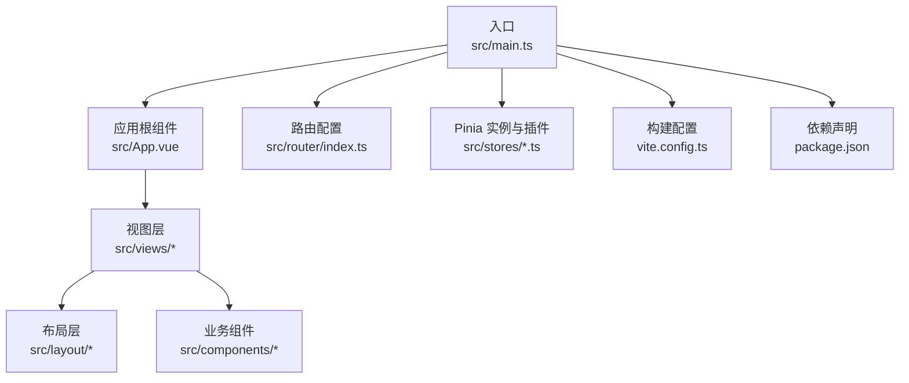
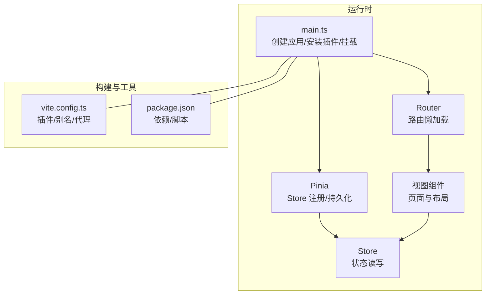
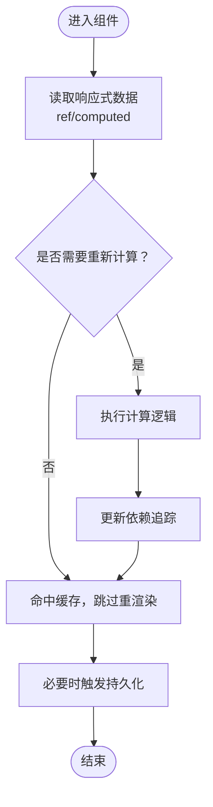
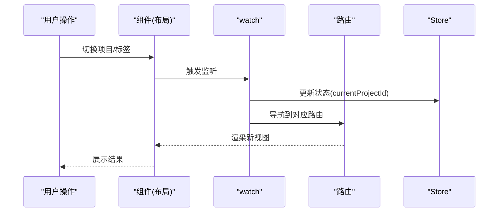
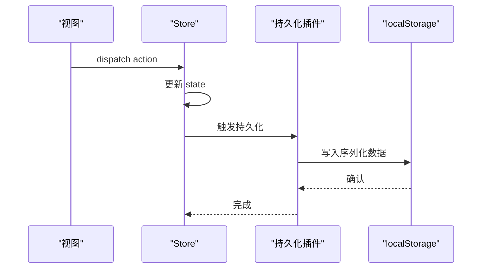
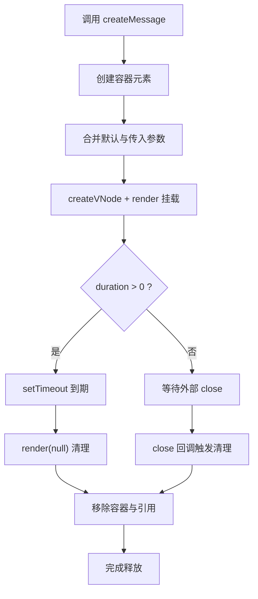
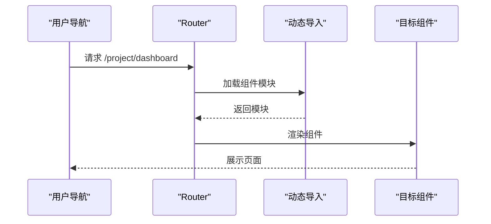
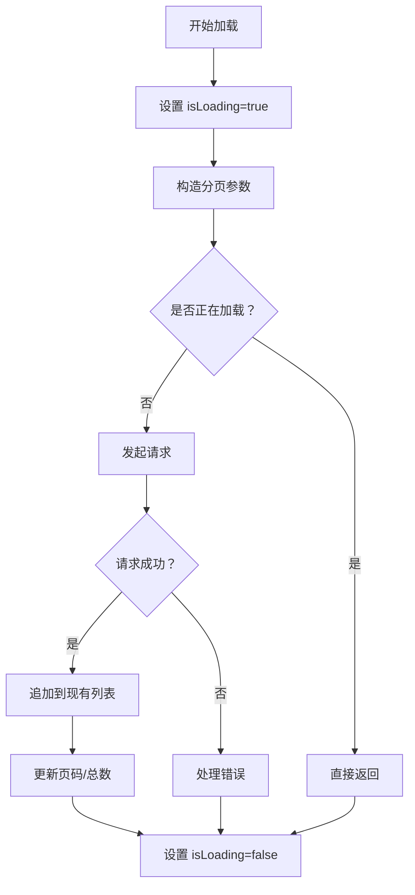
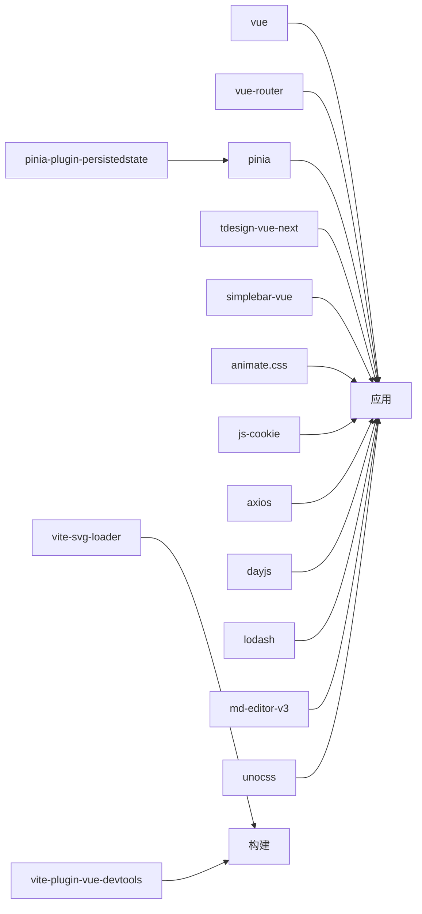

# 运行时性能

<cite>
**本文引用的文件**
- [src/main.ts](file://src/main.ts)
- [src/App.vue](file://src/App.vue)
- [src/router/index.ts](file://src/router/index.ts)
- [src/stores/main.ts](file://src/stores/main.ts)
- [src/stores/counter.ts](file://src/stores/counter.ts)
- [src/stores/user.ts](file://src/stores/user.ts)
- [src/utils/project.ts](file://src/utils/project.ts)
- [src/layout/ProjectLayout/index.vue](file://src/layout/ProjectLayout/index.vue)
- [src/views/dashboard/index.vue](file://src/views/dashboard/index.vue)
- [src/hooks/useCustomMessage.ts](file://src/hooks/useCustomMessage.ts)
- [src/views/project/components/file-list.vue](file://src/views/project/components/file-list.vue)
- [package.json](file://package.json)
- [vite.config.ts](file://vite.config.ts)
</cite>

## 目录
1. [引言](#引言)
2. [项目结构](#项目结构)
3. [核心组件](#核心组件)
4. [架构总览](#架构总览)
5. [详细组件分析](#详细组件分析)
6. [依赖分析](#依赖分析)
7. [性能考量](#性能考量)
8. [故障排查指南](#故障排查指南)
9. [结论](#结论)
10. [附录](#附录)

## 引言
本指南聚焦于 Vue 3 应用在运行时层面的性能优化实践，结合当前仓库中的实际实现，系统讲解以下主题：
- Composition API 的性能优势与最佳实践
- 响应式系统的优化策略（浅/深响应的选择）
- 组件渲染优化（计算属性、侦听器、虚拟 DOM）
- 状态管理的性能考虑（Pinia Store 的优化与持久化）
- 内存泄漏的预防与检测
- 性能监控工具的集成与使用

目标是帮助开发者在不牺牲可维护性的前提下，获得更流畅、更低开销的用户体验。

## 项目结构
该应用采用典型的 Vue 3 + Vite + TypeScript 结构，路由按功能模块拆分，状态通过 Pinia 管理，并使用动态导入实现路由级懒加载。入口文件集中初始化应用、挂载 Pinia 与路由，并引入必要的全局样式与第三方组件库。

图表来源
- [src/main.ts](file://src/main.ts#L1-L28)
- [src/App.vue](file://src/App.vue#L1-L12)
- [src/router/index.ts](file://src/router/index.ts#L1-L82)
- [vite.config.ts](file://vite.config.ts#L1-L31)
- [package.json](file://package.json#L1-L60)

章节来源
- [src/main.ts](file://src/main.ts#L1-L28)
- [src/router/index.ts](file://src/router/index.ts#L1-L82)
- [vite.config.ts](file://vite.config.ts#L1-L31)
- [package.json](file://package.json#L1-L60)

## 核心组件
- 应用入口与全局装配：在入口中创建应用实例、注册全局组件、安装 Pinia 与路由，并引入全局样式。
- 路由与懒加载：路由采用动态导入，减少首屏包体与初次渲染压力。
- Pinia Store：包含计数器、用户信息与主状态（含持久化），演示函数式 Store 与类式 Store 的不同形态。
- 布局与视图：布局组件负责导航与状态联动；视图组件承担页面级逻辑与数据流。
- 自定义消息钩子：演示基于 createVNode/render 的动态挂载与自动清理，避免内存泄漏。

章节来源
- [src/main.ts](file://src/main.ts#L1-L28)
- [src/App.vue](file://src/App.vue#L1-L12)
- [src/router/index.ts](file://src/router/index.ts#L1-L82)
- [src/stores/counter.ts](file://src/stores/counter.ts#L1-L13)
- [src/stores/user.ts](file://src/stores/user.ts#L1-L29)
- [src/stores/main.ts](file://src/stores/main.ts#L1-L21)
- [src/layout/ProjectLayout/index.vue](file://src/layout/ProjectLayout/index.vue#L1-L135)
- [src/hooks/useCustomMessage.ts](file://src/hooks/useCustomMessage.ts#L1-L73)

## 架构总览
下图展示从入口到视图、状态与路由的关键交互路径，以及构建与开发工具链的参与。

图表来源
- [src/main.ts](file://src/main.ts#L1-L28)
- [src/router/index.ts](file://src/router/index.ts#L1-L82)
- [src/stores/main.ts](file://src/stores/main.ts#L1-L21)
- [src/stores/counter.ts](file://src/stores/counter.ts#L1-L13)
- [src/stores/user.ts](file://src/stores/user.ts#L1-L29)
- [vite.config.ts](file://vite.config.ts#L1-L31)
- [package.json](file://package.json#L1-L60)

## 详细组件分析

### 组合式 API 与响应式系统优化
- 使用函数式 Store（计数器）与类式 Store（用户/主状态）并存，体现 Composition API 的灵活性与渐进迁移能力。
- 计算属性 doubleCount 在计数变化时仅重新计算，避免重复计算与中间变量开销。
- 持久化策略通过插件对 Store 进行序列化存储，减少刷新后状态丢失带来的重请求成本。

图表来源
- [src/stores/counter.ts](file://src/stores/counter.ts#L1-L13)
- [src/stores/main.ts](file://src/stores/main.ts#L1-L21)
- [src/stores/user.ts](file://src/stores/user.ts#L1-L29)

章节来源
- [src/stores/counter.ts](file://src/stores/counter.ts#L1-L13)
- [src/stores/main.ts](file://src/stores/main.ts#L1-L21)
- [src/stores/user.ts](file://src/stores/user.ts#L1-L29)

### 组件渲染优化：计算属性、侦听器与虚拟 DOM
- 计算属性：在视图中复用派生数据，避免模板内重复表达式与副作用。
- 侦听器：在布局组件中使用 watch 将 UI 变化同步到路由与状态，注意节流/去抖以降低频繁变更导致的重渲染。
- 虚拟 DOM：通过细粒度响应与模板静态提升（如静态属性/文本）减少不必要的对比与更新。

图表来源
- [src/layout/ProjectLayout/index.vue](file://src/layout/ProjectLayout/index.vue#L1-L135)

章节来源
- [src/layout/ProjectLayout/index.vue](file://src/layout/ProjectLayout/index.vue#L1-L135)

### 状态管理的性能考虑：Pinia Store 与持久化
- Store 分层：将高频变更的状态（如加载态）与持久化状态分离，减少不必要的持久化写入。
- 持久化粒度：仅对关键状态启用持久化，避免大对象频繁序列化/反序列化。
- 读写路径：通过统一的 action 更新状态，便于埋点与可观测性。

图表来源
- [src/stores/main.ts](file://src/stores/main.ts#L1-L21)
- [src/stores/user.ts](file://src/stores/user.ts#L1-L29)
- [src/main.ts](file://src/main.ts#L1-L28)

章节来源
- [src/stores/main.ts](file://src/stores/main.ts#L1-L21)
- [src/stores/user.ts](file://src/stores/user.ts#L1-L29)
- [src/main.ts](file://src/main.ts#L1-L28)

### 内存泄漏的预防与检测：动态挂载与自动清理
- 动态挂载：使用 createVNode/render 在容器中挂载临时节点，避免全局污染。
- 自动清理：定时器到期后调用 render(null, container) 并移除 DOM，防止残留引用。
- 引用管理：使用 Map 维护消息实例，支持手动关闭与批量清理。

图表来源
- [src/hooks/useCustomMessage.ts](file://src/hooks/useCustomMessage.ts#L1-L73)

章节来源
- [src/hooks/useCustomMessage.ts](file://src/hooks/useCustomMessage.ts#L1-L73)

### 路由懒加载与首屏优化
- 路由级动态导入：将非首屏组件延迟加载，显著降低首屏 JS 体积与解析时间。
- 预加载策略：可在关键路径上对后续页面进行预加载，平衡首屏与后续交互体验。

图表来源
- [src/router/index.ts](file://src/router/index.ts#L1-L82)

章节来源
- [src/router/index.ts](file://src/router/index.ts#L1-L82)

### 数据加载与分页渲染优化
- 防重复请求：在请求进行中设置标志位，避免并发重复加载。
- 追加式分页：将新数据追加到现有列表，减少全量替换带来的重排。
- 条件渲染：根据 total 与当前页判断是否还有更多，避免无效请求。

图表来源
- [src/views/project/components/file-list.vue](file://src/views/project/components/file-list.vue#L39-L87)

章节来源
- [src/views/project/components/file-list.vue](file://src/views/project/components/file-list.vue#L39-L87)

## 依赖分析
- 运行时依赖：Vue 3、Vue Router、Pinia、pinia-plugin-persistedstate、tdesign-vue-next、simplebar-vue、animate.css、js-cookie、axios、dayjs、lodash、md-editor-v3、unocss、vite-svg-loader。
- 开发依赖：Vite 插件生态（Vue、JSX、UnoCSS、SVG Loader、Vue DevTools）、ESLint、Prettier、TypeScript 工具链。

图表来源
- [package.json](file://package.json#L1-L60)

章节来源
- [package.json](file://package.json#L1-L60)

## 性能考量
- 响应式选择策略
  - 浅响应：适合大型只读或不可变数据结构，避免深层遍历开销。
  - 深响应：适合需要细粒度追踪的对象树，但会带来额外的代理与追踪成本。
  - 建议：优先使用浅响应，仅在确需深度追踪时启用深响应。
- 计算属性与侦听器
  - 将昂贵计算放入 computed，利用缓存；对高频输入使用防抖/节流。
  - 在 watch 中尽量做轻量同步（如路由/本地状态），避免在回调中执行重任务。
- 虚拟 DOM 优化
  - 减少不必要的响应式包裹；对静态内容保持静态。
  - 合理拆分组件，缩小响应式作用域，降低依赖追踪范围。
- 状态管理
  - 将持久化限制在必要字段；避免在 action 中频繁写入大对象。
  - 使用模块化 Store，按需引入，减少全局状态复杂度。
- 路由与懒加载
  - 仅对非关键路径使用动态导入；对重要页面可考虑预加载。
- 图像与资源
  - 使用现代格式与尺寸标注；结合懒加载与占位符。
- 构建与打包
  - 利用 Vite 的原生 ES 模块与按需编译；合理配置别名与代理，减少无关扫描。

[本节为通用性能建议，不直接分析具体文件]

## 故障排查指南
- 内存泄漏排查
  - 检查动态挂载的组件是否在生命周期结束时正确清理（容器移除、事件解绑、定时器清除）。
  - 关注长生命周期对象（全局事件、定时器、订阅）是否被释放。
- 性能瓶颈定位
  - 使用浏览器性能面板记录渲染、脚本与网络阶段；关注长任务与主线程阻塞。
  - 使用 Vue DevTools 观察组件重渲染次数与原因，识别过度更新。
- 状态异常
  - 检查持久化键冲突与序列化失败；确认 action 更新路径清晰且幂等。
- 路由卡顿
  - 排查动态导入模块体积与加载时间；对首屏关键路由进行预加载。

章节来源
- [src/hooks/useCustomMessage.ts](file://src/hooks/useCustomMessage.ts#L1-L73)
- [src/layout/ProjectLayout/index.vue](file://src/layout/ProjectLayout/index.vue#L1-L135)
- [src/router/index.ts](file://src/router/index.ts#L1-L82)

## 结论
通过在运行时层面落实响应式选择、计算属性与侦听器的合理使用、组件渲染的细粒度控制、状态管理的持久化与模块化策略，以及动态挂载与自动清理的内存治理，可以在保证开发效率的同时显著提升应用的交互流畅度与稳定性。配合构建工具链与性能监控，形成持续优化闭环。

[本节为总结性内容，不直接分析具体文件]

## 附录
- 性能监控工具集成建议
  - 使用浏览器内置性能面板与 Vue DevTools 进行日常分析。
  - 在生产环境接入 Web Vitals 监控（LCP、CLS、FID），结合日志上报与告警。
  - 对关键交互（路由切换、列表加载）埋点，统计耗时分布与异常率。

[本节为概念性内容，不直接分析具体文件]