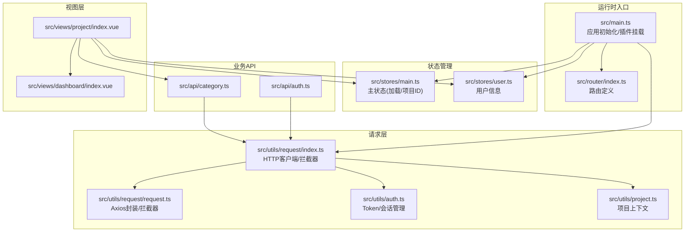
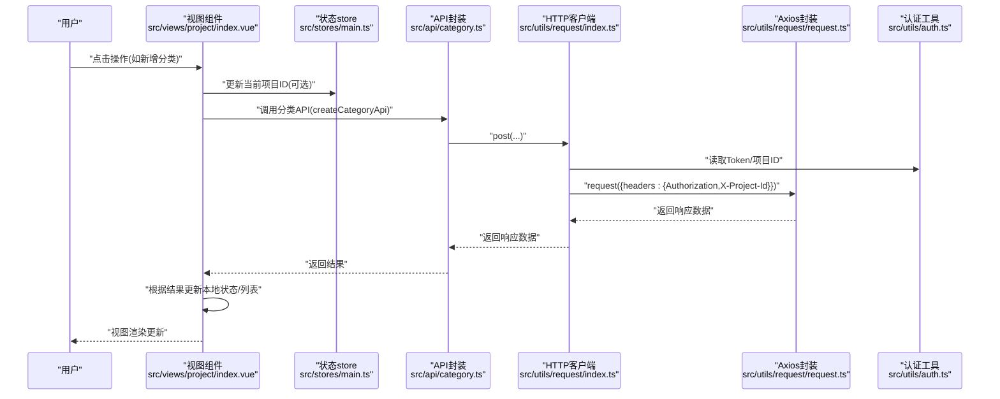
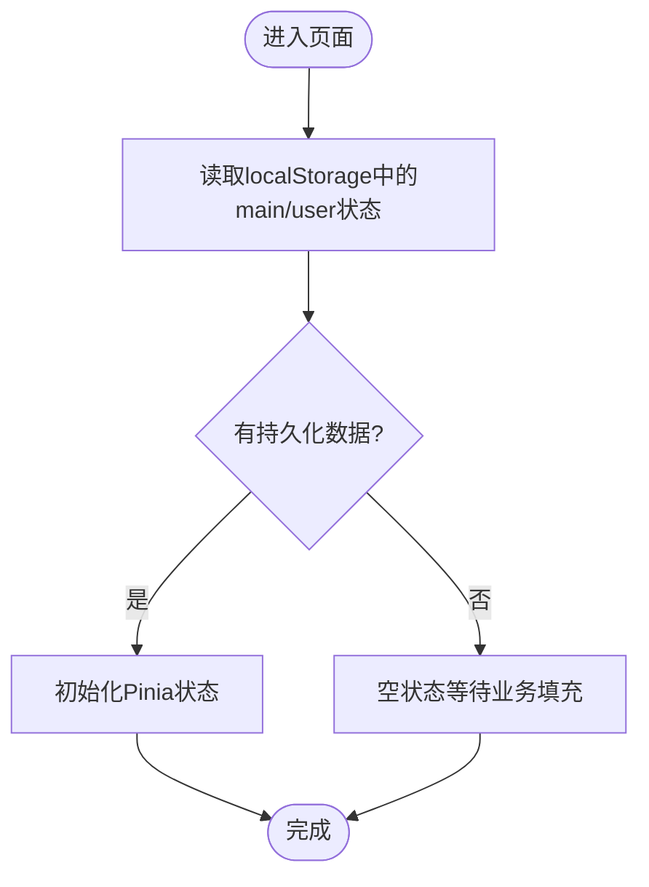
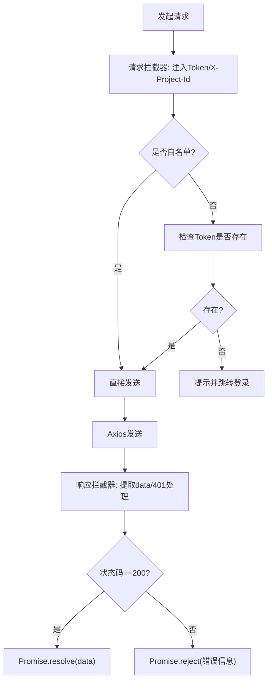
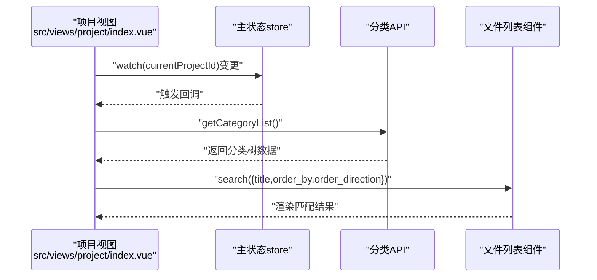
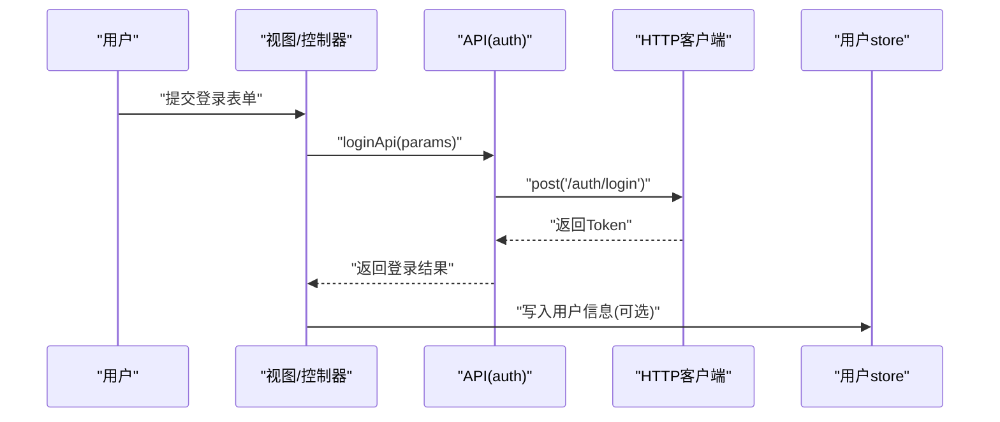
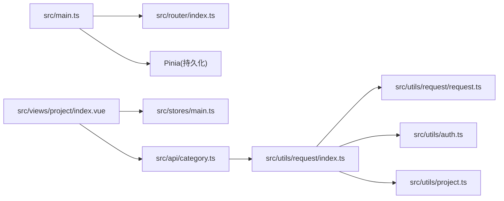

# 数据流设计

<cite>
**本文引用的文件**
- [src/main.ts](file://src/main.ts)
- [src/router/index.ts](file://src/router/index.ts)
- [src/stores/main.ts](file://src/stores/main.ts)
- [src/stores/user.ts](file://src/stores/user.ts)
- [src/utils/request/request.ts](file://src/utils/request/request.ts)
- [src/utils/request/index.ts](file://src/utils/request/index.ts)
- [src/utils/auth.ts](file://src/utils/auth.ts)
- [src/utils/project.ts](file://src/utils/project.ts)
- [src/api/auth.ts](file://src/api/auth.ts)
- [src/api/category.ts](file://src/api/category.ts)
- [src/types/categoryTypes.d.ts](file://src/types/categoryTypes.d.ts)
- [src/types/articleTypes.d.ts](file://src/types/articleTypes.d.ts)
- [src/hooks/useTdMessage.ts](file://src/hooks/useTdMessage.ts)
- [src/views/dashboard/index.vue](file://src/views/dashboard/index.vue)
- [src/views/project/index.vue](file://src/views/project/index.vue)
</cite>

## 目录
1. [引言](#引言)
2. [项目结构](#项目结构)
3. [核心组件](#核心组件)
4. [架构总览](#架构总览)
5. [详细组件分析](#详细组件分析)
6. [依赖关系分析](#依赖关系分析)
7. [性能考量](#性能考量)
8. [故障排查指南](#故障排查指南)
9. [结论](#结论)
10. [附录](#附录)

## 引言
本文件面向 LiFocus Web 应用，系统化梳理“从用户操作到数据更新”的完整数据流与处理机制，覆盖以下方面：
- 用户操作触发 → API 调用 → 状态更新 → 视图渲染的数据传递链路
- 错误处理与异常恢复机制
- 数据缓存与同步策略（本地持久化、请求头注入、项目上下文）
- 性能优化与用户体验建议
- 提供数据流图与处理示例（以文件路径标注代替代码片段）

## 项目结构
应用采用前端单页架构：Vue 3 + Vue Router + Pinia，通过统一请求封装与类型定义实现清晰的数据边界与可维护性。



图表来源
- [src/main.ts](file://src/main.ts#L1-L28)
- [src/router/index.ts](file://src/router/index.ts#L1-L82)
- [src/stores/main.ts](file://src/stores/main.ts#L1-L21)
- [src/stores/user.ts](file://src/stores/user.ts#L1-L29)
- [src/utils/request/index.ts](file://src/utils/request/index.ts#L1-L40)
- [src/utils/request/request.ts](file://src/utils/request/request.ts#L1-L99)
- [src/utils/auth.ts](file://src/utils/auth.ts#L1-L71)
- [src/utils/project.ts](file://src/utils/project.ts#L1-L10)
- [src/api/auth.ts](file://src/api/auth.ts#L1-L41)
- [src/api/category.ts](file://src/api/category.ts#L1-L50)
- [src/views/dashboard/index.vue](file://src/views/dashboard/index.vue#L1-L26)
- [src/views/project/index.vue](file://src/views/project/index.vue#L1-L371)

章节来源
- [src/main.ts](file://src/main.ts#L1-L28)
- [src/router/index.ts](file://src/router/index.ts#L1-L82)

## 核心组件
- 应用入口与插件
  - 初始化 Pinia 并启用持久化插件；挂载路由与应用实例。
- 状态管理
  - 主状态 store：管理全局加载态与当前项目 ID，并持久化到本地存储。
  - 用户 store：拉取当前用户信息并持久化。
- 请求层
  - 统一 HTTP 客户端，集中注入 Authorization 与 X-Project-Id 请求头；统一处理 401 重定向与错误提示。
- 工具与类型
  - Token/会话工具：支持 Cookie/SessionStorage 双模式。
  - 项目上下文工具：在 Cookie 中保存当前项目 ID。
  - 类型定义：明确分类与文章的数据结构与分页响应格式。

章节来源
- [src/stores/main.ts](file://src/stores/main.ts#L1-L21)
- [src/stores/user.ts](file://src/stores/user.ts#L1-L29)
- [src/utils/request/index.ts](file://src/utils/request/index.ts#L1-L40)
- [src/utils/request/request.ts](file://src/utils/request/request.ts#L1-L99)
- [src/utils/auth.ts](file://src/utils/auth.ts#L1-L71)
- [src/utils/project.ts](file://src/utils/project.ts#L1-L10)
- [src/types/categoryTypes.d.ts](file://src/types/categoryTypes.d.ts#L1-L39)
- [src/types/articleTypes.d.ts](file://src/types/articleTypes.d.ts#L1-L62)

## 架构总览
下图展示典型“用户操作 → API 调用 → 状态更新 → 视图渲染”的闭环流程。



图表来源
- [src/views/project/index.vue](file://src/views/project/index.vue#L66-L80)
- [src/stores/main.ts](file://src/stores/main.ts#L10-L15)
- [src/api/category.ts](file://src/api/category.ts#L19-L24)
- [src/utils/request/index.ts](file://src/utils/request/index.ts#L12-L39)
- [src/utils/request/request.ts](file://src/utils/request/request.ts#L55-L75)
- [src/utils/auth.ts](file://src/utils/auth.ts#L29-L58)

## 详细组件分析

### 状态管理与持久化
- 主状态 store
  - 管理 isLoading 与 currentProjectId；设置项目 ID 后同步写入 Cookie，确保跨页面保持项目上下文。
  - 使用 Pinia 持久化插件，key 为 main，存储介质为 localStorage。
- 用户 store
  - 提供获取当前用户信息的动作，成功后将用户字段写入 store，并持久化。



图表来源
- [src/stores/main.ts](file://src/stores/main.ts#L16-L20)
- [src/stores/user.ts](file://src/stores/user.ts#L22-L26)

章节来源
- [src/stores/main.ts](file://src/stores/main.ts#L1-L21)
- [src/stores/user.ts](file://src/stores/user.ts#L1-L29)
- [src/utils/project.ts](file://src/utils/project.ts#L1-L10)

### 请求层与拦截器
- HTTP 客户端
  - 基地址、超时、请求拦截器：自动注入 Authorization 与 X-Project-Id；白名单放行。
  - 响应拦截器：统一提取 data；401 清理 Token 并跳转登录；非 200 抛出错误。
- Axios 封装
  - request/get/post/put/delete/patch 方法；支持单次请求/响应拦截器钩子。
- 认证工具
  - 支持 Cookie/SessionStorage 双模式存储 Token；提供获取/移除能力。



图表来源
- [src/utils/request/index.ts](file://src/utils/request/index.ts#L12-L39)
- [src/utils/request/request.ts](file://src/utils/request/request.ts#L17-L51)
- [src/utils/auth.ts](file://src/utils/auth.ts#L29-L58)

章节来源
- [src/utils/request/index.ts](file://src/utils/request/index.ts#L1-L40)
- [src/utils/request/request.ts](file://src/utils/request/request.ts#L1-L99)
- [src/utils/auth.ts](file://src/utils/auth.ts#L1-L71)

### 业务API与类型约束
- 分类 API
  - 获取列表、新建、更新、删除；均通过统一 HTTP 客户端发起请求。
- 类型定义
  - 分类与文章的数据模型、分页响应、过滤条件等，确保前后端契约一致。

```mermaid
erDiagram
CATEGORY {
int id
string name
int|NULL parent_id
string full_path
string create_time
string update_time
}
ARTICLE {
string id
string category_id
enum type
string title
enum status
boolean is_shared
boolean is_deleted
string create_time
string update_time
}
CATEGORY ||--o{ ARTICLE : "包含"
```

图表来源
- [src/types/categoryTypes.d.ts](file://src/types/categoryTypes.d.ts#L4-L17)
- [src/types/articleTypes.d.ts](file://src/types/articleTypes.d.ts#L9-L24)

章节来源
- [src/api/category.ts](file://src/api/category.ts#L1-L50)
- [src/types/categoryTypes.d.ts](file://src/types/categoryTypes.d.ts#L1-L39)
- [src/types/articleTypes.d.ts](file://src/types/articleTypes.d.ts#L1-L62)

### 视图层数据流与交互
- 项目工作台视图
  - 监听主状态 store 的 currentProjectId 变化，自动刷新分类树。
  - 通过弹窗与表单组件承载“新增/编辑/查看”文章的交互，关闭时按需刷新列表。
  - 支持排序与标题搜索，将筛选条件透传给文件列表组件进行二次查询。



图表来源
- [src/views/project/index.vue](file://src/views/project/index.vue#L40-L64)
- [src/views/project/index.vue](file://src/views/project/index.vue#L175-L181)
- [src/api/category.ts](file://src/api/category.ts#L7-L11)

章节来源
- [src/views/project/index.vue](file://src/views/project/index.vue#L1-L371)

### 登录/登出与用户信息
- 登录/注册/登出
  - 通过统一 API 封装发起请求；登录成功后由认证工具写入 Token。
- 当前用户信息
  - 用户 store 调用获取用户信息接口，成功后写入 store 并持久化。



图表来源
- [src/api/auth.ts](file://src/api/auth.ts#L7-L12)
- [src/utils/request/index.ts](file://src/utils/request/index.ts#L12-L39)
- [src/stores/user.ts](file://src/stores/user.ts#L12-L19)

章节来源
- [src/api/auth.ts](file://src/api/auth.ts#L1-L41)
- [src/stores/user.ts](file://src/stores/user.ts#L1-L29)

## 依赖关系分析
- 入口依赖
  - main.ts 依赖 router、pinia、样式与组件库；pinia 启用持久化插件。
- 视图依赖
  - 项目视图依赖主状态 store、消息提示 hook、分类 API 与文件列表组件。
- 请求依赖
  - HTTP 客户端依赖认证工具与项目上下文工具；Axios 封装依赖拦截器与统一错误处理。
- 类型依赖
  - API 与视图层严格依赖类型定义，保证数据结构一致性。



图表来源
- [src/main.ts](file://src/main.ts#L1-L28)
- [src/router/index.ts](file://src/router/index.ts#L1-L82)
- [src/views/project/index.vue](file://src/views/project/index.vue#L1-L371)
- [src/stores/main.ts](file://src/stores/main.ts#L1-L21)
- [src/api/category.ts](file://src/api/category.ts#L1-L50)
- [src/utils/request/index.ts](file://src/utils/request/index.ts#L1-L40)
- [src/utils/request/request.ts](file://src/utils/request/request.ts#L1-L99)
- [src/utils/auth.ts](file://src/utils/auth.ts#L1-L71)
- [src/utils/project.ts](file://src/utils/project.ts#L1-L10)

章节来源
- [src/main.ts](file://src/main.ts#L1-L28)
- [src/router/index.ts](file://src/router/index.ts#L1-L82)
- [src/views/project/index.vue](file://src/views/project/index.vue#L1-L371)

## 性能考量
- 请求层优化
  - 统一超时与拦截器，避免重复逻辑；白名单放行减少不必要的头部注入。
  - 响应拦截器统一提取 data，降低上层处理复杂度。
- 状态与缓存
  - Pinia 持久化减少刷新丢失；项目上下文通过 Cookie 保持，避免每次请求携带大对象。
- 视图渲染
  - 使用 nextTick 与局部 ref 更新，减少不必要重渲染；列表查询通过组件间通信触发，避免全局状态风暴。
- 用户体验
  - 成功/失败消息统一通过消息 hook 输出，提升反馈一致性；401 自动跳转登录，保障安全与可用性。

## 故障排查指南
- 401 未授权
  - 现象：出现登录状态异常提示并跳转登录页。
  - 排查：确认 Token 是否存在且未过期；检查请求头 Authorization 是否正确注入；核对白名单 URL。
- 请求失败
  - 现象：Promise 拒绝并显示系统错误。
  - 排查：查看响应拦截器返回的错误数据；确认服务端返回码与业务 code。
- 项目上下文缺失
  - 现象：请求未携带 X-Project-Id。
  - 排查：确认主状态 store 中 currentProjectId 是否已设置；确认 Cookie 中 currentProjectId 是否存在。
- 登录状态异常
  - 现象：提示登录状态异常并跳转登录。
  - 排查：检查认证工具中 Token 存储方式（Cookie/SessionStorage）与键名；确认登录流程是否正确写入 Token。

章节来源
- [src/utils/request/request.ts](file://src/utils/request/request.ts#L30-L39)
- [src/utils/request/index.ts](file://src/utils/request/index.ts#L32-L36)
- [src/utils/auth.ts](file://src/utils/auth.ts#L12-L24)
- [src/utils/project.ts](file://src/utils/project.ts#L3-L5)

## 结论
本应用通过“视图层 → API 层 → 请求层 → 状态层”的清晰分层，结合 Pinia 持久化与统一请求拦截器，实现了稳定、可维护的数据流闭环。配合类型约束与错误处理机制，既保证了开发效率，也提升了用户体验与安全性。后续可在缓存策略细化、请求去抖与长列表虚拟化等方面进一步优化。

## 附录
- 关键流程示例（以文件路径标注代替代码片段）
  - 新增分类：[src/views/project/index.vue](file://src/views/project/index.vue#L66-L80) → [src/api/category.ts](file://src/api/category.ts#L19-L24) → [src/utils/request/index.ts](file://src/utils/request/index.ts#L12-L39)
  - 获取分类列表：[src/views/project/index.vue](file://src/views/project/index.vue#L54-L64) → [src/api/category.ts](file://src/api/category.ts#L7-L11)
  - 设置当前项目：[src/stores/main.ts](file://src/stores/main.ts#L10-L15) → [src/utils/project.ts](file://src/utils/project.ts#L3-L5)
  - 获取当前用户：[src/stores/user.ts](file://src/stores/user.ts#L12-L19) → [src/api/auth.ts](file://src/api/auth.ts#L36-L40)