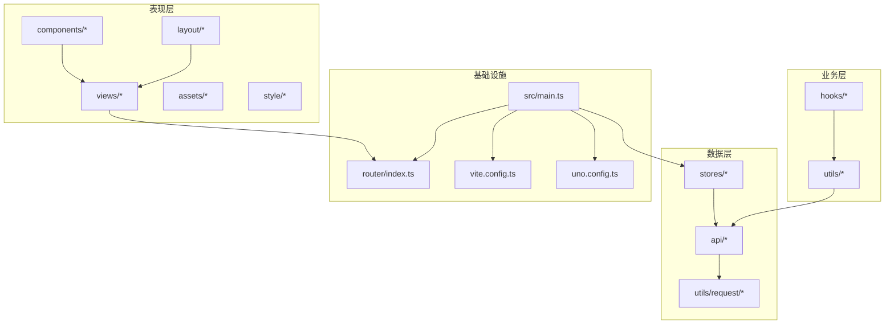
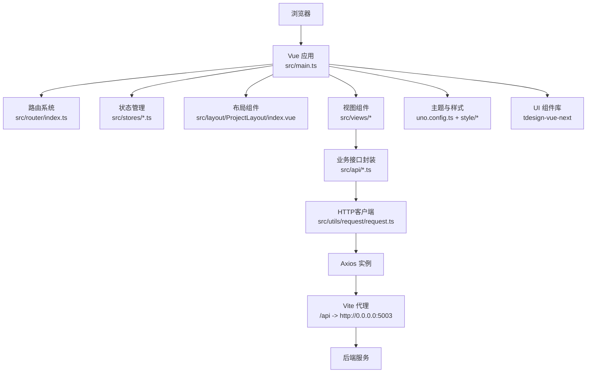
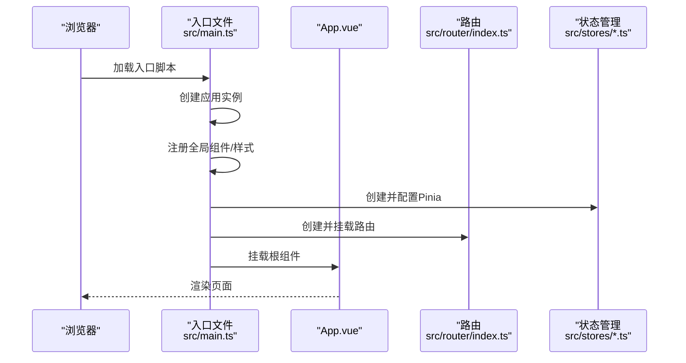
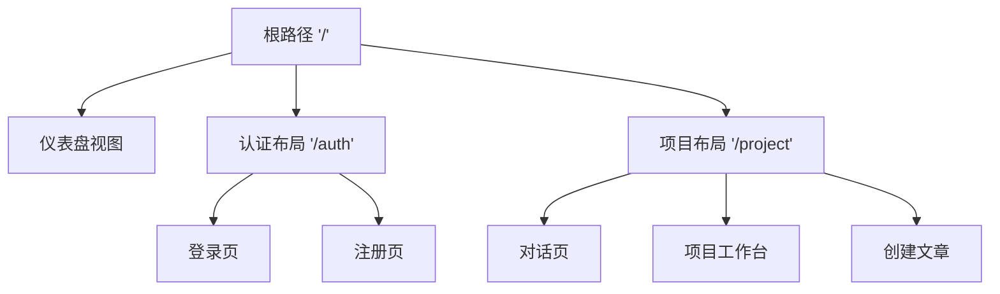
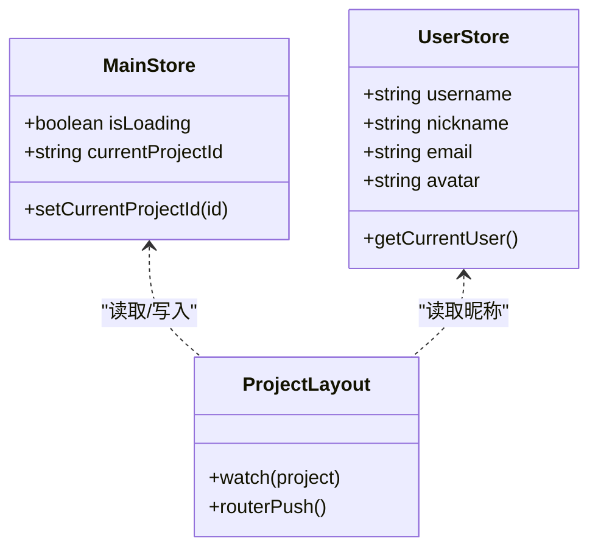
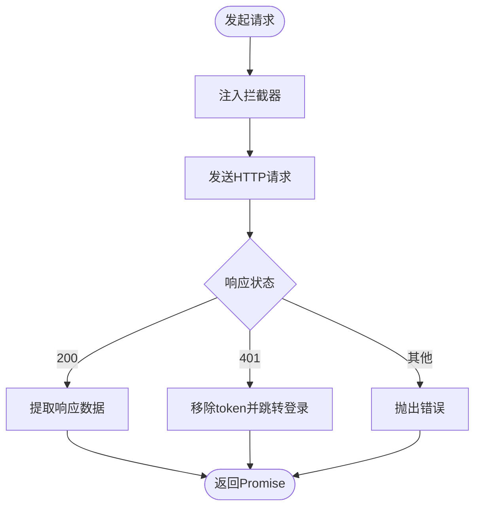
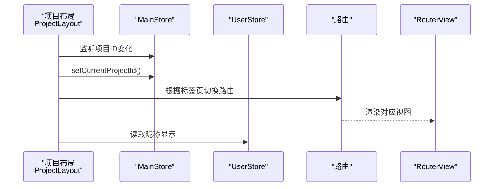
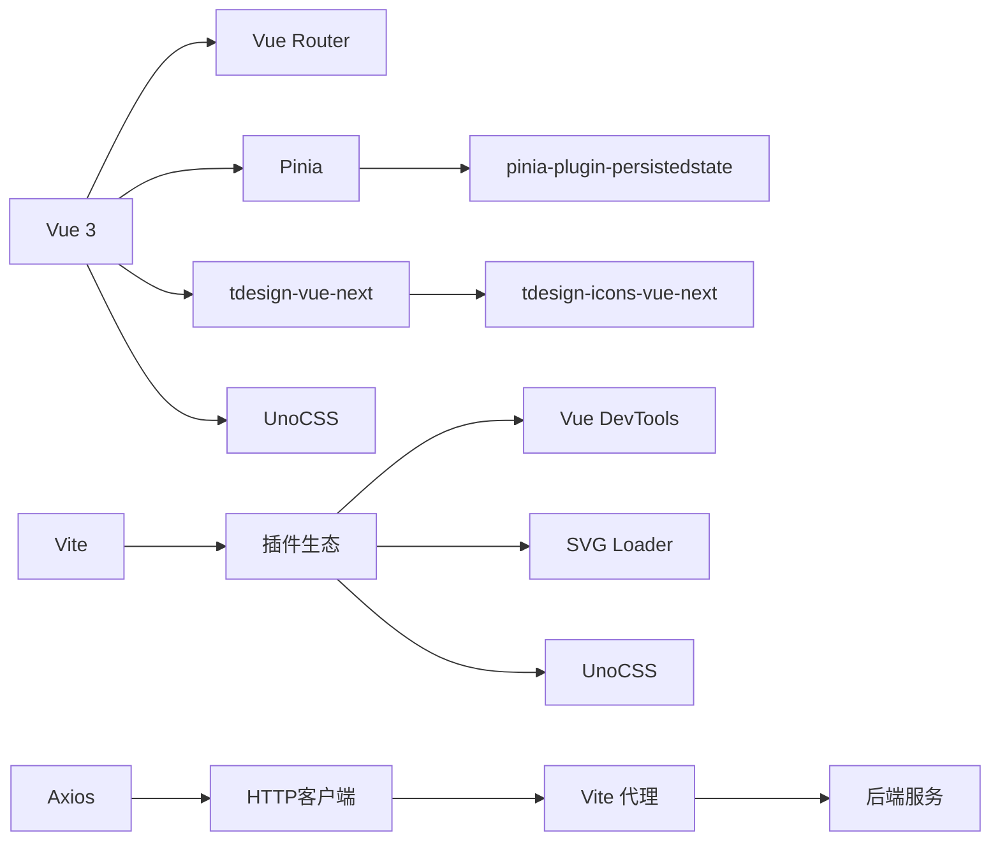

# 整体架构

<cite>
**本文引用的文件**
- [package.json](file://package.json)
- [vite.config.ts](file://vite.config.ts)
- [uno.config.ts](file://uno.config.ts)
- [src/main.ts](file://src/main.ts)
- [src/App.vue](file://src/App.vue)
- [src/router/index.ts](file://src/router/index.ts)
- [src/stores/main.ts](file://src/stores/main.ts)
- [src/stores/user.ts](file://src/stores/user.ts)
- [src/utils/request/request.ts](file://src/utils/request/request.ts)
- [src/utils/auth.ts](file://src/utils/auth.ts)
- [src/layout/ProjectLayout/index.vue](file://src/layout/ProjectLayout/index.vue)
- [src/views/dashboard/index.vue](file://src/views/dashboard/index.vue)
- [src/api/auth.ts](file://src/api/auth.ts)
- [src/hooks/useTdMessage.ts](file://src/hooks/useTdMessage.ts)
- [src/types/apiTypes.d.ts](file://src/types/apiTypes.d.ts)
</cite>

## 目录
1. [引言](#引言)
2. [项目结构](#项目结构)
3. [核心组件](#核心组件)
4. [架构总览](#架构总览)
5. [详细组件分析](#详细组件分析)
6. [依赖分析](#依赖分析)
7. [性能考虑](#性能考虑)
8. [故障排查指南](#故障排查指南)
9. [结论](#结论)
10. [附录](#附录)

## 引言
本文件面向LiFocus Web V2的整体架构文档，围绕基于Vue 3的MVVM架构模式，系统阐述应用初始化流程、核心插件与状态管理配置、分层架构设计（表现层、业务层、数据层）、模块化组织方式、技术栈选型与权衡考量，并给出系统架构图与组件关系图，帮助开发者快速理解并高效扩展。

## 项目结构
项目采用“按功能域+分层”的目录组织方式：
- 表现层：views、components、layout、assets、style
- 业务层：hooks、utils（业务工具、消息提示、鉴权等）
- 数据层：api（接口封装）、stores（状态管理）、utils/request（HTTP客户端）
- 基础设施：router、main.ts（应用入口）、vite.config.ts、uno.config.ts

图表来源
- [src/main.ts](file://src/main.ts#L1-L28)
- [src/router/index.ts](file://src/router/index.ts#L1-L82)
- [src/stores/main.ts](file://src/stores/main.ts#L1-L21)
- [src/stores/user.ts](file://src/stores/user.ts#L1-L29)
- [src/utils/request/request.ts](file://src/utils/request/request.ts#L1-L99)
- [src/api/auth.ts](file://src/api/auth.ts#L1-L41)
- [vite.config.ts](file://vite.config.ts#L1-L31)
- [uno.config.ts](file://uno.config.ts#L1-L50)

章节来源
- [package.json](file://package.json#L1-L60)
- [src/main.ts](file://src/main.ts#L1-L28)
- [vite.config.ts](file://vite.config.ts#L1-L31)
- [uno.config.ts](file://uno.config.ts#L1-L50)

## 核心组件
- 应用入口与初始化：在入口文件中完成插件注册、全局样式引入、路由与状态管理挂载。
- 路由系统：集中定义页面级路由与嵌套路由，支持懒加载与权限相关布局。
- 状态管理：使用Pinia进行状态建模，结合持久化插件实现跨会话状态保持。
- HTTP客户端：统一封装Axios，内置拦截器与错误处理，统一返回结构。
- UI与主题：集成tdesign-vue-next组件库与UnoCSS原子化样式，自定义主题变量与快捷类名。
- 视图与布局：以布局组件承载导航、侧边栏、主内容区，视图组件聚焦具体业务。

章节来源
- [src/main.ts](file://src/main.ts#L1-L28)
- [src/router/index.ts](file://src/router/index.ts#L1-L82)
- [src/stores/main.ts](file://src/stores/main.ts#L1-L21)
- [src/stores/user.ts](file://src/stores/user.ts#L1-L29)
- [src/utils/request/request.ts](file://src/utils/request/request.ts#L1-L99)
- [uno.config.ts](file://uno.config.ts#L1-L50)

## 架构总览
下图展示从浏览器到后端服务的端到端调用链路，以及各层之间的交互关系。

图表来源
- [src/main.ts](file://src/main.ts#L1-L28)
- [src/router/index.ts](file://src/router/index.ts#L1-L82)
- [src/stores/main.ts](file://src/stores/main.ts#L1-L21)
- [src/stores/user.ts](file://src/stores/user.ts#L1-L29)
- [src/layout/ProjectLayout/index.vue](file://src/layout/ProjectLayout/index.vue#L1-L135)
- [src/views/dashboard/index.vue](file://src/views/dashboard/index.vue#L1-L26)
- [src/api/auth.ts](file://src/api/auth.ts#L1-L41)
- [src/utils/request/request.ts](file://src/utils/request/request.ts#L1-L99)
- [vite.config.ts](file://vite.config.ts#L19-L29)
- [uno.config.ts](file://uno.config.ts#L1-L50)

## 详细组件分析

### 应用初始化与插件装配
- 初始化流程要点
  - 创建Vue应用实例，注册全局组件（如滚动条组件）。
  - 引入全局样式：UI库样式、UnoCSS、动画库、Simplebar样式。
  - 配置并挂载Pinia，启用持久化插件，确保状态跨刷新可用。
  - 挂载路由系统，完成历史模式与路由表注册。
  - 挂载应用根节点。
- 关键点
  - 全局样式的引入顺序影响最终渲染效果与覆盖优先级。
  - Pinia持久化策略通过存储键与存储介质控制状态生命周期。

图表来源
- [src/main.ts](file://src/main.ts#L1-L28)
- [src/App.vue](file://src/App.vue#L1-L12)
- [src/router/index.ts](file://src/router/index.ts#L1-L82)
- [src/stores/main.ts](file://src/stores/main.ts#L1-L21)
- [src/stores/user.ts](file://src/stores/user.ts#L1-L29)

章节来源
- [src/main.ts](file://src/main.ts#L1-L28)
- [src/App.vue](file://src/App.vue#L1-L12)

### 路由与页面组织
- 路由设计
  - 登录/注册：独立布局，支持懒加载。
  - 仪表盘：首页视图，包含左右两栏组件。
  - 项目工作台：嵌套布局，包含对话、工作台、创建文章等子路由。
- 路由特性
  - 使用history模式与BASE_URL。
  - 子路由通过动态导入实现按需加载。
  - 顶层路由负责页面级布局与标题元信息。

图表来源
- [src/router/index.ts](file://src/router/index.ts#L5-L74)

章节来源
- [src/router/index.ts](file://src/router/index.ts#L1-L82)
- [src/views/dashboard/index.vue](file://src/views/dashboard/index.vue#L1-L26)

### 状态管理（Pinia）与持久化
- Store职责
  - main：全局加载态与当前项目ID等。
  - user：用户信息拉取与缓存。
- 持久化策略
  - 通过插件将store状态写入localStorage，重启后恢复。
- 与布局联动
  - 布局组件读取并监听store中的当前项目ID，触发路由跳转或列表更新。

图表来源
- [src/stores/main.ts](file://src/stores/main.ts#L1-L21)
- [src/stores/user.ts](file://src/stores/user.ts#L1-L29)
- [src/layout/ProjectLayout/index.vue](file://src/layout/ProjectLayout/index.vue#L15-L72)

章节来源
- [src/stores/main.ts](file://src/stores/main.ts#L1-L21)
- [src/stores/user.ts](file://src/stores/user.ts#L1-L29)
- [src/layout/ProjectLayout/index.vue](file://src/layout/ProjectLayout/index.vue#L1-L135)

### HTTP客户端与错误处理
- 设计目标
  - 统一请求/响应拦截，处理401自动登出与错误提示。
  - 支持单次请求拦截器增强。
  - 返回标准化数据结构（默认提取data）。
- 错误处理
  - 401时移除本地token并跳转登录。
  - 非200时统一reject并携带错误信息。
- 与API层协作
  - API层仅关注业务URL与参数，不关心网络细节。

图表来源
- [src/utils/request/request.ts](file://src/utils/request/request.ts#L17-L51)
- [src/api/auth.ts](file://src/api/auth.ts#L1-L41)
- [src/utils/auth.ts](file://src/utils/auth.ts#L1-L71)

章节来源
- [src/utils/request/request.ts](file://src/utils/request/request.ts#L1-L99)
- [src/api/auth.ts](file://src/api/auth.ts#L1-L41)
- [src/utils/auth.ts](file://src/utils/auth.ts#L1-L71)

### 布局与视图组件
- 项目布局
  - 顶部区域：Logo、项目选择器、标签页切换、用户弹窗。
  - 中部区域：RouterView承载子路由视图。
  - 与store联动：项目ID变化时同步至store；标签页切换时路由跳转。
- 仪表盘视图
  - 左右两栏布局，分别承载侧边与右侧列表组件。

图表来源
- [src/layout/ProjectLayout/index.vue](file://src/layout/ProjectLayout/index.vue#L15-L72)
- [src/stores/main.ts](file://src/stores/main.ts#L10-L15)
- [src/stores/user.ts](file://src/stores/user.ts#L5-L10)
- [src/router/index.ts](file://src/router/index.ts#L3-L74)

章节来源
- [src/layout/ProjectLayout/index.vue](file://src/layout/ProjectLayout/index.vue#L1-L135)
- [src/views/dashboard/index.vue](file://src/views/dashboard/index.vue#L1-L26)

### MVVM与响应式数据流
- Model（模型）
  - Pinia Store：维护应用状态（用户、项目、加载态）。
  - API Types：统一后端响应结构。
- View（视图）
  - 组件模板绑定store状态与props，响应用户交互。
- ViewModel（视图模型）
  - 组件逻辑（生命周期、计算属性、事件处理）协调Model与View。
- 数据流
  - 用户操作触发组件方法，调用store或API，异步完成后更新store，进而驱动视图重渲染。
- 事件驱动
  - 路由守卫、watcher、事件回调构成事件驱动机制，贯穿页面切换与状态变更。

章节来源
- [src/stores/main.ts](file://src/stores/main.ts#L1-L21)
- [src/stores/user.ts](file://src/stores/user.ts#L1-L29)
- [src/types/apiTypes.d.ts](file://src/types/apiTypes.d.ts#L1-L7)

## 依赖分析
- 技术栈与版本
  - Vue 3、Vue Router、Pinia、Axios、UnoCSS、tdesign-vue-next、Vite。
- 开发与构建
  - Vite作为构建工具与开发服务器，支持插件生态（Vue、JSX、DevTools、UnoCSS、SVG Loader）。
  - UnoCSS提供原子化样式与主题定制。
- 外部依赖与集成
  - 通过Vite代理将/api前缀转发至后端服务地址。
  - UI库与动画库通过入口文件统一引入。

图表来源
- [package.json](file://package.json#L18-L39)
- [vite.config.ts](file://vite.config.ts#L10-L13)
- [uno.config.ts](file://uno.config.ts#L1-L50)
- [src/utils/request/request.ts](file://src/utils/request/request.ts#L1-L99)
- [vite.config.ts](file://vite.config.ts#L19-L29)

章节来源
- [package.json](file://package.json#L1-L60)
- [vite.config.ts](file://vite.config.ts#L1-L31)

## 性能考虑
- 代码分割与懒加载
  - 路由级动态导入减少首屏体积，提升初始加载速度。
- 状态持久化
  - 合理使用持久化避免频繁重复拉取，但需注意存储大小与敏感信息。
- 样式与资源
  - UnoCSS原子化样式按需生成，减少冗余CSS；SVG组件化降低打包体积。
- 请求优化
  - 统一拦截器可做缓存、去重、超时控制等优化（建议在request层扩展）。
- 开发体验
  - Vite DevTools与热更新提升迭代效率。

## 故障排查指南
- 登录态异常
  - 现象：出现401错误并被强制跳转登录。
  - 排查：检查token设置/移除逻辑与后端签发策略；确认拦截器是否正确处理401。
- 请求失败
  - 现象：非200状态码统一报错。
  - 排查：查看拦截器错误分支与错误消息提示；核对后端返回结构。
- 路由跳转异常
  - 现象：标签页切换或项目选择未生效。
  - 排查：确认watcher与路由push逻辑；检查路由名称与路径是否匹配。
- 样式冲突
  - 现象：主题变量或快捷类名导致样式覆盖异常。
  - 排查：检查UnoCSS主题配置与scoped样式优先级。

章节来源
- [src/utils/request/request.ts](file://src/utils/request/request.ts#L31-L38)
- [src/utils/auth.ts](file://src/utils/auth.ts#L63-L70)
- [src/layout/ProjectLayout/index.vue](file://src/layout/ProjectLayout/index.vue#L23-L42)
- [uno.config.ts](file://uno.config.ts#L10-L49)

## 结论
LiFocus Web V2以Vue 3为核心，采用MVVM分层架构与模块化组织，结合Pinia状态管理、统一HTTP客户端与UI/样式基础设施，形成清晰的职责边界与可扩展性。通过路由懒加载、状态持久化与原子化样式等手段，在保证开发效率的同时兼顾性能与可维护性。后续可在请求层增加缓存与去重策略、完善路由守卫与权限控制，并持续优化主题与组件库的使用体验。

## 附录
- 关键文件清单
  - 入口与配置：src/main.ts、vite.config.ts、uno.config.ts
  - 路由与布局：src/router/index.ts、src/layout/ProjectLayout/index.vue
  - 状态管理：src/stores/main.ts、src/stores/user.ts
  - 数据访问：src/utils/request/request.ts、src/api/auth.ts
  - 工具与类型：src/utils/auth.ts、src/hooks/useTdMessage.ts、src/types/apiTypes.d.ts
- 建议
  - 在request层增加请求去重与缓存策略。
  - 为路由增加前置守卫与权限校验。
  - 逐步沉淀组件库与业务组件，提升复用度。