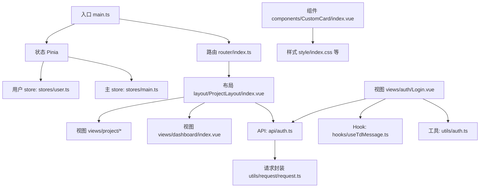
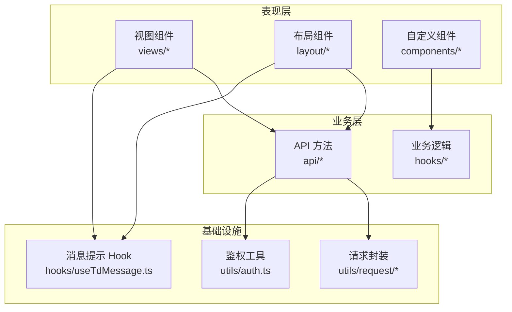
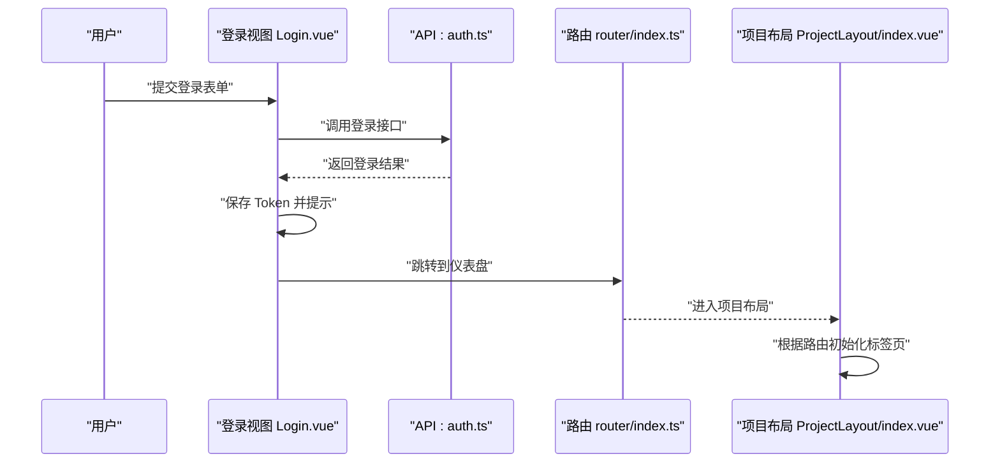
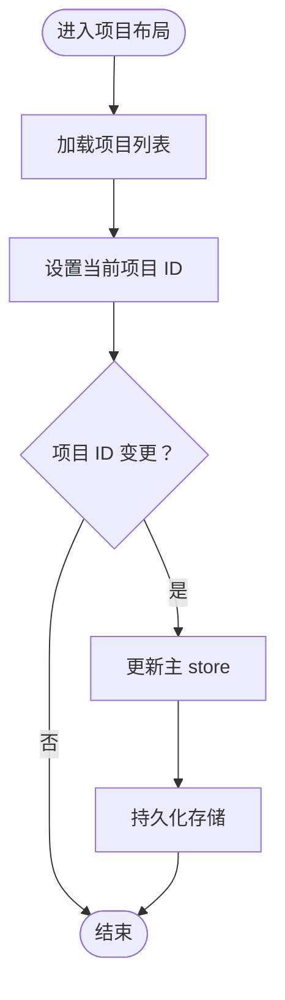
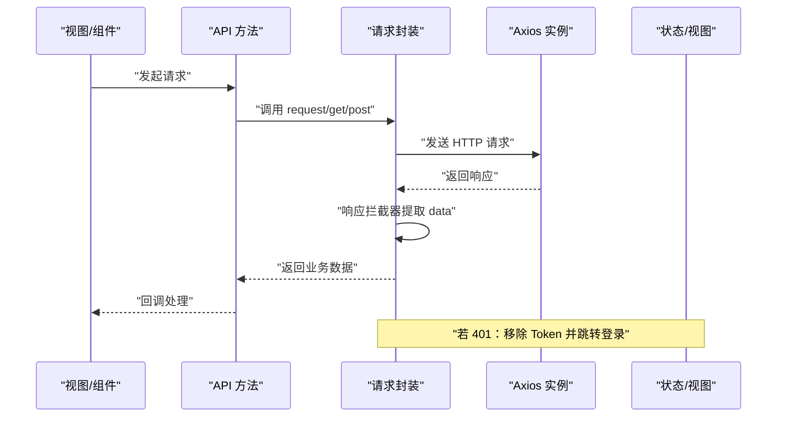
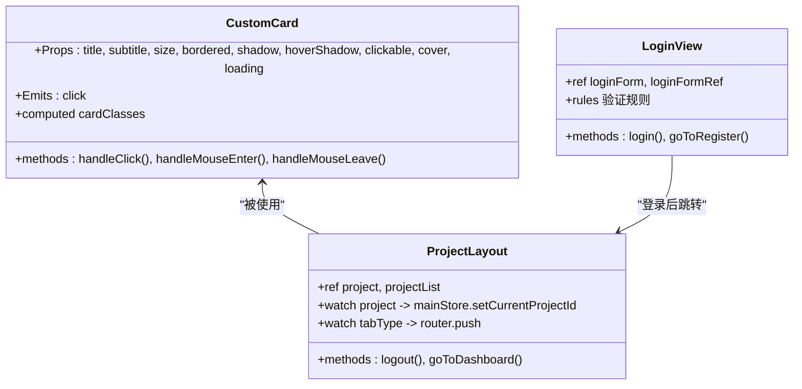
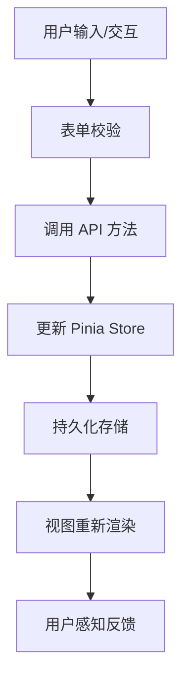
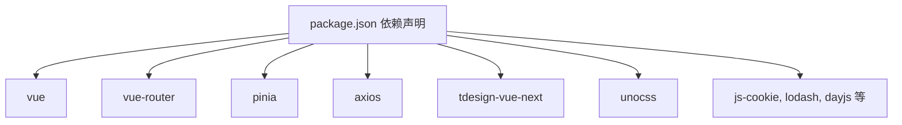

# 架构设计

<cite>
**本文引用的文件**
- [src/main.ts](file://src/main.ts)
- [src/App.vue](file://src/App.vue)
- [src/router/index.ts](file://src/router/index.ts)
- [src/stores/main.ts](file://src/stores/main.ts)
- [src/stores/user.ts](file://src/stores/user.ts)
- [src/utils/request/request.ts](file://src/utils/request/request.ts)
- [src/api/auth.ts](file://src/api/auth.ts)
- [src/views/dashboard/index.vue](file://src/views/dashboard/index.vue)
- [src/layout/ProjectLayout/index.vue](file://src/layout/ProjectLayout/index.vue)
- [src/views/auth/Login.vue](file://src/views/auth/Login.vue)
- [src/hooks/useTdMessage.ts](file://src/hooks/useTdMessage.ts)
- [src/utils/auth.ts](file://src/utils/auth.ts)
- [src/components/CustomCard/index.vue](file://src/components/CustomCard/index.vue)
- [package.json](file://package.json)
</cite>

## 目录
1. [引言](#引言)
2. [项目结构](#项目结构)
3. [核心组件](#核心组件)
4. [架构总览](#架构总览)
5. [详细组件分析](#详细组件分析)
6. [依赖关系分析](#依赖关系分析)
7. [性能考虑](#性能考虑)
8. [故障排查指南](#故障排查指南)
9. [结论](#结论)
10. [附录](#附录)

## 引言
本架构设计文档面向 LiFocus Web V2，系统采用 Vue 3 + TypeScript 技术栈，遵循 MVVM 架构与组合式 API 设计，通过 Pinia 实现集中式状态管理，结合 Vue Router 提供多级路由与嵌套路由能力。整体架构以“表现层（视图与组件）—业务层（API/服务）—基础设施（请求封装与工具）”三层分离为核心，辅以模块化组件设计与状态持久化策略，确保可维护性、可扩展性与良好的开发体验。

## 项目结构
- 入口与应用装配：在入口文件中完成应用初始化、插件挂载（路由、状态）、全局样式引入与组件注册。
- 路由系统：集中定义默认路由表，支持嵌套路由与动态加载，覆盖认证、仪表盘与项目工作台等页面。
- 状态管理：基于 Pinia 的多 store 设计，分别管理用户信息与主流程上下文（如当前项目 ID），并启用持久化插件。
- API 层：统一的请求封装类与 API 方法，负责网络请求、拦截器与错误处理。
- 表现层：视图组件与布局组件，使用第三方 UI 组件库进行界面构建，并通过组合式 API 管理本地状态与生命周期。
- 工具与 Hooks：提供消息提示、鉴权令牌管理等通用能力，便于跨模块复用。

**图表来源**
- [src/main.ts](file://src/main.ts#L1-L28)
- [src/router/index.ts](file://src/router/index.ts#L1-L82)
- [src/stores/user.ts](file://src/stores/user.ts#L1-L29)
- [src/stores/main.ts](file://src/stores/main.ts#L1-L21)
- [src/layout/ProjectLayout/index.vue](file://src/layout/ProjectLayout/index.vue#L1-L135)
- [src/views/dashboard/index.vue](file://src/views/dashboard/index.vue#L1-L26)
- [src/api/auth.ts](file://src/api/auth.ts#L1-L41)
- [src/utils/request/request.ts](file://src/utils/request/request.ts#L1-L99)
- [src/views/auth/Login.vue](file://src/views/auth/Login.vue#L1-L138)
- [src/hooks/useTdMessage.ts](file://src/hooks/useTdMessage.ts#L1-L60)
- [src/utils/auth.ts](file://src/utils/auth.ts#L1-L71)
- [src/components/CustomCard/index.vue](file://src/components/CustomCard/index.vue#L1-L317)

**章节来源**
- [src/main.ts](file://src/main.ts#L1-L28)
- [src/router/index.ts](file://src/router/index.ts#L1-L82)
- [package.json](file://package.json#L1-L60)

## 核心组件
- 应用入口与装配
  - 初始化应用实例、注册全局组件、挂载路由与 Pinia，并引入全局样式与动画资源。
- 路由系统
  - 定义默认路由表，包含认证页、仪表盘与项目工作台的嵌套路由，支持按需加载视图组件。
- 状态管理（Pinia）
  - 用户 store：拉取并缓存当前用户信息；主 store：维护全局上下文（如当前项目 ID）并持久化。
- 请求封装与 API
  - 统一的请求类封装，内置拦截器与错误处理；API 方法聚焦具体业务接口。
- 视图与布局
  - 布局组件承载顶部导航、标签切换与子路由视图容器；仪表盘视图采用网格布局组织左右区域。
- 组件化与工具
  - 自定义卡片组件提供丰富的可配置项与插槽；消息 Hook 与鉴权工具提升跨模块复用能力。

**章节来源**
- [src/main.ts](file://src/main.ts#L1-L28)
- [src/router/index.ts](file://src/router/index.ts#L1-L82)
- [src/stores/user.ts](file://src/stores/user.ts#L1-L29)
- [src/stores/main.ts](file://src/stores/main.ts#L1-L21)
- [src/utils/request/request.ts](file://src/utils/request/request.ts#L1-L99)
- [src/api/auth.ts](file://src/api/auth.ts#L1-L41)
- [src/layout/ProjectLayout/index.vue](file://src/layout/ProjectLayout/index.vue#L1-L135)
- [src/views/dashboard/index.vue](file://src/views/dashboard/index.vue#L1-L26)
- [src/components/CustomCard/index.vue](file://src/components/CustomCard/index.vue#L1-L317)
- [src/hooks/useTdMessage.ts](file://src/hooks/useTdMessage.ts#L1-L60)
- [src/utils/auth.ts](file://src/utils/auth.ts#L1-L71)

## 架构总览
系统采用 MVVM 架构与组合式 API，围绕“视图（View）—模型（Model）—视图模型（ViewModel）”进行职责划分：
- 视图层：由 Vue 组件构成，负责渲染与用户交互。
- 视图模型：通过组合式 API（如 ref、reactive、computed、watch、onMounted）管理本地状态与生命周期。
- 模型层：由 API 与工具方法组成，封装网络请求与业务逻辑。

分层职责分离：
- 表现层：视图与组件，负责 UI 呈现与交互。
- 业务层：API 方法与服务函数，负责调用后端接口与数据转换。
- 基础设施：请求封装、鉴权工具、消息提示等，提供通用能力。

**图表来源**
- [src/views/auth/Login.vue](file://src/views/auth/Login.vue#L1-L138)
- [src/layout/ProjectLayout/index.vue](file://src/layout/ProjectLayout/index.vue#L1-L135)
- [src/components/CustomCard/index.vue](file://src/components/CustomCard/index.vue#L1-L317)
- [src/api/auth.ts](file://src/api/auth.ts#L1-L41)
- [src/utils/request/request.ts](file://src/utils/request/request.ts#L1-L99)
- [src/utils/auth.ts](file://src/utils/auth.ts#L1-L71)
- [src/hooks/useTdMessage.ts](file://src/hooks/useTdMessage.ts#L1-L60)

## 详细组件分析

### 路由系统与嵌套路由
- 路由表定义了认证、仪表盘与项目工作台的路由结构，其中项目工作台为父级布局，包含多个子路由视图。
- 使用动态导入实现按需加载，减少首屏体积。
- 在布局组件中根据当前路由名称初始化标签页状态，并通过 watch 监听切换行为，驱动路由跳转。

**图表来源**
- [src/views/auth/Login.vue](file://src/views/auth/Login.vue#L1-L138)
- [src/api/auth.ts](file://src/api/auth.ts#L1-L41)
- [src/router/index.ts](file://src/router/index.ts#L1-L82)
- [src/layout/ProjectLayout/index.vue](file://src/layout/ProjectLayout/index.vue#L1-L135)

**章节来源**
- [src/router/index.ts](file://src/router/index.ts#L1-L82)
- [src/layout/ProjectLayout/index.vue](file://src/layout/ProjectLayout/index.vue#L1-L135)
- [src/views/auth/Login.vue](file://src/views/auth/Login.vue#L1-L138)

### Pinia 状态管理与状态同步
- 用户 store：异步拉取当前用户信息并写入 store，供视图层读取展示。
- 主 store：维护全局上下文（如当前项目 ID），并在变更时同步至持久化存储。
- 状态同步机制：通过 watch 监听视图层的项目选择变化，触发 store 的 action 更新，并持久化 key 为 main 的状态。

**图表来源**
- [src/layout/ProjectLayout/index.vue](file://src/layout/ProjectLayout/index.vue#L1-L135)
- [src/stores/main.ts](file://src/stores/main.ts#L1-L21)

**章节来源**
- [src/stores/user.ts](file://src/stores/user.ts#L1-L29)
- [src/stores/main.ts](file://src/stores/main.ts#L1-L21)
- [src/layout/ProjectLayout/index.vue](file://src/layout/ProjectLayout/index.vue#L1-L135)

### 请求封装与错误处理
- 请求封装类提供统一的请求方法与拦截器链路，内置响应拦截器用于提取 data 与处理 401 等错误场景。
- 支持针对单次请求的拦截器扩展点，便于在具体 API 中注入额外逻辑。
- 错误处理策略：当响应非 200 或出现 401 时，统一弹出错误提示并重定向至登录页。

**图表来源**
- [src/utils/request/request.ts](file://src/utils/request/request.ts#L1-L99)
- [src/api/auth.ts](file://src/api/auth.ts#L1-L41)

**章节来源**
- [src/utils/request/request.ts](file://src/utils/request/request.ts#L1-L99)
- [src/api/auth.ts](file://src/api/auth.ts#L1-L41)

### 组件化与模块化设计
- 自定义卡片组件通过 Props 与插槽实现高可配置性，支持尺寸、边框、阴影、封面图与加载态等特性，满足不同场景复用需求。
- 布局组件承担导航、标签切换与子路由容器职责，配合路由实现清晰的功能分区。
- 视图组件采用组合式 API 管理本地状态与生命周期，降低耦合并提升可测试性。

**图表来源**
- [src/components/CustomCard/index.vue](file://src/components/CustomCard/index.vue#L1-L317)
- [src/layout/ProjectLayout/index.vue](file://src/layout/ProjectLayout/index.vue#L1-L135)
- [src/views/auth/Login.vue](file://src/views/auth/Login.vue#L1-L138)

**章节来源**
- [src/components/CustomCard/index.vue](file://src/components/CustomCard/index.vue#L1-L317)
- [src/layout/ProjectLayout/index.vue](file://src/layout/ProjectLayout/index.vue#L1-L135)
- [src/views/auth/Login.vue](file://src/views/auth/Login.vue#L1-L138)

### 数据流与响应式设计
- 组合式 API 的使用贯穿视图层：通过 ref/reactive 管理本地状态，computed 计算派生状态，watch 监听状态变化并触发副作用（如路由跳转或 store 更新）。
- 响应式数据流从用户输入开始，经由 API 调用与状态更新，最终反映到视图渲染，形成闭环。

**图表来源**
- [src/views/auth/Login.vue](file://src/views/auth/Login.vue#L1-L138)
- [src/stores/user.ts](file://src/stores/user.ts#L1-L29)
- [src/stores/main.ts](file://src/stores/main.ts#L1-L21)
- [src/utils/request/request.ts](file://src/utils/request/request.ts#L1-L99)

## 依赖关系分析
- 核心依赖：Vue 3、Vue Router、Pinia、Axios、tdesign-vue-next、UnoCSS 等。
- 插件与工具：pinia-plugin-persistedstate 实现状态持久化；js-cookie 管理 Token；animate.css 提供动画效果；simplebar-vue 提供滚动条组件。
- 开发依赖：Vite、TypeScript、ESLint、Prettier 等，保障构建效率与代码质量。

**图表来源**
- [package.json](file://package.json#L1-L60)

**章节来源**
- [package.json](file://package.json#L1-L60)

## 性能考虑
- 路由懒加载：通过动态导入减少首屏资源体积，提升初始加载速度。
- 状态持久化：Pinia 持久化插件仅保留必要字段，避免冗余数据常驻内存。
- 组件按需引入：UI 组件库与样式按需加载，降低打包体积。
- 请求拦截器：统一处理响应数据与错误，减少重复逻辑与分支判断。

## 故障排查指南
- 登录状态异常
  - 现象：出现 401 错误并提示登录状态异常。
  - 处理：响应拦截器会移除 Token 并跳转登录页；检查后端返回状态码与前端拦截器逻辑。
- 接口返回非 200
  - 现象：统一错误提示“系统错误”。
  - 处理：确认后端接口返回格式与状态码，修正拦截器中的判断条件。
- Token 存取问题
  - 现象：记住登录状态与会话存储不一致。
  - 处理：核对鉴权工具中 Cookie 与 SessionStorage 的键值与过期策略。

**章节来源**
- [src/utils/request/request.ts](file://src/utils/request/request.ts#L1-L99)
- [src/utils/auth.ts](file://src/utils/auth.ts#L1-L71)

## 结论
LiFocus Web V2 通过 MVVM 与组合式 API 实现清晰的职责分离，借助 Pinia 的 store 设计与持久化机制，确保状态一致性与用户体验；路由系统提供灵活的嵌套视图与导航控制；请求封装与工具模块化提升了可维护性与复用性。整体架构在保证功能完整性的同时，兼顾性能与可扩展性，适合持续演进与团队协作。

## 附录
- 系统边界
  - 前端边界：视图层、布局层、组件层、状态层与工具层；后端边界：RESTful API。
- 关键路径参考
  - 登录流程：视图 → API → 鉴权工具 → 状态更新 → 路由跳转。
  - 项目切换：视图 → store → 持久化 → 视图渲染。