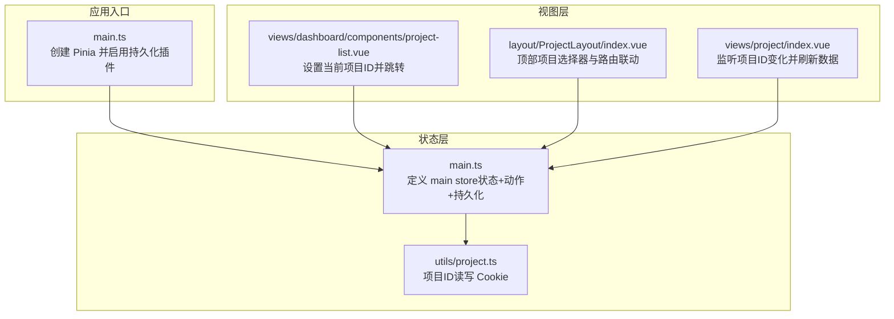
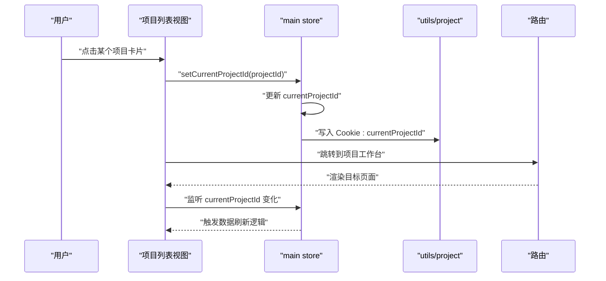
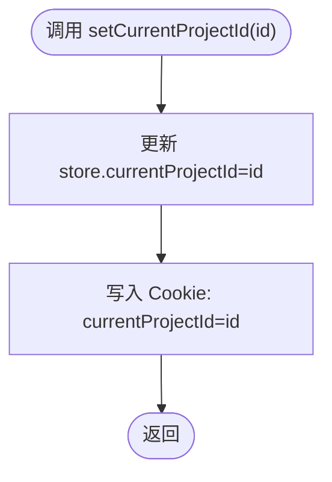
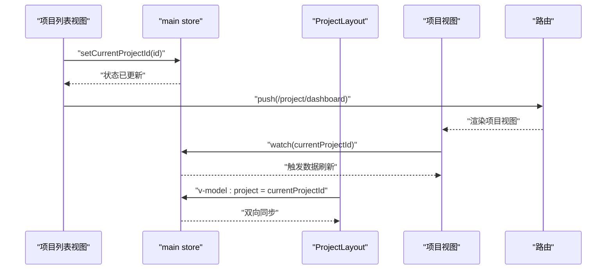
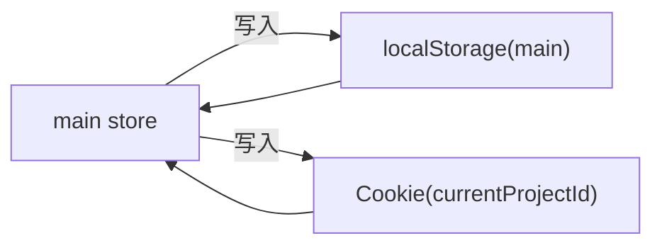
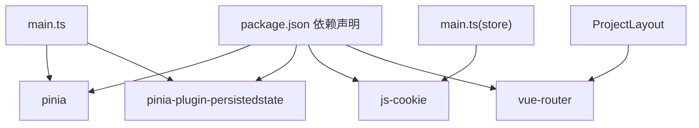

# 主状态管理

<cite>
**本文引用的文件**
- [src/stores/main.ts](file://src/stores/main.ts)
- [src/utils/project.ts](file://src/utils/project.ts)
- [src/main.ts](file://src/main.ts)
- [src/views/dashboard/components/project-list.vue](file://src/views/dashboard/components/project-list.vue)
- [src/views/project/index.vue](file://src/views/project/index.vue)
- [src/layout/ProjectLayout/index.vue](file://src/layout/ProjectLayout/index.vue)
- [src/router/index.ts](file://src/router/index.ts)
- [package.json](file://package.json)
</cite>

## 目录
1. [简介](#简介)
2. [项目结构](#项目结构)
3. [核心组件](#核心组件)
4. [架构总览](#架构总览)
5. [详细组件分析](#详细组件分析)
6. [依赖分析](#依赖分析)
7. [性能考虑](#性能考虑)
8. [故障排查指南](#故障排查指南)
9. [结论](#结论)
10. [附录](#附录)

## 简介
本文件系统性阐述主状态管理 store 的设计与实现，重点围绕以下主题：
- main store 的核心职责与设计理念
- isLoading 状态管理策略
- currentProjectId 项目切换机制与持久化
- setCurrentProjectId 方法的实现原理与数据流
- 状态变更对全局应用的影响与组件间通信
- 使用示例、最佳实践与调试技巧

## 项目结构
本项目采用 Pinia 进行状态管理，并通过插件实现本地持久化。核心状态集中在 main store 中，配合工具函数与布局组件完成跨页面的状态同步。

图表来源
- [src/main.ts](file://src/main.ts#L1-L28)
- [src/stores/main.ts](file://src/stores/main.ts#L1-L21)
- [src/utils/project.ts](file://src/utils/project.ts#L1-L10)
- [src/views/dashboard/components/project-list.vue](file://src/views/dashboard/components/project-list.vue#L1-L286)
- [src/layout/ProjectLayout/index.vue](file://src/layout/ProjectLayout/index.vue#L1-L135)
- [src/views/project/index.vue](file://src/views/project/index.vue#L1-L371)

章节来源
- [src/main.ts](file://src/main.ts#L1-L28)
- [src/stores/main.ts](file://src/stores/main.ts#L1-L21)

## 核心组件
- main store：集中管理应用级状态，包含 isLoading 与 currentProjectId；提供 setCurrentProjectId 动作以统一更新项目上下文。
- utils/project：封装项目ID的 Cookie 读写，作为跨组件共享的“第二状态源”。
- 布局与视图：通过 Pinia 状态与路由联动，实现项目切换后的数据刷新与导航跳转。

章节来源
- [src/stores/main.ts](file://src/stores/main.ts#L1-L21)
- [src/utils/project.ts](file://src/utils/project.ts#L1-L10)

## 架构总览
main store 的持久化通过 pinia-plugin-persistedstate 实现，键名为 main，存储介质为 localStorage。同时，项目ID也写入 Cookie，确保在某些场景下可被后端或同域其他脚本读取。

图表来源
- [src/views/dashboard/components/project-list.vue](file://src/views/dashboard/components/project-list.vue#L98-L101)
- [src/stores/main.ts](file://src/stores/main.ts#L10-L15)
- [src/utils/project.ts](file://src/utils/project.ts#L3-L5)
- [src/router/index.ts](file://src/router/index.ts#L40-L72)

## 详细组件分析

### main store 设计与实现
- 状态字段
  - isLoading：用于标记全局加载状态，便于统一控制加载指示器显示。
  - currentProjectId：标识当前所选项目，作为后续数据请求与界面行为的上下文依据。
- 动作
  - setCurrentProjectId：更新 currentProjectId，并调用工具函数将项目ID写入 Cookie，保证跨组件可见。
- 持久化
  - 通过 persist 配置将状态保存至 localStorage，键名为 main，重启后自动恢复。

图表来源
- [src/stores/main.ts](file://src/stores/main.ts#L10-L15)
- [src/utils/project.ts](file://src/utils/project.ts#L3-L5)

章节来源
- [src/stores/main.ts](file://src/stores/main.ts#L1-L21)

### 项目切换机制与路由联动
- 项目列表视图在用户点击项目时，调用 main store 的 setCurrentProjectId 并跳转到项目工作台。
- 项目工作台监听 mainStore.currentProjectId 的变化，从而刷新分类树与文件列表等数据。
- 布局组件提供顶部项目选择器，双向绑定 mainStore.currentProjectId，实现从 UI 直接切换项目。

图表来源
- [src/views/dashboard/components/project-list.vue](file://src/views/dashboard/components/project-list.vue#L98-L101)
- [src/views/project/index.vue](file://src/views/project/index.vue#L40-L43)
- [src/layout/ProjectLayout/index.vue](file://src/layout/ProjectLayout/index.vue#L20-L25)
- [src/router/index.ts](file://src/router/index.ts#L56-L63)

章节来源
- [src/views/dashboard/components/project-list.vue](file://src/views/dashboard/components/project-list.vue#L98-L101)
- [src/views/project/index.vue](file://src/views/project/index.vue#L40-L43)
- [src/layout/ProjectLayout/index.vue](file://src/layout/ProjectLayout/index.vue#L20-L25)
- [src/router/index.ts](file://src/router/index.ts#L40-L72)

### Cookie 与 localStorage 的协同策略
- localStorage：持久化 main store 的状态，保障应用重启后仍能恢复项目上下文。
- Cookie：单独存放 currentProjectId，便于前端与后端共享该上下文，或在多标签页场景下保持一致。

图表来源
- [src/stores/main.ts](file://src/stores/main.ts#L16-L19)
- [src/utils/project.ts](file://src/utils/project.ts#L3-L5)

章节来源
- [src/stores/main.ts](file://src/stores/main.ts#L16-L19)
- [src/utils/project.ts](file://src/utils/project.ts#L1-L10)

### 组件间通信与数据流
- 事件链路：UI 交互 → main store 动作 → 状态更新 → 视图响应式刷新。
- 跨组件共享：通过 Pinia store 共享状态，避免层层 props 下传；必要时通过 Cookie 提供额外可见性。
- 路由联动：项目切换后跳转到对应路由，目标视图基于 store 状态进行数据拉取与渲染。

章节来源
- [src/views/dashboard/components/project-list.vue](file://src/views/dashboard/components/project-list.vue#L98-L101)
- [src/views/project/index.vue](file://src/views/project/index.vue#L40-L43)
- [src/layout/ProjectLayout/index.vue](file://src/layout/ProjectLayout/index.vue#L20-L25)

## 依赖分析
- 状态管理：Pinia + pinia-plugin-persistedstate
- Cookie：js-cookie
- 路由：vue-router
- 应用入口：main.ts 注册 Pinia 插件并挂载应用

图表来源
- [package.json](file://package.json#L18-L39)
- [src/main.ts](file://src/main.ts#L1-L28)
- [src/stores/main.ts](file://src/stores/main.ts#L1-L21)
- [src/layout/ProjectLayout/index.vue](file://src/layout/ProjectLayout/index.vue#L1-L135)

章节来源
- [package.json](file://package.json#L18-L39)
- [src/main.ts](file://src/main.ts#L1-L28)

## 性能考虑
- 状态粒度：将项目上下文收敛到 main store，避免分散在多个 store，降低耦合与维护成本。
- 持久化范围：仅对 main store 启用持久化，避免不必要的存储开销。
- 响应式更新：利用 Vue 响应式系统监听 store 状态变化，按需刷新数据，减少无效渲染。
- Cookie 访问：Cookie 读写为轻量操作，但建议仅在必要时使用，避免频繁写入。

## 故障排查指南
- 问题：切换项目后页面未刷新
  - 检查项目视图是否正确监听 mainStore.currentProjectId 并触发数据刷新。
  - 章节来源
    - [src/views/project/index.vue](file://src/views/project/index.vue#L40-L43)
- 问题：项目ID未在 Cookie 中生效
  - 确认 main store 的 setCurrentProjectId 是否被调用，以及 utils/project 的 Cookie 写入逻辑是否执行。
  - 章节来源
    - [src/stores/main.ts](file://src/stores/main.ts#L10-L15)
    - [src/utils/project.ts](file://src/utils/project.ts#L3-L5)
- 问题：刷新后项目上下文丢失
  - 检查 localStorage 中是否存在键名为 main 的持久化数据。
  - 章节来源
    - [src/stores/main.ts](file://src/stores/main.ts#L16-L19)
- 问题：多标签页项目上下文不一致
  - 确保通过 main store 的 setCurrentProjectId 更新 Cookie，避免直接操作 Cookie。
  - 章节来源
    - [src/stores/main.ts](file://src/stores/main.ts#L10-L15)
    - [src/utils/project.ts](file://src/utils/project.ts#L3-L5)

## 结论
main store 通过简洁的状态模型与明确的动作边界，实现了项目上下文的统一管理与持久化。结合 Cookie 与路由联动，形成从 UI 到数据的闭环流程。建议在扩展新功能时遵循“状态收敛、动作单一、持久化最小化”的原则，以保持系统的清晰与稳定。

## 附录

### 使用示例与最佳实践
- 在项目列表视图中设置当前项目并跳转
  - 路径参考：[src/views/dashboard/components/project-list.vue](file://src/views/dashboard/components/project-list.vue#L98-L101)
- 在项目视图中监听项目ID变化并刷新数据
  - 路径参考：[src/views/project/index.vue](file://src/views/project/index.vue#L40-L43)
- 在布局组件中双向绑定项目选择器
  - 路径参考：[src/layout/ProjectLayout/index.vue](file://src/layout/ProjectLayout/index.vue#L20-L25)
- 设置 isLoading 的时机
  - 在发起网络请求前开启，在请求完成后关闭，以统一控制加载态。
  - 路径参考：[src/stores/main.ts](file://src/stores/main.ts#L5-L8)

### 状态监听与调试技巧
- 使用 Vue DevTools 或浏览器调试器观察 Pinia 状态变化，定位 setState 与动作调用。
- 在 utils/project 中检查 Cookie 是否正确写入 currentProjectId。
- 在路由守卫或视图 mounted 中打印 mainStore.currentProjectId，验证持久化恢复效果。