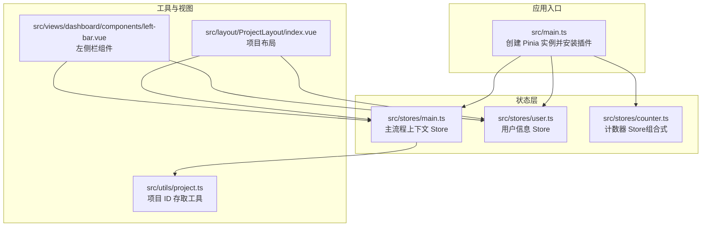
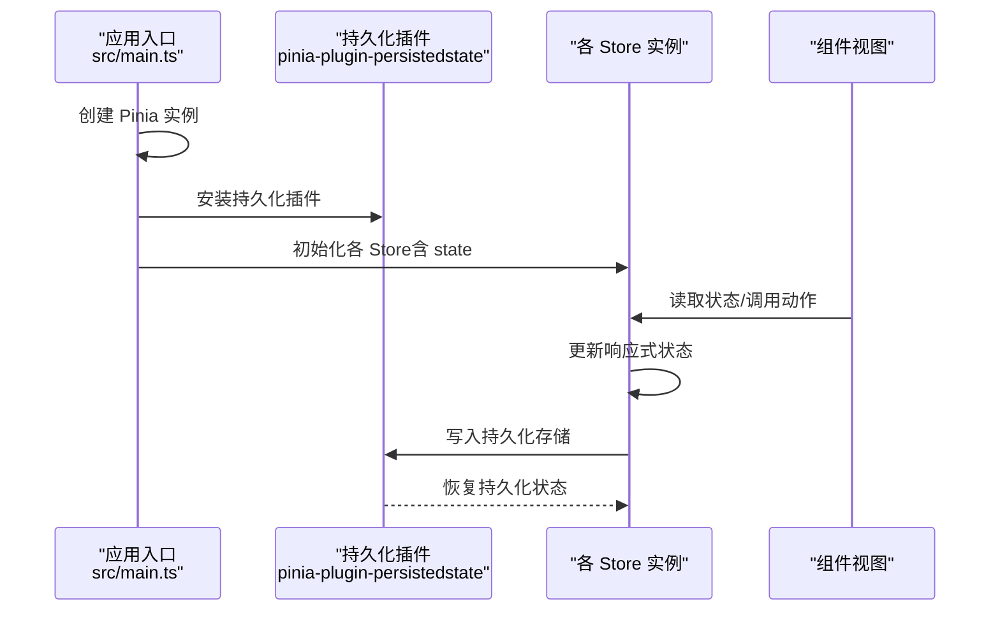
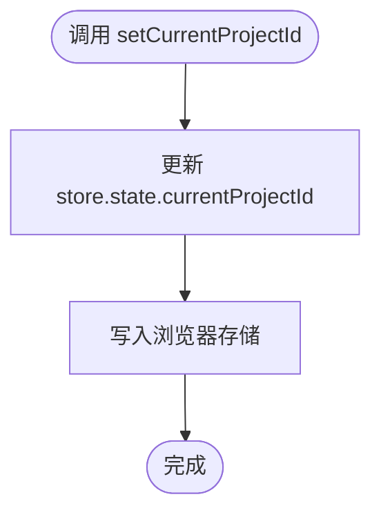
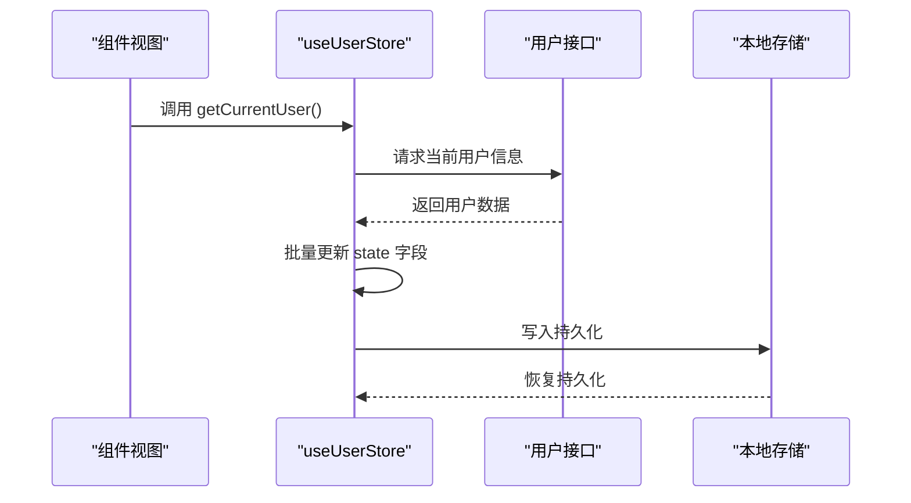
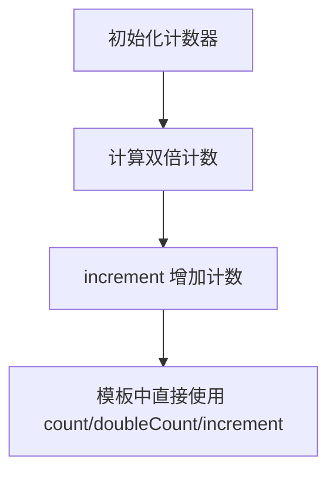
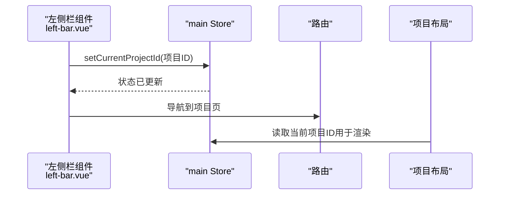
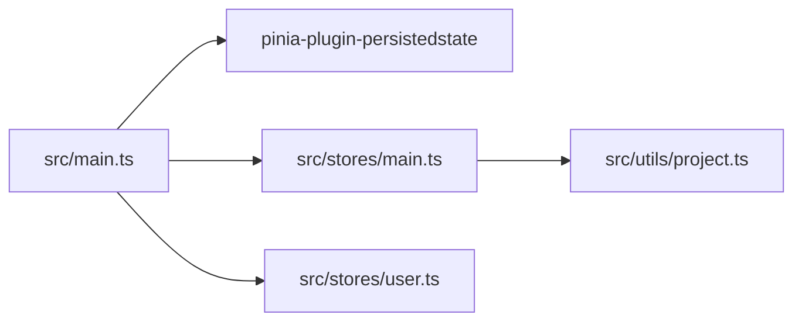

# 状态管理

<cite>
**本文引用的文件**
- [src/main.ts](file://src/main.ts)
- [package.json](file://package.json)
- [src/stores/main.ts](file://src/stores/main.ts)
- [src/stores/user.ts](file://src/stores/user.ts)
- [src/stores/counter.ts](file://src/stores/counter.ts)
- [src/utils/project.ts](file://src/utils/project.ts)
- [src/views/dashboard/components/left-bar.vue](file://src/views/dashboard/components/left-bar.vue)
- [src/layout/ProjectLayout/index.vue](file://src/layout/ProjectLayout/index.vue)
</cite>

## 目录
1. [简介](#简介)
2. [项目结构](#项目结构)
3. [核心组件](#核心组件)
4. [架构总览](#架构总览)
5. [详细组件分析](#详细组件分析)
6. [依赖分析](#依赖分析)
7. [性能考虑](#性能考虑)
8. [故障排查指南](#故障排查指南)
9. [结论](#结论)
10. [附录](#附录)

## 简介
本文件系统性梳理本项目的状态管理架构，围绕 Pinia 的设计与实现展开，重点说明以下方面：
- Store 设计模式：state、getters、actions 的职责与使用方式
- 状态持久化机制与插件配置
- 跨组件状态共享与状态同步策略
- 最佳实践与性能优化建议
- 状态流转图与使用示例（以路径代替具体代码）

## 项目结构
本项目采用基于功能模块的目录组织方式，状态相关的核心位置如下：
- 入口与插件注册：应用入口集中初始化 Pinia 并启用持久化插件
- Store 定义：按领域拆分，分别管理“主流程上下文”和“用户信息”
- 工具函数：封装与浏览器存储交互的辅助方法
- 视图层：组件通过组合式 API 使用 Store，完成跨组件状态共享

图表来源
- [src/main.ts](file://src/main.ts#L1-L28)
- [src/stores/main.ts](file://src/stores/main.ts#L1-L21)
- [src/stores/user.ts](file://src/stores/user.ts#L1-L29)
- [src/stores/counter.ts](file://src/stores/counter.ts#L1-L13)
- [src/utils/project.ts](file://src/utils/project.ts#L1-L10)
- [src/views/dashboard/components/left-bar.vue](file://src/views/dashboard/components/left-bar.vue#L1-L107)
- [src/layout/ProjectLayout/index.vue](file://src/layout/ProjectLayout/index.vue#L1-L200)

章节来源
- [src/main.ts](file://src/main.ts#L1-L28)
- [package.json](file://package.json#L1-L60)

## 核心组件
- 主流程上下文 Store（main）
  - 职责：维护当前加载状态与当前项目 ID；提供设置当前项目 ID 的动作，并同步到浏览器存储
  - 关键点：通过持久化配置将状态写入本地存储，刷新后可恢复
- 用户信息 Store（user）
  - 职责：维护用户基本信息；提供异步获取当前用户的动作
  - 关键点：通过持久化配置将用户信息写入本地存储，提升用户体验
- 计数器 Store（counter）
  - 职责：演示组合式 Store 的用法，包含响应式状态与派生状态
  - 关键点：使用 ref/computed 返回对象形式的公开 API，便于在模板中直接使用

章节来源
- [src/stores/main.ts](file://src/stores/main.ts#L1-L21)
- [src/stores/user.ts](file://src/stores/user.ts#L1-L29)
- [src/stores/counter.ts](file://src/stores/counter.ts#L1-L13)

## 架构总览
Pinia 在本项目中的整体工作流如下：
- 应用启动时创建 Pinia 实例并安装持久化插件
- 各业务 Store 定义 state/actions/persist 配置
- 组件通过组合式 API 获取 Store 实例，读取状态并在需要时触发动作
- 动作内部可进行副作用（如网络请求、存储写入），完成后由 Pinia 自动更新响应式状态

图表来源
- [src/main.ts](file://src/main.ts#L1-L28)
- [src/stores/main.ts](file://src/stores/main.ts#L1-L21)
- [src/stores/user.ts](file://src/stores/user.ts#L1-L29)

## 详细组件分析

### 主流程上下文 Store（main）
- 设计要点
  - state：包含加载状态与当前项目 ID
  - actions：提供设置当前项目 ID 的动作，内部同时更新状态并写入浏览器存储
  - persist：配置持久化键与存储介质
- 使用场景
  - 切换项目时更新当前项目 ID，并保持在页面刷新后仍可识别
- 状态同步策略
  - 动作内同步更新状态与外部存储，避免 UI 与存储不一致

图表来源
- [src/stores/main.ts](file://src/stores/main.ts#L10-L15)
- [src/utils/project.ts](file://src/utils/project.ts#L1-L10)

章节来源
- [src/stores/main.ts](file://src/stores/main.ts#L1-L21)
- [src/utils/project.ts](file://src/utils/project.ts#L1-L10)

### 用户信息 Store（user）
- 设计要点
  - state：包含用户名、昵称、邮箱、头像等字段
  - actions：提供异步获取当前用户信息的动作，成功后批量更新 state
  - persist：开启持久化，确保用户信息在刷新后可用
- 使用场景
  - 登录后拉取用户资料并在头部或侧边栏展示昵称等信息
- 状态同步策略
  - 动作内统一更新多个字段，减少多次渲染抖动

图表来源
- [src/stores/user.ts](file://src/stores/user.ts#L11-L20)

章节来源
- [src/stores/user.ts](file://src/stores/user.ts#L1-L29)

### 计数器 Store（counter）
- 设计要点
  - 组合式 Store：返回 ref/computed/函数作为公开 API
  - 适合轻量、局部的状态逻辑，无需复杂持久化
- 使用场景
  - 展示双倍计数值、按钮点击递增等演示用途

图表来源
- [src/stores/counter.ts](file://src/stores/counter.ts#L4-L12)

章节来源
- [src/stores/counter.ts](file://src/stores/counter.ts#L1-L13)

### 跨组件状态共享与同步
- 共享策略
  - 组件通过组合式 API 获取 Store 实例，直接读取状态并在模板中绑定
  - 通过动作集中处理副作用，保证状态变更路径清晰
- 同步策略
  - 主流程上下文 Store 的动作会同步更新状态与浏览器存储，确保 UI 与持久化一致
  - 用户信息 Store 的动作在获取到新数据后批量更新，避免中间态

图表来源
- [src/views/dashboard/components/left-bar.vue](file://src/views/dashboard/components/left-bar.vue#L17-L25)
- [src/layout/ProjectLayout/index.vue](file://src/layout/ProjectLayout/index.vue#L1-L200)
- [src/stores/main.ts](file://src/stores/main.ts#L10-L15)

章节来源
- [src/views/dashboard/components/left-bar.vue](file://src/views/dashboard/components/left-bar.vue#L1-L107)
- [src/layout/ProjectLayout/index.vue](file://src/layout/ProjectLayout/index.vue#L1-L200)

## 依赖分析
- 插件依赖
  - 应用入口安装持久化插件，使所有 Store 的 persist 配置生效
- 外部依赖
  - 浏览器存储：localStorage 用于持久化；Cookies 用于项目 ID 的跨会话标识
- 组件耦合
  - 组件对 Store 的依赖为单向读写，动作内部负责副作用与状态更新，降低耦合度

图表来源
- [src/main.ts](file://src/main.ts#L1-L28)
- [src/stores/main.ts](file://src/stores/main.ts#L16-L20)
- [src/stores/user.ts](file://src/stores/user.ts#L22-L26)
- [src/utils/project.ts](file://src/utils/project.ts#L1-L10)

章节来源
- [package.json](file://package.json#L30-L31)
- [src/main.ts](file://src/main.ts#L1-L28)

## 性能考虑
- 减少不必要的响应式开销
  - 对于简单标量或小对象，优先使用组合式 Store 返回值，避免深层嵌套导致的过度追踪
- 批量更新状态
  - 在动作中一次性更新多个字段，减少多次渲染
- 合理使用持久化
  - 仅对必要字段开启持久化，避免存储过多数据造成体积膨胀
- 异步动作的节流与防抖
  - 对频繁触发的动作（如搜索、滚动）考虑节流/防抖，降低请求频率

## 故障排查指南
- 现象：刷新后状态未恢复
  - 排查项：确认持久化插件是否正确安装；检查各 Store 的 persist 配置键名与存储介质
  - 参考路径：[应用入口安装插件](file://src/main.ts#L22-L24)、[main Store 持久化配置](file://src/stores/main.ts#L16-L20)、[user Store 持久化配置](file://src/stores/user.ts#L22-L26)
- 现象：切换项目后 UI 未更新
  - 排查项：确认动作是否被调用；检查动作内部是否正确更新状态与存储
  - 参考路径：[main Store 动作实现](file://src/stores/main.ts#L10-L15)、[组件调用动作](file://src/views/dashboard/components/left-bar.vue#L22-L25)
- 现象：用户信息未显示
  - 排查项：确认是否调用了获取用户信息的动作；检查接口返回与字段映射
  - 参考路径：[user Store 动作实现](file://src/stores/user.ts#L11-L20)、[组件读取用户信息](file://src/views/dashboard/components/left-bar.vue#L87-L88)

章节来源
- [src/main.ts](file://src/main.ts#L22-L24)
- [src/stores/main.ts](file://src/stores/main.ts#L10-L15)
- [src/stores/user.ts](file://src/stores/user.ts#L11-L20)
- [src/views/dashboard/components/left-bar.vue](file://src/views/dashboard/components/left-bar.vue#L22-L25)

## 结论
本项目采用 Pinia 进行状态管理，结合持久化插件实现了跨页面的状态恢复能力。通过明确划分 Store 的职责（状态、动作、持久化），配合组件层的组合式 API 使用，形成了清晰、可维护且具备良好性能表现的状态管理架构。建议在后续迭代中继续遵循“动作集中处理副作用、批量更新状态、按需持久化”的原则，持续优化用户体验与开发效率。

## 附录
- 使用示例（以路径代替代码）
  - 在组件中使用 main Store 设置当前项目 ID：[组件调用示例](file://src/views/dashboard/components/left-bar.vue#L22-L25)
  - 在布局中读取当前项目 ID：[布局读取示例](file://src/layout/ProjectLayout/index.vue#L1-L200)
  - 在组件中使用 user Store 读取用户信息：[组件读取示例](file://src/views/dashboard/components/left-bar.vue#L87-L88)
  - 在组件中使用 counter Store：[组合式 Store 示例](file://src/stores/counter.ts#L4-L12)