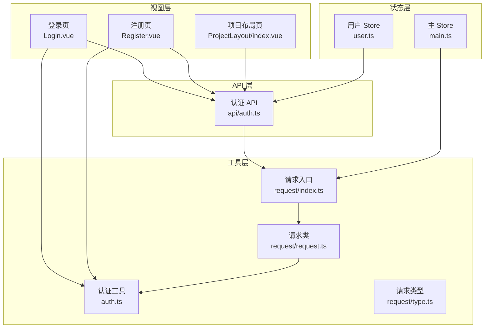
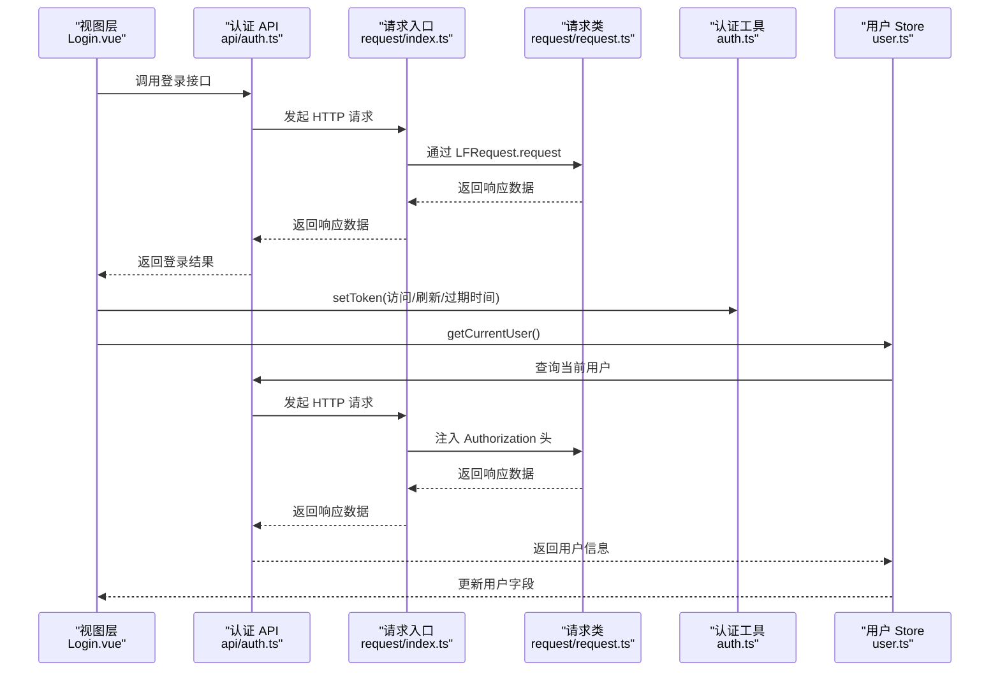
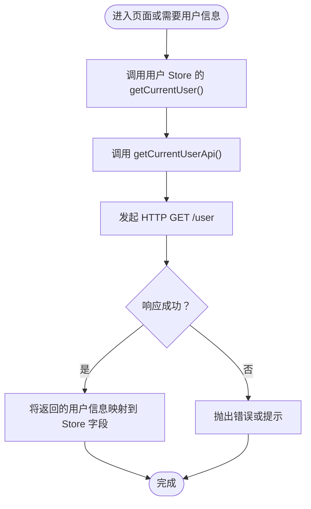
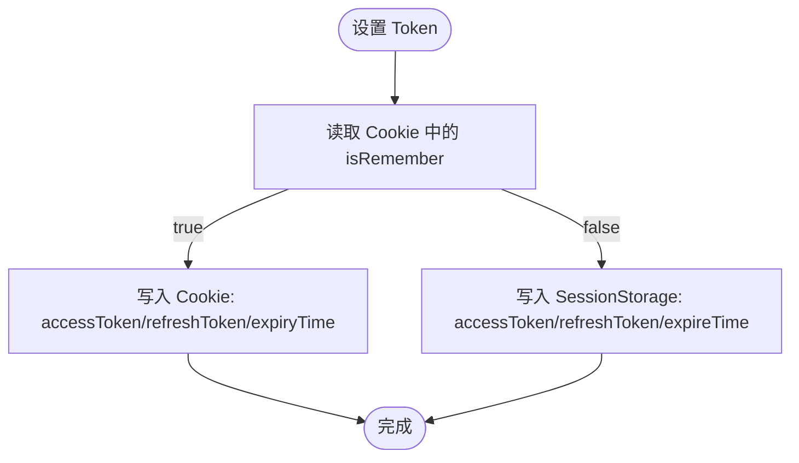
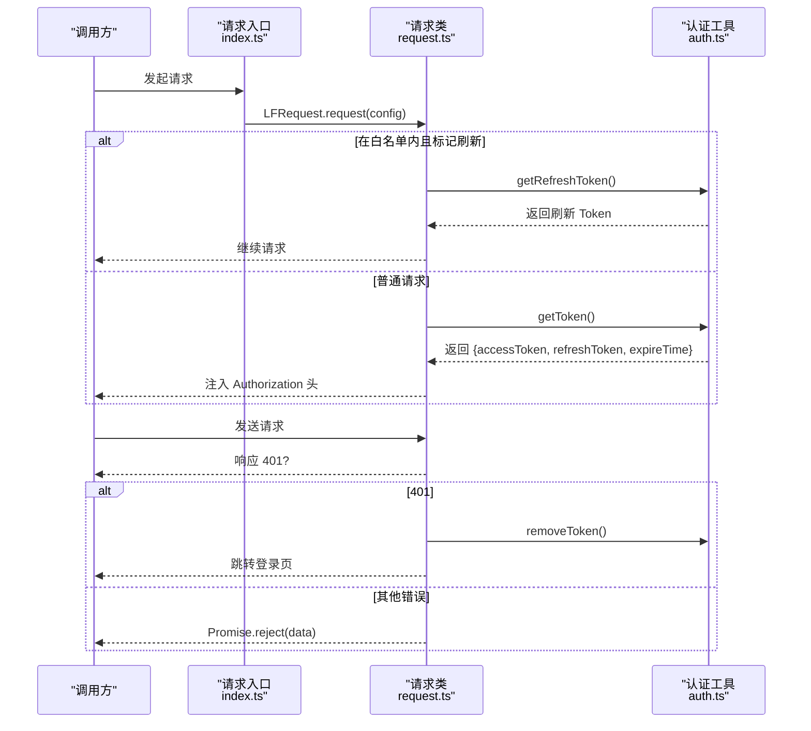
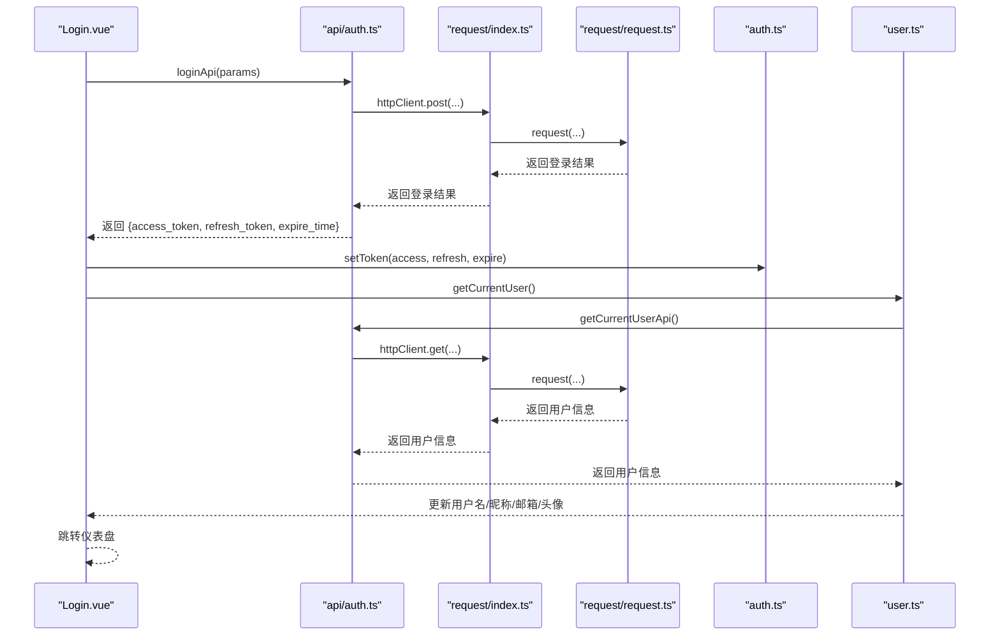
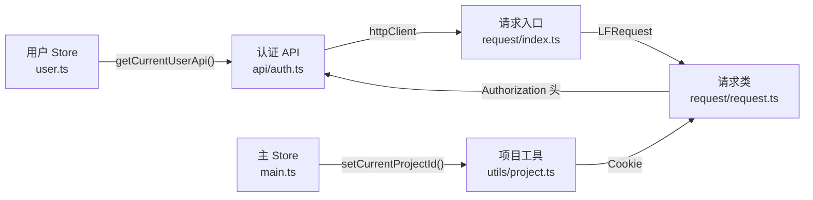
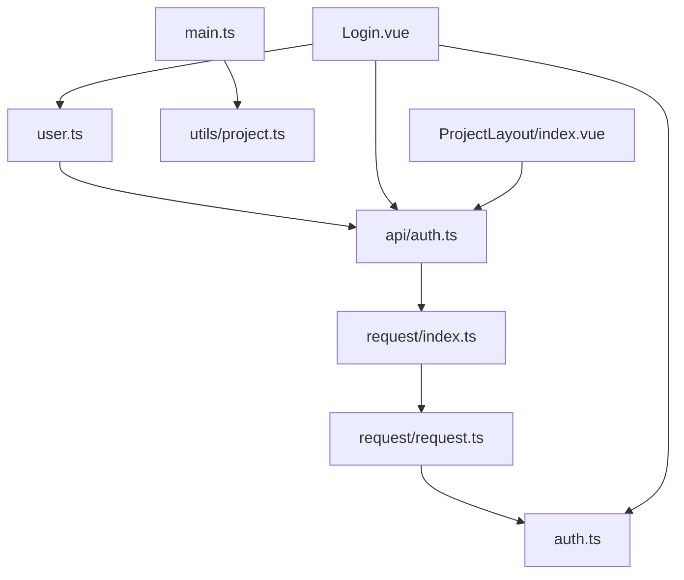

# 用户状态管理

<cite>
**本文引用的文件**
- [src/stores/user.ts](file://src/stores/user.ts)
- [src/utils/auth.ts](file://src/utils/auth.ts)
- [src/api/auth.ts](file://src/api/auth.ts)
- [src/utils/request/index.ts](file://src/utils/request/index.ts)
- [src/utils/request/request.ts](file://src/utils/request/request.ts)
- [src/utils/request/type.ts](file://src/utils/request/type.ts)
- [src/views/auth/Login.vue](file://src/views/auth/Login.vue)
- [src/views/auth/Register.vue](file://src/views/auth/Register.vue)
- [src/router/index.ts](file://src/router/index.ts)
- [src/stores/main.ts](file://src/stores/main.ts)
- [src/utils/project.ts](file://src/utils/project.ts)
- [src/layout/ProjectLayout/index.vue](file://src/layout/ProjectLayout/index.vue)
- [src/types/loginTypes.ts](file://src/types/loginTypes.ts)
</cite>

## 目录
1. [简介](#简介)
2. [项目结构](#项目结构)
3. [核心组件](#核心组件)
4. [架构总览](#架构总览)
5. [详细组件分析](#详细组件分析)
6. [依赖分析](#依赖分析)
7. [性能考虑](#性能考虑)
8. [故障排查指南](#故障排查指南)
9. [结论](#结论)
10. [附录：使用示例与最佳实践](#附录使用示例与最佳实践)

## 简介
本文件聚焦于用户状态管理 Store 的设计与实现，覆盖以下主题：
- 用户认证状态的管理机制：登录状态、权限信息与会话管理
- 用户信息的存储结构与数据流转过程
- 认证 Token 的处理方式与自动续期机制
- 用户状态与其他 Store 的交互关系与状态同步策略
- 使用示例与常见错误处理方案

## 项目结构
围绕用户状态管理的关键模块如下：
- Pinia Store：用户信息 Store（持久化到 localStorage），主应用 Store（项目上下文）
- 工具层：认证 Token 管理（Cookie/SessionStorage 双栈）
- 请求层：统一请求封装与拦截器（鉴权头注入、401 处理）
- 视图层：登录/注册页面与布局页（触发登录流程、登出）
- 类型定义：登录/注册参数与返回体类型

图表来源
- [src/views/auth/Login.vue](file://src/views/auth/Login.vue#L1-L138)
- [src/views/auth/Register.vue](file://src/views/auth/Register.vue#L1-L137)
- [src/layout/ProjectLayout/index.vue](file://src/layout/ProjectLayout/index.vue#L44-L86)
- [src/stores/user.ts](file://src/stores/user.ts#L1-L29)
- [src/stores/main.ts](file://src/stores/main.ts#L1-L21)
- [src/utils/auth.ts](file://src/utils/auth.ts#L1-L71)
- [src/utils/request/index.ts](file://src/utils/request/index.ts#L1-L40)
- [src/utils/request/request.ts](file://src/utils/request/request.ts#L1-L99)
- [src/utils/request/type.ts](file://src/utils/request/type.ts#L1-L15)
- [src/api/auth.ts](file://src/api/auth.ts#L1-L41)

章节来源
- [src/stores/user.ts](file://src/stores/user.ts#L1-L29)
- [src/stores/main.ts](file://src/stores/main.ts#L1-L21)
- [src/utils/auth.ts](file://src/utils/auth.ts#L1-L71)
- [src/utils/request/index.ts](file://src/utils/request/index.ts#L1-L40)
- [src/utils/request/request.ts](file://src/utils/request/request.ts#L1-L99)
- [src/utils/request/type.ts](file://src/utils/request/type.ts#L1-L15)
- [src/api/auth.ts](file://src/api/auth.ts#L1-L41)
- [src/views/auth/Login.vue](file://src/views/auth/Login.vue#L1-L138)
- [src/views/auth/Register.vue](file://src/views/auth/Register.vue#L1-L137)
- [src/layout/ProjectLayout/index.vue](file://src/layout/ProjectLayout/index.vue#L44-L86)
- [src/router/index.ts](file://src/router/index.ts#L1-L82)
- [src/utils/project.ts](file://src/utils/project.ts#L1-L9)
- [src/types/loginTypes.ts](file://src/types/loginTypes.ts#L1-L47)

## 核心组件
- 用户 Store（Pinia）：负责用户基本信息（用户名、昵称、邮箱、头像）的状态读写与持久化；提供“获取当前用户”动作以拉取后端最新信息。
- 认证工具（auth.ts）：统一封装访问令牌、刷新令牌与过期时间的设置、读取与移除逻辑；根据“记住我”选项在 Cookie 与 SessionStorage 之间切换。
- 请求封装（request/index.ts + request.ts）：全局请求拦截器在请求前注入 Authorization 头；在响应 401 时清理 Token 并跳转登录页。
- 认证 API（api/auth.ts）：封装登录、注册、登出、查询当前用户等接口。
- 登录/注册视图（Login.vue、Register.vue）：表单校验、调用登录/注册 API、设置 Token、拉取用户信息并跳转。

章节来源
- [src/stores/user.ts](file://src/stores/user.ts#L1-L29)
- [src/utils/auth.ts](file://src/utils/auth.ts#L1-L71)
- [src/utils/request/index.ts](file://src/utils/request/index.ts#L1-L40)
- [src/utils/request/request.ts](file://src/utils/request/request.ts#L1-L99)
- [src/api/auth.ts](file://src/api/auth.ts#L1-L41)
- [src/views/auth/Login.vue](file://src/views/auth/Login.vue#L1-L138)
- [src/views/auth/Register.vue](file://src/views/auth/Register.vue#L1-L137)

## 架构总览
下图展示从登录到用户信息加载、鉴权头注入与 401 处理的完整链路。

图表来源
- [src/views/auth/Login.vue](file://src/views/auth/Login.vue#L38-L80)
- [src/api/auth.ts](file://src/api/auth.ts#L7-L40)
- [src/utils/request/index.ts](file://src/utils/request/index.ts#L12-L39)
- [src/utils/request/request.ts](file://src/utils/request/request.ts#L17-L51)
- [src/utils/auth.ts](file://src/utils/auth.ts#L12-L24)
- [src/stores/user.ts](file://src/stores/user.ts#L12-L19)

## 详细组件分析

### 用户 Store（用户状态持久化与拉取）
- 状态字段：用户名、昵称、邮箱、头像
- 动作：getCurrentUser 异步拉取当前用户信息并更新本地状态
- 持久化：启用持久化，键名为 user，存储介质为 localStorage

图表来源
- [src/stores/user.ts](file://src/stores/user.ts#L12-L19)
- [src/api/auth.ts](file://src/api/auth.ts#L36-L40)

章节来源
- [src/stores/user.ts](file://src/stores/user.ts#L1-L29)
- [src/api/auth.ts](file://src/api/auth.ts#L36-L40)

### 认证 Token 管理（访问/刷新/过期时间）
- 存储策略：根据“记住我”选项选择 Cookie 或 SessionStorage
- 读取策略：统一 getToken/getRefreshToken 接口，内部根据 isRemember 决策
- 清理策略：removeToken 同时清理 Cookie 与 SessionStorage 中的令牌与过期时间

图表来源
- [src/utils/auth.ts](file://src/utils/auth.ts#L12-L24)

章节来源
- [src/utils/auth.ts](file://src/utils/auth.ts#L1-L71)

### 请求拦截与鉴权头注入
- 白名单：登录/注册接口不强制携带 Authorization
- 正常请求：从认证工具读取访问令牌并注入 Authorization: Bearer {token}
- 401 响应：清理 Token、提示错误并跳转登录页
- 项目上下文：在请求头中注入 X-Project-Id（来自项目 Cookie）

图表来源
- [src/utils/request/index.ts](file://src/utils/request/index.ts#L12-L39)
- [src/utils/request/request.ts](file://src/utils/request/request.ts#L26-L40)
- [src/utils/auth.ts](file://src/utils/auth.ts#L29-L44)

章节来源
- [src/utils/request/index.ts](file://src/utils/request/index.ts#L1-L40)
- [src/utils/request/request.ts](file://src/utils/request/request.ts#L1-L99)
- [src/utils/auth.ts](file://src/utils/auth.ts#L1-L71)

### 登录流程（含用户信息拉取）
- 表单校验通过后调用登录 API
- 成功后 setToken 写入访问/刷新/过期时间
- 调用用户 Store 的 getCurrentUser 拉取用户信息
- 跳转到仪表盘

图表来源
- [src/views/auth/Login.vue](file://src/views/auth/Login.vue#L38-L80)
- [src/api/auth.ts](file://src/api/auth.ts#L7-L40)
- [src/utils/request/index.ts](file://src/utils/request/index.ts#L12-L39)
- [src/utils/request/request.ts](file://src/utils/request/request.ts#L17-L51)
- [src/utils/auth.ts](file://src/utils/auth.ts#L12-L24)
- [src/stores/user.ts](file://src/stores/user.ts#L12-L19)

章节来源
- [src/views/auth/Login.vue](file://src/views/auth/Login.vue#L1-L138)
- [src/api/auth.ts](file://src/api/auth.ts#L1-L41)
- [src/utils/request/index.ts](file://src/utils/request/index.ts#L1-L40)
- [src/utils/request/request.ts](file://src/utils/request/request.ts#L1-L99)
- [src/utils/auth.ts](file://src/utils/auth.ts#L1-L71)
- [src/stores/user.ts](file://src/stores/user.ts#L1-L29)

### 注册流程
- 表单校验通过后调用注册 API
- 成功后提示注册成功并跳转登录页

章节来源
- [src/views/auth/Register.vue](file://src/views/auth/Register.vue#L1-L137)
- [src/api/auth.ts](file://src/api/auth.ts#L17-L22)

### 登出流程
- 调用登出 API
- 成功后提示并跳转登录页

章节来源
- [src/layout/ProjectLayout/index.vue](file://src/layout/ProjectLayout/index.vue#L44-L51)
- [src/api/auth.ts](file://src/api/auth.ts#L27-L31)

### 用户状态与其他 Store 的交互
- 用户 Store 与请求层：用户信息拉取依赖请求封装，请求拦截器自动注入 Authorization 头
- 主 Store 与项目上下文：主 Store 提供当前项目 ID，请求层注入 X-Project-Id；同时通过工具函数持久化到 Cookie
- 登录页与用户 Store：登录成功后立即拉取用户信息，确保 UI 与后端一致

图表来源
- [src/stores/user.ts](file://src/stores/user.ts#L12-L19)
- [src/api/auth.ts](file://src/api/auth.ts#L36-L40)
- [src/utils/request/index.ts](file://src/utils/request/index.ts#L12-L39)
- [src/utils/request/request.ts](file://src/utils/request/request.ts#L23-L31)
- [src/stores/main.ts](file://src/stores/main.ts#L10-L14)
- [src/utils/project.ts](file://src/utils/project.ts#L3-L8)

章节来源
- [src/stores/user.ts](file://src/stores/user.ts#L1-L29)
- [src/stores/main.ts](file://src/stores/main.ts#L1-L21)
- [src/utils/project.ts](file://src/utils/project.ts#L1-L9)
- [src/utils/request/index.ts](file://src/utils/request/index.ts#L1-L40)
- [src/utils/request/request.ts](file://src/utils/request/request.ts#L1-L99)
- [src/api/auth.ts](file://src/api/auth.ts#L1-L41)

## 依赖分析
- 用户 Store 依赖认证 API 与请求封装
- 认证工具被请求入口与视图层共同依赖
- 请求类依赖认证工具以读取 Token
- 主 Store 依赖项目工具以维护项目上下文

图表来源
- [src/stores/user.ts](file://src/stores/user.ts#L1-L29)
- [src/api/auth.ts](file://src/api/auth.ts#L1-L41)
- [src/utils/request/index.ts](file://src/utils/request/index.ts#L1-L40)
- [src/utils/request/request.ts](file://src/utils/request/request.ts#L1-L99)
- [src/utils/auth.ts](file://src/utils/auth.ts#L1-L71)
- [src/stores/main.ts](file://src/stores/main.ts#L1-L21)
- [src/utils/project.ts](file://src/utils/project.ts#L1-L9)
- [src/views/auth/Login.vue](file://src/views/auth/Login.vue#L1-L138)
- [src/layout/ProjectLayout/index.vue](file://src/layout/ProjectLayout/index.vue#L44-L86)

章节来源
- [src/stores/user.ts](file://src/stores/user.ts#L1-L29)
- [src/stores/main.ts](file://src/stores/main.ts#L1-L21)
- [src/utils/auth.ts](file://src/utils/auth.ts#L1-L71)
- [src/utils/request/index.ts](file://src/utils/request/index.ts#L1-L40)
- [src/utils/request/request.ts](file://src/utils/request/request.ts#L1-L99)
- [src/api/auth.ts](file://src/api/auth.ts#L1-L41)
- [src/views/auth/Login.vue](file://src/views/auth/Login.vue#L1-L138)
- [src/layout/ProjectLayout/index.vue](file://src/layout/ProjectLayout/index.vue#L44-L86)
- [src/utils/project.ts](file://src/utils/project.ts#L1-L9)

## 性能考虑
- Token 存储选择：记住我场景使用 Cookie，非记住我使用 SessionStorage，避免不必要的持久化开销
- 请求拦截：仅在必要时注入 Authorization 头，减少无效请求头带来的解析成本
- 用户信息拉取：仅在登录成功后主动拉取一次，避免频繁重复请求
- 项目上下文：通过 Cookie 缓存当前项目 ID，减少跨页面切换时的重复计算

## 故障排查指南
- 登录后仍提示未登录
  - 检查是否正确调用 setToken 写入访问/刷新/过期时间
  - 检查请求拦截器是否注入 Authorization 头
  - 检查 401 处理逻辑是否触发了 Token 清理与跳转
- 用户信息未更新
  - 确认登录成功后是否调用了用户 Store 的 getCurrentUser
  - 确认后端返回的用户字段与 Store 字段映射一致
- 登出后仍可访问受保护资源
  - 确认登出 API 是否成功
  - 确认请求拦截器在 401 时是否执行了 removeToken 并跳转登录页

章节来源
- [src/utils/auth.ts](file://src/utils/auth.ts#L63-L70)
- [src/utils/request/request.ts](file://src/utils/request/request.ts#L31-L39)
- [src/stores/user.ts](file://src/stores/user.ts#L12-L19)
- [src/api/auth.ts](file://src/api/auth.ts#L27-L31)

## 结论
本项目采用 Pinia Store 管理用户状态，结合统一的请求拦截与认证工具，实现了清晰的登录态管理与鉴权流程。用户信息通过登录后的一次性拉取完成初始化，请求层自动注入 Authorization 头并在 401 时进行兜底处理。整体架构具备良好的可维护性与扩展性，便于后续引入权限控制与自动续期机制。

## 附录：使用示例与最佳实践
- 在登录页中使用
  - 表单校验通过后调用登录 API
  - 登录成功后调用 setToken 写入 Token
  - 调用用户 Store 的 getCurrentUser 拉取用户信息
  - 跳转到仪表盘
- 在受保护路由中使用
  - 通过请求拦截器自动注入 Authorization 头
  - 若收到 401，自动清理 Token 并跳转登录页
- 在布局页中使用
  - 登出时调用登出 API，成功后跳转登录页
- 最佳实践
  - 明确区分“记住我”与非“记住我”的存储策略
  - 对关键状态（用户信息、项目上下文）进行必要的持久化
  - 在登录成功后立即拉取用户信息，保证 UI 与后端一致
  - 对 Token 的读取与清理进行集中管理，避免分散逻辑

章节来源
- [src/views/auth/Login.vue](file://src/views/auth/Login.vue#L38-L80)
- [src/utils/request/index.ts](file://src/utils/request/index.ts#L16-L36)
- [src/utils/request/request.ts](file://src/utils/request/request.ts#L31-L39)
- [src/layout/ProjectLayout/index.vue](file://src/layout/ProjectLayout/index.vue#L44-L51)
- [src/stores/user.ts](file://src/stores/user.ts#L12-L19)
- [src/utils/auth.ts](file://src/utils/auth.ts#L12-L24)