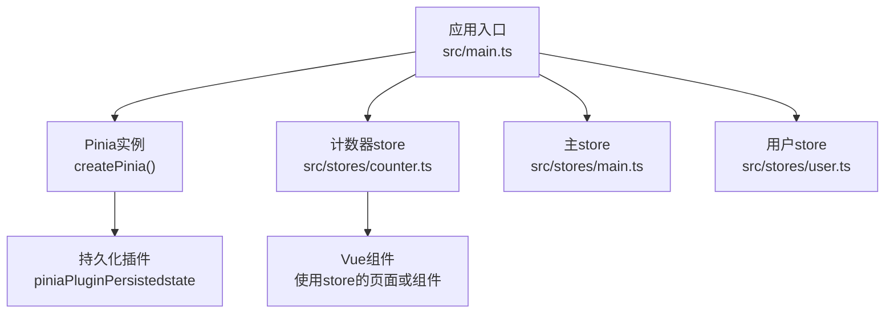
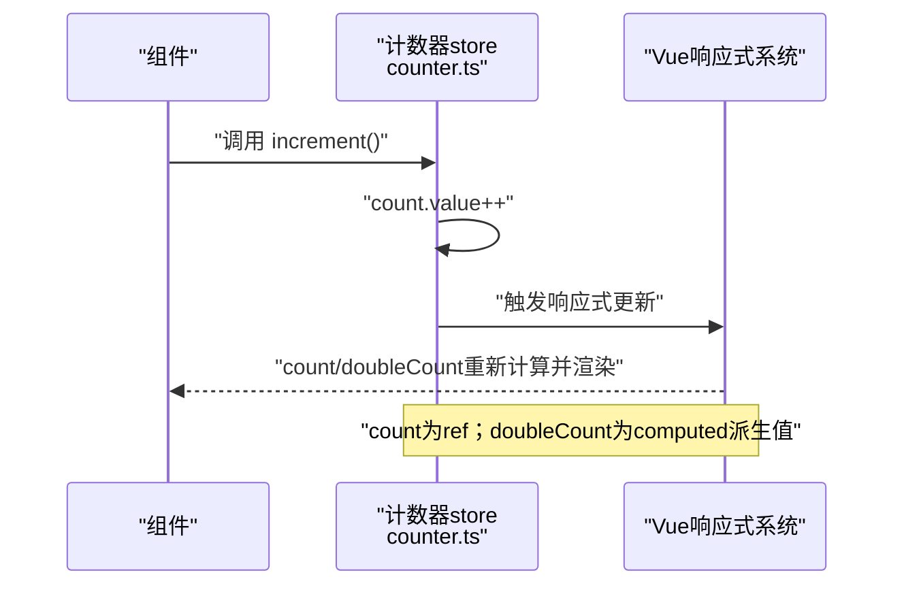
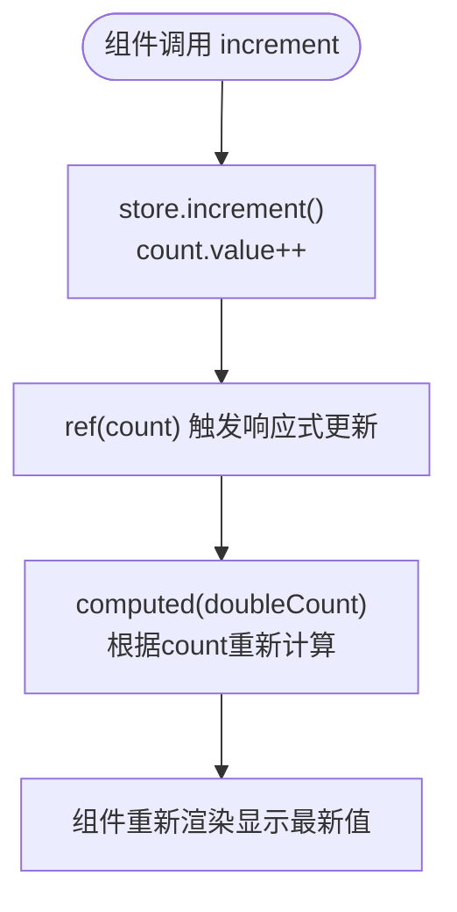
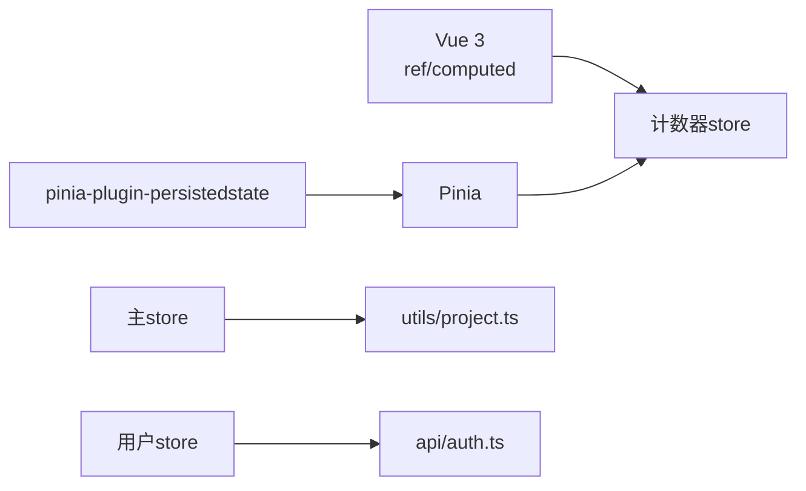

# 计数器状态管理

<cite>
**本文档引用的文件**
- [src/stores/counter.ts](file://src/stores/counter.ts)
- [src/stores/main.ts](file://src/stores/main.ts)
- [src/stores/user.ts](file://src/stores/user.ts)
- [src/main.ts](file://src/main.ts)
- [package.json](file://package.json)
- [src/utils/project.ts](file://src/utils/project.ts)
- [src/views/dashboard/index.vue](file://src/views/dashboard/index.vue)
</cite>

## 目录
1. [简介](#简介)
2. [项目结构](#项目结构)
3. [核心组件](#核心组件)
4. [架构总览](#架构总览)
5. [详细组件分析](#详细组件分析)
6. [依赖关系分析](#依赖关系分析)
7. [性能考虑](#性能考虑)
8. [故障排除指南](#故障排除指南)
9. [结论](#结论)
10. [附录](#附录)

## 简介
本文件围绕项目中的计数器状态管理store进行系统化说明，目标包括：
- 解释计数器store的基本实现与使用场景
- 阐述state、getters、actions在计数器中的对应实现与调用方式
- 说明计数器状态在组件中的使用方法与响应式更新机制
- 提供扩展思路与自定义配置选项
- 给出实际代码示例路径与测试方法建议

计数器store采用函数式store（也称组合式store）风格，基于Pinia与Vue 3的响应式系统，通过ref与computed实现状态与派生状态，通过返回对象暴露给组件使用。

## 项目结构
计数器store位于src/stores目录下，应用入口在src/main.ts中初始化Pinia并启用持久化插件。其他store如main与user展示了不同风格（Options API风格）的store实现，可作为对比参考。

图表来源
- [src/main.ts](file://src/main.ts#L1-L28)
- [src/stores/counter.ts](file://src/stores/counter.ts#L1-L13)
- [src/stores/main.ts](file://src/stores/main.ts#L1-L21)
- [src/stores/user.ts](file://src/stores/user.ts#L1-L29)

章节来源
- [src/main.ts](file://src/main.ts#L1-L28)
- [package.json](file://package.json#L18-L39)

## 核心组件
- 计数器store：提供基础计数状态count、派生状态doubleCount与动作increment，采用组合式API风格。
- 主store：展示Options API风格的state、actions与持久化配置，可作为复杂业务store的参考模板。
- 用户store：展示异步actions与数据映射，体现真实业务场景下的store写法。

章节来源
- [src/stores/counter.ts](file://src/stores/counter.ts#L1-L13)
- [src/stores/main.ts](file://src/stores/main.ts#L1-L21)
- [src/stores/user.ts](file://src/stores/user.ts#L1-L29)

## 架构总览
计数器store在应用中的交互流程如下：

图表来源
- [src/stores/counter.ts](file://src/stores/counter.ts#L4-L12)

## 详细组件分析

### 计数器store实现与使用
- 状态（state）
  - 基础状态：count为ref(0)，代表当前计数值
- 派生状态（getters）
  - 双倍计数：doubleCount通过computed从count派生，值为count*2
- 动作（actions）
  - 自增：increment函数对count进行递增
- 返回值
  - store返回count、doubleCount与increment，供组件直接解构使用

组件使用要点
- 在组件setup中通过解构使用store返回的状态与方法
- 由于count为ref，组件可直接读取count.value并触发响应式更新
- doubleCount为只读派生值，无需手动调用，随count变化自动更新

图表来源
- [src/stores/counter.ts](file://src/stores/counter.ts#L4-L12)

章节来源
- [src/stores/counter.ts](file://src/stores/counter.ts#L1-L13)

### 主store与用户store对比参考
- 主store（Options API风格）
  - state定义isLoading与currentProjectId
  - actions中setCurrentProjectId同时更新store状态并写入本地存储
  - 使用persist配置实现持久化
- 用户store（Options API风格）
  - state定义用户基本信息字段
  - actions中getCurrentUser异步获取用户信息并映射到state
  - 使用persist配置实现持久化

这些实现展示了不同store风格与持久化策略，便于在复杂业务中选择合适模式。

章节来源
- [src/stores/main.ts](file://src/stores/main.ts#L1-L21)
- [src/stores/user.ts](file://src/stores/user.ts#L1-L29)
- [src/utils/project.ts](file://src/utils/project.ts#L1-L9)

### 应用入口与持久化配置
- 应用入口创建Pinia实例并安装piniaPluginPersistedstate插件
- 插件启用后，store可通过persist配置实现状态持久化
- 该配置对所有store生效，包括计数器store（若需要持久化）

章节来源
- [src/main.ts](file://src/main.ts#L1-L28)
- [package.json](file://package.json#L30-L31)

## 依赖关系分析
- 计数器store依赖
  - Pinia：defineStore用于定义store
  - Vue：ref与computed提供响应式能力
- 应用入口依赖
  - Pinia与pinia-plugin-persistedstate：提供状态管理与持久化能力
- 其他store依赖
  - main与user store依赖utils与api模块以实现业务逻辑

图表来源
- [src/stores/counter.ts](file://src/stores/counter.ts#L1-L13)
- [src/main.ts](file://src/main.ts#L1-L28)
- [src/stores/main.ts](file://src/stores/main.ts#L1-L21)
- [src/stores/user.ts](file://src/stores/user.ts#L1-L29)
- [src/utils/project.ts](file://src/utils/project.ts#L1-L9)

章节来源
- [src/stores/counter.ts](file://src/stores/counter.ts#L1-L13)
- [src/main.ts](file://src/main.ts#L1-L28)
- [src/stores/main.ts](file://src/stores/main.ts#L1-L21)
- [src/stores/user.ts](file://src/stores/user.ts#L1-L29)

## 性能考虑
- 使用ref与computed的组合式store在小规模状态管理中具备良好性能与简洁性
- 对于需要持久化的store，合理设置persist的key与storage，避免不必要的大对象频繁序列化
- 复杂业务store可参考Options API风格，将状态与动作分离，提升可维护性

## 故障排除指南
- 症状：组件无法响应计数变化
  - 排查：确认在组件中正确解构并使用count与increment
  - 参考：计数器store返回值结构
- 症状：刷新后计数丢失
  - 排查：确认是否需要持久化，如需可在store中添加persist配置
  - 参考：主store与用户store的persist配置方式
- 症状：异步操作未更新状态
  - 排查：确保actions内对this.state进行赋值，或在组合式store中对返回的ref进行修改

章节来源
- [src/stores/counter.ts](file://src/stores/counter.ts#L1-L13)
- [src/stores/main.ts](file://src/stores/main.ts#L16-L20)
- [src/stores/user.ts](file://src/stores/user.ts#L22-L26)

## 结论
计数器store以最小实现展示了Pinia在Vue 3中的基本用法：通过ref管理状态、computed派生状态、返回对象供组件使用。结合持久化插件，可满足简单到中等复杂度的状态管理需求。对于更复杂的业务场景，可参考主store与用户store的实现方式，选择合适的store风格与持久化策略。

## 附录

### 实际使用示例路径
- 计数器store定义：[src/stores/counter.ts](file://src/stores/counter.ts#L1-L13)
- 应用入口与持久化插件：[src/main.ts](file://src/main.ts#L1-L28)
- 主store（Options API风格与持久化）：[src/stores/main.ts](file://src/stores/main.ts#L1-L21)
- 用户store（异步actions与持久化）：[src/stores/user.ts](file://src/stores/user.ts#L1-L29)
- 项目工具函数（与store交互）：[src/utils/project.ts](file://src/utils/project.ts#L1-L9)
- 示例页面（Dashboard）：[src/views/dashboard/index.vue](file://src/views/dashboard/index.vue#L1-L26)

### 测试方法建议
- 单元测试
  - 使用组合式store时，可在测试环境中直接导入store函数并断言返回值
  - 针对increment动作，断言count递增行为
  - 针对doubleCount，断言其随count变化而变化
- 集成测试
  - 在组件测试中模拟store返回值，验证组件渲染与交互
  - 若启用持久化，可断言localStorage中key对应的值是否正确更新
- 异步actions测试
  - 对于用户store的异步actions，可mock API返回并断言state映射结果