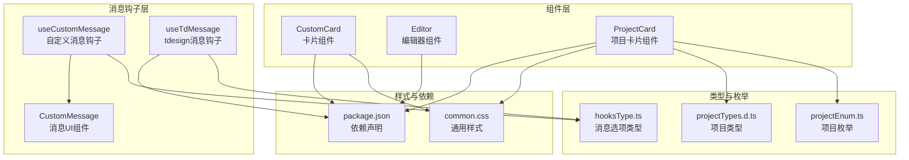
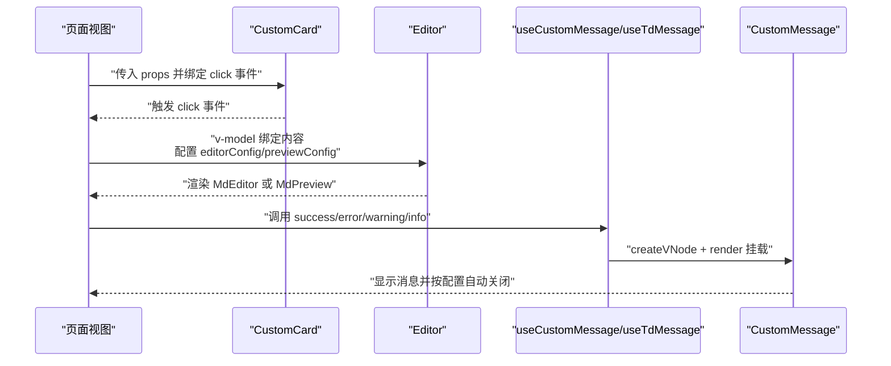
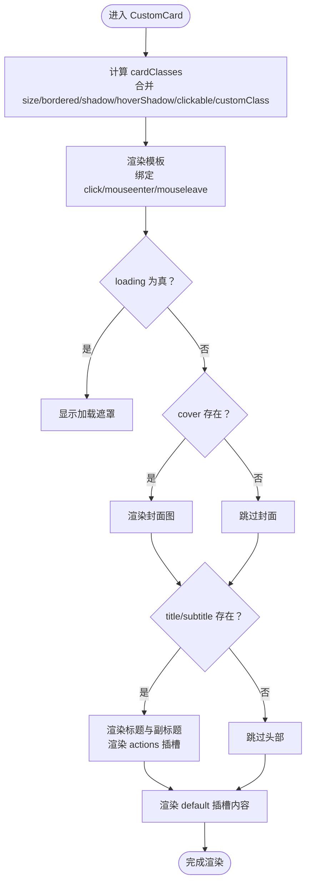
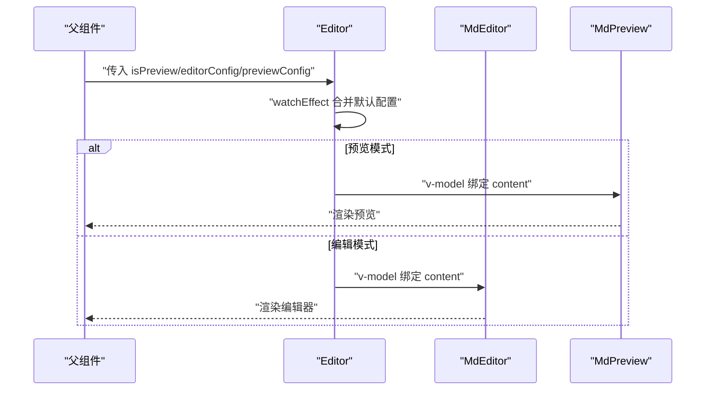
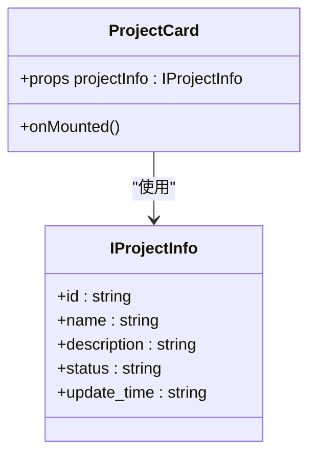
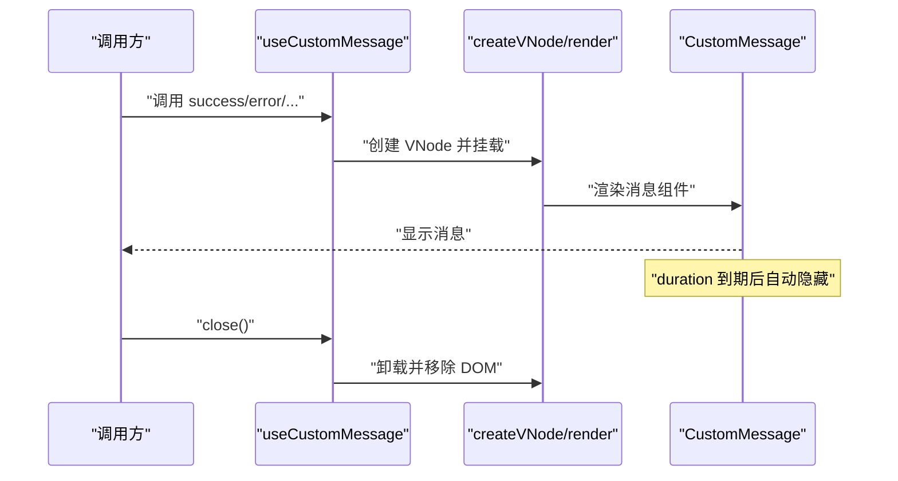
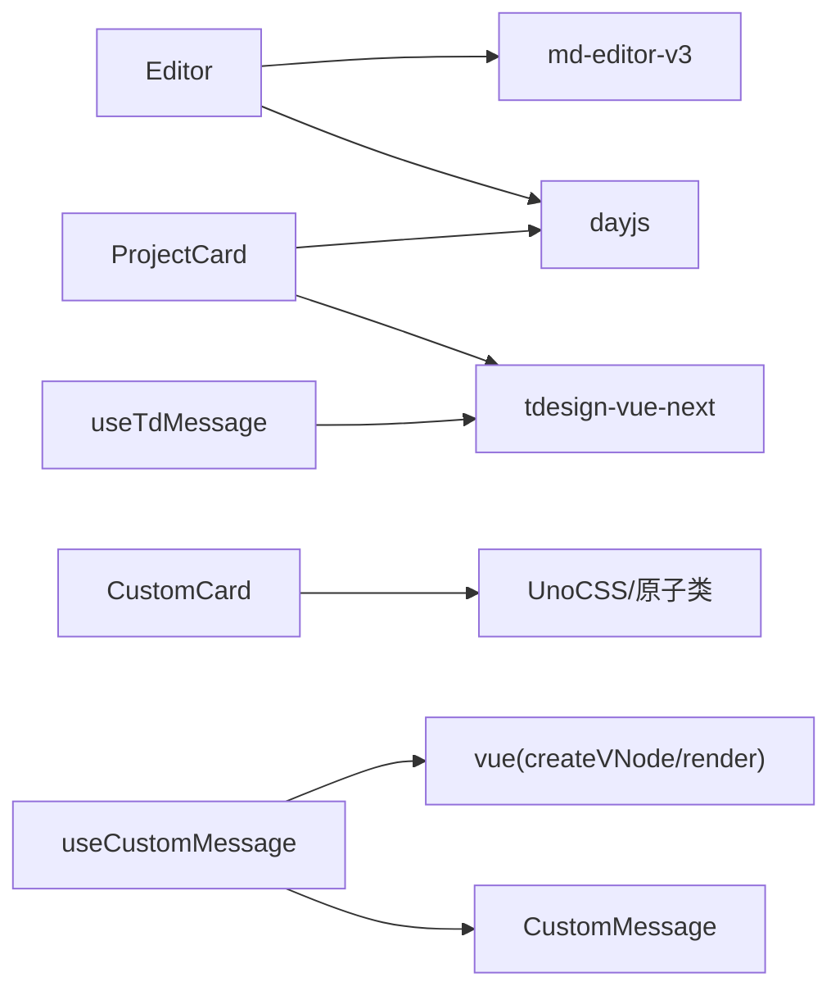

# 可复用组件

<cite>
**本文引用的文件**
- [src/components/CustomCard/index.vue](file://src/components/CustomCard/index.vue)
- [src/components/CustomCard/demo.vue](file://src/components/CustomCard/demo.vue)
- [src/components/Editor/index.vue](file://src/components/Editor/index.vue)
- [src/components/ProjectCard/index.vue](file://src/components/ProjectCard/index.vue)
- [src/hooks/useCustomMessage.ts](file://src/hooks/useCustomMessage.ts)
- [src/hooks/useTdMessage.ts](file://src/hooks/useTdMessage.ts)
- [src/hooks/components/CustomMessage.vue](file://src/hooks/components/CustomMessage.vue)
- [src/hooks/hooksType.ts](file://src/hooks/hooksType.ts)
- [src/types/projectTypes.d.ts](file://src/types/projectTypes.d.ts)
- [src/utils/enums/projectEnum.ts](file://src/utils/enums/projectEnum.ts)
- [src/style/common.css](file://src/style/common.css)
- [package.json](file://package.json)
</cite>

## 目录
1. [简介](#简介)
2. [项目结构](#项目结构)
3. [核心组件](#核心组件)
4. [架构总览](#架构总览)
5. [详细组件分析](#详细组件分析)
6. [依赖分析](#依赖分析)
7. [性能考虑](#性能考虑)
8. [故障排查指南](#故障排查指南)
9. [结论](#结论)
10. [附录](#附录)

## 简介
本文件面向可复用组件的设计与实现，围绕以下目标展开：梳理组件的设计原则与实现细节；明确组件的 API 设计、属性配置与事件处理机制；阐述可扩展性与插槽系统的使用；解释状态管理与生命周期控制；提供使用示例与集成指南；说明样式定制与主题适配方法；并总结性能优化与内存管理策略。  
本仓库中的可复用组件主要包含：
- 可复用卡片组件：支持尺寸、边框、阴影、封面图、加载态、可点击行为与插槽扩展。
- 编辑器组件：基于 md-editor-v3 的 Markdown 编辑与预览封装，支持主题、工具栏、只读/禁用等配置。
- 项目卡片组件：展示项目信息，含状态标签与更新时间。
- 消息提示钩子：提供自定义消息与 tdesign 消息两种实现，支持类型化配置与自动清理。

## 项目结构
可复用组件集中于 src/components 与 src/hooks 目录，配合类型定义与样式资源，形成统一的组件体系与使用规范。

**图表来源**
- [src/components/CustomCard/index.vue](file://src/components/CustomCard/index.vue#L1-L317)
- [src/components/Editor/index.vue](file://src/components/Editor/index.vue#L1-L164)
- [src/components/ProjectCard/index.vue](file://src/components/ProjectCard/index.vue#L1-L75)
- [src/hooks/useCustomMessage.ts](file://src/hooks/useCustomMessage.ts#L1-L73)
- [src/hooks/useTdMessage.ts](file://src/hooks/useTdMessage.ts#L1-L60)
- [src/hooks/components/CustomMessage.vue](file://src/hooks/components/CustomMessage.vue#L1-L94)
- [src/hooks/hooksType.ts](file://src/hooks/hooksType.ts#L1-L11)
- [src/types/projectTypes.d.ts](file://src/types/projectTypes.d.ts#L1-L27)
- [src/utils/enums/projectEnum.ts](file://src/utils/enums/projectEnum.ts#L1-L9)
- [src/style/common.css](file://src/style/common.css#L1-L13)
- [package.json](file://package.json#L1-L60)

**章节来源**
- [src/components/CustomCard/index.vue](file://src/components/CustomCard/index.vue#L1-L317)
- [src/components/Editor/index.vue](file://src/components/Editor/index.vue#L1-L164)
- [src/components/ProjectCard/index.vue](file://src/components/ProjectCard/index.vue#L1-L75)
- [src/hooks/useCustomMessage.ts](file://src/hooks/useCustomMessage.ts#L1-L73)
- [src/hooks/useTdMessage.ts](file://src/hooks/useTdMessage.ts#L1-L60)
- [src/hooks/components/CustomMessage.vue](file://src/hooks/components/CustomMessage.vue#L1-L94)
- [src/hooks/hooksType.ts](file://src/hooks/hooksType.ts#L1-L11)
- [src/types/projectTypes.d.ts](file://src/types/projectTypes.d.ts#L1-L27)
- [src/utils/enums/projectEnum.ts](file://src/utils/enums/projectEnum.ts#L1-L9)
- [src/style/common.css](file://src/style/common.css#L1-L13)
- [package.json](file://package.json#L1-L60)

## 核心组件
- 可复用卡片组件（CustomCard）：通过 props 控制尺寸、边框、阴影、封面图、加载态与可点击行为；通过插槽扩展操作区与内容区；内部维护悬停状态以动态切换样式。
- 编辑器组件（Editor）：封装 md-editor-v3 的编辑与预览模式，支持主题、工具栏、代码主题、占位符、只读/禁用、目录布局等配置；通过 v-model 双向绑定内容。
- 项目卡片组件（ProjectCard）：接收项目信息对象，渲染名称、描述、状态标签与更新时间；使用外部滚动条组件与 tdesign Tag。
- 消息提示钩子（useCustomMessage / useTdMessage）：提供统一的消息提示能力，支持成功/失败/警告/信息四种类型，具备自动关闭与手动关闭能力；自定义消息组件支持 VNode 与字符串消息。

**章节来源**
- [src/components/CustomCard/index.vue](file://src/components/CustomCard/index.vue#L1-L317)
- [src/components/Editor/index.vue](file://src/components/Editor/index.vue#L1-L164)
- [src/components/ProjectCard/index.vue](file://src/components/ProjectCard/index.vue#L1-L75)
- [src/hooks/useCustomMessage.ts](file://src/hooks/useCustomMessage.ts#L1-L73)
- [src/hooks/useTdMessage.ts](file://src/hooks/useTdMessage.ts#L1-L60)
- [src/hooks/components/CustomMessage.vue](file://src/hooks/components/CustomMessage.vue#L1-L94)

## 架构总览
下图展示了组件间的调用关系与数据流向：页面视图通过 props 与 v-model 与组件交互；消息钩子通过 createVNode/render 动态挂载消息组件；编辑器组件内部根据 isPreview 切换编辑或预览模式。

**图表来源**
- [src/components/CustomCard/index.vue](file://src/components/CustomCard/index.vue#L38-L96)
- [src/components/Editor/index.vue](file://src/components/Editor/index.vue#L85-L109)
- [src/hooks/useCustomMessage.ts](file://src/hooks/useCustomMessage.ts#L9-L72)
- [src/hooks/components/CustomMessage.vue](file://src/hooks/components/CustomMessage.vue#L1-L94)

## 详细组件分析

### 可复用卡片组件（CustomCard）
- 设计原则
  - 可配置：通过 props 提供尺寸、边框、阴影、封面图、加载态、可点击等开关。
  - 可扩展：提供默认插槽与 actions 插槽，满足内容与操作区的灵活扩展。
  - 可复用：使用 CSS 变量与响应式设计，适配不同屏幕与主题。
- API 设计
  - 属性
    - title/subtitle：标题与副标题
    - shadow/hoverShadow：固定阴影与悬停阴影
    - size：small/medium/large
    - bordered：边框开关
    - clickable：可点击行为
    - customClass：自定义类名
    - cover：封面图地址
    - loading：加载态
  - 事件
    - click：仅在 clickable 为真时触发
  - 插槽
    - default：内容区
    - actions：操作区（如编辑、删除按钮）
- 状态与生命周期
  - 内部状态：isHovered（悬停状态）
  - 生命周期：使用组合式 API，未使用生命周期钩子
- 样式与主题
  - 使用 CSS 变量控制背景、边框、文字颜色等，便于主题切换
  - 支持响应式内边距与暗色主题适配注释
- 性能与内存
  - 使用 computed 计算类名，减少模板开销
  - 悬停状态仅影响样式，无额外副作用
  - 加载遮罩采用绝对定位，不影响内容布局

**图表来源**
- [src/components/CustomCard/index.vue](file://src/components/CustomCard/index.vue#L47-L146)

**章节来源**
- [src/components/CustomCard/index.vue](file://src/components/CustomCard/index.vue#L1-L317)
- [src/components/CustomCard/demo.vue](file://src/components/CustomCard/demo.vue#L1-L181)

### 编辑器组件（Editor）
- 设计原则
  - 低耦合：通过 props 接收配置，内部根据 isPreview 切换编辑/预览。
  - 可配置：提供 editorConfig 与 previewConfig 的深度合并，支持主题、工具栏、代码主题、占位符等。
  - 易用性：通过 v-model 简化双向绑定，内置默认配置与占位符。
- API 设计
  - 属性
    - isPreview：是否为预览模式
    - editorConfig：编辑器配置（Partial<EditorProps>）
    - previewConfig：预览配置（Partial<MdPreviewProps>）
  - 模型
    - content：通过 defineModel 双向绑定
  - 插槽
    - defFooters：自定义底部信息（如时间戳）
- 状态与生命周期
  - 使用 watchEffect 根据 isPreview 动态生成 editorConfigTemplate 或 previewConfigTemplate
  - 未使用生命周期钩子
- 样式与主题
  - 内置滚动条样式定制，支持主题切换
- 性能与内存
  - 通过 watchEffect 按需生成配置，避免不必要的重渲染
  - 依赖 md-editor-v3，注意其体积与按需引入策略

**图表来源**
- [src/components/Editor/index.vue](file://src/components/Editor/index.vue#L85-L118)

**章节来源**
- [src/components/Editor/index.vue](file://src/components/Editor/index.vue#L1-L164)

### 项目卡片组件（ProjectCard）
- 设计原则
  - 数据驱动：通过 IProjectInfo 渲染项目信息
  - 视觉反馈：悬停提升与阴影变化
  - 可读性：使用外部滚动条组件与标签展示状态
- API 设计
  - 属性
    - projectInfo：IProjectInfo 对象
  - 插槽：无
- 状态与生命周期
  - 使用 onMounted 钩子（当前为空），可扩展为数据初始化
- 样式与主题
  - 使用 CSS 变量与过渡动画，hover 效果平滑
  - :deep 选择器用于穿透样式到滚动条容器
- 性能与内存
  - 无复杂计算，渲染开销低

**图表来源**
- [src/components/ProjectCard/index.vue](file://src/components/ProjectCard/index.vue#L1-L75)
- [src/types/projectTypes.d.ts](file://src/types/projectTypes.d.ts#L3-L12)

**章节来源**
- [src/components/ProjectCard/index.vue](file://src/components/ProjectCard/index.vue#L1-L75)
- [src/types/projectTypes.d.ts](file://src/types/projectTypes.d.ts#L1-L27)
- [src/utils/enums/projectEnum.ts](file://src/utils/enums/projectEnum.ts#L1-L9)

### 消息提示钩子（useCustomMessage / useTdMessage）
- 设计原则
  - 统一入口：提供 success/error/warning/info 便捷方法
  - 可控性：支持 duration、closeBtn、VNode 消息体
  - 自动清理：定时器与 render 卸载，避免内存泄漏
- API 设计
  - useCustomMessage
    - 参数：elRef（可选挂载节点）
    - 返回：open(success/error/warning/info/close)
    - 依赖：CustomMessage 组件
  - useTdMessage
    - 返回：success/error/warning/info（基于 tdesign 的 MessagePlugin）
- 状态与生命周期
  - onMounted 显示消息，定时器自动隐藏；onBeforeUnmount 清理定时器
- 样式与主题
  - 自定义消息组件使用固定定位与过渡动画
- 性能与内存
  - createVNode + render 动态挂载，及时卸载；使用 Map 管理多个实例

**图表来源**
- [src/hooks/useCustomMessage.ts](file://src/hooks/useCustomMessage.ts#L9-L72)
- [src/hooks/components/CustomMessage.vue](file://src/hooks/components/CustomMessage.vue#L16-L34)

**章节来源**
- [src/hooks/useCustomMessage.ts](file://src/hooks/useCustomMessage.ts#L1-L73)
- [src/hooks/useTdMessage.ts](file://src/hooks/useTdMessage.ts#L1-L60)
- [src/hooks/components/CustomMessage.vue](file://src/hooks/components/CustomMessage.vue#L1-L94)
- [src/hooks/hooksType.ts](file://src/hooks/hooksType.ts#L1-L11)

## 依赖分析
- 组件依赖
  - Editor 依赖 md-editor-v3 与 dayjs
  - ProjectCard 依赖 tdesign-vue-next 与 dayjs
  - CustomCard 与通用样式依赖 UnoCSS/原子类
- 消息钩子依赖
  - useCustomMessage 依赖 createVNode/render 与自定义消息组件
  - useTdMessage 依赖 tdesign-vue-next 的 MessagePlugin
- 类型与枚举
  - IProjectInfo 与 EProjectStatus/EProjectType 为组件提供类型安全

**图表来源**
- [src/components/Editor/index.vue](file://src/components/Editor/index.vue#L1-L8)
- [src/components/ProjectCard/index.vue](file://src/components/ProjectCard/index.vue#L1-L7)
- [src/hooks/useCustomMessage.ts](file://src/hooks/useCustomMessage.ts#L1-L6)
- [src/hooks/useTdMessage.ts](file://src/hooks/useTdMessage.ts#L1-L3)
- [package.json](file://package.json#L18-L38)

**章节来源**
- [package.json](file://package.json#L1-L60)

## 性能考虑
- 渲染优化
  - 使用 computed 计算类名，减少模板分支判断
  - watchEffect 按需生成配置，避免不必要重渲染
  - 消息组件使用定时器与卸载逻辑，防止内存泄漏
- 样式优化
  - 使用 CSS 变量与响应式设计，降低重复样式
  - 编辑器组件提供滚动条样式定制，改善长内容体验
- 体积优化
  - 按需引入第三方库，避免打包冗余
  - 组件尽量保持轻量，避免过度依赖

## 故障排查指南
- 编辑器无法显示/预览异常
  - 检查 isPreview 与 editorConfig/previewConfig 的合并结果
  - 确认 v-model 绑定正确，占位符与只读/禁用配置是否符合预期
- 消息组件未消失或重复弹出
  - 确认 duration 配置与自动关闭逻辑
  - 若使用多实例，确保 close 方法被调用
- 项目卡片状态标签不显示
  - 检查 EProjectStatus 枚举映射与 projectInfo.status 值
- 卡片加载遮罩不出现
  - 确认 loading 为真且高度设置合理

**章节来源**
- [src/components/Editor/index.vue](file://src/components/Editor/index.vue#L85-L118)
- [src/hooks/useCustomMessage.ts](file://src/hooks/useCustomMessage.ts#L37-L50)
- [src/utils/enums/projectEnum.ts](file://src/utils/enums/projectEnum.ts#L1-L9)
- [src/components/CustomCard/index.vue](file://src/components/CustomCard/index.vue#L105-L111)

## 结论
本仓库的可复用组件遵循“低耦合、高内聚”的设计原则，通过 props、插槽与配置对象实现灵活扩展；结合类型系统与样式变量，提升可维护性与可定制性。建议在实际项目中：
- 统一使用 v-model 与 props 的约定式接口
- 优先通过插槽扩展功能，避免过度封装
- 注意动态挂载组件的生命周期与内存清理
- 在样式层面统一使用 CSS 变量与原子类，便于主题切换

## 附录
- 使用示例与集成指南
  - CustomCard：参考 demo.vue 中的基础用法、尺寸与特殊样式示例，以及 actions 插槽的使用方式
  - Editor：在视图中通过 v-model 绑定内容，并根据 isPreview 切换编辑/预览
  - ProjectCard：传入 IProjectInfo 对象即可渲染完整卡片
  - 消息提示：优先使用 useTdMessage 获取一致的 UI 体验；若需自定义样式，使用 useCustomMessage
- 样式定制与主题适配
  - 通过 CSS 变量覆盖卡片背景、边框、文字颜色等
  - 编辑器滚动条样式可通过自定义样式覆盖
  - 暗色主题适配可参考卡片组件中的注释部分进行启用
- 性能优化与内存管理
  - 合理使用 computed 与 watchEffect，避免重复计算
  - 动态组件及时卸载，定时器在组件卸载时清理
  - 第三方库按需引入，减少打包体积

**章节来源**
- [src/components/CustomCard/demo.vue](file://src/components/CustomCard/demo.vue#L1-L181)
- [src/components/Editor/index.vue](file://src/components/Editor/index.vue#L105-L118)
- [src/components/ProjectCard/index.vue](file://src/components/ProjectCard/index.vue#L26-L55)
- [src/hooks/useTdMessage.ts](file://src/hooks/useTdMessage.ts#L4-L59)
- [src/hooks/useCustomMessage.ts](file://src/hooks/useCustomMessage.ts#L9-L72)
- [src/style/common.css](file://src/style/common.css#L1-L13)
- [src/components/CustomCard/index.vue](file://src/components/CustomCard/index.vue#L149-L316)