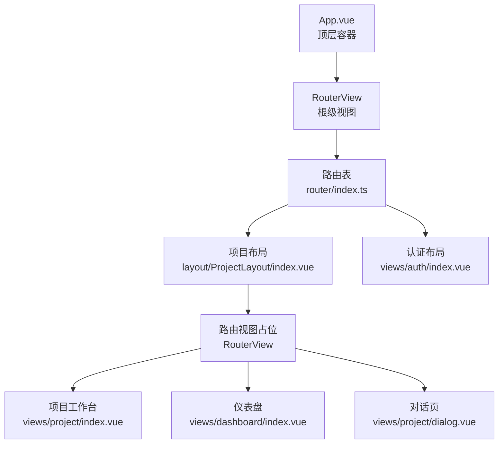
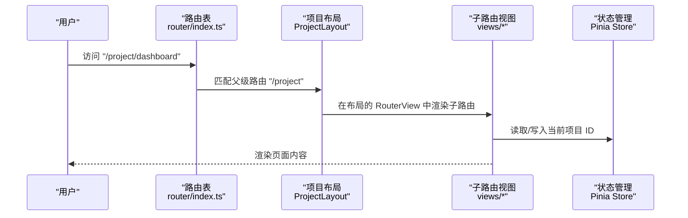
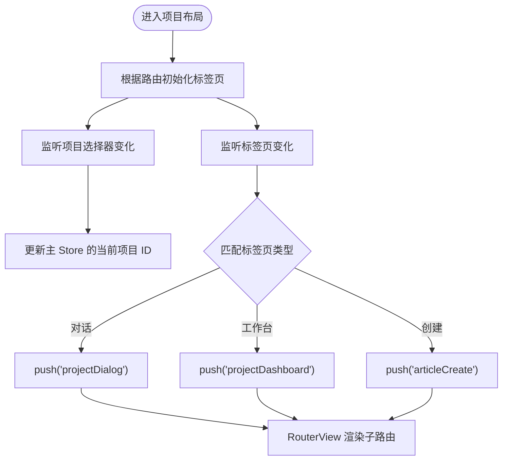
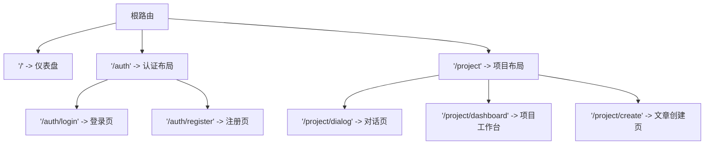
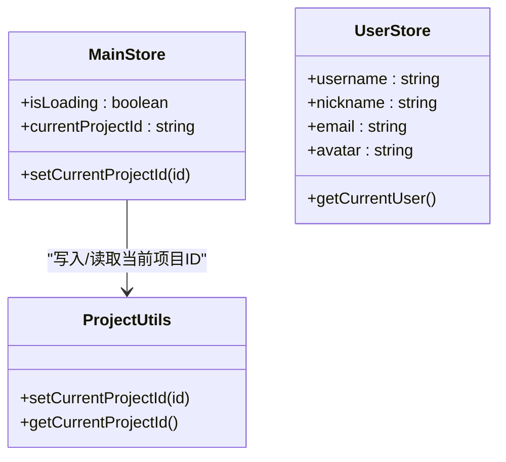
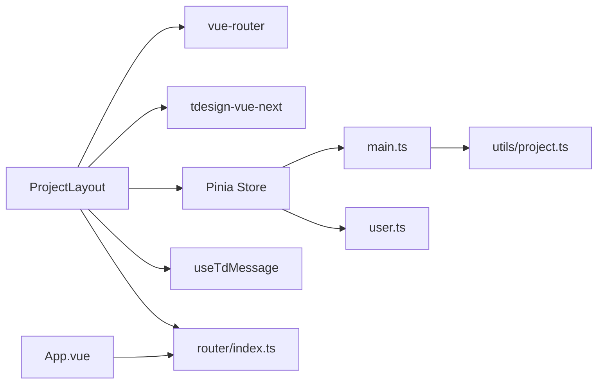

# 布局组件

<cite>
**本文引用的文件**
- [src/layout/ProjectLayout/index.vue](file://src/layout/ProjectLayout/index.vue)
- [src/router/index.ts](file://src/router/index.ts)
- [src/App.vue](file://src/App.vue)
- [src/views/auth/index.vue](file://src/views/auth/index.vue)
- [src/stores/main.ts](file://src/stores/main.ts)
- [src/stores/user.ts](file://src/stores/user.ts)
- [src/hooks/useTdMessage.ts](file://src/hooks/useTdMessage.ts)
- [src/utils/project.ts](file://src/utils/project.ts)
- [src/views/project/index.vue](file://src/views/project/index.vue)
- [src/views/dashboard/index.vue](file://src/views/dashboard/index.vue)
- [uno.config.ts](file://uno.config.ts)
- [src/style/common.css](file://src/style/common.css)
- [src/main.ts](file://src/main.ts)
- [package.json](file://package.json)
</cite>

## 目录
1. [简介](#简介)
2. [项目结构](#项目结构)
3. [核心组件](#核心组件)
4. [架构总览](#架构总览)
5. [详细组件分析](#详细组件分析)
6. [依赖关系分析](#依赖关系分析)
7. [性能考量](#性能考量)
8. [故障排查指南](#故障排查指南)
9. [结论](#结论)
10. [附录](#附录)

## 简介
本文件系统性梳理项目中的布局组件，重点围绕“项目布局”（ProjectLayout）展开，解释其设计原理、嵌套结构、与路由系统的集成方式、动态路由切换与布局适配机制，以及响应式设计策略。同时提供使用示例与自定义配置方法，明确布局组件在整个前端架构中的职责边界。

## 项目结构
项目采用基于功能模块的组织方式，布局组件位于 src/layout/ProjectLayout/index.vue，路由配置位于 src/router/index.ts，应用入口在 src/main.ts，顶层容器 App.vue 负责渲染根级 RouterView。认证布局（LoginLayout）位于 src/views/auth/index.vue，用于登录/注册等不受主布局约束的页面。

图表来源
- [src/App.vue](file://src/App.vue#L5-L8)
- [src/router/index.ts](file://src/router/index.ts#L5-L73)
- [src/layout/ProjectLayout/index.vue](file://src/layout/ProjectLayout/index.vue#L124-L126)

章节来源
- [src/App.vue](file://src/App.vue#L1-L12)
- [src/router/index.ts](file://src/router/index.ts#L1-L82)
- [src/main.ts](file://src/main.ts#L17-L27)

## 核心组件
- 项目布局组件：负责顶部导航区（Logo、项目选择器、标签页切换）、用户信息弹出菜单、以及作为路由视图容器承载子路由页面。
- 路由系统：定义了多级嵌套路由，项目布局作为父级路由，子路由包括对话页、项目工作台、文章创建页等。
- 状态管理：通过 Pinia Store 维护当前项目 ID，并持久化到本地存储；用户信息 Store 提供头像、昵称等展示数据。
- 通知钩子：统一的消息提示封装，提升用户体验一致性。

章节来源
- [src/layout/ProjectLayout/index.vue](file://src/layout/ProjectLayout/index.vue#L1-L135)
- [src/router/index.ts](file://src/router/index.ts#L40-L73)
- [src/stores/main.ts](file://src/stores/main.ts#L1-L21)
- [src/stores/user.ts](file://src/stores/user.ts#L1-L29)
- [src/hooks/useTdMessage.ts](file://src/hooks/useTdMessage.ts#L1-L60)

## 架构总览
布局组件与路由系统的交互遵循“父布局 + 子路由”的模式：
- App.vue 作为根容器，渲染根级 RouterView。
- 路由表定义了多个一级路由，其中“/project”指向项目布局组件。
- 项目布局组件内部包含顶部导航与一个 RouterView，用于承载子路由页面。
- 子路由页面（如项目工作台、对话页、文章创建页）直接渲染在布局的 RouterView 中。

图表来源
- [src/router/index.ts](file://src/router/index.ts#L40-L73)
- [src/layout/ProjectLayout/index.vue](file://src/layout/ProjectLayout/index.vue#L124-L126)
- [src/stores/main.ts](file://src/stores/main.ts#L10-L15)

## 详细组件分析

### 项目布局组件（ProjectLayout）
- 结构组成
  - 顶部栏：左侧包含 Logo、项目选择器；中部为标签页切换（对话、工作台、创建）；右侧为用户信息弹出菜单。
  - 中部区域：RouterView 占位，承载子路由页面。
- 数据与状态
  - 使用用户 Store 展示昵称；使用主 Store 维护当前项目 ID 并持久化。
  - 通过监听项目选择器与标签页切换，驱动路由跳转。
- 路由集成
  - onMounted 钩子根据当前路由名初始化标签页状态。
  - 标签页切换触发路由 push 到对应子路由名称。
- 交互流程
  - 用户点击标签页或项目选择器时，通过 watch 触发路由变更。
  - 登出操作调用后端接口并跳转到登录页。

图表来源
- [src/layout/ProjectLayout/index.vue](file://src/layout/ProjectLayout/index.vue#L23-L42)
- [src/layout/ProjectLayout/index.vue](file://src/layout/ProjectLayout/index.vue#L57-L72)
- [src/router/index.ts](file://src/router/index.ts#L47-L72)

章节来源
- [src/layout/ProjectLayout/index.vue](file://src/layout/ProjectLayout/index.vue#L1-L135)
- [src/stores/main.ts](file://src/stores/main.ts#L1-L21)
- [src/stores/user.ts](file://src/stores/user.ts#L1-L29)
- [src/hooks/useTdMessage.ts](file://src/hooks/useTdMessage.ts#L1-L60)

### 路由系统与布局嵌套
- 顶层路由
  - “/” 跳转到仪表盘视图。
  - “/auth” 使用认证布局，子路由为登录与注册。
- 项目路由
  - “/project” 使用项目布局，子路由包括对话页、项目工作台、文章创建页。
- 嵌套关系
  - 项目布局作为父级路由，内部 RouterView 承载子路由页面。
  - 认证布局同样采用父级 + 子路由模式，但不包含项目选择器与标签页切换。

图表来源
- [src/router/index.ts](file://src/router/index.ts#L5-L73)

章节来源
- [src/router/index.ts](file://src/router/index.ts#L1-L82)
- [src/views/auth/index.vue](file://src/views/auth/index.vue#L1-L20)

### 状态管理与持久化
- 主 Store（main）
  - 维护当前项目 ID，并在设置时同步到 Cookie。
  - 通过 Pinia 插件持久化到本地存储。
- 用户 Store（user）
  - 提供用户昵称、头像等信息，用于顶部栏展示。
- 项目工具（utils/project）
  - 封装当前项目 ID 的 Cookie 读写。

图表来源
- [src/stores/main.ts](file://src/stores/main.ts#L4-L15)
- [src/stores/user.ts](file://src/stores/user.ts#L4-L20)
- [src/utils/project.ts](file://src/utils/project.ts#L3-L9)

章节来源
- [src/stores/main.ts](file://src/stores/main.ts#L1-L21)
- [src/stores/user.ts](file://src/stores/user.ts#L1-L29)
- [src/utils/project.ts](file://src/utils/project.ts#L1-L10)

### 响应式设计与样式体系
- UnoCSS 快捷类与主题色
  - 通过 uno.config.ts 定义主色、背景色、字体色等主题变量。
  - 使用 text-overflow、div-flex-center 等快捷类提升开发效率。
- 公共样式
  - common.css 提供通用边框阴影与滚动条内容样式。
- 布局容器
  - App.vue 与各布局均采用高度占满与溢出控制，确保在不同屏幕尺寸下保持一致的视觉体验。

章节来源
- [uno.config.ts](file://uno.config.ts#L1-L50)
- [src/style/common.css](file://src/style/common.css#L1-L13)
- [src/App.vue](file://src/App.vue#L5-L8)

### 与子路由页面的协作
- 项目工作台（views/project/index.vue）
  - 通过监听主 Store 的当前项目 ID 变化，重新加载分类树与文件列表。
  - 顶部标签页与路由联动，确保页面状态与 URL 同步。
- 仪表盘（views/dashboard/index.vue）
  - 采用网格布局，左右两栏自适应宽度，体现响应式特性。

章节来源
- [src/views/project/index.vue](file://src/views/project/index.vue#L40-L43)
- [src/views/dashboard/index.vue](file://src/views/dashboard/index.vue#L17-L25)

## 依赖关系分析
- 组件依赖
  - 项目布局依赖 vue-router（路由跳转）、tdesign-vue-next（UI 组件）、Pinia Store（状态）、自定义消息钩子。
- 运行时依赖
  - Vue 3、Vue Router、Pinia、tdesign-vue-next、UnoCSS、Animate.css、Simplebar 等。
- 构建与脚本
  - Vite、TypeScript、ESLint、Prettier 等工具链支持开发与构建。

图表来源
- [src/layout/ProjectLayout/index.vue](file://src/layout/ProjectLayout/index.vue#L1-L19)
- [src/router/index.ts](file://src/router/index.ts#L1-L82)
- [src/stores/main.ts](file://src/stores/main.ts#L1-L21)
- [src/stores/user.ts](file://src/stores/user.ts#L1-L29)
- [src/hooks/useTdMessage.ts](file://src/hooks/useTdMessage.ts#L1-L60)
- [src/utils/project.ts](file://src/utils/project.ts#L1-L10)
- [src/App.vue](file://src/App.vue#L1-L12)

章节来源
- [package.json](file://package.json#L18-L39)
- [src/main.ts](file://src/main.ts#L1-L28)

## 性能考量
- 路由懒加载
  - 子路由页面通过动态导入实现按需加载，减少首屏体积。
- 状态持久化
  - 主 Store 使用持久化插件，避免刷新丢失当前项目选择。
- 组件复用
  - 顶部导航与 RouterView 的组合降低重复代码，提高可维护性。
- 样式优化
  - UnoCSS 提供原子化样式，减少冗余 CSS；公共样式集中管理，便于维护。

章节来源
- [src/router/index.ts](file://src/router/index.ts#L20-L70)
- [src/stores/main.ts](file://src/stores/main.ts#L16-L19)
- [uno.config.ts](file://uno.config.ts#L1-L50)

## 故障排查指南
- 登录后无法进入项目页
  - 检查路由名称是否与布局内 watch 分支匹配。
  - 确认 onMounted 初始化标签页逻辑是否正确执行。
- 当前项目 ID 不生效
  - 核对主 Store 的 setCurrentProjectId 是否被调用。
  - 检查 utils/project.ts 的 Cookie 设置是否成功。
- 顶部标签页与页面不一致
  - 确保路由跳转后，标签页状态与路由名称一致。
  - 检查 watch(tabType) 是否正确触发 router.push。
- 通知消息未显示
  - 确认 useTdMessage 的返回对象是否正确注入到组件实例。
- 样式异常
  - 检查 UnoCSS 主题色与快捷类是否正确引入。
  - 确认公共样式文件是否在 main.ts 中被加载。

章节来源
- [src/layout/ProjectLayout/index.vue](file://src/layout/ProjectLayout/index.vue#L23-L42)
- [src/layout/ProjectLayout/index.vue](file://src/layout/ProjectLayout/index.vue#L57-L72)
- [src/stores/main.ts](file://src/stores/main.ts#L10-L15)
- [src/utils/project.ts](file://src/utils/project.ts#L3-L9)
- [src/hooks/useTdMessage.ts](file://src/hooks/useTdMessage.ts#L4-L58)
- [uno.config.ts](file://uno.config.ts#L1-L50)
- [src/main.ts](file://src/main.ts#L9-L15)

## 结论
项目布局组件以“父布局 + 子路由”的模式实现了清晰的页面组织与路由集成，结合 Pinia 状态管理与持久化、统一的通知钩子以及 UnoCSS 原子化样式体系，形成了高内聚、低耦合的前端架构。通过标签页与路由的双向绑定，布局组件在保证用户体验的同时，也提供了良好的扩展性与可维护性。

## 附录

### 使用示例
- 在路由表中新增子路由
  - 在项目布局的 children 数组中添加新的路由记录，确保 name 与布局内的 switch 分支一致。
- 自定义顶部导航
  - 在项目布局的 template 中修改顶部栏结构，注意保留 RouterView 以承载子路由。
- 切换当前项目
  - 通过项目选择器更新主 Store 的 currentProjectId，自动触发页面数据刷新。

章节来源
- [src/router/index.ts](file://src/router/index.ts#L47-L72)
- [src/layout/ProjectLayout/index.vue](file://src/layout/ProjectLayout/index.vue#L75-L127)
- [src/stores/main.ts](file://src/stores/main.ts#L10-L15)

### 自定义配置方法
- 主题色与快捷类
  - 在 uno.config.ts 中调整 colors、shortcuts 等配置，影响全局样式。
- 持久化策略
  - 在 Pinia Store 的 persist 配置中调整 key 与 storage，以满足不同环境需求。
- 通知样式
  - 在 useTdMessage 中统一调整消息提示的默认参数，如时长、图标等。

章节来源
- [uno.config.ts](file://uno.config.ts#L10-L49)
- [src/stores/main.ts](file://src/stores/main.ts#L16-L19)
- [src/hooks/useTdMessage.ts](file://src/hooks/useTdMessage.ts#L4-L58)