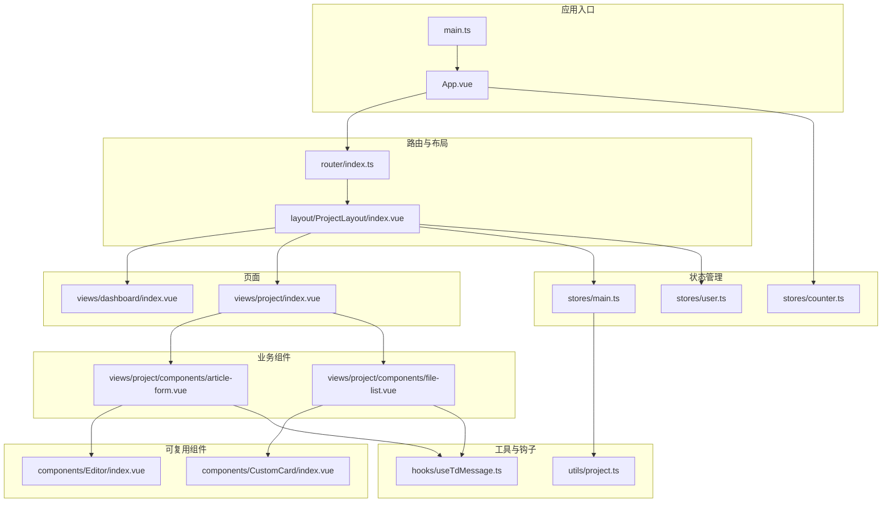
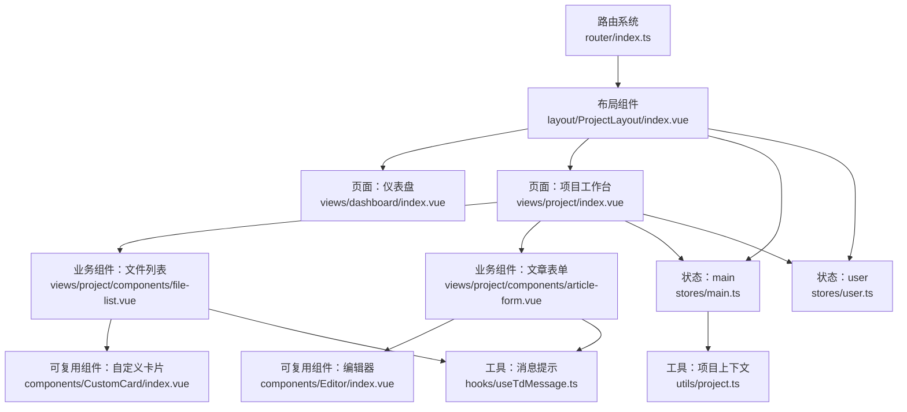
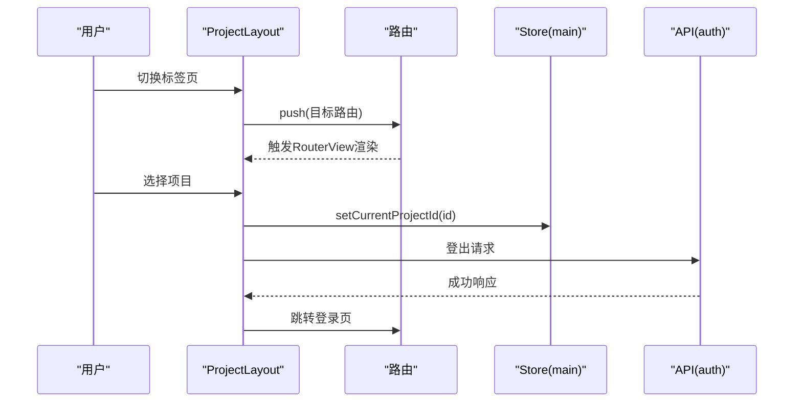
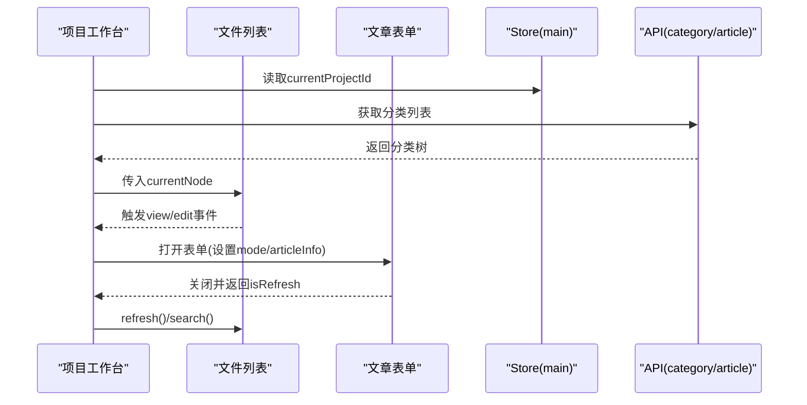
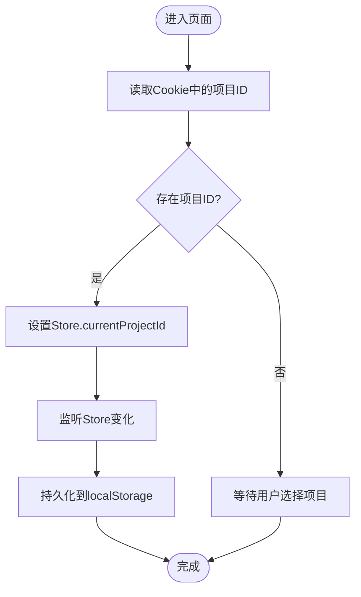
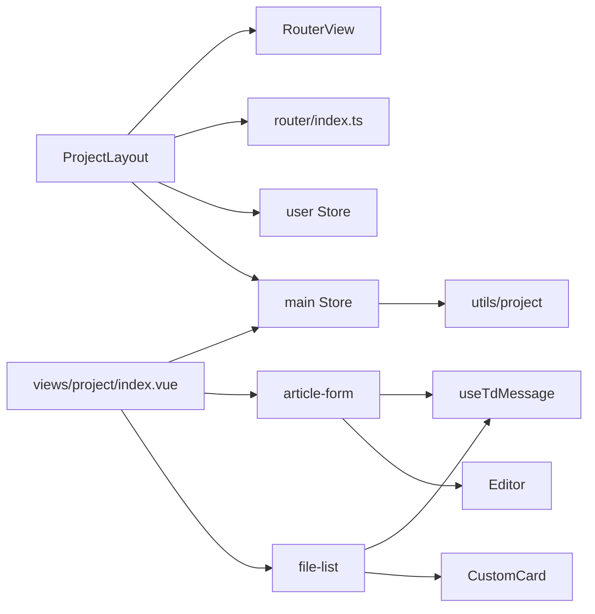

# 组件架构

<cite>
**本文引用的文件**
- [src/App.vue](file://src/App.vue)
- [src/main.ts](file://src/main.ts)
- [src/layout/ProjectLayout/index.vue](file://src/layout/ProjectLayout/index.vue)
- [src/router/index.ts](file://src/router/index.ts)
- [src/stores/main.ts](file://src/stores/main.ts)
- [src/stores/user.ts](file://src/stores/user.ts)
- [src/stores/counter.ts](file://src/stores/counter.ts)
- [src/views/dashboard/index.vue](file://src/views/dashboard/index.vue)
- [src/views/project/index.vue](file://src/views/project/index.vue)
- [src/views/project/components/article-form.vue](file://src/views/project/components/article-form.vue)
- [src/views/project/components/file-list.vue](file://src/views/project/components/file-list.vue)
- [src/components/CustomCard/index.vue](file://src/components/CustomCard/index.vue)
- [src/components/Editor/index.vue](file://src/components/Editor/index.vue)
- [src/hooks/useTdMessage.ts](file://src/hooks/useTdMessage.ts)
- [src/utils/project.ts](file://src/utils/project.ts)
</cite>

## 目录
1. [引言](#引言)
2. [项目结构](#项目结构)
3. [核心组件](#核心组件)
4. [架构总览](#架构总览)
5. [组件详解](#组件详解)
6. [依赖关系分析](#依赖关系分析)
7. [性能考量](#性能考量)
8. [故障排查指南](#故障排查指南)
9. [结论](#结论)
10. [附录](#附录)

## 引言
本文件系统性梳理本项目的 Vue 3 组件化架构，围绕布局组件、页面组件与可复用组件的层次与职责，阐述组件通信（props、事件、provide/inject 的替代实践）、状态管理（Pinia）与生命周期管理策略，并总结设计模式与最佳实践，辅以组件关系图与使用示例路径，帮助开发者快速理解与扩展。

## 项目结构
项目采用“布局层-页面层-组件层”三层组织方式：
- 布局层：负责全局导航、侧边栏、路由视图容器等，典型如项目布局。
- 页面层：承载业务主流程与复杂交互，典型如项目工作台、仪表盘。
- 组件层：通用可复用 UI 组件与业务组件，典型如自定义卡片、富文本编辑器、文章表单与文件列表。

图表来源
- [src/App.vue](file://src/App.vue#L1-L12)
- [src/main.ts](file://src/main.ts#L1-L28)
- [src/layout/ProjectLayout/index.vue](file://src/layout/ProjectLayout/index.vue#L1-L135)
- [src/router/index.ts](file://src/router/index.ts#L1-L82)
- [src/views/dashboard/index.vue](file://src/views/dashboard/index.vue#L1-L26)
- [src/views/project/index.vue](file://src/views/project/index.vue#L1-L371)
- [src/views/project/components/article-form.vue](file://src/views/project/components/article-form.vue#L1-L214)
- [src/views/project/components/file-list.vue](file://src/views/project/components/file-list.vue#L1-L266)
- [src/components/CustomCard/index.vue](file://src/components/CustomCard/index.vue#L1-L317)
- [src/components/Editor/index.vue](file://src/components/Editor/index.vue#L1-L164)
- [src/stores/main.ts](file://src/stores/main.ts#L1-L21)
- [src/stores/user.ts](file://src/stores/user.ts#L1-L29)
- [src/stores/counter.ts](file://src/stores/counter.ts#L1-L13)
- [src/hooks/useTdMessage.ts](file://src/hooks/useTdMessage.ts#L1-L60)
- [src/utils/project.ts](file://src/utils/project.ts#L1-L10)

章节来源
- [src/App.vue](file://src/App.vue#L1-L12)
- [src/main.ts](file://src/main.ts#L1-L28)
- [src/router/index.ts](file://src/router/index.ts#L1-L82)

## 核心组件
- 应用入口与挂载：应用通过入口文件创建实例、注册插件与全局样式，挂载到 DOM。
- 路由与布局：路由定义页面级视图，布局组件作为路由子视图的容器，统一处理顶部导航、侧栏与 RouterView。
- 页面组件：承载具体业务功能，如项目工作台页面负责分类树、文章列表、表单弹窗等。
- 可复用组件：通用 UI 组件，如自定义卡片、富文本编辑器，供多处复用。
- 业务组件：页面内的复合组件，如文章表单、文件列表，封装复杂交互与数据流。
- 状态管理：Pinia Store 提供跨组件共享的状态与持久化能力。
- 工具与钩子：消息提示钩子、项目上下文工具等，提升开发效率与一致性。

章节来源
- [src/main.ts](file://src/main.ts#L1-L28)
- [src/layout/ProjectLayout/index.vue](file://src/layout/ProjectLayout/index.vue#L1-L135)
- [src/views/project/index.vue](file://src/views/project/index.vue#L1-L371)
- [src/components/CustomCard/index.vue](file://src/components/CustomCard/index.vue#L1-L317)
- [src/components/Editor/index.vue](file://src/components/Editor/index.vue#L1-L164)
- [src/stores/main.ts](file://src/stores/main.ts#L1-L21)
- [src/stores/user.ts](file://src/stores/user.ts#L1-L29)
- [src/hooks/useTdMessage.ts](file://src/hooks/useTdMessage.ts#L1-L60)
- [src/utils/project.ts](file://src/utils/project.ts#L1-L10)

## 架构总览
整体采用“布局-页面-组件”分层，配合 Pinia 进行状态集中管理，结合路由进行页面级切换。组件间通过 props 下发数据、通过事件向上反馈，通过 Store 共享跨层级状态；部分跨层级依赖通过全局注册或工具函数间接实现。

图表来源
- [src/router/index.ts](file://src/router/index.ts#L1-L82)
- [src/layout/ProjectLayout/index.vue](file://src/layout/ProjectLayout/index.vue#L1-L135)
- [src/views/dashboard/index.vue](file://src/views/dashboard/index.vue#L1-L26)
- [src/views/project/index.vue](file://src/views/project/index.vue#L1-L371)
- [src/views/project/components/file-list.vue](file://src/views/project/components/file-list.vue#L1-L266)
- [src/views/project/components/article-form.vue](file://src/views/project/components/article-form.vue#L1-L214)
- [src/components/CustomCard/index.vue](file://src/components/CustomCard/index.vue#L1-L317)
- [src/components/Editor/index.vue](file://src/components/Editor/index.vue#L1-L164)
- [src/stores/main.ts](file://src/stores/main.ts#L1-L21)
- [src/stores/user.ts](file://src/stores/user.ts#L1-L29)
- [src/hooks/useTdMessage.ts](file://src/hooks/useTdMessage.ts#L1-L60)
- [src/utils/project.ts](file://src/utils/project.ts#L1-L10)

## 组件详解

### 布局组件：ProjectLayout
- 职责：统一顶部导航、项目选择、标签页切换、用户信息与登出；内部通过 RouterView 承载子页面。
- 通信：通过 props 接收路由与用户信息；通过事件触发登出与路由跳转；通过 Pinia Store 同步当前项目 ID。
- 生命周期：在挂载阶段根据当前路由初始化标签页状态，并拉取项目列表。
- 依赖注入：未使用 provide/inject，而是通过全局 Store 与路由实现跨层级依赖。

图表来源
- [src/layout/ProjectLayout/index.vue](file://src/layout/ProjectLayout/index.vue#L23-L72)
- [src/stores/main.ts](file://src/stores/main.ts#L10-L15)
- [src/router/index.ts](file://src/router/index.ts#L47-L73)

章节来源
- [src/layout/ProjectLayout/index.vue](file://src/layout/ProjectLayout/index.vue#L1-L135)
- [src/stores/main.ts](file://src/stores/main.ts#L1-L21)
- [src/router/index.ts](file://src/router/index.ts#L1-L82)

### 页面组件：项目工作台（views/project/index.vue）
- 职责：承载分类树、文章列表、排序与搜索、新增/编辑/查看文章的弹窗。
- 通信：通过 props 接收当前节点；通过事件向父级传递文章操作；通过 Store 读取当前项目 ID。
- 数据流：监听项目变更自动刷新分类树；文件列表组件暴露刷新/搜索方法，供父级调用。
- 交互：使用弹窗承载文章表单，支持预览/编辑/保存，保存后通知父级刷新。

图表来源
- [src/views/project/index.vue](file://src/views/project/index.vue#L40-L197)
- [src/views/project/components/file-list.vue](file://src/views/project/components/file-list.vue#L149-L152)
- [src/views/project/components/article-form.vue](file://src/views/project/components/article-form.vue#L89-L138)
- [src/stores/main.ts](file://src/stores/main.ts#L1-L21)

章节来源
- [src/views/project/index.vue](file://src/views/project/index.vue#L1-L371)
- [src/views/project/components/file-list.vue](file://src/views/project/components/file-list.vue#L1-L266)
- [src/views/project/components/article-form.vue](file://src/views/project/components/article-form.vue#L1-L214)

### 页面组件：仪表盘（views/dashboard/index.vue）
- 职责：左侧边栏与右侧内容区的布局容器，承载子组件。
- 通信：通过子组件组合实现页面级功能模块化。

章节来源
- [src/views/dashboard/index.vue](file://src/views/dashboard/index.vue#L1-L26)

### 可复用组件：CustomCard
- 职责：通用卡片容器，支持标题/副标题、封面、阴影、边框、点击态、加载态与插槽。
- 通信：通过 props 控制外观与行为；通过 emits 暴露 click 事件；通过插槽暴露操作区。
- 设计：以计算类名与条件渲染实现高可定制性，适合跨页面复用。

章节来源
- [src/components/CustomCard/index.vue](file://src/components/CustomCard/index.vue#L1-L317)

### 可复用组件：Editor
- 职责：Markdown 编辑与预览一体化组件，支持多种主题与工具栏配置。
- 通信：通过 props 控制预览/编辑模式与配置；通过 v-model 双向绑定内容。
- 设计：基于外部库封装，提供默认配置与按需覆盖，简化上层使用。

章节来源
- [src/components/Editor/index.vue](file://src/components/Editor/index.vue#L1-L164)

### 业务组件：文章表单（article-form）
- 职责：文章新增/编辑/查看的弹窗表单，集成编辑器与校验。
- 通信：接收父级传入的模式与文章信息；通过事件向上关闭并携带刷新标记。
- 优化：对详情加载使用防抖，避免频繁请求；保存成功后提示并可自动刷新。

章节来源
- [src/views/project/components/article-form.vue](file://src/views/project/components/article-form.vue#L1-L214)

### 业务组件：文件列表（file-list）
- 职责：文章列表展示，支持无限滚动、骨架屏、标签过滤、排序与搜索。
- 通信：通过 props 接收当前节点；通过事件向外抛出查看/编辑；通过暴露方法供父级刷新/搜索。
- 优化：分页加载与滚动触底加载结合，提升大数据量体验。

章节来源
- [src/views/project/components/file-list.vue](file://src/views/project/components/file-list.vue#L1-L266)

### 状态管理：Pinia Store
- main Store：管理全局加载态与当前项目 ID，并持久化到本地存储；同时通过工具函数写入 Cookie。
- user Store：获取当前用户信息并缓存。
- counter Store：演示简单计数型 Store 的组合式写法。

图表来源
- [src/stores/main.ts](file://src/stores/main.ts#L10-L15)
- [src/utils/project.ts](file://src/utils/project.ts#L3-L5)

章节来源
- [src/stores/main.ts](file://src/stores/main.ts#L1-L21)
- [src/stores/user.ts](file://src/stores/user.ts#L1-L29)
- [src/stores/counter.ts](file://src/stores/counter.ts#L1-L13)
- [src/utils/project.ts](file://src/utils/project.ts#L1-L10)

### 工具与钩子：消息提示
- 作用：统一封装 tdesign 的消息提示，提供 success/error/warning/info 方法，减少重复代码。
- 使用：在组件内直接调用，保证全局一致的交互反馈。

章节来源
- [src/hooks/useTdMessage.ts](file://src/hooks/useTdMessage.ts#L1-L60)

## 依赖关系分析
- 组件耦合：页面组件对业务组件与可复用组件存在直接依赖；业务组件之间通过事件解耦。
- 状态耦合：布局与页面均依赖 Store，形成跨层级共享；Store 与工具函数之间弱耦合。
- 路由耦合：布局与页面通过路由建立运行时依赖，RouterView 实现动态渲染。
- 外部依赖：tdesign-vue-next、md-editor-v3、js-cookie、dayjs、lodash 等。

图表来源
- [src/layout/ProjectLayout/index.vue](file://src/layout/ProjectLayout/index.vue#L1-L135)
- [src/router/index.ts](file://src/router/index.ts#L1-L82)
- [src/views/project/index.vue](file://src/views/project/index.vue#L1-L371)
- [src/views/project/components/file-list.vue](file://src/views/project/components/file-list.vue#L1-L266)
- [src/views/project/components/article-form.vue](file://src/views/project/components/article-form.vue#L1-L214)
- [src/components/CustomCard/index.vue](file://src/components/CustomCard/index.vue#L1-L317)
- [src/components/Editor/index.vue](file://src/components/Editor/index.vue#L1-L164)
- [src/stores/main.ts](file://src/stores/main.ts#L1-L21)
- [src/stores/user.ts](file://src/stores/user.ts#L1-L29)
- [src/hooks/useTdMessage.ts](file://src/hooks/useTdMessage.ts#L1-L60)
- [src/utils/project.ts](file://src/utils/project.ts#L1-L10)

## 性能考量
- 列表加载：文件列表采用分页与无限滚动结合，减少一次性渲染压力；Skeleton 提升感知性能。
- 请求节流：文章详情加载使用防抖，避免频繁请求。
- 状态持久化：Pinia 持久化与 Cookie 双重保障，减少重复请求与状态丢失。
- 组件懒加载：路由采用异步组件，降低首屏体积。
- 动画与过渡：使用轻量动画与过渡，避免过度消耗。

## 故障排查指南
- 登录/登出异常：检查布局组件的登出 API 调用与路由跳转逻辑。
- 项目切换无效：确认 Store 中 currentProjectId 是否更新，以及工具函数是否正确写入 Cookie。
- 文章列表不刷新：确认父级是否调用文件列表暴露的 refresh/search 方法。
- 表单保存失败：检查表单必填项校验与 API 返回状态码，关注消息提示。
- 滚动加载无响应：检查无限滚动监听元素与 hasMore 条件。

章节来源
- [src/layout/ProjectLayout/index.vue](file://src/layout/ProjectLayout/index.vue#L44-L51)
- [src/stores/main.ts](file://src/stores/main.ts#L10-L15)
- [src/views/project/components/file-list.vue](file://src/views/project/components/file-list.vue#L81-L99)
- [src/views/project/components/article-form.vue](file://src/views/project/components/article-form.vue#L95-L138)

## 结论
本项目遵循 Vue 3 组件化最佳实践，通过清晰的分层与职责划分，结合 Pinia 状态管理与路由系统，实现了可维护、可扩展的前端架构。建议在后续迭代中持续完善错误边界与加载态、进一步抽象通用业务组件，并加强组件文档与测试覆盖。

## 附录
- 使用示例路径
  - 在项目工作台页面中打开文章表单并保存：[示例路径](file://src/views/project/index.vue#L142-L162) → [示例路径](file://src/views/project/components/article-form.vue#L95-L138)
  - 文件列表刷新与搜索：[示例路径](file://src/views/project/index.vue#L184-L192) → [示例路径](file://src/views/project/components/file-list.vue#L81-L99)
  - 自定义卡片点击事件：[示例路径](file://src/components/CustomCard/index.vue#L82-L86)
  - 富文本编辑器预览模式：[示例路径](file://src/components/Editor/index.vue#L105-L117)