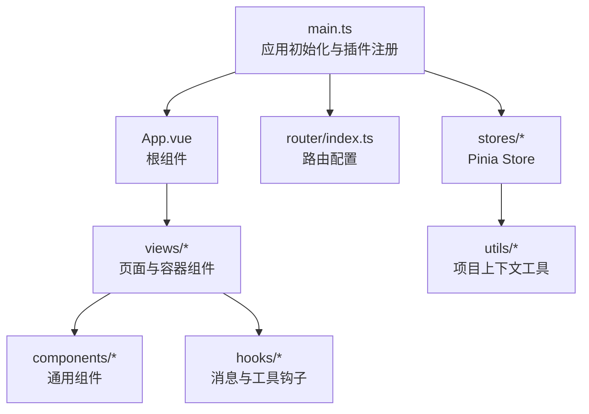
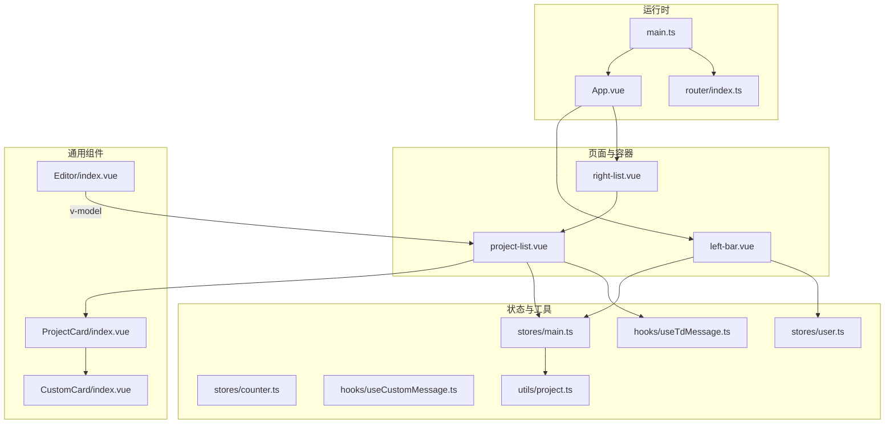
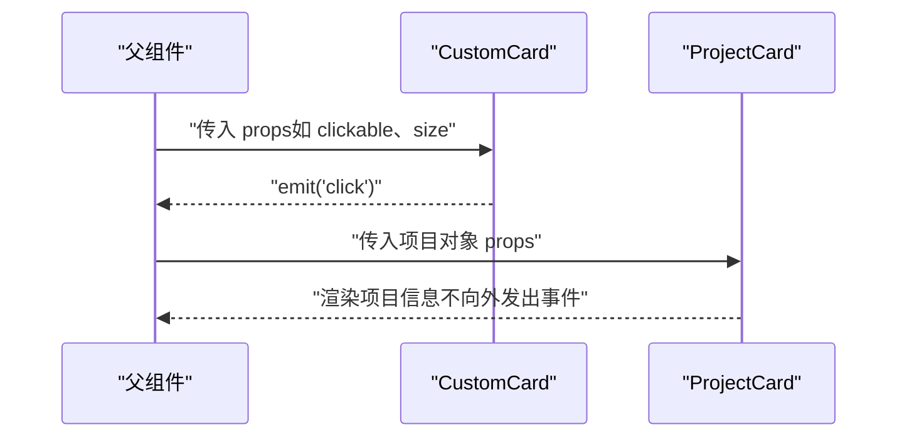
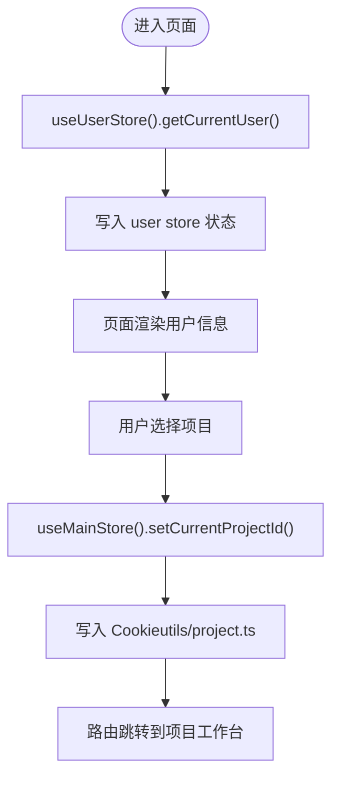
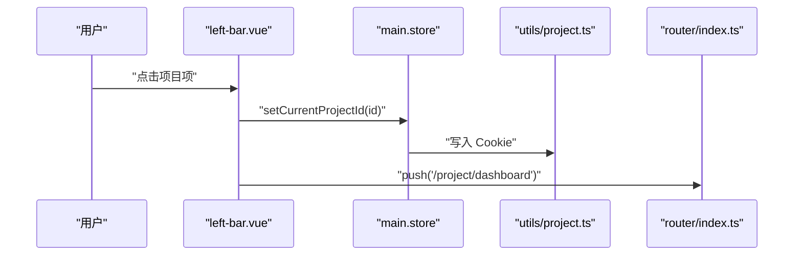
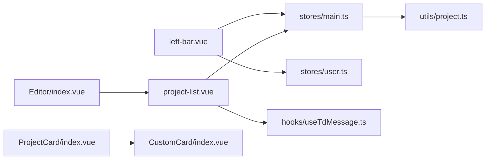

# 组件通信机制

<cite>
**本文引用的文件**
- [src/App.vue](file://src/App.vue)
- [src/main.ts](file://src/main.ts)
- [src/router/index.ts](file://src/router/index.ts)
- [src/stores/main.ts](file://src/stores/main.ts)
- [src/stores/counter.ts](file://src/stores/counter.ts)
- [src/stores/user.ts](file://src/stores/user.ts)
- [src/utils/project.ts](file://src/utils/project.ts)
- [src/components/CustomCard/index.vue](file://src/components/CustomCard/index.vue)
- [src/components/Editor/index.vue](file://src/components/Editor/index.vue)
- [src/components/ProjectCard/index.vue](file://src/components/ProjectCard/index.vue)
- [src/views/dashboard/components/left-bar.vue](file://src/views/dashboard/components/left-bar.vue)
- [src/views/dashboard/components/project-list.vue](file://src/views/dashboard/components/project-list.vue)
- [src/views/dashboard/components/right-list.vue](file://src/views/dashboard/components/right-list.vue)
- [src/hooks/useTdMessage.ts](file://src/hooks/useTdMessage.ts)
- [src/hooks/useCustomMessage.ts](file://src/hooks/useCustomMessage.ts)
</cite>

## 目录
1. [引言](#引言)
2. [项目结构](#项目结构)
3. [核心组件](#核心组件)
4. [架构总览](#架构总览)
5. [详细组件分析](#详细组件分析)
6. [依赖关系分析](#依赖关系分析)
7. [性能考量](#性能考量)
8. [故障排查指南](#故障排查指南)
9. [结论](#结论)
10. [附录](#附录)

## 引言
本文件系统性梳理该 Vue 3 项目的组件通信机制，覆盖 props 传递、事件触发、provide/inject 的使用场景与最佳实践，并结合 Pinia 状态管理与路由导航，解释数据流与状态同步路径。同时给出实际案例与解耦、模块化设计指导，帮助读者在复杂视图中构建清晰、可维护的组件通信体系。

## 项目结构
该项目采用典型的单页应用结构，前端入口在根目录，业务按功能分层组织：
- 入口与全局装配：应用挂载、路由、Pinia 注册
- 视图层：dashboard、auth、project 等页面与子组件
- 组件层：可复用的通用组件（如 CustomCard、Editor、ProjectCard）
- 状态层：Pinia Store（main、user、counter）
- 工具与钩子：消息提示、项目上下文等

图表来源
- [src/main.ts](file://src/main.ts#L1-L28)
- [src/App.vue](file://src/App.vue#L1-L12)
- [src/router/index.ts](file://src/router/index.ts#L1-L82)
- [src/stores/main.ts](file://src/stores/main.ts#L1-L21)
- [src/stores/user.ts](file://src/stores/user.ts#L1-L29)
- [src/stores/counter.ts](file://src/stores/counter.ts#L1-L13)
- [src/utils/project.ts](file://src/utils/project.ts#L1-L10)

章节来源
- [src/main.ts](file://src/main.ts#L1-L28)
- [src/router/index.ts](file://src/router/index.ts#L1-L82)

## 核心组件
- 根组件与入口
  - 根组件负责承载路由视图；入口文件完成 Pinia、路由、全局样式的注册与应用挂载。
- 通用组件
  - CustomCard：通过 props 接收配置，通过 emits 触发点击事件，支持插槽扩展。
  - Editor：基于第三方编辑器封装，使用 defineModel 进行双向绑定，内部根据 isPreview 切换渲染模式。
  - ProjectCard：接收外部项目信息对象，展示基础元数据。
- 页面与容器组件
  - dashboard 子组件：左侧边栏、右侧列表容器，分别承载用户信息、项目列表与时间线等。
- 状态与工具
  - Pinia Store：main（当前项目 ID、加载态）、user（用户信息）、counter（轻量计数）。
  - 消息钩子：useTdMessage（基于 tdesign-vue-next 的消息插件）、useCustomMessage（自定义消息渲染）。

章节来源
- [src/App.vue](file://src/App.vue#L1-L12)
- [src/main.ts](file://src/main.ts#L1-L28)
- [src/components/CustomCard/index.vue](file://src/components/CustomCard/index.vue#L1-L317)
- [src/components/Editor/index.vue](file://src/components/Editor/index.vue#L1-L164)
- [src/components/ProjectCard/index.vue](file://src/components/ProjectCard/index.vue#L1-L75)
- [src/stores/main.ts](file://src/stores/main.ts#L1-L21)
- [src/stores/user.ts](file://src/stores/user.ts#L1-L29)
- [src/stores/counter.ts](file://src/stores/counter.ts#L1-L13)
- [src/hooks/useTdMessage.ts](file://src/hooks/useTdMessage.ts#L1-L60)
- [src/hooks/useCustomMessage.ts](file://src/hooks/useCustomMessage.ts#L1-L73)

## 架构总览
下图展示了从路由到页面、再到通用组件与状态管理的整体交互路径，以及消息提示的调用链路。

图表来源
- [src/main.ts](file://src/main.ts#L1-L28)
- [src/router/index.ts](file://src/router/index.ts#L1-L82)
- [src/App.vue](file://src/App.vue#L1-L12)
- [src/views/dashboard/components/left-bar.vue](file://src/views/dashboard/components/left-bar.vue#L1-L107)
- [src/views/dashboard/components/right-list.vue](file://src/views/dashboard/components/right-list.vue#L1-L21)
- [src/views/dashboard/components/project-list.vue](file://src/views/dashboard/components/project-list.vue#L1-L286)
- [src/components/CustomCard/index.vue](file://src/components/CustomCard/index.vue#L1-L317)
- [src/components/ProjectCard/index.vue](file://src/components/ProjectCard/index.vue#L1-L75)
- [src/components/Editor/index.vue](file://src/components/Editor/index.vue#L1-L164)
- [src/stores/main.ts](file://src/stores/main.ts#L1-L21)
- [src/stores/user.ts](file://src/stores/user.ts#L1-L29)
- [src/stores/counter.ts](file://src/stores/counter.ts#L1-L13)
- [src/hooks/useTdMessage.ts](file://src/hooks/useTdMessage.ts#L1-L60)
- [src/hooks/useCustomMessage.ts](file://src/hooks/useCustomMessage.ts#L1-L73)
- [src/utils/project.ts](file://src/utils/project.ts#L1-L10)

## 详细组件分析

### props 传递与事件触发
- CustomCard
  - 通过 props 接收标题、副标题、尺寸、边框、阴影、封面、加载态等配置，并在模板中根据 props 动态计算类名与渲染逻辑。
  - 通过 emits 定义点击事件，仅在 clickable 为真时触发，实现“只读”与“可交互”的差异化行为。
  - 插槽支持操作区扩展，避免硬编码，提升复用性。
- ProjectCard
  - 以只读 props 形式接收项目对象，内部进行状态值映射与时间格式化，保持组件职责单一。
- Editor
  - 使用 defineModel 实现内容的双向绑定；通过 isPreview 切换编辑器或预览组件，内部使用 watchEffect 合并默认配置与传入配置，保证灵活性与稳定性。

图表来源
- [src/components/CustomCard/index.vue](file://src/components/CustomCard/index.vue#L1-L317)
- [src/components/ProjectCard/index.vue](file://src/components/ProjectCard/index.vue#L1-L75)

章节来源
- [src/components/CustomCard/index.vue](file://src/components/CustomCard/index.vue#L1-L317)
- [src/components/ProjectCard/index.vue](file://src/components/ProjectCard/index.vue#L1-L75)
- [src/components/Editor/index.vue](file://src/components/Editor/index.vue#L1-L164)

### provide/inject 的使用场景与最佳实践
- 当前代码未直接使用 provide/inject。
- 推荐场景
  - 在页面容器（如 dashboard 容器）中通过 provide 提供“当前项目上下文”或“权限上下文”，子树中的多个组件通过 inject 获取，避免跨层级 props 传递。
  - 结合响应式数据（如 ref/computed），确保上下文变更能驱动子树更新。
- 最佳实践
  - 明确 provide/inject 的边界，避免污染全局上下文。
  - 使用 Symbol 作为注入键，降低命名冲突风险。
  - 将上下文拆分为细粒度 provide，便于按需消费与测试。

### 组件与状态管理的集成（Pinia）
- main store
  - 负责“当前项目 ID”与“加载态”等全局状态；提供 setCurrentProjectId 方法，内部同步至 Cookie 工具函数。
- user store
  - 负责用户信息拉取与持久化；提供 getCurrentUser 方法异步更新状态。
- counter store
  - 轻量计数示例，演示组合式 Store 的返回值模式。

图表来源
- [src/stores/user.ts](file://src/stores/user.ts#L1-L29)
- [src/stores/main.ts](file://src/stores/main.ts#L1-L21)
- [src/utils/project.ts](file://src/utils/project.ts#L1-L10)
- [src/views/dashboard/components/left-bar.vue](file://src/views/dashboard/components/left-bar.vue#L1-L107)
- [src/views/dashboard/components/project-list.vue](file://src/views/dashboard/components/project-list.vue#L1-L286)

章节来源
- [src/stores/main.ts](file://src/stores/main.ts#L1-L21)
- [src/stores/user.ts](file://src/stores/user.ts#L1-L29)
- [src/stores/counter.ts](file://src/stores/counter.ts#L1-L13)
- [src/utils/project.ts](file://src/utils/project.ts#L1-L10)
- [src/views/dashboard/components/left-bar.vue](file://src/views/dashboard/components/left-bar.vue#L1-L107)
- [src/views/dashboard/components/project-list.vue](file://src/views/dashboard/components/project-list.vue#L1-L286)

### 数据流向与状态同步机制
- 路由驱动：路由配置决定页面结构与导航行为，页面组件通过 store 与工具函数协同完成数据拉取与状态更新。
- 状态同步：store 的状态变化会触发依赖该状态的组件重新渲染；当切换项目时，main store 的 currentProjectId 与 Cookie 同步，后续页面读取该值进行初始化。
- 事件驱动：父组件通过 props 控制子组件行为，子组件通过 emits 向上传递用户交互信号，形成“自底向上”的事件流。

图表来源
- [src/views/dashboard/components/left-bar.vue](file://src/views/dashboard/components/left-bar.vue#L1-L107)
- [src/stores/main.ts](file://src/stores/main.ts#L1-L21)
- [src/utils/project.ts](file://src/utils/project.ts#L1-L10)
- [src/router/index.ts](file://src/router/index.ts#L1-L82)

章节来源
- [src/views/dashboard/components/left-bar.vue](file://src/views/dashboard/components/left-bar.vue#L1-L107)
- [src/stores/main.ts](file://src/stores/main.ts#L1-L21)
- [src/utils/project.ts](file://src/utils/project.ts#L1-L10)
- [src/router/index.ts](file://src/router/index.ts#L1-L82)

### 实际案例与解决方案
- 案例一：项目列表与卡片的交互
  - 项目列表组件通过 props 控制排序字段与方向，内部通过 watch 监听状态变化并重新拉取数据；卡片组件接收项目对象并在点击时向父级发出打开项目事件，父级统一处理路由跳转与 store 更新。
  - 解决方案要点
    - 使用 props 传递只读配置，避免在子组件内修改外部状态。
    - 通过 emits 传递“意图”而非“状态”，保持数据流单向。
    - 对于复杂交互，优先在父组件集中处理，减少子组件心智负担。
- 案例二：编辑器与预览的切换
  - 编辑器组件通过 isPreview 切换渲染模式，内部合并默认配置与传入配置，使用 defineModel 简化双向绑定；父组件通过 v-model 与状态管理联动，实现“编辑态—预览态”的无缝切换。
  - 解决方案要点
    - 使用 defineModel 统一 v-model 行为，简化父组件绑定。
    - 通过 watchEffect 合并配置，避免重复逻辑。
    - 对于第三方组件，尽量在封装层做“配置合并+能力收敛”。

章节来源
- [src/views/dashboard/components/project-list.vue](file://src/views/dashboard/components/project-list.vue#L1-L286)
- [src/components/ProjectCard/index.vue](file://src/components/ProjectCard/index.vue#L1-L75)
- [src/components/Editor/index.vue](file://src/components/Editor/index.vue#L1-L164)

### 组件解耦与模块化设计指导
- 单一职责：每个组件专注于自身 UI 与交互，不直接处理全局状态或网络请求。
- 明确接口：通过 props 与 emits 暴露稳定接口，避免对内部实现细节的耦合。
- 封装与收敛：将第三方组件能力收敛到封装组件中，统一配置与行为。
- 状态下沉：将共享状态放入 store，组件通过 store 或 provide/inject 获取，避免跨层级 props。
- 可测试性：通过 props 注入与 emits 触发，便于单元测试断言。

## 依赖关系分析
- 组件依赖
  - 页面容器依赖通用组件与工具钩子；通用组件依赖类型定义与枚举。
- 状态依赖
  - 页面组件依赖 main 与 user store；store 依赖工具函数（如 Cookie）。
- 路由依赖
  - 页面组件依赖路由配置与导航能力。

图表来源
- [src/views/dashboard/components/left-bar.vue](file://src/views/dashboard/components/left-bar.vue#L1-L107)
- [src/views/dashboard/components/project-list.vue](file://src/views/dashboard/components/project-list.vue#L1-L286)
- [src/components/ProjectCard/index.vue](file://src/components/ProjectCard/index.vue#L1-L75)
- [src/components/CustomCard/index.vue](file://src/components/CustomCard/index.vue#L1-L317)
- [src/components/Editor/index.vue](file://src/components/Editor/index.vue#L1-L164)
- [src/stores/main.ts](file://src/stores/main.ts#L1-L21)
- [src/stores/user.ts](file://src/stores/user.ts#L1-L29)
- [src/hooks/useTdMessage.ts](file://src/hooks/useTdMessage.ts#L1-L60)
- [src/utils/project.ts](file://src/utils/project.ts#L1-L10)

章节来源
- [src/views/dashboard/components/left-bar.vue](file://src/views/dashboard/components/left-bar.vue#L1-L107)
- [src/views/dashboard/components/project-list.vue](file://src/views/dashboard/components/project-list.vue#L1-L286)
- [src/components/ProjectCard/index.vue](file://src/components/ProjectCard/index.vue#L1-L75)
- [src/components/CustomCard/index.vue](file://src/components/CustomCard/index.vue#L1-L317)
- [src/components/Editor/index.vue](file://src/components/Editor/index.vue#L1-L164)
- [src/stores/main.ts](file://src/stores/main.ts#L1-L21)
- [src/stores/user.ts](file://src/stores/user.ts#L1-L29)
- [src/hooks/useTdMessage.ts](file://src/hooks/useTdMessage.ts#L1-L60)
- [src/utils/project.ts](file://src/utils/project.ts#L1-L10)

## 性能考量
- 渲染优化
  - 使用 v-show/v-if 控制条件渲染，避免不必要的节点创建。
  - 对长列表使用虚拟滚动或分页，减少一次性渲染压力。
- 状态更新
  - 将大对象拆分为细粒度 store 字段，避免无关组件因全局状态变化而重渲染。
  - 使用 computed 与 shallowRef 减少不必要响应式开销。
- 事件与监听
  - 对高频事件（如滚动、输入）使用节流/防抖，降低回调频率。
- 第三方组件
  - 对体积较大的第三方组件按需引入与懒加载，减少首屏体积。

## 故障排查指南
- 消息提示
  - 使用 tdesign-vue-next 的消息插件进行统一提示；若出现样式异常，检查主题与图标开关参数。
  - 自定义消息组件通过 createVNode 与 render 手动挂载，注意销毁时机与容器元素选择。
- 项目 ID 不生效
  - 确认 main store 的 setCurrentProjectId 是否被调用，Cookie 是否写入成功；页面初始化时读取 Cookie 并同步到 store。
- 路由跳转无效
  - 检查路由配置与命名；确认导航守卫与权限逻辑未拦截跳转。
- 编辑器配置不生效
  - 确认 isPreview 切换逻辑与默认配置合并顺序；检查 v-model 绑定是否正确。

章节来源
- [src/hooks/useTdMessage.ts](file://src/hooks/useTdMessage.ts#L1-L60)
- [src/hooks/useCustomMessage.ts](file://src/hooks/useCustomMessage.ts#L1-L73)
- [src/stores/main.ts](file://src/stores/main.ts#L1-L21)
- [src/utils/project.ts](file://src/utils/project.ts#L1-L10)
- [src/router/index.ts](file://src/router/index.ts#L1-L82)
- [src/components/Editor/index.vue](file://src/components/Editor/index.vue#L1-L164)

## 结论
本项目通过明确的 props/emit、Pinia 状态管理与路由导航，实现了清晰的数据流与组件通信。建议在现有基础上进一步引入 provide/inject 以承接上下文，完善事件总线或轻量事件中心以处理跨层级通信，并持续以单一职责与接口稳定性的原则推进组件解耦与模块化演进。

## 附录
- 关键流程回顾
  - 用户在左侧边栏选择项目 → 更新 main store 的 currentProjectId → 写入 Cookie → 跳转到项目工作台。
  - 项目列表组件根据筛选条件拉取数据 → 渲染卡片或表格 → 卡片点击触发打开项目 → 统一更新 store 与路由。
- 最佳实践清单
  - 优先使用 props 传递配置，emits 传递意图。
  - 将共享状态放入 store，避免跨层级 props。
  - 对第三方组件进行封装，收敛配置与行为。
  - 使用 provide/inject 传递上下文，避免“祖传 props”。