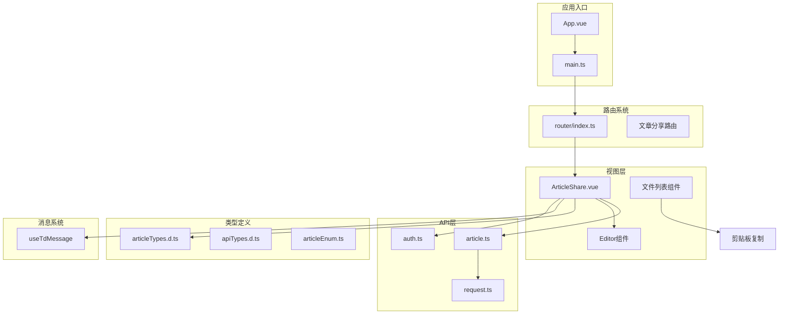
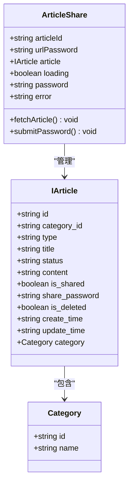
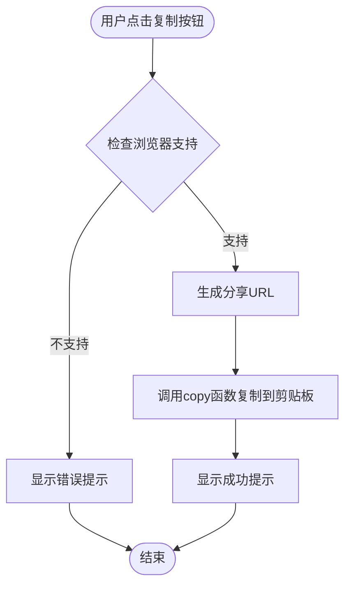
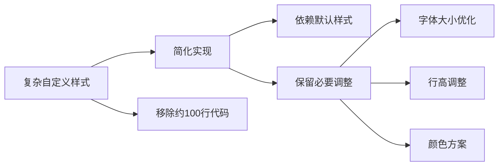
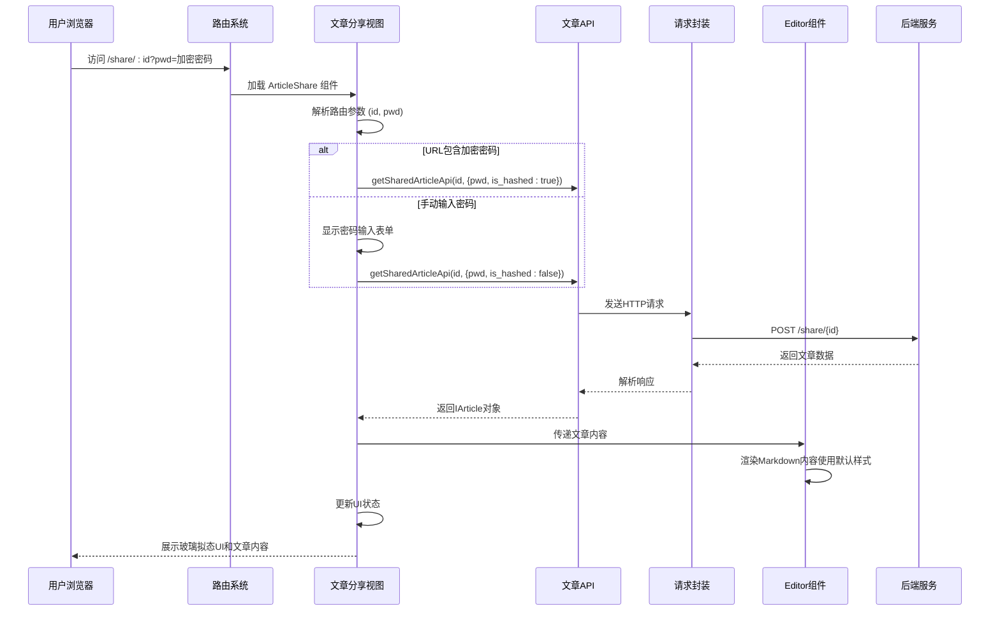
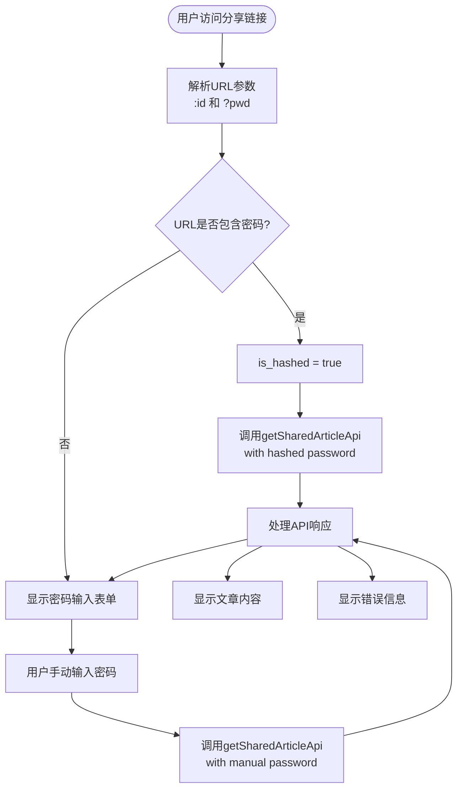
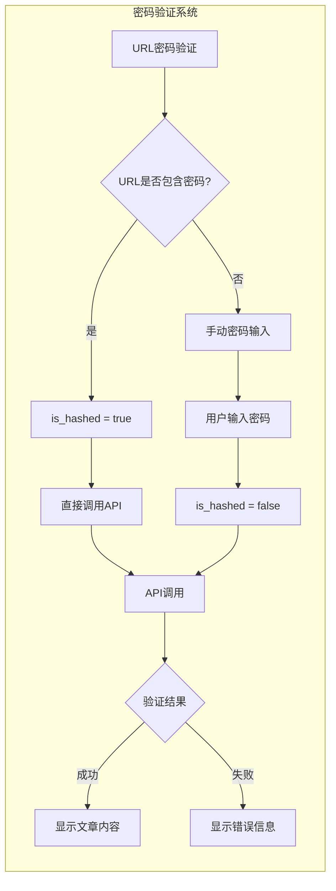
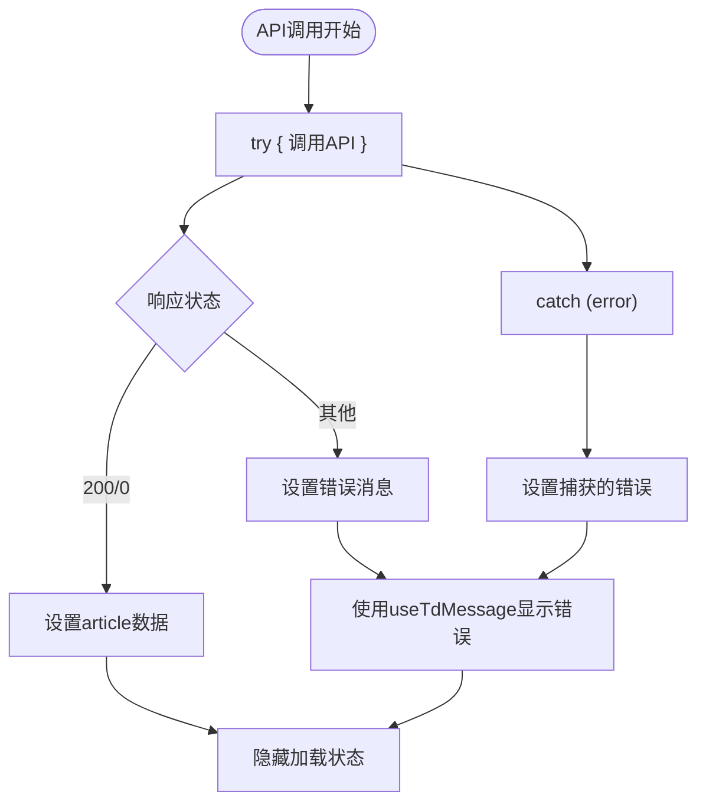
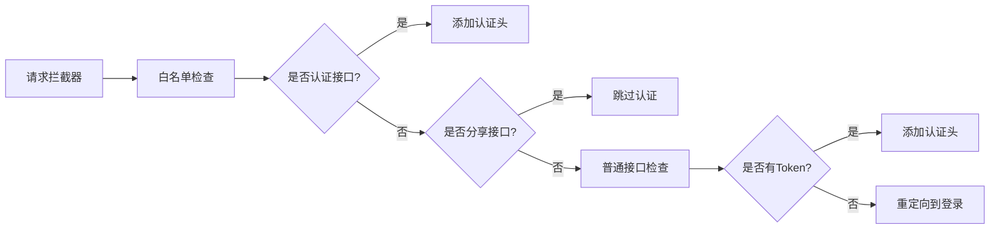
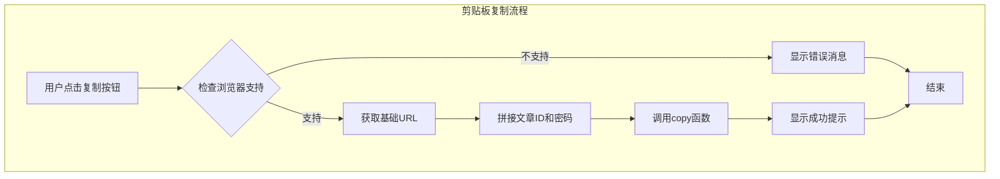

# 文章分享页面

<cite>
**本文档引用的文件**
- [ArticleShare.vue](file://src/views/share/ArticleShare.vue)
- [index.ts](file://src/router/index.ts)
- [article.ts](file://src/api/article.ts)
- [articleTypes.d.ts](file://src/types/articleTypes.d.ts)
- [apiTypes.d.ts](file://src/types/apiTypes.d.ts)
- [index.vue](file://src/components/Editor/index.vue)
- [request.ts](file://src/utils/request/request.ts)
- [index.ts](file://src/utils/request/index.ts)
- [useTdMessage.ts](file://src/hooks/useTdMessage.ts)
- [auth.ts](file://src/utils/auth.ts)
- [main.ts](file://src/main.ts)
- [App.vue](file://src/App.vue)
- [file-list.vue](file://src/views/project/components/file-list.vue)
</cite>

## 更新摘要
**变更内容**
- 新增双密码验证模式（URL密码和手动输入）支持
- 集成现代化玻璃拟态UI设计系统
- 实现Editor组件的深度集成和内容预览功能
- 改进错误处理和加载状态管理机制
- 添加请求拦截器中的分享URL白名单配置
- 优化响应式设计和移动端适配
- **新增文件列表组件的剪贴板复制功能**，支持一键复制分享链接
- **简化Markdown预览样式实现**，移除约100行复杂自定义样式，采用Editor组件默认样式并添加必要调整

## 目录
1. [简介](#简介)
2. [项目结构](#项目结构)
3. [核心组件](#核心组件)
4. [架构概览](#架构概览)
5. [详细组件分析](#详细组件分析)
6. [依赖关系分析](#依赖关系分析)
7. [性能考虑](#性能考虑)
8. [故障排除指南](#故障排除指南)
9. [结论](#结论)

## 简介

文章分享页面是 LiFocus Web 应用中的一个核心功能模块，经过重大升级后，现在提供了更加现代化和用户友好的文章访问体验。该页面实现了双密码验证机制（支持URL密码和手动输入）、集成了强大的Editor组件用于内容展示、采用了现代化的玻璃拟态UI设计，并具备完善的错误处理和加载状态管理功能。

**更新** 新增了文件列表组件的剪贴板复制功能，用户可以通过多种方式分享文章，包括一键复制分享链接。同时，Markdown预览样式经过简化重构，移除了约100行复杂自定义样式，采用更简洁的实现方式，依赖Editor组件默认样式并添加了必要的调整。

## 项目结构

LiFocus Web 采用现代化的 Vue 3 + TypeScript 技术栈构建，项目结构清晰，遵循功能模块化组织原则：



**图表来源**
- [App.vue](file://src/App.vue#L1-L12)
- [main.ts](file://src/main.ts#L1-L28)
- [router/index.ts](file://src/router/index.ts#L1-L90)
- [file-list.vue](file://src/views/project/components/file-list.vue#L28-L211)

**章节来源**
- [main.ts](file://src/main.ts#L1-L28)
- [App.vue](file://src/App.vue#L1-L12)

## 核心组件

### 文章分享视图组件

文章分享页面的核心组件是 `ArticleShare.vue`，经过重大升级后，它现在具备了更加完善的功能特性和现代化的UI设计。

#### 主要功能特性

1. **双密码验证机制**：支持通过URL参数传递加密密码和手动输入密码两种方式
2. **现代化玻璃拟态UI设计**：采用渐变背景、毛玻璃效果和阴影设计
3. **Editor组件深度集成**：使用自定义Editor组件进行内容预览展示
4. **完整的状态管理**：包含加载状态、错误状态、密码输入状态和文章数据状态
5. **响应式设计优化**：针对移动端设备进行专门的UI适配
6. **简化的Markdown预览样式**：移除复杂自定义样式，采用Editor组件默认样式并添加必要调整

#### 关键数据结构



**图表来源**
- [articleTypes.d.ts](file://src/types/articleTypes.d.ts#L9-L25)
- [ArticleShare.vue](file://src/views/share/ArticleShare.vue#L1-L479)

**章节来源**
- [ArticleShare.vue](file://src/views/share/ArticleShare.vue#L1-L479)
- [articleTypes.d.ts](file://src/types/articleTypes.d.ts#L1-L65)

### 文件列表组件的剪贴板功能

**新增** 文件列表组件现在集成了剪贴板复制功能，为用户提供便捷的文章分享方式。

#### 剪贴板复制功能特性

1. **一键复制分享链接**：点击复制图标即可将文章分享链接复制到剪贴板
2. **浏览器兼容性检测**：自动检测浏览器是否支持剪贴板API
3. **实时反馈机制**：复制成功后显示成功提示消息
4. **动态链接生成**：根据当前文章ID和分享密码生成完整的分享URL

#### 剪贴板复制实现流程



**图表来源**
- [file-list.vue](file://src/views/project/components/file-list.vue#L201-L211)

**章节来源**
- [file-list.vue](file://src/views/project/components/file-list.vue#L201-L211)

### Markdown预览样式简化

**更新** Markdown预览样式经过重大简化重构，移除了约100行复杂自定义样式，采用更简洁的实现方式：

#### 简化后的样式特点

1. **依赖Editor组件默认样式**：不再需要复杂的自定义样式覆盖
2. **保留必要调整**：仅保留必要的样式调整以确保最佳显示效果
3. **响应式优化**：针对不同屏幕尺寸提供优化的字体大小和间距
4. **主题一致性**：与Editor组件的默认主题保持一致

#### 样式简化对比



**图表来源**
- [ArticleShare.vue](file://src/views/share/ArticleShare.vue#L300-L305)
- [ArticleShare.vue](file://src/views/share/ArticleShare.vue#L356-L366)

**章节来源**
- [ArticleShare.vue](file://src/views/share/ArticleShare.vue#L300-L366)

## 架构概览

文章分享页面采用分层架构设计，经过升级后确保了更好的可维护性、扩展性和用户体验：



**图表来源**
- [router/index.ts](file://src/router/index.ts#L74-L81)
- [article.ts](file://src/api/article.ts#L66-L74)
- [ArticleShare.vue](file://src/views/share/ArticleShare.vue#L19-L59)

## 详细组件分析

### 路由配置

文章分享页面通过 Vue Router 的动态路由参数实现，支持以下URL格式：
- `/share/:id` - 基础分享链接
- `/share/:id?pwd=加密密码` - 带加密密码的分享链接

#### 路由配置详情



**图表来源**
- [router/index.ts](file://src/router/index.ts#L74-L81)
- [ArticleShare.vue](file://src/views/share/ArticleShare.vue#L10-L59)

**章节来源**
- [router/index.ts](file://src/router/index.ts#L74-L81)

### 双密码验证机制

系统实现了双密码验证模式，提供了更加灵活和安全的访问控制：

#### 密码验证流程



**图表来源**
- [ArticleShare.vue](file://src/views/share/ArticleShare.vue#L19-L48)

**章节来源**
- [ArticleShare.vue](file://src/views/share/ArticleShare.vue#L19-L48)

### API 交互流程

文章分享功能通过专门的 API 接口与后端通信，实现了安全的文章访问控制和现代化的UI展示。

#### 数据流分析

```mermaid
flowchart LR
subgraph "前端层"
A[ArticleShare.vue] --> B[getSharedArticleApi]
B --> C[httpClient.post]
end
subgraph "请求封装层"
C --> D[LFRequest.request]
D --> E[axios实例]
end
subgraph "认证层"
F[auth.ts] --> G[getToken]
G --> H[Authorization头]
end
subgraph "消息系统"
I[useTdMessage] --> J[错误提示]
end
subgraph "后端层"
E --> K[分享接口 /share/{id}]
K --> L[密码验证]
L --> M[文章数据查询]
M --> N[返回IArticle]
end
subgraph "响应处理"
N --> O[IApiResponse]
O --> P[状态码检查]
P --> Q[成功: 更新article]
P --> R[失败: 显示错误]
Q --> S[触发Editor渲染]
R --> T[使用useTdMessage显示错误]
end
```

**图表来源**
- [article.ts](file://src/api/article.ts#L66-L74)
- [request.ts](file://src/utils/request/request.ts#L55-L75)
- [index.ts](file://src/utils/request/index.ts#L13-L43)

**章节来源**
- [article.ts](file://src/api/article.ts#L66-L74)
- [request.ts](file://src/utils/request/request.ts#L1-L99)

### Editor组件集成

文章内容通过自定义的 Editor 组件进行展示，该组件基于 md-editor-v3 实现，经过升级后提供了更加丰富的Markdown渲染能力和现代化的UI设计。

#### 编辑器配置

| 配置项 | 默认值 | 说明 |
|--------|--------|------|
| isPreview | true | 预览模式 |
| theme | light | 主题设置 |
| preview | true | 显示预览 |
| codeTheme | github | 代码主题 |
| previewTheme | github | 预览主题 |
| disabled | true | 禁用编辑功能 |
| toolbars | 丰富工具栏 | 包含标题、列表、表格等工具 |

**更新** 编辑器组件现在使用默认的 `github` 预览主题，移除了之前复杂的自定义样式覆盖，实现了更简洁的样式管理。

**章节来源**
- [index.vue](file://src/components/Editor/index.vue#L1-L164)

### 玻璃拟态UI设计

系统采用了现代化的玻璃拟态设计风格，提供了优雅的视觉体验：

#### UI设计特点

```mermaid
flowchart TD
Glass[玻璃拟态设计] --> Gradient[渐变背景]
Glass --> Blur[毛玻璃效果]
Glass --> Shadow[立体阴影]
Gradient --> Background[linear-gradient]
Blur --> Backdrop[backdrop-filter: blur(10px)]
Shadow --> BoxShadow[多重阴影叠加]
```

**图表来源**
- [ArticleShare.vue](file://src/views/share/ArticleShare.vue#L123-L147)

**章节来源**
- [ArticleShare.vue](file://src/views/share/ArticleShare.vue#L119-L479)

### 错误处理机制

系统实现了多层次的错误处理机制，确保用户体验的稳定性和一致性：



**图表来源**
- [ArticleShare.vue](file://src/views/share/ArticleShare.vue#L19-L39)

**章节来源**
- [ArticleShare.vue](file://src/views/share/ArticleShare.vue#L19-L39)

### 请求拦截器白名单配置

系统在请求拦截器中添加了分享URL白名单配置，确保分享功能的正常访问：

#### 白名单配置



**图表来源**
- [index.ts](file://src/utils/request/index.ts#L9-L43)

**章节来源**
- [index.ts](file://src/utils/request/index.ts#L9-L43)

### 剪贴板复制功能

**新增** 文件列表组件集成了剪贴板复制功能，为用户提供便捷的文章分享方式。

#### 剪贴板复制实现细节



**图表来源**
- [file-list.vue](file://src/views/project/components/file-list.vue#L201-L211)

**章节来源**
- [file-list.vue](file://src/views/project/components/file-list.vue#L201-L211)

## 依赖关系分析

文章分享页面的依赖关系体现了清晰的分层架构和现代化的设计理念：

```mermaid
graph TB
subgraph "外部依赖"
Vue[Vue 3]
TS[TypeScript]
TDesign[TDesign Vue Next]
MD[md-editor-v3]
Axios[Axios]
JsCookie[js-cookie]
Dayjs[dayjs]
VueUse[@vueuse/core]
end
subgraph "内部模块"
Router[路由系统]
Store[状态管理]
Utils[工具函数]
Types[类型定义]
Hooks[自定义钩子]
end
subgraph "业务模块"
ShareView[文章分享视图]
ArticleAPI[文章API]
EditorComp[编辑器组件]
AuthUtils[认证工具]
MessageHook[消息钩子]
RequestUtil[请求工具]
FileList[文件列表组件]
Clipboard[剪贴板功能]
end
ShareView --> Router
ShareView --> ArticleAPI
ShareView --> EditorComp
ShareView --> Types
ShareView --> Hooks
ShareView --> MessageHook
ArticleAPI --> AuthUtils
ArticleAPI --> RequestUtil
ArticleAPI --> Types
EditorComp --> MD
EditorComp --> TDesign
MessageHook --> TDesign
RequestUtil --> Axios
RequestUtil --> AuthUtils
FileList --> Clipboard
Clipboard --> VueUse
Router --> Vue
Store --> Vue
Utils --> TS
```

**图表来源**
- [package.json](file://package.json#L18-L39)
- [main.ts](file://src/main.ts#L1-L28)
- [file-list.vue](file://src/views/project/components/file-list.vue#L5-L28)

**章节来源**
- [package.json](file://package.json#L1-L60)

## 性能考虑

### 加载优化策略

1. **懒加载路由**：文章分享页面采用动态导入，减少初始包体积
2. **条件渲染**：根据状态切换不同的 UI 组件，避免不必要的渲染
3. **响应式设计**：针对移动端进行优化，提升用户体验
4. **Editor组件优化**：使用预览模式禁用编辑功能，减少计算开销
5. **剪贴板功能优化**：使用VueUse的useClipboard，提供更好的性能和兼容性
6. **样式优化**：移除复杂自定义样式，减少CSS计算开销

### 缓存策略

- **本地存储**：使用 Pinia 持久化存储主要状态
- **会话管理**：智能处理用户会话状态，避免重复登录
- **请求缓存**：合理利用浏览器缓存机制
- **UI状态缓存**：文章内容渲染后保持状态

### 样式性能优化

**更新** Markdown预览样式经过优化，移除了约100行复杂自定义样式，采用更简洁的实现方式：

1. **减少CSS规则数量**：从复杂的自定义样式简化为必要的调整
2. **降低样式计算复杂度**：依赖Editor组件默认样式，减少样式匹配开销
3. **优化响应式样式**：仅保留必要的媒体查询规则
4. **提升渲染性能**：减少DOM样式计算，提高渲染效率

## 故障排除指南

### 常见问题及解决方案

| 问题类型 | 症状 | 可能原因 | 解决方案 |
|----------|------|----------|----------|
| 401未授权 | 登录状态异常提示 | Token过期或无效 | 清除缓存并重新登录 |
| 403禁止访问 | 密码错误或权限不足 | 密码错误或文章未分享 | 检查密码或联系作者 |
| 404资源不存在 | 文章不存在 | ID错误或已被删除 | 检查分享链接有效性 |
| 网络超时 | 请求超时 | 网络不稳定 | 检查网络连接或重试 |
| UI渲染异常 | 页面显示不完整 | Editor组件加载问题 | 刷新页面或检查浏览器兼容性 |
| 剪贴板复制失败 | 复制功能不可用 | 浏览器不支持或权限问题 | 检查浏览器兼容性或手动复制链接 |
| Markdown样式异常 | 内容显示不正确 | 样式冲突或主题不匹配 | 检查Editor组件配置或刷新页面 |

### 调试建议

1. **检查网络请求**：确认 `/share/{id}` 接口调用正常
2. **验证参数格式**：确保文章 ID 和密码格式正确
3. **查看控制台错误**：分析具体的错误信息和堆栈
4. **测试不同环境**：验证开发和生产环境的行为一致性
5. **检查Glass UI效果**：确认CSS变量和动画正常工作
6. **验证剪贴板功能**：测试浏览器兼容性和权限设置
7. **检查样式加载**：确认Editor组件样式正确加载

**章节来源**
- [request.ts](file://src/utils/request/request.ts#L30-L39)

## 结论

文章分享页面经过重大升级后，已成为 LiFocus Web 应用中最具现代化特征的功能模块之一。通过双密码验证机制、Editor组件深度集成、玻璃拟态UI设计、完善的错误处理和加载状态管理，以及智能化的请求拦截器配置，该功能模块为用户提供了卓越的安全性和用户体验。

**更新** 新增的文件列表组件剪贴板复制功能进一步增强了用户的分享体验，提供了更加便捷的一键复制分享链接功能。同时，Markdown预览样式的简化重构显著提升了代码可维护性和性能表现，移除了约100行复杂自定义样式，采用更简洁的实现方式，依赖Editor组件默认样式并添加了必要的调整。

### 主要优势

1. **安全性增强**：双密码验证模式提供了更加灵活和安全的访问控制
2. **用户体验优化**：现代化的玻璃拟态UI设计提升了视觉体验
3. **技术架构先进**：Editor组件集成和响应式设计体现了最新的前端技术
4. **可维护性提升**：完善的错误处理和状态管理机制便于后期维护
5. **性能表现优秀**：合理的优化策略确保了良好的加载速度和交互流畅度
6. **分享方式多样化**：支持多种分享方式，包括剪贴板复制功能
7. **代码质量提升**：样式简化重构提高了代码可读性和可维护性

### 改进建议

1. **SEO优化**：可以考虑为分享页面添加适当的SEO元数据
2. **国际化支持**：支持多语言界面以服务更广泛的用户群体
3. **离线支持**：实现基本的离线阅读功能
4. **性能监控**：添加性能指标监控以持续优化用户体验
5. **无障碍访问**：增强无障碍访问支持以服务更多用户群体
6. **分享统计**：添加分享链接的访问统计功能
7. **社交平台集成**：支持直接分享到微信、微博等社交平台
8. **主题定制**：允许用户自定义预览主题以满足个性化需求