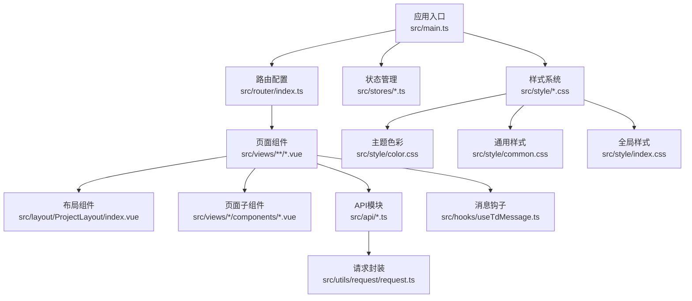
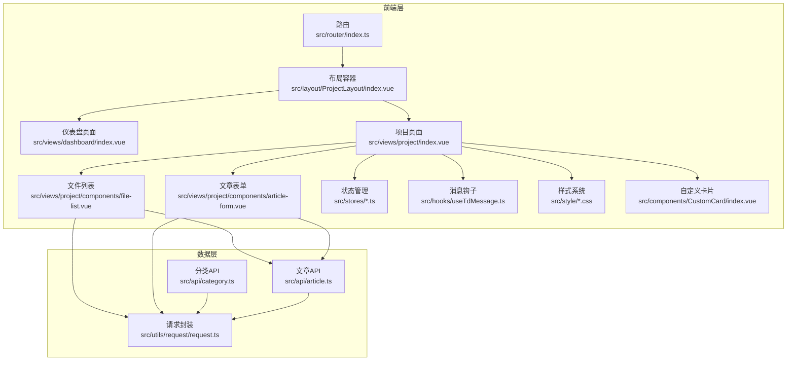
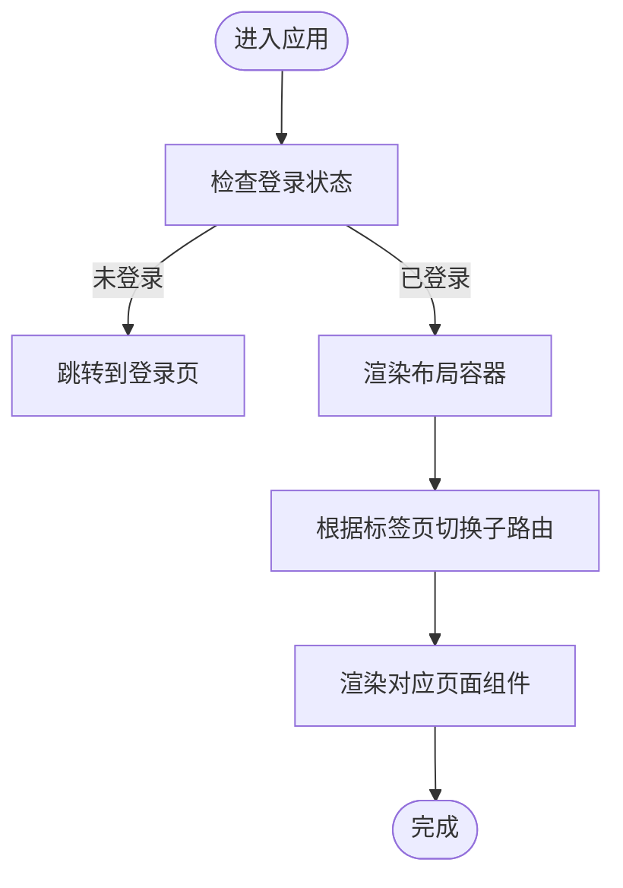
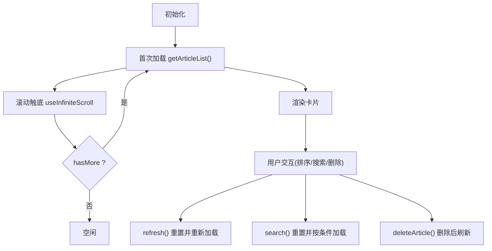
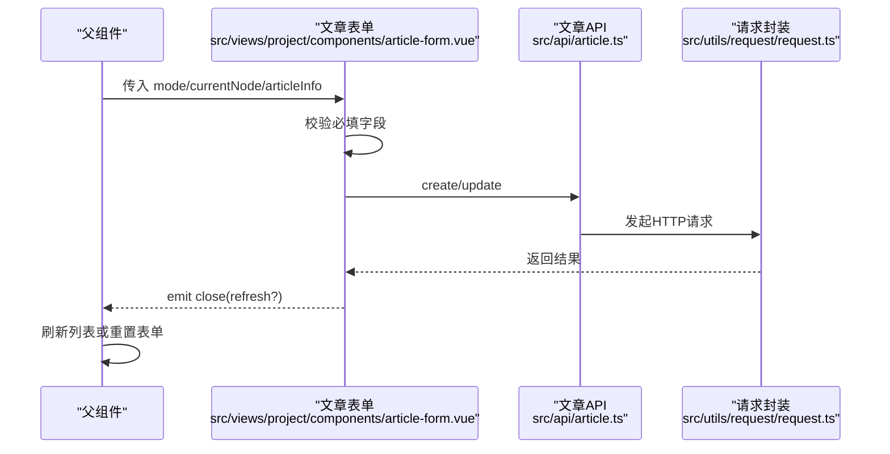
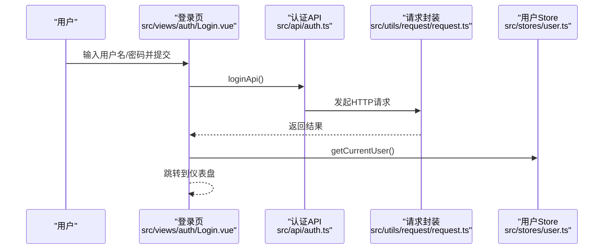
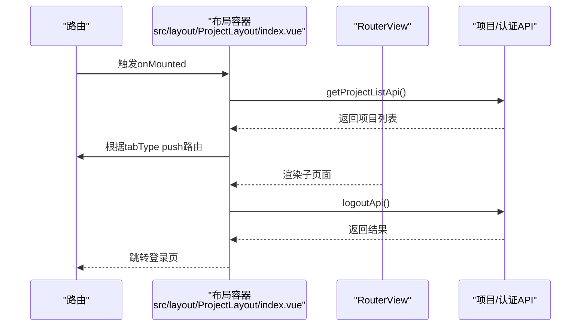
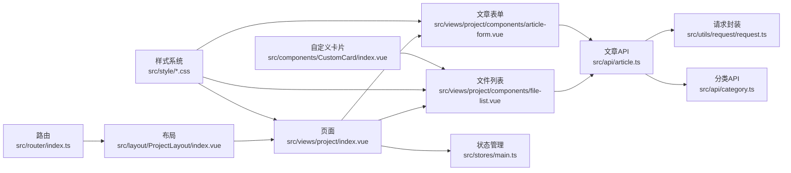

# 页面组件

<cite>
**本文引用的文件**
- [src/router/index.ts](file://src/router/index.ts)
- [src/main.ts](file://src/main.ts)
- [src/App.vue](file://src/App.vue)
- [src/layout/ProjectLayout/index.vue](file://src/layout/ProjectLayout/index.vue)
- [src/views/dashboard/index.vue](file://src/views/dashboard/index.vue)
- [src/views/project/index.vue](file://src/views/project/index.vue)
- [src/views/project/components/file-list.vue](file://src/views/project/components/file-list.vue)
- [src/views/project/components/article-form.vue](file://src/views/project/components/article-form.vue)
- [src/views/auth/Login.vue](file://src/views/auth/Login.vue)
- [src/stores/main.ts](file://src/stores/main.ts)
- [src/stores/user.ts](file://src/stores/user.ts)
- [src/api/category.ts](file://src/api/category.ts)
- [src/api/article.ts](file://src/api/article.ts)
- [src/utils/request/request.ts](file://src/utils/request/request.ts)
- [src/hooks/useTdMessage.ts](file://src/hooks/useTdMessage.ts)
- [src/types/articleTypes.d.ts](file://src/types/articleTypes.d.ts)
- [src/types/categoryTypes.d.ts](file://src/types/categoryTypes.d.ts)
- [src/style/color.css](file://src/style/color.css)
- [src/style/common.css](file://src/style/common.css)
- [src/style/index.css](file://src/style/index.css)
- [src/components/CustomCard/index.vue](file://src/components/CustomCard/index.vue)
- [src/views/dashboard/components/left-bar.vue](file://src/views/dashboard/components/left-bar.vue)
- [src/views/dashboard/components/project-list.vue](file://src/views/dashboard/components/project-list.vue)
- [src/views/dashboard/components/right-list.vue](file://src/views/dashboard/components/right-list.vue)
</cite>

## 更新摘要
**变更内容**
- 更新了文章表单组件的样式改进和交互状态增强
- 增强了文件列表组件的统一卡片样式和响应式设计
- 改进了仪表板组件的整体视觉设计和交互体验
- 新增了统一的主题色彩系统和动画效果
- 优化了所有页面组件的响应式布局和状态反馈

## 目录
1. [引言](#引言)
2. [项目结构](#项目结构)
3. [核心组件](#核心组件)
4. [架构总览](#架构总览)
5. [详细组件分析](#详细组件分析)
6. [依赖关系分析](#依赖关系分析)
7. [性能考虑](#性能考虑)
8. [故障排查指南](#故障排查指南)
9. [结论](#结论)
10. [附录：开发规范与最佳实践](#附录开发规范与最佳实践)

## 引言
本文件围绕页面组件的设计模式与实现策略展开，系统性梳理了路由映射、页面组织结构、数据流管理、状态管理与API层交互、生命周期管理与性能优化，并给出开发规范与常见页面组件的实现示例与使用指南。目标是帮助开发者在不深入源码的前提下，快速理解并高效构建可维护、高性能的页面组件。

**更新** 本次更新反映了应用在样式改进、响应式设计和交互状态方面的重大升级，所有页面组件现在具有统一的视觉风格和更好的用户体验。

## 项目结构
- 应用入口与全局装配：应用在入口文件中挂载路由与状态管理，并引入全局样式与第三方组件库。
- 路由与页面：通过路由配置将页面组件按功能域划分，支持嵌套路由与布局容器。
- 布局与页面：布局组件负责顶部导航、侧边栏、主内容区等，页面组件聚焦业务视图。
- 数据与状态：页面组件通过Pinia Store共享状态，通过API模块访问后端服务；统一请求封装提供拦截器与错误处理。
- 组件化：页面内进一步拆分为小组件，如文件列表、表单、卡片等，提升复用与可测试性。
- **样式系统**：统一的主题色彩系统、响应式设计和动画效果，确保所有组件具有一致的视觉体验。

**图表来源**
- [src/main.ts:1-28](file://src/main.ts#L1-L28)
- [src/router/index.ts:1-82](file://src/router/index.ts#L1-L82)
- [src/layout/ProjectLayout/index.vue:1-135](file://src/layout/ProjectLayout/index.vue#L1-L135)
- [src/views/project/index.vue:1-371](file://src/views/project/index.vue#L1-L371)
- [src/views/project/components/file-list.vue:1-266](file://src/views/project/components/file-list.vue#L1-L266)
- [src/views/project/components/article-form.vue:1-214](file://src/views/project/components/article-form.vue#L1-L214)
- [src/api/category.ts:1-50](file://src/api/category.ts#L1-L50)
- [src/utils/request/request.ts:1-99](file://src/utils/request/request.ts#L1-L99)
- [src/hooks/useTdMessage.ts:1-60](file://src/hooks/useTdMessage.ts#L1-L60)
- [src/style/color.css:1-28](file://src/style/color.css#L1-L28)
- [src/style/common.css:1-13](file://src/style/common.css#L1-L13)
- [src/style/index.css:1-12](file://src/style/index.css#L1-L12)

**章节来源**
- [src/main.ts:1-28](file://src/main.ts#L1-L28)
- [src/router/index.ts:1-82](file://src/router/index.ts#L1-L82)
- [src/style/color.css:1-28](file://src/style/color.css#L1-L28)
- [src/style/common.css:1-13](file://src/style/common.css#L1-L13)
- [src/style/index.css:1-12](file://src/style/index.css#L1-L12)

## 核心组件
- 应用根组件：承载全局路由视图渲染，作为页面容器的最外层。
- 路由系统：集中定义页面级路由与嵌套路由，支持懒加载与元信息。
- 布局容器：提供项目级导航、标签页切换、用户信息与内容区域。
- 页面组件：承载具体业务视图，协调子组件、状态与API调用。
- 子组件：如文件列表、文章表单、树形目录等，职责单一、可复用。
- 状态管理：通过Pinia Store管理全局状态（如当前项目ID）与持久化。
- 请求封装：统一拦截器、错误处理与响应数据结构。
- 消息提示：统一封装消息提示方法，保证一致的用户体验。
- **样式系统**：统一的主题色彩、响应式设计和动画效果，确保组件一致性。

**章节来源**
- [src/App.vue:1-12](file://src/App.vue#L1-L12)
- [src/layout/ProjectLayout/index.vue:1-135](file://src/layout/ProjectLayout/index.vue#L1-L135)
- [src/views/project/index.vue:1-371](file://src/views/project/index.vue#L1-L371)
- [src/views/project/components/file-list.vue:1-266](file://src/views/project/components/file-list.vue#L1-L266)
- [src/views/project/components/article-form.vue:1-214](file://src/views/project/components/article-form.vue#L1-L214)
- [src/stores/main.ts:1-21](file://src/stores/main.ts#L1-L21)
- [src/utils/request/request.ts:1-99](file://src/utils/request/request.ts#L1-L99)
- [src/hooks/useTdMessage.ts:1-60](file://src/hooks/useTdMessage.ts#L1-L60)
- [src/style/color.css:1-28](file://src/style/color.css#L1-L28)

## 架构总览
页面组件采用"布局容器 + 页面视图 + 子组件 + 状态管理 + API层"的分层架构。路由负责页面级导航，布局容器负责项目级导航与内容区渲染，页面组件负责业务编排，子组件负责UI与交互，状态管理负责跨组件共享，API层负责数据访问，请求封装负责统一拦截与错误处理。

**更新** 新的样式系统为整个架构提供了统一的视觉基础，确保所有组件在交互状态、动画效果和响应式设计方面保持一致。

**图表来源**
- [src/router/index.ts:1-82](file://src/router/index.ts#L1-L82)
- [src/layout/ProjectLayout/index.vue:1-135](file://src/layout/ProjectLayout/index.vue#L1-L135)
- [src/views/dashboard/index.vue:1-26](file://src/views/dashboard/index.vue#L1-L26)
- [src/views/project/index.vue:1-371](file://src/views/project/index.vue#L1-L371)
- [src/views/project/components/file-list.vue:1-266](file://src/views/project/components/file-list.vue#L1-L266)
- [src/views/project/components/article-form.vue:1-214](file://src/views/project/components/article-form.vue#L1-L214)
- [src/stores/main.ts:1-21](file://src/stores/main.ts#L1-L21)
- [src/hooks/useTdMessage.ts:1-60](file://src/hooks/useTdMessage.ts#L1-L60)
- [src/api/category.ts:1-50](file://src/api/category.ts#L1-L50)
- [src/api/article.ts:1-200](file://src/api/article.ts#L1-L200)
- [src/utils/request/request.ts:1-99](file://src/utils/request/request.ts#L1-L99)
- [src/style/color.css:1-28](file://src/style/color.css#L1-L28)
- [src/components/CustomCard/index.vue:1-317](file://src/components/CustomCard/index.vue#L1-L317)

## 详细组件分析

### 路由与页面组织
- 路由配置采用多级嵌套，支持登录页、仪表盘、项目工作台、对话框、创建文章等页面。
- 项目页面通过布局容器进行二次封装，内部再以标签页形式切换不同子页面。
- 页面组件通过懒加载导入，减少首屏体积。

**图表来源**
- [src/router/index.ts:1-82](file://src/router/index.ts#L1-L82)
- [src/layout/ProjectLayout/index.vue:1-135](file://src/layout/ProjectLayout/index.vue#L1-L135)

**章节来源**
- [src/router/index.ts:1-82](file://src/router/index.ts#L1-L82)
- [src/layout/ProjectLayout/index.vue:1-135](file://src/layout/ProjectLayout/index.vue#L1-L135)

### 仪表盘页面（dashboard）
- 结构：左右两栏布局，左侧为导航/控制区，右侧为内容区。
- 数据流：通过子组件组合实现功能拼装，页面本身不直接发起网络请求。
- 适用场景：信息概览、快捷入口、轻量交互。
- **样式改进**：采用统一的背景渐变、毛玻璃效果和圆角设计，提供现代化的视觉体验。

**更新** 仪表盘组件现在具有完整的响应式设计，支持在小屏幕上自动调整布局结构。

**章节来源**
- [src/views/dashboard/index.vue:1-97](file://src/views/dashboard/index.vue#L1-L97)
- [src/views/dashboard/components/left-bar.vue:1-633](file://src/views/dashboard/components/left-bar.vue#L1-L633)
- [src/views/dashboard/components/project-list.vue:1-700](file://src/views/dashboard/components/project-list.vue#L1-L700)
- [src/views/dashboard/components/right-list.vue:1-152](file://src/views/dashboard/components/right-list.vue#L1-L152)

### 项目页面（project）
- 功能概览：目录树管理（增删改查）、文章列表（分页/无限滚动/排序/搜索）、文章表单（新增/编辑/预览）。
- 状态管理：通过主Store保存当前项目ID，并持久化到本地存储。
- 数据流：页面组件监听当前项目ID变化，自动刷新目录树；目录树选中项变化时联动文章列表；文章列表通过子组件暴露的接口进行刷新与搜索。
- API交互：目录树与文章列表分别调用对应的API模块，统一通过请求封装处理错误与拦截。
- 表单交互：通过弹窗组件承载文章新增/编辑/预览，关闭时根据需要触发父组件刷新。
- **样式改进**：采用统一的卡片设计系统，提供一致的视觉反馈和交互状态。

**更新** 项目页面现在集成了统一的CustomCard组件，所有卡片都具有相同的悬停效果、阴影和动画。

**章节来源**
- [src/views/project/index.vue:1-753](file://src/views/project/index.vue#L1-L753)
- [src/views/project/components/file-list.vue:1-651](file://src/views/project/components/file-list.vue#L1-L651)
- [src/views/project/components/article-form.vue:1-503](file://src/views/project/components/article-form.vue#L1-L503)
- [src/stores/main.ts:1-21](file://src/stores/main.ts#L1-L21)
- [src/components/CustomCard/index.vue:1-317](file://src/components/CustomCard/index.vue#L1-L317)

### 文件列表组件（file-list）
- 职责：展示文章列表、分页/无限滚动、排序、搜索、删除。
- 交互：对外暴露 refresh/search 方法，供父组件调用；通过事件向父组件传递查看/编辑操作。
- 性能：使用无限滚动与骨架屏，避免一次性加载大量数据；通过计算属性判断是否还有更多内容。
- **样式改进**：采用统一的卡片样式系统，提供丰富的交互状态反馈，包括悬停动画、点击效果和状态指示器。

**更新** 文件列表现在使用CustomCard组件，所有卡片都具有统一的视觉设计和动画效果。

**图表来源**
- [src/views/project/components/file-list.vue:1-651](file://src/views/project/components/file-list.vue#L1-L651)
- [src/components/CustomCard/index.vue:1-317](file://src/components/CustomCard/index.vue#L1-L317)

**章节来源**
- [src/views/project/components/file-list.vue:1-651](file://src/views/project/components/file-list.vue#L1-L651)
- [src/components/CustomCard/index.vue:1-317](file://src/components/CustomCard/index.vue#L1-L317)

### 文章表单组件（article-form）
- 职责：承载文章新增/编辑/预览，校验必填字段，调用API保存。
- 交互：通过 props 接收模式、当前节点、文章信息；通过 emit 通知父组件关闭并决定是否刷新。
- 性能：对详情加载使用防抖，避免频繁请求；预览态禁用编辑。
- **样式改进**：采用现代化的卡片设计，提供丰富的交互状态反馈，包括悬停动画、焦点效果和状态指示器。

**更新** 文章表单现在具有完整的响应式设计，支持在小屏幕设备上的良好显示效果。

**图表来源**
- [src/views/project/components/article-form.vue:1-503](file://src/views/project/components/article-form.vue#L1-L503)
- [src/api/article.ts:1-200](file://src/api/article.ts#L1-L200)
- [src/utils/request/request.ts:1-99](file://src/utils/request/request.ts#L1-L99)

**章节来源**
- [src/views/project/components/article-form.vue:1-503](file://src/views/project/components/article-form.vue#L1-L503)

### 登录页面（auth.Login）
- 职责：表单校验、登录请求、设置令牌、跳转首页。
- 交互：使用消息钩子提示结果；登录成功后拉取用户信息并跳转。

**图表来源**
- [src/views/auth/Login.vue:1-138](file://src/views/auth/Login.vue#L1-L138)
- [src/stores/user.ts:1-200](file://src/stores/user.ts#L1-L200)
- [src/utils/request/request.ts:1-99](file://src/utils/request/request.ts#L1-L99)

**章节来源**
- [src/views/auth/Login.vue:1-138](file://src/views/auth/Login.vue#L1-L138)

### 布局容器（ProjectLayout）
- 职责：顶部导航、项目选择、标签页切换、用户信息与登出。
- 交互：根据当前路由初始化标签页；切换标签页时通过路由跳转；登出时清理状态并跳转登录页。

**图表来源**
- [src/layout/ProjectLayout/index.vue:1-135](file://src/layout/ProjectLayout/index.vue#L1-L135)

**章节来源**
- [src/layout/ProjectLayout/index.vue:1-135](file://src/layout/ProjectLayout/index.vue#L1-L135)

## 依赖关系分析
- 页面组件依赖布局容器与子组件，形成清晰的层次结构。
- 页面组件依赖状态管理（Pinia）与API模块，API模块依赖请求封装。
- 子组件之间通过props与events解耦，便于独立测试与复用。
- 路由与页面组件松耦合，通过路由名与懒加载实现按需加载。
- **样式系统**：所有组件共享统一的主题色彩和样式变量，确保视觉一致性。

**更新** 新的样式系统通过CSS变量和主题色彩系统，为所有组件提供了统一的视觉基础。

**图表来源**
- [src/router/index.ts:1-82](file://src/router/index.ts#L1-L82)
- [src/layout/ProjectLayout/index.vue:1-135](file://src/layout/ProjectLayout/index.vue#L1-L135)
- [src/views/project/index.vue:1-371](file://src/views/project/index.vue#L1-L371)
- [src/views/project/components/file-list.vue:1-266](file://src/views/project/components/file-list.vue#L1-L266)
- [src/views/project/components/article-form.vue:1-214](file://src/views/project/components/article-form.vue#L1-L214)
- [src/stores/main.ts:1-21](file://src/stores/main.ts#L1-L21)
- [src/api/article.ts:1-200](file://src/api/article.ts#L1-L200)
- [src/api/category.ts:1-50](file://src/api/category.ts#L1-L50)
- [src/utils/request/request.ts:1-99](file://src/utils/request/request.ts#L1-L99)
- [src/style/color.css:1-28](file://src/style/color.css#L1-L28)
- [src/components/CustomCard/index.vue:1-317](file://src/components/CustomCard/index.vue#L1-L317)

**章节来源**
- [src/router/index.ts:1-82](file://src/router/index.ts#L1-L82)
- [src/layout/ProjectLayout/index.vue:1-135](file://src/layout/ProjectLayout/index.vue#L1-L135)
- [src/views/project/index.vue:1-371](file://src/views/project/index.vue#L1-L371)
- [src/style/color.css:1-28](file://src/style/color.css#L1-L28)

## 性能考虑
- 懒加载路由：通过动态导入减少首屏资源体积。
- 无限滚动与骨架屏：文件列表组件使用无限滚动与骨架屏，降低大数据渲染压力。
- 防抖与节流：文章详情加载使用防抖，避免频繁请求；排序/搜索建议结合节流。
- 计算属性与响应式：合理使用计算属性与watch，避免不必要的重渲染。
- 组件拆分：将复杂页面拆分为多个子组件，提升可维护性与可测试性。
- 状态持久化：Pinia持久化插件用于保存关键状态，减少重复请求与状态丢失。
- **样式优化**：统一的CSS变量和主题系统减少了样式的重复定义，提升了维护效率。

**更新** 新的样式系统通过CSS变量和主题色彩，提供了更好的性能和可维护性。

**章节来源**
- [src/router/index.ts:1-82](file://src/router/index.ts#L1-L82)
- [src/views/project/components/file-list.vue:1-651](file://src/views/project/components/file-list.vue#L1-L651)
- [src/views/project/components/article-form.vue:1-503](file://src/views/project/components/article-form.vue#L1-L503)
- [src/stores/main.ts:1-21](file://src/stores/main.ts#L1-L21)
- [src/style/color.css:1-28](file://src/style/color.css#L1-L28)

## 故障排查指南
- 登录异常：检查请求封装中的401拦截与跳转逻辑，确认令牌设置与清理流程。
- 数据未刷新：确认子组件是否正确暴露 refresh/search 方法，父组件是否在合适时机调用。
- 错误提示：统一使用消息钩子输出错误信息，便于定位问题。
- 网络请求失败：检查API模块与请求封装的错误处理分支，确保返回信息可读。
- **样式问题**：检查CSS变量和主题色彩配置，确认样式系统正常工作。
- **响应式问题**：验证媒体查询断点和布局适配，确保在不同设备上的正确显示。

**更新** 新增了样式系统和响应式设计相关的故障排查指导。

**章节来源**
- [src/utils/request/request.ts:1-99](file://src/utils/request/request.ts#L1-L99)
- [src/hooks/useTdMessage.ts:1-60](file://src/hooks/useTdMessage.ts#L1-L60)
- [src/views/project/components/file-list.vue:1-651](file://src/views/project/components/file-list.vue#L1-L651)
- [src/views/project/components/article-form.vue:1-503](file://src/views/project/components/article-form.vue#L1-L503)
- [src/style/color.css:1-28](file://src/style/color.css#L1-L28)

## 结论
页面组件通过清晰的分层设计与模块化组织，实现了路由驱动、布局统一、状态共享与API解耦。借助子组件化与性能优化手段，能够在保证开发效率的同时兼顾用户体验与运行性能。**新的样式系统进一步提升了组件的一致性和视觉体验，统一的主题色彩、响应式设计和动画效果确保了所有页面组件都具有现代化的外观和良好的交互体验。**

**更新** 本次样式改进使所有页面组件获得了统一的视觉风格，增强了用户体验的一致性。

## 附录：开发规范与最佳实践
- 页面组织
  - 页面组件仅负责编排与状态协调，不直接处理复杂业务逻辑。
  - 将可复用UI与交互抽象为子组件，保持页面组件简洁。
  - **使用统一的样式系统**：所有组件应遵循现有的主题色彩和样式规范。
- 路由与导航
  - 使用路由懒加载与命名路由，避免打包体积过大。
  - 布局容器统一处理导航与权限相关逻辑。
- 状态管理
  - 全局状态尽量集中在Pinia Store，避免跨层级传递。
  - 对关键状态启用持久化，提升用户体验。
- 数据流与API
  - API模块统一导出方法，页面组件通过方法调用，避免分散请求点。
  - 请求封装统一处理拦截器与错误提示，页面组件专注业务。
- 生命周期与性能
  - 在 mounted 中发起必要请求，在合适的生命周期中清理副作用。
  - 对大数据渲染使用无限滚动、骨架屏与虚拟滚动等技术。
- 交互与提示
  - 使用统一的消息钩子输出提示，保持一致性。
  - 对高频操作使用防抖/节流，避免重复请求。
  - **利用统一的交互状态**：所有组件应提供一致的悬停、激活和焦点状态反馈。
- 类型与约束
  - 明确定义API请求与响应类型，提升可读性与可维护性。
  - 子组件通过props与emits明确接口契约，便于测试与演进。
- **样式开发规范**
  - 使用CSS变量和主题色彩系统，确保颜色一致性。
  - 实现响应式设计，支持不同屏幕尺寸的适配。
  - 提供完整的交互状态反馈，包括悬停、激活、焦点等状态。
  - 使用统一的动画和过渡效果，提升用户体验。

**更新** 新增了样式开发规范和响应式设计的最佳实践。

**章节来源**
- [src/views/project/index.vue:1-753](file://src/views/project/index.vue#L1-L753)
- [src/views/project/components/file-list.vue:1-651](file://src/views/project/components/file-list.vue#L1-L651)
- [src/views/project/components/article-form.vue:1-503](file://src/views/project/components/article-form.vue#L1-L503)
- [src/stores/main.ts:1-21](file://src/stores/main.ts#L1-L21)
- [src/types/articleTypes.d.ts:1-62](file://src/types/articleTypes.d.ts#L1-L62)
- [src/types/categoryTypes.d.ts:1-39](file://src/types/categoryTypes.d.ts#L1-L39)
- [src/style/color.css:1-28](file://src/style/color.css#L1-L28)
- [src/style/common.css:1-13](file://src/style/common.css#L1-L13)
- [src/style/index.css:1-12](file://src/style/index.css#L1-L12)
- [src/components/CustomCard/index.vue:1-317](file://src/components/CustomCard/index.vue#L1-L317)