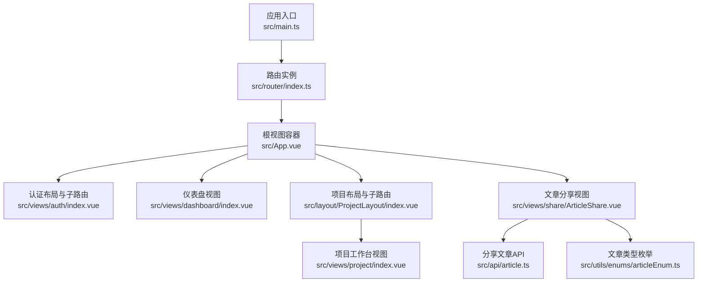
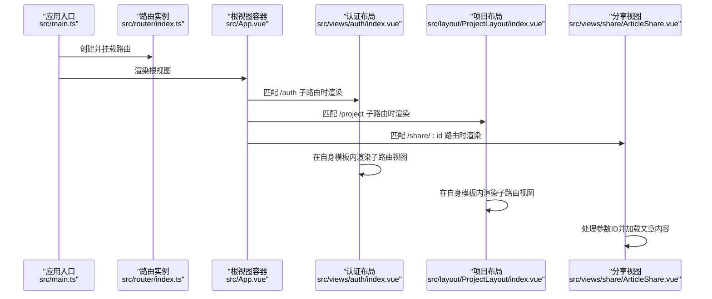
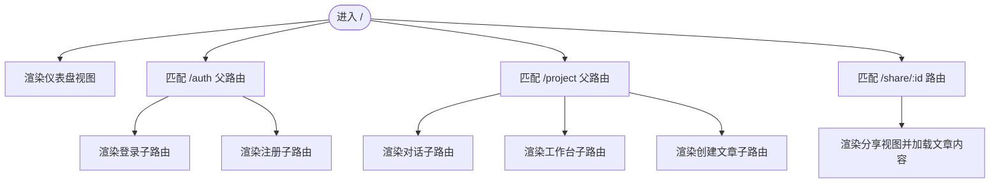
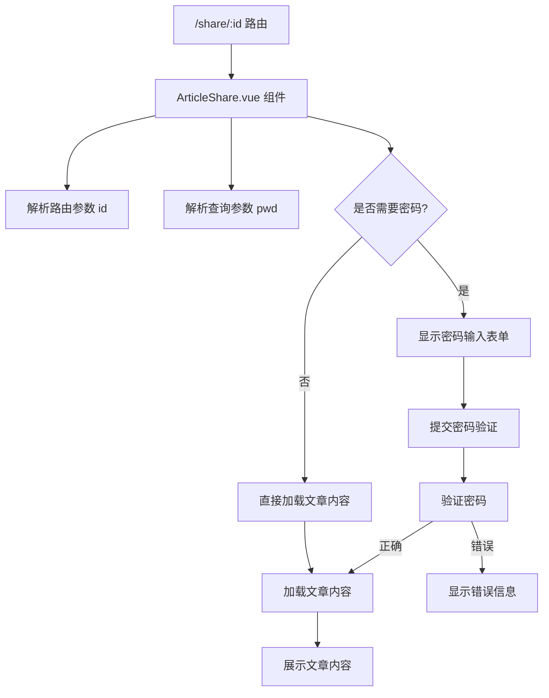
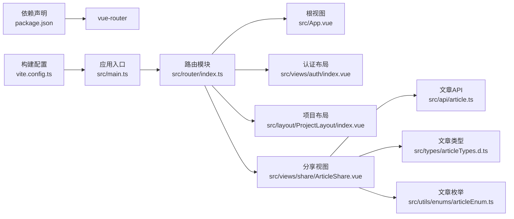

# 路由系统

<cite>
**本文引用的文件**
- [src/router/index.ts](file://src/router/index.ts)
- [src/main.ts](file://src/main.ts)
- [src/App.vue](file://src/App.vue)
- [src/views/auth/index.vue](file://src/views/auth/index.vue)
- [src/layout/ProjectLayout/index.vue](file://src/layout/ProjectLayout/index.vue)
- [src/views/auth/Login.vue](file://src/views/auth/Login.vue)
- [src/views/dashboard/index.vue](file://src/views/dashboard/index.vue)
- [src/views/project/index.vue](file://src/views/project/index.vue)
- [src/views/share/ArticleShare.vue](file://src/views/share/ArticleShare.vue)
- [src/api/article.ts](file://src/api/article.ts)
- [src/types/articleTypes.d.ts](file://src/types/articleTypes.d.ts)
- [src/utils/enums/articleEnum.ts](file://src/utils/enums/articleEnum.ts)
- [src/stores/user.ts](file://src/stores/user.ts)
- [src/stores/main.ts](file://src/stores/main.ts)
- [package.json](file://package.json)
- [vite.config.ts](file://vite.config.ts)
</cite>

## 更新摘要
**变更内容**
- 新增文章分享路由配置，支持通过 `/share/:id` 直接访问分享的文章内容
- 新增 `ArticleShare.vue` 组件，实现分享文章的密码验证和内容展示功能
- 新增分享文章相关的API接口和类型定义
- 完善路由系统架构，支持公开分享与受保护分享两种模式

## 目录
1. [简介](#简介)
2. [项目结构](#项目结构)
3. [核心组件](#核心组件)
4. [架构总览](#架构总览)
5. [详细组件分析](#详细组件分析)
6. [依赖关系分析](#依赖关系分析)
7. [性能考量](#性能考量)
8. [故障排查指南](#故障排查指南)
9. [结论](#结论)
10. [附录](#附录)

## 简介
本文件系统性梳理本项目的路由体系，围绕以下主题展开：Vue Router 的配置与使用、嵌套路由设计与实现、导航守卫的使用场景与策略、路由懒加载与代码分割、路由参数与查询字符串处理、路由切换动画与用户体验优化，并给出配置示例与最佳实践。

**更新** 本次更新新增了文章分享路由功能，支持通过直接URL访问分享的文章内容，包括密码验证和内容展示机制。

## 项目结构
- 路由入口与配置位于路由模块，应用在入口文件中挂载路由。
- 布局组件通过 RouterView 嵌套渲染子路由视图。
- 项目采用按需动态导入实现懒加载与代码分割，结合构建工具进行分包优化。
- **新增** 文章分享路由支持通过 `/share/:id` 直接访问分享的文章内容。

**图表来源**
- [src/main.ts](file://src/main.ts#L17-L25)
- [src/router/index.ts](file://src/router/index.ts#L74-L81)
- [src/App.vue](file://src/App.vue#L1-L9)
- [src/views/auth/index.vue](file://src/views/auth/index.vue#L3-L16)
- [src/layout/ProjectLayout/index.vue](file://src/layout/ProjectLayout/index.vue#L75-L128)
- [src/views/dashboard/index.vue](file://src/views/dashboard/index.vue#L1-L15)
- [src/views/project/index.vue](file://src/views/project/index.vue#L1-L20)
- [src/views/share/ArticleShare.vue](file://src/views/share/ArticleShare.vue#L1-L277)
- [src/api/article.ts](file://src/api/article.ts#L66-L74)
- [src/utils/enums/articleEnum.ts](file://src/utils/enums/articleEnum.ts#L1-L10)

**章节来源**
- [src/main.ts](file://src/main.ts#L17-L25)
- [src/router/index.ts](file://src/router/index.ts#L5-L82)
- [src/App.vue](file://src/App.vue#L1-L9)

## 核心组件
- 路由实例与历史模式：使用浏览器历史记录模式，基于 BASE_URL 初始化。
- 默认路由表：包含认证、仪表盘、项目工作区、**新增**文章分享等页面；项目工作区进一步嵌套子路由。
- 动态导入：所有页面组件均以函数形式按需加载，实现懒加载与代码分割。
- 布局与视图：认证布局与项目布局内部包含 RouterView，支撑嵌套路由渲染。
- **新增** 分享路由：`/share/:id` 路由支持通过文章ID直接访问分享的内容。

**章节来源**
- [src/router/index.ts](file://src/router/index.ts#L1-L3)
- [src/router/index.ts](file://src/router/index.ts#L5-L82)
- [src/views/auth/index.vue](file://src/views/auth/index.vue#L10-L11)
- [src/layout/ProjectLayout/index.vue](file://src/layout/ProjectLayout/index.vue#L124-L125)

## 架构总览
下图展示从应用启动到路由渲染的关键流程，以及嵌套路由的层次关系，**新增**文章分享路由的访问流程。

**图表来源**
- [src/main.ts](file://src/main.ts#L17-L25)
- [src/router/index.ts](file://src/router/index.ts#L74-L81)
- [src/App.vue](file://src/App.vue#L5-L8)
- [src/views/auth/index.vue](file://src/views/auth/index.vue#L10-L11)
- [src/layout/ProjectLayout/index.vue](file://src/layout/ProjectLayout/index.vue#L124-L125)
- [src/views/share/ArticleShare.vue](file://src/views/share/ArticleShare.vue#L10-L12)

## 详细组件分析

### 路由配置与嵌套路由
- 路由表由若干静态路由组成，其中认证与项目工作区为父级路由，各自包含子路由。
- 认证父路由下包含登录与注册两个子路由，均采用动态导入。
- 项目父路由下包含对话、工作台、创建文章三个子路由，同样采用动态导入。
- **新增** 分享路由：`/share/:id` 路由作为独立路由存在，支持通过文章ID直接访问分享内容。
- 布局组件内部通过 RouterView 实现子路由视图的嵌套渲染。

**图表来源**
- [src/router/index.ts](file://src/router/index.ts#L5-L82)
- [src/views/auth/index.vue](file://src/views/auth/index.vue#L10-L11)
- [src/layout/ProjectLayout/index.vue](file://src/layout/ProjectLayout/index.vue#L124-L125)
- [src/views/share/ArticleShare.vue](file://src/views/share/ArticleShare.vue#L10-L12)

**章节来源**
- [src/router/index.ts](file://src/router/index.ts#L5-L82)

### 文章分享路由与实现
- **新增** 分享路由配置：`/share/:id` 路由使用具名参数 `:id` 接收文章ID。
- **新增** 分享视图组件：`ArticleShare.vue` 处理分享文章的访问逻辑。
- **新增** 密码验证机制：支持无密码公开分享和需要密码的受保护分享。
- **新增** API集成：通过 `getSharedArticleApi` 获取分享的文章内容。
- **新增** 参数处理：支持通过URL查询参数传递密码，实现一键访问。

**图表来源**
- [src/router/index.ts](file://src/router/index.ts#L74-L81)
- [src/views/share/ArticleShare.vue](file://src/views/share/ArticleShare.vue#L10-L71)
- [src/api/article.ts](file://src/api/article.ts#L66-L74)

**章节来源**
- [src/router/index.ts](file://src/router/index.ts#L74-L81)
- [src/views/share/ArticleShare.vue](file://src/views/share/ArticleShare.vue#L1-L277)
- [src/api/article.ts](file://src/api/article.ts#L66-L74)

### 导航守卫使用场景与策略
- 本项目未显式声明全局前置/后置守卫或路由独享守卫。
- 登录成功后的跳转通过在业务逻辑中调用路由推进实现，例如登录成功后跳转至仪表盘。
- 项目布局内的标签切换也通过编程式导航推进到对应命名路由，保持路由与界面状态一致。
- **新增** 分享路由无需导航守卫，直接通过参数访问即可。

**章节来源**
- [src/views/auth/Login.vue](file://src/views/auth/Login.vue#L61-L70)
- [src/layout/ProjectLayout/index.vue](file://src/layout/ProjectLayout/index.vue#L27-L42)

### 路由懒加载与代码分割
- 所有页面组件均通过动态导入的方式按需加载，形成独立的异步模块。
- 构建工具会根据动态导入生成独立的 chunk，实现代码分割与按需加载。
- 该策略有助于降低首屏体积、提升加载性能。
- **新增** 分享视图组件同样采用动态导入，确保分享功能的性能优化。

**章节来源**
- [src/router/index.ts](file://src/router/index.ts#L20)
- [src/router/index.ts](file://src/router/index.ts#L28)
- [src/router/index.ts](file://src/router/index.ts#L38)
- [src/router/index.ts](file://src/router/index.ts#L54)
- [src/router/index.ts](file://src/router/index.ts#L62)
- [src/router/index.ts](file://src/router/index.ts#L70)
- [src/router/index.ts](file://src/router/index.ts#L80)

### 路由参数传递与查询字符串处理
- 本项目路由定义主要使用命名路由与路径占位，**新增** 分享路由使用具名参数 `:id` 传递文章ID。
- 查询参数处理集中在视图组件内部，**新增** 分享路由支持通过 `pwd` 查询参数传递密码。
- 通过组件内部的状态与事件，实现参数驱动的数据请求与界面刷新。
- **新增** 分享功能支持两种访问模式：直接访问（无密码）和密码访问（带密码）。

**章节来源**
- [src/views/project/index.vue](file://src/views/project/index.vue#L164-L181)
- [src/views/project/components/file-list.vue](file://src/views/project/components/file-list.vue#L52-L99)
- [src/views/share/ArticleShare.vue](file://src/views/share/ArticleShare.vue#L10-L12)

### 路由切换动画与用户体验优化
- 项目在视图层引入过渡动画，例如在项目工作台中使用过渡组件包裹弹窗表单，配合进入/离开动画类实现平滑切换。
- 结合 UI 组件库提供的动画类与过渡属性，提升交互体验。
- **新增** 分享视图实现了专门的加载动画和错误提示，提升用户体验。

**章节来源**
- [src/views/project/index.vue](file://src/views/project/index.vue#L358-L365)
- [src/views/share/ArticleShare.vue](file://src/views/share/ArticleShare.vue#L96-L98)

### 用户状态与路由联动
- 用户信息存储于 Pinia Store，并持久化到本地存储，便于在路由切换后维持用户状态。
- 项目级当前选中项目 ID 也通过 Store 管理并在本地持久化，确保跨路由场景的一致性。
- **新增** 分享功能无需用户登录状态，支持匿名访问。

**章节来源**
- [src/stores/user.ts](file://src/stores/user.ts#L1-L26)
- [src/stores/main.ts](file://src/stores/main.ts#L1-L21)

## 依赖关系分析
- 应用入口依赖路由模块；路由模块依赖 Vue Router；视图与布局组件依赖 RouterView。
- 项目使用浏览器历史模式，构建配置中未见自定义路由基路径设置，因此默认使用根路径。
- **新增** 分享路由依赖文章API模块和类型定义，实现完整的分享功能链路。

**图表来源**
- [package.json](file://package.json#L38)
- [src/main.ts](file://src/main.ts#L17-L25)
- [src/router/index.ts](file://src/router/index.ts#L74-L81)
- [src/App.vue](file://src/App.vue#L1-L9)
- [src/views/auth/index.vue](file://src/views/auth/index.vue#L10-L11)
- [src/layout/ProjectLayout/index.vue](file://src/layout/ProjectLayout/index.vue#L124-L125)
- [src/views/share/ArticleShare.vue](file://src/views/share/ArticleShare.vue#L1-L277)
- [src/api/article.ts](file://src/api/article.ts#L66-L74)
- [src/types/articleTypes.d.ts](file://src/types/articleTypes.d.ts#L1-L65)
- [src/utils/enums/articleEnum.ts](file://src/utils/enums/articleEnum.ts#L1-L10)
- [vite.config.ts](file://vite.config.ts#L1-L31)

**章节来源**
- [package.json](file://package.json#L18-L38)
- [src/main.ts](file://src/main.ts#L17-L25)
- [vite.config.ts](file://vite.config.ts#L1-L31)

## 性能考量
- 懒加载与代码分割：所有页面组件均采用动态导入，有利于首屏加载性能与资源利用。
- 构建分包策略：建议在构建配置中结合路由动态导入的特性，合理规划 chunk 分组，减少重复依赖与网络往返。
- 过渡动画：在视图层使用过渡组件与 CSS 动画类，避免复杂 JS 动画带来的性能开销。
- **新增** 分享功能优化：分享视图采用懒加载和条件渲染，仅在需要时加载密码验证和文章内容。

## 故障排查指南
- 路由无法渲染：检查路由表中命名与路径是否正确，确认父级布局中存在 RouterView。
- 动态导入报错：确认打包器已支持动态导入语法，且未在不支持的环境中使用。
- 路由跳转无效：检查编程式导航的目标命名是否存在，或路径是否正确。
- 用户状态丢失：确认 Store 的持久化插件已启用并正确配置键与存储介质。
- **新增** 分享功能问题：检查文章ID参数是否正确传递，确认API接口返回格式，验证密码验证逻辑。

**章节来源**
- [src/router/index.ts](file://src/router/index.ts#L74-L81)
- [src/layout/ProjectLayout/index.vue](file://src/layout/ProjectLayout/index.vue#L124-L125)
- [src/stores/user.ts](file://src/stores/user.ts#L22-L26)
- [src/stores/main.ts](file://src/stores/main.ts#L16-L19)
- [src/views/share/ArticleShare.vue](file://src/views/share/ArticleShare.vue#L30-L71)

## 结论
本项目采用简洁清晰的路由配置与嵌套路由结构，结合动态导入实现懒加载与代码分割，有效提升了首屏性能与用户体验。通过命名路由与编程式导航实现页面间的平滑跳转，配合布局组件内的 RouterView 支撑多层级视图渲染。

**更新** 新增的文章分享功能进一步完善了路由系统的实用性，支持通过直接URL访问分享的文章内容，包括密码验证和内容展示机制。该功能采用独立路由设计，无需用户登录即可访问，同时保持了良好的性能和用户体验。

未来可在全局守卫层面补充鉴权与权限控制，在构建层面进一步优化分包策略，以获得更佳的性能与可维护性。同时可以考虑为分享功能添加缓存机制，提升重复访问的性能表现。

## 附录
- 配置示例与最佳实践
  - 使用命名路由与编程式导航推进页面，避免硬编码路径。
  - 将公共布局抽离为独立组件并通过 RouterView 嵌套渲染子路由。
  - 对非首屏关键页面采用动态导入，结合构建器的代码分割策略。
  - 在视图层使用过渡动画提升切换体验，但避免过度复杂的动画影响性能。
  - 通过 Store 管理用户与项目上下文状态，并启用持久化以增强跨路由一致性。
  - **新增** 分享路由配置应遵循RESTful设计原则，使用语义化的URL结构。
  - **新增** 分享功能应实现完善的错误处理和用户体验优化。
  - **新增** 分享路由的参数验证和安全防护措施。