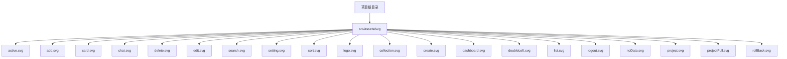
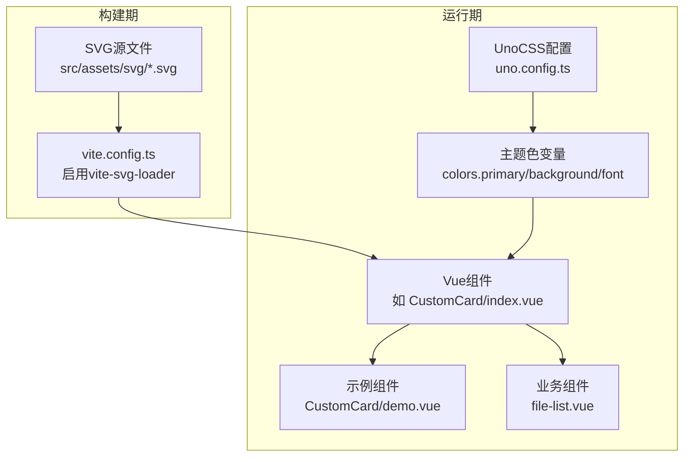
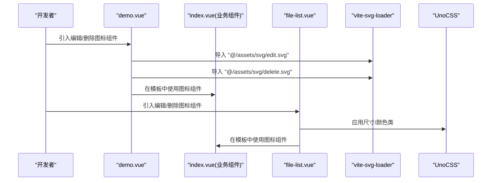
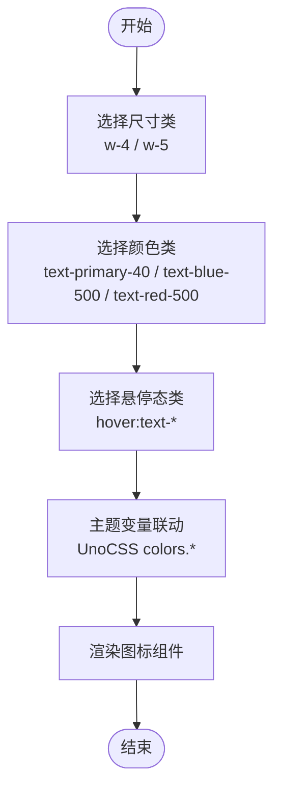
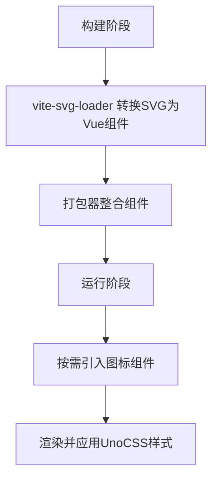
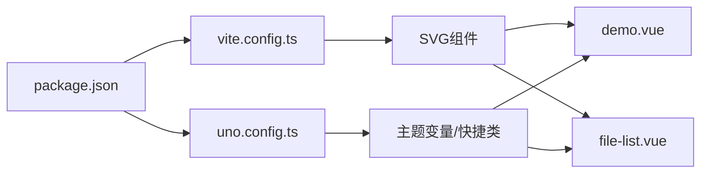

# SVG图标系统

<cite>
**本文引用的文件**
- [vite.config.ts](file://vite.config.ts)
- [uno.config.ts](file://uno.config.ts)
- [package.json](file://package.json)
- [src/components/CustomCard/index.vue](file://src/components/CustomCard/index.vue)
- [src/components/CustomCard/demo.vue](file://src/components/CustomCard/demo.vue)
- [src/views/project/components/file-list.vue](file://src/views/project/components/file-list.vue)
- [src/hooks/useCustomMessage.ts](file://src/hooks/useCustomMessage.ts)
- [src/hooks/hooksType.ts](file://src/hooks/hooksType.ts)
</cite>

## 目录
1. [简介](#简介)
2. [项目结构](#项目结构)
3. [核心组件](#核心组件)
4. [架构总览](#架构总览)
5. [详细组件分析](#详细组件分析)
6. [依赖关系分析](#依赖关系分析)
7. [性能考量](#性能考量)
8. [故障排查指南](#故障排查指南)
9. [结论](#结论)
10. [附录](#附录)

## 简介
本文件系统性梳理项目中的SVG图标体系，覆盖以下方面：
- 图标文件组织与命名规范
- 在Vue组件中引入与使用SVG图标的方式
- 颜色主题适配与尺寸控制策略
- 动态图标加载与懒加载机制
- 图标语义化与可访问性最佳实践
- 自定义图标的添加流程与维护指南
- 与UnoCSS的集成方式与主题色联动

## 项目结构
项目采用“资源按功能域组织”的方式，SVG图标统一放置于资源目录下，便于集中管理与按需引入。

图表来源
- [src/components/CustomCard/demo.vue](file://src/components/CustomCard/demo.vue#L4-L5)

章节来源
- [src/components/CustomCard/demo.vue](file://src/components/CustomCard/demo.vue#L1-L124)

## 核心组件
- Vite插件：通过vite-svg-loader将SVG作为Vue组件进行导入，支持默认导入为组件形式，便于在模板中直接使用。
- UnoCSS：提供主题色变量与快捷类，用于统一控制图标的颜色与尺寸。
- Vue组件：在业务组件中以组件形式引入SVG图标，结合UnoCSS类实现尺寸与颜色控制。

章节来源
- [vite.config.ts](file://vite.config.ts#L11-L13)
- [uno.config.ts](file://uno.config.ts#L10-L49)
- [package.json](file://package.json#L36-L36)

## 架构总览
SVG图标在构建期由vite-svg-loader转换为Vue组件，在运行期以组件形式渲染，样式通过UnoCSS类与主题变量统一管理。

图表来源
- [vite.config.ts](file://vite.config.ts#L11-L13)
- [uno.config.ts](file://uno.config.ts#L10-L49)
- [src/components/CustomCard/index.vue](file://src/components/CustomCard/index.vue#L1-L317)
- [src/components/CustomCard/demo.vue](file://src/components/CustomCard/demo.vue#L1-L124)
- [src/views/project/components/file-list.vue](file://src/views/project/components/file-list.vue#L159-L181)

## 详细组件分析

### 图标引入与使用
- 在Vue单文件组件中，通过相对路径从资源目录引入SVG组件，随后在模板中直接使用该组件标签。
- 示例中展示了在演示组件与业务组件中分别引入并使用编辑与删除图标，同时通过UnoCSS类控制尺寸与颜色。

图表来源
- [src/components/CustomCard/demo.vue](file://src/components/CustomCard/demo.vue#L4-L5)
- [src/views/project/components/file-list.vue](file://src/views/project/components/file-list.vue#L167-L169)
- [vite.config.ts](file://vite.config.ts#L11-L13)
- [uno.config.ts](file://uno.config.ts#L10-L49)

章节来源
- [src/components/CustomCard/demo.vue](file://src/components/CustomCard/demo.vue#L1-L124)
- [src/views/project/components/file-list.vue](file://src/views/project/components/file-list.vue#L159-L181)

### 图标尺寸与颜色控制
- 尺寸控制：通过UnoCSS类（如w-4、h-4、w-5、h-5）对图标宽高进行统一设置。
- 颜色控制：通过UnoCSS类（如text-primary-40、text-blue-500、text-red-500、hover:text-*）实现颜色主题适配与交互态变化。
- 组件样式：业务组件内部也通过CSS变量与主题变量实现暗色模式适配与统一风格。

图表来源
- [src/components/CustomCard/demo.vue](file://src/components/CustomCard/demo.vue#L92-L99)
- [src/views/project/components/file-list.vue](file://src/views/project/components/file-list.vue#L167-L169)
- [uno.config.ts](file://uno.config.ts#L10-L49)

章节来源
- [src/components/CustomCard/demo.vue](file://src/components/CustomCard/demo.vue#L90-L101)
- [src/views/project/components/file-list.vue](file://src/views/project/components/file-list.vue#L166-L171)
- [uno.config.ts](file://uno.config.ts#L10-L49)

### 动态图标加载与懒加载策略
- 构建期处理：vite-svg-loader在构建阶段将SVG转换为Vue组件，减少运行期开销。
- 按需引入：仅在需要的组件中引入对应图标，避免全局打包导致的体积膨胀。
- 运行期优化：通过UnoCSS类控制样式，减少额外样式的注入与重绘。

图表来源
- [vite.config.ts](file://vite.config.ts#L11-L13)
- [src/components/CustomCard/demo.vue](file://src/components/CustomCard/demo.vue#L4-L5)
- [src/views/project/components/file-list.vue](file://src/views/project/components/file-list.vue#L167-L169)

章节来源
- [vite.config.ts](file://vite.config.ts#L11-L13)

### 图标语义化与可访问性
- 语义化：图标作为装饰或操作入口时，确保其行为与可点击区域一致；在需要时提供aria-label或title属性以增强可访问性。
- 可访问性：为交互元素提供键盘可达性与焦点可见性；在悬停与聚焦时保持一致的视觉反馈。
- 文本替代：当图标承载关键信息时，提供文本描述或隐藏文本，保证屏幕阅读器可读。

（本节为通用指导，不直接分析具体文件）

### 自定义图标添加流程与维护指南
- 添加流程
  1) 准备SVG文件，确保无多余图层与复杂路径，保持简洁。
  2) 将SVG放入资源目录：src/assets/svg/。
  3) 在需要的组件中按需引入该SVG组件。
  4) 使用UnoCSS类控制尺寸与颜色，保持风格一致。
- 维护指南
  - 命名规范：使用语义化名称，如操作类（edit、delete）、状态类（active、noData）等。
  - 统一样式：遵循项目主题色与尺寸规范，避免出现风格偏差。
  - 版本管理：在团队协作中，统一图标版本与更新流程。

（本节为通用指导，不直接分析具体文件）

### 与UnoCSS的集成方式
- 主题色变量：通过uno.config.ts定义colors.primary、background、font等主题色，图标颜色可通过text-*类与主题变量联动。
- 快捷类：利用UnoCSS提供的快捷类快速设置尺寸与布局，减少重复样式代码。
- 暗色模式适配：在组件样式中使用CSS变量与媒体查询实现暗色模式下的图标适配。

章节来源
- [uno.config.ts](file://uno.config.ts#L10-L49)
- [src/components/CustomCard/index.vue](file://src/components/CustomCard/index.vue#L306-L316)

## 依赖关系分析
- 构建工具链：vite.config.ts启用vite-svg-loader，负责将SVG转为Vue组件。
- 运行时样式：uno.config.ts提供主题色与快捷类，业务组件通过UnoCSS类控制图标外观。
- 依赖声明：package.json中声明vite-svg-loader与unocss，确保开发与生产环境一致。

图表来源
- [package.json](file://package.json#L36-L36)
- [vite.config.ts](file://vite.config.ts#L11-L13)
- [uno.config.ts](file://uno.config.ts#L10-L49)
- [src/components/CustomCard/demo.vue](file://src/components/CustomCard/demo.vue#L4-L5)
- [src/views/project/components/file-list.vue](file://src/views/project/components/file-list.vue#L167-L169)

章节来源
- [package.json](file://package.json#L36-L36)
- [vite.config.ts](file://vite.config.ts#L11-L13)
- [uno.config.ts](file://uno.config.ts#L10-L49)

## 性能考量
- 构建期转换：SVG在构建期被转换为Vue组件，减少运行期解析成本。
- 按需引入：仅在需要的组件中引入图标，降低初始包体大小。
- UnoCSS类：通过原子化样式减少CSS体积，提升渲染效率。
- 暗色模式：通过CSS变量与媒体查询实现，避免重复样式与重排。

（本节为通用指导，不直接分析具体文件）

## 故障排查指南
- 图标未显示
  - 检查SVG文件路径是否正确，确认已放入资源目录且命名无误。
  - 确认vite.config.ts中vite-svg-loader已启用且defaultImport为component。
- 颜色或尺寸异常
  - 检查UnoCSS类是否正确应用，确认主题变量配置无误。
  - 在业务组件中检查CSS变量与媒体查询是否生效。
- 交互问题
  - 确保事件绑定在正确的容器上，避免事件冒泡影响。
  - 如需可访问性支持，为图标添加aria-label或title属性。

章节来源
- [vite.config.ts](file://vite.config.ts#L11-L13)
- [uno.config.ts](file://uno.config.ts#L10-L49)
- [src/components/CustomCard/index.vue](file://src/components/CustomCard/index.vue#L306-L316)

## 结论
本项目通过vite-svg-loader将SVG图标转换为Vue组件，并结合UnoCSS的主题色与快捷类实现统一的尺寸与颜色控制。业务组件按需引入图标，配合事件与可访问性设计，形成清晰、可维护、高性能的图标体系。建议在后续迭代中继续遵循命名与样式规范，完善可访问性与暗色模式适配。

## 附录
- 常见图标用途参考
  - active.svg：表示激活状态或选中状态
  - add.svg：新增操作入口
  - card.svg：卡片视图切换或卡片相关操作
  - chat.svg：聊天/评论入口
  - delete.svg：删除操作
  - edit.svg：编辑操作
  - search.svg：搜索入口
  - setting.svg：设置入口
  - sort.svg：排序入口
  - 其他图标：根据业务语义命名，保持一致性

（本节为通用指导，不直接分析具体文件）