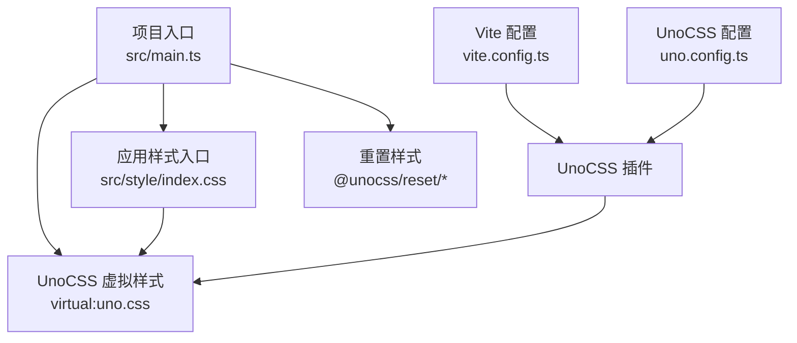
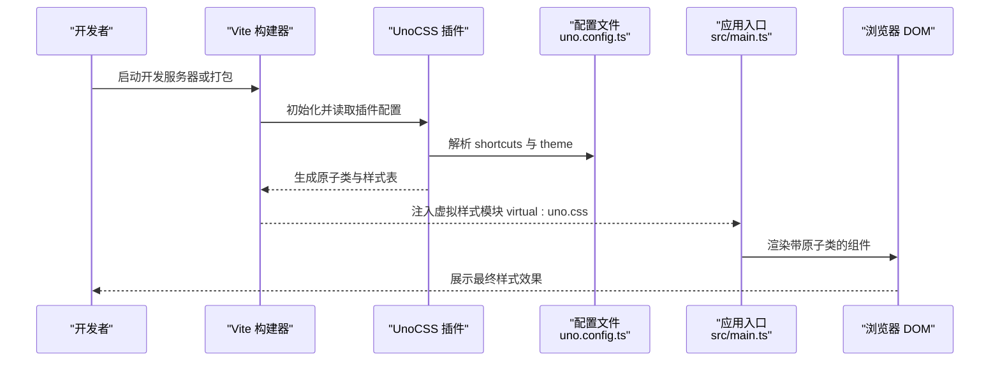
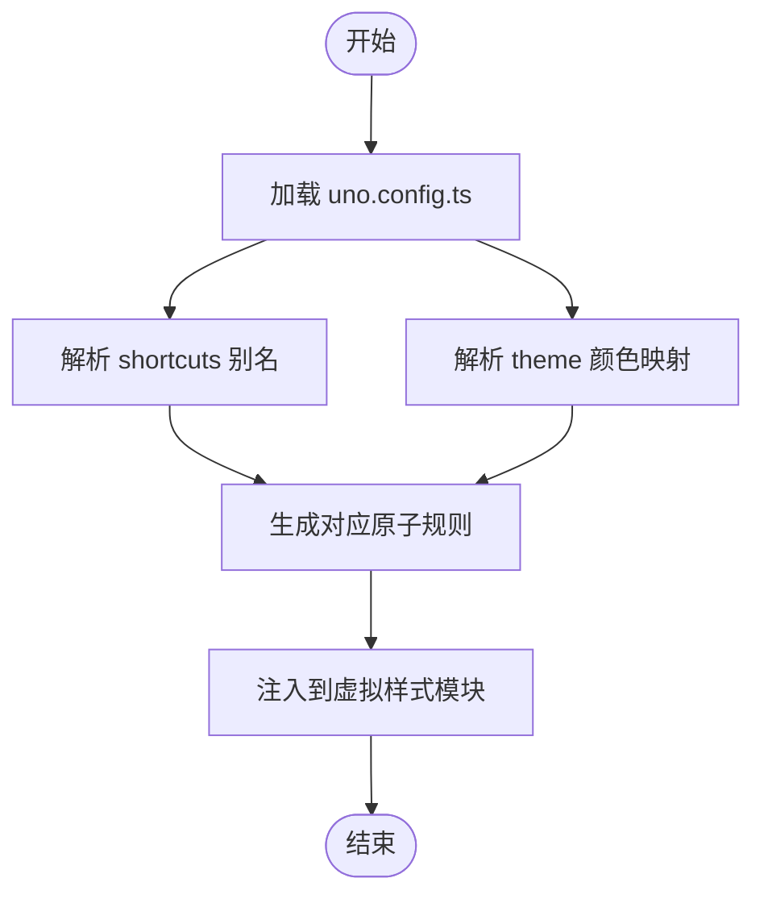
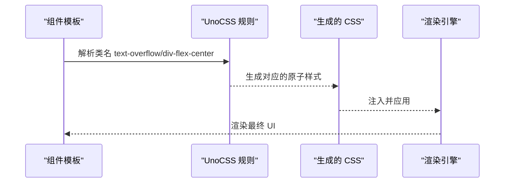
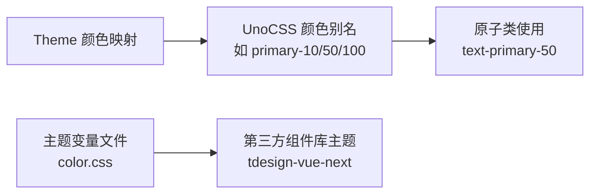
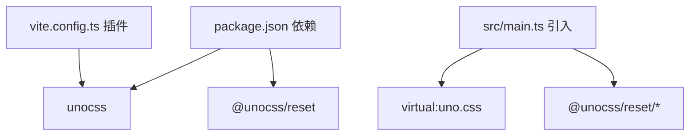

# UnoCSS配置与原子化样式

<cite>
**本文引用的文件**
- [uno.config.ts](file://uno.config.ts)
- [package.json](file://package.json)
- [vite.config.ts](file://vite.config.ts)
- [src/main.ts](file://src/main.ts)
- [src/style/index.css](file://src/style/index.css)
- [src/style/common.css](file://src/style/common.css)
- [src/style/color.css](file://src/style/color.css)
- [src/App.vue](file://src/App.vue)
- [src/components/CustomCard/index.vue](file://src/components/CustomCard/index.vue)
- [src/views/auth/Login.vue](file://src/views/auth/Login.vue)
- [src/views/dashboard/index.vue](file://src/views/dashboard/index.vue)
- [src/views/dashboard/components/left-bar.vue](file://src/views/dashboard/components/left-bar.vue)
- [src/views/dashboard/components/right-list.vue](file://src/views/dashboard/components/right-list.vue)
</cite>

## 目录
1. [简介](#简介)
2. [项目结构](#项目结构)
3. [核心组件](#核心组件)
4. [架构总览](#架构总览)
5. [详细组件分析](#详细组件分析)
6. [依赖关系分析](#依赖关系分析)
7. [性能考量](#性能考量)
8. [故障排查指南](#故障排查指南)
9. [结论](#结论)
10. [附录](#附录)

## 简介
本文件围绕项目中的 UnoCSS 配置与原子化样式体系进行系统性说明，重点覆盖以下方面：
- uno.config.ts 中的配置项：预设、快捷方式（shortcuts）、主题（theme）的具体实现与扩展建议
- 原子化 CSS 的设计理念与优势：通过类名组合实现样式复用与可维护性提升
- 快捷方式的定义与使用：如 text-overflow、div-flex-center 等实用类的实现原理与适用场景
- UnoCSS 的编译流程与运行时性能优化：在 Vite 构建链路中的工作方式与优化点
- 原子化样式的最佳实践：类名命名规范、样式组织策略与与传统 CSS 的差异及迁移指南

## 项目结构
项目采用 Vite + Vue 3 技术栈，UnoCSS 作为原子化 CSS 引擎集成在构建流程中。核心结构如下：
- UnoCSS 配置：集中于 uno.config.ts，定义快捷方式与主题颜色
- 构建集成：在 vite.config.ts 中启用 UnoCSS 插件；在 src/main.ts 中引入虚拟模块 virtual:uno.css 以生成样式
- 样式组织：通过 src/style 下的 index.css、common.css、color.css 组织基础样式与主题变量
- 组件与页面：大量使用原子类进行布局与视觉控制，部分组件仍保留 scoped 样式以满足特定需求

图表来源
- [src/main.ts](file://src/main.ts#L10-L15)
- [vite.config.ts](file://vite.config.ts#L11-L13)
- [uno.config.ts](file://uno.config.ts#L1-L50)

章节来源
- [uno.config.ts](file://uno.config.ts#L1-L50)
- [vite.config.ts](file://vite.config.ts#L1-L31)
- [src/main.ts](file://src/main.ts#L1-L28)
- [src/style/index.css](file://src/style/index.css#L1-L12)
- [src/style/common.css](file://src/style/common.css#L1-L13)
- [src/style/color.css](file://src/style/color.css#L1-L28)

## 核心组件
本节聚焦 UnoCSS 在项目中的关键配置与使用点，帮助读者快速理解其作用范围与扩展方向。

- 预设与插件
  - UnoCSS 插件在 Vite 中启用，确保开发与生产环境均能按需生成样式
  - 项目未显式声明预设，意味着默认行为由 UnoCSS 核心规则集决定
- 快捷方式（Shortcuts）
  - 定义了 text-overflow、div-flex-center 等常用组合类，用于减少重复类名书写
  - 在组件模板中直接使用，例如文本截断与居中布局
- 主题（Theme）
  - 定义主色、背景、字体三组颜色空间，支持多级色调映射
  - 页面与组件通过 UnoCSS 的颜色别名与语义化类名进行调用

章节来源
- [uno.config.ts](file://uno.config.ts#L5-L9)
- [uno.config.ts](file://uno.config.ts#L10-L48)
- [src/components/CustomCard/index.vue](file://src/components/CustomCard/index.vue#L123-L125)
- [src/views/dashboard/components/left-bar.vue](file://src/views/dashboard/components/left-bar.vue#L48-L56)

## 架构总览
下图展示了 UnoCSS 在项目中的整体工作流：从配置到构建再到运行时渲染的全链路。

图表来源
- [vite.config.ts](file://vite.config.ts#L11-L13)
- [uno.config.ts](file://uno.config.ts#L1-L50)
- [src/main.ts](file://src/main.ts#L10-L15)

## 详细组件分析

### UnoCSS 配置分析（uno.config.ts）
- 快捷方式（Shortcuts）
  - text-overflow：将“溢出隐藏、省略号、单行”三个原子类组合为一个语义化别名，便于在标题、标签等场景复用
  - div-flex-center：将“弹性布局 + 居中对齐”两个原子类组合为一个别名，简化容器布局书写
- 主题（Theme）
  - colors.primary：定义从浅到深的多级色调映射，配合 UnoCSS 的语义化命名（如 primary-10、primary-50 等）实现一致的色彩体系
  - colors.background、colors.font：分别提供背景与文字色的语义化别名，统一页面视觉风格

图表来源
- [uno.config.ts](file://uno.config.ts#L5-L9)
- [uno.config.ts](file://uno.config.ts#L10-L48)

章节来源
- [uno.config.ts](file://uno.config.ts#L1-L50)

### 快捷方式的使用与实现（组件与页面）
- 文本截断（text-overflow）
  - 在 CustomCard 组件标题区域使用，确保长文本自动截断并显示省略号
  - 实现原理：通过组合多个原子类达到“溢出隐藏 + 文本省略 + 单行显示”的效果
- 弹性居中（div-flex-center）
  - 在登录页与侧边栏等容器中使用，简化水平垂直居中布局
  - 实现原理：通过组合“flex + items-center + justify-center”实现

图表来源
- [src/components/CustomCard/index.vue](file://src/components/CustomCard/index.vue#L123-L125)
- [src/views/auth/Login.vue](file://src/views/auth/Login.vue#L88-L95)
- [src/views/dashboard/components/left-bar.vue](file://src/views/dashboard/components/left-bar.vue#L48-L56)

章节来源
- [src/components/CustomCard/index.vue](file://src/components/CustomCard/index.vue#L123-L125)
- [src/views/auth/Login.vue](file://src/views/auth/Login.vue#L88-L95)
- [src/views/dashboard/components/left-bar.vue](file://src/views/dashboard/components/left-bar.vue#L48-L56)

### 主题与颜色体系（Theme）
- 颜色分层
  - 主色（primary）：提供从浅到深的多级色调，便于在不同层级（如强调、次强调、禁用态）中复用
  - 背景（background）：提供主背景、次背景、反色、白色与悬停色等，支撑页面与卡片的视觉层次
  - 字体（font）：提供主文字色、反色与悬停色，保证对比度与交互反馈
- 与样式文件的协同
  - UnoCSS 的颜色别名与 src/style/color.css 中的主题变量相互补充，前者用于原子类，后者用于第三方组件库的主题切换

图表来源
- [uno.config.ts](file://uno.config.ts#L11-L47)
- [src/style/color.css](file://src/style/color.css#L1-L28)

章节来源
- [uno.config.ts](file://uno.config.ts#L10-L48)
- [src/style/color.css](file://src/style/color.css#L1-L28)

### 样式组织策略（index.css、common.css、color.css）
- index.css：聚合基础样式与通用类，统一盒模型等基础设置
- common.css：定义通用组件样式（如阴影卡片），与原子类形成互补
- color.css：提供主题变量，支持明暗主题与品牌色切换

章节来源
- [src/style/index.css](file://src/style/index.css#L1-L12)
- [src/style/common.css](file://src/style/common.css#L1-L13)
- [src/style/color.css](file://src/style/color.css#L1-L28)

### 页面与组件中的原子类实践
- 登录页（Login.vue）
  - 使用原子类进行布局与间距控制，结合第三方组件库样式完成表单与按钮的展示
- 仪表盘（dashboard）
  - 使用网格与弹性布局原子类组织左右两栏，配合背景色别名实现视觉分隔
- 左侧边栏（left-bar.vue）
  - 使用文本截断与颜色别名实现项目名称与用户昵称的可读性与一致性

章节来源
- [src/views/auth/Login.vue](file://src/views/auth/Login.vue#L88-L134)
- [src/views/dashboard/index.vue](file://src/views/dashboard/index.vue#L7-L25)
- [src/views/dashboard/components/left-bar.vue](file://src/views/dashboard/components/left-bar.vue#L46-L94)

## 依赖关系分析
- 构建期依赖
  - Vite 通过 vite.config.ts 启用 UnoCSS 插件，使 UnoCSS 能在开发与打包阶段生成所需样式
  - package.json 中声明 unocss 与 @unocss/reset 等依赖，确保运行时样式与重置样式可用
- 运行时依赖
  - src/main.ts 引入 virtual:uno.css 与 @unocss/reset/*，确保样式在应用启动时生效

图表来源
- [package.json](file://package.json#L22-L35)
- [vite.config.ts](file://vite.config.ts#L4-L13)
- [src/main.ts](file://src/main.ts#L10-L15)

章节来源
- [package.json](file://package.json#L1-L60)
- [vite.config.ts](file://vite.config.ts#L1-L31)
- [src/main.ts](file://src/main.ts#L1-L28)

## 性能考量
- 按需生成与体积控制
  - UnoCSS 在构建时仅生成实际使用的原子类，避免传统 CSS 的“全量打包”，有助于减小产物体积
- 开发体验与热更新
  - 在 Vite 中启用插件后，修改模板中的类名即可即时看到样式变化，提升迭代效率
- 运行时渲染
  - 原子类具备极高的复用性，减少重复样式规则，有利于浏览器缓存与渲染性能

## 故障排查指南
- 快捷方式不生效
  - 检查 uno.config.ts 中 shortcuts 的定义是否正确，以及模板中是否拼写一致
  - 确认 Vite 已启用 UnoCSS 插件且未被其他插件覆盖
- 颜色别名无效
  - 确认 uno.config.ts 中 theme.colors 的键名与使用处一致
  - 若与第三方组件库冲突，检查 color.css 的主题变量是否覆盖了组件库的默认样式
- 样式未加载
  - 确认 src/main.ts 中已引入 virtual:uno.css 与 @unocss/reset/*
  - 检查构建日志是否存在插件初始化错误

章节来源
- [uno.config.ts](file://uno.config.ts#L5-L9)
- [vite.config.ts](file://vite.config.ts#L11-L13)
- [src/main.ts](file://src/main.ts#L10-L15)

## 结论
本项目通过 UnoCSS 实现了高复用、低冗余的原子化样式体系：以 shortcuts 提升开发效率，以 theme 统一视觉语言，并在 Vite 构建链路中实现按需生成与快速迭代。配合传统的 scoped 样式与主题变量文件，形成“原子类为主、局部样式为辅”的混合策略，在保证一致性的同时兼顾灵活性。

## 附录

### 原子化样式最佳实践
- 命名规范
  - 优先使用 UnoCSS 的语义化别名（如 text-primary-50、bg-background-primary），避免自定义类名污染
  - 对于复杂布局，尽量通过组合原子类实现，减少自定义样式
- 样式组织策略
  - 将通用布局与视觉规则沉淀为 shortcuts，提升团队复用效率
  - 将第三方组件库样式与主题变量收敛至 color.css，保持一致性
- 与传统 CSS 的区别与迁移
  - 区别：原子类强调“组合即样式”，传统 CSS 强调“选择器 + 规则”
  - 迁移建议：先从布局与间距入手，逐步替换重复样式；保留必要的 scoped 样式用于组件内部细节