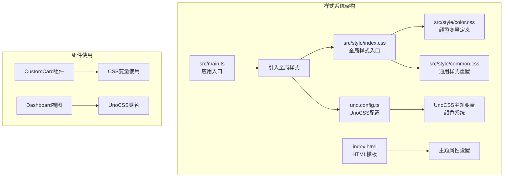
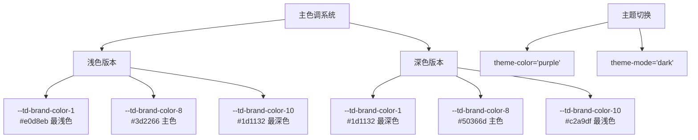
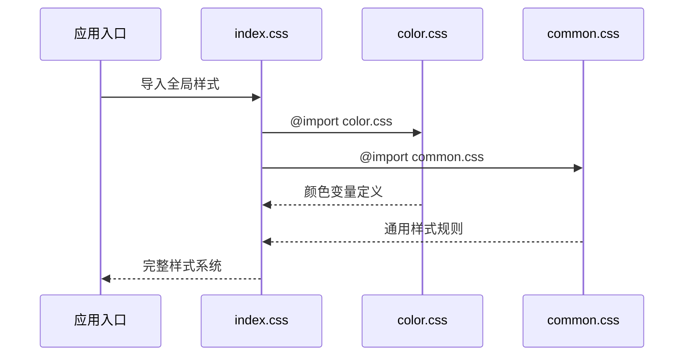
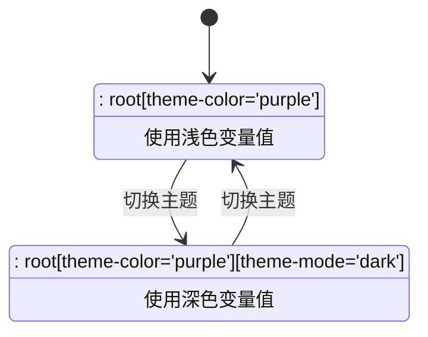
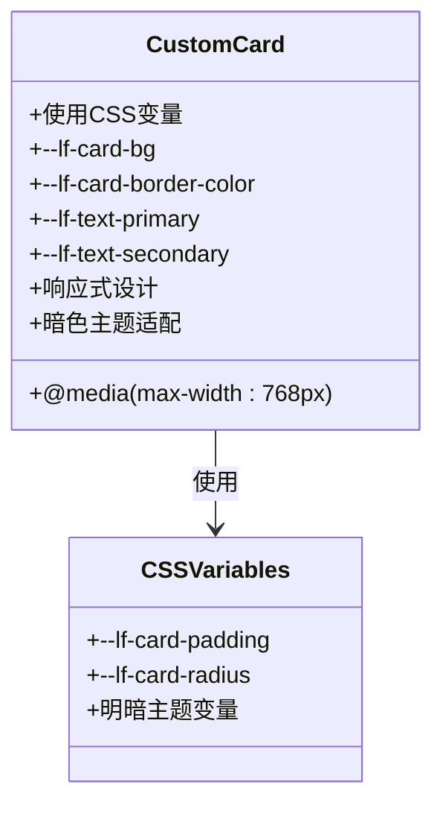

# 全局样式与主题变量

<cite>
**本文档引用的文件**
- [src/style/color.css](file://src/style/color.css)
- [src/style/common.css](file://src/style/common.css)
- [src/style/index.css](file://src/style/index.css)
- [uno.config.ts](file://uno.config.ts)
- [src/main.ts](file://src/main.ts)
- [index.html](file://index.html)
- [src/components/CustomCard/index.vue](file://src/components/CustomCard/index.vue)
- [src/views/dashboard/index.vue](file://src/views/dashboard/index.vue)
</cite>

## 目录
1. [简介](#简介)
2. [项目结构](#项目结构)
3. [核心组件](#核心组件)
4. [架构概览](#架构概览)
5. [详细组件分析](#详细组件分析)
6. [依赖关系分析](#依赖关系分析)
7. [性能考虑](#性能考虑)
8. [故障排除指南](#故障排除指南)
9. [结论](#结论)

## 简介

LiFocus Web V2 项目采用现代化的 CSS 变量系统和主题管理机制，通过统一的颜色变量定义、通用样式重置和模块化的样式组织，构建了一个灵活且可扩展的全局样式系统。该系统支持明暗主题切换、响应式设计和可访问性优化，为整个应用提供了统一的视觉语言和交互体验。

## 项目结构

全局样式系统主要由三个核心文件组成：颜色变量定义、通用样式重置和全局样式入口。这些文件协同工作，为整个应用提供一致的样式基础。



**图表来源**
- [src/style/index.css](file://src/style/index.css#L1-L12)
- [src/style/color.css](file://src/style/color.css#L1-L28)
- [uno.config.ts](file://uno.config.ts#L1-L50)
- [src/main.ts](file://src/main.ts#L1-L28)

**章节来源**
- [src/style/index.css](file://src/style/index.css#L1-L12)
- [src/style/color.css](file://src/style/color.css#L1-L28)
- [uno.config.ts](file://uno.config.ts#L1-L50)

## 核心组件

### 颜色变量系统

颜色变量系统采用 CSS 自定义属性（CSS Variables）实现，提供完整的色阶体系和主题切换功能。

#### 主色调定义

系统定义了基于深黑紫色的完整色阶体系，从最浅到最深共10个等级：



**图表来源**
- [src/style/color.css](file://src/style/color.css#L1-L27)

#### 背景色系统

背景色系统提供多种背景层次，支持不同场景的视觉需求：

- `--lf-card-bg`: 卡片背景色
- `--lf-card-border-color`: 卡片边框色
- `bg-background-primary`: 主要背景色
- `bg-background-secondary`: 次要背景色
- `bg-background-white`: 白色背景

#### 字体色系统

字体色系统采用分级设计，确保良好的对比度和可读性：

- `--lf-text-primary`: 主要文本色
- `--lf-text-secondary`: 次要文本色
- `font-primary`: 主要字体色
- `font-revert`: 反转字体色

**章节来源**
- [src/style/color.css](file://src/style/color.css#L1-L28)
- [uno.config.ts](file://uno.config.ts#L35-L46)

### 通用样式重置

通用样式重置文件提供了基础的UI组件样式，确保组件的一致性和可预测性。

#### 边框阴影组件

`.div-border-shadow` 类提供了一致的边框和阴影效果：

- `border: 1px solid rgba(2, 4, 26, 0.16)`: 半透明边框
- `border-radius: 8px`: 圆角设计
- 多层阴影效果：提供立体感

#### 滚动条内容容器

`.simplebar-content` 类用于滚动条内容容器的样式控制。

**章节来源**
- [src/style/common.css](file://src/style/common.css#L1-L13)

### 全局样式入口

全局样式入口文件负责组织和导入所有样式文件，建立样式系统的统一入口。

#### 导入机制



**图表来源**
- [src/style/index.css](file://src/style/index.css#L1-L2)

**章节来源**
- [src/style/index.css](file://src/style/index.css#L1-L12)

## 架构概览

全局样式系统采用分层架构设计，通过模块化的方式组织样式代码，确保系统的可维护性和扩展性。

```mermaid
graph TB
subgraph "样式架构层"
A[主题变量层<br/>color.css] --> B[通用样式层<br/>common.css]
B --> C[组件样式层<br/>各组件scoped样式]
D[UnoCSS主题层<br/>uno.config.ts] --> E[原子类系统<br/>bg-, text-, border-等]
F[运行时主题切换] --> G[CSS选择器匹配<br/>:root[theme-color='purple']]
F --> H[CSS变量覆盖<br/>:root[theme-mode='dark']]
end
subgraph "使用方式"
I[组件内使用<br/>var(--variable)] --> J[UnoCSS类名<br/>bg-background-primary]
K[HTML属性<br/>theme-color] --> L[主题切换]
end
```

**图表来源**
- [src/style/color.css](file://src/style/color.css#L1-L27)
- [uno.config.ts](file://uno.config.ts#L10-L49)
- [index.html](file://index.html#L2)

## 详细组件分析

### 颜色变量系统深度解析

#### 主色调色阶体系

系统采用10级渐进色阶，每个级别都有明确的用途和语义：

| 等级 | 颜色值 | 用途 | 明色模式 | 暗色模式 |
|------|--------|------|----------|----------|
| 1 | #e0d8eb | 最浅色 | 浅紫色 | 深紫色 |
| 4 | #9887ac | 中间色 | 中紫色 | 中紫色 |
| 8 | #3d2266 | 主色 | 深紫色 | 亮紫色 |
| 10 | #1d1132 | 最深色 | 接近黑色 | 浅紫色 |

#### 主题切换机制



**图表来源**
- [src/style/color.css](file://src/style/color.css#L1-L27)

#### UnoCSS集成

UnoCSS配置文件提供了额外的颜色变量定义，与原生CSS变量形成互补：

- `primary`: 100级渐进色系统
- `background`: 背景色调系统
- `font`: 字体色调系统

**章节来源**
- [src/style/color.css](file://src/style/color.css#L1-L28)
- [uno.config.ts](file://uno.config.ts#L10-L49)

### 组件样式系统

#### CustomCard组件样式分析

CustomCard组件展示了如何在实际组件中使用主题变量：



**图表来源**
- [src/components/CustomCard/index.vue](file://src/components/CustomCard/index.vue#L149-L317)

#### Dashboard视图样式

Dashboard视图展示了UnoCSS类名的实际应用：

- `bg-background-primary`: 主要背景色
- `bg-background-white`: 白色背景
- `rounded-lg`: 圆角边框
- `p-4`: 内边距

**章节来源**
- [src/components/CustomCard/index.vue](file://src/components/CustomCard/index.vue#L149-L317)
- [src/views/dashboard/index.vue](file://src/views/dashboard/index.vue#L7-L14)

### 主题变量使用方法

#### 在组件中使用CSS变量

组件可以通过以下方式使用主题变量：

1. **直接变量引用**: `color: var(--lf-text-primary)`
2. **条件变量设置**: `:root[theme-mode='dark'] { --lf-card-bg: #1f1f1f }`
3. **响应式变量**: `@media (max-width: 768px) { --lf-card-padding: 16px }`

#### UnoCSS类名使用

UnoCSS提供了丰富的原子类名，可以直接在模板中使用：

- `bg-background-primary`: 设置背景色
- `text-primary`: 设置文本色
- `border-l`: 添加左侧边框
- `rounded-lg`: 设置圆角

**章节来源**
- [src/components/CustomCard/index.vue](file://src/components/CustomCard/index.vue#L246-L281)
- [src/views/dashboard/index.vue](file://src/views/dashboard/index.vue#L7-L14)

## 依赖关系分析

全局样式系统的依赖关系相对简单但功能强大，主要依赖关系如下：

```mermaid
graph LR
subgraph "外部依赖"
A[UnoCSS] --> B[原子类系统]
C[Vue 3] --> D[scoped样式]
E[CSS变量] --> F[浏览器兼容性]
end
subgraph "内部依赖"
G[index.css] --> H[color.css]
G --> I[common.css]
J[main.ts] --> G
J --> A
K[index.html] --> L[theme-color属性]
end
subgraph "运行时依赖"
M[主题切换] --> N[CSS选择器匹配]
O[响应式设计] --> P[@media查询]
end
```

**图表来源**
- [src/main.ts](file://src/main.ts#L9-L15)
- [index.html](file://index.html#L2)

**章节来源**
- [src/main.ts](file://src/main.ts#L9-L15)
- [index.html](file://index.html#L2)

## 性能考虑

### 样式加载优化

1. **按需加载**: 通过模块化组织，只加载必要的样式文件
2. **缓存策略**: CSS变量具有良好的缓存特性
3. **构建优化**: UnoCSS在构建时进行样式优化和压缩

### 主题切换性能

1. **CSS变量切换**: 无需重新渲染整个DOM
2. **选择器匹配**: 基于属性的选择器匹配开销较小
3. **内存占用**: 变量存储在CSS层，不增加JavaScript内存负担

### 响应式性能

1. **媒体查询**: 现代浏览器对媒体查询有良好优化
2. **CSS变量**: 动态计算开销较小
3. **组件样式**: scoped样式避免全局污染

## 故障排除指南

### 常见问题及解决方案

#### 主题变量未生效

**问题**: 组件中使用的CSS变量没有显示预期的颜色

**解决方案**:
1. 检查HTML标签是否正确设置了 `theme-color` 属性
2. 确认CSS变量名称拼写正确
3. 验证样式文件是否正确导入

#### UnoCSS类名无效

**问题**: 使用UnoCSS类名但样式没有应用

**解决方案**:
1. 检查UnoCSS配置文件中的颜色定义
2. 确认类名格式正确（如 `bg-background-primary`）
3. 验证UnoCSS是否正确初始化

#### 响应式样式不工作

**问题**: 移动端样式没有按预期显示

**解决方案**:
1. 检查 `@media` 查询的断点设置
2. 确认CSS优先级正确
3. 验证视口元标签设置

**章节来源**
- [src/style/color.css](file://src/style/color.css#L1-L27)
- [uno.config.ts](file://uno.config.ts#L10-L49)

## 结论

LiFocus Web V2 的全局样式与主题变量系统展现了现代前端开发的最佳实践。通过CSS变量、UnoCSS和模块化组织的结合，系统实现了：

1. **统一的视觉语言**: 通过完整的颜色变量体系确保设计一致性
2. **灵活的主题切换**: 支持明暗主题自动切换，提升用户体验
3. **良好的可维护性**: 模块化的样式组织便于维护和扩展
4. **优秀的性能表现**: 基于CSS变量的动态样式切换具有良好的性能特征
5. **完善的响应式支持**: 覆盖多设备的适配策略

该系统为后续的功能扩展和样式定制提供了坚实的基础，是构建高质量Web应用的重要基础设施。