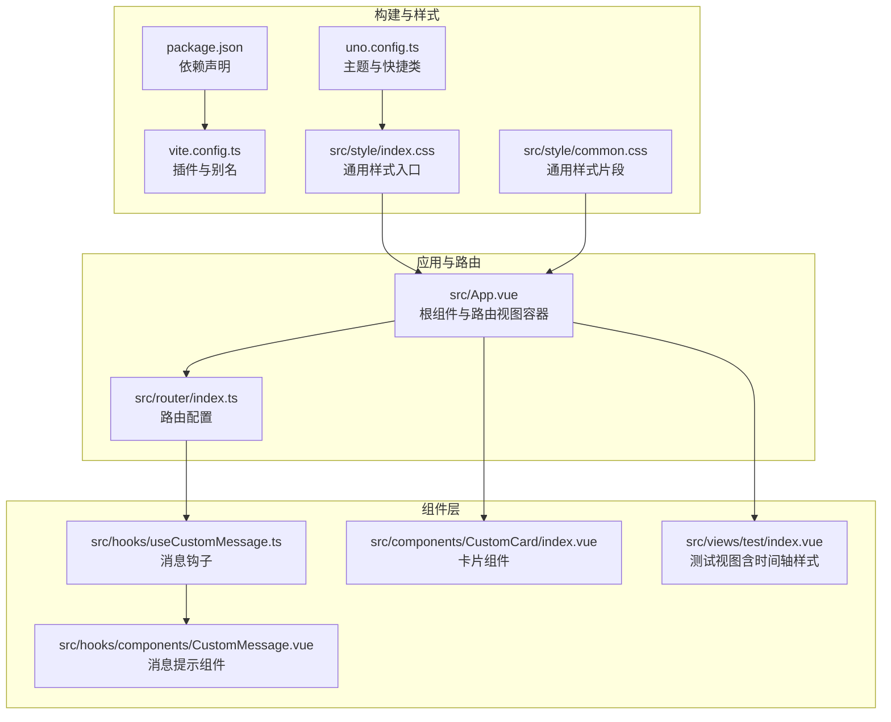
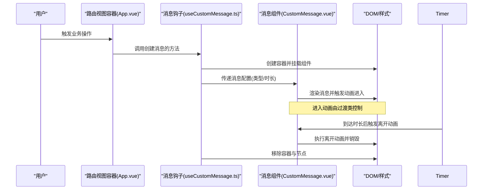
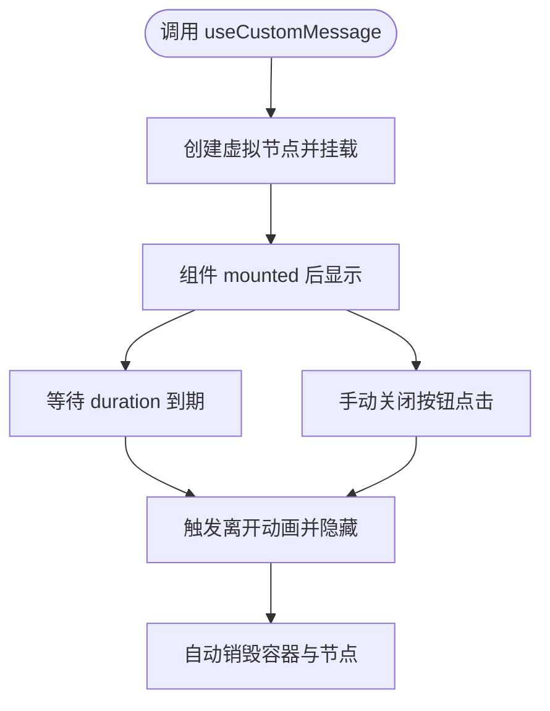
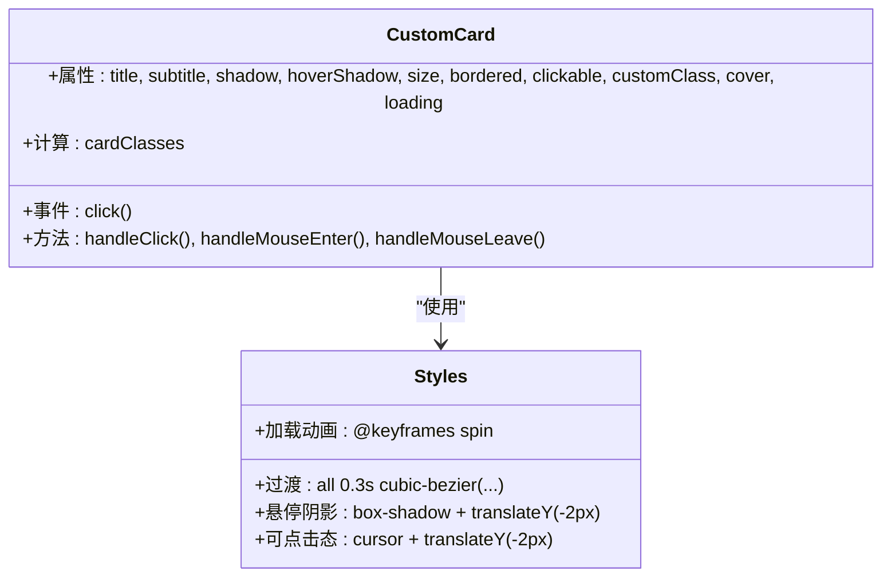
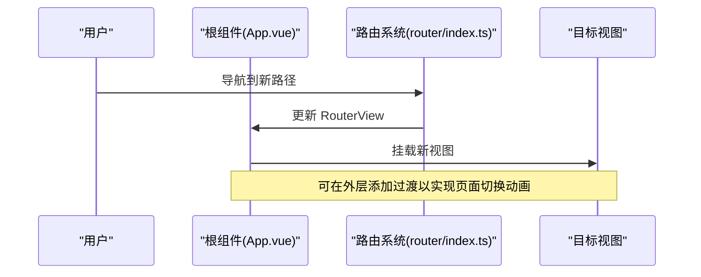
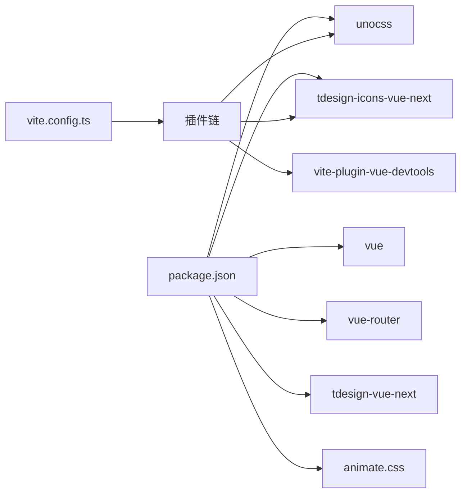

# 动画与过渡效果

<cite>
**本文引用的文件**
- [package.json](file://package.json)
- [uno.config.ts](file://uno.config.ts)
- [vite.config.ts](file://vite.config.ts)
- [src/App.vue](file://src/App.vue)
- [src/router/index.ts](file://src/router/index.ts)
- [src/style/index.css](file://src/style/index.css)
- [src/style/common.css](file://src/style/common.css)
- [src/hooks/components/CustomMessage.vue](file://src/hooks/components/CustomMessage.vue)
- [src/hooks/useCustomMessage.ts](file://src/hooks/useCustomMessage.ts)
- [src/components/CustomCard/index.vue](file://src/components/CustomCard/index.vue)
- [src/views/test/index.vue](file://src/views/test/index.vue)
</cite>

## 目录
1. [简介](#简介)
2. [项目结构](#项目结构)
3. [核心组件](#核心组件)
4. [架构总览](#架构总览)
5. [详细组件分析](#详细组件分析)
6. [依赖关系分析](#依赖关系分析)
7. [性能考量](#性能考量)
8. [故障排查指南](#故障排查指南)
9. [结论](#结论)
10. [附录](#附录)

## 简介
本章节概述项目中的动画与过渡效果实现，重点覆盖以下方面：
- 组件间过渡动画：基于 Vue 的内置过渡系统实现的消息提示动画。
- 页面切换动画：通过路由视图容器与全局布局结合，为页面切换提供基础支持。
- 交互反馈动画：卡片悬停阴影与位移动效、加载旋转等交互反馈。
- CSS 动画与关键帧：使用 CSS 过渡与关键帧实现平滑的视觉反馈。
- JavaScript 驱动的动画控制：通过组合式函数与生命周期钩子控制可见性与销毁时机。
- 性能优化策略：硬件加速、过渡曲线与节流策略建议。
- 不同设备上的表现差异与降级处理：媒体查询与响应式设计。
- 配置参数与自定义选项：消息类型、持续时间、过渡时长等。
- 调试工具与性能监控：浏览器开发者工具与性能面板。

## 项目结构
项目采用 Vue 3 + Vite 架构，动画相关能力主要分布在以下位置：
- 全局样式与主题：UnoCSS 主题变量与通用样式。
- 页面与路由：根组件与路由配置，承载页面切换场景。
- 组件层：消息提示与卡片组件，分别实现交互反馈与悬停动效。
- 视图层：测试视图中包含时间轴样式的示例，展示硬件加速注释与关键帧思路。

图表来源
- [package.json](file://package.json#L1-L60)
- [uno.config.ts](file://uno.config.ts#L1-L50)
- [vite.config.ts](file://vite.config.ts#L1-L31)
- [src/style/index.css](file://src/style/index.css#L1-L12)
- [src/style/common.css](file://src/style/common.css#L1-L13)
- [src/App.vue](file://src/App.vue#L1-L12)
- [src/router/index.ts](file://src/router/index.ts#L1-L82)
- [src/hooks/components/CustomMessage.vue](file://src/hooks/components/CustomMessage.vue#L1-L94)
- [src/hooks/useCustomMessage.ts](file://src/hooks/useCustomMessage.ts#L1-L57)
- [src/components/CustomCard/index.vue](file://src/components/CustomCard/index.vue#L1-L317)
- [src/views/test/index.vue](file://src/views/test/index.vue#L106-L229)

章节来源
- [src/App.vue](file://src/App.vue#L1-L12)
- [src/router/index.ts](file://src/router/index.ts#L1-L82)
- [src/style/index.css](file://src/style/index.css#L1-L12)
- [src/style/common.css](file://src/style/common.css#L1-L13)
- [uno.config.ts](file://uno.config.ts#L1-L50)
- [vite.config.ts](file://vite.config.ts#L1-L31)

## 核心组件
本项目在动画与过渡方面的核心实现集中在以下组件与文件：
- 消息提示组件与钩子：负责消息的创建、显示与自动隐藏，使用 Vue 过渡系统实现进入/离开动画。
- 卡片组件：提供悬停阴影与位移的交互反馈，并包含加载状态的关键帧旋转动画。
- 测试视图：包含时间轴样式示例，展示硬件加速注释与关键帧思路，便于理解动画性能优化实践。

章节来源
- [src/hooks/components/CustomMessage.vue](file://src/hooks/components/CustomMessage.vue#L1-L94)
- [src/hooks/useCustomMessage.ts](file://src/hooks/useCustomMessage.ts#L1-L57)
- [src/components/CustomCard/index.vue](file://src/components/CustomCard/index.vue#L1-L317)
- [src/views/test/index.vue](file://src/views/test/index.vue#L106-L229)

## 架构总览
下图展示了从路由到组件的消息动画与页面切换的整体流程：

图表来源
- [src/App.vue](file://src/App.vue#L1-L12)
- [src/hooks/useCustomMessage.ts](file://src/hooks/useCustomMessage.ts#L1-L57)
- [src/hooks/components/CustomMessage.vue](file://src/hooks/components/CustomMessage.vue#L1-L94)

## 详细组件分析

### 消息提示组件与钩子
- 组件职责
  - 接收消息类型、文本或 VNode、关闭按钮等配置。
  - 在挂载时显示消息；根据时长自动隐藏；支持手动关闭。
  - 使用 Vue 过渡系统实现进入/离开动画。
- 关键实现点
  - 过渡名称：message-fade，配合 enter-active/leave-active、enter-from/leave-to 类实现。
  - 进入/离开动画：透明度与垂直位移组合，时长统一为 0.3s。
  - 生命周期：mounted 显示，定时器到达后隐藏；beforeUnmount 清理定时器。
  - 钩子：useCustomMessage 负责创建虚拟节点、渲染到容器、设置自动销毁与返回关闭句柄。
- 配置参数
  - message：字符串或 VNode。
  - type：info/success/error/warning。
  - duration：毫秒，默认 3000；设为 0 可禁用自动隐藏。
  - closeBtn：是否显示关闭按钮。
  - 自动销毁延时：额外增加约 300ms，确保动画完成后再卸载。
- 交互反馈
  - 成功/错误/警告/信息四种背景色区分。
  - 关闭按钮点击即刻隐藏并清理定时器。

图表来源
- [src/hooks/useCustomMessage.ts](file://src/hooks/useCustomMessage.ts#L1-L57)
- [src/hooks/components/CustomMessage.vue](file://src/hooks/components/CustomMessage.vue#L1-L94)

章节来源
- [src/hooks/components/CustomMessage.vue](file://src/hooks/components/CustomMessage.vue#L1-L94)
- [src/hooks/useCustomMessage.ts](file://src/hooks/useCustomMessage.ts#L1-L57)

### 卡片组件的交互反馈动画
- 组件职责
  - 提供多种尺寸、边框、阴影与可点击态。
  - 悬停时增强阴影并轻微上移，提供交互反馈。
  - 支持加载状态，使用关键帧实现旋转加载指示器。
- 关键实现点
  - 过渡：整体 transition 使用缓动曲线，提升手感。
  - 悬停阴影：hover-shadow 类在悬停时叠加阴影并轻微上移。
  - 可点击态：clickable 类在悬停时也轻微上移，形成一致的反馈。
  - 加载动画：关键帧 spin 实现 360° 旋转，线性动画保证均匀速度。
- 响应式与主题
  - 使用 CSS 变量与 UnoCSS 主题颜色，适配明暗模式与品牌色。
  - 媒体查询在大屏下调整内边距与字号，保证在不同设备上的一致体验。

图表来源
- [src/components/CustomCard/index.vue](file://src/components/CustomCard/index.vue#L1-L317)
- [uno.config.ts](file://uno.config.ts#L1-L50)

章节来源
- [src/components/CustomCard/index.vue](file://src/components/CustomCard/index.vue#L1-L317)
- [uno.config.ts](file://uno.config.ts#L1-L50)

### 页面切换与路由容器
- 页面切换场景
  - 根组件通过 RouterView 承载当前路由视图，为页面切换提供统一容器。
  - 路由配置包含多级页面与懒加载组件，便于在不同视图间进行切换。
- 动画扩展点
  - 当前未在路由层引入专用的页面切换过渡，可在 RouterView 外层包裹过渡以实现页面级淡入淡出或滑动切换（建议）。

图表来源
- [src/App.vue](file://src/App.vue#L1-L12)
- [src/router/index.ts](file://src/router/index.ts#L1-L82)

章节来源
- [src/App.vue](file://src/App.vue#L1-L12)
- [src/router/index.ts](file://src/router/index.ts#L1-L82)

### 时间轴样式与硬件加速思路
- 样式要点
  - 时间轴元素在大屏下启用硬件加速注释，有助于提升滚动与变换性能。
  - 关键帧与过渡配合，保证动画流畅度。
- 实践建议
  - 在需要频繁变换的元素上使用 transform 与 translateZ(0) 等手段，减少重排与重绘。
  - 对于复杂动画，优先使用 transform 与 opacity，避免频繁修改布局属性。

章节来源
- [src/views/test/index.vue](file://src/views/test/index.vue#L106-L229)

## 依赖关系分析
- 样式与主题
  - UnoCSS 提供主题变量与快捷类，支撑卡片与消息的颜色体系。
  - 通用样式入口与片段统一盒模型与基础样式。
- 构建与开发
  - Vite 插件链包含 Vue、Vue JSX、UnoCSS、SVG 加载器与开发工具，为动画与组件开发提供良好环境。
- 动画相关依赖
  - 项目依赖中包含 animate.css，可用于快速引入预置动画类（如需）。

图表来源
- [package.json](file://package.json#L1-L60)
- [vite.config.ts](file://vite.config.ts#L1-L31)

章节来源
- [package.json](file://package.json#L1-L60)
- [uno.config.ts](file://uno.config.ts#L1-L50)
- [vite.config.ts](file://vite.config.ts#L1-L31)

## 性能考量
- 硬件加速
  - 在需要高频变换的元素上使用 transform 与 translateZ(0)，减少重排与重绘。
  - 时间轴示例中已体现该思路，建议在卡片悬停与消息进入/离开时保持 transform 为主。
- 过渡曲线与时长
  - 使用缓动曲线与合理的过渡时长，避免过长导致卡顿，过短失去反馈感。
  - 统一的 0.3s 过渡时长适合大多数交互反馈。
- 关键帧与循环
  - 加载指示器使用线性关键帧，保证旋转均匀；避免在关键帧中修改布局相关属性。
- 响应式与降级
  - 使用媒体查询在小屏设备上降低动画强度或简化效果，保证低端设备流畅运行。
  - 通过 CSS 变量与主题适配，确保在深色模式下的对比度与可读性。
- 资源与体积
  - animate.css 作为可选依赖，按需引入，避免不必要的体积增长。

[本节为通用指导，不直接分析具体文件]

## 故障排查指南
- 消息未消失或重复出现
  - 检查 useCustomMessage 的自动销毁延时是否正确，确保在动画结束后再卸载。
  - 确认 message-fade 的 enter-active/leave-active 类是否生效。
- 悬停阴影不生效
  - 检查 hoverShadow 属性与 hover 状态是否正确触发。
  - 确认样式作用域与类名拼接逻辑。
- 加载动画不旋转
  - 检查关键帧 spin 是否被作用域样式覆盖。
  - 确认动画时长与线性曲线设置。
- 页面切换无动画
  - 当前未在路由层引入页面级过渡，可在 RouterView 外层添加过渡包装以实现切换动画。

章节来源
- [src/hooks/useCustomMessage.ts](file://src/hooks/useCustomMessage.ts#L1-L57)
- [src/hooks/components/CustomMessage.vue](file://src/hooks/components/CustomMessage.vue#L1-L94)
- [src/components/CustomCard/index.vue](file://src/components/CustomCard/index.vue#L1-L317)
- [src/views/test/index.vue](file://src/views/test/index.vue#L106-L229)

## 结论
本项目在动画与过渡方面采用了简洁而高效的设计：
- 基于 Vue 过渡系统的消息提示，具备明确的进入/离开动画与生命周期管理。
- 卡片组件提供一致的悬停反馈与加载动画，兼顾可用性与性能。
- 样式体系通过 UnoCSS 主题与通用样式统一风格，易于维护与扩展。
- 页面切换场景可通过在 RouterView 外层添加过渡实现更丰富的页面级动画。
建议在后续迭代中：
- 引入页面级过渡包装，完善页面切换体验。
- 对复杂动画进行性能审计，必要时引入节流与帧率监控。
- 在移动端进一步简化动画强度，确保流畅度。

[本节为总结性内容，不直接分析具体文件]

## 附录
- 配置参数速览
  - 消息组件
    - message：字符串或 VNode。
    - type：info/success/error/warning。
    - duration：毫秒，默认 3000；设为 0 可禁用自动隐藏。
    - closeBtn：布尔，是否显示关闭按钮。
  - 卡片组件
    - size：small/medium/large。
    - bordered：布尔，是否显示边框。
    - shadow：布尔，是否始终显示阴影。
    - hoverShadow：布尔，悬停时是否显示阴影。
    - clickable：布尔，是否显示可点击态。
    - loading：布尔，是否显示加载遮罩。
- 自定义选项
  - 通过 CSS 变量与 UnoCSS 主题定制颜色与尺寸。
  - 在组件外部通过类名与样式覆盖实现局部定制。
- 调试与监控
  - 使用浏览器开发者工具的性能面板观察帧率与重绘。
  - 在动画关键阶段设置断点，检查样式与类名变化。
  - 对移动端进行真机测试，关注掉帧与卡顿现象。

[本节为概览性内容，不直接分析具体文件]