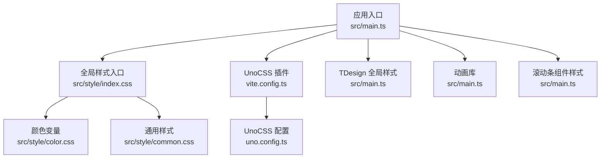
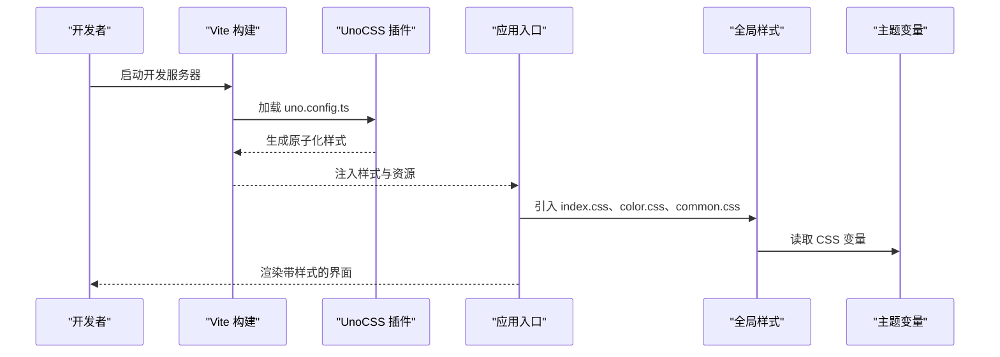
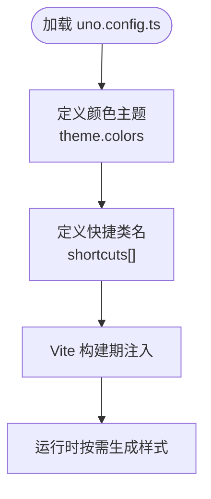
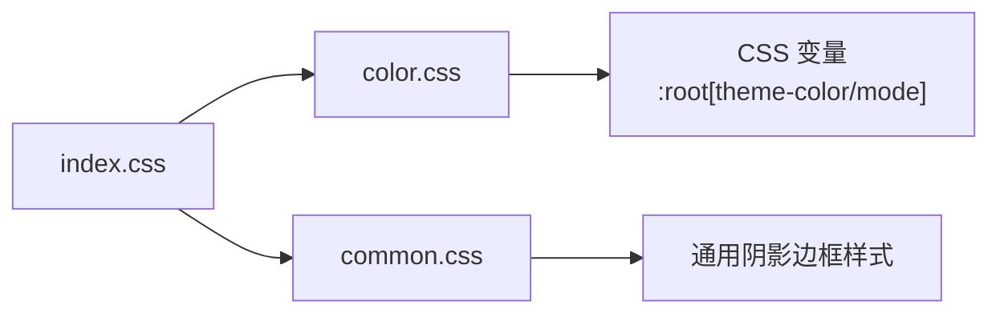
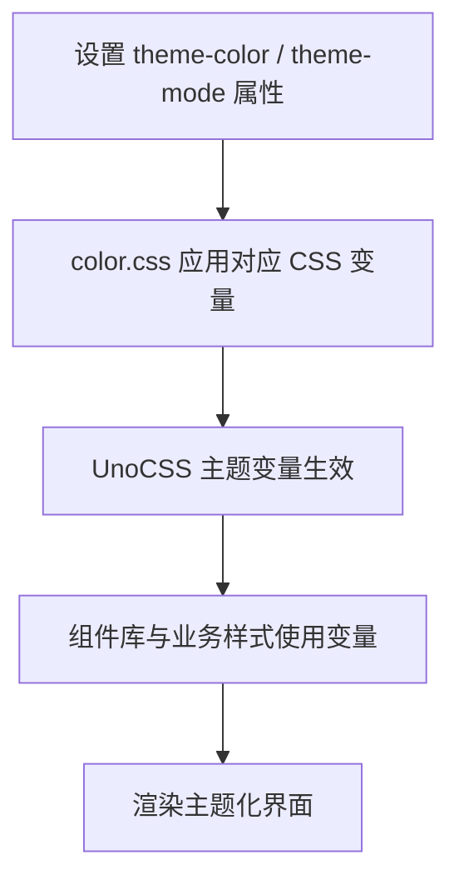
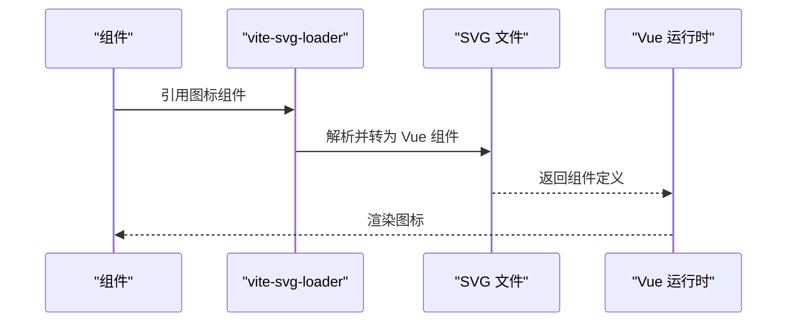
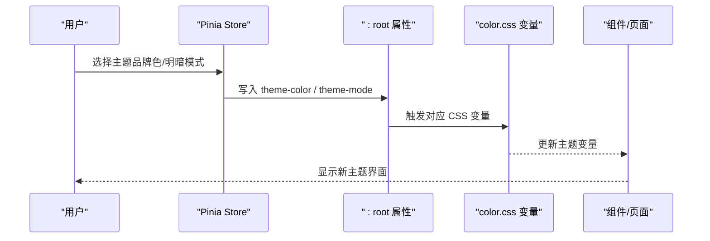
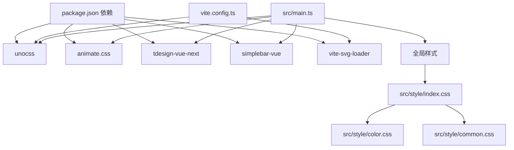

# 样式与主题

<cite>
**本文引用的文件**
- [uno.config.ts](file://uno.config.ts)
- [vite.config.ts](file://vite.config.ts)
- [package.json](file://package.json)
- [src/main.ts](file://src/main.ts)
- [src/style/index.css](file://src/style/index.css)
- [src/style/color.css](file://src/style/color.css)
- [src/style/common.css](file://src/style/common.css)
- [src/App.vue](file://src/App.vue)
- [src/components/Editor/index.vue](file://src/components/Editor/index.vue)
- [src/views/test/index.vue](file://src/views/test/index.vue)
- [src/stores/main.ts](file://src/stores/main.ts)
- [src/utils/project.ts](file://src/utils/project.ts)
</cite>

## 目录
1. [简介](#简介)
2. [项目结构](#项目结构)
3. [核心组件](#核心组件)
4. [架构总览](#架构总览)
5. [详细组件分析](#详细组件分析)
6. [依赖分析](#依赖分析)
7. [性能考虑](#性能考虑)
8. [故障排查指南](#故障排查指南)
9. [结论](#结论)
10. [附录](#附录)

## 简介
本文件系统性梳理 LiFocus Web V2 的样式与主题体系，围绕 UnoCSS 原子化 CSS 框架的配置与使用、全局样式组织（color.css、common.css、index.css）、主题系统（颜色变量、字体系统、响应式设计）、SVG 图标系统（图标组件与动态加载机制）、动画与过渡效果、样式定制（主题切换与品牌定制）、样式性能优化与最佳实践，以及与 TDesign 组件库的样式集成进行深入说明。

## 项目结构
样式与主题相关的关键位置如下：
- UnoCSS 配置：uno.config.ts
- 构建与插件：vite.config.ts
- 全局样式入口：src/main.ts 中引入的样式文件
- 全局样式组织：src/style/index.css、src/style/color.css、src/style/common.css
- 应用根节点样式：src/App.vue
- 编辑器组件样式：src/components/Editor/index.vue
- 时间线视图样式：src/views/test/index.vue
- 主题切换与状态：通过 CSS 变量与状态存储协同实现

图表来源
- [src/main.ts](file://src/main.ts#L1-L28)
- [src/style/index.css](file://src/style/index.css#L1-L12)
- [src/style/color.css](file://src/style/color.css#L1-L28)
- [src/style/common.css](file://src/style/common.css#L1-L13)
- [vite.config.ts](file://vite.config.ts#L1-L31)
- [uno.config.ts](file://uno.config.ts#L1-L50)

章节来源
- [src/main.ts](file://src/main.ts#L1-L28)
- [src/style/index.css](file://src/style/index.css#L1-L12)
- [src/style/color.css](file://src/style/color.css#L1-L28)
- [src/style/common.css](file://src/style/common.css#L1-L13)
- [vite.config.ts](file://vite.config.ts#L1-L31)
- [uno.config.ts](file://uno.config.ts#L1-L50)

## 核心组件
- UnoCSS 配置与预设：在 uno.config.ts 中定义颜色主题、快捷类名等，为全站提供一致的原子化样式能力。
- 全局样式组织：index.css 负责导入 color.css 与 common.css，并统一基础盒模型；color.css 提供基于属性选择器的主题变量；common.css 定义通用视觉组件样式。
- 应用根样式：App.vue 使用 UnoCSS 提供的工具类控制根容器尺寸与字体颜色。
- 动画与过渡：通过引入 animate.css 实现页面级动画与过渡效果。
- SVG 图标系统：借助 vite-svg-loader 将 SVG 文件作为 Vue 组件动态加载，便于在组件中直接使用图标组件。
- 主题切换与品牌定制：通过 CSS 自定义属性与状态存储实现主题变量的切换与持久化。

章节来源
- [uno.config.ts](file://uno.config.ts#L1-L50)
- [src/style/index.css](file://src/style/index.css#L1-L12)
- [src/style/color.css](file://src/style/color.css#L1-L28)
- [src/style/common.css](file://src/style/common.css#L1-L13)
- [src/App.vue](file://src/App.vue#L1-L12)
- [src/main.ts](file://src/main.ts#L1-L28)
- [vite.config.ts](file://vite.config.ts#L1-L31)
- [package.json](file://package.json#L1-L60)

## 架构总览
下图展示样式与主题系统在构建期与运行期的交互路径：

图表来源
- [vite.config.ts](file://vite.config.ts#L1-L31)
- [uno.config.ts](file://uno.config.ts#L1-L50)
- [src/main.ts](file://src/main.ts#L1-L28)
- [src/style/index.css](file://src/style/index.css#L1-L12)
- [src/style/color.css](file://src/style/color.css#L1-L28)

## 详细组件分析

### UnoCSS 配置与使用
- 预设与主题
  - 在 uno.config.ts 中定义了颜色主题（primary、background、font），并通过 theme.colors 提供多级色阶，便于在组件中按需使用。
  - 定义了常用快捷类名（如文本溢出、居中布局），提升开发效率。
- 快捷类名
  - 通过 shortcuts 将常用组合类简化为单一类名，减少重复书写。
- 与构建集成
  - 在 vite.config.ts 中启用 UnoCSS 插件，确保开发与生产环境均能正确生成原子化样式。

图表来源
- [uno.config.ts](file://uno.config.ts#L1-L50)
- [vite.config.ts](file://vite.config.ts#L1-L31)

章节来源
- [uno.config.ts](file://uno.config.ts#L1-L50)
- [vite.config.ts](file://vite.config.ts#L1-L31)

### 全局样式组织（index.css、color.css、common.css）
- index.css
  - 导入 color.css 与 common.css，统一基础样式入口。
  - 设置基础盒模型，保证布局一致性。
- color.css
  - 使用属性选择器 :root[theme-color='...'] 与 :root[theme-mode='...'] 切换品牌色系与明暗模式。
  - 定义 --td-brand-color 等变量，供组件库与业务样式共享。
- common.css
  - 定义通用阴影边框与滚动区域样式，提升组件复用性与一致性。

图表来源
- [src/style/index.css](file://src/style/index.css#L1-L12)
- [src/style/color.css](file://src/style/color.css#L1-L28)
- [src/style/common.css](file://src/style/common.css#L1-L13)

章节来源
- [src/style/index.css](file://src/style/index.css#L1-L12)
- [src/style/color.css](file://src/style/color.css#L1-L28)
- [src/style/common.css](file://src/style/common.css#L1-L13)

### 主题系统（颜色变量、字体系统、响应式设计）
- 颜色变量
  - UnoCSS 主题与 CSS 变量双轨并行：UnoCSS 提供原子化颜色类，color.css 提供 CSS 变量以适配第三方组件库（如 TDesign）。
  - 支持品牌色系与明暗模式切换，通过属性选择器在运行时动态生效。
- 字体系统
  - UnoCSS theme.font 提供主文字、反色、悬停等颜色变量，配合 App.vue 的字体类实现全局字体颜色控制。
- 响应式设计
  - 通过 UnoCSS 工具类与媒体查询（如时间线视图中的断点）实现响应式布局。

图表来源
- [src/style/color.css](file://src/style/color.css#L1-L28)
- [uno.config.ts](file://uno.config.ts#L1-L50)
- [src/App.vue](file://src/App.vue#L1-L12)

章节来源
- [src/style/color.css](file://src/style/color.css#L1-L28)
- [uno.config.ts](file://uno.config.ts#L1-L50)
- [src/App.vue](file://src/App.vue#L1-L12)

### SVG 图标系统（图标组件与动态加载机制）
- 动态加载
  - vite-svg-loader 将 SVG 文件作为 Vue 组件自动注册，默认导入方式为 component，可在模板中直接使用图标组件。
- 使用示例
  - 在组件中通过 <svg-name /> 形式引用图标，保持语义清晰与体积可控。
- 与 UnoCSS 协同
  - 图标尺寸与对齐可通过 UnoCSS 工具类快速控制，提升开发效率。

图表来源
- [vite.config.ts](file://vite.config.ts#L1-L31)
- [package.json](file://package.json#L1-L60)

章节来源
- [vite.config.ts](file://vite.config.ts#L1-L31)
- [package.json](file://package.json#L1-L60)

### 动画效果与过渡效果
- animate.css
  - 在 src/main.ts 中引入 animate.css，为页面与组件提供丰富的入场、离场与强调动画。
- 使用建议
  - 结合路由切换、弹窗打开/关闭、列表项进入等场景使用，避免过度动画影响性能。

章节来源
- [src/main.ts](file://src/main.ts#L1-L28)

### 与 TDesign 组件库的样式集成
- 全局样式
  - 在 src/main.ts 中引入 tdesign-vue-next 的全局样式入口，确保组件默认样式与主题变量一致。
- 主题变量协同
  - color.css 中的 CSS 变量与 TDesign 的品牌色变量协同工作，保障组件在不同主题下的视觉一致性。

章节来源
- [src/main.ts](file://src/main.ts#L1-L28)
- [src/style/color.css](file://src/style/color.css#L1-L28)

### 主题切换与品牌定制
- 切换机制
  - 通过设置 :root 的 theme-color 与 theme-mode 属性，驱动 color.css 中的 CSS 变量切换。
  - 可结合状态管理（如 Pinia）持久化用户偏好，实现跨会话的主题记忆。
- 品牌定制
  - 在 uno.config.ts 的 theme.colors 中扩展品牌色阶，或在 color.css 中新增品牌变量，满足不同品牌风格需求。
- 示例参考
  - 编辑器组件在预览模式下支持主题切换（light/dark），体现主题变量在业务组件中的应用。

图表来源
- [src/stores/main.ts](file://src/stores/main.ts#L1-L21)
- [src/utils/project.ts](file://src/utils/project.ts#L1-L9)
- [src/style/color.css](file://src/style/color.css#L1-L28)
- [src/components/Editor/index.vue](file://src/components/Editor/index.vue#L78-L129)

章节来源
- [src/stores/main.ts](file://src/stores/main.ts#L1-L21)
- [src/utils/project.ts](file://src/utils/project.ts#L1-L9)
- [src/style/color.css](file://src/style/color.css#L1-L28)
- [src/components/Editor/index.vue](file://src/components/Editor/index.vue#L78-L129)

### 响应式与复杂布局示例（时间线视图）
- 媒体查询与布局
  - 时间线视图通过媒体查询在桌面端与移动端切换时间轴位置与间距，体现响应式设计思路。
- 样式组织
  - 复杂布局样式集中于组件作用域样式中，避免全局污染。

章节来源
- [src/views/test/index.vue](file://src/views/test/index.vue#L106-L229)

## 依赖分析
- UnoCSS 生态
  - uno.config.ts 与 vite.config.ts 协同，确保原子化样式在开发与生产环境稳定输出。
- 第三方库
  - animate.css 提供动画能力；tdesign-vue-next 提供 UI 组件与默认样式；simplebar-vue 提供滚动条样式；vite-svg-loader 提供图标组件化能力。
- 全局样式链路
  - src/main.ts 作为样式入口，串联 UnoCSS、全局样式与第三方库样式。

图表来源
- [package.json](file://package.json#L1-L60)
- [vite.config.ts](file://vite.config.ts#L1-L31)
- [src/main.ts](file://src/main.ts#L1-L28)
- [src/style/index.css](file://src/style/index.css#L1-L12)
- [src/style/color.css](file://src/style/color.css#L1-L28)
- [src/style/common.css](file://src/style/common.css#L1-L13)

章节来源
- [package.json](file://package.json#L1-L60)
- [vite.config.ts](file://vite.config.ts#L1-L31)
- [src/main.ts](file://src/main.ts#L1-L28)

## 性能考虑
- 原子化 CSS
  - UnoCSS 仅生成实际使用的样式，减少无效 CSS，降低包体与首屏渲染压力。
- 按需加载
  - 动画库与图标库采用按需引入策略，避免不必要的资源加载。
- 样式隔离
  - 组件作用域样式与通用样式分离，避免样式冲突与重复计算。
- 媒体查询优化
  - 合理使用媒体查询，避免在小屏幕设备上执行昂贵的样式计算。

## 故障排查指南
- UnoCSS 不生效
  - 检查 vite.config.ts 是否正确启用 UnoCSS 插件，确认 uno.config.ts 语法无误。
- 主题变量未切换
  - 确认 :root 的 theme-color 与 theme-mode 属性已写入，检查 color.css 中对应变量是否完整。
- 图标不显示
  - 确认 vite-svg-loader 默认导入方式为 component，组件中使用正确的图标组件标签。
- 动画异常
  - 检查 animate.css 是否正确引入，确认动画类名拼写与版本兼容性。

章节来源
- [vite.config.ts](file://vite.config.ts#L1-L31)
- [uno.config.ts](file://uno.config.ts#L1-L50)
- [src/style/color.css](file://src/style/color.css#L1-L28)
- [package.json](file://package.json#L1-L60)
- [src/main.ts](file://src/main.ts#L1-L28)

## 结论
LiFocus Web V2 的样式与主题系统以 UnoCSS 为核心，结合全局样式组织、CSS 变量与状态管理，实现了高内聚、低耦合且可扩展的主题体系。通过 SVG 图标动态加载与 animate.css 动画库，进一步提升了开发效率与用户体验。建议在后续迭代中持续关注样式体积与渲染性能，完善主题变量的文档与自动化测试，确保跨浏览器与跨设备的一致体验。

## 附录
- 快速定位
  - UnoCSS 配置：[uno.config.ts](file://uno.config.ts#L1-L50)
  - 构建与插件：[vite.config.ts](file://vite.config.ts#L1-L31)
  - 全局样式入口：[src/main.ts](file://src/main.ts#L1-L28)
  - 全局样式组织：[src/style/index.css](file://src/style/index.css#L1-L12)、[src/style/color.css](file://src/style/color.css#L1-L28)、[src/style/common.css](file://src/style/common.css#L1-L13)
  - 应用根样式：[src/App.vue](file://src/App.vue#L1-L12)
  - 编辑器组件样式：[src/components/Editor/index.vue](file://src/components/Editor/index.vue#L78-L129)
  - 时间线视图样式：[src/views/test/index.vue](file://src/views/test/index.vue#L106-L229)
  - 主题切换与状态：[src/stores/main.ts](file://src/stores/main.ts#L1-L21)、[src/utils/project.ts](file://src/utils/project.ts#L1-L9)