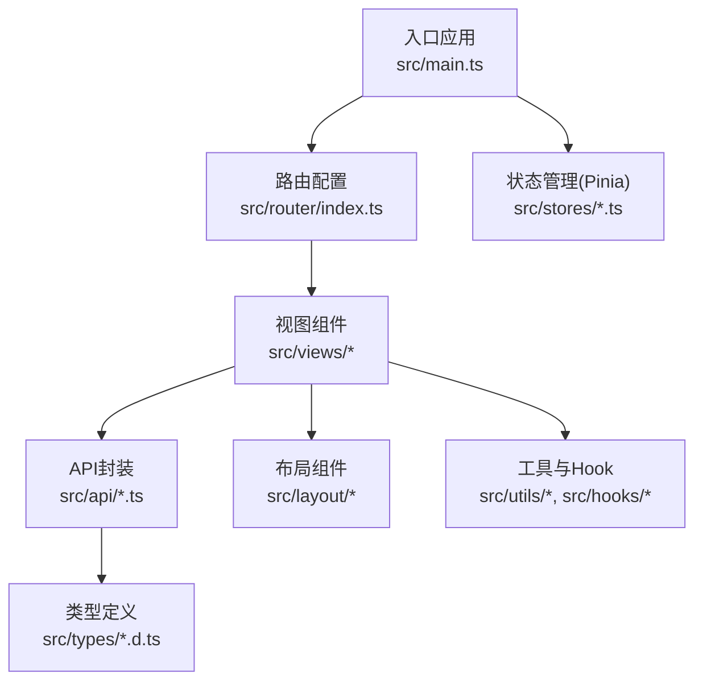
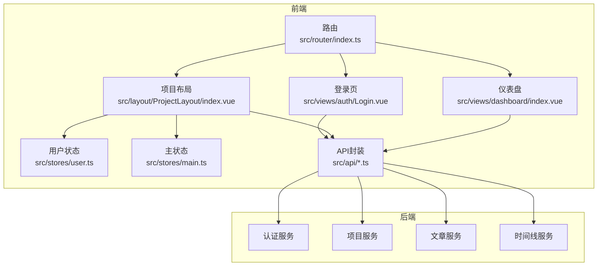
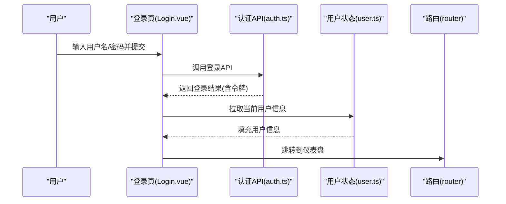
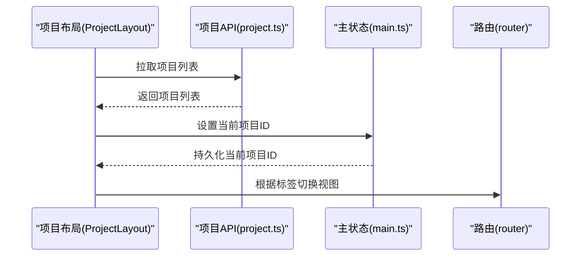
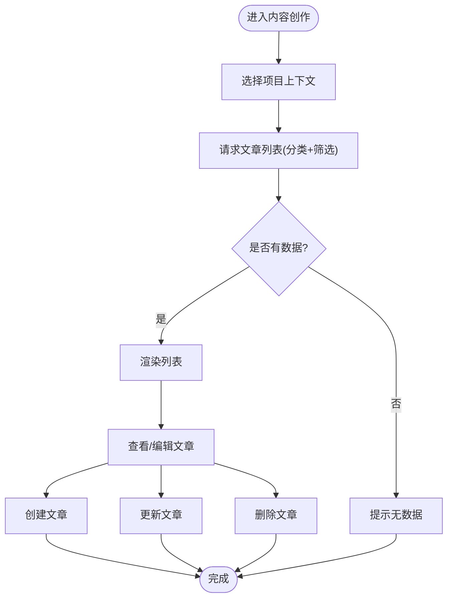
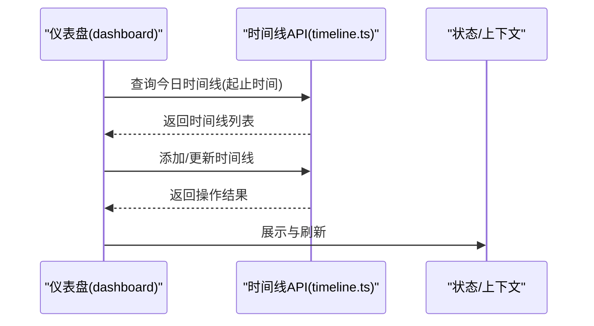
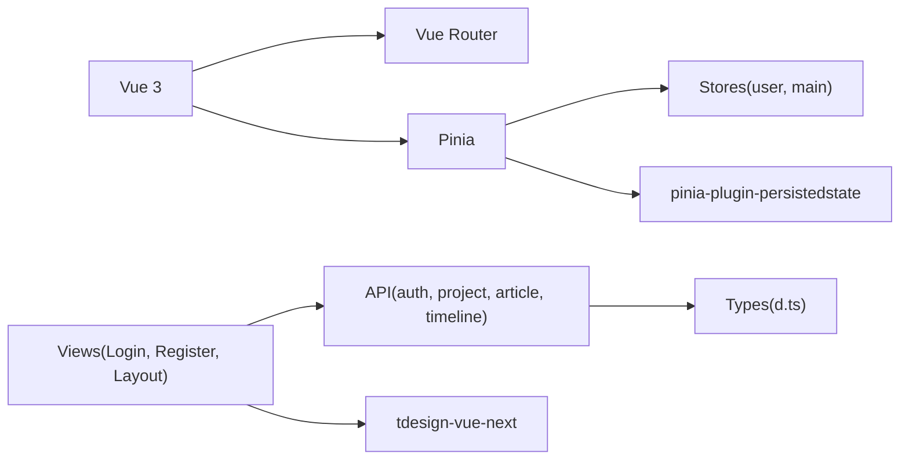

# 核心功能模块

<cite>
**本文引用的文件**
- [src/main.ts](file://src/main.ts)
- [src/router/index.ts](file://src/router/index.ts)
- [src/stores/user.ts](file://src/stores/user.ts)
- [src/stores/main.ts](file://src/stores/main.ts)
- [src/api/auth.ts](file://src/api/auth.ts)
- [src/api/project.ts](file://src/api/project.ts)
- [src/api/article.ts](file://src/api/article.ts)
- [src/api/timeline.ts](file://src/api/timeline.ts)
- [src/views/auth/Login.vue](file://src/views/auth/Login.vue)
- [src/views/auth/Register.vue](file://src/views/auth/Register.vue)
- [src/layout/ProjectLayout/index.vue](file://src/layout/ProjectLayout/index.vue)
- [src/views/dashboard/index.vue](file://src/views/dashboard/index.vue)
- [src/types/loginTypes.ts](file://src/types/loginTypes.ts)
- [src/types/projectTypes.d.ts](file://src/types/projectTypes.d.ts)
- [src/types/articleTypes.d.ts](file://src/types/articleTypes.d.ts)
- [src/types/timelineTypes.d.ts](file://src/types/timelineTypes.d.ts)
</cite>

## 目录
1. [引言](#引言)
2. [项目结构](#项目结构)
3. [核心组件](#核心组件)
4. [架构总览](#架构总览)
5. [详细组件分析](#详细组件分析)
6. [依赖分析](#依赖分析)
7. [性能考虑](#性能考虑)
8. [故障排查指南](#故障排查指南)
9. [结论](#结论)
10. [附录](#附录)

## 引言
本文件面向LiFocus Web V2的核心功能模块，系统性梳理四大模块：用户认证系统、项目管理系统、内容创作系统、时间线管理系统。文档从架构与数据模型出发，结合路由与状态管理，解释各模块的业务逻辑、用户交互流程、模块间依赖与数据流转，并提供扩展点、最佳实践与学习路径建议。

## 项目结构
应用采用前端单页应用（SPA）架构，基于Vue 3 + Pinia + Vue Router组织功能模块；API层通过统一请求封装调用后端服务；类型定义集中于types目录，确保前后端契约一致。

图表来源
- [src/main.ts](file://src/main.ts#L1-L28)
- [src/router/index.ts](file://src/router/index.ts#L1-L82)
- [src/stores/user.ts](file://src/stores/user.ts#L1-L29)
- [src/stores/main.ts](file://src/stores/main.ts#L1-L21)
- [src/api/auth.ts](file://src/api/auth.ts#L1-L41)
- [src/api/project.ts](file://src/api/project.ts#L1-L38)
- [src/api/article.ts](file://src/api/article.ts#L1-L60)
- [src/api/timeline.ts](file://src/api/timeline.ts#L1-L44)
- [src/views/auth/Login.vue](file://src/views/auth/Login.vue#L1-L138)
- [src/layout/ProjectLayout/index.vue](file://src/layout/ProjectLayout/index.vue#L1-L135)

章节来源
- [src/main.ts](file://src/main.ts#L1-L28)
- [src/router/index.ts](file://src/router/index.ts#L1-L82)

## 核心组件
- 应用入口与依赖注入：初始化Pinia、持久化插件、路由与全局样式，挂载根组件。
- 路由系统：定义认证、仪表盘、项目工作台等页面路由，支持懒加载与嵌套路由。
- 状态管理：
  - 用户状态：存储用户基本信息，支持持久化到localStorage。
  - 主状态：存储当前项目ID与加载态，同步至localStorage。
- API封装：围绕认证、项目、文章、时间线提供统一HTTP调用方法。
- 视图组件：登录、注册、项目布局、仪表盘等页面组件。

章节来源
- [src/main.ts](file://src/main.ts#L1-L28)
- [src/router/index.ts](file://src/router/index.ts#L1-L82)
- [src/stores/user.ts](file://src/stores/user.ts#L1-L29)
- [src/stores/main.ts](file://src/stores/main.ts#L1-L21)
- [src/api/auth.ts](file://src/api/auth.ts#L1-L41)
- [src/api/project.ts](file://src/api/project.ts#L1-L38)
- [src/api/article.ts](file://src/api/article.ts#L1-L60)
- [src/api/timeline.ts](file://src/api/timeline.ts#L1-L44)

## 架构总览
下图展示从用户交互到后端API的数据流与模块职责：

图表来源
- [src/router/index.ts](file://src/router/index.ts#L1-L82)
- [src/stores/user.ts](file://src/stores/user.ts#L1-L29)
- [src/stores/main.ts](file://src/stores/main.ts#L1-L21)
- [src/views/auth/Login.vue](file://src/views/auth/Login.vue#L1-L138)
- [src/layout/ProjectLayout/index.vue](file://src/layout/ProjectLayout/index.vue#L1-L135)
- [src/views/dashboard/index.vue](file://src/views/dashboard/index.vue#L1-L26)
- [src/api/auth.ts](file://src/api/auth.ts#L1-L41)
- [src/api/project.ts](file://src/api/project.ts#L1-L38)
- [src/api/article.ts](file://src/api/article.ts#L1-L60)
- [src/api/timeline.ts](file://src/api/timeline.ts#L1-L44)

## 详细组件分析

### 用户认证系统
- 业务目标：提供登录、注册、登出与当前用户查询能力，保障会话安全与用户体验。
- 关键流程：
  - 登录：表单校验 -> 调用登录API -> 成功后写入令牌与过期时间 -> 拉取当前用户信息 -> 跳转仪表盘。
  - 注册：表单校验（密码强度、邮箱格式、二次密码一致性）-> 调用注册API -> 成功提示 -> 跳转登录。
  - 登出：调用登出API -> 清理状态 -> 跳转登录页。
- 数据模型：登录参数、注册参数、登录返回（含访问令牌、刷新令牌、过期时间）、用户信息。
- 依赖关系：视图组件依赖API封装与状态管理；路由控制访问权限与页面跳转。
- 错误处理：统一使用消息钩子提示错误；登录失败抛出异常并捕获显示。

图表来源
- [src/views/auth/Login.vue](file://src/views/auth/Login.vue#L1-L138)
- [src/api/auth.ts](file://src/api/auth.ts#L1-L41)
- [src/stores/user.ts](file://src/stores/user.ts#L1-L29)
- [src/router/index.ts](file://src/router/index.ts#L1-L82)

章节来源
- [src/views/auth/Login.vue](file://src/views/auth/Login.vue#L1-L138)
- [src/views/auth/Register.vue](file://src/views/auth/Register.vue#L1-L137)
- [src/api/auth.ts](file://src/api/auth.ts#L1-L41)
- [src/types/loginTypes.ts](file://src/types/loginTypes.ts#L1-L47)

### 项目管理系统
- 业务目标：支持项目列表查询、创建、切换当前项目，作为内容创作与时间线管理的上下文。
- 关键流程：
  - 加载项目列表：进入项目布局时拉取用户项目列表，供选择当前项目。
  - 切换当前项目：通过主状态store持久化当前项目ID，供其他模块读取。
  - 创建项目：调用创建项目API，返回新项目信息。
- 数据模型：项目信息、创建参数、列表响应。
- 依赖关系：项目布局依赖API与主状态；路由控制不同工作台视图（对话、工作台、创建）。

图表来源
- [src/layout/ProjectLayout/index.vue](file://src/layout/ProjectLayout/index.vue#L1-L135)
- [src/api/project.ts](file://src/api/project.ts#L1-L38)
- [src/stores/main.ts](file://src/stores/main.ts#L1-L21)
- [src/router/index.ts](file://src/router/index.ts#L1-L82)

章节来源
- [src/layout/ProjectLayout/index.vue](file://src/layout/ProjectLayout/index.vue#L1-L135)
- [src/api/project.ts](file://src/api/project.ts#L1-L38)
- [src/stores/main.ts](file://src/stores/main.ts#L1-L21)
- [src/types/projectTypes.d.ts](file://src/types/projectTypes.d.ts#L1-L27)

### 内容创作系统
- 业务目标：在选定项目上下文中进行文章的增删改查，支持按分类分页检索。
- 关键流程：
  - 文章列表：根据分类与筛选条件发起分页请求，渲染列表。
  - 文章详情：根据ID获取文章详情。
  - 创建/更新/删除：分别调用对应API，完成内容生命周期管理。
- 数据模型：文章实体、创建参数、分页响应、过滤器。
- 依赖关系：文章API与项目上下文（当前项目ID）配合使用；编辑器组件负责内容输入。

图表来源
- [src/api/article.ts](file://src/api/article.ts#L1-L60)
- [src/types/articleTypes.d.ts](file://src/types/articleTypes.d.ts#L1-L62)

章节来源
- [src/api/article.ts](file://src/api/article.ts#L1-L60)
- [src/types/articleTypes.d.ts](file://src/types/articleTypes.d.ts#L1-L62)

### 时间线管理系统
- 业务目标：记录用户日常活动，支持按类型与状态筛选、添加与更新。
- 关键流程：
  - 查询今日时间线：传入起止时间范围，返回当日事件列表。
  - 添加/更新时间线：提交标题、类型、内容与描述等字段。
- 数据模型：时间线实体、添加参数、列表响应、过滤器。
- 依赖关系：时间线API与用户上下文配合；仪表盘可集成时间线展示。

图表来源
- [src/views/dashboard/index.vue](file://src/views/dashboard/index.vue#L1-L26)
- [src/api/timeline.ts](file://src/api/timeline.ts#L1-L44)
- [src/types/timelineTypes.d.ts](file://src/types/timelineTypes.d.ts#L1-L39)

章节来源
- [src/api/timeline.ts](file://src/api/timeline.ts#L1-L44)
- [src/types/timelineTypes.d.ts](file://src/types/timelineTypes.d.ts#L1-L39)

## 依赖分析
- 组件耦合与内聚：
  - 视图组件与API封装松耦合，通过函数调用解耦。
  - 状态管理集中于Pinia，避免跨组件重复逻辑。
- 外部依赖：
  - 路由与视图：Vue Router。
  - UI库：tdesign-vue-next。
  - 状态持久化：pinia-plugin-persistedstate。
  - 请求封装：统一HTTP客户端（位于utils/request）。
- 循环依赖：未见明显循环导入；路由与视图通过懒加载避免运行时循环。

图表来源
- [src/main.ts](file://src/main.ts#L1-L28)
- [src/router/index.ts](file://src/router/index.ts#L1-L82)
- [src/stores/user.ts](file://src/stores/user.ts#L1-L29)
- [src/stores/main.ts](file://src/stores/main.ts#L1-L21)
- [src/views/auth/Login.vue](file://src/views/auth/Login.vue#L1-L138)
- [src/layout/ProjectLayout/index.vue](file://src/layout/ProjectLayout/index.vue#L1-L135)
- [src/api/auth.ts](file://src/api/auth.ts#L1-L41)
- [src/api/project.ts](file://src/api/project.ts#L1-L38)
- [src/api/article.ts](file://src/api/article.ts#L1-L60)
- [src/api/timeline.ts](file://src/api/timeline.ts#L1-L44)

章节来源
- [src/main.ts](file://src/main.ts#L1-L28)
- [src/router/index.ts](file://src/router/index.ts#L1-L82)
- [src/stores/user.ts](file://src/stores/user.ts#L1-L29)
- [src/stores/main.ts](file://src/stores/main.ts#L1-L21)

## 性能考虑
- 路由懒加载：通过动态导入减少首屏体积，提升初始加载速度。
- 状态持久化：Pinia持久化用户与主状态，避免频繁重复请求。
- 分页与筛选：文章列表采用分页与多维筛选，降低一次性传输数据量。
- 图标与资源：SVG图标按需引入，减少额外资源开销。
- 建议优化点：
  - 对高频API增加本地缓存策略（如项目列表缓存）。
  - 对复杂表单与长列表启用虚拟滚动或分页加载。
  - 在网络不佳时提供骨架屏与占位符，改善感知性能。

## 故障排查指南
- 登录失败：
  - 检查登录表单校验规则与API返回码。
  - 确认令牌写入与过期时间设置是否正确。
  - 参考路径：[登录页](file://src/views/auth/Login.vue#L1-L138)，[认证API](file://src/api/auth.ts#L1-L41)。
- 注册失败：
  - 校验密码强度、邮箱格式与二次密码一致性。
  - 参考路径：[注册页](file://src/views/auth/Register.vue#L1-L137)。
- 项目切换无效：
  - 确认主状态setCurrentProjectId是否被调用并持久化。
  - 参考路径：[主状态](file://src/stores/main.ts#L1-L21)，[项目布局](file://src/layout/ProjectLayout/index.vue#L1-L135)。
- 文章列表为空：
  - 检查分类ID与筛选条件是否正确传递。
  - 参考路径：[文章API](file://src/api/article.ts#L1-L60)，[类型定义](file://src/types/articleTypes.d.ts#L1-L62)。
- 时间线查询无数据：
  - 校验起止时间范围是否覆盖当天。
  - 参考路径：[时间线API](file://src/api/timeline.ts#L1-L44)，[类型定义](file://src/types/timelineTypes.d.ts#L1-L39)。

章节来源
- [src/views/auth/Login.vue](file://src/views/auth/Login.vue#L1-L138)
- [src/views/auth/Register.vue](file://src/views/auth/Register.vue#L1-L137)
- [src/stores/main.ts](file://src/stores/main.ts#L1-L21)
- [src/layout/ProjectLayout/index.vue](file://src/layout/ProjectLayout/index.vue#L1-L135)
- [src/api/article.ts](file://src/api/article.ts#L1-L60)
- [src/types/articleTypes.d.ts](file://src/types/articleTypes.d.ts#L1-L62)
- [src/api/timeline.ts](file://src/api/timeline.ts#L1-L44)
- [src/types/timelineTypes.d.ts](file://src/types/timelineTypes.d.ts#L1-L39)

## 结论
LiFocus Web V2以清晰的模块边界与统一的类型契约构建了认证、项目、内容与时间线四大核心功能。通过Pinia状态管理与Vue Router路由体系，实现了良好的可维护性与扩展性。后续可在缓存策略、虚拟滚动与国际化等方面进一步增强用户体验。

## 附录

### 功能特性与使用场景
- 用户认证系统
  - 特性：登录/注册/登出、当前用户查询、表单校验。
  - 场景：首次访问引导、账户安全、会话保持。
  - 参考路径：[登录页](file://src/views/auth/Login.vue#L1-L138)，[注册页](file://src/views/auth/Register.vue#L1-L137)，[认证API](file://src/api/auth.ts#L1-L41)。
- 项目管理系统
  - 特性：项目列表查询、创建、当前项目切换。
  - 场景：内容创作上下文隔离、多项目管理。
  - 参考路径：[项目布局](file://src/layout/ProjectLayout/index.vue#L1-L135)，[项目API](file://src/api/project.ts#L1-L38)，[主状态](file://src/stores/main.ts#L1-L21)。
- 内容创作系统
  - 特性：文章分页列表、详情、创建/更新/删除。
  - 场景：知识沉淀、日志记录、笔记管理。
  - 参考路径：[文章API](file://src/api/article.ts#L1-L60)，[类型定义](file://src/types/articleTypes.d.ts#L1-L62)。
- 时间线管理系统
  - 特性：按日查询、添加/更新时间线。
  - 场景：日常任务追踪、成长记录。
  - 参考路径：[时间线API](file://src/api/timeline.ts#L1-L44)，[类型定义](file://src/types/timelineTypes.d.ts#L1-L39)。

### 实现原理与最佳实践
- 实现原理
  - 统一请求封装：所有API通过统一客户端发起HTTP请求，便于拦截器与错误处理。
  - 类型驱动：所有API参数与响应均在类型文件中定义，保证前后端契约一致。
  - 状态持久化：Pinia持久化关键状态，减少重复请求与刷新抖动。
- 最佳实践
  - 表单校验前置：在提交前完成字段校验，减少无效请求。
  - 错误统一处理：通过消息钩子统一提示，避免分散的错误处理逻辑。
  - 路由守卫：在需要鉴权的页面增加路由守卫，防止未登录访问。
  - 缓存策略：对不频繁变化的数据（如项目列表）增加本地缓存，提升体验。

### 扩展点与自定义选项
- 认证扩展
  - 支持第三方登录（OAuth）接入，新增登录方式与回调处理。
  - 增加图形验证码或短信验证，提升安全性。
- 项目扩展
  - 支持项目成员管理、权限控制与项目模板。
  - 增加项目统计面板与导出功能。
- 内容扩展
  - 集成富文本编辑器与Markdown渲染。
  - 支持附件上传、标签与分类体系。
- 时间线扩展
  - 支持提醒通知、重复周期与优先级。
  - 增加时间线可视化（甘特图/日历）。

### 学习路径与进阶指南
- 入门阶段
  - 熟悉Vue 3与Composition API，掌握组件与模板语法。
  - 了解Pinia基础用法与状态持久化。
  - 阅读路由配置与懒加载机制。
- 进阶阶段
  - 深入理解类型系统与API契约设计。
  - 掌握请求封装与错误处理模式。
  - 学习UI库的使用与主题定制。
- 高级阶段
  - 设计模块化与可测试性代码。
  - 引入缓存、虚拟滚动与性能监控。
  - 参与架构评审与技术选型。