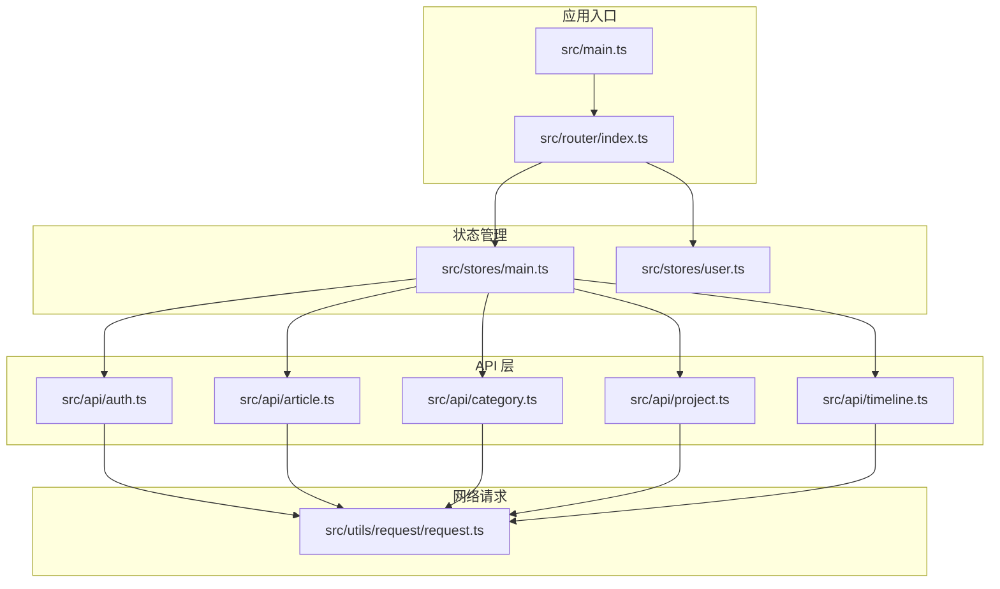
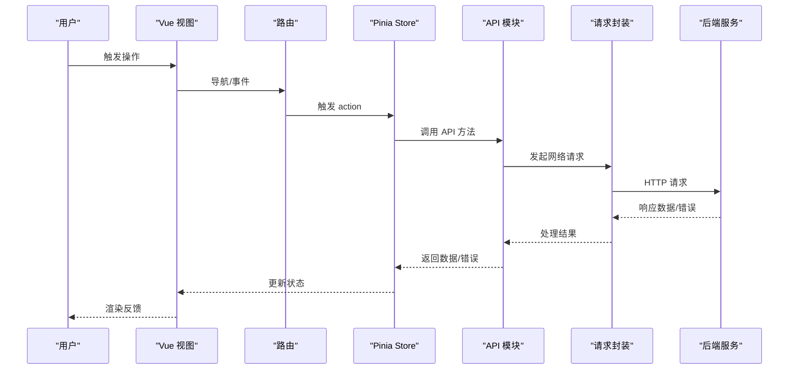
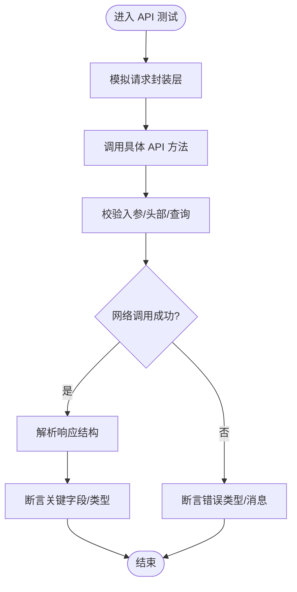
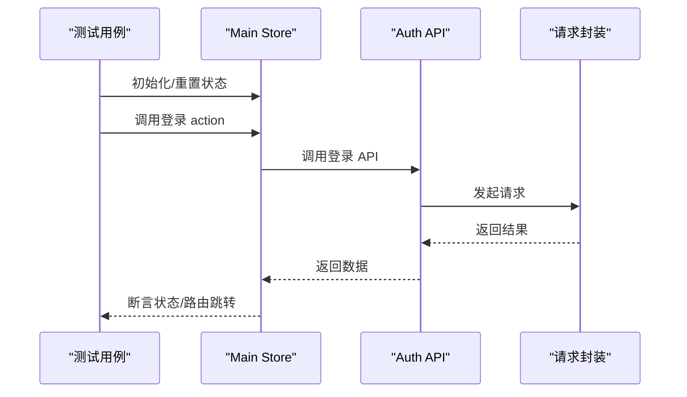
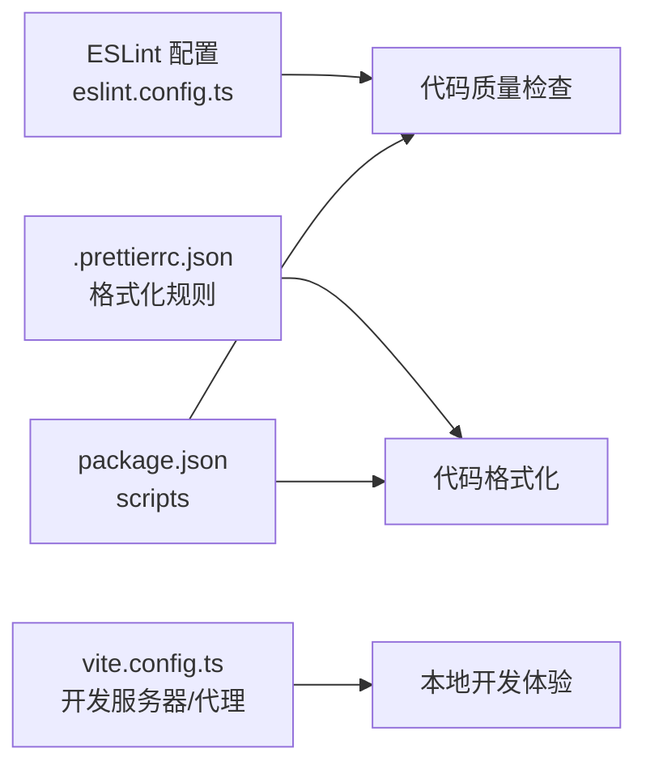

# 测试策略

<cite>
**本文引用的文件**
- [package.json](file://package.json)
- [eslint.config.ts](file://eslint.config.ts)
- [.prettierrc.json](file://.prettierrc.json)
- [vite.config.ts](file://vite.config.ts)
- [test.js](file://test.js)
- [src/main.ts](file://src/main.ts)
- [src/router/index.ts](file://src/router/index.ts)
- [src/stores/main.ts](file://src/stores/main.ts)
- [src/stores/user.ts](file://src/stores/user.ts)
- [src/utils/request/request.ts](file://src/utils/request/request.ts)
- [src/api/auth.ts](file://src/api/auth.ts)
- [src/api/article.ts](file://src/api/article.ts)
- [src/api/category.ts](file://src/api/category.ts)
- [src/api/project.ts](file://src/api/project.ts)
- [src/api/timeline.ts](file://src/api/timeline.ts)
- [src/views/auth/Login.vue](file://src/views/auth/Login.vue)
- [src/views/auth/Register.vue](file://src/views/auth/Register.vue)
- [src/components/Editor/index.vue](file://src/components/Editor/index.vue)
- [src/components/ProjectCard/index.vue](file://src/components/ProjectCard/index.vue)
- [src/hooks/useCustomMessage.ts](file://src/hooks/useCustomMessage.ts)
- [src/hooks/useTdMessage.ts](file://src/hooks/useTdMessage.ts)
- [src/utils/auth.ts](file://src/utils/auth.ts)
- [src/utils/project.ts](file://src/utils/project.ts)
</cite>

## 目录
1. [引言](#引言)
2. [项目结构](#项目结构)
3. [核心组件](#核心组件)
4. [架构总览](#架构总览)
5. [详细组件分析](#详细组件分析)
6. [依赖分析](#依赖分析)
7. [性能考虑](#性能考虑)
8. [故障排查指南](#故障排查指南)
9. [结论](#结论)
10. [附录](#附录)

## 引言
本文件面向 LiFocus Web V2 的测试策略与实践，结合现有仓库中的配置与实现，系统性地梳理单元测试、集成测试与端到端测试的组织方式与实施建议；明确 ESLint 与 Prettier 在代码质量与格式化方面的配置与使用；给出测试覆盖率要求与监控方法；总结测试用例编写最佳实践与模板；说明在持续集成中如何串联测试流程与自动化执行；并提供测试数据准备与模拟策略、调试技巧与常见问题解决方案，以及测试环境配置与隔离策略。

## 项目结构
- 项目采用 Vue 3 + TypeScript + Vite 技术栈，使用 Pinia 管理状态，Axios 进行网络请求，UnoCSS 提供原子化样式。
- 核心源码位于 src/ 目录，包含 API 层、工具层、视图层、组件层、路由与状态管理等模块。
- 开发脚本集中在 package.json 的 scripts 字段，涵盖开发、构建、类型检查、代码规范（ESLint）与格式化（Prettier）等任务。
- 代码质量与格式化通过 ESLint 配置与 Prettier 规则进行约束。

**图表来源**
- [src/main.ts](file://src/main.ts#L1-L50)
- [src/router/index.ts](file://src/router/index.ts#L1-L80)
- [src/stores/main.ts](file://src/stores/main.ts#L1-L120)
- [src/stores/user.ts](file://src/stores/user.ts#L1-L120)
- [src/api/auth.ts](file://src/api/auth.ts#L1-L120)
- [src/api/article.ts](file://src/api/article.ts#L1-L120)
- [src/api/category.ts](file://src/api/category.ts#L1-L120)
- [src/api/project.ts](file://src/api/project.ts#L1-L120)
- [src/api/timeline.ts](file://src/api/timeline.ts#L1-L120)
- [src/utils/request/request.ts](file://src/utils/request/request.ts#L1-L120)

**章节来源**
- [package.json](file://package.json#L1-L60)
- [vite.config.ts](file://vite.config.ts#L1-L31)

## 核心组件
- 单元测试：针对纯函数、工具方法、Store 计算逻辑与业务工具进行测试，确保边界条件与错误路径被覆盖。
- 集成测试：围绕 API 模块与网络请求层，验证接口调用、参数传递、响应处理与错误回退。
- 端到端测试：基于浏览器环境对关键用户旅程（如登录、注册、文章列表加载）进行验证。
- 代码质量：通过 ESLint 与 Prettier 统一风格与质量标准，减少人为分歧与潜在缺陷。
- 覆盖率：建议为关键模块设置阈值（如语句/分支/函数/行），并在 CI 中强制校验。

**章节来源**
- [package.json](file://package.json#L9-L16)
- [eslint.config.ts](file://eslint.config.ts#L1-L23)
- [.prettierrc.json](file://.prettierrc.json#L1-L7)

## 架构总览
下图展示从入口到 API 层的整体调用链路，便于理解测试分层与职责划分：

**图表来源**
- [src/main.ts](file://src/main.ts#L1-L50)
- [src/router/index.ts](file://src/router/index.ts#L1-L80)
- [src/stores/main.ts](file://src/stores/main.ts#L1-L120)
- [src/api/auth.ts](file://src/api/auth.ts#L1-L120)
- [src/utils/request/request.ts](file://src/utils/request/request.ts#L1-L120)

## 详细组件分析

### API 层测试策略
- 目标：验证每个 API 模块的请求构造、参数校验、响应解析与错误处理。
- 实施要点：
  - 使用请求封装层作为依赖注入点，便于替换为测试替身。
  - 对异常场景（网络失败、4xx/5xx、超时）进行断言。
  - 对成功场景验证返回字段完整性与类型一致性。
- 关键文件参考：
  - [src/api/auth.ts](file://src/api/auth.ts#L1-L120)
  - [src/api/article.ts](file://src/api/article.ts#L1-L120)
  - [src/api/category.ts](file://src/api/category.ts#L1-L120)
  - [src/api/project.ts](file://src/api/project.ts#L1-L120)
  - [src/api/timeline.ts](file://src/api/timeline.ts#L1-L120)
  - [src/utils/request/request.ts](file://src/utils/request/request.ts#L1-L120)

**图表来源**
- [src/api/auth.ts](file://src/api/auth.ts#L1-L120)
- [src/utils/request/request.ts](file://src/utils/request/request.ts#L1-L120)

**章节来源**
- [src/api/auth.ts](file://src/api/auth.ts#L1-L120)
- [src/api/article.ts](file://src/api/article.ts#L1-L120)
- [src/api/category.ts](file://src/api/category.ts#L1-L120)
- [src/api/project.ts](file://src/api/project.ts#L1-L120)
- [src/api/timeline.ts](file://src/api/timeline.ts#L1-L120)
- [src/utils/request/request.ts](file://src/utils/request/request.ts#L1-L120)

### Store 与状态管理测试策略
- 目标：验证 Store 的状态变更、派生计算与副作用（异步 action）。
- 实施要点：
  - 使用内存态初始化 Store，避免持久化副作用。
  - 对异步 action 注入 mock 的 API 模块，断言状态变化序列。
  - 对计算属性进行输入输出映射测试。
- 关键文件参考：
  - [src/stores/main.ts](file://src/stores/main.ts#L1-L120)
  - [src/stores/user.ts](file://src/stores/user.ts#L1-L120)

**图表来源**
- [src/stores/main.ts](file://src/stores/main.ts#L1-L120)
- [src/api/auth.ts](file://src/api/auth.ts#L1-L120)
- [src/utils/request/request.ts](file://src/utils/request/request.ts#L1-L120)

**章节来源**
- [src/stores/main.ts](file://src/stores/main.ts#L1-L120)
- [src/stores/user.ts](file://src/stores/user.ts#L1-L120)

### 工具与纯函数测试策略
- 目标：保证工具函数在边界值、空值、非法输入下的稳定性。
- 实施要点：
  - 分离可测试逻辑，避免直接依赖 DOM 或全局对象。
  - 对复杂字符串处理、日期转换、权限判断等函数进行参数化测试。
- 关键文件参考：
  - [src/utils/auth.ts](file://src/utils/auth.ts#L1-L120)
  - [src/utils/project.ts](file://src/utils/project.ts#L1-L120)
  - [src/hooks/useCustomMessage.ts](file://src/hooks/useCustomMessage.ts#L1-L120)
  - [src/hooks/useTdMessage.ts](file://src/hooks/useTdMessage.ts#L1-L120)

**章节来源**
- [src/utils/auth.ts](file://src/utils/auth.ts#L1-L120)
- [src/utils/project.ts](file://src/utils/project.ts#L1-L120)
- [src/hooks/useCustomMessage.ts](file://src/hooks/useCustomMessage.ts#L1-L120)
- [src/hooks/useTdMessage.ts](file://src/hooks/useTdMessage.ts#L1-L120)

### 视图与组件测试策略
- 目标：验证组件渲染、交互行为与子组件通信。
- 实施要点：
  - 使用轻量渲染（如 shallowMount）聚焦当前组件逻辑。
  - 对 props、事件、插槽与指令进行断言。
  - 对用户交互（点击、输入、提交）进行行为驱动测试。
- 关键文件参考：
  - [src/views/auth/Login.vue](file://src/views/auth/Login.vue)
  - [src/views/auth/Register.vue](file://src/views/auth/Register.vue)
  - [src/components/Editor/index.vue](file://src/components/Editor/index.vue)
  - [src/components/ProjectCard/index.vue](file://src/components/ProjectCard/index.vue)

**章节来源**
- [src/views/auth/Login.vue](file://src/views/auth/Login.vue)
- [src/views/auth/Register.vue](file://src/views/auth/Register.vue)
- [src/components/Editor/index.vue](file://src/components/Editor/index.vue)
- [src/components/ProjectCard/index.vue](file://src/components/ProjectCard/index.vue)

### E2E 测试策略
- 目标：覆盖真实用户旅程，如登录、注册、文章列表加载、项目创建等。
- 实施要点：
  - 使用浏览器环境与真实后端或稳定测试环境。
  - 对关键页面的导航、表单提交、列表渲染与错误提示进行验证。
  - 将测试数据隔离与清理，避免跨用例污染。
- 参考入口与路由：
  - [src/main.ts](file://src/main.ts#L1-L50)
  - [src/router/index.ts](file://src/router/index.ts#L1-L80)

**章节来源**
- [src/main.ts](file://src/main.ts#L1-L50)
- [src/router/index.ts](file://src/router/index.ts#L1-L80)

## 依赖分析
- 代码质量与格式化：
  - ESLint 使用 @antfu/eslint-config，启用 TypeScript 支持，并自定义规则与忽略项。
  - Prettier 通过 .prettierrc.json 控制分号、单引号与打印宽度等格式化偏好。
- 构建与开发：
  - Vite 提供开发服务器与代理配置，便于前端联调后端接口。
- 脚本与任务：
  - package.json 的 scripts 定义了 lint、format 等命令，便于本地与 CI 执行。

**图表来源**
- [eslint.config.ts](file://eslint.config.ts#L1-L23)
- [.prettierrc.json](file://.prettierrc.json#L1-L7)
- [package.json](file://package.json#L9-L16)
- [vite.config.ts](file://vite.config.ts#L19-L29)

**章节来源**
- [eslint.config.ts](file://eslint.config.ts#L1-L23)
- [.prettierrc.json](file://.prettierrc.json#L1-L7)
- [package.json](file://package.json#L9-L16)
- [vite.config.ts](file://vite.config.ts#L19-L29)

## 性能考虑
- 单测性能：优先使用纯函数与内存态 Store，避免真实网络 IO；必要时使用快速时钟与批量断言。
- 集成测试：合并相似请求，减少重复连接；对可缓存接口使用固定响应。
- E2E 性能：减少无谓等待，使用稳定的选择器与最小化交互；在 CI 中并行运行互不冲突的用例集。
- 覆盖率：对热点路径与高风险分支设置阈值，避免覆盖率“刷高”而质量下降。

## 故障排查指南
- ESLint/Prettier 冲突：
  - 确认编辑器已启用 ESLint 插件与 Prettier 插件，避免两者互相覆盖。
  - 在 CI 中统一执行格式化与检查，避免本地差异。
- 代理与跨域：
  - Vite 代理指向后端地址，若联调失败，检查代理 rewrite 与 changeOrigin 设置。
- 状态持久化干扰：
  - 单测前重置 Store 状态，避免持久化副作用影响后续用例。
- 网络请求不稳定：
  - 使用请求封装层的 mock 替换真实网络调用，确保测试可重复。
- 调试技巧：
  - 在关键断言前后输出上下文信息；使用断点与日志定位异步流程问题。
  - 对 E2E 用例增加截图与日志记录，便于复现。

**章节来源**
- [vite.config.ts](file://vite.config.ts#L21-L27)
- [src/utils/request/request.ts](file://src/utils/request/request.ts#L1-L120)

## 结论
本项目具备清晰的前端技术栈与基础的代码质量保障机制。建议在现有基础上补充单元测试、集成测试与 E2E 测试的完整套件，完善覆盖率阈值与 CI 自动化流程，确保功能正确性与交付质量。

## 附录

### 测试用例编写最佳实践与模板
- 单元测试模板（伪代码路径）
  - 函数/工具测试：[src/utils/auth.ts](file://src/utils/auth.ts#L1-L120)
  - Store 行为测试：[src/stores/main.ts](file://src/stores/main.ts#L1-L120)
- 集成测试模板（伪代码路径）
  - API 行为测试：[src/api/auth.ts](file://src/api/auth.ts#L1-L120)
  - 请求封装替换：[src/utils/request/request.ts](file://src/utils/request/request.ts#L1-L120)
- E2E 模板（伪代码路径）
  - 登录流程：[src/views/auth/Login.vue](file://src/views/auth/Login.vue)
  - 注册流程：[src/views/auth/Register.vue](file://src/views/auth/Register.vue)

### 测试覆盖率要求与监控
- 建议阈值（示例）
  - 语句覆盖率：≥80%
  - 分支覆盖率：≥70%
  - 函数覆盖率：≥85%
  - 行覆盖率：≥80%
- 监控方式
  - 在 CI 中生成覆盖率报告并设置失败阈值。
  - 对关键模块单独统计，确保热点路径达标。

### 测试数据准备与模拟策略
- 数据准备
  - 使用固定种子数据与最小化有效数据，避免冗余。
  - 对外部依赖（API、存储）使用 mock 或内存态替代。
- 模拟策略
  - 使用请求封装层替换为测试替身，集中控制响应与错误。
  - 对 Store 使用内存态初始化，避免持久化副作用。

### 持续集成中的测试流程与自动化
- 建议流程
  - 安装依赖 → 类型检查 → ESLint/Prettier → 单元测试（含覆盖率）→ 集成测试 → E2E（可选）→ 产物构建
- 自动化要点
  - 在 CI 中统一执行 lint 与 format，保证代码风格一致。
  - 将覆盖率阈值纳入 CI 失败条件，防止质量下滑。

### 测试环境配置与隔离策略
- 开发环境
  - 使用 Vite 代理对接后端服务，便于联调。
- 测试环境
  - 使用独立数据库/存储与独立后端实例，或使用内存态与 mock。
  - 对缓存与会话进行隔离，避免跨用例污染。
- 生产预检
  - 在构建阶段执行类型检查与静态检查，降低生产风险。

**章节来源**
- [package.json](file://package.json#L9-L16)
- [vite.config.ts](file://vite.config.ts#L19-L29)