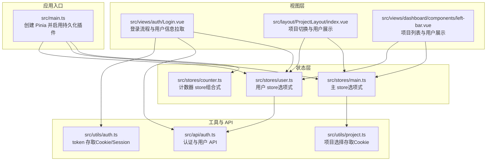
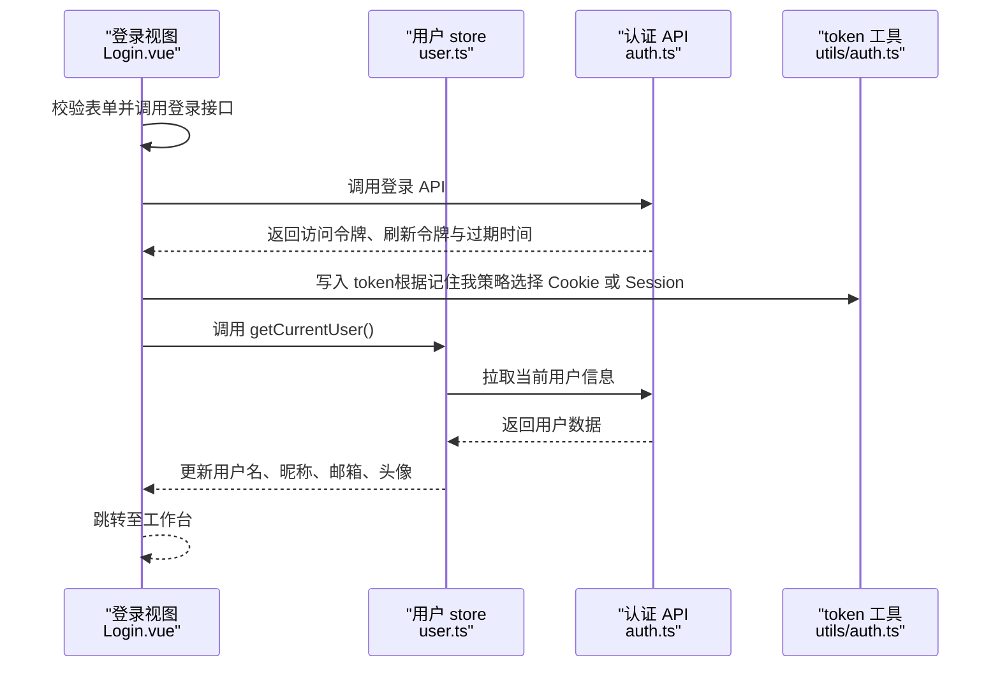
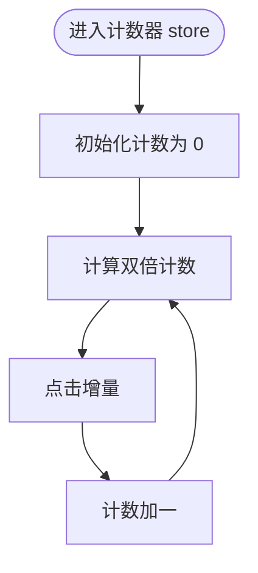
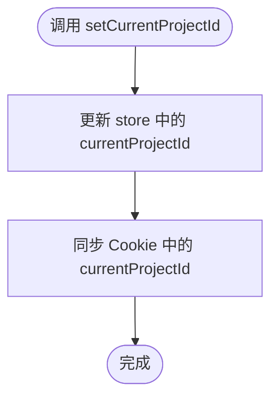
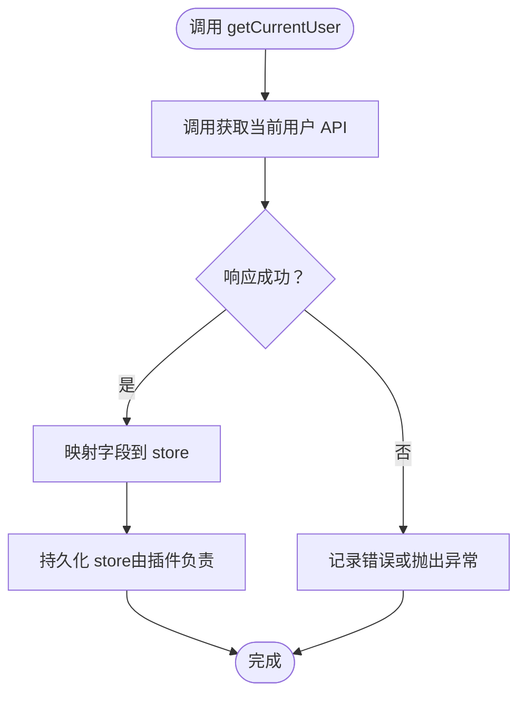
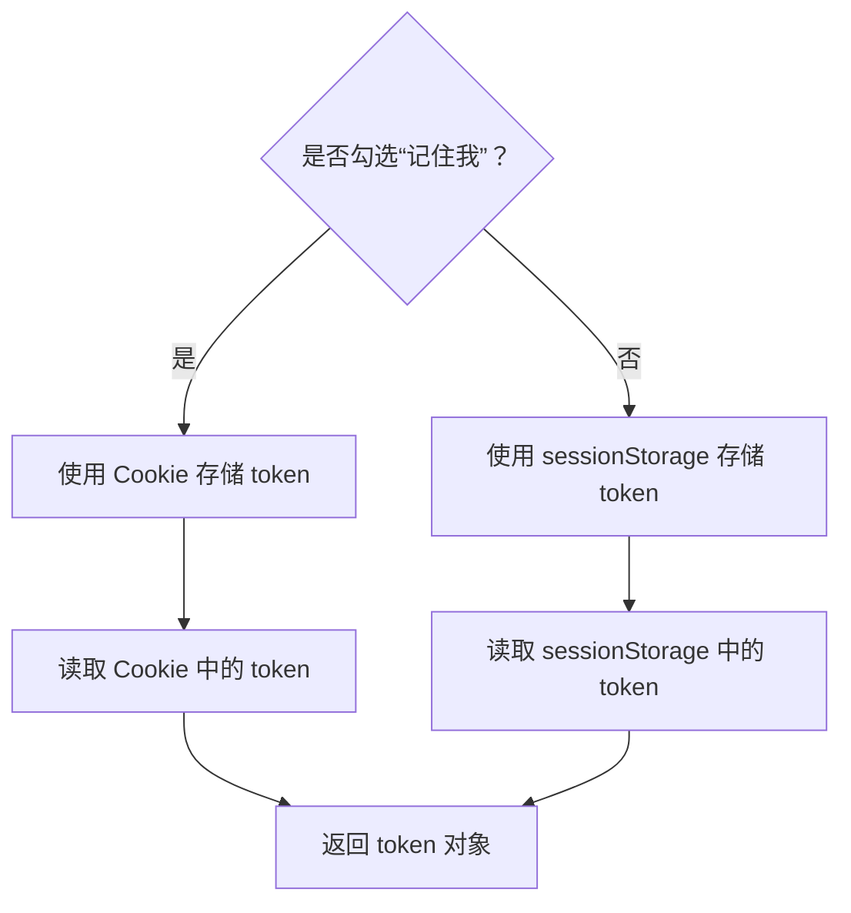
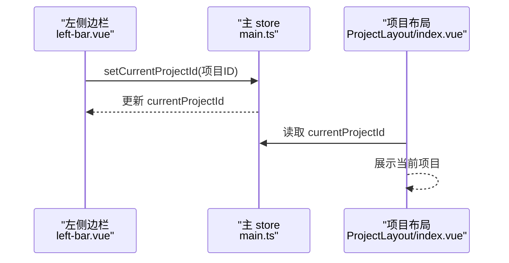
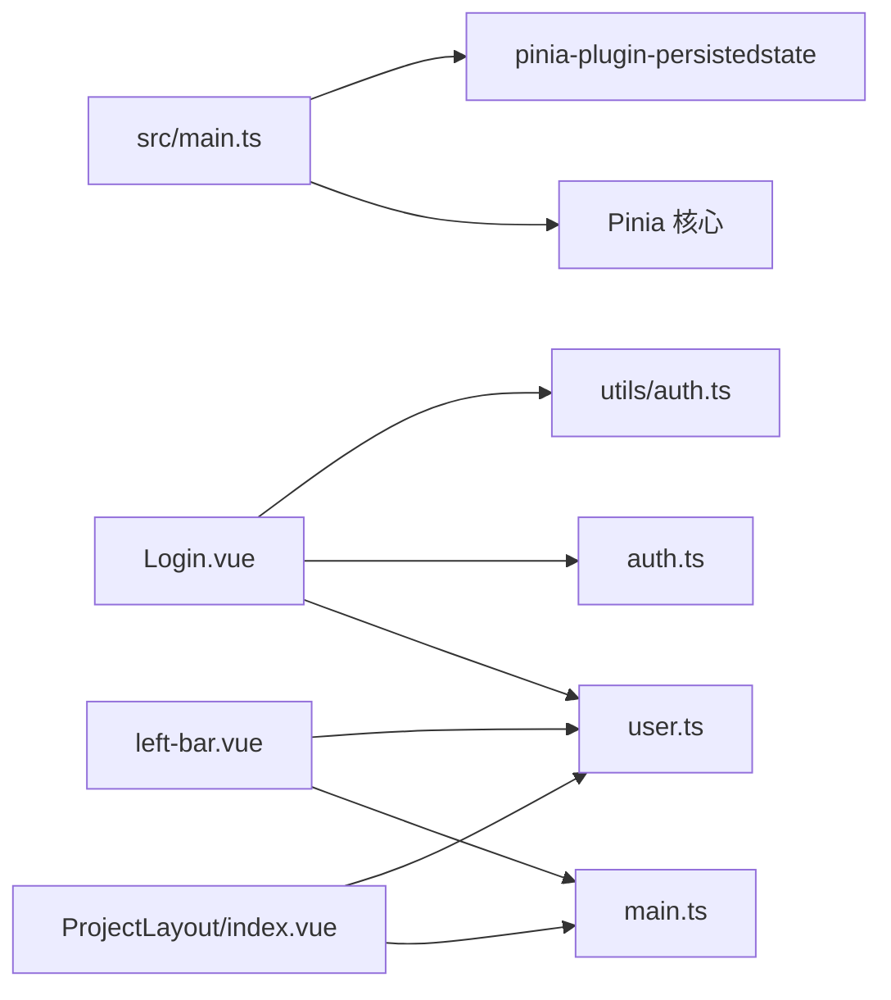

# 状态管理

<cite>
**本文引用的文件**
- [src/main.ts](file://src/main.ts)
- [src/stores/counter.ts](file://src/stores/counter.ts)
- [src/stores/main.ts](file://src/stores/main.ts)
- [src/stores/user.ts](file://src/stores/user.ts)
- [src/utils/auth.ts](file://src/utils/auth.ts)
- [src/utils/project.ts](file://src/utils/project.ts)
- [src/api/auth.ts](file://src/api/auth.ts)
- [src/layout/ProjectLayout/index.vue](file://src/layout/ProjectLayout/index.vue)
- [src/views/auth/Login.vue](file://src/views/auth/Login.vue)
- [src/views/dashboard/components/left-bar.vue](file://src/views/dashboard/components/left-bar.vue)
- [package.json](file://package.json)
</cite>

## 目录
1. [简介](#简介)
2. [项目结构](#项目结构)
3. [核心组件](#核心组件)
4. [架构总览](#架构总览)
5. [详细组件分析](#详细组件分析)
6. [依赖分析](#依赖分析)
7. [性能考虑](#性能考虑)
8. [故障排查指南](#故障排查指南)
9. [结论](#结论)
10. [附录](#附录)

## 简介
本文件系统性梳理 LiFocus Web V2 的状态管理方案，重点覆盖以下方面：
- Pinia Store 设计与实现：counter、main、user 三个 store 的职责、数据结构与行为
- 状态持久化机制：localStorage 与 sessionStorage 的使用策略
- 状态同步机制：组件间状态共享与响应式更新
- 认证状态管理：token 存储、用户信息管理与权限相关实践
- 异步状态处理：loading、错误与成功状态的管理方式
- 调试与监控：状态持久化与交互流程的可观测性建议
- 最佳实践与性能优化：可维护性与运行时效率提升要点

## 项目结构
本项目的前端状态管理以 Pinia 为核心，结合持久化插件与工具函数，形成“store + 工具 + API”的分层设计。应用入口在 main.ts 中初始化 Pinia 并启用持久化插件；各 store 定义在 src/stores 下，工具函数位于 src/utils，API 封装在 src/api。

图表来源
- [src/main.ts](file://src/main.ts#L1-L28)
- [src/stores/counter.ts](file://src/stores/counter.ts#L1-L13)
- [src/stores/main.ts](file://src/stores/main.ts#L1-L21)
- [src/stores/user.ts](file://src/stores/user.ts#L1-L29)
- [src/utils/auth.ts](file://src/utils/auth.ts#L1-L71)
- [src/utils/project.ts](file://src/utils/project.ts#L1-L10)
- [src/api/auth.ts](file://src/api/auth.ts#L1-L41)
- [src/views/auth/Login.vue](file://src/views/auth/Login.vue#L1-L138)
- [src/layout/ProjectLayout/index.vue](file://src/layout/ProjectLayout/index.vue#L1-L135)
- [src/views/dashboard/components/left-bar.vue](file://src/views/dashboard/components/left-bar.vue#L1-L107)

章节来源
- [src/main.ts](file://src/main.ts#L1-L28)
- [package.json](file://package.json#L18-L39)

## 核心组件
- 计数器 store（组合式）
  - 提供基础计数与派生计算，演示组合式 API 的简洁写法
  - 适合学习与演示，不涉及持久化
- 主 store（选项式）
  - 维护全局加载态与当前项目 ID
  - 通过持久化配置将状态保存到 localStorage
  - 提供设置当前项目 ID 的动作，并同步 Cookie
- 用户 store（选项式）
  - 维护用户基本信息
  - 通过持久化配置将状态保存到 localStorage
  - 提供异步获取当前用户信息的动作

章节来源
- [src/stores/counter.ts](file://src/stores/counter.ts#L1-L13)
- [src/stores/main.ts](file://src/stores/main.ts#L1-L21)
- [src/stores/user.ts](file://src/stores/user.ts#L1-L29)

## 架构总览
下图展示了登录流程中状态与外部系统的交互路径，包括 token 存储、用户信息拉取与 Pinia store 的联动。

图表来源
- [src/views/auth/Login.vue](file://src/views/auth/Login.vue#L38-L80)
- [src/stores/user.ts](file://src/stores/user.ts#L12-L19)
- [src/api/auth.ts](file://src/api/auth.ts#L7-L12)
- [src/utils/auth.ts](file://src/utils/auth.ts#L12-L24)

## 详细组件分析

### 计数器 store（组合式）
- 设计模式
  - 使用组合式 API 定义 store，返回响应式数据与方法
  - 适合轻量、无副作用的状态逻辑
- 数据结构
  - 原子状态：计数值
  - 派生状态：基于计数的双倍值
- 方法
  - 增量方法用于修改计数
- 复杂度
  - 计算与更新均为 O(1)
- 性能与优化
  - 仅在需要时进行计算，避免不必要的重渲染
  - 可通过拆分更细的 store 降低耦合

图表来源
- [src/stores/counter.ts](file://src/stores/counter.ts#L4-L12)

章节来源
- [src/stores/counter.ts](file://src/stores/counter.ts#L1-L13)

### 主 store（选项式 + 持久化）
- 设计模式
  - 使用选项式 API 定义 state 与 actions
  - 配置持久化键与存储位置
- 数据结构
  - isLoading：全局加载态
  - currentProjectId：当前项目 ID
- 行为
  - setCurrentProjectId：更新当前项目 ID，并同步 Cookie
- 持久化
  - 键名：main
  - 存储：localStorage
- 复杂度
  - 更新与读取均为 O(1)
- 同步机制
  - 通过 action 内部同步 Cookie，确保跨页面一致

图表来源
- [src/stores/main.ts](file://src/stores/main.ts#L11-L14)
- [src/utils/project.ts](file://src/utils/project.ts#L3-L5)

章节来源
- [src/stores/main.ts](file://src/stores/main.ts#L1-L21)
- [src/utils/project.ts](file://src/utils/project.ts#L1-L10)

### 用户 store（选项式 + 持久化 + 异步）
- 设计模式
  - 选项式 API + 异步动作
  - 配置持久化键与存储位置
- 数据结构
  - username、nickname、email、avatar
- 行为
  - getCurrentUser：异步拉取用户信息并更新 store
- 持久化
  - 键名：user
  - 存储：localStorage
- 复杂度
  - 状态更新 O(1)，网络请求取决于后端响应
- 与认证的协作
  - 登录成功后调用该动作以填充用户信息

图表来源
- [src/stores/user.ts](file://src/stores/user.ts#L12-L19)
- [src/api/auth.ts](file://src/api/auth.ts#L36-L40)

章节来源
- [src/stores/user.ts](file://src/stores/user.ts#L1-L29)
- [src/api/auth.ts](file://src/api/auth.ts#L1-L41)

### 认证状态管理（token 存储与读取）
- 策略
  - “记住我”勾选时：使用 Cookie，设置过期时间
  - 未勾选时：使用 sessionStorage，生命周期随会话
- 工具函数
  - setToken：写入访问/刷新 token 与过期时间
  - getToken/getRefreshToken：读取对应 token
  - removeToken：清理所有 token
- 与 store 的关系
  - store 不直接存储 token，而是通过工具函数与浏览器存储交互
  - 登录成功后，视图层调用工具写入 token，并触发用户信息拉取

图表来源
- [src/utils/auth.ts](file://src/utils/auth.ts#L12-L45)

章节来源
- [src/utils/auth.ts](file://src/utils/auth.ts#L1-L71)
- [src/views/auth/Login.vue](file://src/views/auth/Login.vue#L62-L70)

### 状态同步机制（组件间共享与响应式更新）
- 组件如何使用 store
  - 在布局组件与仪表盘侧边栏中分别引入并使用 main 与 user store
  - 通过响应式绑定展示用户昵称与项目选择
- 同步链路
  - 侧边栏选择项目 -> 调用 main.store.setCurrentProjectId -> 更新 store 与 Cookie
  - 布局组件监听项目变化 -> 调用 main.store.setCurrentProjectId -> 保持一致
- 响应式更新
  - store 状态变更自动驱动模板更新
  - 通过 watch 监听项目变化，保证跨组件一致性

图表来源
- [src/views/dashboard/components/left-bar.vue](file://src/views/dashboard/components/left-bar.vue#L22-L25)
- [src/stores/main.ts](file://src/stores/main.ts#L11-L14)
- [src/layout/ProjectLayout/index.vue](file://src/layout/ProjectLayout/index.vue#L20-L25)

章节来源
- [src/layout/ProjectLayout/index.vue](file://src/layout/ProjectLayout/index.vue#L1-L135)
- [src/views/dashboard/components/left-bar.vue](file://src/views/dashboard/components/left-bar.vue#L1-L107)

### 异步状态处理（loading、错误、成功）
- 当前实现
  - main.store 中存在 isLoading 字段，但未在现有代码中显式使用
  - 登录流程通过消息提示反馈成功或失败
- 建议实践
  - 在发起请求前设置 isLoading=true，请求完成后恢复
  - 对错误进行统一捕获与提示，区分业务错误与网络错误
  - 成功后执行后续跳转与数据拉取
- 与 store 的配合
  - 将 loading 状态放入 main.store，便于全局控制
  - 将用户信息放入 user.store，便于多组件共享

章节来源
- [src/stores/main.ts](file://src/stores/main.ts#L5-L8)
- [src/views/auth/Login.vue](file://src/views/auth/Login.vue#L61-L80)

## 依赖分析
- Pinia 与持久化插件
  - 在入口处创建 Pinia 并安装持久化插件，使 store 支持本地持久化
- 第三方依赖
  - js-cookie：用于 Cookie 存取 token
  - axios：HTTP 客户端，被封装为 httpClient 供 API 使用
- 组件对 store 的依赖
  - 布局与侧边栏组件依赖 main 与 user store
  - 登录视图依赖 user store 与认证 API

图表来源
- [src/main.ts](file://src/main.ts#L1-L28)
- [src/views/auth/Login.vue](file://src/views/auth/Login.vue#L1-L138)
- [src/layout/ProjectLayout/index.vue](file://src/layout/ProjectLayout/index.vue#L1-L135)
- [src/views/dashboard/components/left-bar.vue](file://src/views/dashboard/components/left-bar.vue#L1-L107)

章节来源
- [package.json](file://package.json#L18-L39)
- [src/main.ts](file://src/main.ts#L1-L28)

## 性能考虑
- store 数量与粒度
  - 将不同域的状态拆分为独立 store，降低无关更新
- 持久化范围
  - 仅对必要状态启用持久化，避免过度序列化大对象
- 异步请求节流
  - 对频繁触发的请求进行去抖/节流，减少重复网络调用
- 渲染优化
  - 使用浅层响应式与 computed 缓存派生结果
- 打包与懒加载
  - 结合路由懒加载与动态导入，减少初始包体

## 故障排查指南
- 现象：刷新后用户信息丢失
  - 排查：确认 user store 是否启用持久化，键名为 user，存储为 localStorage
  - 参考：[src/stores/user.ts](file://src/stores/user.ts#L22-L26)
- 现象：项目切换后其他组件未更新
  - 排查：检查是否通过 main.store.setCurrentProjectId 更新状态并触发 watch
  - 参考：[src/stores/main.ts](file://src/stores/main.ts#L11-L14)、[src/layout/ProjectLayout/index.vue](file://src/layout/ProjectLayout/index.vue#L20-L25)
- 现象：登录后 token 未正确写入
  - 排查：确认“记住我”状态与 setToken 的分支逻辑
  - 参考：[src/utils/auth.ts](file://src/utils/auth.ts#L12-L24)
- 现象：登录成功但未拉取用户信息
  - 排查：确认登录成功后调用了 user.store.getCurrentUser
  - 参考：[src/views/auth/Login.vue](file://src/views/auth/Login.vue#L68-L70)

章节来源
- [src/stores/user.ts](file://src/stores/user.ts#L1-L29)
- [src/stores/main.ts](file://src/stores/main.ts#L1-L21)
- [src/layout/ProjectLayout/index.vue](file://src/layout/ProjectLayout/index.vue#L1-L135)
- [src/utils/auth.ts](file://src/utils/auth.ts#L1-L71)
- [src/views/auth/Login.vue](file://src/views/auth/Login.vue#L1-L138)

## 结论
本项目采用 Pinia 作为状态管理核心，结合持久化插件与工具函数，实现了清晰的认证与用户信息管理、项目选择状态的跨组件同步。通过将 token 存储与 store 解耦，既满足了安全需求，又保持了状态的可持久化与可追踪。建议在现有基础上补充全局 loading 状态与统一错误处理，并进一步细化 store 的职责边界，以提升可维护性与性能表现。

## 附录
- 状态持久化配置清单
  - main store：键名 main，存储 localStorage
  - user store：键名 user，存储 localStorage
- 认证 token 存储策略
  - 勾选“记住我”：Cookie，带过期时间
  - 未勾选：sessionStorage，随会话结束而清除