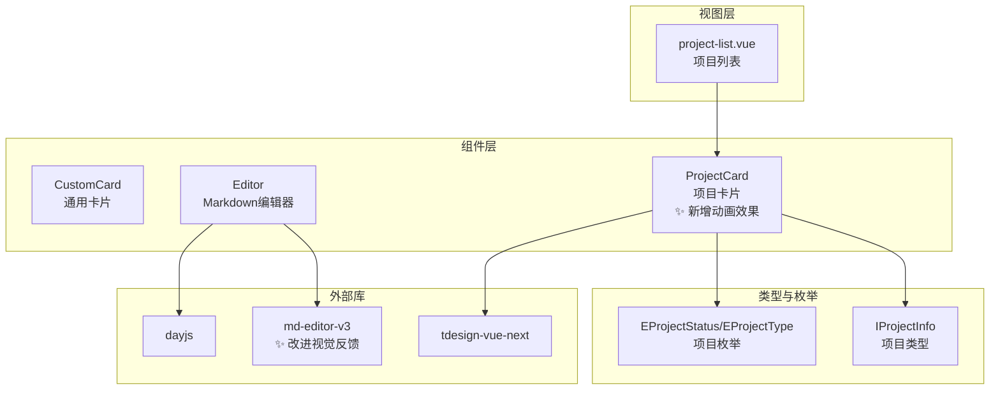
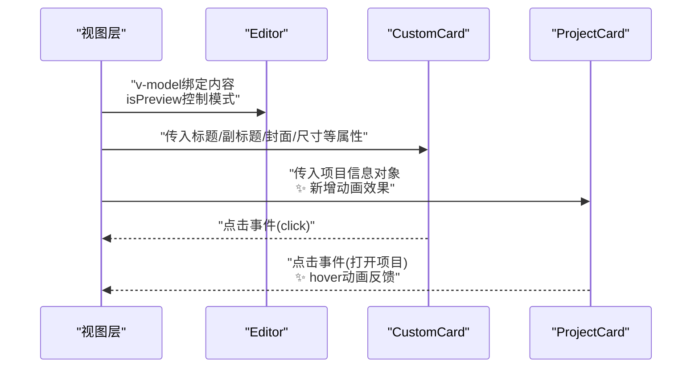
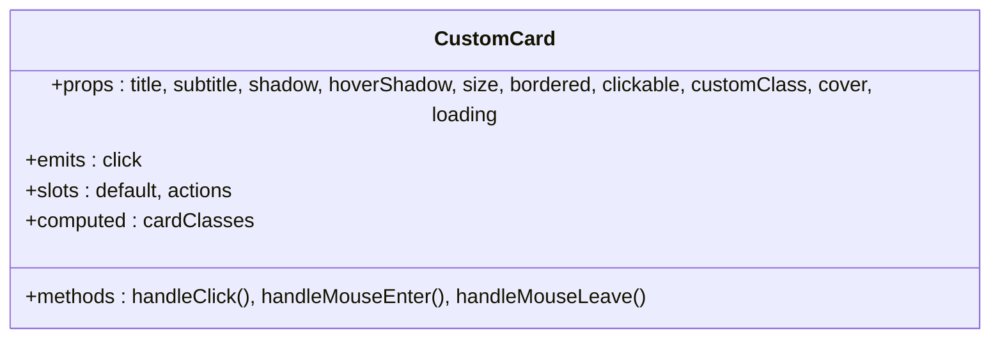
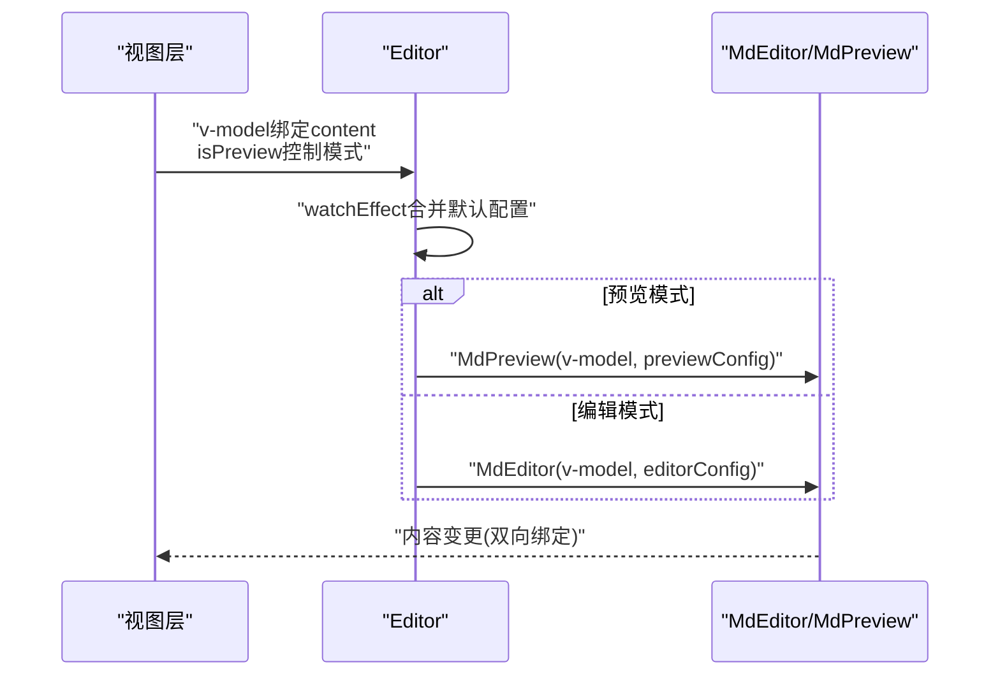
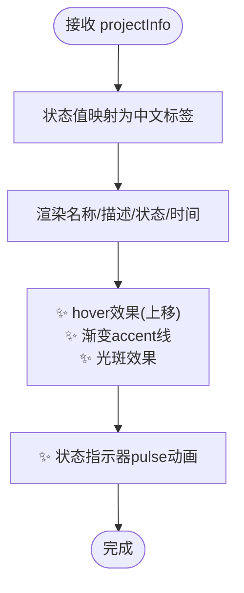
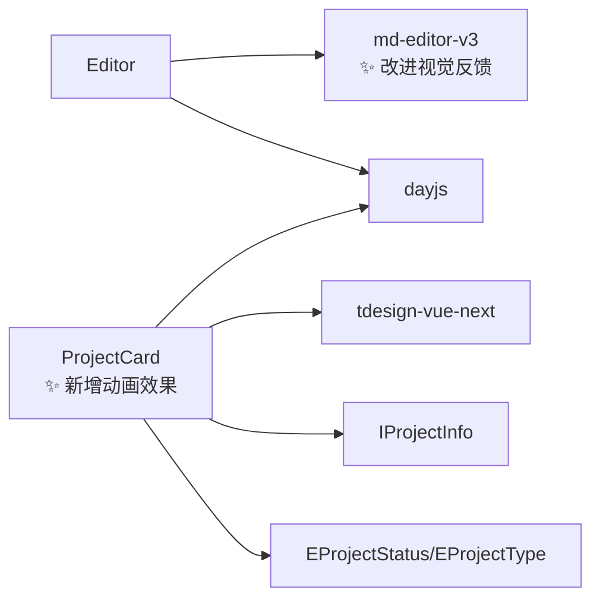

# 可复用组件

<cite>
**本文引用的文件**
- [src/components/CustomCard/index.vue](file://src/components/CustomCard/index.vue)
- [src/components/CustomCard/demo.vue](file://src/components/CustomCard/demo.vue)
- [src/components/Editor/index.vue](file://src/components/Editor/index.vue)
- [src/components/ProjectCard/index.vue](file://src/components/ProjectCard/index.vue)
- [src/types/projectTypes.d.ts](file://src/types/projectTypes.d.ts)
- [src/utils/enums/projectEnum.ts](file://src/utils/enums/projectEnum.ts)
- [src/views/dashboard/components/project-list.vue](file://src/views/dashboard/components/project-list.vue)
- [src/style/common.css](file://src/style/common.css)
- [package.json](file://package.json)
</cite>

## 更新摘要
**变更内容**
- ProjectCard 组件新增动画效果、渐变设计和状态指示器系统
- Editor 组件改进视觉反馈和滚动条样式
- 整体组件库视觉质量显著提升

## 目录
1. [简介](#简介)
2. [项目结构](#项目结构)
3. [核心组件](#核心组件)
4. [架构总览](#架构总览)
5. [组件详细分析](#组件详细分析)
6. [依赖关系分析](#依赖关系分析)
7. [性能考虑](#性能考虑)
8. [故障排查指南](#故障排查指南)
9. [结论](#结论)
10. [附录](#附录)

## 简介
本文件面向可复用组件的设计与实现，重点覆盖以下三个组件：
- CustomCard：通用卡片容器，支持标题/副标题、封面图、尺寸、边框、阴影、可点击、加载态、插槽等特性，强调可扩展性与样式定制。
- Editor：Markdown 编辑器封装，基于 md-editor-v3，提供编辑态与预览态切换、默认工具栏与主题配置、底部信息插槽等。
- ProjectCard：项目卡片，用于展示项目信息（名称、描述、状态、更新时间），集成 tdesign-vue-next Tag 与图标资源。

**更新** 项目组件库经过重大视觉升级，ProjectCard 获得了全新的动画效果和渐变设计，Editor 组件提供了更好的视觉反馈。

文档将从设计理念、实现细节、API 参数、事件与插槽、样式定制、使用示例、性能优化与最佳实践、组件间依赖与组合模式等方面进行系统阐述。

## 项目结构
可复用组件集中于 src/components 下，配合类型定义、枚举与视图层使用示例：
- 组件目录：src/components/CustomCard、src/components/Editor、src/components/ProjectCard
- 类型与枚举：src/types/projectTypes.d.ts、src/utils/enums/projectEnum.ts
- 视图使用示例：src/views/dashboard/components/project-list.vue
- 公共样式：src/style/common.css
- 依赖声明：package.json

**图表来源**
- [src/components/ProjectCard/index.vue:80-150](file://src/components/ProjectCard/index.vue#L80-L150)
- [src/components/Editor/index.vue:120-163](file://src/components/Editor/index.vue#L120-L163)

**章节来源**
- [src/components/CustomCard/index.vue:1-317](file://src/components/CustomCard/index.vue#L1-L317)
- [src/components/Editor/index.vue:1-164](file://src/components/Editor/index.vue#L1-L164)
- [src/components/ProjectCard/index.vue:1-306](file://src/components/ProjectCard/index.vue#L1-L306)
- [src/types/projectTypes.d.ts:1-27](file://src/types/projectTypes.d.ts#L1-L27)
- [src/utils/enums/projectEnum.ts:1-9](file://src/utils/enums/projectEnum.ts#L1-L9)
- [src/views/dashboard/components/project-list.vue:250-280](file://src/views/dashboard/components/project-list.vue#L250-L280)
- [src/style/common.css:1-13](file://src/style/common.css#L1-L13)
- [package.json:18-39](file://package.json#L18-L39)

## 核心组件
本节概述三个组件的功能定位、适用场景与关键特性：
- CustomCard：作为通用卡片容器，提供统一的布局结构、尺寸与样式开关、可点击交互、加载遮罩、封面图与标题副标题区、默认内容区与操作插槽，适合承载文章、项目、任务等信息卡片。
- Editor：封装 Markdown 编辑器，支持编辑态与预览态切换、默认工具栏与主题配置、底部信息插槽、v-model 双向绑定，满足富文本编辑与展示需求。
- ProjectCard：项目信息卡片，展示项目名称、描述、状态标签与更新时间，结合 tdesign-vue-next Tag 实现状态可视化，适合项目列表卡片视图。

**更新** ProjectCard 组件现已具备全新的视觉设计，包括渐变背景、动画效果和状态指示器。

章节来源
- [src/components/CustomCard/index.vue:1-317](file://src/components/CustomCard/index.vue#L1-L317)
- [src/components/Editor/index.vue:1-164](file://src/components/Editor/index.vue#L1-L164)
- [src/components/ProjectCard/index.vue:1-306](file://src/components/ProjectCard/index.vue#L1-L306)

## 架构总览
三个组件在项目中的位置与交互如下：
- CustomCard：独立组件，Demo 示例位于 demo.vue 中，可直接在任意页面使用。
- Editor：在项目列表视图中被使用，负责内容编辑与预览。
- ProjectCard：在项目列表视图中被使用，用于卡片与表格两种展示模式。

**图表来源**
- [src/views/dashboard/components/project-list.vue:254-256](file://src/views/dashboard/components/project-list.vue#L254-L256)
- [src/components/CustomCard/index.vue:81-95](file://src/components/CustomCard/index.vue#L81-L95)
- [src/components/ProjectCard/index.vue:127-150](file://src/components/ProjectCard/index.vue#L127-L150)

## 组件详细分析

### CustomCard 组件
- 设计理念
  - 以"卡片容器"为核心抽象，提供统一的布局结构与样式开关，便于在不同业务场景下快速复用。
  - 支持多种尺寸、边框、阴影、可点击、加载态、封面图与标题副标题区，以及默认内容区与操作插槽，满足多样化的信息承载需求。
- 关键实现点
  - Props 定义与默认值：title、subtitle、shadow、hoverShadow、size、bordered、clickable、customClass、cover、loading。
  - 事件：click（仅在 clickable=true 时触发）。
  - 插槽：default（内容区）、actions（操作区）。
  - 样式：通过 CSS 变量与类名组合实现尺寸、边框、阴影、可点击、加载态、封面图等样式；支持响应式与暗色主题适配注释。
  - 性能：使用 computed 计算类名，避免重复渲染；hover 状态通过 ref 控制，减少不必要的计算。
- 使用示例
  - 基础用法：传入标题、副标题、封面图、可点击，插槽中放置内容与操作按钮。
  - 不同尺寸：small/medium/large。
  - 特殊样式：无边框、固定阴影、自定义背景与边框装饰。
  - 加载状态：loading=true 显示加载遮罩。
- 可扩展性与定制化
  - 通过 size、bordered、shadow、hoverShadow、customClass 等属性灵活定制外观。
  - 通过 actions 插槽注入操作按钮，实现不同业务场景下的操作区。
  - 通过 CSS 变量覆盖默认主题变量，实现主题一致性与品牌化定制。

**图表来源**
- [src/components/CustomCard/index.vue:5-95](file://src/components/CustomCard/index.vue#L5-L95)

**章节来源**
- [src/components/CustomCard/index.vue:1-317](file://src/components/CustomCard/index.vue#L1-L317)
- [src/components/CustomCard/demo.vue:1-181](file://src/components/CustomCard/demo.vue#L1-L181)

### Editor 组件
- 设计理念
  - 基于 md-editor-v3 提供 Markdown 编辑与预览能力，内置默认工具栏与主题配置，简化集成成本。
  - 通过 isPreview 切换编辑态与预览态，支持 v-model 双向绑定与底部信息插槽。
- 关键实现点
  - Props：isPreview（布尔）、editorConfig（编辑器配置）、previewConfig（预览配置）。
  - 默认配置：主题、工具栏、占位符、自动聚焦、目录布局、代码主题等。
  - 动态配置：watchEffect 根据 isPreview 合并默认配置与传入配置。
  - v-model：content（字符串）。
  - 插槽：底部信息 defFooters，展示当前时间等信息。
  - **更新** 新增自定义滚动条样式，提供更好的视觉反馈。
- 使用示例
  - 在项目列表视图中使用：根据模式（新增/查看/编辑）切换 isPreview，禁用保存期间的编辑状态。
  - 自定义配置：通过 editorConfig/previewConfig 覆盖默认行为。
- 可扩展性与定制化
  - 通过 editorConfig/previewConfig 注入 md-editor-v3 的完整配置，实现主题、工具栏、代码高亮等深度定制。
  - 通过插槽扩展底部信息，满足日志、统计等附加信息展示。

**图表来源**
- [src/components/Editor/index.vue:88-108](file://src/components/Editor/index.vue#L88-L108)
- [src/views/dashboard/components/project-list.vue:254-256](file://src/views/dashboard/components/project-list.vue#L254-L256)

**章节来源**
- [src/components/Editor/index.vue:1-164](file://src/components/Editor/index.vue#L1-L164)
- [src/views/dashboard/components/project-list.vue:254-256](file://src/views/dashboard/components/project-list.vue#L254-L256)

### ProjectCard 组件
- 设计理念
  - 专注于项目信息的卡片展示，提供名称、描述、状态标签与更新时间的清晰呈现。
  - 结合 tdesign-vue-next Tag 实现状态可视化，使用图标与滚动条提升阅读体验。
- 关键实现点
  - Props：projectInfo（IProjectInfo 类型）。
  - 状态映射：EProjectStatus 枚举转换为中文标签。
  - 插槽：未定义插槽，内容通过模板直接渲染。
  - 样式：**更新** 全新的动画效果、渐变设计、状态指示器系统。
- 使用示例
  - 在项目列表视图中循环渲染，支持卡片与表格两种展示模式。
  - 点击卡片打开项目详情或执行相关操作。
- 可扩展性与定制化
  - 可通过传入不同的 projectInfo 字段扩展展示内容。
  - 可结合父级容器样式实现布局与间距调整。

**更新** ProjectCard 组件获得了重大的视觉升级，包括：

#### 新增动画效果
- **顶部渐变 accent 线**：使用 `linear-gradient(90deg, #3d2266, #437b70 60%, #5b8f5a)` 实现动态渐变线条
- **右上角柔和光斑**：使用径向渐变实现 hover 时浮现的光晕效果
- **状态指示器动画**：pulse 动画效果，模拟心跳状态

#### 渐变设计系统
- **主背景渐变**：`linear-gradient(180deg, #fff, #fbfbfe)` 提供柔和的渐变背景
- **图标渐变**：项目图标使用 `linear-gradient(135deg, #edf4f2, #f4eef8)` 渐变背景
- **归档状态渐变**：`linear-gradient(180deg, #fafafc, #f5f4f8)` 专为归档状态设计

#### 状态指示器系统
- **活跃状态**：使用绿色脉冲点表示项目处于活跃状态
- **归档状态**：使用淡色主题，提供不同的视觉反馈
- **时间显示**：使用等宽字体和特定颜色方案

**图表来源**
- [src/components/ProjectCard/index.vue:17-34](file://src/components/ProjectCard/index.vue#L17-L34)
- [src/components/ProjectCard/index.vue:127-150](file://src/components/ProjectCard/index.vue#L127-L150)
- [src/components/ProjectCard/index.vue:224-233](file://src/components/ProjectCard/index.vue#L224-L233)

**章节来源**
- [src/components/ProjectCard/index.vue:1-306](file://src/components/ProjectCard/index.vue#L1-L306)
- [src/types/projectTypes.d.ts:1-27](file://src/types/projectTypes.d.ts#L1-L27)
- [src/utils/enums/projectEnum.ts:1-9](file://src/utils/enums/projectEnum.ts#L1-L9)
- [src/views/dashboard/components/project-list.vue:254-256](file://src/views/dashboard/components/project-list.vue#L254-L256)

## 依赖关系分析
- 组件依赖
  - CustomCard：纯 Vue 组合式 API，无外部依赖，样式通过 CSS 变量与类名实现。
  - Editor：依赖 md-editor-v3、dayjs；通过 watchEffect 合并配置；使用 v-model 双向绑定。
  - ProjectCard：依赖 tdesign-vue-next 的 Tag 组件与 dayjs；依赖项目类型定义与枚举。
- 视图层依赖
  - 项目列表：引入 ProjectCard，在卡片与表格模式间切换。
- 外部库版本
  - package.json 中声明了 md-editor-v3、tdesign-vue-next、dayjs 等依赖。

**图表来源**
- [src/components/Editor/index.vue:2-7](file://src/components/Editor/index.vue#L2-L7)
- [src/components/ProjectCard/index.vue:2-7](file://src/components/ProjectCard/index.vue#L2-L7)
- [src/types/projectTypes.d.ts:3-12](file://src/types/projectTypes.d.ts#L3-L12)
- [src/utils/enums/projectEnum.ts:1-9](file://src/utils/enums/projectEnum.ts#L1-L9)
- [package.json:29-34](file://package.json#L29-L34)

**章节来源**
- [src/components/Editor/index.vue:1-164](file://src/components/Editor/index.vue#L1-L164)
- [src/components/ProjectCard/index.vue:1-306](file://src/components/ProjectCard/index.vue#L1-L306)
- [src/types/projectTypes.d.ts:1-27](file://src/types/projectTypes.d.ts#L1-L27)
- [src/utils/enums/projectEnum.ts:1-9](file://src/utils/enums/projectEnum.ts#L1-L9)
- [package.json:18-39](file://package.json#L18-L39)

## 性能考虑
- CustomCard
  - 使用 computed 计算类名，避免每次渲染都重新拼接字符串。
  - hover 状态通过 ref 控制，减少不必要的计算。
  - 加载遮罩采用条件渲染，避免在非加载状态下渲染额外 DOM。
- Editor
  - 使用 watchEffect 合并配置，避免在 props 变更时重复初始化。
  - v-model 双向绑定，避免手动监听与更新。
  - 底部信息插槽仅在需要时渲染，减少不必要的开销。
  - **更新** 新增的自定义滚动条样式使用 CSS 渐变，提供流畅的视觉过渡。
- ProjectCard
  - **更新** hover 效果使用 transform 与 will-change，提升动画性能。
  - **更新** 描述内容使用滚动条组件，避免长文本导致布局抖动。
  - **更新** 新增的动画效果使用 CSS transition 和 transform，确保硬件加速。
  - **更新** 状态指示器动画使用 keyframes，提供平滑的脉冲效果。

## 故障排查指南
- CustomCard
  - 无法点击：确认 clickable=true 且未阻止事件冒泡。
  - 样式异常：检查 customClass 是否覆盖了必要的样式；确认 CSS 变量是否正确设置。
  - 封面图不显示：确认 cover 地址有效且网络可访问。
- Editor
  - 预览/编辑切换无效：检查 isPreview 的值与 watchEffect 合并逻辑。
  - 工具栏缺失：确认 editorConfig/previewConfig 中未禁用相应工具。
  - 底部信息不显示：检查 defFooters 插槽是否正确使用。
  - **更新** 滚动条样式异常：检查浏览器兼容性，确保支持 CSS 渐变滚动条。
- ProjectCard
  - 状态标签不显示：确认 projectInfo.status 值在枚举范围内。
  - 描述溢出：确认滚动条组件正确包裹内容。
  - **更新** 动画效果不生效：检查浏览器是否支持 CSS transition 和 transform。
  - **更新** 渐变效果异常：确认浏览器支持 CSS 渐变语法。
  - **更新** 状态指示器不闪烁：检查 keyframes 动画是否正确加载。

## 结论
CustomCard、Editor、ProjectCard 三个组件分别承担"容器/编辑/信息展示"的职责，具备良好的可扩展性与定制化能力。通过 Props、事件、插槽与 CSS 变量的组合，可在不同业务场景中灵活复用。

**更新** 经过本次视觉升级，组件库的整体质量和用户体验得到了显著提升。ProjectCard 获得了全新的动画效果和渐变设计，Editor 组件提供了更好的视觉反馈，这些改进使得组件在用户界面中更加生动和专业。

建议在实际使用中遵循性能优化原则，合理控制渲染与状态更新，确保组件在复杂场景下的稳定与高效。

## 附录
- 使用示例路径
  - CustomCard 基础用法与高级配置：参见 [src/components/CustomCard/demo.vue:62-164](file://src/components/CustomCard/demo.vue#L62-L164)
  - Editor 在项目列表中的使用：参见 [src/views/dashboard/components/project-list.vue:254-256](file://src/views/dashboard/components/project-list.vue#L254-L256)
  - ProjectCard 在项目列表中的使用：参见 [src/views/dashboard/components/project-list.vue:254-256](file://src/views/dashboard/components/project-list.vue#L254-L256)
- 类型与枚举
  - 项目类型定义：参见 [src/types/projectTypes.d.ts:3-12](file://src/types/projectTypes.d.ts#L3-L12)
  - 项目状态/类型枚举：参见 [src/utils/enums/projectEnum.ts:1-9](file://src/utils/enums/projectEnum.ts#L1-L9)
- 依赖声明
  - 外部依赖：参见 [package.json:29-34](file://package.json#L29-L34)