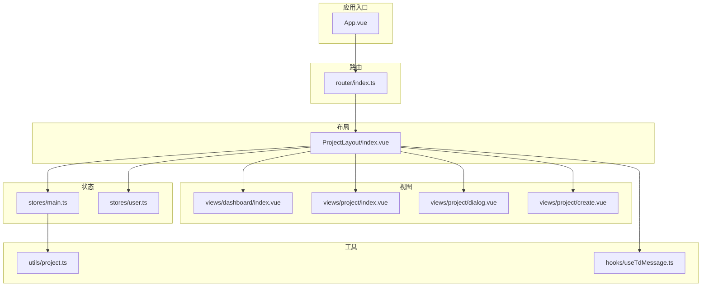
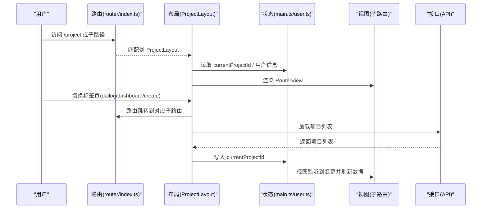
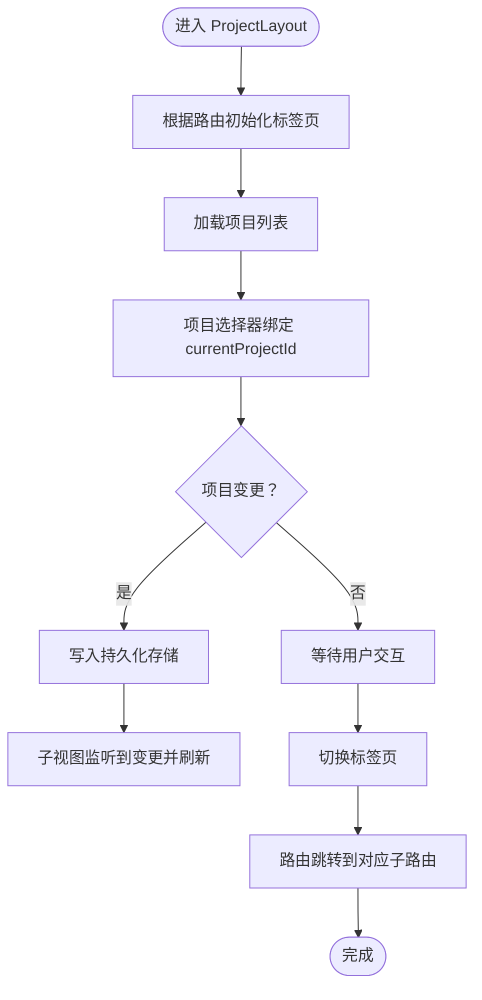
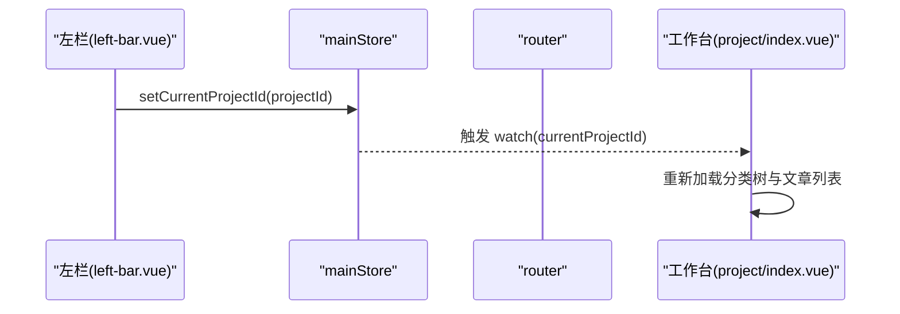
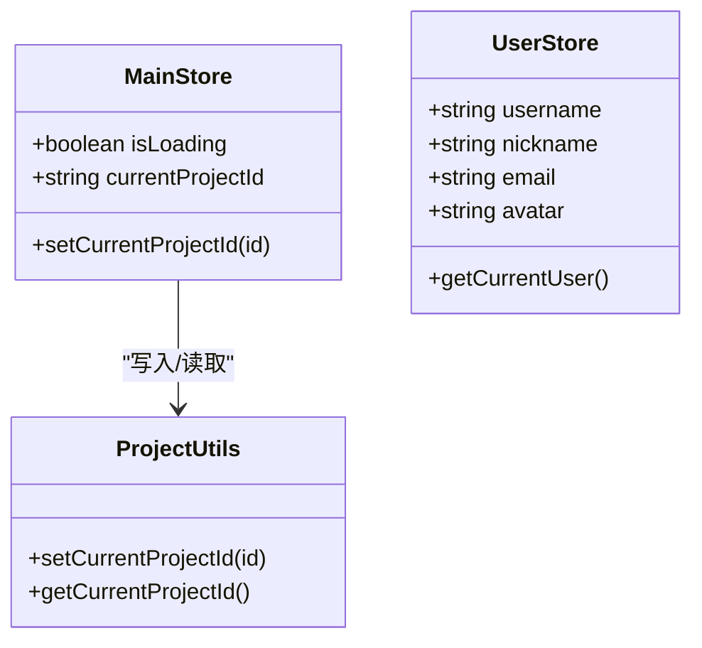
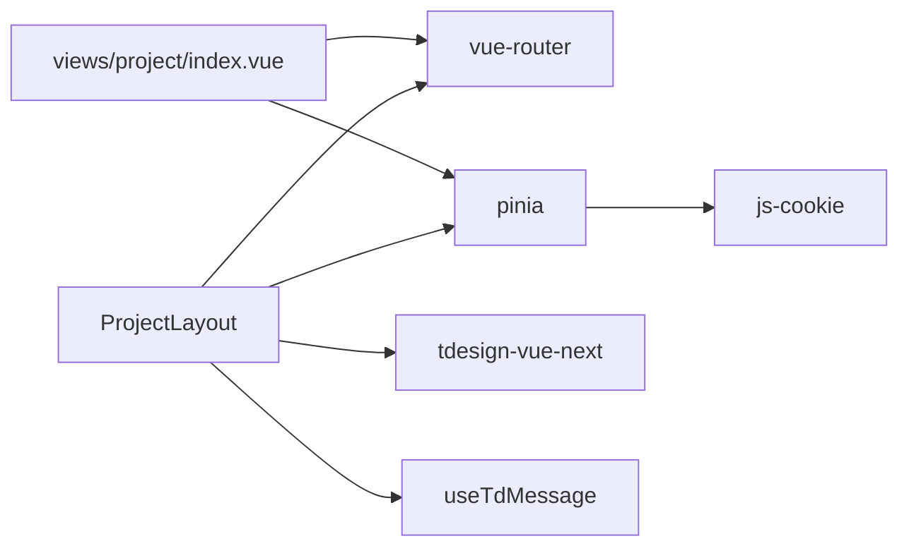

# 布局组件

<cite>
**本文引用的文件**
- [src/layout/ProjectLayout/index.vue](file://src/layout/ProjectLayout/index.vue)
- [src/router/index.ts](file://src/router/index.ts)
- [src/App.vue](file://src/App.vue)
- [src/stores/main.ts](file://src/stores/main.ts)
- [src/stores/user.ts](file://src/stores/user.ts)
- [src/utils/project.ts](file://src/utils/project.ts)
- [src/views/project/index.vue](file://src/views/project/index.vue)
- [src/views/project/dialog.vue](file://src/views/project/dialog.vue)
- [src/views/project/create.vue](file://src/views/project/create.vue)
- [src/views/dashboard/index.vue](file://src/views/dashboard/index.vue)
- [src/views/dashboard/components/left-bar.vue](file://src/views/dashboard/components/left-bar.vue)
- [src/views/dashboard/components/right-list.vue](file://src/views/dashboard/components/right-list.vue)
- [src/hooks/useTdMessage.ts](file://src/hooks/useTdMessage.ts)
- [src/types/projectTypes.d.ts](file://src/types/projectTypes.d.ts)
- [src/style/index.css](file://src/style/index.css)
- [src/style/common.css](file://src/style/common.css)
</cite>

## 目录
1. [简介](#简介)
2. [项目结构](#项目结构)
3. [核心组件](#核心组件)
4. [架构总览](#架构总览)
5. [详细组件分析](#详细组件分析)
6. [依赖关系分析](#依赖关系分析)
7. [性能考量](#性能考量)
8. [故障排查指南](#故障排查指南)
9. [结论](#结论)
10. [附录](#附录)

## 简介
本文件聚焦于项目中的布局组件 ProjectLayout 的设计原理与实现机制，系统阐述其结构设计、响应式适配与导航集成方式；解释其与路由嵌套、状态共享（Pinia Store）、数据传递（API）之间的协作关系；给出可配置项与定制建议；并结合不同页面场景说明使用模式与性能优化策略。

## 项目结构
- 布局层：ProjectLayout 作为项目域的顶层布局，承载头部工具区与 RouterView 内容区。
- 视图层：项目域包含“对话”“工作台”“创建”三个子视图，通过路由嵌套组织。
- 状态层：mainStore 维护当前项目上下文，userStore 维护用户信息。
- 工具层：useTdMessage 提供统一消息提示；project 工具负责持久化当前项目 ID。

图表来源
- [src/App.vue](file://src/App.vue#L1-L12)
- [src/router/index.ts](file://src/router/index.ts#L1-L82)
- [src/layout/ProjectLayout/index.vue](file://src/layout/ProjectLayout/index.vue#L1-L135)
- [src/stores/main.ts](file://src/stores/main.ts#L1-L21)
- [src/stores/user.ts](file://src/stores/user.ts#L1-L29)
- [src/utils/project.ts](file://src/utils/project.ts#L1-L10)
- [src/hooks/useTdMessage.ts](file://src/hooks/useTdMessage.ts#L1-L60)

章节来源
- [src/App.vue](file://src/App.vue#L1-L12)
- [src/router/index.ts](file://src/router/index.ts#L1-L82)

## 核心组件
- ProjectLayout：提供顶部工具条（Logo、项目选择器、标签页切换、用户下拉菜单），以及中间 RouterView 容器，用于承载项目域内的子视图。
- 子视图：
  - 对话视图：项目知识库对话（待实现）
  - 工作台视图：项目内文章与分类管理
  - 创建视图：资源与文章创建入口（待实现）

章节来源
- [src/layout/ProjectLayout/index.vue](file://src/layout/ProjectLayout/index.vue#L1-L135)
- [src/views/project/dialog.vue](file://src/views/project/dialog.vue#L1-L17)
- [src/views/project/index.vue](file://src/views/project/index.vue#L1-L371)
- [src/views/project/create.vue](file://src/views/project/create.vue#L1-L18)

## 架构总览
ProjectLayout 采用“布局 + 路由嵌套 + Pinia 状态”的组合模式：
- 路由层面：以 /project 为父路径，子路由包含对话、工作台、创建三个视图。
- 布局层面：顶部区域集中控制项目上下文与视图切换；内容区通过 RouterView 动态渲染子视图。
- 状态层面：mainStore 维护 currentProjectId 并持久化；userStore 维护用户信息；useTdMessage 提供统一消息反馈。

图表来源
- [src/router/index.ts](file://src/router/index.ts#L40-L73)
- [src/layout/ProjectLayout/index.vue](file://src/layout/ProjectLayout/index.vue#L1-L135)
- [src/stores/main.ts](file://src/stores/main.ts#L1-L21)
- [src/stores/user.ts](file://src/stores/user.ts#L1-L29)

## 详细组件分析

### ProjectLayout 设计与实现
- 结构设计
  - 顶部工具条：左侧包含 Logo、项目选择器；中部为标签页单选按钮组；右侧为用户头像下拉菜单。
  - 内容区：RouterView 占满剩余空间，承载子视图。
- 导航集成
  - 标签页与路由名一一映射：dailog → projectDialog；dashboard → projectDashboard；create → articleCreate。
  - 首次挂载时根据当前路由名初始化标签页状态。
- 状态共享
  - 项目选择器双向绑定 mainStore.currentProjectId；watch 监听变化后写入持久化存储。
  - 用户昵称来自 userStore，登出调用接口后跳转登录页。
- 数据传递
  - 首次挂载加载项目列表；标签页切换触发路由跳转；子视图通过 store 读取当前项目上下文。

图表来源
- [src/layout/ProjectLayout/index.vue](file://src/layout/ProjectLayout/index.vue#L23-L72)
- [src/stores/main.ts](file://src/stores/main.ts#L10-L15)
- [src/utils/project.ts](file://src/utils/project.ts#L3-L5)

章节来源
- [src/layout/ProjectLayout/index.vue](file://src/layout/ProjectLayout/index.vue#L1-L135)
- [src/stores/main.ts](file://src/stores/main.ts#L1-L21)
- [src/stores/user.ts](file://src/stores/user.ts#L1-L29)
- [src/utils/project.ts](file://src/utils/project.ts#L1-L10)

### 路由嵌套与视图协作
- 路由结构
  - 父路由：/project → ProjectLayout
  - 子路由：/project/dialog → 对话视图；/project/dashboard → 工作台视图；/project/create → 创建视图
- 视图协作
  - 工作台视图监听 mainStore.currentProjectId 变化，自动重新加载分类树与文章列表。
  - 左侧仪表盘提供最近项目列表，点击后设置当前项目并跳转工作台。

图表来源
- [src/views/dashboard/components/left-bar.vue](file://src/views/dashboard/components/left-bar.vue#L22-L25)
- [src/stores/main.ts](file://src/stores/main.ts#L10-L15)
- [src/views/project/index.vue](file://src/views/project/index.vue#L40-L43)

章节来源
- [src/router/index.ts](file://src/router/index.ts#L40-L73)
- [src/views/dashboard/components/left-bar.vue](file://src/views/dashboard/components/left-bar.vue#L1-L107)
- [src/views/project/index.vue](file://src/views/project/index.vue#L1-L371)

### 状态共享与数据流
- mainStore
  - 状态：isLoading、currentProjectId
  - 行为：setCurrentProjectId 将值写入 store，并同步写入持久化存储
- userStore
  - 状态：username、nickname、email、avatar
  - 行为：getCurrentUser 从接口拉取并填充用户信息
- 工具函数
  - setCurrentProjectId/getCurrentProjectId 使用 Cookie 进行持久化

图表来源
- [src/stores/main.ts](file://src/stores/main.ts#L1-L21)
- [src/stores/user.ts](file://src/stores/user.ts#L1-L29)
- [src/utils/project.ts](file://src/utils/project.ts#L1-L10)

章节来源
- [src/stores/main.ts](file://src/stores/main.ts#L1-L21)
- [src/stores/user.ts](file://src/stores/user.ts#L1-L29)
- [src/utils/project.ts](file://src/utils/project.ts#L1-L10)

### 导航与响应式适配
- 导航集成
  - 顶部标签页与路由名强绑定，确保 URL 与界面状态一致。
  - 支持从仪表盘直接打开项目工作台，保证上下文一致性。
- 响应式适配
  - 顶部工具条使用 Flex 布局，三段式排列；内容区使用 Flex-1 占满剩余空间。
  - 工作台视图采用 CSS Grid 布局，左右两列自适应分配宽度，支持滚动与分隔线。

章节来源
- [src/layout/ProjectLayout/index.vue](file://src/layout/ProjectLayout/index.vue#L75-L128)
- [src/views/dashboard/index.vue](file://src/views/dashboard/index.vue#L17-L25)

### 配置选项与定制方法
- 项目选择器
  - 类型：TSelect + TOption 列表
  - 数据来源：首次挂载时通过 API 获取项目列表
  - 行为：双向绑定 currentProjectId，变更后写入持久化存储
- 标签页切换
  - 类型：TRadioGroup + TRadioButton
  - 行为：根据选中值 push 对应路由名
- 用户下拉菜单
  - 内容：头像 + 昵称 + 退出登录
  - 行为：点击退出登录调用接口并跳转登录页
- 视图容器
  - RouterView 容器具备固定内边距与圆角背景，适配不同子视图尺寸

章节来源
- [src/layout/ProjectLayout/index.vue](file://src/layout/ProjectLayout/index.vue#L1-L135)
- [src/hooks/useTdMessage.ts](file://src/hooks/useTdMessage.ts#L1-L60)

### 应用场景与使用模式
- 场景一：从仪表盘进入项目工作台
  - 左侧最近项目列表点击后设置当前项目并跳转工作台
- 场景二：在项目工作台内切换视图
  - 顶部标签页在“对话/工作台/创建”之间切换，对应不同子路由
- 场景三：跨项目切换
  - 顶部项目选择器切换后，工作台视图自动刷新数据

章节来源
- [src/views/dashboard/components/left-bar.vue](file://src/views/dashboard/components/left-bar.vue#L22-L25)
- [src/layout/ProjectLayout/index.vue](file://src/layout/ProjectLayout/index.vue#L23-L42)
- [src/views/project/index.vue](file://src/views/project/index.vue#L40-L43)

## 依赖关系分析
- 组件耦合
  - ProjectLayout 依赖路由、Pinia Store、第三方 UI 组件库与消息插件。
  - 子视图依赖 mainStore/currentProjectId 进行数据筛选与刷新。
- 外部依赖
  - tdesign-vue-next：Select/RadioButton/RadioGroup/Popup/Message 等
  - js-cookie：持久化 currentProjectId
  - vue-router：路由跳转与嵌套路由
  - pinia：全局状态管理

图表来源
- [src/layout/ProjectLayout/index.vue](file://src/layout/ProjectLayout/index.vue#L1-L135)
- [src/stores/main.ts](file://src/stores/main.ts#L1-L21)
- [src/stores/user.ts](file://src/stores/user.ts#L1-L29)
- [src/utils/project.ts](file://src/utils/project.ts#L1-L10)
- [src/views/project/index.vue](file://src/views/project/index.vue#L1-L371)

章节来源
- [src/layout/ProjectLayout/index.vue](file://src/layout/ProjectLayout/index.vue#L1-L135)
- [src/router/index.ts](file://src/router/index.ts#L1-L82)
- [src/stores/main.ts](file://src/stores/main.ts#L1-L21)
- [src/stores/user.ts](file://src/stores/user.ts#L1-L29)
- [src/utils/project.ts](file://src/utils/project.ts#L1-L10)
- [src/views/project/index.vue](file://src/views/project/index.vue#L1-L371)

## 性能考量
- 路由懒加载
  - 子视图采用动态导入，减少首屏体积与初次渲染压力。
- 状态持久化
  - 通过 Cookie 保存 currentProjectId，避免每次进入都重新请求或丢失上下文。
- 视图刷新策略
  - 工作台视图仅在 currentProjectId 变更时刷新，降低不必要的请求与重绘。
- UI 组件按需使用
  - 仅引入需要的组件，避免全量引入导致包体膨胀。
- 样式复用
  - 公共样式集中管理，减少重复定义与样式冲突。

章节来源
- [src/router/index.ts](file://src/router/index.ts#L20-L71)
- [src/stores/main.ts](file://src/stores/main.ts#L16-L19)
- [src/views/project/index.vue](file://src/views/project/index.vue#L40-L43)
- [src/style/index.css](file://src/style/index.css#L1-L12)
- [src/style/common.css](file://src/style/common.css#L1-L13)

## 故障排查指南
- 无法切换项目
  - 检查项目选择器是否正确绑定 currentProjectId；确认 watch 是否触发；检查持久化存储是否写入成功。
- 标签页不生效
  - 检查标签页值与路由名映射是否一致；确认 watch 是否执行 push 跳转。
- 登出后未跳转
  - 检查登出接口返回码与路由跳转逻辑；确认消息提示是否正常显示。
- 工作台数据不刷新
  - 检查 mainStore.currentProjectId 是否变更；确认子视图是否监听该状态并重新请求数据。

章节来源
- [src/layout/ProjectLayout/index.vue](file://src/layout/ProjectLayout/index.vue#L44-L51)
- [src/layout/ProjectLayout/index.vue](file://src/layout/ProjectLayout/index.vue#L23-L42)
- [src/stores/main.ts](file://src/stores/main.ts#L10-L15)
- [src/views/project/index.vue](file://src/views/project/index.vue#L40-L43)

## 结论
ProjectLayout 通过清晰的结构划分、与路由的紧密集成以及 Pinia 状态的统一管理，实现了项目域内的上下文一致性与良好用户体验。其标签页驱动的导航模式、项目选择器与 RouterView 的配合，使得在不同页面场景下的使用变得直观且可扩展。结合懒加载、状态持久化与按需 UI 组件的策略，整体具备较好的性能表现与可维护性。

## 附录
- 类型定义参考：项目类型与结果集定义位于 projectTypes.d.ts，便于在布局与视图中统一使用。
- 样式规范：index.css 引入颜色与通用样式，确保布局风格一致。

章节来源
- [src/types/projectTypes.d.ts](file://src/types/projectTypes.d.ts#L1-L27)
- [src/style/index.css](file://src/style/index.css#L1-L12)