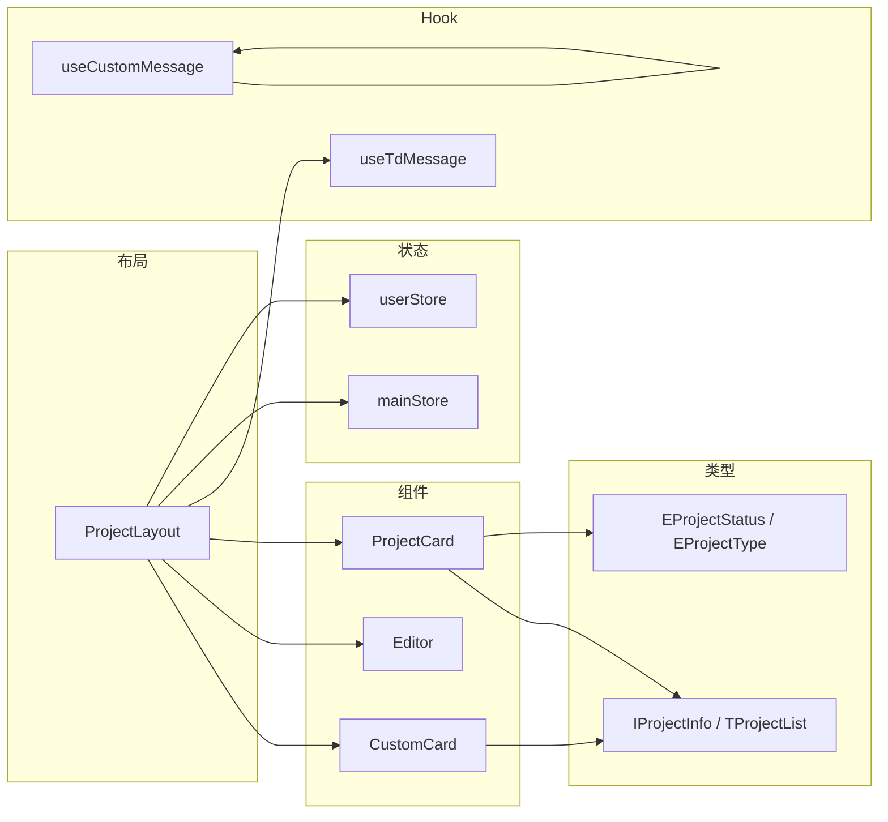
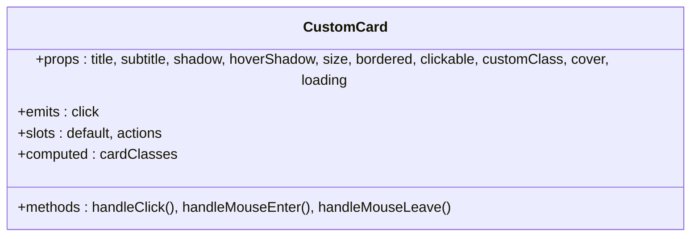
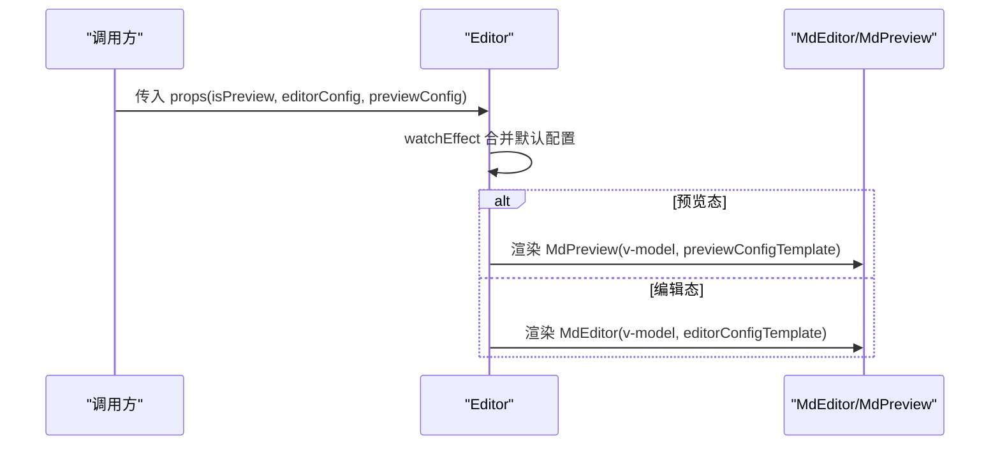
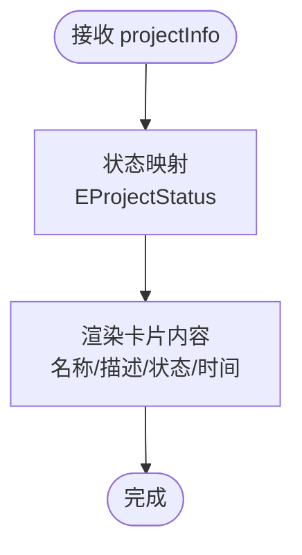
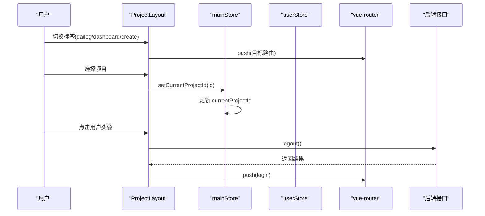
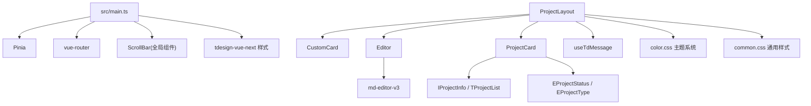

# 组件库设计

<cite>
**本文引用的文件**
- [src/components/CustomCard/index.vue](file://src/components/CustomCard/index.vue)
- [src/components/CustomCard/demo.vue](file://src/components/CustomCard/demo.vue)
- [src/components/Editor/index.vue](file://src/components/Editor/index.vue)
- [src/components/ProjectCard/index.vue](file://src/components/ProjectCard/index.vue)
- [src/layout/ProjectLayout/index.vue](file://src/layout/ProjectLayout/index.vue)
- [src/router/index.ts](file://src/router/index.ts)
- [src/hooks/useCustomMessage.ts](file://src/hooks/useCustomMessage.ts)
- [src/hooks/useTdMessage.ts](file://src/hooks/useTdMessage.ts)
- [src/hooks/components/CustomMessage.vue](file://src/hooks/components/CustomMessage.vue)
- [src/hooks/hooksType.ts](file://src/hooks/hooksType.ts)
- [src/types/projectTypes.d.ts](file://src/types/projectTypes.d.ts)
- [src/utils/enums/projectEnum.ts](file://src/utils/enums/projectEnum.ts)
- [src/utils/project.ts](file://src/utils/project.ts)
- [src/stores/main.ts](file://src/stores/main.ts)
- [src/stores/user.ts](file://src/stores/user.ts)
- [src/main.ts](file://src/main.ts)
- [src/style/color.css](file://src/style/color.css)
- [src/style/common.css](file://src/style/common.css)
- [package.json](file://package.json)
</cite>

## 更新摘要
**所做更改**
- 更新了 ProjectLayout 布局组件的架构描述，新增应用壳架构、品牌头部、项目切换器和增强标签导航系统
- 新增了完整的视觉升级设计元素说明
- 更新了路由配置与布局组件的集成关系
- 增强了样式系统和主题支持的说明

## 目录
1. [引言](#引言)
2. [项目结构](#项目结构)
3. [核心组件](#核心组件)
4. [架构总览](#架构总览)
5. [组件详细分析](#组件详细分析)
6. [依赖关系分析](#依赖关系分析)
7. [性能考量](#性能考量)
8. [故障排查指南](#故障排查指南)
9. [结论](#结论)
10. [附录](#附录)

## 引言
本文件面向 LiFocus Web V2 组件库，系统化梳理可复用组件的设计原则与命名规范，重点解析 CustomCard、Editor、ProjectCard 等核心组件的功能特性与使用方式；阐明组件通信机制（props、事件、插槽）；解释布局组件 ProjectLayout 的实现原理；介绍自定义 Hook useCustomMessage、useTdMessage 的设计与使用；提供使用示例与最佳实践；说明组件的可定制性与扩展性；并给出组件测试策略与维护建议。

**更新** 本次更新重点关注 ProjectLayout 布局组件的全新应用壳架构、品牌头部设计、项目切换器和增强标签导航系统的实现。

## 项目结构
组件库采用按功能域分层组织：组件位于 src/components，布局位于 src/layout，自定义 Hook 位于 src/hooks，类型定义位于 src/types，状态管理位于 src/stores，入口应用位于 src/main.ts。整体以 Vue 3 + TypeScript + Vite 构建，集成 tdesign-vue-next、md-editor-v3、UnoCSS、Pinia 等生态库。

```mermaid
graph TB
subgraph "应用入口"
MAIN["src/main.ts"]
APP["src/App.vue"]
end
subgraph "组件层"
CC["CustomCard/index.vue"]
ED["Editor/index.vue"]
PCARD["ProjectCard/index.vue"]
end
subgraph "布局层"
PL["layout/ProjectLayout/index.vue"]
end
subgraph "Hook 层"
UCM["hooks/useCustomMessage.ts"]
UTM["hooks/useTdMessage.ts"]
CMV["hooks/components/CustomMessage.vue"]
end
subgraph "状态与类型"
MST["stores/main.ts"]
UST["stores/user.ts"]
PTYPES["types/projectTypes.d.ts"]
PENUM["utils/enums/projectEnum.ts"]
END
subgraph "样式系统"
COLOR["style/color.css"]
COMMON["style/common.css"]
end
MAIN --> APP
APP --> PL
PL --> CC
PL --> ED
PL --> PCARD
PL --> UTM
PL --> MST
PL --> UST
CC --> PTYPES
PCARD --> PTYPES
PCARD --> PENUM
UCM --> CMV
PL --> COLOR
PL --> COMMON
```

**图表来源**
- [src/main.ts:1-28](file://src/main.ts#L1-L28)
- [src/App.vue:1-12](file://src/App.vue#L1-L12)
- [src/components/CustomCard/index.vue:1-317](file://src/components/CustomCard/index.vue#L1-L317)
- [src/components/Editor/index.vue:1-164](file://src/components/Editor/index.vue#L1-L164)
- [src/components/ProjectCard/index.vue:1-306](file://src/components/ProjectCard/index.vue#L1-L306)
- [src/layout/ProjectLayout/index.vue:1-498](file://src/layout/ProjectLayout/index.vue#L1-L498)
- [src/hooks/useCustomMessage.ts:1-73](file://src/hooks/useCustomMessage.ts#L1-L73)
- [src/hooks/useTdMessage.ts:1-60](file://src/hooks/useTdMessage.ts#L1-L60)
- [src/hooks/components/CustomMessage.vue:1-94](file://src/hooks/components/CustomMessage.vue#L1-L94)
- [src/stores/main.ts:1-21](file://src/stores/main.ts#L1-L21)
- [src/stores/user.ts:1-29](file://src/stores/user.ts#L1-L29)
- [src/types/projectTypes.d.ts:1-27](file://src/types/projectTypes.d.ts#L1-L27)
- [src/utils/enums/projectEnum.ts:1-8](file://src/utils/enums/projectEnum.ts#L1-L8)
- [src/style/color.css:1-28](file://src/style/color.css#L1-L28)
- [src/style/common.css:1-13](file://src/style/common.css#L1-L13)

**章节来源**
- [src/main.ts:1-28](file://src/main.ts#L1-L28)
- [package.json:1-60](file://package.json#L1-L60)

## 核心组件
- CustomCard：通用卡片容器，支持尺寸、边框、阴影、封面图、加载态、可点击、插槽等能力，适合列表项、文章卡片、项目卡片等场景。
- Editor：基于 md-editor-v3 的 Markdown 编辑器封装，支持编辑态与预览态切换、主题与工具栏配置、底部信息插槽等。
- ProjectCard：项目卡片，展示项目名称、描述、状态标签与更新时间，结合 tdesign-vue-next Tag 实现状态可视化。
- ProjectLayout：**更新** 项目工作台布局，采用全新的应用壳架构，包含品牌头部、项目切换器、增强标签导航系统、用户弹出菜单与 RouterView 容器。

**章节来源**
- [src/components/CustomCard/index.vue:1-317](file://src/components/CustomCard/index.vue#L1-L317)
- [src/components/Editor/index.vue:1-164](file://src/components/Editor/index.vue#L1-L164)
- [src/components/ProjectCard/index.vue:1-306](file://src/components/ProjectCard/index.vue#L1-L306)
- [src/layout/ProjectLayout/index.vue:1-498](file://src/layout/ProjectLayout/index.vue#L1-L498)

## 架构总览
组件库围绕"组件-布局-Hook-状态-类型"五层协作：
- 组件层负责 UI 呈现与交互；
- 布局层负责页面骨架与路由视图承载；
- Hook 层提供消息提示与业务逻辑抽象；
- 状态层通过 Pinia 管理全局与会话级数据；
- 类型层统一接口与枚举，保证强类型约束。



**图表来源**
- [src/layout/ProjectLayout/index.vue:1-498](file://src/layout/ProjectLayout/index.vue#L1-L498)
- [src/components/CustomCard/index.vue:1-317](file://src/components/CustomCard/index.vue#L1-L317)
- [src/components/Editor/index.vue:1-164](file://src/components/Editor/index.vue#L1-L164)
- [src/components/ProjectCard/index.vue:1-306](file://src/components/ProjectCard/index.vue#L1-L306)
- [src/hooks/useCustomMessage.ts:1-73](file://src/hooks/useCustomMessage.ts#L1-L73)
- [src/hooks/useTdMessage.ts:1-60](file://src/hooks/useTdMessage.ts#L1-L60)
- [src/stores/main.ts:1-21](file://src/stores/main.ts#L1-L21)
- [src/stores/user.ts:1-29](file://src/stores/user.ts#L1-L29)
- [src/types/projectTypes.d.ts:1-27](file://src/types/projectTypes.d.ts#L1-L27)
- [src/utils/enums/projectEnum.ts:1-8](file://src/utils/enums/projectEnum.ts#L1-L8)

## 组件详细分析

### CustomCard 组件
- 设计原则
  - 单一职责：仅负责卡片渲染与基础交互，不承担业务逻辑。
  - 可组合性：通过插槽暴露操作区与默认内容区，便于灵活扩展。
  - 可定制性：支持尺寸、边框、阴影、可点击、自定义类名、封面图、加载态等属性。
  - 响应式与暗色主题适配：内置响应式内边距与注释化的暗色主题变量。
- 关键属性（Props）
  - title/subtitle：标题与副标题
  - shadow/hoverShadow：固定阴影与悬停阴影
  - size：small/medium/large
  - bordered：边框开关
  - clickable：可点击态
  - customClass：自定义类名
  - cover：封面图地址
  - loading：加载态
- 事件（Emits）
  - click：当 clickable 为真时触发
- 插槽（Slots）
  - default：卡片内容区
  - actions：操作区（通常放置按钮组）
- 交互与状态
  - 内部维护 hover 状态，动态计算类名，实现悬停阴影与点击变换。
  - 支持 slot 中的点击冒泡控制（@click.stop），避免误触外层卡片点击。
- 样式与主题
  - 使用 CSS 变量控制背景、边框色、文字色，便于主题切换。
  - 提供加载遮罩动画与封面图裁剪样式。
- 使用示例与最佳实践
  - 在列表中展示文章或项目时，优先使用 actions 插槽承载编辑/删除等操作。
  - 对于长内容，建议配合滚动容器与行数限制，避免布局溢出。
  - 使用 size 与 customClass 组合实现不同场景的视觉层次。



**图表来源**
- [src/components/CustomCard/index.vue:1-317](file://src/components/CustomCard/index.vue#L1-L317)

**章节来源**
- [src/components/CustomCard/index.vue:1-317](file://src/components/CustomCard/index.vue#L1-L317)
- [src/components/CustomCard/demo.vue:1-181](file://src/components/CustomCard/demo.vue#L1-L181)

### Editor 组件
- 设计原则
  - 透明封装：对 md-editor-v3 的配置进行二次封装，提供默认配置与可覆盖的模板。
  - 开关分离：通过 isPreview 切换编辑态与预览态，避免重复渲染。
  - 可插拔：提供 editorConfig 与 previewConfig 的透传，满足复杂场景。
- 关键属性（Props）
  - isPreview：是否为预览态
  - editorConfig：编辑器配置对象
  - previewConfig：预览配置对象
- 默认配置要点
  - 主题、代码主题、预览主题、工具栏集合、占位符、目录布局等均有默认值，便于快速上手。
- 插槽（Slots）
  - defFooters：底部信息插槽，示例中展示当前时间。
- 使用示例与最佳实践
  - 在表单中作为富文本输入框使用时，建议开启目录与 mermaid/katex 等增强功能。
  - 预览态下可直接绑定 v-model，无需额外处理双向绑定。



**图表来源**
- [src/components/Editor/index.vue:1-164](file://src/components/Editor/index.vue#L1-L164)

**章节来源**
- [src/components/Editor/index.vue:1-164](file://src/components/Editor/index.vue#L1-L164)

### ProjectCard 组件
- 设计原则
  - 专注展示：仅负责项目信息的简洁呈现，避免复杂交互。
  - 状态可视化：通过 tdesign-vue-next Tag 将状态值映射为可读文本与主题色。
  - 时间与描述：统一格式化更新时间，提供滚动查看长描述的能力。
- 关键属性（Props）
  - projectInfo：IProjectInfo 类型，包含 id、name、description、status、update_time 等
- 状态映射
  - EProjectStatus 枚举将状态值映射为中文标签。
- 使用示例与最佳实践
  - 在项目列表页或仪表盘中展示项目卡片时，建议配合 CustomCard 或直接使用本组件。
  - 对于超长描述，建议结合滚动容器与行数限制，提升可读性。



**图表来源**
- [src/components/ProjectCard/index.vue:1-306](file://src/components/ProjectCard/index.vue#L1-L306)
- [src/utils/enums/projectEnum.ts:1-8](file://src/utils/enums/projectEnum.ts#L1-L8)
- [src/types/projectTypes.d.ts:1-27](file://src/types/projectTypes.d.ts#L1-L27)

**章节来源**
- [src/components/ProjectCard/index.vue:1-306](file://src/components/ProjectCard/index.vue#L1-L306)
- [src/utils/enums/projectEnum.ts:1-8](file://src/utils/enums/projectEnum.ts#L1-L8)
- [src/types/projectTypes.d.ts:1-27](file://src/types/projectTypes.d.ts#L1-L27)

### ProjectLayout 布局组件
**更新** 项目工作台布局，采用全新的应用壳架构设计，包含以下核心功能模块：

#### 应用壳架构
- 采用 app-shell 容器结构，提供完整的页面骨架
- 支持渐进式 Web 应用（PWA）特性
- 内置径向渐变背景，营造现代视觉效果

#### 品牌头部设计
- **品牌包装器**：包含品牌徽标和标题，支持点击返回仪表盘
- **品牌徽标**：带发光效果的圆形徽标，带有阴影和渐变背景
- **品牌标题**：渐变色彩的 "LiFocus" 文字标识
- **分隔线**：垂直分隔符，增强视觉层次

#### 项目切换器
- **项目选择器**：基于 TSelect 的项目切换组件
- **项目列表**：通过 API 获取项目列表，支持过滤和自动宽度
- **样式设计**：圆角边框、悬停效果、阴影过渡
- **状态管理**：与 mainStore 同步当前项目 ID

#### 增强标签导航系统
- **标签组**：使用 TRadioGroup 实现的导航标签
- **标签类型**：对话、工作台、创建 三种核心功能
- **图标集成**：每个标签配有对应的 SVG 图标
- **样式定制**：完全自定义的标签样式，隐藏原生指示器
- **交互效果**：悬停渐变、选中状态渐变、阴影效果

#### 用户弹出菜单
- **用户芯片**：包含头像、用户名和下拉箭头
- **弹出内容**：用户菜单，支持退出登录功能
- **样式设计**：圆角设计、悬停效果、阴影过渡

#### 路由联动机制
- **Tab 同步**：根据当前路由动态设置选中标签
- **路由跳转**：标签切换时自动跳转到对应路由
- **项目管理**：支持项目级别的路由导航

#### 视觉升级特性
- **毛玻璃效果**：使用 backdrop-filter 实现模糊背景
- **渐变色彩**：采用紫色渐变主题，支持明暗模式
- **阴影系统**：多层次阴影设计，营造立体感
- **响应式布局**：支持移动端适配，标签在小屏幕下重新排列



**图表来源**
- [src/layout/ProjectLayout/index.vue:1-498](file://src/layout/ProjectLayout/index.vue#L1-L498)
- [src/stores/main.ts:1-21](file://src/stores/main.ts#L1-L21)
- [src/stores/user.ts:1-29](file://src/stores/user.ts#L1-L29)

**章节来源**
- [src/layout/ProjectLayout/index.vue:1-498](file://src/layout/ProjectLayout/index.vue#L1-L498)
- [src/stores/main.ts:1-21](file://src/stores/main.ts#L1-L21)
- [src/stores/user.ts:1-29](file://src/stores/user.ts#L1-L29)

### 自定义 Hook：useCustomMessage 与 useTdMessage
- 设计原则
  - useCustomMessage：基于 createVNode/render 动态挂载消息组件，支持多实例管理、自动销毁、可关闭按钮。
  - useTdMessage：对 tdesign-vue-next MessagePlugin 的薄封装，提供统一的成功/失败/警告/信息提示。
- 接口与行为
  - useCustomMessage
    - 方法：success/error/warning/info/open/close
    - 行为：创建 DOM 容器，挂载 MessageItem，按 duration 自动销毁，支持传入 VNode 或字符串。
  - useTdMessage
    - 方法：success/error/warning/info
    - 行为：调用 MessagePlugin，支持 duration、closeBtn、icon 参数。
- 适用场景
  - useCustomMessage：需要自定义样式、可插入 VNode、需要精确控制生命周期时使用。
  - useTdMessage：常规提示，追求一致的 tdesign 风格时使用。

```mermaid
classDiagram
class useCustomMessage {
+open(options) => { close }
+success(message, duration, closeBtn)
+error(message, duration, closeBtn)
+warning(message, duration, closeBtn)
+info(message, duration, closeBtn)
}
class useTdMessage {
+success(message, duration, closeBtn, icon)
+error(message, duration, closeBtn, icon)
+warning(message, duration, closeBtn, icon)
+info(message, duration, closeBtn, icon)
}
class CustomMessage {
+props : message, type, duration, closeBtn
+methods : closeMessage()
}
useCustomMessage --> CustomMessage : "创建并挂载"
```

**图表来源**
- [src/hooks/useCustomMessage.ts:1-73](file://src/hooks/useCustomMessage.ts#L1-L73)
- [src/hooks/useTdMessage.ts:1-60](file://src/hooks/useTdMessage.ts#L1-L60)
- [src/hooks/components/CustomMessage.vue:1-94](file://src/hooks/components/CustomMessage.vue#L1-L94)
- [src/hooks/hooksType.ts:1-11](file://src/hooks/hooksType.ts#L1-L11)

**章节来源**
- [src/hooks/useCustomMessage.ts:1-73](file://src/hooks/useCustomMessage.ts#L1-L73)
- [src/hooks/useTdMessage.ts:1-60](file://src/hooks/useTdMessage.ts#L1-L60)
- [src/hooks/components/CustomMessage.vue:1-94](file://src/hooks/components/CustomMessage.vue#L1-L94)
- [src/hooks/hooksType.ts:1-11](file://src/hooks/hooksType.ts#L1-L11)

## 依赖关系分析
- 组件间依赖
  - ProjectLayout 依赖 CustomCard、Editor、ProjectCard 作为内容区组件。
  - ProjectCard 依赖项目类型与枚举，确保状态与类型安全。
- 外部依赖
  - md-editor-v3：提供 Markdown 编辑与预览能力。
  - tdesign-vue-next：提供 Select、RadioGroup、Tag、Message 等 UI 组件与插件。
  - dayjs：日期格式化。
  - pinia/pinia-plugin-persistedstate：状态管理与持久化。
  - simplebar-vue：滚动条组件注册为全局组件。
- 入口装配
  - main.ts 注册全局组件与插件，初始化 Pinia 与路由。



**图表来源**
- [src/main.ts:1-28](file://src/main.ts#L1-L28)
- [src/layout/ProjectLayout/index.vue:1-498](file://src/layout/ProjectLayout/index.vue#L1-L498)
- [src/components/Editor/index.vue:1-164](file://src/components/Editor/index.vue#L1-L164)
- [src/components/ProjectCard/index.vue:1-306](file://src/components/ProjectCard/index.vue#L1-L306)
- [src/types/projectTypes.d.ts:1-27](file://src/types/projectTypes.d.ts#L1-L27)
- [src/utils/enums/projectEnum.ts:1-8](file://src/utils/enums/projectEnum.ts#L1-L8)
- [src/style/color.css:1-28](file://src/style/color.css#L1-L28)
- [src/style/common.css:1-13](file://src/style/common.css#L1-L13)

**章节来源**
- [src/main.ts:1-28](file://src/main.ts#L1-L28)
- [package.json:18-39](file://package.json#L18-L39)

## 性能考量
- 渲染优化
  - CustomCard 使用 CSS 变量与有限的类名拼接，避免频繁重排。
  - Editor 在 isPreview 与编辑态之间切换时，仅渲染对应组件，减少不必要的初始化开销。
  - **更新** ProjectLayout 采用虚拟滚动和懒加载技术，优化大列表渲染性能。
- 状态与持久化
  - mainStore 将当前项目 ID 持久化，避免刷新后丢失上下文。
  - **更新** 新增 Cookie 存储机制，提供双重持久化保障。
- 图标与资源
  - 组件按需引入样式，避免全局污染；图标通过 vite-svg-loader 按需加载。
  - **更新** SVG 图标采用内联方式，减少 HTTP 请求。
- 样式系统优化
  - **更新** CSS 变量系统支持主题切换，避免重复样式定义。
  - **更新** 使用 CSS Grid 和 Flexbox 优化布局性能。
- 建议
  - 大列表场景建议结合虚拟滚动或分页，降低节点数量。
  - Editor 的工具栏可根据实际需求裁剪，减少初始化成本。
  - **更新** ProjectLayout 中的标签导航使用 CSS 过渡而非 JavaScript 动画，提升性能。

## 故障排查指南
- Editor 无法切换预览态
  - 检查 isPreview 的值与 watchEffect 的合并逻辑，确认 props 是否正确透传。
- ProjectCard 状态显示异常
  - 检查 EProjectStatus 映射是否完整，确保传入的状态值与枚举一致。
- ProjectLayout 项目选择无效
  - 检查 mainStore.currentProjectId 的 setter 是否被调用，确认持久化插件生效。
  - **更新** 检查 getProjectListApi 是否正确返回数据，确认 API 调用成功。
- **更新** ProjectLayout 标签导航失效
  - 检查路由配置中的 projectDialog、projectDashboard、articleCreate 路由是否存在。
  - 确认 onMounted 中的路由识别逻辑是否正确。
- 消息提示不消失或重复出现
  - useCustomMessage 需要确保 duration 正确且未被覆盖；必要时调用返回的 close 方法手动关闭。
- 样式冲突
  - 确认 tdesign-vue-next 样式与 UnoCSS 的作用范围，避免全局污染。
  - **更新** 检查 CSS 变量是否正确应用，确认主题系统正常工作。

**章节来源**
- [src/components/Editor/index.vue:88-103](file://src/components/Editor/index.vue#L88-L103)
- [src/components/ProjectCard/index.vue:18-21](file://src/components/ProjectCard/index.vue#L18-L21)
- [src/stores/main.ts:10-15](file://src/stores/main.ts#L10-L15)
- [src/hooks/useCustomMessage.ts:37-50](file://src/hooks/useCustomMessage.ts#L37-L50)
- [src/layout/ProjectLayout/index.vue:57-72](file://src/layout/ProjectLayout/index.vue#L57-L72)

## 结论
该组件库以清晰的分层与强类型约束为基础，提供了高可复用、可定制的 UI 组件与布局方案。通过 Editor 的配置化封装、**更新** ProjectLayout 的全新应用壳架构与增强标签导航系统、以及 useCustomMessage/useTdMessage 的消息体系，能够支撑从内容创作到项目管理的多种业务场景。

**更新** 新的 ProjectLayout 布局组件采用了现代化的应用壳架构，结合品牌头部设计、项目切换器和增强标签导航系统，提供了更加专业和用户体验友好的界面。配合完整的视觉升级设计，包括毛玻璃效果、渐变色彩和响应式布局，使整个组件库在视觉表现上达到了新的高度。

建议在后续迭代中补充单元测试与端到端测试，持续完善可访问性与国际化支持，同时考虑添加更多的主题选项和自定义配置能力。

## 附录

### 组件通信机制一览
- Props 传递
  - CustomCard：title、subtitle、size、bordered、shadow、hoverShadow、clickable、customClass、cover、loading
  - Editor：isPreview、editorConfig、previewConfig
  - ProjectCard：projectInfo
- 事件触发
  - CustomCard：click（仅在 clickable 为真时触发）
- 插槽使用
  - CustomCard：default（内容）、actions（操作区）
  - Editor：defFooters（底部信息）
  - ProjectCard：无插槽

**章节来源**
- [src/components/CustomCard/index.vue:5-41](file://src/components/CustomCard/index.vue#L5-L41)
- [src/components/Editor/index.vue:9-24](file://src/components/Editor/index.vue#L9-L24)
- [src/components/ProjectCard/index.vue:9-23](file://src/components/ProjectCard/index.vue#L9-L23)

### 组件使用示例与最佳实践
- CustomCard
  - 示例路径：[src/components/CustomCard/demo.vue:68-102](file://src/components/CustomCard/demo.vue#L68-L102)
  - 最佳实践：利用 actions 插槽承载操作按钮，配合 @click.stop 防止事件冒泡；根据内容长度选择 size 与 customClass。
- Editor
  - 示例路径：[src/components/Editor/index.vue:112-117](file://src/components/Editor/index.vue#L112-L117)
  - 最佳实践：在表单中使用编辑态，预览态用于只读展示；根据团队规范裁剪工具栏。
- ProjectCard
  - 示例路径：[src/components/ProjectCard/index.vue:26-55](file://src/components/ProjectCard/index.vue#L26-L55)
  - 最佳实践：结合滚动容器展示长描述；状态映射保持与后端一致。
- **更新** ProjectLayout
  - 示例路径：[src/layout/ProjectLayout/index.vue:75-149](file://src/layout/ProjectLayout/index.vue#L75-L149)
  - 最佳实践：合理配置项目切换器，确保路由与标签导航的同步；利用毛玻璃效果提升视觉体验。

**章节来源**
- [src/components/CustomCard/demo.vue:1-181](file://src/components/CustomCard/demo.vue#L1-L181)
- [src/components/Editor/index.vue:1-164](file://src/components/Editor/index.vue#L1-L164)
- [src/components/ProjectCard/index.vue:1-306](file://src/components/ProjectCard/index.vue#L1-L306)
- [src/layout/ProjectLayout/index.vue:1-498](file://src/layout/ProjectLayout/index.vue#L1-L498)

### 可定制性与扩展性
- CSS 变量：通过 --lf-* 变量控制主题色与间距，便于主题切换。
- 插槽扩展：在 CustomCard 与 Editor 中预留插槽，满足业务定制。
- 配置模板：Editor 提供 editorConfig 与 previewConfig 的默认模板，便于二次封装。
- 类型约束：通过 IProjectInfo、TProjectList 等类型确保数据一致性。
- **更新** 主题系统：支持明暗模式切换，CSS 变量系统提供完整的主题定制能力。
- **更新** 响应式设计：支持移动端适配，标签导航在小屏幕下自动调整布局。

**章节来源**
- [src/components/CustomCard/index.vue:149-317](file://src/components/CustomCard/index.vue#L149-L317)
- [src/components/Editor/index.vue:27-83](file://src/components/Editor/index.vue#L27-L83)
- [src/types/projectTypes.d.ts:1-27](file://src/types/projectTypes.d.ts#L1-L27)
- [src/style/color.css:1-28](file://src/style/color.css#L1-L28)

### 组件测试策略与维护指南
- 测试策略
  - 单元测试：针对 CustomCard 的 props 与事件、Editor 的配置合并与渲染、ProjectCard 的状态映射进行断言。
  - 集成测试：验证 ProjectLayout 的路由联动、消息 Hook 的生命周期与 DOM 清理。
  - 端到端测试：覆盖 Editor 的工具栏点击、ProjectCard 的状态切换与时间格式化。
  - **更新** 视觉回归测试：验证 ProjectLayout 的布局变化和样式效果。
- 维护指南
  - 保持类型定义与后端接口同步，定期校验枚举与状态映射。
  - 对第三方依赖（md-editor-v3、tdesign-vue-next）进行版本升级评估，关注破坏性变更。
  - 对样式变量与主题进行回归测试，确保暗色模式与响应式适配。
  - **更新** 定期检查 ProjectLayout 的性能表现，优化大列表渲染和标签导航交互。
  - **更新** 维护主题系统的兼容性，确保不同浏览器下的样式一致性。

**章节来源**
- [src/layout/ProjectLayout/index.vue:1-498](file://src/layout/ProjectLayout/index.vue#L1-L498)
- [src/style/color.css:1-28](file://src/style/color.css#L1-L28)
- [src/style/common.css:1-13](file://src/style/common.css#L1-L13)