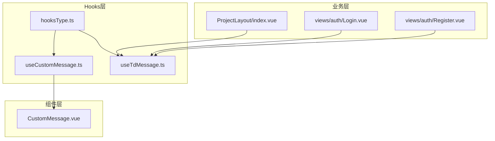
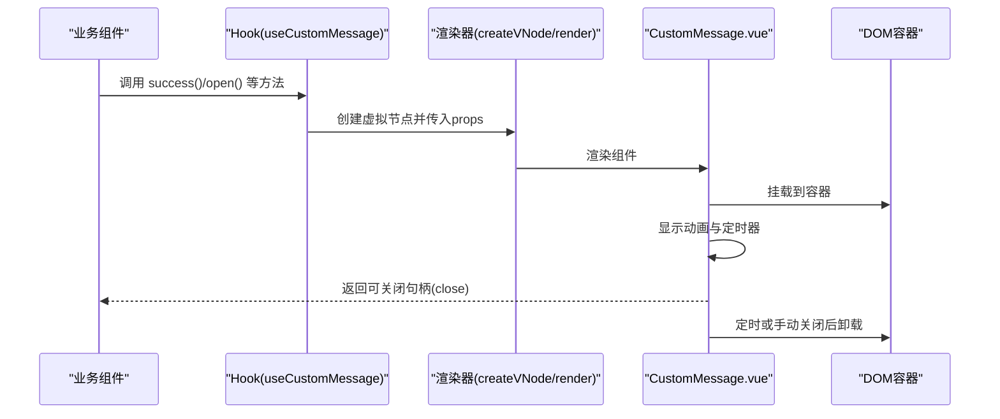
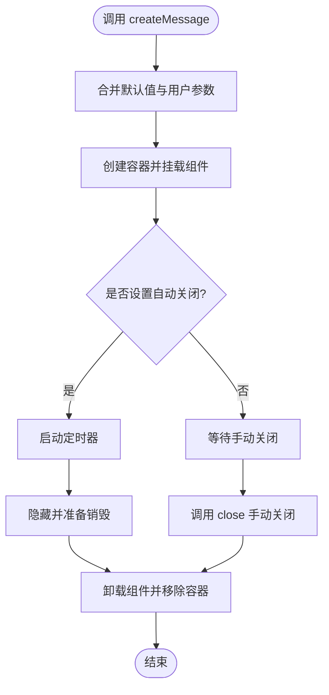
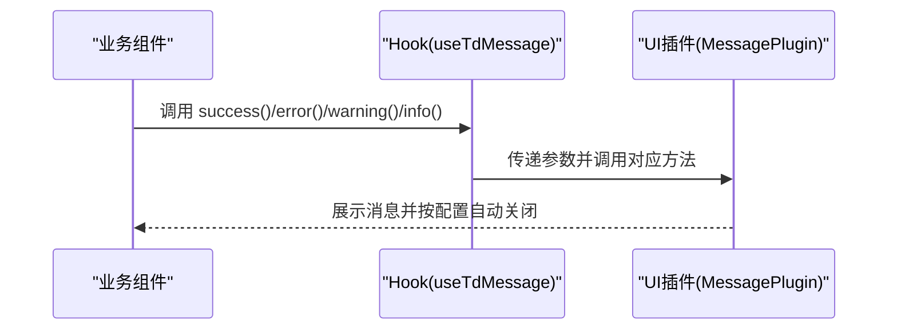
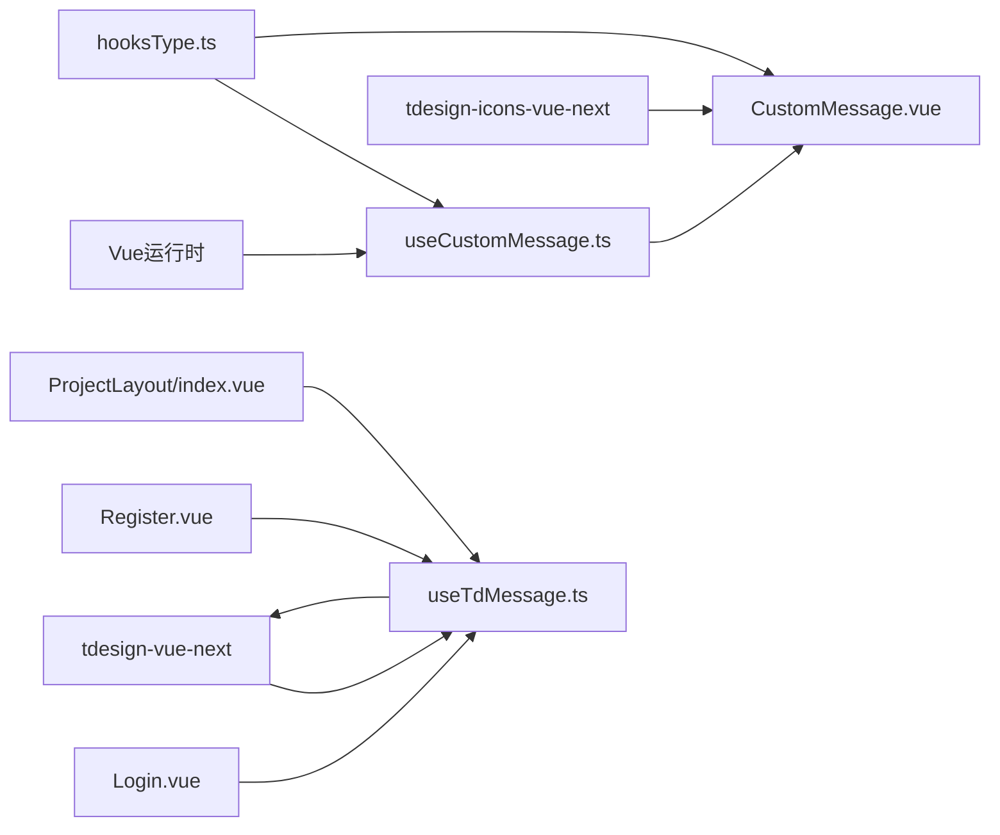

# 自定义Hook

<cite>
**本文引用的文件**
- [useCustomMessage.ts](file://src/hooks/useCustomMessage.ts)
- [useTdMessage.ts](file://src/hooks/useTdMessage.ts)
- [CustomMessage.vue](file://src/hooks/components/CustomMessage.vue)
- [hooksType.ts](file://src/hooks/hooksType.ts)
- [index.vue](file://src/layout/ProjectLayout/index.vue)
- [Login.vue](file://src/views/auth/Login.vue)
- [Register.vue](file://src/views/auth/Register.vue)
- [package.json](file://package.json)
</cite>

## 目录
1. [简介](#简介)
2. [项目结构](#项目结构)
3. [核心组件](#核心组件)
4. [架构总览](#架构总览)
5. [详细组件分析](#详细组件分析)
6. [依赖分析](#依赖分析)
7. [性能考虑](#性能考虑)
8. [故障排查指南](#故障排查指南)
9. [结论](#结论)
10. [附录](#附录)

## 简介
本文件系统化梳理并深入解析项目中的两个自定义Hook：useCustomMessage与useTdMessage。前者通过Vue运行时动态创建DOM节点并渲染自定义消息组件，后者基于第三方UI库提供的消息插件进行统一提示。文档覆盖设计理念、数据结构、参数与返回值、使用示例、依赖注入与副作用处理、可复用性与扩展性、错误与边界处理、以及测试与调试建议，帮助开发者快速理解与高效集成。

## 项目结构
这两个Hook位于src/hooks目录下，并配套一个自定义消息组件CustomMessage.vue。组件类型定义集中在hooksType.ts中，便于跨文件共享。在业务组件中，如登录、注册、项目布局等页面均引入并使用useTdMessage进行统一的消息提示；而useCustomMessage当前未在仓库中直接使用，但其能力与实现已完备。

图表来源
- [useCustomMessage.ts](file://src/hooks/useCustomMessage.ts#L1-L73)
- [useTdMessage.ts](file://src/hooks/useTdMessage.ts#L1-L60)
- [CustomMessage.vue](file://src/hooks/components/CustomMessage.vue#L1-L94)
- [hooksType.ts](file://src/hooks/hooksType.ts#L1-L11)
- [index.vue](file://src/layout/ProjectLayout/index.vue#L1-L135)
- [Login.vue](file://src/views/auth/Login.vue#L1-L138)
- [Register.vue](file://src/views/auth/Register.vue#L1-L137)

章节来源
- [useCustomMessage.ts](file://src/hooks/useCustomMessage.ts#L1-L73)
- [useTdMessage.ts](file://src/hooks/useTdMessage.ts#L1-L60)
- [CustomMessage.vue](file://src/hooks/components/CustomMessage.vue#L1-L94)
- [hooksType.ts](file://src/hooks/hooksType.ts#L1-L11)
- [index.vue](file://src/layout/ProjectLayout/index.vue#L1-L135)
- [Login.vue](file://src/views/auth/Login.vue#L1-L138)
- [Register.vue](file://src/views/auth/Register.vue#L1-L137)

## 核心组件
- useCustomMessage：提供动态创建消息实例的能力，支持多种类型提示、可选关闭按钮、可配置持续时间，并返回可手动关闭的句柄。内部通过Vue运行时创建虚拟节点并挂载到目标容器，具备自动清理与手动清理能力。
- useTdMessage：封装第三方UI库的消息插件，提供统一的成功、错误、警告、信息提示方法，参数与行为与UI库一致，便于快速替换与统一风格。
- CustomMessage.vue：作为useCustomMessage的渲染载体，负责动画过渡、可见性控制、定时器管理与关闭按钮交互。
- hooksType.ts：集中定义消息选项接口，确保类型安全与跨文件一致性。

章节来源
- [useCustomMessage.ts](file://src/hooks/useCustomMessage.ts#L9-L72)
- [useTdMessage.ts](file://src/hooks/useTdMessage.ts#L4-L59)
- [CustomMessage.vue](file://src/hooks/components/CustomMessage.vue#L1-L94)
- [hooksType.ts](file://src/hooks/hooksType.ts#L3-L8)

## 架构总览
两个Hook分别代表两种消息提示策略：
- 自定义渲染策略：useCustomMessage通过createVNode/render在指定容器内动态挂载组件，适合需要完全自定义样式与交互的场景。
- 插件策略：useTdMessage直接调用第三方UI库的消息插件，适合追求一致视觉与交互体验的场景。

图表来源
- [useCustomMessage.ts](file://src/hooks/useCustomMessage.ts#L12-L57)
- [CustomMessage.vue](file://src/hooks/components/CustomMessage.vue#L16-L34)

章节来源
- [useCustomMessage.ts](file://src/hooks/useCustomMessage.ts#L9-L72)
- [CustomMessage.vue](file://src/hooks/components/CustomMessage.vue#L1-L94)

## 详细组件分析

### useCustomMessage Hook 分析
- 设计思路
  - 通过Vue运行时API动态创建并挂载消息组件，实现与业务组件解耦的消息展示。
  - 提供便捷方法(success/error/warning/info)与通用方法(open)，统一参数格式。
  - 支持手动关闭与自动关闭，自动关闭包含额外延时以保证动画完成。
- 数据结构与复杂度
  - 内部使用Map维护消息实例ID与销毁函数映射，便于手动关闭。查找/删除均为O(1)。
  - props合并采用浅拷贝合并，默认值与用户传参结合，避免重复属性定义错误。
- 参数与返回值
  - 参数：MessageOptions（message、type、duration、closeBtn），可选elRef指定挂载容器。
  - 返回：对象包含close方法，用于手动关闭该消息实例。
- 副作用与生命周期
  - 在onMounted时显示消息并在duration到期后隐藏；在onBeforeUnmount时清理定时器。
  - 自动销毁通过setTimeout触发，销毁时移除DOM节点并从Map中删除。
- 可复用性与扩展性
  - 通过elRef可将消息挂载到任意容器，便于在模态框、侧边栏等局部区域展示。
  - 可扩展更多类型与交互，例如点击跳转、二次确认等。
- 错误处理与边界情况
  - 当duration为非正值时，不设置自动销毁，需手动关闭。
  - 多实例管理：通过唯一ID与Map避免重复引用与内存泄漏。
  - 关闭按钮交互：点击关闭会清除定时器并隐藏消息。
- 使用示例与集成
  - 在业务组件中引入并调用，例如在登录成功后展示成功消息，在异常时展示错误消息。
  - 若需自定义内容（如带链接的VNode），可传入VNode对象，组件会根据类型选择渲染方式。

图表来源
- [useCustomMessage.ts](file://src/hooks/useCustomMessage.ts#L12-L57)
- [CustomMessage.vue](file://src/hooks/components/CustomMessage.vue#L16-L34)

章节来源
- [useCustomMessage.ts](file://src/hooks/useCustomMessage.ts#L9-L72)
- [hooksType.ts](file://src/hooks/hooksType.ts#L3-L8)
- [CustomMessage.vue](file://src/hooks/components/CustomMessage.vue#L1-L94)

### useTdMessage Hook 分析
- 设计思路
  - 直接封装第三方UI库的消息插件，提供统一的API入口，减少业务组件对具体UI库的耦合。
  - 方法名与参数与UI库保持一致，便于迁移与替换。
- 参数与返回值
  - 参数：message（字符串或TNode）、duration（毫秒）、closeBtn（是否显示关闭按钮）、icon（是否显示图标）。
  - 返回：无显式返回值，通过插件内部管理消息队列与展示。
- 集成与使用
  - 在业务组件中引入useTdMessage，调用success/error/warning/info即可展示对应类型消息。
  - 项目中多处页面已使用该Hook，如登录、注册、项目布局等。
- 可复用性与扩展性
  - 通过统一Hook抽象，可在不修改业务逻辑的情况下切换消息展示方案。
  - 可进一步封装为全局消息服务，提供更丰富的上下文与拦截能力。

图表来源
- [useTdMessage.ts](file://src/hooks/useTdMessage.ts#L4-L59)

章节来源
- [useTdMessage.ts](file://src/hooks/useTdMessage.ts#L1-L60)
- [index.vue](file://src/layout/ProjectLayout/index.vue#L11-L19)
- [Login.vue](file://src/views/auth/Login.vue#L19-L20)
- [Register.vue](file://src/views/auth/Register.vue#L13)

### 组件类型定义 hooksType.ts
- MessageOptions接口定义了消息的基本属性：message（字符串或VNode）、type（四种类型）、duration（可选）、closeBtn（可选）。
- 通过集中定义，确保useCustomMessage与CustomMessage.vue在类型层面保持一致，降低耦合与错误风险。

章节来源
- [hooksType.ts](file://src/hooks/hooksType.ts#L3-L8)

### 自定义消息组件 CustomMessage.vue
- 功能特性
  - 支持字符串与VNode两种消息内容，自动判断渲染方式。
  - 提供过渡动画与关闭按钮交互。
  - 基于生命周期钩子管理显示与定时器。
- 参数与行为
  - 接收MessageOptions作为props，根据type应用不同样式类。
  - duration为正数时自动隐藏，点击关闭按钮也可立即隐藏。
- 性能与可维护性
  - 使用computed判断VNode类型，避免不必要的分支判断。
  - 在onBeforeUnmount中清理定时器，防止内存泄漏。

章节来源
- [CustomMessage.vue](file://src/hooks/components/CustomMessage.vue#L1-L94)

## 依赖分析
- 第三方依赖
  - Vue运行时：createVNode、render用于动态挂载组件。
  - tdesign-vue-next：提供消息插件与图标组件。
  - tdesign-icons-vue-next：提供关闭图标。
- 文件间依赖
  - useCustomMessage依赖hooksType与CustomMessage.vue。
  - useTdMessage依赖tdesign-vue-next的MessagePlugin。
  - 业务组件通过useTdMessage统一调用消息提示。

图表来源
- [useCustomMessage.ts](file://src/hooks/useCustomMessage.ts#L1-L5)
- [useTdMessage.ts](file://src/hooks/useTdMessage.ts#L1-L2)
- [CustomMessage.vue](file://src/hooks/components/CustomMessage.vue#L1-L5)
- [hooksType.ts](file://src/hooks/hooksType.ts#L1-L11)
- [Login.vue](file://src/views/auth/Login.vue#L1-L13)
- [Register.vue](file://src/views/auth/Register.vue#L1-L13)
- [index.vue](file://src/layout/ProjectLayout/index.vue#L1-L19)

章节来源
- [package.json](file://package.json#L18-L38)
- [useCustomMessage.ts](file://src/hooks/useCustomMessage.ts#L1-L5)
- [useTdMessage.ts](file://src/hooks/useTdMessage.ts#L1-L2)
- [CustomMessage.vue](file://src/hooks/components/CustomMessage.vue#L1-L5)
- [hooksType.ts](file://src/hooks/hooksType.ts#L1-L11)
- [Login.vue](file://src/views/auth/Login.vue#L1-L13)
- [Register.vue](file://src/views/auth/Register.vue#L1-L13)
- [index.vue](file://src/layout/ProjectLayout/index.vue#L1-L19)

## 性能考虑
- useCustomMessage
  - 动态创建与卸载DOM节点会产生一定开销，建议在高频调用场景下控制消息数量与持续时间。
  - 通过Map管理实例，避免重复引用导致的内存泄漏。
  - 自动销毁延时（+300ms）确保动画完成后再卸载，提升用户体验。
- useTdMessage
  - 依赖UI库插件，通常具备良好的性能与内存管理策略。
  - 建议统一配置默认参数，减少重复计算与渲染。
- 共同建议
  - 避免在同一帧内大量触发消息提示。
  - 对于复杂内容（VNode），尽量复用组件实例，减少频繁创建。

[本节为通用性能建议，无需特定文件来源]

## 故障排查指南
- 常见问题
  - 消息未显示：检查elRef是否正确，或确认容器可见性；对于useTdMessage，检查UI库是否正确初始化。
  - 消息无法关闭：确认closeBtn是否开启，或调用返回的close方法；对于useCustomMessage，确保未提前卸载容器。
  - 持续时间异常：确认duration参数是否为正数；负数或0将导致不会自动关闭。
  - 内存泄漏：确保每次调用都正确处理返回的close句柄，或等待自动销毁。
- 调试技巧
  - 在业务组件中打印useMessage返回值，验证close方法可用性。
  - 使用浏览器开发者工具观察DOM节点创建与移除过程，定位挂载容器问题。
  - 对于useCustomMessage，可在destroy函数前后添加日志，确认清理流程。
- 边界情况
  - 多实例同时存在：通过唯一ID区分，避免互相影响。
  - VNode内容为空：组件会回退到文本渲染，确保message有效。
  - 容器被提前移除：useCustomMessage会在销毁时主动移除容器，但仍建议避免在组件卸载前移除挂载点。

章节来源
- [useCustomMessage.ts](file://src/hooks/useCustomMessage.ts#L37-L50)
- [CustomMessage.vue](file://src/hooks/components/CustomMessage.vue#L25-L34)

## 结论
useCustomMessage与useTdMessage分别提供了灵活的自定义渲染与统一插件两种消息提示方案。前者适合需要高度定制的场景，后者适合追求一致性的场景。两者通过hooksType.ts实现类型一致，配合业务组件广泛使用，形成清晰的分层与职责划分。建议在新功能开发中优先考虑useTdMessage以保持一致性，仅在特殊需求时使用useCustomMessage。

[本节为总结性内容，无需特定文件来源]

## 附录

### 使用示例与集成方法
- 在业务组件中引入并使用
  - 引入useTdMessage并调用相应方法展示消息，如登录成功与失败提示。
  - 示例路径参考：
    - [index.vue](file://src/layout/ProjectLayout/index.vue#L11-L19)
    - [Login.vue](file://src/views/auth/Login.vue#L19-L20)
    - [Register.vue](file://src/views/auth/Register.vue#L13)
- 自定义消息组件的集成
  - 如需自定义样式与交互，可使用useCustomMessage创建消息实例，并传入VNode内容。
  - 示例路径参考：
    - [useCustomMessage.ts](file://src/hooks/useCustomMessage.ts#L9-L72)
    - [CustomMessage.vue](file://src/hooks/components/CustomMessage.vue#L1-L94)

### 测试策略与调试技巧
- 单元测试
  - 对useCustomMessage：模拟createVNode/render调用，验证容器创建、props合并、自动销毁与手动关闭。
  - 对useTdMessage：模拟UI插件调用，验证参数透传与调用次数。
- 集成测试
  - 在业务组件中集成Hook，验证消息展示、关闭按钮、自动关闭与样式类应用。
- 调试技巧
  - 使用浏览器开发者工具观察DOM节点生命周期。
  - 在关键流程（创建、销毁）添加日志，定位异常。
  - 对于useCustomMessage，验证Map中实例数量与销毁函数是否正确清理。

[本节为通用测试与调试建议，无需特定文件来源]